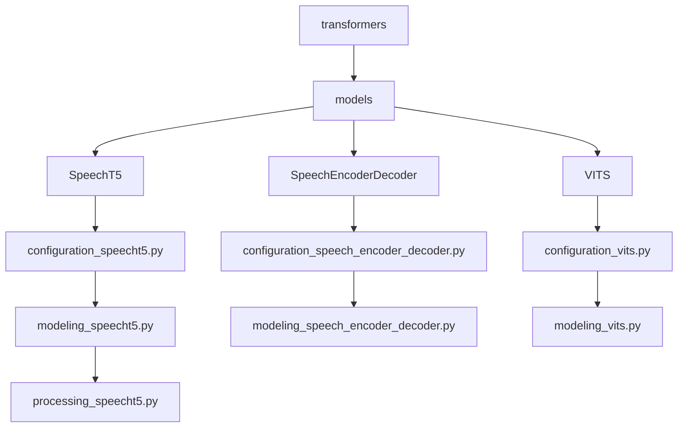
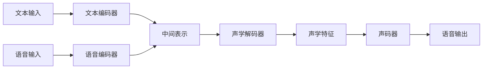
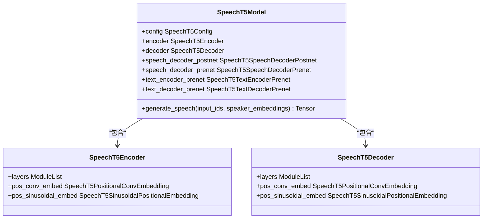
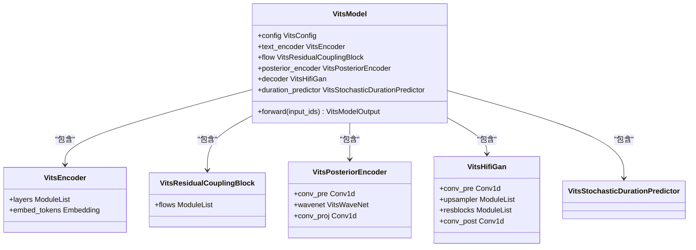
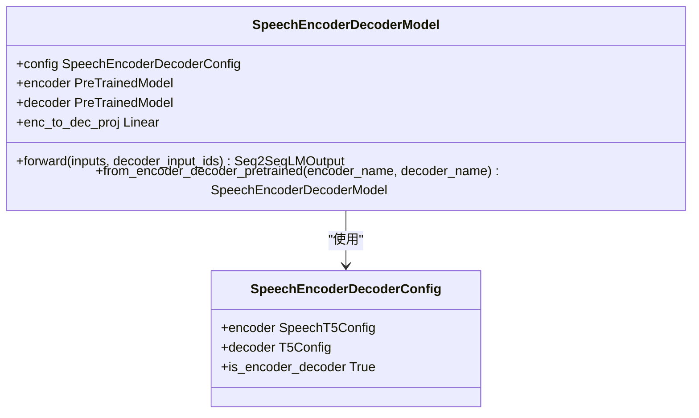
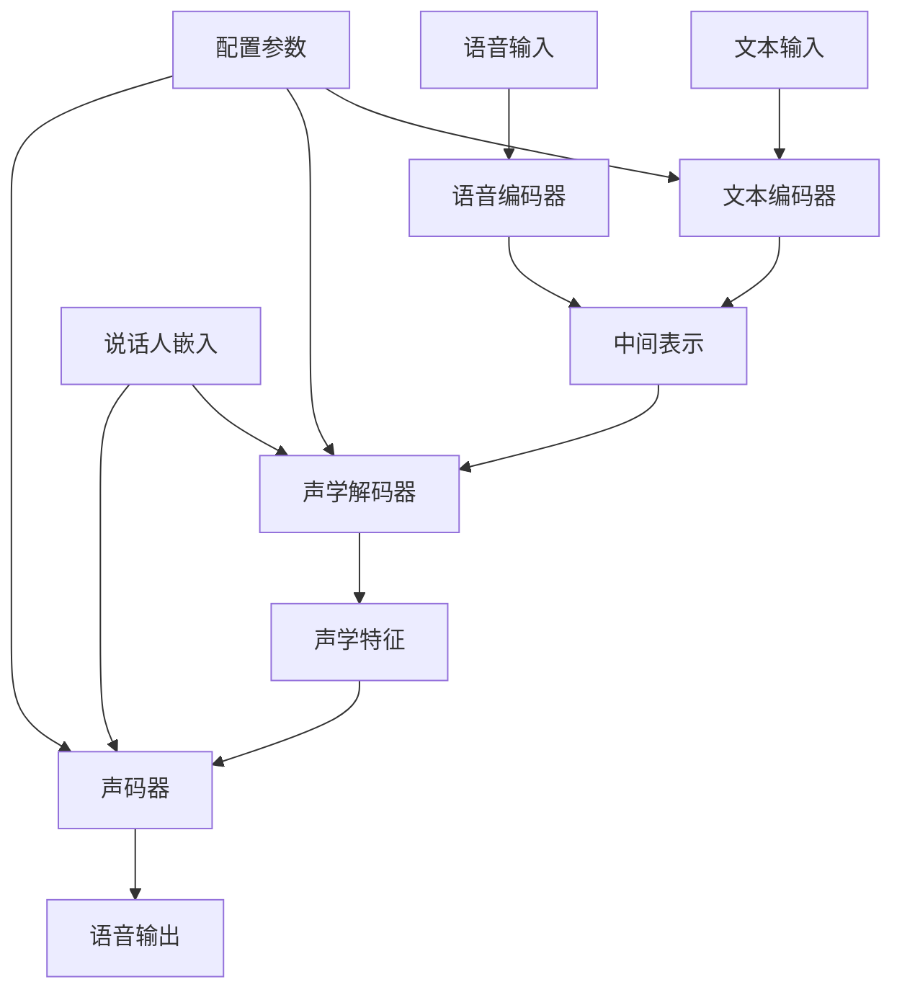

# 语音生成模型

<cite>
**本文档中引用的文件**   
- [modeling_speecht5.py](file://src/transformers/models/speecht5/modeling_speecht5.py)
- [configuration_speecht5.py](file://src/transformers/models/speecht5/configuration_speecht5.py)
- [modeling_speech_encoder_decoder.py](file://src/transformers/models/speech_encoder_decoder/modeling_speech_encoder_decoder.py)
- [modeling_vits.py](file://src/transformers/models/vits/modeling_vits.py)
- [configuration_vits.py](file://src/transformers/models/vits/configuration_vits.py)
- [speecht5.md](file://docs/source/en/model_doc/speecht5.md)
- [vits.md](file://docs/source/en/model_doc/vits.md)
</cite>

## 目录
1. [引言](#引言)
2. [项目结构](#项目结构)
3. [核心组件](#核心组件)
4. [架构概述](#架构概述)
5. [详细组件分析](#详细组件分析)
6. [依赖关系分析](#依赖关系分析)
7. [性能考虑](#性能考虑)
8. [故障排除指南](#故障排除指南)
9. [结论](#结论)

## 引言
本文档全面介绍了语音生成模型，重点分析了SpeechT5、Speech Encoder-Decoder和VITS等模型的架构设计和实现细节。文档详细解释了文本到语音合成、语音转换和语音修复等任务的工作原理，并提供了端到端语音合成的代码示例。同时，文档还探讨了模型超参数对生成语音质量的影响，以及在语音自然度、清晰度和情感表达方面的评估指标。

## 项目结构
Transformers库中的语音生成模型主要分布在`src/transformers/models`目录下，包括SpeechT5、Speech Encoder-Decoder和VITS等模型的实现。每个模型都有其独立的配置文件、模型文件和处理器文件。

**Diagram sources**
- [modeling_speecht5.py](file://src/transformers/models/speecht5/modeling_speecht5.py)
- [modeling_speech_encoder_decoder.py](file://src/transformers/models/speech_encoder_decoder/modeling_speech_encoder_decoder.py)
- [modeling_vits.py](file://src/transformers/models/vits/modeling_vits.py)

**Section sources**
- [modeling_speecht5.py](file://src/transformers/models/speecht5/modeling_speecht5.py)
- [modeling_speech_encoder_decoder.py](file://src/transformers/models/speech_encoder_decoder/modeling_speech_encoder_decoder.py)
- [modeling_vits.py](file://src/transformers/models/vits/modeling_vits.py)

## 核心组件
语音生成模型的核心组件包括文本编码器、声学解码器、声码器和各种预处理器。这些组件协同工作，将文本输入转换为高质量的语音输出。

**Section sources**
- [modeling_speecht5.py](file://src/transformers/models/speecht5/modeling_speecht5.py#L2556-L2591)
- [modeling_vits.py](file://src/transformers/models/vits/modeling_vits.py#L1294-L1317)

## 架构概述
语音生成模型采用编码器-解码器架构，其中编码器将输入文本或语音特征编码为中间表示，解码器将这些表示转换为声学特征，最后通过声码器生成最终的语音波形。

**Diagram sources**
- [modeling_speecht5.py](file://src/transformers/models/speecht5/modeling_speecht5.py)
- [modeling_vits.py](file://src/transformers/models/vits/modeling_vits.py)

## 详细组件分析

### SpeechT5模型分析
SpeechT5是一种统一模态的编码器-解码器预训练框架，用于口语处理。它通过共享的编码器-解码器网络和模态特定的预/后处理网络来实现语音和文本的统一表示学习。

**Diagram sources**
- [modeling_speecht5.py](file://src/transformers/models/speecht5/modeling_speecht5.py)
- [configuration_speecht5.py](file://src/transformers/models/speecht5/configuration_speecht5.py)

### VITS模型分析
VITS（Variational Inference with adversarial learning for end-to-end Text-to-Speech）是一种端到端的语音合成模型，它结合了变分推理、对抗学习和归一化流，能够直接从文本生成自然且富有表现力的语音。

**Diagram sources**
- [modeling_vits.py](file://src/transformers/models/vits/modeling_vits.py)
- [configuration_vits.py](file://src/transformers/models/vits/configuration_vits.py)

### Speech Encoder-Decoder模型分析
Speech Encoder-Decoder模型是一种通用的架构，它将一个预训练的语音编码器与一个预训练的文本解码器结合，用于实现语音到文本的转换任务。

**Diagram sources**
- [modeling_speech_encoder_decoder.py](file://src/transformers/models/speech_encoder_decoder/modeling_speech_encoder_decoder.py)
- [configuration_speech_encoder_decoder.py](file://src/transformers/models/speech_encoder_decoder/configuration_speech_encoder_decoder.py)

## 依赖关系分析
语音生成模型的各个组件之间存在复杂的依赖关系，这些关系确保了模型能够有效地处理从文本到语音的转换过程。

**Diagram sources**
- [modeling_speecht5.py](file://src/transformers/models/speecht5/modeling_speecht5.py)
- [modeling_vits.py](file://src/transformers/models/vits/modeling_vits.py)
- [modeling_speech_encoder_decoder.py](file://src/transformers/models/speech_encoder_decoder/modeling_speech_encoder_decoder.py)

## 性能考虑
语音生成模型的性能受到多种因素的影响，包括采样率、频谱图分辨率和声码器配置等。这些超参数的选择直接影响生成语音的质量和自然度。

**Section sources**
- [configuration_speecht5.py](file://src/transformers/models/speecht5/configuration_speecht5.py#L293-L316)
- [configuration_vits.py](file://src/transformers/models/vits/configuration_vits.py#L100-L150)

## 故障排除指南
在使用语音生成模型时，可能会遇到各种问题，如生成语音质量不佳、模型训练不稳定等。这些问题通常与超参数设置、数据预处理或模型架构有关。

**Section sources**
- [test_modeling_speecht5.py](file://tests/models/speecht5/test_modeling_speecht5.py#L1121-L1166)
- [test_modeling_vits.py](file://tests/models/vits/test_modeling_vits.py#L378-L410)

## 结论
本文档详细介绍了SpeechT5、Speech Encoder-Decoder和VITS等语音生成模型的架构设计和实现细节。这些模型通过先进的深度学习技术，实现了高质量的文本到语音合成、语音转换和语音修复等功能。未来的研究可以进一步优化这些模型，提高生成语音的自然度和表现力。