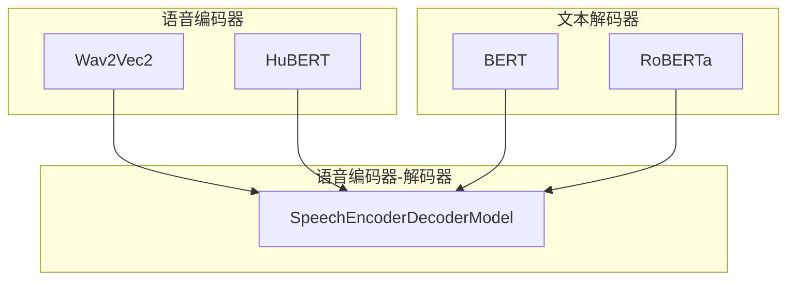
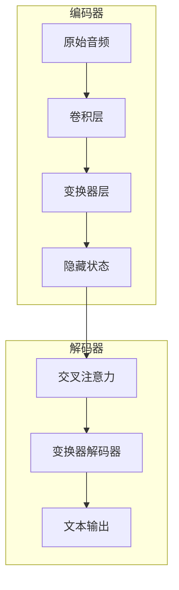
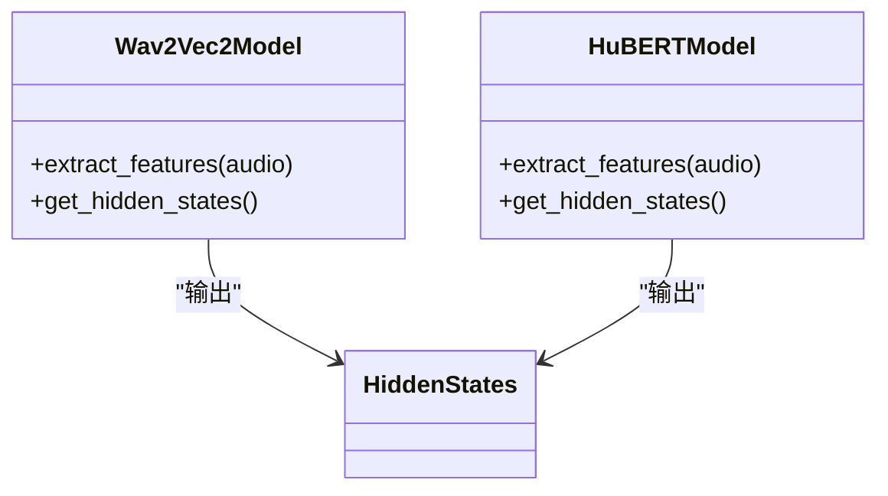
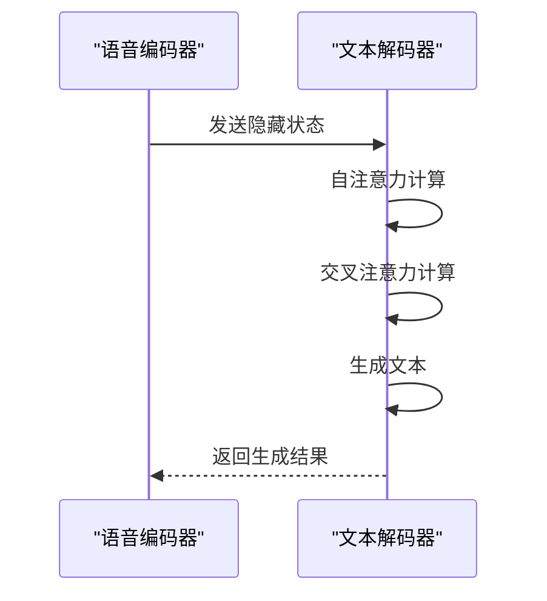
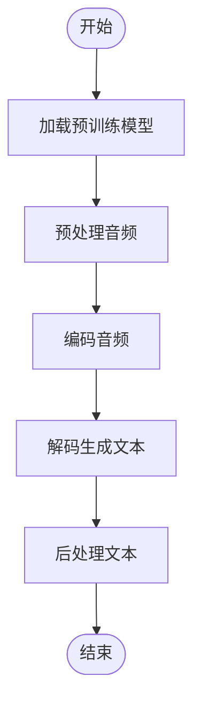
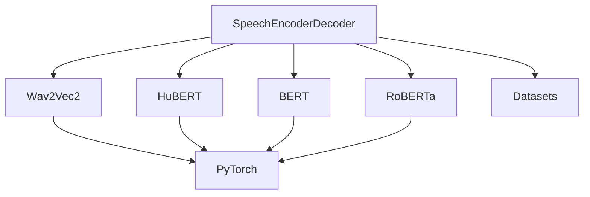

# 语音编码器-解码器模型

<cite>
**本文档中引用的文件**  
- [modeling_speech_encoder_decoder.py](file://src/transformers/models/speech_encoder_decoder/modeling_speech_encoder_decoder.py)
- [configuration_speech_encoder_decoder.py](file://src/transformers/models/speech_encoder_decoder/configuration_speech_encoder_decoder.py)
- [modeling_wav2vec2.py](file://src/transformers/models/wav2vec2/modeling_wav2vec2.py)
- [modeling_hubert.py](file://src/transformers/models/hubert/modeling_hubert.py)
- [modeling_auto.py](file://src/transformers/models/auto/modeling_auto.py)
- [automatic_speech_recognition.py](file://src/transformers/pipelines/automatic_speech_recognition.py)
- [run_speech_recognition_seq2seq.py](file://examples/pytorch/speech-recognition/run_speech_recognition_seq2seq.py)
- [README.md](file://examples/pytorch/speech-recognition/README.md)
</cite>

## 目录
1. [简介](#简介)
2. [项目结构](#项目结构)
3. [核心组件](#核心组件)
4. [架构概述](#架构概述)
5. [详细组件分析](#详细组件分析)
6. [依赖分析](#依赖分析)
7. [性能考虑](#性能考虑)
8. [故障排除指南](#故障排除指南)
9. [结论](#结论)

## 简介
语音编码器-解码器架构是一种强大的语音处理系统，它将独立的语音编码器（如Wav2Vec2、HuBERT）与文本解码器（如BERT、RoBERTa）结合，用于语音识别、语音翻译和语音理解等任务。该架构通过编码器将原始音频波形转换为丰富的上下文表示，并由解码器基于这些表示生成文本输出。本文档详细说明了如何使用Hugging Face Transformers库中的AutoModelForSpeechSeq2Seq类来加载和使用预训练的语音编码器-解码器模型，以及如何从零开始训练或微调此类模型。

## 项目结构
语音编码器-解码器模型的实现主要位于`src/transformers/models/speech_encoder_decoder`目录下，包括配置文件、模型定义和相关工具。此外，Wav2Vec2和HuBERT等语音编码器的实现分别位于`src/transformers/models/wav2vec2`和`src/transformers/models/hubert`目录下。这些模块共同构成了一个完整的语音处理系统。

**图表来源**
- [modeling_speech_encoder_decoder.py](file://src/transformers/models/speech_encoder_decoder/modeling_speech_encoder_decoder.py)
- [modeling_wav2vec2.py](file://src/transformers/models/wav2vec2/modeling_wav2vec2.py)
- [modeling_hubert.py](file://src/transformers/models/hubert/modeling_hubert.py)

**章节来源**
- [modeling_speech_encoder_decoder.py](file://src/transformers/models/speech_encoder_decoder/modeling_speech_encoder_decoder.py)
- [README.md](file://examples/pytorch/speech-recognition/README.md)

## 核心组件
语音编码器-解码器模型的核心组件包括语音编码器、文本解码器和连接两者的编码器-解码器框架。语音编码器负责将原始音频波形转换为高维特征表示，而文本解码器则基于这些特征生成文本输出。编码器-解码器框架通过交叉注意力机制将两者连接起来，使得解码器能够关注编码器输出的关键部分。

**章节来源**
- [modeling_speech_encoder_decoder.py](file://src/transformers/models/speech_encoder_decoder/modeling_speech_encoder_decoder.py)
- [modeling_wav2vec2.py](file://src/transformers/models/wav2vec2/modeling_wav2vec2.py)

## 架构概述
语音编码器-解码器架构采用编码器-解码器模式，其中编码器将输入的音频信号转换为一系列隐藏状态，解码器则基于这些隐藏状态生成目标文本。编码器通常使用卷积神经网络（CNN）和变换器（Transformer）来提取音频特征，而解码器则使用变换器来生成文本。这种架构在语音识别、语音翻译和语音理解等任务中表现出色。

**图表来源**
- [modeling_speech_encoder_decoder.py](file://src/transformers/models/speech_encoder_decoder/modeling_speech_encoder_decoder.py)
- [modeling_wav2vec2.py](file://src/transformers/models/wav2vec2/modeling_wav2vec2.py)

## 详细组件分析
### 语音编码器分析
语音编码器如Wav2Vec2和HuBERT通过自监督学习从大量未标注的音频数据中学习有用的特征表示。这些模型首先使用卷积层提取音频的局部特征，然后通过变换器层捕捉长距离依赖关系。最终，编码器输出的隐藏状态可以作为下游任务的输入。

#### 对于对象导向组件：

**图表来源**
- [modeling_wav2vec2.py](file://src/transformers/models/wav2vec2/modeling_wav2vec2.py)
- [modeling_hubert.py](file://src/transformers/models/hubert/modeling_hubert.py)

### 文本解码器分析
文本解码器如BERT和RoBERTa通过变换器架构生成文本。解码器接收编码器输出的隐藏状态，并通过交叉注意力机制关注这些状态的关键部分。解码器还使用自注意力机制来捕捉生成文本中的上下文信息。

#### 对于API/服务组件：

**图表来源**
- [modeling_speech_encoder_decoder.py](file://src/transformers/models/speech_encoder_decoder/modeling_speech_encoder_decoder.py)
- [modeling_wav2vec2.py](file://src/transformers/models/wav2vec2/modeling_wav2vec2.py)

### 复杂逻辑组件分析
语音编码器-解码器模型的复杂逻辑主要体现在训练和推理过程中。在训练阶段，模型通过最小化预测文本与真实文本之间的交叉熵损失来优化参数。在推理阶段，模型使用束搜索（beam search）等解码策略生成高质量的文本输出。

#### 对于复杂逻辑组件：

**图表来源**
- [modeling_speech_encoder_decoder.py](file://src/transformers/models/speech_encoder_decoder/modeling_speech_encoder_decoder.py)
- [run_speech_recognition_seq2seq.py](file://examples/pytorch/speech-recognition/run_speech_recognition_seq2seq.py)

**章节来源**
- [modeling_speech_encoder_decoder.py](file://src/transformers/models/speech_encoder_decoder/modeling_speech_encoder_decoder.py)
- [run_speech_recognition_seq2seq.py](file://examples/pytorch/speech-recognition/run_speech_recognition_seq2seq.py)

## 依赖分析
语音编码器-解码器模型依赖于多个子模块，包括语音编码器、文本解码器、特征提取器和分词器。这些模块通过编码器-解码器框架紧密耦合，形成了一个完整的语音处理系统。此外，模型还依赖于外部库如PyTorch和Hugging Face Datasets来处理数据和执行计算。

**图表来源**
- [modeling_speech_encoder_decoder.py](file://src/transformers/models/speech_encoder_decoder/modeling_speech_encoder_decoder.py)
- [modeling_wav2vec2.py](file://src/transformers/models/wav2vec2/modeling_wav2vec2.py)
- [modeling_hubert.py](file://src/transformers/models/hubert/modeling_hubert.py)

**章节来源**
- [modeling_speech_encoder_decoder.py](file://src/transformers/models/speech_encoder_decoder/modeling_speech_encoder_decoder.py)
- [README.md](file://examples/pytorch/speech-recognition/README.md)

## 性能考虑
在实际应用中，语音编码器-解码器模型的性能受到多种因素的影响，包括模型大小、批处理大小、硬件配置和优化技术。为了提高推理速度，可以采用量化、剪枝和知识蒸馏等技术。此外，还可以通过调整解码器的生成参数（如束大小、长度惩罚）来优化输出质量。

## 故障排除指南
在使用语音编码器-解码器模型时，可能会遇到各种问题，如模型加载失败、推理结果不准确等。以下是一些常见的故障排除方法：
- 确保所有依赖项已正确安装。
- 检查模型配置文件是否正确。
- 验证输入音频的格式和采样率是否符合要求。
- 调整解码器的生成参数以改善输出质量。

**章节来源**
- [automatic_speech_recognition.py](file://src/transformers/pipelines/automatic_speech_recognition.py)
- [run_speech_recognition_seq2seq.py](file://examples/pytorch/speech-recognition/run_speech_recognition_seq2seq.py)

## 结论
语音编码器-解码器架构为语音处理任务提供了一个强大且灵活的框架。通过结合先进的语音编码器和文本解码器，该架构能够在多种应用场景中实现高性能。未来的工作可以进一步探索如何优化模型结构、提高训练效率和扩展到更多语言和领域。