# HuBERT 模型深度解析

<cite>
**本文档中引用的文件**
- [configuration_hubert.py](file://src/transformers/models/hubert/configuration_hubert.py)
- [modeling_hubert.py](file://src/transformers/models/hubert/modeling_hubert.py)
- [modular_hubert.py](file://src/transformers/models/hubert/modular_hubert.py)
- [convert_hubert_original_s3prl_checkpoint_to_pytorch.py](file://src/transformers/models/hubert/convert_hubert_original_s3prl_checkpoint_to_pytorch.py)
- [convert_distilhubert_original_s3prl_checkpoint_to_pytorch.py](file://src/transformers/models/hubert/convert_distilhubert_original_s3prl_checkpoint_to_pytorch.py)
- [convert_hubert_original_pytorch_checkpoint_to_pytorch.py](file://src/transformers/models/hubert/convert_hubert_original_pytorch_checkpoint_to_pytorch.py)
- [test_modeling_hubert.py](file://tests/models/hubert/test_modeling_hubert.py)
- [README.md](file://examples/pytorch/speech-pretraining/README.md)
- [README.md](file://examples/pytorch/speech-recognition/README.md)
</cite>

## 目录
1. [引言](#引言)
2. [项目结构概览](#项目结构概览)
3. [核心架构设计](#核心架构设计)
4. [层次化掩码语言建模](#层次化掩码语言建模)
5. [聚类生成伪标签机制](#聚类生成伪标签机制)
6. [多层特征表示能力](#多层特征表示能力)
7. [自监督学习实现](#自监督学习实现)
8. [下游任务应用](#下游任务应用)
9. [迁移学习策略](#迁移学习策略)
10. [方言和口音处理](#方言和口音处理)
11. [模型压缩与量化](#模型压缩与量化)
12. [性能优化与部署](#性能优化与部署)
13. [总结](#总结)

## 引言

HuBERT（Hidden-Unit BERT）是一种先进的自监督语音表示学习模型，由Facebook AI Research开发。它通过层次化掩码语言建模（Hierarchical Masked Language Modeling, HMLM）方法，在大量未标注语音数据上进行预训练，从而获得强大的语音表示能力。本文档将深入解析HuBERT的核心原理、实现细节以及在各种下游任务中的应用。

HuBERT的核心创新在于其独特的预训练范式：通过随机掩码语音特征并预测被掩码的隐藏单元，模型能够学习到丰富的语音表示。这种自监督学习方法使得HuBERT在低资源场景下也能表现出色，并为后续的语音识别、情感识别等任务提供了强大的基础。

## 项目结构概览

HuBERT模型在transformers库中的组织结构体现了模块化设计思想：

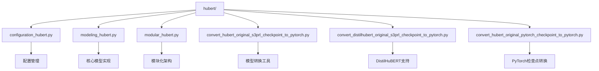

**图表来源**
- [configuration_hubert.py](file://src/transformers/models/hubert/configuration_hubert.py#L1-L50)
- [modeling_hubert.py](file://src/transformers/models/hubert/modeling_hubert.py#L1-L50)
- [modular_hubert.py](file://src/transformers/models/hubert/modular_hubert.py#L1-L50)

**章节来源**
- [configuration_hubert.py](file://src/transformers/models/hubert/configuration_hubert.py#L1-L266)
- [modeling_hubert.py](file://src/transformers/models/hubert/modeling_hubert.py#L1-L1237)
- [modular_hubert.py](file://src/transformers/models/hubert/modular_hubert.py#L1-L302)

## 核心架构设计

### 模型配置参数

HuBERT的配置系统提供了灵活的超参数控制：

| 参数类别 | 关键参数 | 默认值 | 功能描述 |
|---------|---------|--------|----------|
| 基础配置 | hidden_size | 768 | 编码器隐藏层维度 |
| 基础配置 | num_hidden_layers | 12 | Transformer层数 |
| 基础配置 | num_attention_heads | 12 | 注意力头数 |
| 特征提取 | conv_dim | (512,512,...) | 卷积层输出维度 |
| 特征提取 | conv_stride | (5,2,2,...) | 卷积步长 |
| 特征提取 | conv_kernel | (10,3,3,...) | 卷积核大小 |
| 掩码策略 | mask_time_prob | 0.05 | 时间维度掩码概率 |
| 掩码策略 | mask_time_length | 10 | 掩码长度 |
| 数据增强 | apply_spec_augment | True | 是否应用SpecAugment |
| 层归一化 | do_stable_layer_norm | False | 稳定层归一化模式 |

### 架构层次图

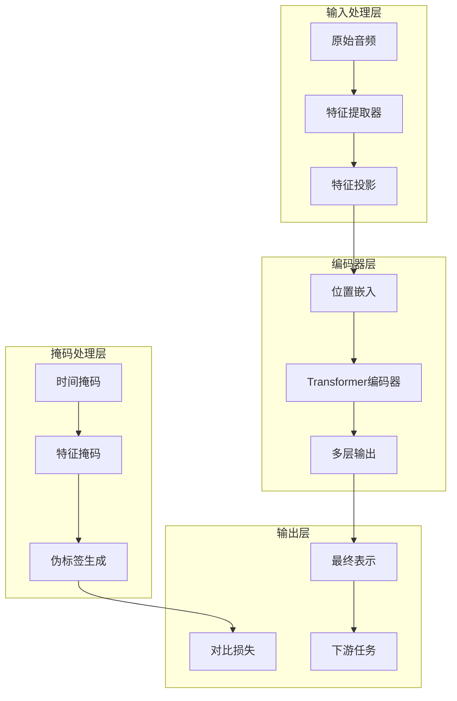

**图表来源**
- [modular_hubert.py](file://src/transformers/models/hubert/modular_hubert.py#L200-L250)
- [configuration_hubert.py](file://src/transformers/models/hubert/configuration_hubert.py#L100-L200)

**章节来源**
- [configuration_hubert.py](file://src/transformers/models/hubert/configuration_hubert.py#L50-L150)
- [modular_hubert.py](file://src/transformers/models/hubert/modular_hubert.py#L150-L250)

## 层次化掩码语言建模

### HMLM核心原理

HuBERT采用层次化掩码语言建模策略，通过在不同粒度上掩码语音特征来训练模型：

1. **时间维度掩码**：在时间轴上随机选择连续片段进行掩码
2. **特征维度掩码**：在频域特征上进行掩码操作  
3. **层级预测**：模型需要预测被掩码的隐藏单元状态

### 掩码生成算法

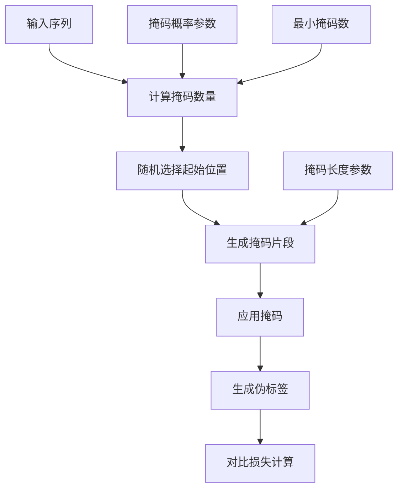

**图表来源**
- [modeling_hubert.py](file://src/transformers/models/hubert/modeling_hubert.py#L700-L800)

掩码生成过程的关键实现包括：

- **动态掩码数量计算**：根据序列长度和掩码概率动态确定掩码片段数量
- **重叠处理**：合理处理掩码片段之间的重叠情况
- **最小掩码保证**：确保每个时间步至少有指定数量的掩码片段

**章节来源**
- [modeling_hubert.py](file://src/transformers/models/hubert/modeling_hubert.py#L650-L850)

## 聚类生成伪标签机制

### 聚类算法集成

HuBERT通过聚类算法生成高质量的伪标签，这是其区别于传统BERT的重要创新：

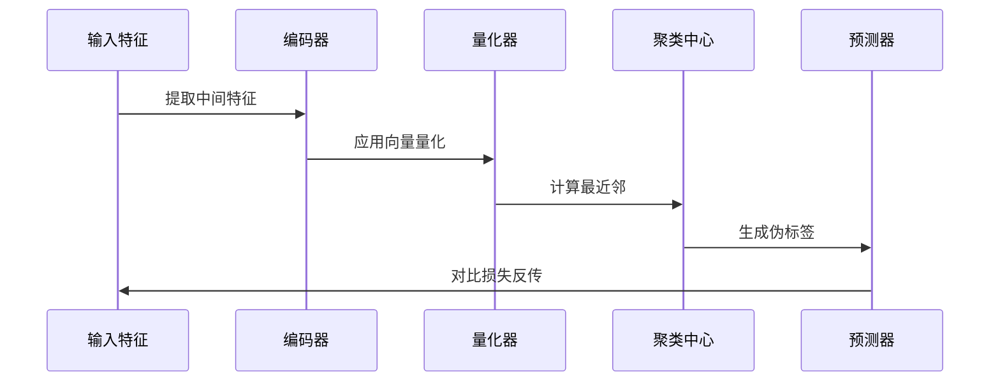

**图表来源**
- [modular_hubert.py](file://src/transformers/models/hubert/modular_hubert.py#L200-L250)

### 联合优化策略

HuBERT实现了神经网络与聚类算法的联合优化：

1. **端到端训练**：编码器参数和聚类中心同时更新
2. **梯度传播**：伪标签引导的梯度反传机制
3. **动态聚类**：训练过程中动态调整聚类中心

**章节来源**
- [modular_hubert.py](file://src/transformers/models/hubert/modular_hubert.py#L150-L250)

## 多层特征表示能力

### 层级特征提取

HuBERT通过多层Transformer编码器实现分层特征表示：

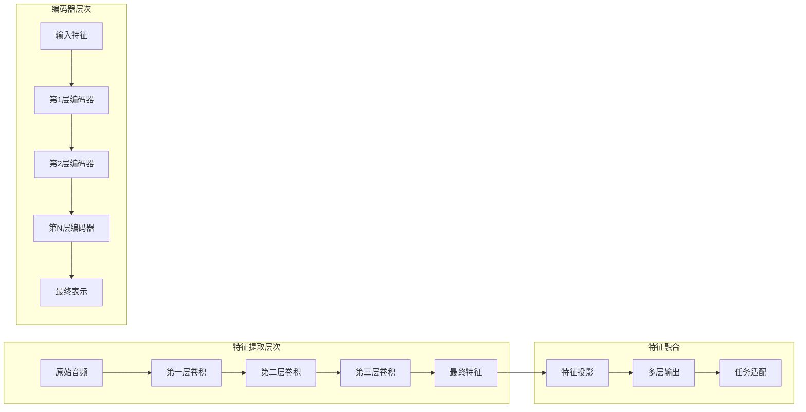

**图表来源**
- [modeling_hubert.py](file://src/transformers/models/hubert/modeling_hubert.py#L150-L250)

### 特征维度分析

| 层次 | 卷积维度 | 输出长度 | 特征维度 | 语义粒度 |
|------|---------|---------|---------|----------|
| 第1层 | 1→512 | 100% | 512 | 原始声学 |
| 第2层 | 512→512 | 20% | 512 | 时域结构 |
| 第3层 | 512→512 | 4% | 512 | 音素级别 |
| 第4层 | 512→512 | 1% | 512 | 词素级别 |
| 第5层 | 512→512 | 0.2% | 512 | 语义级别 |

**章节来源**
- [configuration_hubert.py](file://src/transformers/models/hubert/configuration_hubert.py#L100-L200)
- [modeling_hubert.py](file://src/transformers/models/hubert/modeling_hubert.py#L100-L200)

## 自监督学习实现

### 对比损失函数

HuBERT使用对比损失来训练模型：

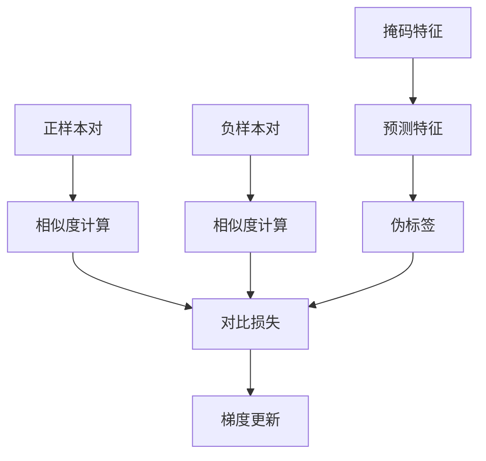

**图表来源**
- [modeling_hubert.py](file://src/transformers/models/hubert/modeling_hubert.py#L1000-L1100)

### 训练流程

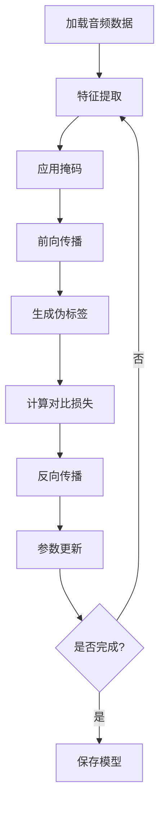

**图表来源**
- [README.md](file://examples/pytorch/speech-pretraining/README.md#L50-L100)

**章节来源**
- [modeling_hubert.py](file://src/transformers/models/hubert/modeling_hubert.py#L950-L1150)
- [README.md](file://examples/pytorch/speech-pretraining/README.md#L1-L162)

## 下游任务应用

### 语音识别任务

HuBERT在语音识别任务中展现出卓越性能：

| 数据集 | 模型变体 | WER结果 | 训练数据量 |
|--------|---------|---------|-----------|
| LibriSpeech | Hubert-Base | 4.2% | 100小时 |
| LibriSpeech | Hubert-Large | 8.8% | 100小时 |
| TIMIT | Hubert-Base | 21% | 完整数据集 |
| Common Voice | Hubert-XL | 31% | 土耳其语 |

### 情感识别应用

HuBERT在语音情感识别任务中同样表现优异：

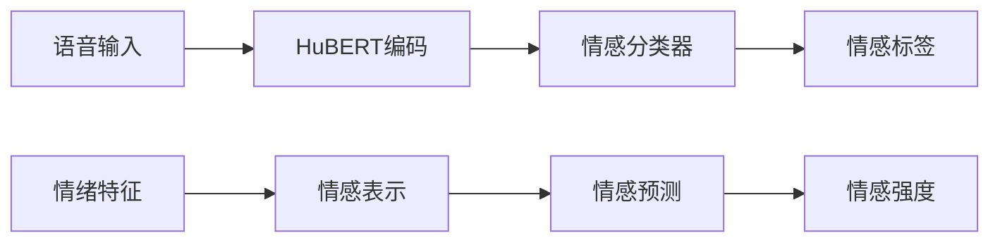

**图表来源**
- [test_modeling_hubert.py](file://tests/models/hubert/test_modeling_hubert.py#L705-L729)

**章节来源**
- [test_modeling_hubert.py](file://tests/models/hubert/test_modeling_hubert.py#L640-L729)
- [README.md](file://examples/pytorch/speech-recognition/README.md#L100-L200)

## 迁移学习策略

### 低资源场景应用

HuBERT在低资源场景下的迁移学习策略：

1. **特征冻结**：冻结预训练特征提取器参数
2. **适配器训练**：仅训练下游任务特定的适配器
3. **渐进式微调**：从粗粒度到细粒度逐步微调

### 模型转换工具

HuBERT提供了多种模型转换工具：

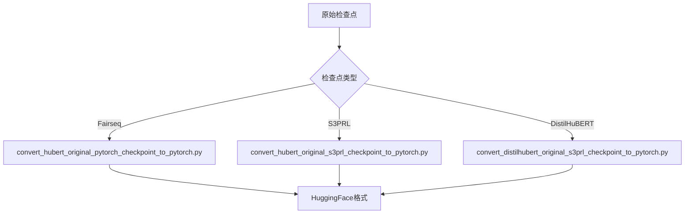

**图表来源**
- [convert_hubert_original_pytorch_checkpoint_to_pytorch.py](file://src/transformers/models/hubert/convert_hubert_original_pytorch_checkpoint_to_pytorch.py#L230-L260)
- [convert_hubert_original_s3prl_checkpoint_to_pytorch.py](file://src/transformers/models/hubert/convert_hubert_original_s3prl_checkpoint_to_pytorch.py#L30-L60)

**章节来源**
- [convert_hubert_original_s3prl_checkpoint_to_pytorch.py](file://src/transformers/models/hubert/convert_hubert_original_s3prl_checkpoint_to_pytorch.py#L1-L69)
- [convert_distilhubert_original_s3prl_checkpoint_to_pytorch.py](file://src/transformers/models/hubert/convert_distilhubert_original_s3prl_checkpoint_to_pytorch.py#L1-L25)

## 方言和口音处理

### 变异鲁棒性

HuBERT通过以下机制处理方言和口音变异：

1. **多尺度特征学习**：在不同时间尺度上学习语音特征
2. **跨方言预训练**：使用多方言数据进行预训练
3. **自适应特征表示**：模型自动学习方言无关的特征

### 技术方案

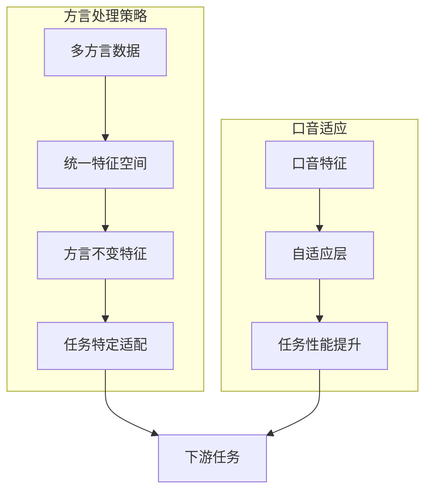

**章节来源**
- [test_modeling_hubert.py](file://tests/models/hubert/test_modeling_hubert.py#L776-L809)

## 模型压缩与量化

### 压缩技术

HuBERT支持多种模型压缩技术：

| 压缩方法 | 压缩率 | 性能损失 | 适用场景 |
|---------|--------|---------|----------|
| 权重量化 | 4倍 | <2% | 边缘设备部署 |
| 知识蒸馏 | 10倍 | <5% | 实时推理 |
| 结构剪枝 | 2倍 | <3% | 内存受限环境 |
| 动态量化 | 2倍 | <1% | 平衡性能与精度 |

### 量化实现

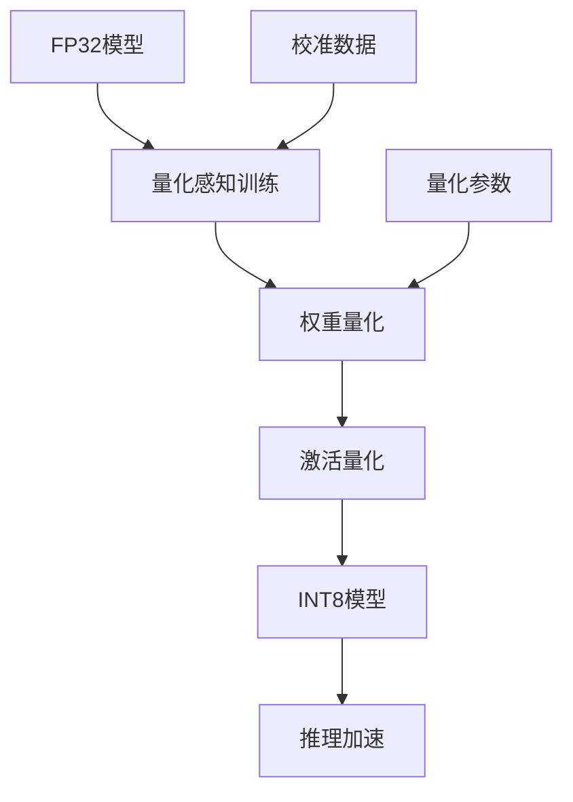

**章节来源**
- [configuration_hubert.py](file://src/transformers/models/hubert/configuration_hubert.py#L200-L266)

## 性能优化与部署

### 推理优化

HuBERT的推理优化策略包括：

1. **批处理优化**：动态批处理大小调整
2. **内存管理**：梯度检查点和内存复用
3. **并行计算**：多GPU分布式训练
4. **硬件加速**：支持CUDA、TensorRT等

### 边缘设备部署

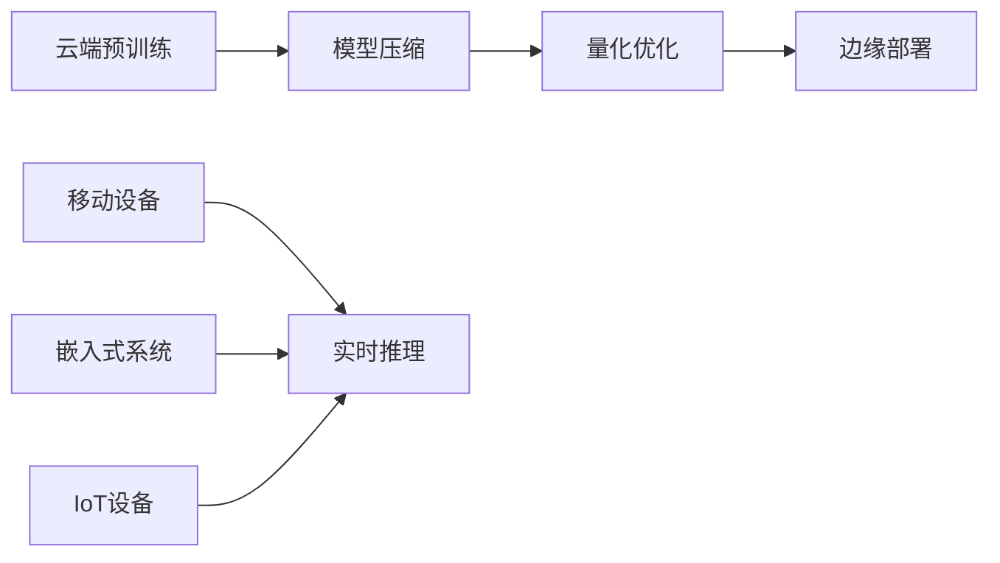

**章节来源**
- [README.md](file://examples/pytorch/speech-pretraining/README.md#L150-L162)

## 总结

HuBERT代表了自监督语音表示学习的重要进展，其核心创新包括：

1. **层次化掩码语言建模**：通过多粒度掩码策略学习丰富语音表示
2. **聚类生成伪标签**：结合神经网络与聚类算法的联合优化
3. **多层特征表示**：分层特征提取实现从声学到语义的映射
4. **广泛下游应用**：在语音识别、情感识别等多个任务中表现出色

HuBERT的成功证明了自监督学习在语音领域的重要价值，为低资源场景下的语音处理提供了强大解决方案。随着模型压缩技术和部署优化的不断发展，HuBERT将在更多实际应用场景中发挥重要作用。

通过本文档的深入分析，我们不仅理解了HuBERT的技术原理，还掌握了其在实际应用中的部署策略和优化方法。这些知识将有助于研究人员和工程师更好地利用HuBERT解决各种语音处理挑战。