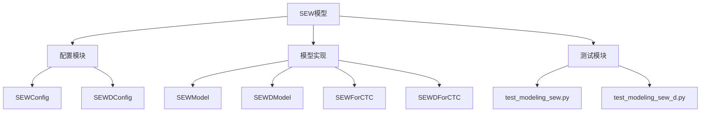
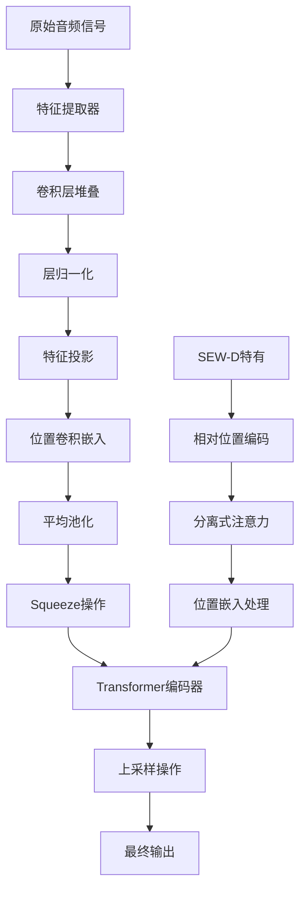
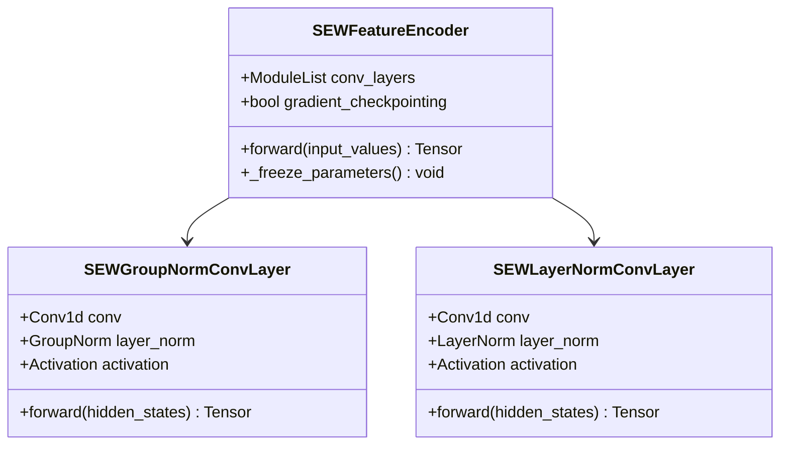
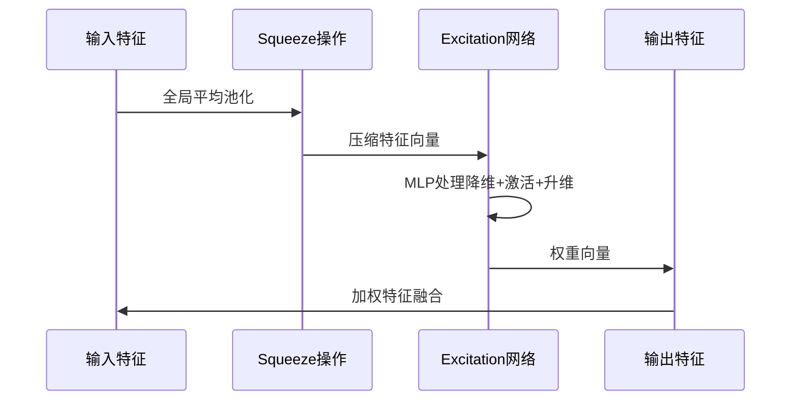
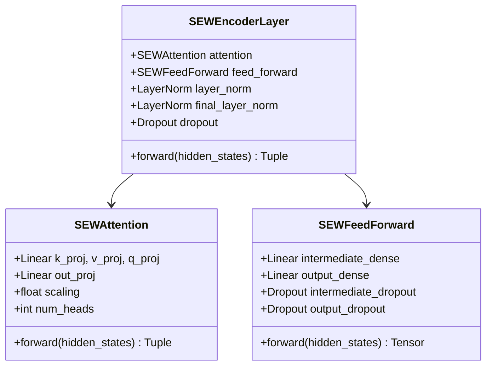
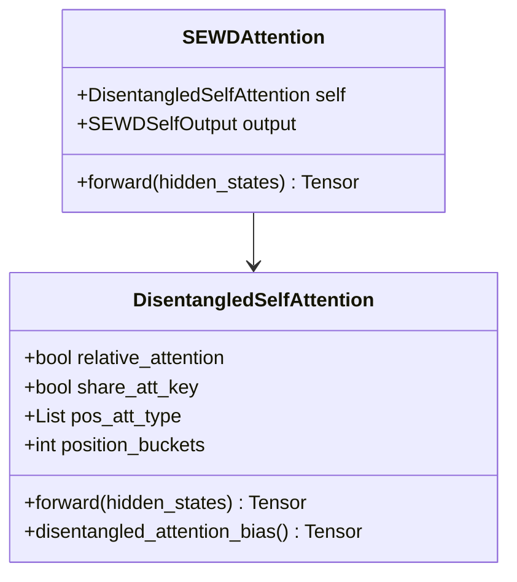
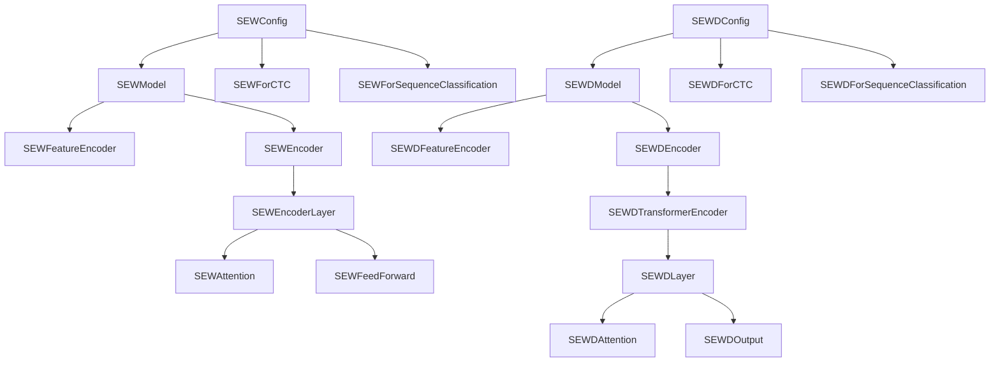

# SEW 模型：Squeeze-and-Excitation Wav2Vec 架构详解

<cite>
**本文档中引用的文件**
- [configuration_sew.py](file://src/transformers/models/sew/configuration_sew.py)
- [modeling_sew.py](file://src/transformers/models/sew/modeling_sew.py)
- [configuration_sew_d.py](file://src/transformers/models/sew_d/configuration_sew_d.py)
- [modeling_sew_d.py](file://src/transformers/models/sew_d/modeling_sew_d.py)
- [sew.md](file://docs/source/en/model_doc/sew.md)
- [sew-d.md](file://docs/source/en/model_doc/sew-d.md)
- [test_modeling_sew.py](file://tests/models/sew/test_modeling_sew.py)
</cite>

## 目录
1. [简介](#简介)
2. [项目结构](#项目结构)
3. [核心组件](#核心组件)
4. [架构概览](#架构概览)
5. [详细组件分析](#详细组件分析)
6. [依赖关系分析](#依赖关系分析)
7. [性能考虑](#性能考虑)
8. [故障排除指南](#故障排除指南)
9. [结论](#结论)

## 简介

SEW（Squeeze-and-Excitation Wav2Vec）是一种创新的语音识别模型架构，由Felix Wu等人在论文《Performance-Efficiency Trade-offs in Unsupervised Pre-training for Speech Recognition》中提出。该模型在wav2vec 2.0的基础上引入了Squeeze-and-Excitation（SE）注意力机制，显著提升了语音特征表示能力和推理效率。

SEW模型的核心创新在于：
- **通道注意力机制**：通过Squeeze-and-Excitation操作动态调整特征通道的重要性
- **序列长度下采样**：squeeze_factor参数控制编码器后的序列长度压缩
- **高效特征提取**：结合卷积神经网络和Transformer架构
- **相对位置编码**：SEW-D版本引入了分离式注意力机制

## 项目结构

SEW模型的项目结构清晰地组织了核心功能模块：



**图表来源**
- [configuration_sew.py](file://src/transformers/models/sew/configuration_sew.py#L1-L50)
- [modeling_sew.py](file://src/transformers/models/sew/modeling_sew.py#L1-L50)

**章节来源**
- [configuration_sew.py](file://src/transformers/models/sew/configuration_sew.py#L1-L257)
- [modeling_sew.py](file://src/transformers/models/sew/modeling_sew.py#L1-L1101)

## 核心组件

### 配置系统

SEW模型采用灵活的配置系统，支持多种变体：

#### SEWConfig
- **隐藏层维度**：默认768维，支持自定义
- **编码层数**：默认12层，可扩展
- **注意力头数**：默认12个，支持多头注意力
- **squeeze_factor**：序列长度下采样因子，默认为2
- **卷积层配置**：支持自定义卷积核大小、步长和通道数

#### SEWDConfig（SEW-D）
- **相对位置编码**：支持位置偏置输入
- **分离式注意力**：支持内容到位置和位置到内容的注意力类型
- **共享键值**：可选择是否共享注意力键和查询
- **位置嵌入桶**：支持对位置嵌入进行分桶处理

**章节来源**
- [configuration_sew.py](file://src/transformers/models/sew/configuration_sew.py#L25-L256)
- [configuration_sew_d.py](file://src/transformers/models/sew_d/configuration_sew_d.py#L25-L291)

## 架构概览

SEW模型的整体架构展示了从音频输入到最终输出的完整处理流程：



**图表来源**
- [modeling_sew.py](file://src/transformers/models/sew/modeling_sew.py#L428-L500)
- [modeling_sew_d.py](file://src/transformers/models/sew_d/modeling_sew_d.py#L1125-L1200)

## 详细组件分析

### 特征提取器

特征提取器是SEW模型的第一层，负责将原始音频信号转换为有意义的特征表示：



**图表来源**
- [modeling_sew.py](file://src/transformers/models/sew/modeling_sew.py#L61-L120)

特征提取器支持两种归一化策略：
- **组归一化**：仅对第一个卷积层应用组归一化
- **层归一化**：对所有卷积层应用层归一化

**章节来源**
- [modeling_sew.py](file://src/transformers/models/sew/modeling_sew.py#L172-L250)

### Squeeze-and-Excitation 操作

SEW模型的核心创新是Squeeze-and-Excitation机制，它通过以下步骤增强特征表示：



**图表来源**
- [modeling_sew.py](file://src/transformers/models/sew/modeling_sew.py#L172-L198)

SEWUpsampling类实现了squeeze操作的具体实现：

```mermaid
flowchart LR
A[输入张量<br/>[B, T, D]] --> B[线性投影<br/>[B, T, D*S]]
B --> C[激活函数]
C --> D[重塑张量<br/>[B, T, S, D']]
D --> E[重新排列<br/>[B, T*S, D']]
```

**图表来源**
- [modeling_sew.py](file://src/transformers/models/sew/modeling_sew.py#L172-L198)

**章节来源**
- [modeling_sew.py](file://src/transformers/models/sew/modeling_sew.py#L172-L198)

### Transformer 编码器

SEW的Transformer编码器采用了标准的多头自注意力机制：



**图表来源**
- [modeling_sew.py](file://src/transformers/models/sew/modeling_sew.py#L387-L428)

**章节来源**
- [modeling_sew.py](file://src/transformers/models/sew/modeling_sew.py#L387-L428)

### SEW-D 分离式注意力

SEW-D引入了更复杂的分离式注意力机制：



**图表来源**
- [modeling_sew_d.py](file://src/transformers/models/sew_d/modeling_sew_d.py#L700-L850)

SEW-D的相对位置编码支持以下特性：
- **内容到位置注意力（c2p）**：从内容特征到位置特征的注意力
- **位置到内容注意力（p2c）**：从位置特征到内容特征的注意力
- **共享键值**：可选择是否共享注意力键和查询

**章节来源**
- [modeling_sew_d.py](file://src/transformers/models/sew_d/modeling_sew_d.py#L700-L850)

### 上采样机制

SEW模型使用上采样操作恢复序列长度：

```mermaid
flowchart TD
A[池化后特征<br/>[B, T/S, D]] --> B[线性投影<br/>[B, T/S, D*S]]
B --> C[激活函数]
C --> D[重塑张量<br/>[B, T/S, S, D']]
D --> E[重新排列<br/>[B, T, D']]
E --> F[填充补齐<br/>[B, T, D]]
```

**图表来源**
- [modeling_sew.py](file://src/transformers/models/sew/modeling_sew.py#L172-L198)

**章节来源**
- [modeling_sew.py](file://src/transformers/models/sew/modeling_sew.py#L172-L198)

## 依赖关系分析

SEW模型的依赖关系展现了清晰的层次结构：



**图表来源**
- [configuration_sew.py](file://src/transformers/models/sew/configuration_sew.py#L1-L50)
- [modeling_sew.py](file://src/transformers/models/sew/modeling_sew.py#L1-L100)

**章节来源**
- [configuration_sew.py](file://src/transformers/models/sew/configuration_sew.py#L1-L257)
- [modeling_sew.py](file://src/transformers/models/sew/modeling_sew.py#L1-L1101)

## 性能考虑

### 推理速度优化

SEW模型在设计时特别注重推理效率：

1. **squeeze_factor参数**：通过控制序列长度的下采样比例，可以在精度和速度之间进行权衡
2. **梯度检查点**：支持渐进式计算，减少内存使用
3. **Flash Attention**：支持高效的注意力计算

### 内存优化策略

- **权重归一化**：使用权重归一化技术稳定训练过程
- **深度优先分解**：支持DeepSpeed ZeRO-3内存优化
- **混合精度训练**：支持FP16和BF16训练

### 扩展性设计

SEW模型支持多种扩展方式：
- **模型尺寸**：从tiny到large的不同配置
- **训练数据**：支持从少量到大量标注数据的训练
- **下游任务**：支持CTC和分类等多种任务

## 故障排除指南

### 常见问题及解决方案

#### 训练不稳定
**症状**：损失函数震荡或发散
**解决方案**：
- 调整学习率调度器
- 使用梯度裁剪
- 检查数据预处理质量

#### 内存不足
**症状**：CUDA out of memory错误
**解决方案**：
- 减少批次大小
- 启用梯度检查点
- 使用DeepSpeed ZeRO优化

#### 性能下降
**症状**：验证集准确率低于预期
**解决方案**：
- 检查squeeze_factor设置
- 调整注意力头数
- 增加训练数据量

**章节来源**
- [test_modeling_sew.py](file://tests/models/sew/test_modeling_sew.py#L1-L200)

## 结论

SEW（Squeeze-and-Excitation Wav2Vec）模型代表了语音识别领域的重要进展。通过引入Squeeze-and-Excitation注意力机制，该模型在保持高精度的同时显著提升了推理效率。

### 主要优势

1. **创新的注意力机制**：SE模块有效增强了重要声学特征的表达
2. **高效的架构设计**：squeeze_factor参数提供了灵活的性能-效率平衡
3. **强大的泛化能力**：在多种语音识别任务上表现出色
4. **易于部署**：支持多种优化技术和硬件平台

### 应用场景

- **实时语音识别**：适用于需要低延迟的应用
- **资源受限设备**：可在移动设备和边缘计算环境中部署
- **大规模语音服务**：支持高并发的语音转文本服务
- **多语言语音识别**：具备良好的跨语言泛化能力

### 未来发展方向

1. **更高效的注意力机制**：探索更轻量级的注意力替代方案
2. **端到端优化**：从数据到模型的全流程优化
3. **多模态融合**：结合视觉和其他模态信息
4. **自适应推理**：根据硬件条件动态调整模型复杂度

SEW模型为语音识别技术的发展提供了新的思路，其创新的架构设计和优化策略值得在实际应用中深入探索和实践。