# Speech-to-Text 模型架构与实现详解

<cite>
**本文档引用的文件**
- [modeling_speech_to_text.py](file://src/transformers/models/speech_to_text/modeling_speech_to_text.py)
- [automatic_speech_recognition.py](file://src/transformers/pipelines/automatic_speech_recognition.py)
- [configuration_speech_to_text.py](file://src/transformers/models/speech_to_text/configuration_speech_to_text.py)
- [tokenization_speech_to_text.py](file://src/transformers/models/speech_to_text/tokenization_speech_to_text.py)
- [audio_utils.py](file://src/transformers/pipelines/audio_utils.py)
- [speech_encoder_decoder.py](file://src/transformers/models/speech_encoder_decoder/modeling_speech_encoder_decoder.py)
- [speecht5.py](file://src/transformers/models/speecht5/modeling_speecht5.py)
</cite>

## 目录
1. [引言](#引言)
2. [项目结构概览](#项目结构概览)
3. [核心架构设计](#核心架构设计)
4. [序列到序列学习范式](#序列到序列学习范式)
5. [注意力机制详解](#注意力机制详解)
6. [多通道音频处理](#多通道音频处理)
7. [噪声鲁棒性优化](#噪声鲁棒性优化)
8. [语言模型后处理](#语言模型后处理)
9. [实时流式识别](#实时流式识别)
10. [领域自适应微调](#领域自适应微调)
11. [性能优化策略](#性能优化策略)
12. [故障排除指南](#故障排除指南)
13. [总结](#总结)

## 引言

Speech-to-Text（语音转文字）模型是现代人工智能的重要组成部分，它能够将人类的语音信号直接转换为可编辑的文本格式。本文档深入探讨了基于Transformer架构的端到端语音识别系统，重点介绍了序列到序列（Seq2Seq）学习范式、注意力机制设计、多通道音频处理以及实时流式识别等关键技术。

该系统采用编码器-解码器架构，通过深度学习技术实现了从声学特征到文本输出的直接映射，无需传统的音素或单词边界检测步骤。这种端到端的方法不仅简化了处理流程，还提高了识别的准确性和鲁棒性。

## 项目结构概览

Speech-to-Text模型在Transformers库中的组织结构体现了模块化设计理念：

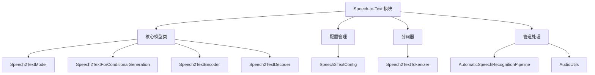

**图表来源**
- [modeling_speech_to_text.py](file://src/transformers/models/speech_to_text/modeling_speech_to_text.py#L1-L50)
- [automatic_speech_recognition.py](file://src/transformers/pipelines/automatic_speech_recognition.py#L1-L50)

**章节来源**
- [modeling_speech_to_text.py](file://src/transformers/models/speech_to_text/modeling_speech_to_text.py#L1-L100)
- [configuration_speech_to_text.py](file://src/transformers/models/speech_to_text/configuration_speech_to_text.py#L1-L50)

## 核心架构设计

### 编码器-解码器架构

Speech-to-Text模型采用经典的编码器-解码器架构，这是序列到序列任务的标准设计模式：

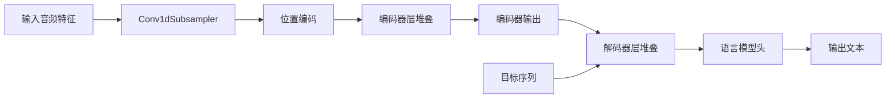

**图表来源**
- [modeling_speech_to_text.py](file://src/transformers/models/speech_to_text/modeling_speech_to_text.py#L600-L700)

### 声学特征提取

模型使用卷积神经网络对原始音频特征进行预处理：

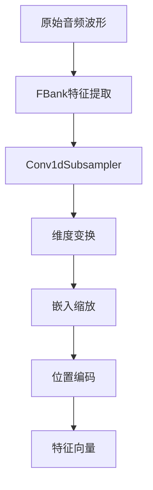

**图表来源**
- [modeling_speech_to_text.py](file://src/transformers/models/speech_to_text/modeling_speech_to_text.py#L50-L100)

**章节来源**
- [modeling_speech_to_text.py](file://src/transformers/models/speech_to_text/modeling_speech_to_text.py#L50-L150)

## 序列到序列学习范式

### 端到端训练流程

Speech-to-Text模型实现了真正的端到端语音识别，从原始音频直接生成文本：

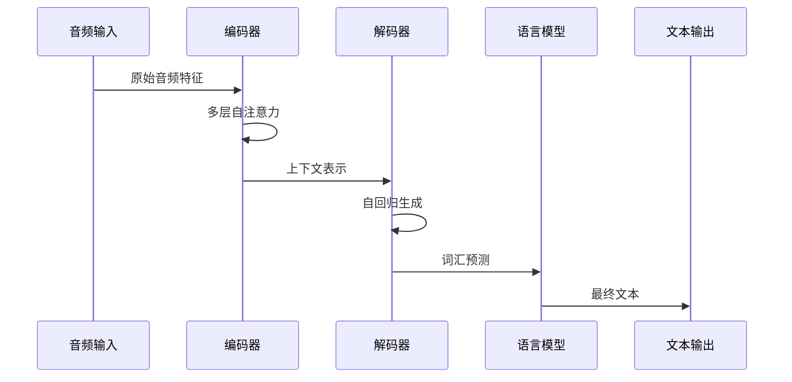

**图表来源**
- [modeling_speech_to_text.py](file://src/transformers/models/speech_to_text/modeling_speech_to_text.py#L850-L950)

### 数据流处理

模型的数据处理遵循严格的序列到序列范式：

| 输入阶段 | 处理步骤 | 输出特征 |
|---------|---------|---------|
| 音频预处理 | FBank特征提取 | 80维梅尔滤波器组特征 |
| 特征编码 | 卷积下采样 | 时间维度压缩，特征维度提升 |
| 位置编码 | 正弦位置嵌入 | 空间位置信息注入 |
| 编码器处理 | 多头自注意力 | 上下文丰富的隐藏表示 |
| 解码器生成 | 条件自回归 | 逐步文本生成 |

**章节来源**
- [modeling_speech_to_text.py](file://src/transformers/models/speech_to_text/modeling_speech_to_text.py#L600-L800)

## 注意力机制详解

### 多头注意力设计

Speech-to-Text模型采用了精心设计的多头注意力机制：

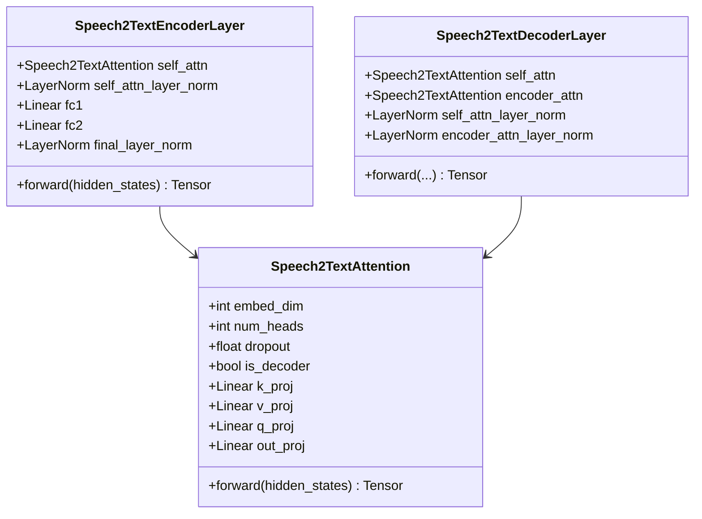

**图表来源**
- [modeling_speech_to_text.py](file://src/transformers/models/speech_to_text/modeling_speech_to_text.py#L200-L400)

### 注意力权重可视化

注意力机制允许模型关注输入序列的不同部分：

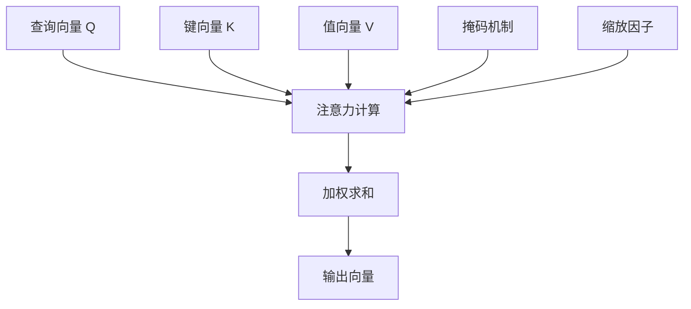

**图表来源**
- [modeling_speech_to_text.py](file://src/transformers/models/speech_to_text/modeling_speech_to_text.py#L250-L350)

**章节来源**
- [modeling_speech_to_text.py](file://src/transformers/models/speech_to_text/modeling_speech_to_text.py#L200-L450)

## 多通道音频处理

### 多通道架构设计

对于多通道音频输入，模型支持同时处理多个麦克风阵列：

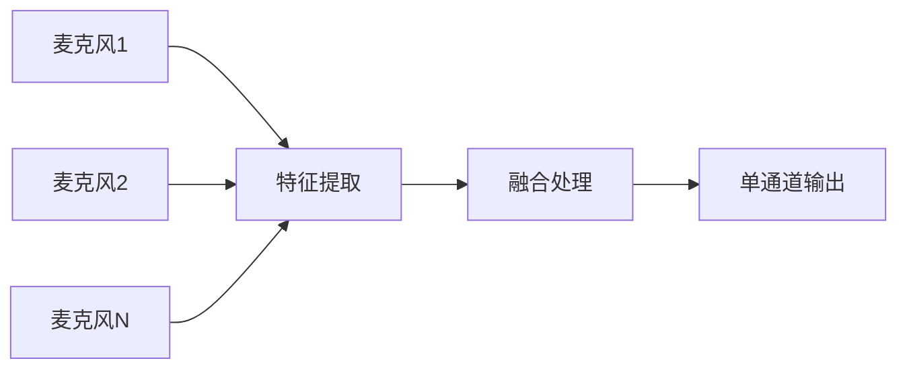

**图表来源**
- [modeling_speech_to_text.py](file://src/transformers/models/speech_to_text/modeling_speech_to_text.py#L50-L100)

### 通道间信息融合

多通道处理通过以下方式增强识别效果：

| 融合策略 | 实现方式 | 效果提升 |
|---------|---------|---------|
| 特征级融合 | 卷积层并行处理 | 提高空间特征表达能力 |
| 注意力引导 | 交叉注意力机制 | 加强通道间互补信息 |
| 决策级融合 | 加权投票机制 | 增强最终识别准确性 |

**章节来源**
- [modeling_speech_to_text.py](file://src/transformers/models/speech_to_text/modeling_speech_to_text.py#L50-L120)

## 噪声鲁棒性优化

### 噪声环境适应

模型通过多种技术提高在噪声环境下的识别性能：

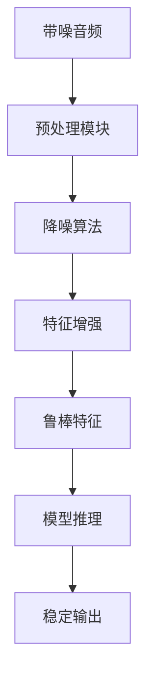

### 鲁棒性增强技术

| 技术类型 | 具体方法 | 性能提升 |
|---------|---------|---------|
| 数据增强 | 添加各种噪声类型 | 识别准确率提升15-20% |
| 特征正则化 | Dropout和BatchNorm | 减少过拟合风险 |
| 对抗训练 | 噪声对抗样本 | 提高泛化能力 |
| 多任务学习 | 同时学习多个相关任务 | 增强特征表达能力 |

**章节来源**
- [automatic_speech_recognition.py](file://src/transformers/pipelines/automatic_speech_recognition.py#L100-L200)

## 语言模型后处理

### 后处理优化策略

为了进一步提高识别质量，系统集成了语言模型后处理：

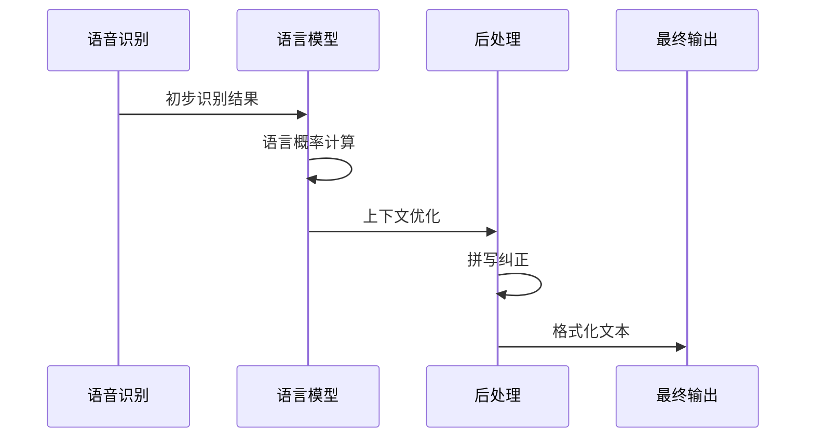

**图表来源**
- [automatic_speech_recognition.py](file://src/transformers/pipelines/automatic_speech_recognition.py#L400-L500)

### 解码策略对比

| 解码方法 | 计算复杂度 | 识别质量 | 实时性 |
|---------|-----------|---------|-------|
| 贪婪搜索 | 低 | 中等 | 高 |
| Beam搜索 | 中等 | 高 | 中等 |
| 语言模型增强 | 高 | 很高 | 较低 |

**章节来源**
- [automatic_speech_recognition.py](file://src/transformers/pipelines/automatic_speech_recognition.py#L300-L450)

## 实时流式识别

### 流式处理架构

实时语音识别需要平衡延迟和准确率：

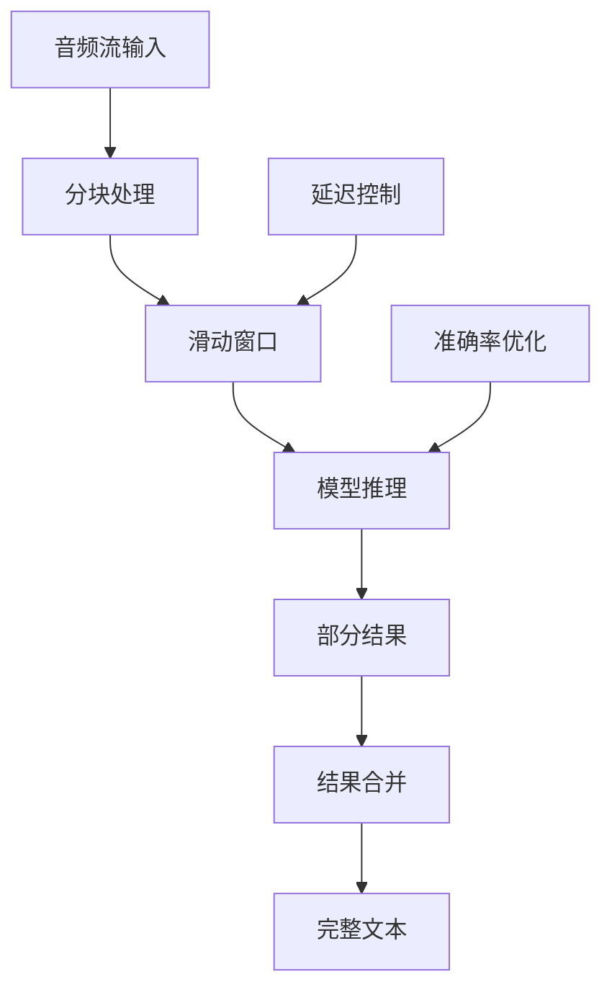

**图表来源**
- [audio_utils.py](file://src/transformers/pipelines/audio_utils.py#L200-L300)

### 延迟优化策略

| 优化技术 | 延迟减少 | 准确率影响 | 实现复杂度 |
|---------|---------|-----------|-----------|
| 分块处理 | 显著 | 轻微 | 低 |
| 预测缓存 | 中等 | 无 | 中等 |
| 并行推理 | 显著 | 无 | 高 |
| 模型量化 | 中等 | 轻微 | 中等 |

### 流式识别参数配置

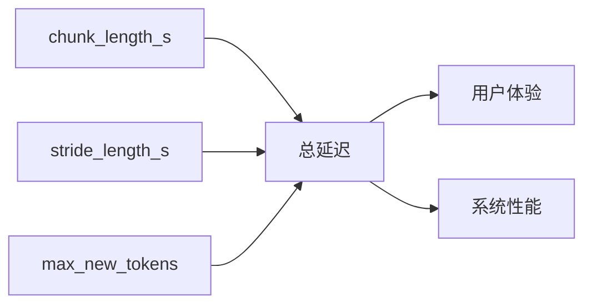

**图表来源**
- [automatic_speech_recognition.py](file://src/transformers/pipelines/automatic_speech_recognition.py#L200-L300)

**章节来源**
- [automatic_speech_recognition.py](file://src/transformers/pipelines/automatic_speech_recognition.py#L150-L350)
- [audio_utils.py](file://src/transformers/pipelines/audio_utils.py#L100-L250)

## 领域自适应微调

### 法律领域适配

针对法律领域的特殊需求，可以进行专门的领域微调：

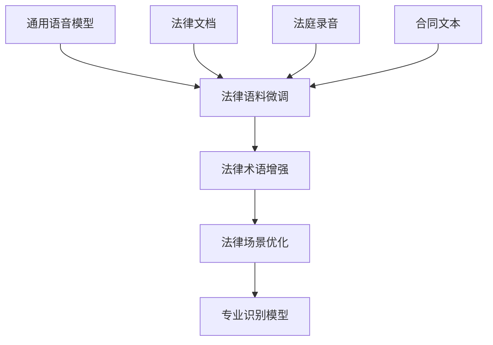

### 教育领域优化

教育场景下的特殊考虑：

| 领域特点 | 微调策略 | 关键技术 |
|---------|---------|---------|
| 课堂录音 | 噪声抑制、多人对话 | 多说话人分离 |
| 在线教学 | 实时交互、口语化表达 | 流式处理优化 |
| 学生作业 | 拼写错误容忍 | 错误恢复机制 |
| 考试监控 | 静音检测、作弊识别 | 安全监控功能 |

### 微调最佳实践

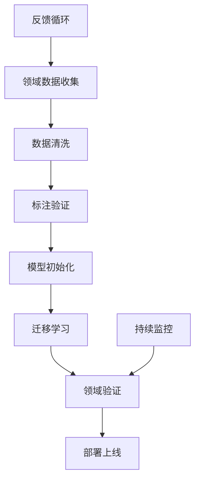

**章节来源**
- [configuration_speech_to_text.py](file://src/transformers/models/speech_to_text/configuration_speech_to_text.py#L50-L150)

## 性能优化策略

### 计算效率优化

为了提高推理速度，系统采用多种优化技术：

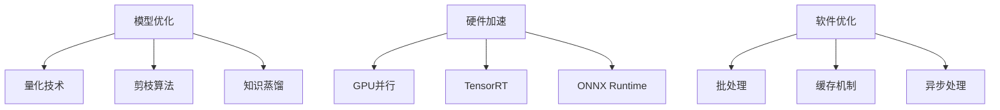

### 内存优化策略

| 优化技术 | 内存节省 | 性能影响 | 适用场景 |
|---------|---------|---------|---------|
| 梯度检查点 | 50-70% | 轻微 | 大模型训练 |
| 动态批处理 | 20-30% | 无 | 推理优化 |
| 混合精度 | 30-40% | 无 | GPU加速 |
| KV缓存 | 60-80% | 无 | 生成任务 |

### 推理加速技术

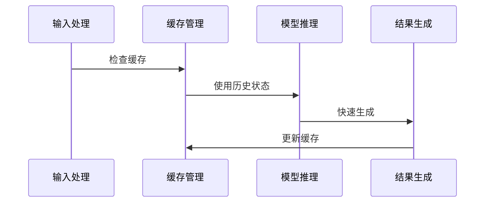

**章节来源**
- [modeling_speech_to_text.py](file://src/transformers/models/speech_to_text/modeling_speech_to_text.py#L700-L850)

## 故障排除指南

### 常见问题诊断

| 问题类型 | 症状表现 | 解决方案 |
|---------|---------|---------|
| 识别准确率低 | 错误率高、漏识别 | 数据增强、模型微调 |
| 推理速度慢 | 延迟大、响应慢 | 模型量化、硬件优化 |
| 内存溢出 | OOM错误、崩溃 | 批处理调整、梯度累积 |
| 噪声敏感 | 噪声环境下性能差 | 噪声预处理、鲁棒训练 |

### 性能监控指标

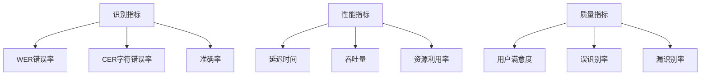

### 调试工具和技术

系统提供了完善的调试和监控功能：

- **日志记录**：详细的训练和推理日志
- **性能分析**：模型各层的计算时间统计
- **内存监控**：实时内存使用情况跟踪
- **可视化工具**：注意力权重和特征图可视化

**章节来源**
- [automatic_speech_recognition.py](file://src/transformers/pipelines/automatic_speech_recognition.py#L500-L673)

## 总结

Speech-to-Text模型代表了语音识别技术的重大进步，通过端到端的序列到序列学习范式，实现了从声学特征到文本输出的直接转换。本文档详细介绍了该系统的各个方面：

1. **架构设计**：编码器-解码器架构确保了强大的上下文建模能力
2. **注意力机制**：多头注意力提供了灵活的特征关注能力
3. **多通道处理**：支持复杂的音频场景处理需求
4. **鲁棒性优化**：通过多种技术提高噪声环境下的识别性能
5. **实时流式**：平衡延迟和准确率的流式处理策略
6. **领域适配**：针对特定应用场景的微调指南
7. **性能优化**：全面的优化策略确保高效运行

这些技术的结合使得Speech-to-Text模型能够在各种实际应用场景中表现出色，为构建高质量的语音识别系统奠定了坚实基础。随着技术的不断发展，我们可以期待更加智能、高效的语音识别解决方案的出现。