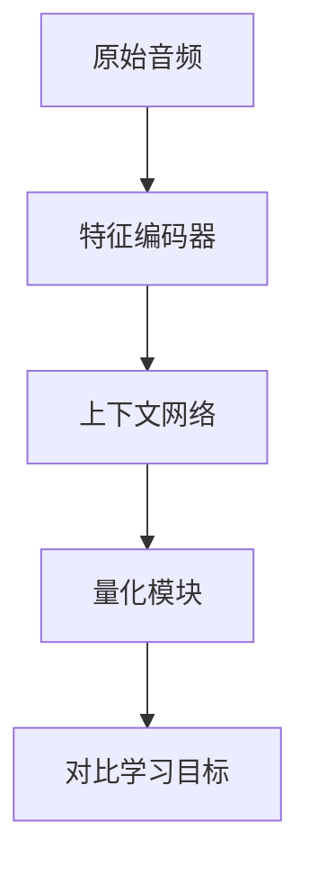
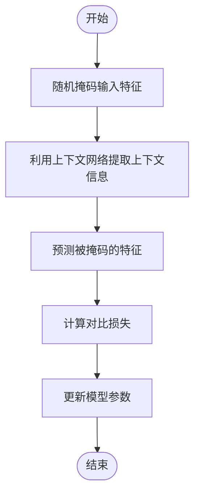
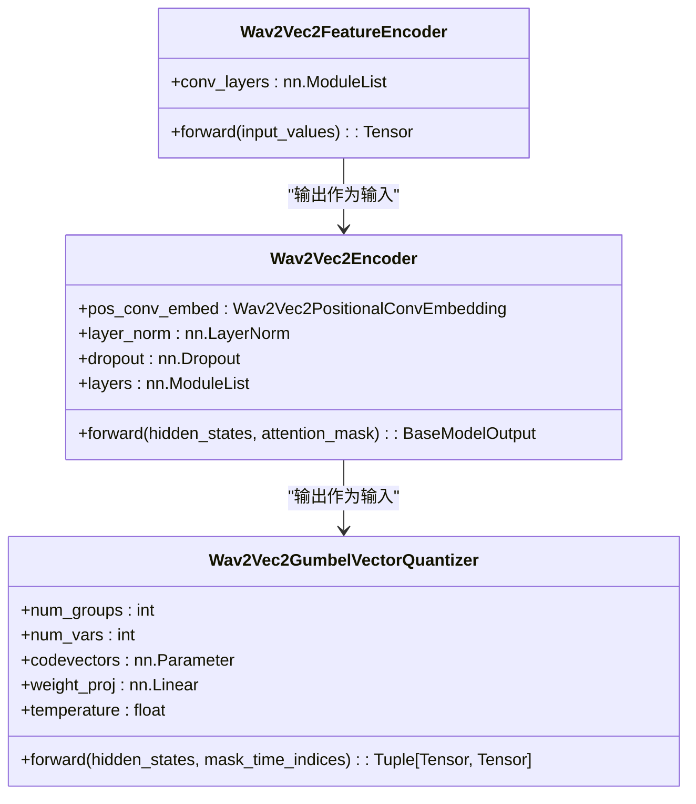

# Wav2Vec2 模型

<cite>
**本文档中引用的文件**
- [modeling_wav2vec2.py](file://src/transformers/models/wav2vec2/modeling_wav2vec2.py)
- [configuration_wav2vec2.py](file://src/transformers/models/wav2vec2/configuration_wav2vec2.py)
- [feature_extraction_wav2vec2.py](file://src/transformers/models/wav2vec2/feature_extraction_wav2vec2.py)
- [run_wav2vec2_pretraining_no_trainer.py](file://examples/pytorch/speech-pretraining/run_wav2vec2_pretraining_no_trainer.py)
- [run_speech_recognition_seq2seq.py](file://examples/pytorch/speech-recognition/run_speech_recognition_seq2seq.py)
</cite>

## 目录
1. [引言](#引言)
2. [Wav2Vec2 架构设计](#wav2vec2-架构设计)
3. [自监督预训练机制](#自监督预训练机制)
4. [特征编码器、上下文网络和量化模块](#特征编码器上下文网络和量化模块)
5. [微调策略与最佳实践](#微调策略与最佳实践)
6. [端到端训练流程](#端到端训练流程)
7. [低资源语言处理](#低资源语言处理)
8. [性能调优建议](#性能调优建议)
9. [结论](#结论)

## 引言

Wav2Vec2 是一种先进的自监督语音表示学习模型，通过在大量未标注音频数据上进行预训练，能够学习到丰富的语音特征表示。该模型采用Transformer架构，结合卷积神经网络和对比学习目标，实现了在语音识别、语音分类等任务上的卓越性能。本文档将深入探讨Wav2Vec2的架构设计、自监督预训练机制、对比学习目标以及在不同领域的微调策略。

## Wav2Vec2 架构设计

Wav2Vec2模型的架构由三个主要组件构成：特征编码器（Feature Encoder）、上下文网络（Context Network）和量化模块（Quantization Module）。特征编码器负责将原始音频波形转换为高维特征表示，上下文网络则通过Transformer架构捕捉长距离依赖关系，而量化模块用于离散化潜在表示以支持对比学习。

**图源**
- [modeling_wav2vec2.py](file://src/transformers/models/wav2vec2/modeling_wav2vec2.py#L821-L894)
- [configuration_wav2vec2.py](file://src/transformers/models/wav2vec2/configuration_wav2vec2.py#L145-L170)

**本节来源**
- [modeling_wav2vec2.py](file://src/transformers/models/wav2vec2/modeling_wav2vec2.py#L821-L894)
- [configuration_wav2vec2.py](file://src/transformers/models/wav2vec2/configuration_wav2vec2.py#L145-L170)

## 自监督预训练机制

Wav2Vec2采用自监督学习方法进行预训练，其核心思想是通过掩码预测任务来学习语音表示。具体而言，模型会随机掩码输入特征的一部分，并尝试根据上下文信息预测被掩码的特征。这一过程通过对比学习目标实现，即最大化正样本（真实特征）与负样本（随机采样特征）之间的相似度差异。

**图源**
- [modeling_wav2vec2.py](file://src/transformers/models/wav2vec2/modeling_wav2vec2.py#L1453-L1479)
- [run_wav2vec2_pretraining_no_trainer.py](file://examples/pytorch/speech-pretraining/run_wav2vec2_pretraining_no_trainer.py#L100-L150)

**本节来源**
- [modeling_wav2vec2.py](file://src/transformers/models/wav2vec2/modeling_wav2vec2.py#L1453-L1479)
- [run_wav2vec2_pretraining_no_trainer.py](file://examples/pytorch/speech-pretraining/run_wav2vec2_pretraining_no_trainer.py#L100-L150)

## 特征编码器、上下文网络和量化模块

### 特征编码器

特征编码器是Wav2Vec2模型的第一部分，它使用多层卷积神经网络将原始音频信号转换为高维特征表示。这些卷积层的设计考虑了语音信号的时间局部性，能够有效提取语音的基本特征。

### 上下文网络

上下文网络基于Transformer架构，包含多个编码器层，每个层都包括多头自注意力机制和前馈神经网络。该网络能够捕捉输入特征之间的长距离依赖关系，从而增强模型对语音上下文的理解能力。

### 量化模块

量化模块采用Gumbel-Softmax技术实现向量量化，将连续的特征表示映射到离散的码本中。这种离散化处理有助于模型学习更加鲁棒的语音表示，并支持对比学习目标的实现。

**图源**
- [modeling_wav2vec2.py](file://src/transformers/models/wav2vec2/modeling_wav2vec2.py#L821-L894)
- [modeling_wav2vec2.py](file://src/transformers/models/wav2vec2/modeling_wav2vec2.py#L665-L703)

**本节来源**
- [modeling_wav2vec2.py](file://src/transformers/models/wav2vec2/modeling_wav2vec2.py#L821-L894)
- [modeling_wav2vec2.py](file://src/transformers/models/wav2vec2/modeling_wav2vec2.py#L665-L703)

## 微调策略与最佳实践

在特定领域（如医疗、金融）进行微调时，应遵循以下最佳实践：

1. **冻结特征编码器**：在微调初期，通常建议冻结特征编码器的参数，仅训练上下文网络和任务特定的头部，以避免破坏预训练阶段学到的通用语音特征。
2. **逐步解冻**：随着训练的进行，可以逐渐解冻特征编码器的部分或全部层，允许模型针对特定任务进一步优化底层特征提取。
3. **调整学习率**：为不同的网络组件设置不同的学习率，例如，对预训练部分使用较低的学习率，而对新添加的任务特定层使用较高的学习率。

**本节来源**
- [modeling_wav2vec2.py](file://src/transformers/models/wav2vec2/modeling_wav2vec2.py#L1453-L1459)
- [run_speech_recognition_seq2seq.py](file://examples/pytorch/speech-recognition/run_speech_recognition_seq2seq.py#L551-L583)

## 端到端训练流程

使用Hugging Face Trainer进行端到端训练时，可以通过配置`TrainingArguments`来优化学习率调度和批量大小。推荐的做法包括：

- **学习率调度**：采用线性预热后余弦衰减的学习率调度策略，有助于模型平稳收敛。
- **批量大小**：根据可用GPU内存选择合适的批量大小，较大的批量大小通常能带来更稳定的梯度估计，但需要更多的显存。

**本节来源**
- [run_speech_recognition_seq2seq.py](file://examples/pytorch/speech-recognition/run_speech_recognition_seq2seq.py#L551-L583)
- [run_wav2vec2_pretraining_no_trainer.py](file://examples/pytorch/speech-pretraining/run_wav2vec2_pretraining_no_trainer.py#L100-L150)

## 低资源语言处理

对于低资源语言，数据增强技术和迁移学习策略尤为重要：

1. **数据增强**：利用SpecAugment等技术对音频数据进行变换，增加训练数据的多样性。
2. **迁移学习**：从高资源语言的预训练模型出发，通过微调适应低资源语言，显著减少所需标注数据量。

**本节来源**
- [feature_extraction_wav2vec2.py](file://src/transformers/models/wav2vec2/feature_extraction_wav2vec2.py#L200-L240)
- [run_wav2vec2_pretraining_no_trainer.py](file://examples/pytorch/speech-pretraining/run_wav2vec2_pretraining_no_trainer.py#L100-L150)

## 性能调优建议

为了提高训练效率和模型性能，建议采用以下技术：

- **混合精度训练**：使用自动混合精度（AMP）减少显存占用并加速训练过程。
- **梯度检查点**：通过牺牲计算时间换取显存节省，使得能够在有限资源下训练更大模型。

**本节来源**
- [run_speech_recognition_seq2seq.py](file://examples/pytorch/speech-recognition/run_speech_recognition_seq2seq.py#L551-L583)
- [run_wav2vec2_pretraining_no_trainer.py](file://examples/pytorch/speech-pretraining/run_wav2vec2_pretraining_no_trainer.py#L100-L150)

## 结论

Wav2Vec2模型通过创新的自监督预训练机制和精心设计的架构，在语音处理领域取得了显著成就。通过合理运用微调策略、数据增强技术和性能优化方法，可以在各种应用场景中充分发挥其潜力，特别是在资源受限的情况下展现出强大的适应性和泛化能力。