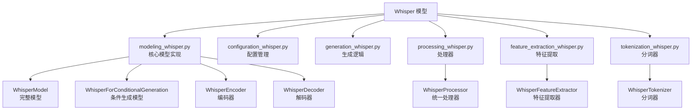
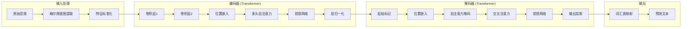
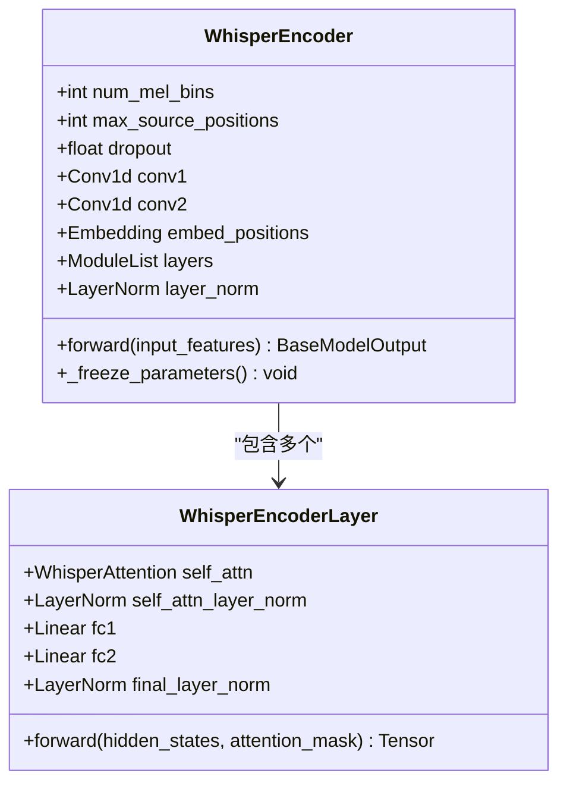
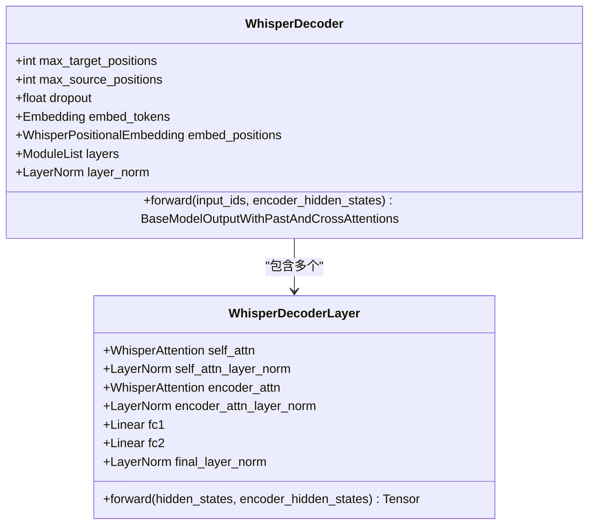
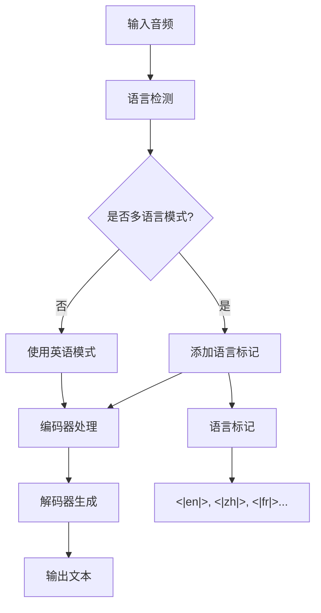
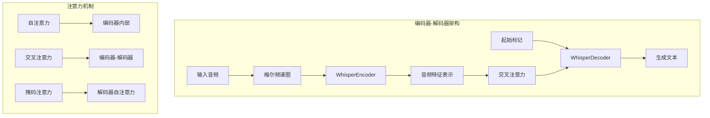
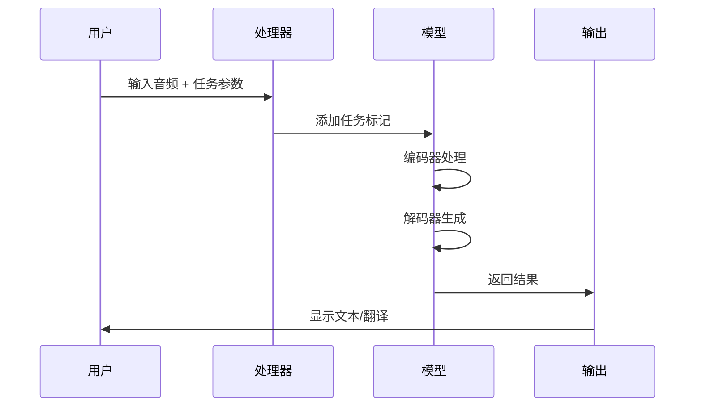
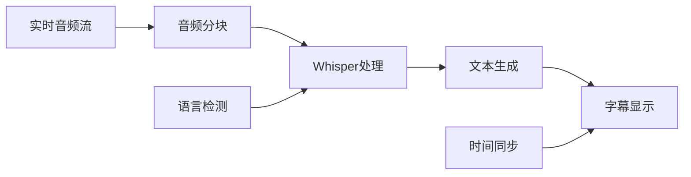
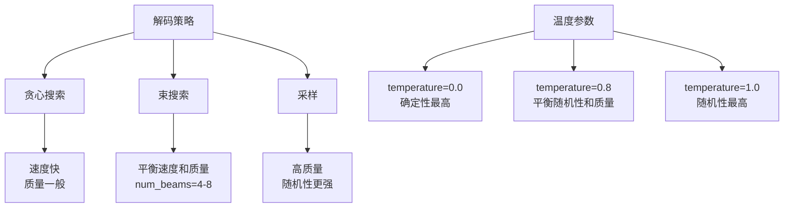
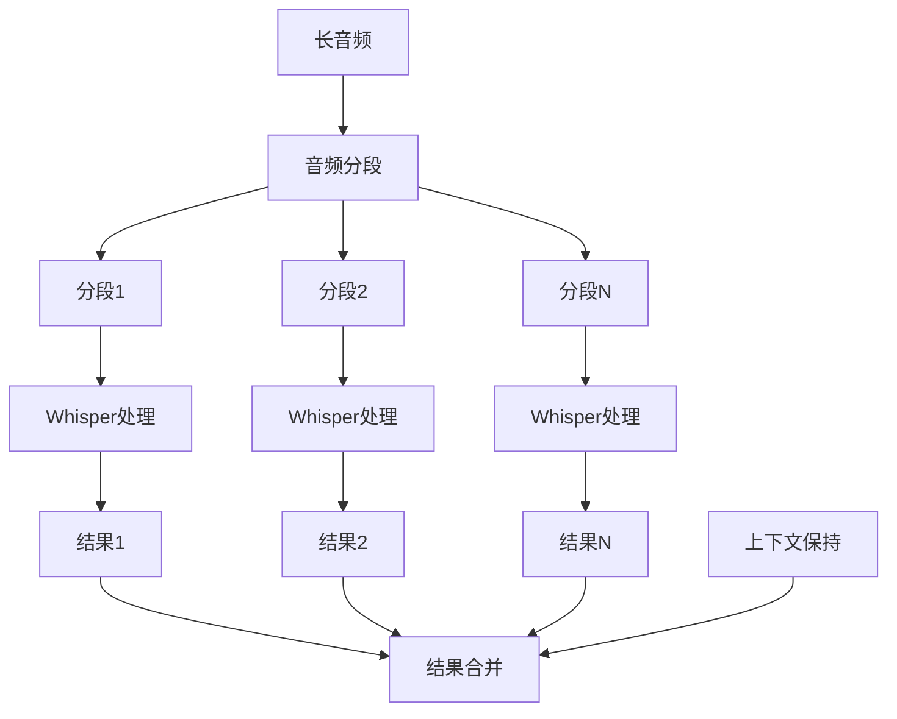

# Whisper 模型

<cite>
**本文档中引用的文件**
- [modeling_whisper.py](file://src/transformers/models/whisper/modeling_whisper.py)
- [configuration_whisper.py](file://src/transformers/models/whisper/configuration_whisper.py)
- [generation_whisper.py](file://src/transformers/models/whisper/generation_whisper.py)
- [processing_whisper.py](file://src/transformers/models/whisper/processing_whisper.py)
- [feature_extraction_whisper.py](file://src/transformers/models/whisper/feature_extraction_whisper.py)
- [tokenization_whisper.py](file://src/transformers/models/whisper/tokenization_whisper.py)
- [whisper.md](file://docs/source/en/model_doc/whisper.md)
</cite>

## 目录
1. [简介](#简介)
2. [项目结构](#项目结构)
3. [核心组件](#核心组件)
4. [架构概览](#架构概览)
5. [详细组件分析](#详细组件分析)
6. [多语言语音识别能力](#多语言语音识别能力)
7. [零样本迁移学习](#零样本迁移学习)
8. [编码器-解码器架构](#编码器-解码器架构)
9. [多任务学习特性](#多任务学习特性)
10. [配置方法与性能优化](#配置方法与性能优化)
11. [解码策略优化](#解码策略优化)
12. [长音频处理策略](#长音频处理策略)
13. [应用场景](#应用场景)
14. [故障排除指南](#故障排除指南)
15. [结论](#结论)

## 简介

Whisper 是由 OpenAI 开发的多语言语音识别模型，采用编码器-解码器架构，能够在未经微调的情况下实现零样本语音识别和翻译能力。该模型基于 68 万小时的标注音频数据进行预训练，支持超过 99 种语言的语音识别，并能够自动检测输入语言。

Whisper 的核心优势在于其强大的零样本迁移学习能力，这意味着它可以在未见过的语言或领域上直接工作，无需额外的微调过程。这种特性使得 Whisper 在实际应用中具有极高的灵活性和实用性。

## 项目结构

Whisper 模型在 Transformers 库中的组织结构清晰明确，主要包含以下核心模块：



**图表来源**
- [modeling_whisper.py](file://src/transformers/models/whisper/modeling_whisper.py#L1-L50)
- [processing_whisper.py](file://src/transformers/models/whisper/processing_whisper.py#L1-L30)

**章节来源**
- [modeling_whisper.py](file://src/transformers/models/whisper/modeling_whisper.py#L1-L100)
- [configuration_whisper.py](file://src/transformers/models/whisper/configuration_whisper.py#L1-L50)

## 核心组件

### 配置类 (WhisperConfig)

WhisperConfig 类负责管理模型的所有超参数和配置选项：

| 参数名称 | 默认值 | 描述 |
|---------|--------|------|
| vocab_size | 51865 | 词汇表大小 |
| num_mel_bins | 80 | 梅尔滤波器数量 |
| encoder_layers | 4 | 编码器层数 |
| decoder_layers | 4 | 解码器层数 |
| encoder_attention_heads | 6 | 编码器注意力头数 |
| decoder_attention_heads | 6 | 解码器注意力头数 |
| d_model | 384 | 模型维度 |
| max_source_positions | 1500 | 最大源序列长度 |
| max_target_positions | 448 | 最大目标序列长度 |

### 主要模型类

1. **WhisperModel**: 完整的编码器-解码器模型
2. **WhisperForConditionalGeneration**: 条件生成模型，用于语音识别和翻译
3. **WhisperEncoder**: 专门的音频编码器
4. **WhisperDecoder**: 专门的文本解码器

**章节来源**
- [configuration_whisper.py](file://src/transformers/models/whisper/configuration_whisper.py#L50-L200)
- [modeling_whisper.py](file://src/transformers/models/whisper/modeling_whisper.py#L850-L950)

## 架构概览

Whisper 采用标准的编码器-解码器架构，但针对语音处理进行了特殊优化：



**图表来源**
- [modeling_whisper.py](file://src/transformers/models/whisper/modeling_whisper.py#L600-L700)
- [modeling_whisper.py](file://src/transformers/models/whisper/modeling_whisper.py#L850-L950)

**章节来源**
- [modeling_whisper.py](file://src/transformers/models/whisper/modeling_whisper.py#L600-L850)

## 详细组件分析

### WhisperEncoder - 音频编码器

编码器负责将音频信号转换为高维表示：



**图表来源**
- [modeling_whisper.py](file://src/transformers/models/whisper/modeling_whisper.py#L600-L700)

编码器的关键特性：
- 使用两层卷积网络提取音频特征
- 位置嵌入提供时序信息
- 多层 Transformer 层处理复杂依赖关系
- 支持梯度检查点以节省内存

### WhisperDecoder - 文本解码器

解码器负责生成目标序列：



**图表来源**
- [modeling_whisper.py](file://src/transformers/models/whisper/modeling_whisper.py#L750-L850)

**章节来源**
- [modeling_whisper.py](file://src/transformers/models/whisper/modeling_whisper.py#L600-L850)

## 多语言语音识别能力

### 支持的语言

Whisper 支持超过 99 种语言的语音识别：

| 语言类别 | 示例语言 | 语言代码 |
|---------|----------|----------|
| 欧洲语言 | 英语、法语、德语、西班牙语 | en, fr, de, es |
| 亚洲语言 | 中文、日语、韩语、印地语 | zh, ja, ko, hi |
| 其他语言 | 俄语、阿拉伯语、葡萄牙语 | ru, ar, pt |

### 多语言处理机制



**图表来源**
- [tokenization_whisper.py](file://src/transformers/models/whisper/tokenization_whisper.py#L380-L420)

**章节来源**
- [tokenization_whisper.py](file://src/transformers/models/whisper/tokenization_whisper.py#L140-L220)

## 零样本迁移学习

### 零样本能力原理

Whisper 的零样本能力源于其大规模预训练：

1. **大规模数据预训练**: 基于 68 万小时的多语言音频数据
2. **通用特征提取**: 学习到适用于多种语言的音频特征
3. **语言无关表示**: 编码器生成的语言无关的音频表示
4. **灵活解码**: 解码器根据任务类型生成相应输出

### 零样本应用场景

- **新语言支持**: 无需微调即可支持新语言
- **领域适应**: 跨领域的语音识别
- **低资源语言**: 支持资源稀缺的语言

**章节来源**
- [modeling_whisper.py](file://src/transformers/models/whisper/modeling_whisper.py#L850-L1000)

## 编码器-解码器架构

### 架构设计特点



**图表来源**
- [modeling_whisper.py](file://src/transformers/models/whisper/modeling_whisper.py#L850-L950)

### 同时处理语音识别和翻译

Whisper 通过任务标记实现多任务学习：

| 任务类型 | 标记 | 功能描述 |
|---------|------|----------|
| 转录 | <|transcribe|> | 将语音转录为同语言文本 |
| 翻译 | <|translate|> | 将语音翻译为目标语言 |
| 无时间戳 | <|notimestamps|> | 不生成时间戳信息 |

**章节来源**
- [modeling_whisper.py](file://src/transformers/models/whisper/modeling_whisper.py#L850-L1100)

## 多任务学习特性

### 任务切换机制



**图表来源**
- [processing_whisper.py](file://src/transformers/models/whisper/processing_whisper.py#L30-L80)

### 会议记录功能

Whisper 可以用于实时会议记录：

1. **实时转录**: 实时将语音转换为文本
2. **多语言支持**: 支持不同语言的发言者
3. **时间戳生成**: 提供精确的时间定位
4. **发言人分离**: 可能的发言人识别

### 实时字幕生成



**章节来源**
- [generation_whisper.py](file://src/transformers/models/whisper/generation_whisper.py#L1-L200)

## 配置方法与性能优化

### 基础配置

```python
# 基础模型配置
from transformers import WhisperConfig, WhisperForConditionalGeneration

config = WhisperConfig(
    vocab_size=51865,
    num_mel_bins=80,
    encoder_layers=4,
    decoder_layers=4,
    d_model=384,
    max_source_positions=1500,
    max_target_positions=448
)

model = WhisperForConditionalGeneration(config)
```

### 性能优化配置

| 优化策略 | 配置参数 | 效果 |
|---------|----------|------|
| 内存优化 | gradient_checkpointing=True | 减少内存使用 |
| 计算优化 | attn_implementation="flash_attention" | 加速注意力计算 |
| 推理优化 | use_cache=True | 缓存键值对 |
| 批处理优化 | pad_to_multiple_of=128 | 优化 GPU 利用率 |

### 设备配置

```python
# GPU 配置
model = WhisperForConditionalGeneration.from_pretrained(
    "openai/whisper-large-v3",
    device_map="auto",
    torch_dtype=torch.float16
)

# CPU 配置
model = WhisperForConditionalGeneration.from_pretrained(
    "openai/whisper-base",
    device_map="cpu",
    torch_dtype=torch.float32
)
```

**章节来源**
- [configuration_whisper.py](file://src/transformers/models/whisper/configuration_whisper.py#L100-L280)

## 解码策略优化

### Beam Search 参数调整



**图表来源**
- [generation_whisper.py](file://src/transformers/models/whisper/generation_whisper.py#L600-L800)

### 温度参数优化

| 温度值 | 特点 | 适用场景 |
|-------|------|----------|
| 0.0 | 确定性最高，重复最少 | 正式文档转录 |
| 0.2-0.4 | 平衡质量和多样性 | 一般对话转录 |
| 0.6-0.8 | 更多样性和创造性 | 创意内容生成 |
| 1.0 | 最大随机性 | 测试和探索 |

### 长序列处理策略

```python
# 长序列处理配置
generation_config = {
    "max_new_tokens": 512,
    "num_beams": 4,
    "temperature": 0.0,
    "length_penalty": 1.0,
    "early_stopping": True
}
```

**章节来源**
- [generation_whisper.py](file://src/transformers/models/whisper/generation_whisper.py#L600-L1000)

## 长音频处理策略

### 分段处理机制



**图表来源**
- [generation_whisper.py](file://src/transformers/models/whisper/generation_whisper.py#L1200-L1400)

### 上下文保持技术

1. **前文提示**: 使用前一段的内容作为上下文
2. **连续生成**: 维护生成状态的连续性
3. **时间戳对齐**: 确保时间戳的准确性
4. **质量控制**: 通过压缩比和置信度阈值过滤

### 配置参数

| 参数 | 默认值 | 描述 |
|------|--------|------|
| num_segment_frames | 1500 | 单个片段的帧数 |
| condition_on_prev_tokens | False | 是否使用前文 |
| compression_ratio_threshold | 1.35 | 压缩比阈值 |
| logprob_threshold | -1.0 | 对数概率阈值 |

**章节来源**
- [generation_whisper.py](file://src/transformers/models/whisper/generation_whisper.py#L1200-L1600)

## 应用场景

### 会议记录系统

```python
# 会议记录配置
def setup_meeting_recognition():
    return {
        "return_timestamps": True,
        "task": "transcribe",
        "language": "zh",  # 中文
        "condition_on_prev_tokens": True,
        "compression_ratio_threshold": 1.35,
        "logprob_threshold": -1.0
    }
```

### 实时字幕生成

```python
# 实时字幕配置
def setup_realtime_subtitles():
    return {
        "return_timestamps": True,
        "max_new_tokens": 100,
        "num_beams": 1,
        "temperature": 0.0,
        "chunk_length_s": 30
    }
```

### 多语言翻译系统

```python
# 多语言翻译配置
def setup_translation_system():
    return {
        "task": "translate",
        "language": "en",  # 源语言
        "return_timestamps": False,
        "num_beams": 4,
        "temperature": 0.0
    }
```

**章节来源**
- [generation_whisper.py](file://src/transformers/models/whisper/generation_whisper.py#L1400-L1600)

## 故障排除指南

### 常见问题及解决方案

| 问题类型 | 症状 | 解决方案 |
|---------|------|----------|
| 内存不足 | CUDA out of memory | 减少 batch_size 或使用 gradient_checkpointing |
| 识别错误 | 结果不准确 | 调整 temperature 参数或使用更小的模型 |
| 速度慢 | 推理时间过长 | 启用量化、减少序列长度或使用更快的注意力实现 |
| 多语言错误 | 语言识别失败 | 明确指定 language 参数 |

### 性能监控

```python
# 性能监控示例
def monitor_performance(model, audio_samples):
    import time
    
    start_time = time.time()
    outputs = model.generate(audio_samples)
    end_time = time.time()
    
    latency = end_time - start_time
    throughput = len(audio_samples) / latency
    
    print(f"延迟: {latency:.2f}s, 吞吐量: {throughput:.2f} samples/s")
```

### 质量评估

```python
# 质量评估指标
def evaluate_quality(predictions, references):
    from jiwer import wer, cer
    
    # 计算词错误率
    word_error_rate = wer(references, predictions)
    
    # 计算字符错误率
    character_error_rate = cer(references, predictions)
    
    return {
        "WER": word_error_rate,
        "CER": character_error_rate
    }
```

**章节来源**
- [generation_whisper.py](file://src/transformers/models/whisper/generation_whisper.py#L1600-L1800)

## 结论

Whisper 模型代表了语音识别领域的重要突破，其独特的零样本迁移学习能力和强大的多语言支持使其成为实际应用的理想选择。通过合理的配置和优化，Whisper 可以在各种场景中发挥出色的性能。

关键优势总结：
1. **零样本能力**: 无需微调即可支持新语言
2. **多语言支持**: 超过 99 种语言的识别能力
3. **灵活架构**: 编码器-解码器设计支持多种任务
4. **高性能**: 优化的推理速度和内存使用
5. **易于使用**: 简单的 API 和丰富的配置选项

随着技术的不断发展，Whisper 在语音识别、翻译、会议记录等领域的应用前景广阔，为构建智能语音交互系统提供了强有力的技术支撑。