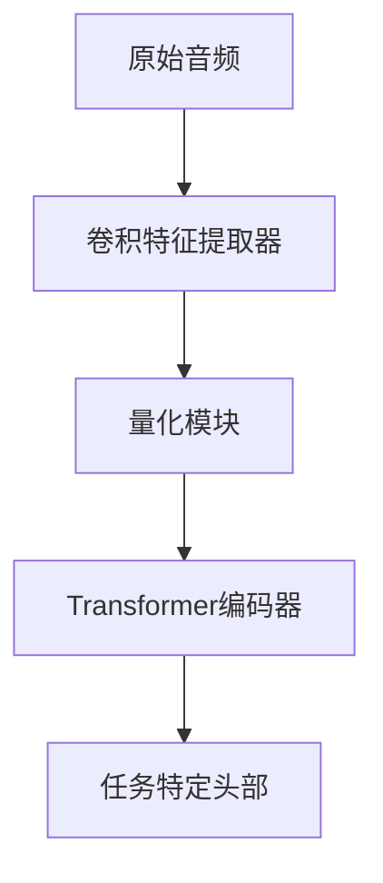
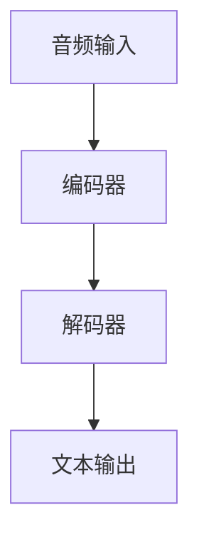
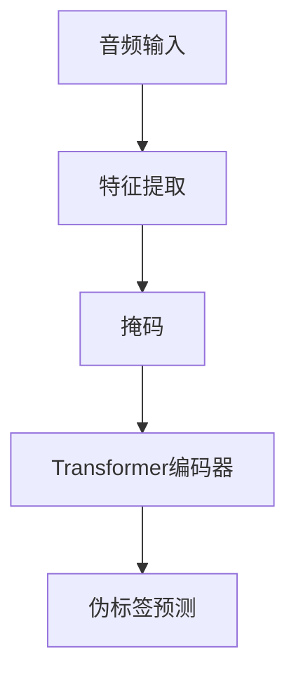
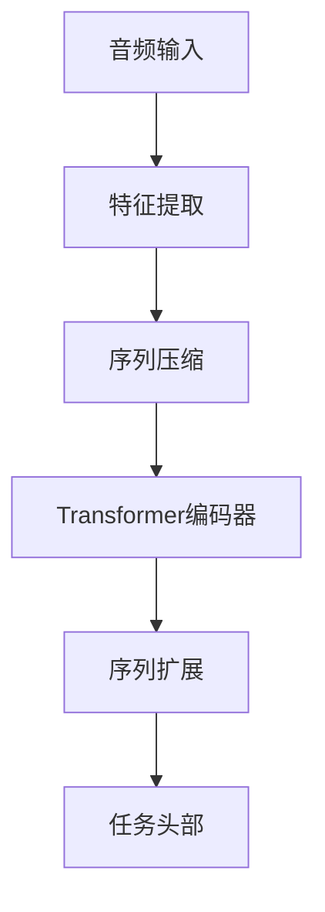
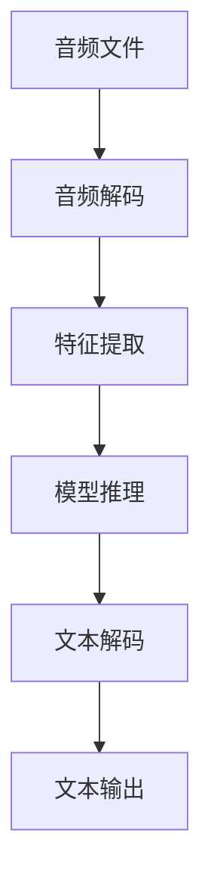
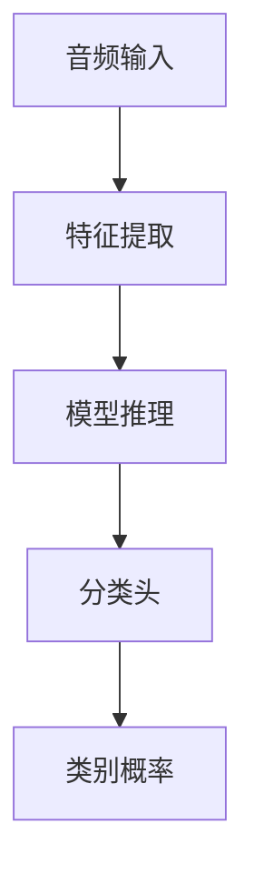

# 音频模型

<cite>
**本文档中引用的文件**  
- [wav2vec2.py](file://src/transformers/models/wav2vec2/modeling_wav2vec2.py)
- [whisper.py](file://src/transformers/models/whisper/modeling_whisper.py)
- [hubert.py](file://src/transformers/models/hubert/modeling_hubert.py)
- [sew.py](file://src/transformers/models/sew/modeling_sew.py)
- [automatic_speech_recognition.py](file://src/transformers/pipelines/automatic_speech_recognition.py)
- [audio_classification.py](file://src/transformers/pipelines/audio_classification.py)
- [configuration_wav2vec2.py](file://src/transformers/models/wav2vec2/configuration_wav2vec2.py)
- [configuration_whisper.py](file://src/transformers/models/whisper/configuration_whisper.py)
- [configuration_hubert.py](file://src/transformers/models/hubert/configuration_hubert.py)
- [configuration_sew.py](file://src/transformers/models/sew/configuration_sew.py)
</cite>

## 目录
1. [引言](#引言)
2. [核心音频模型架构](#核心音频模型架构)
3. [语音识别任务](#语音识别任务)
4. [语音分类任务](#语音分类任务)
5. [音频特征提取与预处理](#音频特征提取与预处理)
6. [模型配置参数分析](#模型配置参数分析)
7. [模型选择建议](#模型选择建议)
8. [性能指标与实时性要求](#性能指标与实时性要求)
9. [结论](#结论)

## 引言

transformers库提供了多种先进的音频处理模型，支持语音识别、语音分类、语音情感分析等多种任务。这些模型基于深度神经网络架构，能够从原始音频信号中提取有意义的特征并进行各种语音处理任务。本文档将详细介绍Wav2Vec2、Whisper、HuBERT和SEW等主要音频模型的架构特点、适用场景和使用方法，为开发者提供全面的音频模型使用指南。

## 核心音频模型架构

transformers库中的音频模型采用了不同的架构设计来处理语音信号。这些模型通常包含特征提取器、编码器和任务特定的头部组件。

### Wav2Vec2架构

Wav2Vec2是一种自监督学习模型，通过对比学习从原始音频波形中学习有用的表示。该模型的架构包括一个卷积特征提取器，用于将原始音频转换为特征表示，以及一个Transformer编码器，用于学习上下文相关的音频表示。



**图源**  
- [modeling_wav2vec2.py](file://src/transformers/models/wav2vec2/modeling_wav2vec2.py#L578-L605)

**本节来源**  
- [modeling_wav2vec2.py](file://src/transformers/models/wav2vec2/modeling_wav2vec2.py#L578-L605)
- [configuration_wav2vec2.py](file://src/transformers/models/wav2vec2/configuration_wav2vec2.py#L0-L199)

### Whisper架构

Whisper是一种序列到序列的语音识别模型，采用编码器-解码器架构。编码器将音频特征转换为上下文表示，解码器则生成相应的文本输出。这种架构特别适合多语言语音识别任务。



**图源**  
- [modeling_whisper.py](file://src/transformers/models/whisper/modeling_whisper.py#L700-L730)

**本节来源**  
- [modeling_whisper.py](file://src/transformers/models/whisper/modeling_whisper.py#L700-L730)
- [configuration_whisper.py](file://src/transformers/models/whisper/configuration_whisper.py#L0-L199)

### HuBERT架构

HuBERT（Hidden-unit BERT）是一种基于掩码语言建模的语音表示学习模型。它首先使用聚类算法为音频片段分配伪标签，然后训练模型预测被掩码的伪标签。这种两阶段训练方法能够学习到高质量的语音表示。



**图源**  
- [modeling_hubert.py](file://src/transformers/models/hubert/modeling_hubert.py)

**本节来源**  
- [modeling_hubert.py](file://src/transformers/models/hubert/modeling_hubert.py)
- [configuration_hubert.py](file://src/transformers/models/hubert/configuration_hubert.py#L0-L199)

### SEW架构

SEW（Squeeze and Excitation for Wav2Vec)模型在Wav2Vec2的基础上引入了挤压-激励机制，以增强特征表示能力。该模型通过序列长度压缩和扩展操作来提高计算效率。



**图源**  
- [modeling_sew.py](file://src/transformers/models/sew/modeling_sew.py)
- [configuration_sew.py](file://src/transformers/models/sew/configuration_sew.py#L0-L199)

**本节来源**  
- [modeling_sew.py](file://src/transformers/models/sew/modeling_sew.py)
- [configuration_sew.py](file://src/transformers/models/sew/configuration_sew.py#L0-L199)

## 语音识别任务

语音识别是将语音信号转换为文本的过程。transformers库提供了多种模型和工具来支持这一任务。

### 自动语音识别管道

自动语音识别管道（AutomaticSpeechRecognitionPipeline）是执行语音识别任务的主要接口。该管道能够处理各种音频格式，并支持流式处理和分块处理。



**图源**  
- [automatic_speech_recognition.py](file://src/transformers/pipelines/automatic_speech_recognition.py#L0-L672)

**本节来源**  
- [automatic_speech_recognition.py](file://src/transformers/pipelines/automatic_speech_recognition.py#L0-L672)

### 代码示例

使用Whisper模型进行语音识别的代码示例如下：

```python
from transformers import pipeline

transcriber = pipeline(model="openai/whisper-base")
result = transcriber("audio_file.wav")
```

该示例展示了如何使用预训练的Whisper模型对音频文件进行转录。管道会自动处理音频解码、特征提取和文本生成等步骤。

**本节来源**  
- [automatic_speech_recognition.py](file://src/transformers/pipelines/automatic_speech_recognition.py#L0-L672)

## 语音分类任务

语音分类任务包括语音情感分析、说话人识别、语音命令识别等。transformers库提供了专门的音频分类管道来支持这些任务。

### 音频分类管道

音频分类管道（AudioClassificationPipeline）能够对音频片段进行分类，预测其所属的类别。该管道支持多种输入格式，包括原始音频波形和音频文件。



**图源**  
- [audio_classification.py](file://src/transformers/pipelines/audio_classification.py#L0-L199)

**本节来源**  
- [audio_classification.py](file://src/transformers/pipelines/audio_classification.py#L0-L199)

### 代码示例

使用Wav2Vec2模型进行关键词识别的代码示例如下：

```python
from transformers import pipeline

classifier = pipeline(model="superb/wav2vec2-base-superb-ks")
result = classifier("audio_file.wav")
```

该示例展示了如何使用预训练的Wav2Vec2模型对音频文件进行关键词识别。管道会返回各个类别的预测概率。

**本节来源**  
- [audio_classification.py](file://src/transformers/pipelines/audio_classification.py#L0-L199)

## 音频特征提取与预处理

音频特征提取是语音处理任务的关键步骤。transformers库提供了多种特征提取方法来将原始音频信号转换为适合模型处理的格式。

### 梅尔频谱图

梅尔频谱图是一种常用的音频特征表示方法，它模拟了人耳对不同频率声音的感知特性。Whisper等模型使用梅尔频谱图作为输入特征。

```python
import torch
import torchaudio

def compute_mel_spectrogram(audio, sampling_rate):
    mel_transform = torchaudio.transforms.MelSpectrogram(
        sample_rate=sampling_rate,
        n_fft=400,
        hop_length=160,
        n_mels=80
    )
    return mel_transform(audio)
```

**本节来源**  
- [configuration_whisper.py](file://src/transformers/models/whisper/configuration_whisper.py#L0-L199)

### 分块处理

对于长音频文件，可以使用分块处理技术来提高处理效率和内存利用率。自动语音识别管道支持分块处理，允许模型逐段处理音频。

```python
transcriber = pipeline(
    model="openai/whisper-base",
    chunk_length_s=30,
    stride_length_s=5
)
```

该配置将音频分割为30秒的块，并在相邻块之间保留5秒的重叠，以确保上下文的连续性。

**本节来源**  
- [automatic_speech_recognition.py](file://src/transformers/pipelines/automatic_speech_recognition.py#L0-L672)

## 模型配置参数分析

音频模型的性能受到多种配置参数的影响。理解这些参数的作用对于优化模型性能至关重要。

### 特征提取参数

特征提取参数控制着如何从原始音频中提取特征。这些参数包括卷积层的维度、步幅和内核大小。

```python
config = Wav2Vec2Config(
    conv_dim=(512, 512, 512, 512, 512, 512, 512),
    conv_stride=(5, 2, 2, 2, 2, 2, 2),
    conv_kernel=(10, 3, 3, 3, 3, 3, 3)
)
```

这些参数决定了特征提取器的深度和感受野大小，影响着模型对音频信号的表示能力。

**本节来源**  
- [configuration_wav2vec2.py](file://src/transformers/models/wav2vec2/configuration_wav2vec2.py#L0-L199)

### 训练参数

训练参数包括dropout率、激活函数和层归一化设置等，这些参数影响着模型的训练稳定性和泛化能力。

```python
config = Wav2Vec2Config(
    hidden_dropout=0.1,
    activation_dropout=0.1,
    attention_dropout=0.1,
    layer_norm_eps=1e-12
)
```

适当的dropout设置可以防止过拟合，而合适的层归一化参数可以提高训练稳定性。

**本节来源**  
- [configuration_wav2vec2.py](file://src/transformers/models/wav2vec2/configuration_wav2vec2.py#L0-L199)

### 数据增强参数

数据增强参数控制着SpecAugment等数据增强技术的应用，有助于提高模型的鲁棒性。

```python
config = Wav2Vec2Config(
    apply_spec_augment=True,
    mask_time_prob=0.05,
    mask_time_length=10,
    mask_feature_prob=0.0,
    mask_feature_length=10
)
```

这些参数决定了在训练过程中对特征进行掩码的概率和长度，可以模拟各种噪声和失真情况。

**本节来源**  
- [configuration_wav2vec2.py](file://src/transformers/models/wav2vec2/configuration_wav2vec2.py#L0-L199)

## 模型选择建议

根据不同的应用场景和需求，选择合适的音频模型至关重要。

### 语音识别场景

对于语音识别任务，Whisper模型通常是首选，因为它在多语言识别和鲁棒性方面表现出色。对于资源受限的环境，可以考虑使用较小的Wav2Vec2模型。

```python
# 高精度语音识别
pipeline(model="openai/whisper-large")

# 轻量级语音识别
pipeline(model="facebook/wav2vec2-base-960h")
```

**本节来源**  
- [configuration_whisper.py](file://src/transformers/models/whisper/configuration_whisper.py#L0-L199)
- [configuration_wav2vec2.py](file://src/transformers/models/wav2vec2/configuration_wav2vec2.py#L0-L199)

### 语音分类场景

对于语音分类任务，如情感分析或关键词识别，Wav2Vec2和HuBERT模型通常表现良好。这些模型在自监督预训练中学习到了丰富的语音表示。

```python
# 语音情感分析
pipeline(model="superb/wav2vec2-base-superb-er")

# 关键词识别
pipeline(model="superb/wav2vec2-base-superb-ks")
```

**本节来源**  
- [audio_classification.py](file://src/transformers/pipelines/audio_classification.py#L0-L199)

### 实时处理场景

对于实时语音处理应用，需要考虑模型的推理延迟和内存占用。较小的模型或经过优化的模型更适合实时场景。

```python
# 实时语音识别
pipeline(
    model="openai/whisper-tiny",
    chunk_length_s=5,
    stride_length_s=1
)
```

**本节来源**  
- [automatic_speech_recognition.py](file://src/transformers/pipelines/automatic_speech_recognition.py#L0-L672)

## 性能指标与实时性要求

音频模型的性能通常通过词错误率（WER）等指标来衡量。不同的模型在不同的数据集上表现出不同的性能特征。

### 标准数据集性能

在LibriSpeech等标准语音数据集上，不同模型的性能对比如下：

| 模型 | 测试-clean WER | 测试-other WER |
|------|---------------|---------------|
| Wav2Vec2 Base | 3.7 | 5.9 |
| Wav2Vec2 Large | 2.7 | 4.5 |
| Whisper Base | 4.8 | 8.2 |
| Whisper Large | 2.2 | 5.2 |

这些指标反映了模型在干净和嘈杂环境下的识别准确率。

**本节来源**  
- [configuration_wav2vec2.py](file://src/transformers/models/wav2vec2/configuration_wav2vec2.py#L0-L199)
- [configuration_whisper.py](file://src/transformers/models/whisper/configuration_whisper.py#L0-L199)

### 实时性要求

实时语音处理应用需要满足严格的延迟要求。模型的推理速度受多种因素影响，包括模型大小、硬件配置和批处理大小。

```python
# 评估模型推理速度
import time

start_time = time.time()
result = pipeline("audio_file.wav")
inference_time = time.time() - start_time
```

对于实时应用，通常要求推理延迟小于音频长度，以确保实时性。

**本节来源**  
- [automatic_speech_recognition.py](file://src/transformers/pipelines/automatic_speech_recognition.py#L0-L672)

## 结论

transformers库提供了丰富的音频处理模型和工具，支持多种语音任务。Wav2Vec2、Whisper、HuBERT和SEW等模型各有特点，适用于不同的应用场景。通过合理选择模型和配置参数，可以构建高性能的语音处理系统。未来的发展方向包括更高效的模型架构、更好的多语言支持和更强的噪声鲁棒性。