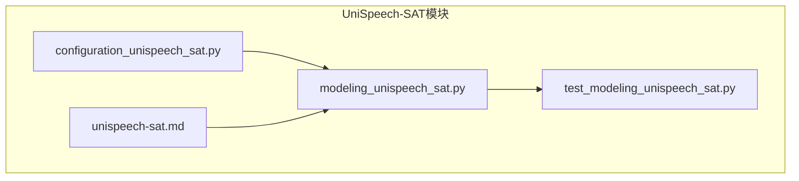
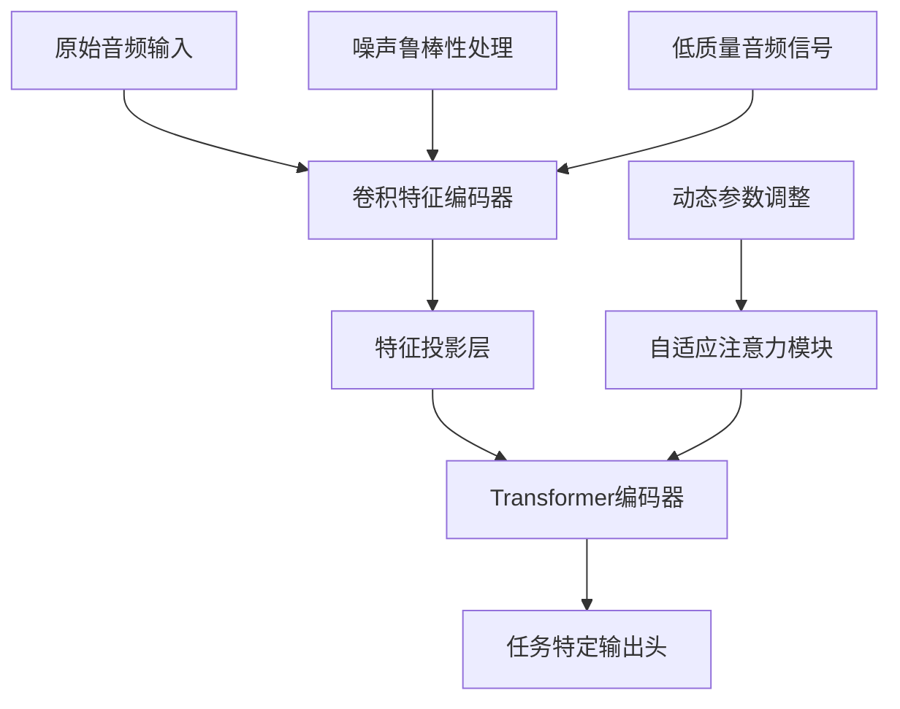
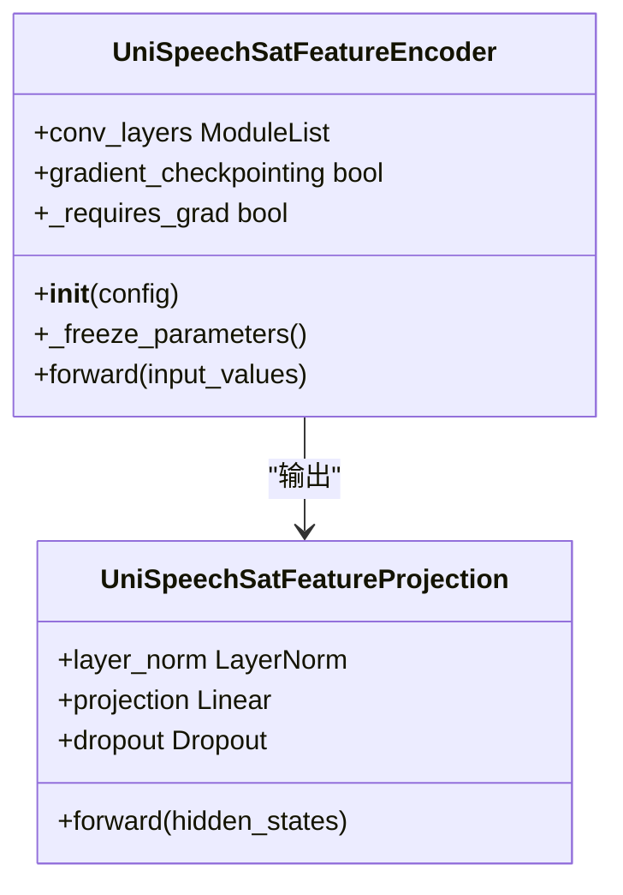
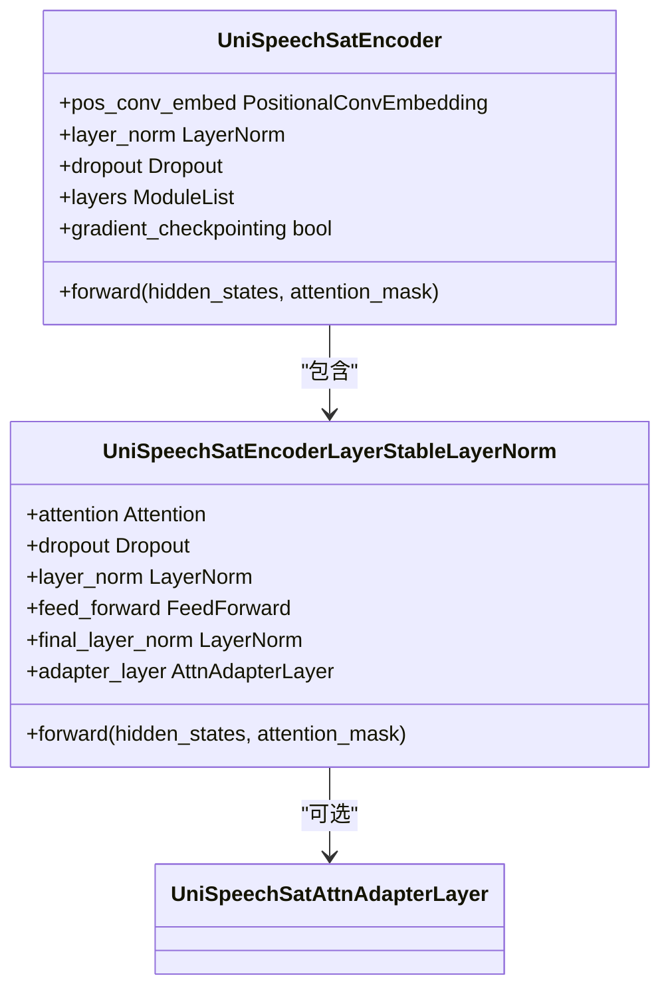
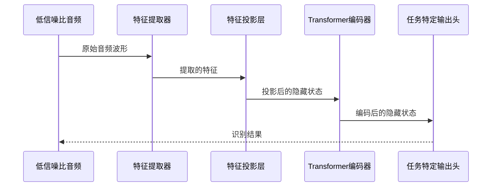
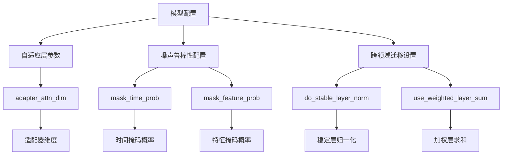
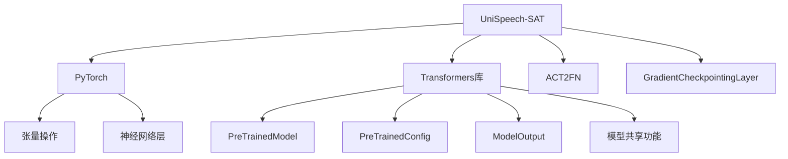

# UniSpeech-SAT模型

<cite>
**本文档中引用的文件**  
- [configuration_unispeech_sat.py](file://src/transformers/models/unispeech_sat/configuration_unispeech_sat.py)
- [modeling_unispeech_sat.py](file://src/transformers/models/unispeech_sat/modeling_unispeech_sat.py)
- [test_modeling_unispeech_sat.py](file://tests/models/unispeech_sat/test_modeling_unispeech_sat.py)
- [unispeech-sat.md](file://docs/source/en/model_doc/unispeech-sat.md)
</cite>

## 目录
1. [简介](#简介)
2. [项目结构](#项目结构)
3. [核心组件](#核心组件)
4. [架构概述](#架构概述)
5. [详细组件分析](#详细组件分析)
6. [依赖分析](#依赖分析)
7. [性能考虑](#性能考虑)
8. [故障排除指南](#故障排除指南)
9. [结论](#结论)

## 简介
UniSpeech-SAT是一种先进的语音表示学习模型，专为自适应语音识别和低资源语言理解任务设计。该模型通过结合说话人感知的预训练方法，在通用语音表示学习方面实现了最先进的性能。UniSpeech-SAT在说话人验证、说话人识别和说话人日志等任务中表现出色，特别适用于电话语音识别、远场语音理解和低资源方言识别等应用场景。模型采用自监督学习框架，能够利用大规模未标记数据进行训练，避免了大量人工标注的需求。

## 项目结构
UniSpeech-SAT模型在transformers库中的实现遵循模块化设计，主要包含配置、建模和测试三个核心组件。模型的实现基于HuBERT框架，并引入了多任务学习和话语混合策略来增强说话人信息提取能力。

**图示来源**
- [configuration_unispeech_sat.py](file://src/transformers/models/unispeech_sat/configuration_unispeech_sat.py)
- [modeling_unispeech_sat.py](file://src/transformers/models/unispeech_sat/modeling_unispeech_sat.py)
- [test_modeling_unispeech_sat.py](file://tests/models/unispeech_sat/test_modeling_unispeech_sat.py)
- [unispeech-sat.md](file://docs/source/en/model_doc/unispeech-sat.md)

**章节来源**
- [configuration_unispeech_sat.py](file://src/transformers/models/unispeech_sat/configuration_unispeech_sat.py)
- [modeling_unispeech_sat.py](file://src/transformers/models/unispeech_sat/modeling_unispeech_sat.py)

## 核心组件
UniSpeech-SAT模型的核心组件包括特征提取器、特征投影层、Transformer编码器和适配器模块。模型通过卷积神经网络从原始音频波形中提取特征，然后使用Transformer架构进行序列建模。自适应机制通过在注意力层中引入适配器模块实现，这些模块能够动态调整参数以适应不同的语音识别任务和低资源语言环境。

**章节来源**
- [modeling_unispeech_sat.py](file://src/transformers/models/unispeech_sat/modeling_unispeech_sat.py#L50-L1000)
- [configuration_unispeech_sat.py](file://src/transformers/models/unispeech_sat/configuration_unispeech_sat.py#L38-L193)

## 架构概述
UniSpeech-SAT模型的架构创新主要体现在其自适应Transformer结构和动态参数调整机制上。模型采用分层设计，首先通过卷积特征编码器处理原始音频信号，然后通过特征投影层将提取的特征映射到隐藏空间，最后由Transformer编码器进行序列建模。

**图示来源**
- [modeling_unispeech_sat.py](file://src/transformers/models/unispeech_sat/modeling_unispeech_sat.py#L200-L600)
- [configuration_unispeech_sat.py](file://src/transformers/models/unispeech_sat/configuration_unispeech_sat.py#L38-L193)

## 详细组件分析

### 特征提取与预处理分析
UniSpeech-SAT模型使用卷积特征编码器从原始音频波形中提取特征。该编码器由多个卷积层组成，每个层都包含卷积操作、归一化和激活函数。特征编码器支持两种归一化方式：组归一化（group normalization）和层归一化（layer normalization），这使得模型能够适应不同质量的音频输入。

**图示来源**
- [modeling_unispeech_sat.py](file://src/transformers/models/unispeech_sat/modeling_unispeech_sat.py#L200-L300)

### 自适应Transformer架构分析
UniSpeech-SAT的Transformer编码器采用了稳定的层归一化架构，这种设计在训练和推理过程中提供了更好的稳定性。编码器包含多个编码层，每个层都由多头注意力机制和前馈网络组成。自适应机制通过在注意力层中引入适配器模块实现，这些模块能够动态调整参数以适应不同的任务需求。

**图示来源**
- [modeling_unispeech_sat.py](file://src/transformers/models/unispeech_sat/modeling_unispeech_sat.py#L500-L800)

### 模型推理流程分析
UniSpeech-SAT模型的推理流程从加载低信噪比音频开始，经过特征提取、特征投影、掩码处理和Transformer编码等步骤，最终生成任务特定的输出。整个流程展示了模型在噪声环境下的鲁棒性处理能力。

**图示来源**
- [modeling_unispeech_sat.py](file://src/transformers/models/unispeech_sat/modeling_unispeech_sat.py#L600-L1000)
- [test_modeling_unispeech_sat.py](file://tests/models/unispeech_sat/test_modeling_unispeech_sat.py#L700-L859)

### 配置选项影响分析
UniSpeech-SAT模型的配置选项对自适应音频理解任务有重要影响。关键配置参数包括自适应层参数、噪声鲁棒性配置和跨领域迁移设置。这些配置选项允许开发者根据具体应用场景调整模型行为。

**图示来源**
- [configuration_unispeech_sat.py](file://src/transformers/models/unispeech_sat/configuration_unispeech_sat.py#L38-L193)

**章节来源**
- [configuration_unispeech_sat.py](file://src/transformers/models/unispeech_sat/configuration_unispeech_sat.py#L38-L193)

## 依赖分析
UniSpeech-SAT模型的实现依赖于多个核心组件和外部库。模型架构基于Transformer，依赖于PyTorch框架提供的张量操作和神经网络层。此外，模型还依赖于Hugging Face Transformers库的通用功能，如配置管理、预训练模型基类和输出数据结构。

**图示来源**
- [modeling_unispeech_sat.py](file://src/transformers/models/unispeech_sat/modeling_unispeech_sat.py#L1-L50)
- [configuration_unispeech_sat.py](file://src/transformers/models/unispeech_sat/configuration_unispeech_sat.py#L1-L30)

**章节来源**
- [modeling_unispeech_sat.py](file://src/transformers/models/unispeech_sat/modeling_unispeech_sat.py#L1-L50)
- [configuration_unispeech_sat.py](file://src/transformers/models/unispeech_sat/configuration_unispeech_sat.py#L1-L30)

## 性能考虑
UniSpeech-SAT模型在设计时考虑了多种性能优化策略。模型支持梯度检查点技术，可以在训练时减少内存占用。此外，模型实现了多种注意力机制的优化版本，包括FlashAttention和SDPA，以提高计算效率。对于大规模部署，模型还支持DeepSpeed和FSDP等分布式训练技术。

## 故障排除指南
在使用UniSpeech-SAT模型时，可能会遇到一些常见问题。对于音频输入问题，确保使用正确的采样率和音频格式。对于内存不足问题，可以启用梯度检查点或减少批量大小。对于训练不稳定问题，可以调整学习率或使用更小的初始权重。对于推理速度慢问题，可以考虑使用模型量化或知识蒸馏技术。

**章节来源**
- [modeling_unispeech_sat.py](file://src/transformers/models/unispeech_sat/modeling_unispeech_sat.py#L1000-L1780)
- [test_modeling_unispeech_sat.py](file://tests/models/unispeech_sat/test_modeling_unispeech_sat.py#L1-L860)

## 结论
UniSpeech-SAT模型通过创新的自适应Transformer结构和动态参数调整机制，在自适应语音识别和低资源语言理解任务中表现出色。模型的鲁棒性处理能力使其能够有效应对低质量音频信号，在电话语音识别、远场语音理解和低资源方言识别等实际应用场景中具有重要价值。开发者可以根据具体需求调整模型配置，通过微调和自适应学习策略进一步优化模型性能。