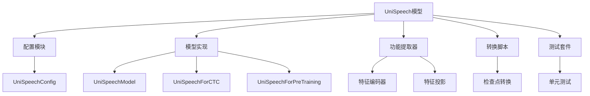
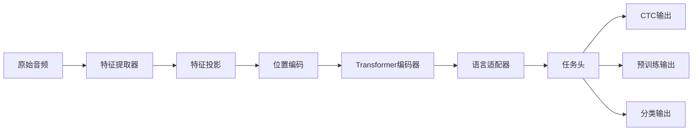
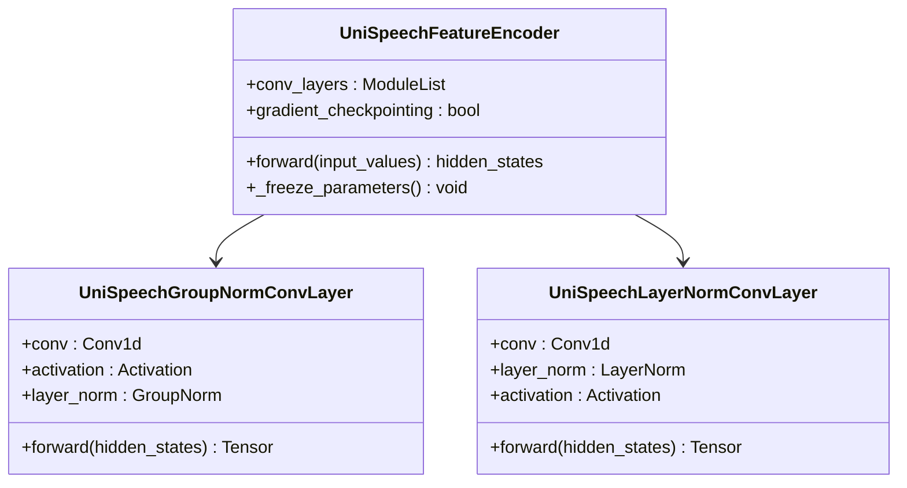
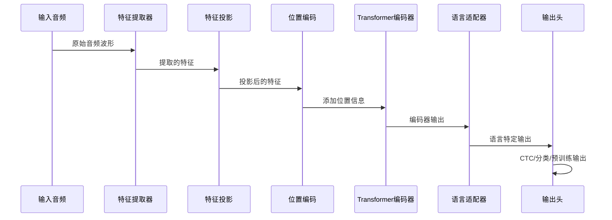
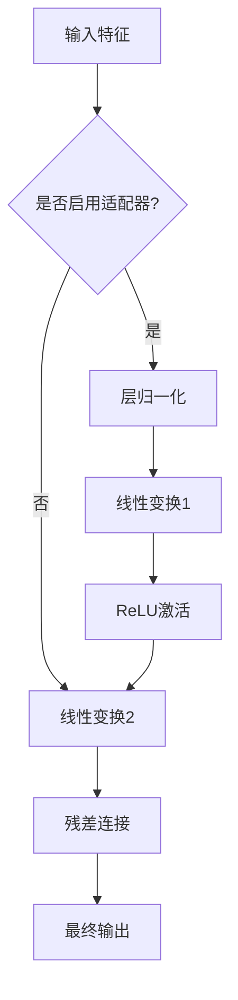
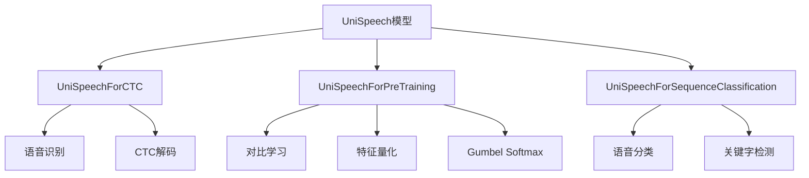
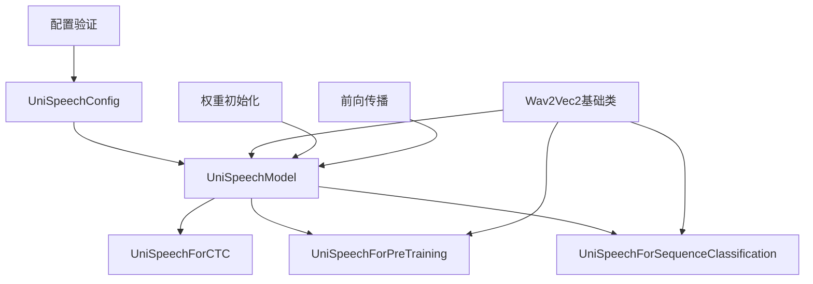

# UniSpeech模型详细文档

<cite>
**本文档中引用的文件**
- [modeling_unispeech.py](file://src/transformers/models/unispeech/modeling_unispeech.py)
- [configuration_unispeech.py](file://src/transformers/models/unispeech/configuration_unispeech.py)
- [modular_unispeech.py](file://src/transformers/models/unispeech/modular_unispeech.py)
- [unispeech.md](file://docs/source/en/model_doc/unispeech.md)
- [test_modeling_unispeech.py](file://tests/models/unispeech/test_modeling_unispeech.py)
- [convert_unispeech_original_pytorch_checkpoint_to_pytorch.py](file://src/transformers/models/unispeech/convert_unispeech_original_pytorch_checkpoint_to_pytorch.py)
</cite>

## 目录
1. [简介](#简介)
2. [项目结构](#项目结构)
3. [核心组件](#核心组件)
4. [架构概览](#架构概览)
5. [详细组件分析](#详细组件分析)
6. [依赖关系分析](#依赖关系分析)
7. [性能考虑](#性能考虑)
8. [故障排除指南](#故障排除指南)
9. [结论](#结论)

## 简介

UniSpeech（统一语音表示学习）是由微软研究院提出的一种先进的语音表示学习模型，首次发表于2021年。该模型通过联合预训练策略统一处理多种语言的语音信号，在跨语言语音识别和多语言语音理解任务中表现出色。

UniSpeech的核心创新在于其统一的预训练方法，结合了有监督的音素CTC学习和音素感知的对比自监督学习，采用多任务学习范式。这种设计使得UniSpeech能够捕获与音素结构更相关的信息，提高跨语言和跨领域的泛化能力。

## 项目结构

UniSpeech模型在transformers库中的组织结构如下：



**图表来源**
- [modeling_unispeech.py](file://src/transformers/models/unispeech/modeling_unispeech.py#L1-L50)
- [configuration_unispeech.py](file://src/transformers/models/unispeech/configuration_unispeech.py#L1-L30)

**章节来源**
- [modeling_unispeech.py](file://src/transformers/models/unispeech/modeling_unispeech.py#L1-L100)
- [configuration_unispeech.py](file://src/transformers/models/unispeech/configuration_unispeech.py#L1-L50)

## 核心组件

UniSpeech模型由以下核心组件构成：

### 1. 共享编码器架构
- **特征提取器**：负责从原始音频波形中提取特征
- **特征投影层**：将提取的特征投影到隐藏维度空间
- **Transformer编码器**：处理序列化的语音特征

### 2. 语言特定适配器模块
- **注意力适配器层**：为不同语言提供专门的适配器
- **目标语言支持**：支持通过`target_lang`参数指定目标语言
- **适配器权重加载**：动态加载对应语言的适配器权重

### 3. 多任务学习框架
- **CTC损失**：用于语音识别任务
- **对比损失**：用于自监督学习
- **量化损失**：用于特征量化

**章节来源**
- [modeling_unispeech.py](file://src/transformers/models/unispeech/modeling_unispeech.py#L850-L950)
- [configuration_unispeech.py](file://src/transformers/models/unispeech/configuration_unispeech.py#L150-L200)

## 架构概览

UniSpeech的整体架构采用端到端的设计，支持多种下游任务：



**图表来源**
- [modeling_unispeech.py](file://src/transformers/models/unispeech/modeling_unispeech.py#L850-L900)
- [modular_unispeech.py](file://src/transformers/models/unispeech/modular_unispeech.py#L200-L250)

## 详细组件分析

### 特征提取器组件

特征提取器是UniSpeech的第一层处理模块，负责将原始音频信号转换为可处理的特征表示：



**图表来源**
- [modeling_unispeech.py](file://src/transformers/models/unispeech/modeling_unispeech.py#L200-L350)
- [modular_unispeech.py](file://src/transformers/models/unispeech/modular_unispeech.py#L100-L150)

特征提取器支持两种归一化策略：
- **组归一化**：仅对第一个卷积层应用组归一化
- **层归一化**：对所有卷积层应用层归一化

**章节来源**
- [modeling_unispeech.py](file://src/transformers/models/unispeech/modeling_unispeech.py#L200-L300)

### 共享编码器架构

UniSpeech采用共享编码器架构，其中Transformer编码器是核心组件：



**图表来源**
- [modeling_unispeech.py](file://src/transformers/models/unispeech/modeling_unispeech.py#L850-L950)
- [modular_unispeech.py](file://src/transformers/models/unispeech/modular_unispeech.py#L200-L300)

**章节来源**
- [modeling_unispeech.py](file://src/transformers/models/unispeech/modeling_unispeech.py#L850-L1000)

### 语言适配器模块

语言适配器模块是UniSpeech的关键创新之一，允许模型针对特定语言进行优化：



**图表来源**
- [modeling_unispeech.py](file://src/transformers/models/unispeech/modeling_unispeech.py#L514-L557)
- [modular_unispeech.py](file://src/transformers/models/unispeech/modular_unispeech.py#L150-L200)

适配器模块的特点：
- **可选配置**：通过`adapter_attn_dim`参数控制是否启用
- **动态加载**：支持通过`target_lang`参数动态加载适配器
- **权重初始化**：采用特殊的权重初始化策略

**章节来源**
- [modeling_unispeech.py](file://src/transformers/models/unispeech/modeling_unispeech.py#L514-L580)

### 多任务学习框架

UniSpeech支持三种主要的任务类型：



**图表来源**
- [modeling_unispeech.py](file://src/transformers/models/unispeech/modeling_unispeech.py#L1185-L1200)
- [modeling_unispeech.py](file://src/transformers/models/unispeech/modeling_unispeech.py#L1021-L1050)

**章节来源**
- [modeling_unispeech.py](file://src/transformers/models/unispeech/modeling_unispeech.py#L1185-L1472)

## 依赖关系分析

UniSpeech模型的依赖关系体现了其模块化设计：



**图表来源**
- [configuration_unispeech.py](file://src/transformers/models/unispeech/configuration_unispeech.py#L250-L310)
- [modular_unispeech.py](file://src/transformers/models/unispeech/modular_unispeech.py#L150-L200)

主要依赖关系：
- **配置管理**：通过`UniSpeechConfig`统一管理模型参数
- **基础类继承**：继承自Wav2Vec2的基础类以复用功能
- **模块化设计**：支持灵活的功能组合和扩展

**章节来源**
- [configuration_unispeech.py](file://src/transformers/models/unispeech/configuration_unispeech.py#L250-L310)
- [modular_unispeech.py](file://src/transformers/models/unispeech/modular_unispeech.py#L150-L250)

## 性能考虑

UniSpeech在设计时充分考虑了性能优化：

### 计算效率
- **梯度检查点**：支持梯度检查点以减少内存占用
- **Flash Attention**：支持Flash Attention加速注意力计算
- **混合精度**：支持FP16和BF16训练

### 内存优化
- **层丢弃（LayerDrop）**：训练时随机丢弃部分层以提高鲁棒性
- **特征冻结**：支持冻结特征提取器以减少计算量
- **动态适配器**：按需加载语言适配器

### 扩展性
- **多语言支持**：通过适配器机制支持大量语言
- **任务灵活性**：支持多种下游任务
- **预训练策略**：结合有监督和无监督学习

## 故障排除指南

### 常见问题及解决方案

#### 1. 适配器加载失败
**问题描述**：无法加载特定语言的适配器权重
**解决方案**：
```python
# 检查配置中的适配器维度
if config.adapter_attn_dim is None:
    raise ValueError("配置中未定义适配器维度")

# 确保目标语言存在
model.load_adapter(target_lang="eng", force_load=True)
```

#### 2. 内存不足
**问题描述**：训练或推理时出现内存溢出
**解决方案**：
- 启用梯度检查点：`config.gradient_checkpointing = True`
- 使用混合精度训练
- 减少批次大小
- 冻结特征提取器

#### 3. 配置不匹配
**问题描述**：模型配置与预训练权重不兼容
**解决方案**：
- 验证词汇表大小：`config.vocab_size`
- 检查隐藏层维度：`config.hidden_size`
- 确认语言适配器配置

**章节来源**
- [modeling_unispeech.py](file://src/transformers/models/unispeech/modeling_unispeech.py#L1228-L1242)
- [configuration_unispeech.py](file://src/transformers/models/unispeech/configuration_unispeech.py#L250-L310)

## 结论

UniSpeech代表了语音表示学习领域的重要进展，通过统一的预训练策略成功地解决了跨语言语音识别和多语言语音理解的挑战。其主要优势包括：

### 技术创新
- **统一预训练**：结合有监督和无监督学习的优势
- **共享编码器**：减少参数量并提高泛化能力
- **语言适配器**：灵活的语言特定优化机制

### 实际应用价值
- **跨语言性能**：在多个语言上均取得优异表现
- **低资源适应**：支持低资源语言的语音识别
- **任务通用性**：适用于多种语音理解任务

### 发展前景
UniSpeech为后续的语音AI研究奠定了坚实基础，其设计理念和技术创新将继续影响语音处理领域的发展方向。随着多语言数据的不断积累和模型规模的持续扩大，UniSpeech有望在更多实际应用场景中发挥重要作用。