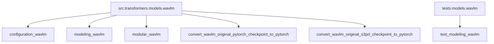
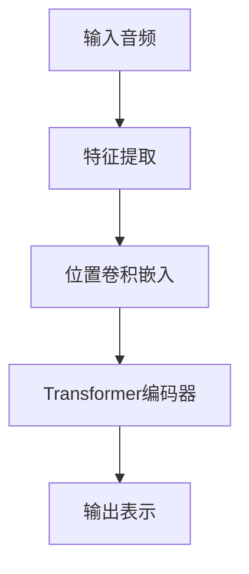
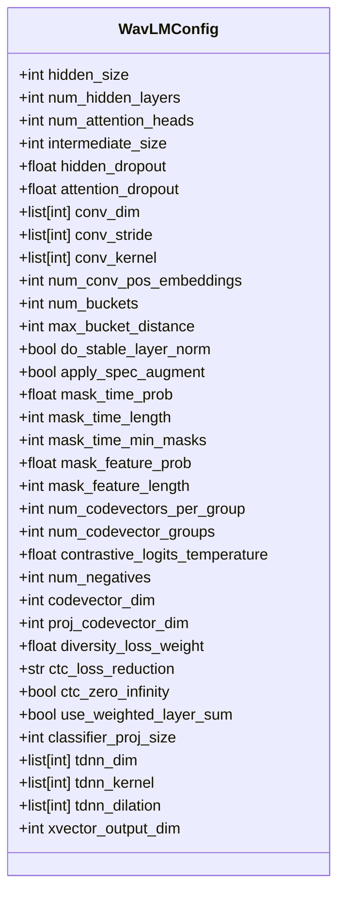
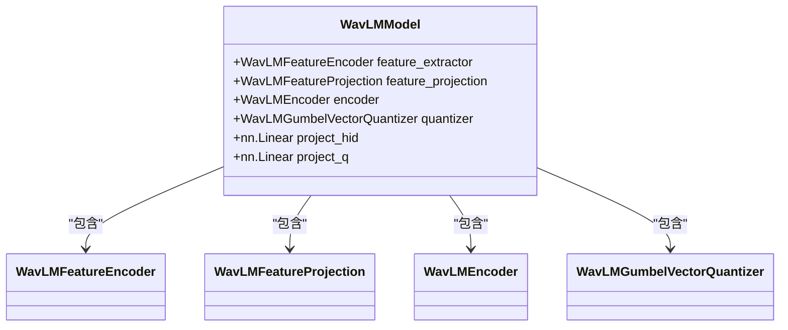
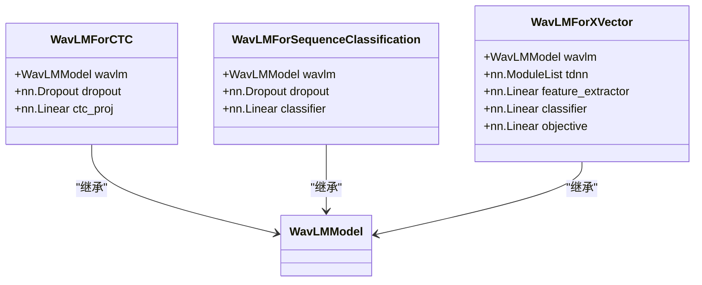
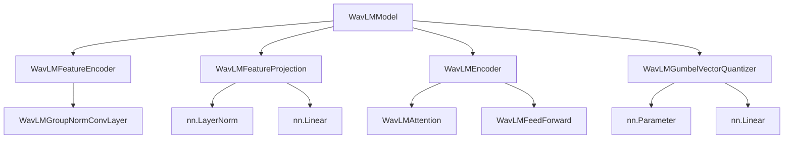

# WavLM模型

<cite>
**本文档引用的文件**
- [configuration_wavlm.py](file://src/transformers/models/wavlm/configuration_wavlm.py)
- [modeling_wavlm.py](file://src/transformers/models/wavlm/modeling_wavlm.py)
- [modular_wavlm.py](file://src/transformers/models/wavlm/modular_wavlm.py)
- [test_modeling_wavlm.py](file://tests/models/wavlm/test_modeling_wavlm.py)
- [convert_wavlm_original_pytorch_checkpoint_to_pytorch.py](file://src/transformers/models/wavlm/convert_wavlm_original_pytorch_checkpoint_to_pytorch.py)
- [convert_wavlm_original_s3prl_checkpoint_to_pytorch.py](file://src/transformers/models/wavlm/convert_wavlm_original_s3prl_checkpoint_to_pytorch.py)
- [README.md](file://examples/pytorch/speech-pretraining/README.md)
</cite>

## 目录
1. [简介](#简介)
2. [项目结构](#项目结构)
3. [核心组件](#核心组件)
4. [架构概述](#架构概述)
5. [详细组件分析](#详细组件分析)
6. [依赖分析](#依赖分析)
7. [性能考虑](#性能考虑)
8. [故障排除指南](#故障排除指南)
9. [结论](#结论)

## 简介
WavLM模型是一种先进的语音表示学习模型，专为语音情感分析、说话人识别和语音分类等任务设计。该模型基于Transformer架构，通过掩码语言建模预训练策略和对比学习方法来增强语音表征能力。WavLM模型能够从原始音频波形中提取特征，并利用深度神经网络进行高级语义理解。它支持多种下游任务，包括但不限于语音识别、说话人验证和音频事件检测。通过调整模型配置选项，如掩码比例、模型深度和注意力头数等参数，可以优化模型在特定音频理解场景中的表现。

## 项目结构
WavLM模型的实现位于`src/transformers/models/wavlm/`目录下，包含配置、建模和测试文件。此外，相关示例和转换脚本也提供了使用该模型的指导。

**图表来源**
- [configuration_wavlm.py](file://src/transformers/models/wavlm/configuration_wavlm.py)
- [modeling_wavlm.py](file://src/transformers/models/wavlm/modeling_wavlm.py)
- [modular_wavlm.py](file://src/transformers/models/wavlm/modular_wavlm.py)
- [convert_wavlm_original_pytorch_checkpoint_to_pytorch.py](file://src/transformers/models/wavlm/convert_wavlm_original_pytorch_checkpoint_to_pytorch.py)
- [convert_wavlm_original_s3prl_checkpoint_to_pytorch.py](file://src/transformers/models/wavlm/convert_wavlm_original_s3prl_checkpoint_to_pytorch.py)
- [test_modeling_wavlm.py](file://tests/models/wavlm/test_modeling_wavlm.py)

**章节来源**
- [configuration_wavlm.py](file://src/transformers/models/wavlm/configuration_wavlm.py)
- [modeling_wavlm.py](file://src/transformers/models/wavlm/modeling_wavlm.py)
- [modular_wavlm.py](file://src/transformers/models/wavlm/modular_wavlm.py)
- [convert_wavlm_original_pytorch_checkpoint_to_pytorch.py](file://src/transformers/models/wavlm/convert_wavlm_original_pytorch_checkpoint_to_pytorch.py)
- [convert_wavlm_original_s3prl_checkpoint_to_pytorch.py](file://src/transformers/models/wavlm/convert_wavlm_original_s3prl_checkpoint_to_pytorch.py)
- [test_modeling_wavlm.py](file://tests/models/wavlm/test_modeling_wavlm.py)

## 核心组件
WavLM模型的核心组件包括配置类`WavLMConfig`、建模类`WavLMModel`及其变体（如`WavLMForCTC`、`WavLMForSequenceClassification`等）。这些组件共同构成了一个完整的语音处理流水线，从音频文件加载到特征提取再到模型推理。`WavLMConfig`定义了模型的各种超参数，而`WavLMModel`则实现了基于Transformer的编码器结构，用于处理输入的音频特征。

**章节来源**
- [configuration_wavlm.py](file://src/transformers/models/wavlm/configuration_wavlm.py)
- [modeling_wavlm.py](file://src/transformers/models/wavlm/modeling_wavlm.py)

## 架构概述
WavLM模型采用了一种分层的架构设计，首先通过卷积神经网络(CNN)对原始音频信号进行预处理，然后将得到的特征送入基于Transformer的编码器中进行进一步处理。编码器由多个堆叠的编码层组成，每个编码层都包含自注意力机制和前馈神经网络。这种设计使得模型能够在不同时间尺度上捕捉语音信号的局部和全局特征。

**图表来源**
- [modeling_wavlm.py](file://src/transformers/models/wavlm/modeling_wavlm.py)

## 详细组件分析

### WavLM配置分析
`WavLMConfig`类定义了模型的所有配置参数，包括隐藏层大小、注意力头数、卷积层维度等。这些参数对于控制模型的复杂度和性能至关重要。

**图表来源**
- [configuration_wavlm.py](file://src/transformers/models/wavlm/configuration_wavlm.py#L1-L338)

**章节来源**
- [configuration_wavlm.py](file://src/transformers/models/wavlm/configuration_wavlm.py#L1-L338)

### WavLM模型分析
`WavLMModel`类实现了WavLM的核心功能，包括特征提取、位置卷积嵌入和Transformer编码器。该模型支持多种下游任务，可以通过微调适应不同的应用场景。

**图表来源**
- [modeling_wavlm.py](file://src/transformers/models/wavlm/modeling_wavlm.py#L1-L200)

**章节来源**
- [modeling_wavlm.py](file://src/transformers/models/wavlm/modeling_wavlm.py#L1-L200)

### 任务特定模型分析
WavLM提供了多种针对特定任务的模型变体，如`WavLMForCTC`用于连接时序分类，`WavLMForSequenceClassification`用于序列分类，以及`WavLMForXVector`用于说话人验证。

**图表来源**
- [modeling_wavlm.py](file://src/transformers/models/wavlm/modeling_wavlm.py#L1048-L1706)

**章节来源**
- [modeling_wavlm.py](file://src/transformers/models/wavlm/modeling_wavlm.py#L1048-L1706)

## 依赖分析
WavLM模型依赖于多个内部和外部组件，包括特征提取器、位置卷积嵌入、Transformer编码器和向量量化器。这些组件之间的依赖关系确保了模型能够有效地处理音频数据并生成高质量的语音表示。

**图表来源**
- [modeling_wavlm.py](file://src/transformers/models/wavlm/modeling_wavlm.py)
- [modular_wavlm.py](file://src/transformers/models/wavlm/modular_wavlm.py)

**章节来源**
- [modeling_wavlm.py](file://src/transformers/models/wavlm/modeling_wavlm.py)
- [modular_wavlm.py](file://src/transformers/models/wavlm/modular_wavlm.py)

## 性能考虑
在使用WavLM模型时，需要考虑多个性能因素，包括计算资源、内存占用和推理速度。为了优化性能，可以调整模型配置参数，如减少模型深度或降低隐藏层大小。此外，使用混合精度训练和推理也可以显著提高效率。

## 故障排除指南
当遇到WavLM模型相关的问题时，可以从以下几个方面入手：
1. 检查输入音频的采样率是否符合要求。
2. 确认特征提取器的配置与模型匹配。
3. 验证模型权重是否正确加载。
4. 检查是否有足够的GPU内存来运行模型。

**章节来源**
- [test_modeling_wavlm.py](file://tests/models/wavlm/test_modeling_wavlm.py)
- [convert_wavlm_original_pytorch_checkpoint_to_pytorch.py](file://src/transformers/models/wavlm/convert_wavlm_original_pytorch_checkpoint_to_pytorch.py)
- [convert_wavlm_original_s3prl_checkpoint_to_pytorch.py](file://src/transformers/models/wavlm/convert_wavlm_original_s3prl_checkpoint_to_pytorch.py)

## 结论
WavLM模型是一个强大的语音处理工具，适用于多种音频理解任务。通过深入理解其架构设计和配置选项，开发者可以更好地利用该模型解决实际问题。未来的工作可以集中在进一步优化模型性能和扩展其应用范围上。