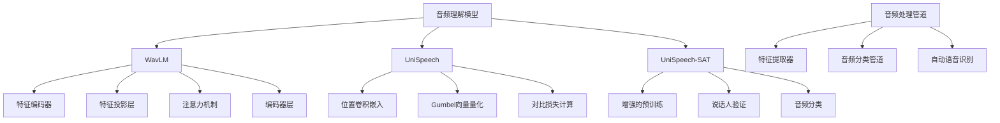
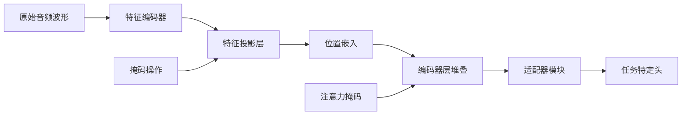
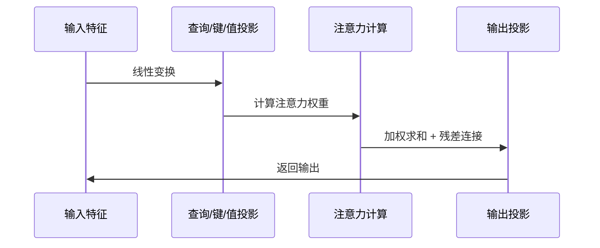
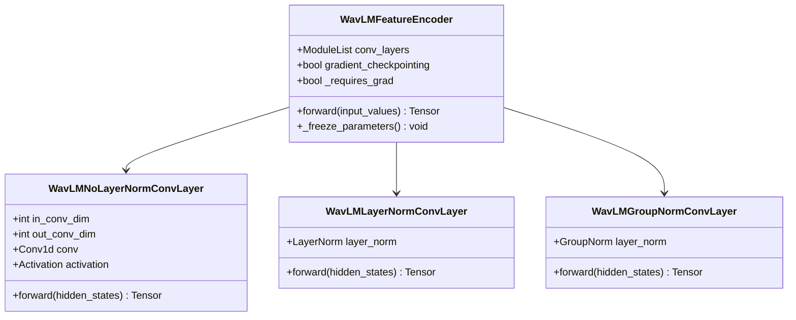
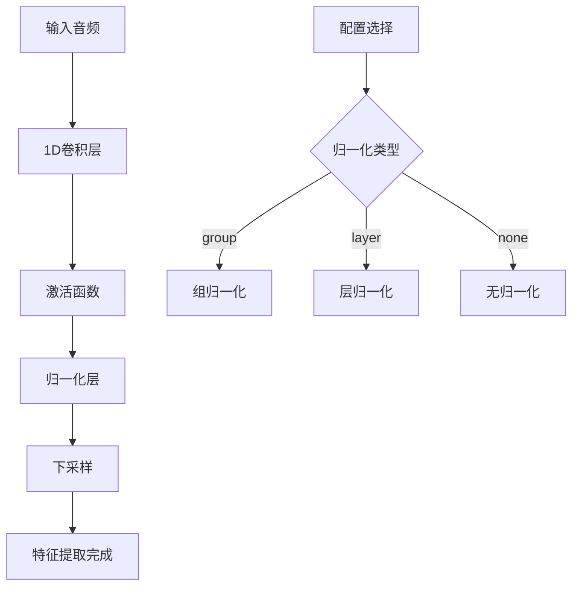
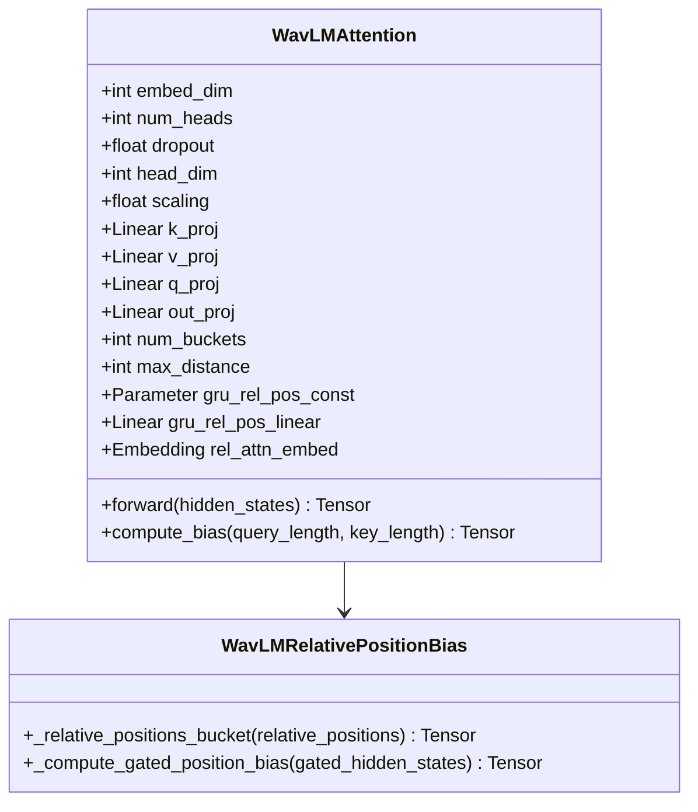
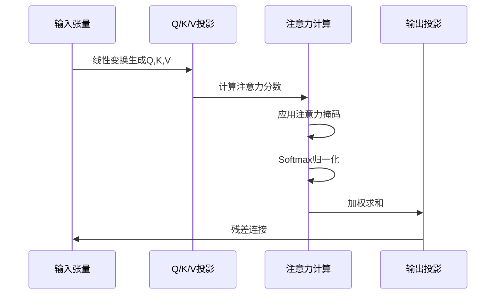
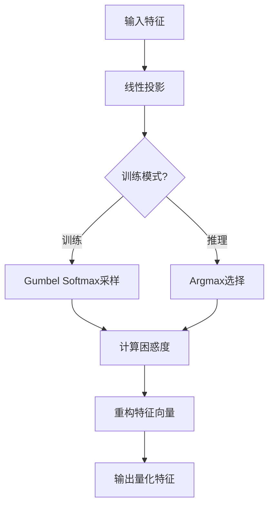
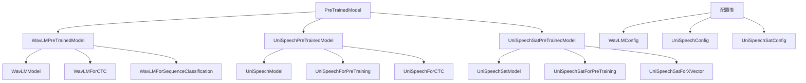

# 音频理解模型

<cite>
**本文档中引用的文件**
- [modeling_wavlm.py](file://src/transformers/models/wavlm/modeling_wavlm.py)
- [modeling_unispeech.py](file://src/transformers/models/unispeech/modeling_unispeech.py)
- [modeling_unispeech_sat.py](file://src/transformers/src/transformers/models/unispeech_sat/modeling_unispeech_sat.py)
- [configuration_wavlm.py](file://src/transformers/src/transformers/models/wavlm/configuration_wavlm.py)
- [audio_classification.py](file://src/transformers/src/transformers/pipelines/audio_classification.py)
- [test_modeling_unispeech_sat.py](file://tests/models/unispeech_sat/test_modeling_unispeech_sat.py)
- [test_modeling_wavlm.py](file://tests/models/wavlm/test_modeling_wavlm.py)
</cite>

## 目录
1. [简介](#简介)
2. [项目结构](#项目结构)
3. [核心组件](#核心组件)
4. [架构概览](#架构概览)
5. [详细组件分析](#详细组件分析)
6. [依赖关系分析](#依赖关系分析)
7. [性能考虑](#性能考虑)
8. [故障排除指南](#故障排除指南)
9. [结论](#结论)

## 简介

本文档详细介绍了Transformers库中的音频理解模型，重点涵盖了WavLM、UniSpeech和UniSpeech-SAT等先进的音频表示学习模型。这些模型通过多任务学习和跨语言预训练技术，在语音情感分析、说话人识别和语音分类等任务上展现出卓越性能。

音频理解模型的核心创新在于：
- **多任务学习框架**：同时支持语音识别、情感分析、说话人验证等多种任务
- **跨语言预训练**：利用大规模多语言数据进行预训练，提升泛化能力
- **先进的特征提取**：采用卷积神经网络和Transformer架构结合的方式提取音频特征
- **向量量化技术**：使用Gumbel Softmax进行离散化的特征表示

## 项目结构

音频理解模型在Transformers库中的组织结构如下：

**图表来源**
- [modeling_wavlm.py](file://src/transformers/models/wavlm/modeling_wavlm.py#L1-L100)
- [modeling_unispeech.py](file://src/transformers/src/transformers/models/unispeech/modeling_unispeech.py#L1-L100)
- [modeling_unispeech_sat.py](file://src/transformers/src/transformers/models/unispeech_sat/modeling_unispeech_sat.py#L1-L100)

**章节来源**
- [modeling_wavlm.py](file://src/transformers/src/transformers/models/wavlm/modeling_wavlm.py#L1-L50)
- [modeling_unispeech.py](file://src/transformers/src/transformers/models/unispeech/modeling_unispeech.py#L1-L50)
- [modeling_unispeech_sat.py](file://src/transformers/src/transformers/models/unispeech_sat/modeling_unispeech_sat.py#L1-L50)

## 核心组件

### WavLM模型架构

WavLM（Waveform Language Model）是微软开发的端到端语音理解模型，具有以下核心特性：

- **稳定的层归一化**：可选择使用稳定层归一化或标准层归一化
- **相对位置注意力**：引入相对位置偏置的多头注意力机制
- **特征增强**：支持多种特征提取范式（组归一化、层归一化）
- **适配器模块**：可选的卷积适配器用于下游任务微调

### UniSpeech模型特点

UniSpeech专注于统一的语音表示学习，其主要创新点包括：

- **Gumbel Softmax量化**：使用Gumbel Softmax进行离散化特征表示
- **对比学习**：通过对比损失学习有用的语音表示
- **掩码预测预训练**：采用掩码预测策略进行自监督学习
- **多头注意力**：支持解码器和编码器-解码器注意力

### UniSpeech-SAT增强功能

UniSpeech-SAT在UniSpeech基础上增加了说话人验证能力：

- **说话人嵌入**：专门设计的说话人验证头
- **标签嵌入**：支持多类别说话人识别
- **增强的预训练**：改进的对比学习和量化策略
- **XVector特征提取**：用于说话人验证的TDNN架构

**章节来源**
- [configuration_wavlm.py](file://src/transformers/src/transformers/models/wavlm/configuration_wavlm.py#L20-L100)
- [modeling_wavlm.py](file://src/transformers/src/transformers/models/wavlm/modeling_wavlm.py#L800-L900)

## 架构概览

### WavLM整体架构

**图表来源**
- [modeling_wavlm.py](file://src/transformers/src/transformers/models/wavlm/modeling_wavlm.py#L900-L1000)

### UniSpeech注意力机制

**图表来源**
- [modeling_unispeech.py](file://src/transformers/src/transformers/models/unispeech/modeling_unispeech.py#L400-L500)

**章节来源**
- [modeling_wavlm.py](file://src/transformers/src/transformers/models/wavlm/modeling_wavlm.py#L900-L1200)
- [modeling_unispeech.py](file://src/transformers/src/transformers/models/unispeech/modeling_unispeech.py#L400-L700)

## 详细组件分析

### 特征编码器组件

特征编码器负责从原始音频波形中提取有用的特征表示：

#### WavLM特征编码器

**图表来源**
- [modeling_wavlm.py](file://src/transformers/src/transformers/models/wavlm/modeling_wavlm.py#L600-L700)

#### UniSpeech特征提取流程

**图表来源**
- [modeling_unispeech.py](file://src/transformers/src/transformers/models/unispeech/modeling_unispeech.py#L200-L300)

**章节来源**
- [modeling_wavlm.py](file://src/transformers/src/transformers/models/wavlm/modeling_wavlm.py#L600-L800)
- [modeling_unispeech.py](file://src/transformers/src/transformers/models/unispeech/modeling_unispeech.py#L200-L400)

### 注意力机制组件

#### WavLM相对位置注意力

WavLM实现了创新的相对位置注意力机制：

**图表来源**
- [modeling_wavlm.py](file://src/transformers/src/transformers/models/wavlm/modeling_wavlm.py#L100-L300)

#### UniSpeech多头注意力

**图表来源**
- [modeling_unispeech.py](file://src/transformers/src/transformers/models/unispeech/modeling_unispeech.py#L300-L400)

**章节来源**
- [modeling_wavlm.py](file://src/transformers/src/transformers/models/wavlm/modeling_wavlm.py#L100-L400)
- [modeling_unispeech.py](file://src/transformers/src/transformers/models/unispeech/modeling_unispeech.py#L300-L600)

### 向量量化组件

#### Gumbel Softmax量化器

所有三个模型都采用了Gumbel Softmax进行向量量化：

**图表来源**
- [modeling_wavlm.py](file://src/transformers/src/transformers/models/wavlm/modeling_wavlm.py#L500-L600)

**章节来源**
- [modeling_wavlm.py](file://src/transformers/src/transformers/models/wavlm/modeling_wavlm.py#L500-L700)
- [modeling_unispeech.py](file://src/transformers/src/transformers/models/unispeech/modeling_unispeech.py#L600-L800)
- [modeling_unispeech_sat.py](file://src/transformers/src/transformers/models/unispeech_sat/modeling_unispeech_sat.py#L600-L800)

## 依赖关系分析

### 模型间依赖关系

**图表来源**
- [modeling_wavlm.py](file://src/transformers/src/transformers/models/wavlm/modeling_wavlm.py#L1-L50)
- [modeling_unispeech.py](file://src/transformers/src/transformers/models/unispeech/modeling_unispeech.py#L1-L50)
- [modeling_unispeech_sat.py](file://src/transformers/src/transformers/models/unispeech_sat/modeling_unispeech_sat.py#L1-L50)

### 外部依赖关系

音频理解模型依赖于多个外部库和组件：

- **PyTorch**：深度学习框架基础
- **NumPy**：数值计算支持
- **FFmpeg**：音频文件格式转换
- **Torchaudio**：音频处理工具
- **Transformers**：其他模型组件

**章节来源**
- [modeling_wavlm.py](file://src/transformers/src/transformers/models/wavlm/modeling_wavlm.py#L1-L50)
- [modeling_unispeech.py](file://src/transformers/src/transformers/models/unispeech/modeling_unispeech.py#L1-L50)
- [modeling_unispeech_sat.py](file://src/transformers/src/transformers/models/unispeech_sat/modeling_unispeech_sat.py#L1-L50)

## 性能考虑

### 内存优化策略

音频理解模型采用了多种内存优化技术：

1. **梯度检查点**：减少中间激活的存储需求
2. **混合精度训练**：使用FP16降低内存占用
3. **动态批处理**：根据序列长度调整批大小
4. **特征蒸馏**：压缩特征表示维度

### 计算效率优化

- **Flash Attention**：优化注意力计算复杂度
- **并行化处理**：多GPU训练支持
- **编译优化**：使用TorchScript加速推理
- **缓存机制**：重用中间计算结果

### 推理性能优化

- **模型剪枝**：移除冗余参数
- **知识蒸馏**：使用教师模型指导学生模型
- **量化技术**：INT8/FP16量化
- **批处理推理**：批量处理多个音频样本

## 故障排除指南

### 常见问题及解决方案

#### 内存不足错误

**问题描述**：训练或推理时出现CUDA内存不足

**解决方案**：
1. 减少批次大小
2. 启用梯度检查点
3. 使用混合精度训练
4. 降低序列长度

#### 音频格式不兼容

**问题描述**：无法正确加载音频文件

**解决方案**：
1. 确保安装FFmpeg
2. 检查音频采样率是否匹配
3. 转换音频格式为WAV或FLAC
4. 使用正确的采样率参数

#### 模型加载失败

**问题描述**：预训练模型下载或加载失败

**解决方案**：
1. 检查网络连接
2. 验证模型名称拼写
3. 清理缓存目录
4. 手动下载模型文件

**章节来源**
- [audio_classification.py](file://src/transformers/src/transformers/pipelines/audio_classification.py#L100-L200)

## 结论

WavLM、UniSpeech和UniSpeech-SAT代表了音频理解领域的最新进展，它们通过创新的架构设计和训练策略，在多个音频理解任务上取得了显著成果。这些模型的主要优势包括：

1. **强大的特征提取能力**：结合卷积神经网络和Transformer架构
2. **多任务学习支持**：统一的框架支持多种音频理解任务
3. **跨语言泛化能力**：在多语言数据上预训练获得更好的泛化性能
4. **高效的训练策略**：对比学习和掩码预测预训练方法
5. **灵活的部署选项**：支持推理优化和模型压缩

对于开发者而言，这些模型提供了完整的解决方案，从特征提取到任务特定的头部，从预训练到微调，涵盖了音频理解应用的各个方面。通过合理的配置和优化，可以在各种实际应用场景中获得优异的性能表现。

未来的改进方向可能包括：
- 更高效的注意力机制
- 更强的跨模态融合能力
- 更好的小样本学习能力
- 更优的实时处理性能