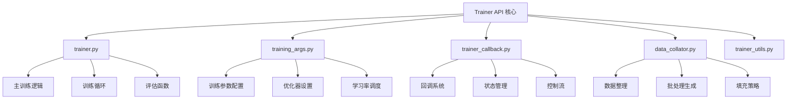
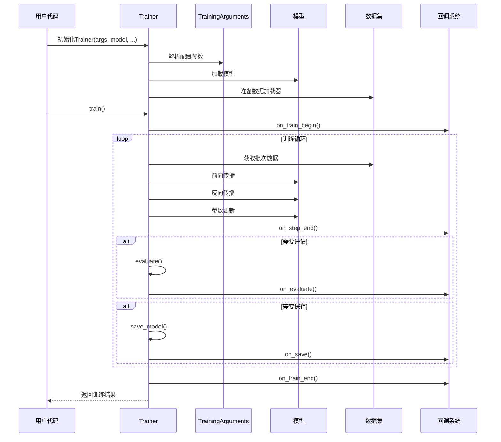
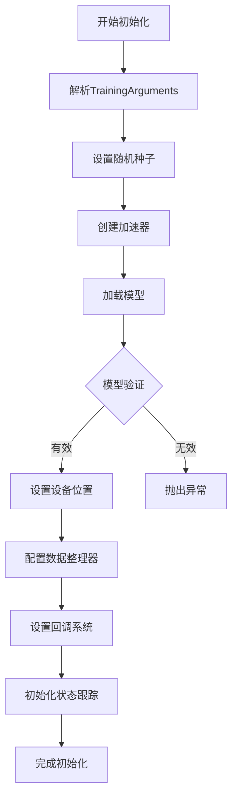
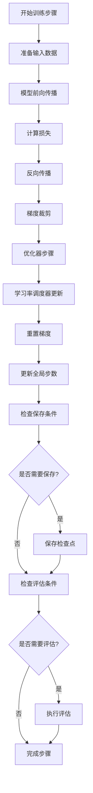
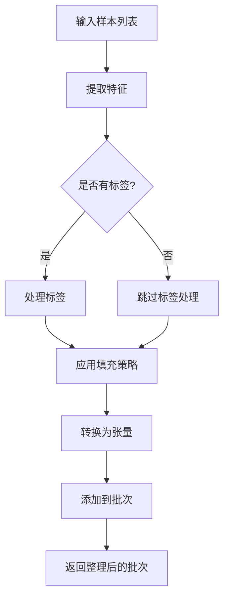
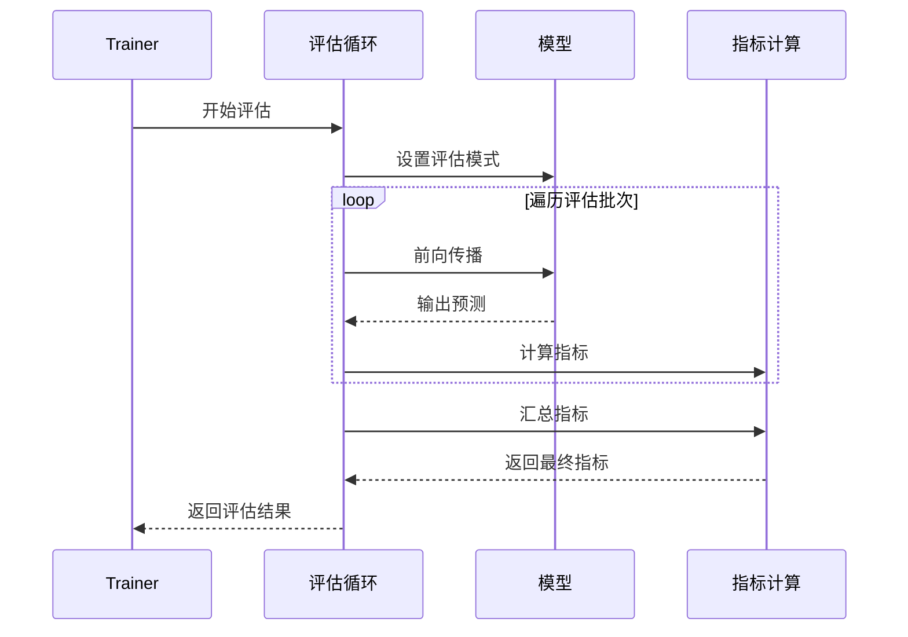
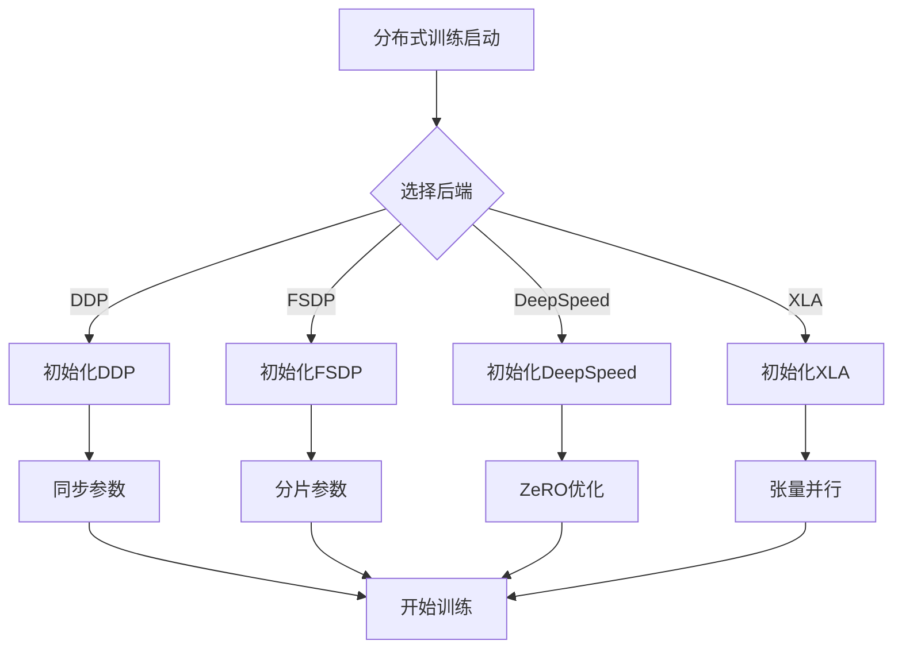
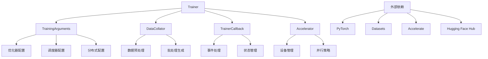

# Trainer API 详细文档

<cite>
**本文档中引用的文件**
- [trainer.py](file://src/transformers/trainer.py)
- [training_args.py](file://src/transformers/training_args.py)
- [trainer_callback.py](file://src/transformers/trainer_callback.py)
- [data_collator.py](file://src/transformers/data/data_collator.py)
- [trainer_utils.py](file://src/transformers/trainer_utils.py)
- [run_classification.py](file://examples/pytorch/text-classification/run_classification.py)
</cite>

## 目录
1. [简介](#简介)
2. [项目结构](#项目结构)
3. [核心组件](#核心组件)
4. [架构概览](#架构概览)
5. [详细组件分析](#详细组件分析)
6. [依赖关系分析](#依赖关系分析)
7. [性能考虑](#性能考虑)
8. [故障排除指南](#故障排除指南)
9. [结论](#结论)

## 简介

Trainer API是Hugging Face Transformers库中的核心训练框架，提供了简单但功能完整的PyTorch训练和评估循环，专为🤗 Transformers模型优化。它简化了模型训练过程，支持多种训练策略、分布式训练、回调系统和灵活的配置选项。

Trainer API的主要特点：
- 统一的训练接口，支持多种任务类型
- 内置分布式训练支持
- 灵活的回调系统
- 自动检查点管理
- 多种优化器和调度器选择
- 数据整理器集成
- 性能监控和日志记录

## 项目结构

Trainer API的核心文件组织结构如下：

**图表来源**
- [trainer.py](file://src/transformers/trainer.py#L1-L100)
- [training_args.py](file://src/transformers/training_args.py#L1-L50)
- [trainer_callback.py](file://src/transformers/trainer_callback.py#L1-L50)

## 核心组件

### Trainer 类

Trainer类是整个训练框架的核心，负责协调模型训练、评估和预测过程。

**主要属性：**
- `model`: 要训练或评估的模型
- `args`: 训练参数配置
- `data_collator`: 数据整理器
- `train_dataset`: 训练数据集
- `eval_dataset`: 评估数据集
- `processing_class`: 处理类（如分词器）
- `compute_metrics`: 评估指标计算函数

**重要方法：**
- `train()`: 开始训练过程
- `evaluate()`: 执行评估
- `predict()`: 进行预测
- `save_model()`: 保存模型
- `create_optimizer_and_scheduler()`: 创建优化器和调度器

**章节来源**
- [trainer.py](file://src/transformers/trainer.py#L200-L400)

### TrainingArguments 类

TrainingArguments类包含了训练过程中的所有配置选项。

**关键配置类别：**

#### 基本训练参数
- `output_dir`: 模型输出目录
- `do_train`: 是否执行训练
- `do_eval`: 是否执行评估
- `per_device_train_batch_size`: 每设备训练批次大小
- `per_device_eval_batch_size`: 每设备评估批次大小
- `gradient_accumulation_steps`: 梯度累积步数

#### 学习率和优化器配置
- `learning_rate`: 初始学习率
- `weight_decay`: 权重衰减
- `adam_beta1`: Adam优化器beta1参数
- `adam_beta2`: Adam优化器beta2参数
- `adam_epsilon`: Adam优化器epsilon参数
- `max_grad_norm`: 最大梯度范数

#### 训练策略配置
- `num_train_epochs`: 训练轮数
- `max_steps`: 最大训练步数
- `lr_scheduler_type`: 学习率调度器类型
- `warmup_steps`: 预热步数
- `warmup_ratio`: 预热比例

**章节来源**
- [training_args.py](file://src/transformers/training_args.py#L200-L600)

### 回调系统

Trainer API提供了强大的回调系统，允许用户自定义训练过程中的各种事件处理。

**核心回调类：**
- `TrainerCallback`: 基础回调类
- `DefaultFlowCallback`: 默认流程回调
- `ProgressCallback`: 进度显示回调
- `PrinterCallback`: 日志打印回调
- `EarlyStoppingCallback`: 早停回调

**回调事件：**
- `on_init_end`: 初始化结束
- `on_train_begin`: 训练开始
- `on_train_end`: 训练结束
- `on_epoch_begin`:  epoch开始
- `on_epoch_end`: epoch结束
- `on_step_begin`: 步骤开始
- `on_step_end`: 步骤结束
- `on_evaluate`: 评估后
- `on_save`: 保存后
- `on_log`: 日志记录后

**章节来源**
- [trainer_callback.py](file://src/transformers/trainer_callback.py#L200-L400)

## 架构概览

Trainer API采用模块化设计，各组件职责明确：

**图表来源**
- [trainer.py](file://src/transformers/trainer.py#L3500-L3700)
- [trainer_callback.py](file://src/transformers/trainer_callback.py#L400-L600)

## 详细组件分析

### 训练流程详解

#### 初始化阶段
Trainer的初始化过程包括多个关键步骤：

**图表来源**
- [trainer.py](file://src/transformers/trainer.py#L500-L700)

#### 训练循环实现
训练循环是Trainer的核心，负责执行前向传播、反向传播和参数更新：

**图表来源**
- [trainer.py](file://src/transformers/trainer.py#L3700-L3900)

**章节来源**
- [trainer.py](file://src/transformers/trainer.py#L3500-L4000)

### 数据整理器系统

数据整理器负责将原始数据转换为模型可接受的格式。

#### 主要数据整理器类型

| 数据整理器 | 用途 | 特点 |
|-----------|------|------|
| `DefaultDataCollator` | 基础数据整理 | 处理标签字段，自动张量转换 |
| `DataCollatorWithPadding` | 动态填充 | 根据序列长度动态填充 |
| `DataCollatorForTokenClassification` | 分类任务 | 支持标签填充 |
| `DataCollatorForLanguageModeling` | 语言建模 | 支持掩码语言建模 |
| `DataCollatorForSeq2Seq` | 序列到序列 | 支持编码器-解码器结构 |

#### 数据整理流程

**图表来源**
- [data_collator.py](file://src/transformers/data/data_collator.py#L100-L300)

**章节来源**
- [data_collator.py](file://src/transformers/data/data_collator.py#L1-L400)

### 评估机制

Trainer提供了灵活的评估机制，支持多种评估策略：

#### 评估策略配置

| 策略类型 | 描述 | 使用场景 |
|---------|------|----------|
| `no` | 不进行评估 | 快速训练，仅关注训练损失 |
| `steps` | 按步数评估 | 定期监控训练进度 |
| `epoch` | 按epoch评估 | 训练结束时评估性能 |

#### 评估流程

**图表来源**
- [trainer.py](file://src/transformers/trainer.py#L4200-L4400)

**章节来源**
- [trainer.py](file://src/transformers/trainer.py#L4000-L4200)

### 分布式训练支持

Trainer内置了对多种分布式训练后端的支持：

#### 支持的分布式策略

| 后端 | 描述 | 适用场景 |
|------|------|----------|
| `DDP` | 数据并行 | 单节点多GPU |
| `FSDP` | 参数分片 | 大模型训练 |
| `DeepSpeed` | 混合精度 | 超大模型训练 |
| `XLA` | 张量并行 | TPU训练 |

#### 分布式训练配置

**图表来源**
- [trainer.py](file://src/transformers/trainer.py#L1000-L1200)

**章节来源**
- [trainer.py](file://src/transformers/trainer.py#L800-L1000)

## 依赖关系分析

Trainer API的依赖关系复杂但结构清晰：

**图表来源**
- [trainer.py](file://src/transformers/trainer.py#L1-L100)
- [training_args.py](file://src/transformers/training_args.py#L1-L50)

**章节来源**
- [trainer.py](file://src/transformers/trainer.py#L1-L200)

## 性能考虑

### 内存优化策略

1. **梯度检查点**: 通过`gradient_checkpointing`参数启用
2. **混合精度**: 支持`fp16`和`bf16`训练
3. **参数分片**: FSDP和DeepSpeed支持
4. **动态批处理**: 根据可用内存调整批次大小

### 训练加速技术

1. **编译优化**: PyTorch 2.0编译支持
2. **并行策略**: 多种分布式训练方式
3. **数据流水线**: 异步数据加载
4. **缓存优化**: 智能内存管理

### 性能监控

Trainer提供了全面的性能监控功能：

- 浮点运算统计
- 内存使用情况
- 训练速度指标
- 评估时间统计

## 故障排除指南

### 常见问题及解决方案

#### 内存不足问题

**症状**: CUDA out of memory错误
**解决方案**:
1. 减少批次大小
2. 启用梯度检查点
3. 使用混合精度训练
4. 启用FSDP参数分片

#### 训练不稳定

**症状**: 损失震荡或发散
**解决方案**:
1. 降低学习率
2. 增加梯度裁剪
3. 检查数据质量
4. 调整预热策略

#### 分布式训练问题

**症状**: 进度条不一致或死锁
**解决方案**:
1. 检查网络连接
2. 验证环境变量
3. 使用正确的后端
4. 检查GPU可见性

#### 回调系统问题

**症状**: 回调未按预期执行
**解决方案**:
1. 检查回调注册
2. 验证回调函数签名
3. 查看日志输出
4. 使用默认回调作为基准

**章节来源**
- [trainer.py](file://src/transformers/trainer.py#L4000-L4200)

## 结论

Trainer API为Hugging Face Transformers库提供了强大而灵活的训练框架。其模块化设计使得用户能够轻松定制训练过程，同时保持代码的简洁性和可维护性。

### 主要优势

1. **易用性**: 统一的接口设计，减少样板代码
2. **灵活性**: 丰富的配置选项和扩展机制
3. **性能**: 内置多种优化技术和监控工具
4. **可靠性**: 完善的错误处理和恢复机制

### 最佳实践建议

1. **合理配置**: 根据任务特点选择合适的参数
2. **监控训练**: 利用回调系统实时监控训练状态
3. **资源管理**: 合理分配计算资源，避免浪费
4. **版本控制**: 使用Hugging Face Hub管理模型版本

Trainer API的设计体现了现代机器学习框架的发展趋势，既满足了初学者的快速上手需求，也为经验丰富的研究者提供了深度定制的能力。随着Transformer模型的不断发展，Trainer API也将持续演进，为用户提供更好的训练体验。