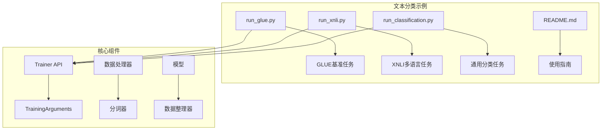
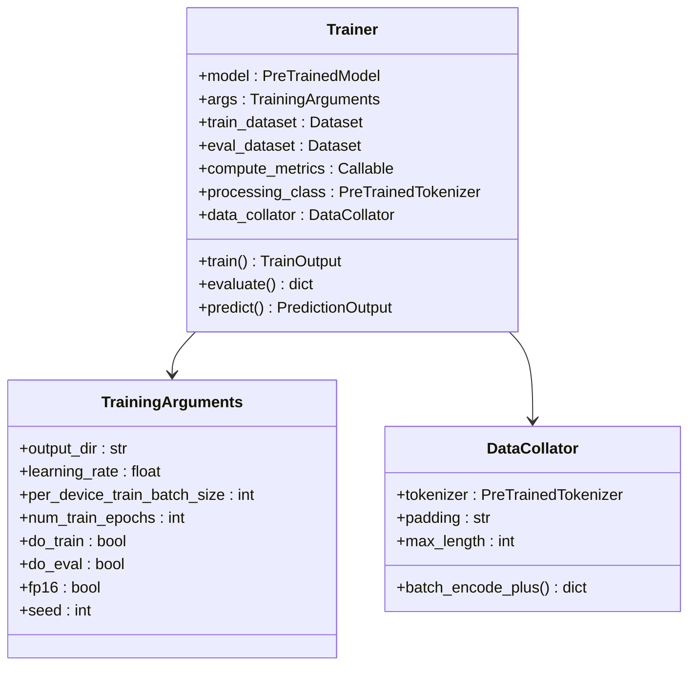
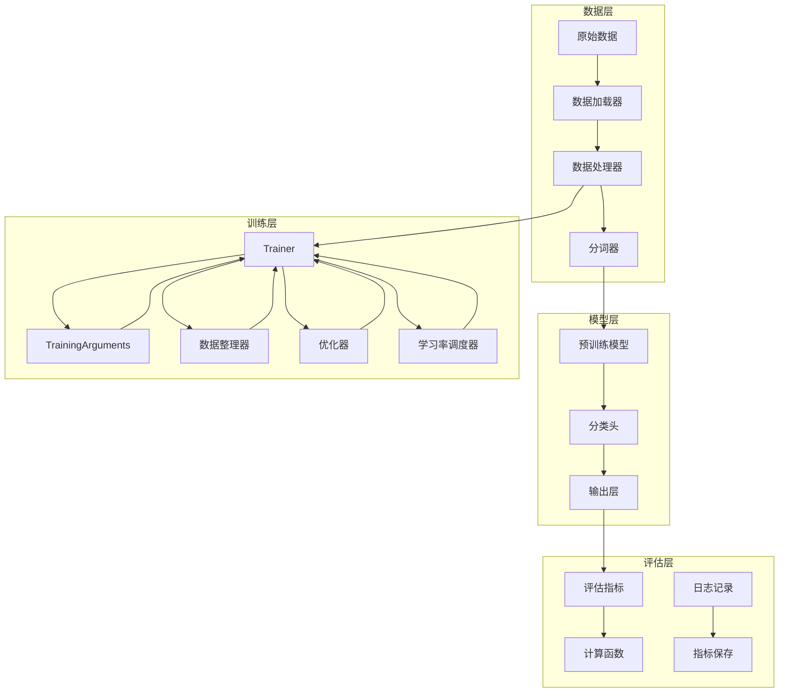
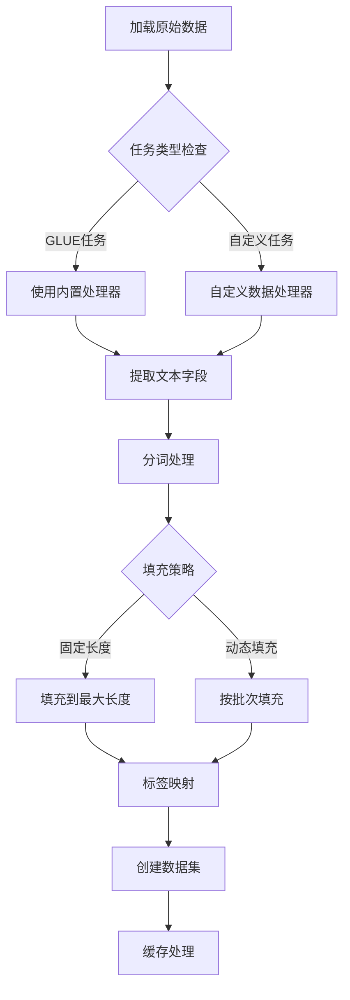
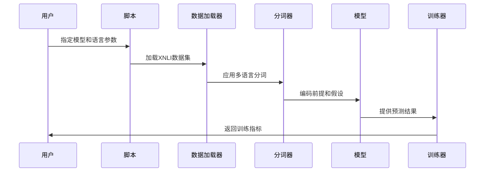
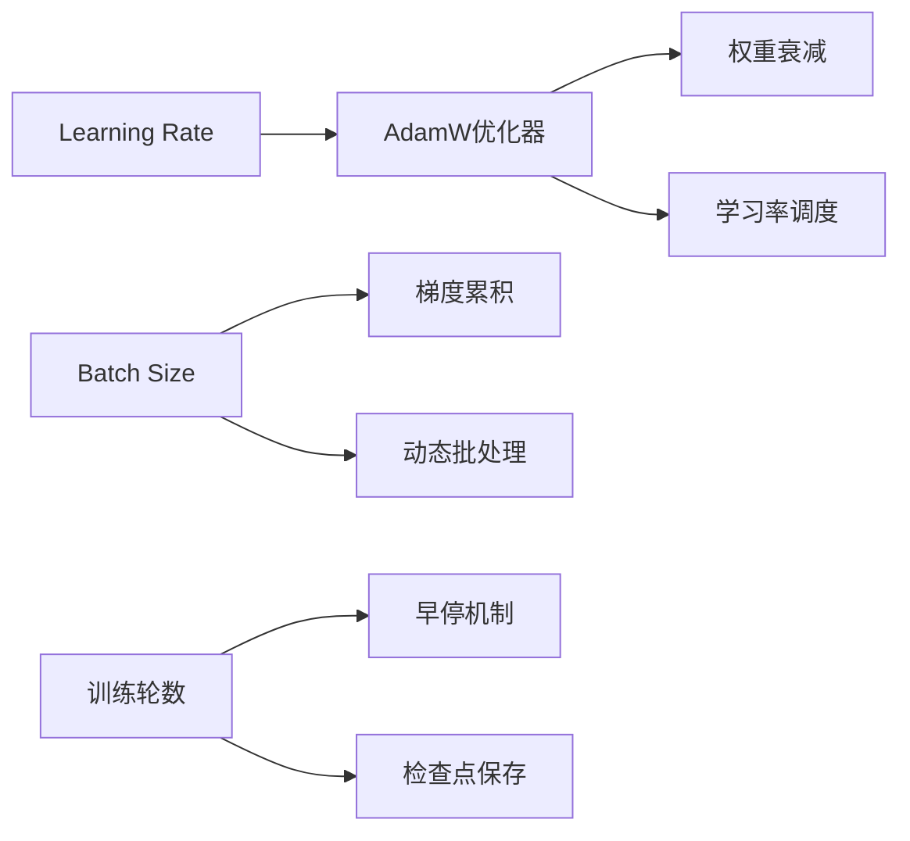
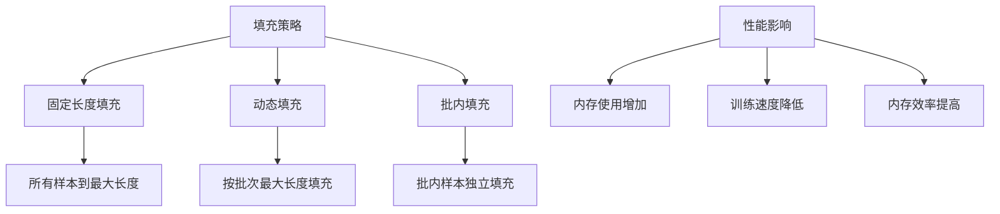
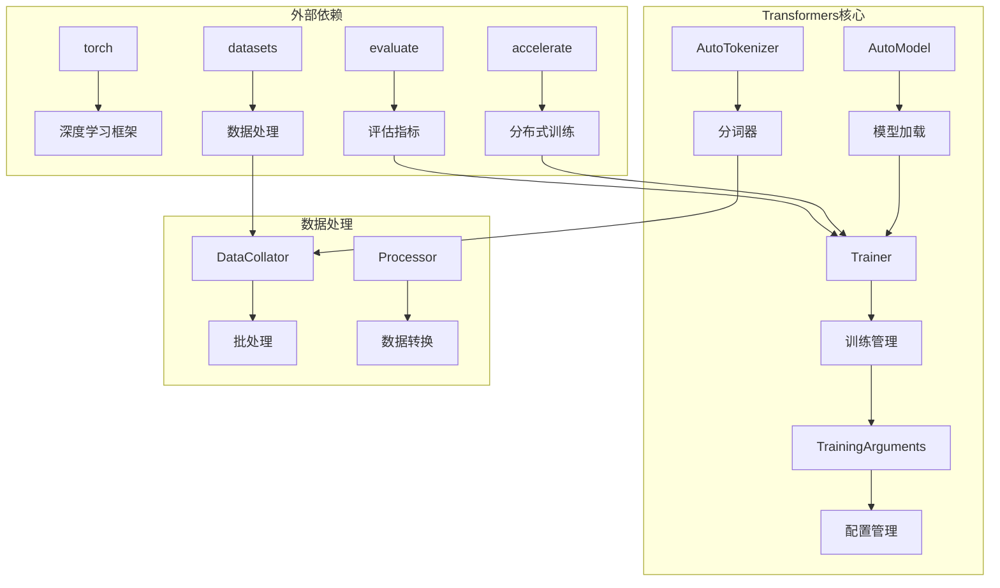
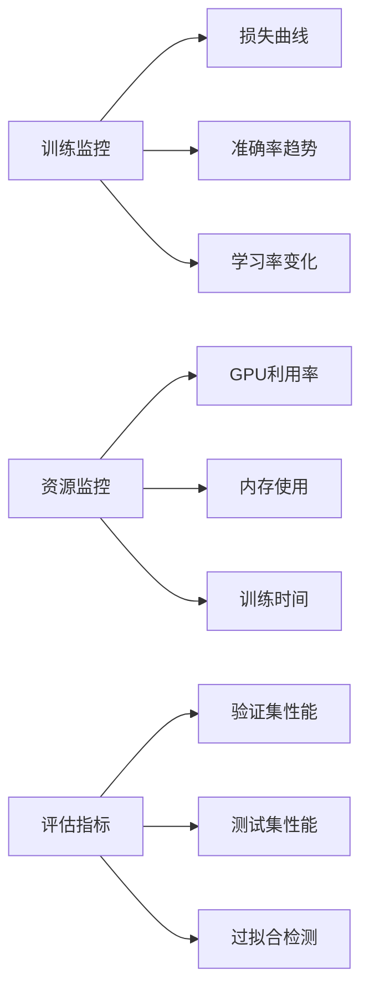

# 文本分类示例

<cite>
**本文档中引用的文件**
- [examples/pytorch/text-classification/README.md](file://examples/pytorch/text-classification/README.md)
- [examples/pytorch/text-classification/run_glue.py](file://examples/pytorch/text-classification/run_glue.py)
- [examples/pytorch/text-classification/run_xnli.py](file://examples/pytorch/text-classification/run_xnli.py)
- [examples/pytorch/text-classification/run_classification.py](file://examples/pytorch/text-classification/run_classification.py)
- [src/transformers/trainer.py](file://src/transformers/trainer.py)
- [src/transformers/training_args.py](file://src/transformers/training_args.py)
- [src/transformers/data/processors/glue.py](file://src/transformers/data/processors/glue.py)
</cite>

## 目录
1. [简介](#简介)
2. [项目结构](#项目结构)
3. [核心组件](#核心组件)
4. [架构概览](#架构概览)
5. [详细组件分析](#详细组件分析)
6. [依赖关系分析](#依赖关系分析)
7. [性能考虑](#性能考虑)
8. [故障排除指南](#故障排除指南)
9. [结论](#结论)

## 简介

本文档提供了使用Transformers库中的Trainer API在GLUE基准数据集上进行文本分类微调的详细示例。该示例涵盖了从数据加载、预处理到模型训练和评估的完整流程，包括多语言文本分类（XNLI）的特殊配置。

Transformers库提供了强大的文本分类功能，支持多种任务类型：
- 单标签分类（如GLUE基准任务）
- 多标签分类（如新闻分类）
- 回归任务（如语义相似度评分）
- 跨语言文本分类（如XNLI）

## 项目结构

文本分类示例项目采用模块化设计，包含以下核心脚本：

**图表来源**
- [examples/pytorch/text-classification/run_glue.py](file://examples/pytorch/text-classification/run_glue.py#L1-L50)
- [examples/pytorch/text-classification/run_xnli.py](file://examples/pytorch/text-classification/run_xnli.py#L1-L50)
- [examples/pytorch/text-classification/run_classification.py](file://examples/pytorch/text-classification/run_classification.py#L1-L50)

**章节来源**
- [examples/pytorch/text-classification/README.md](file://examples/pytorch/text-classification/README.md#L1-L50)

## 核心组件

### 数据加载与预处理

文本分类任务的数据处理流程包括以下几个关键步骤：

1. **数据集加载**：支持从Hugging Face Hub、本地文件或自定义数据源加载
2. **分词与编码**：使用预训练分词器对文本进行tokenization
3. **特征工程**：将原始文本转换为模型可接受的输入格式
4. **批处理**：动态填充和批处理以优化内存使用

### Trainer API集成

Trainer API提供了统一的训练接口，简化了模型训练的复杂性：

**图表来源**
- [src/transformers/trainer.py](file://src/transformers/trainer.py#L1-L100)
- [src/transformers/training_args.py](file://src/transformers/training_args.py#L1-L100)

**章节来源**
- [examples/pytorch/text-classification/run_glue.py](file://examples/pytorch/text-classification/run_glue.py#L400-L500)

## 架构概览

文本分类系统的整体架构采用分层设计，确保了灵活性和可扩展性：

**图表来源**
- [examples/pytorch/text-classification/run_glue.py](file://examples/pytorch/text-classification/run_glue.py#L200-L300)
- [src/transformers/trainer.py](file://src/transformers/trainer.py#L100-L200)

## 详细组件分析

### GLUE基准任务处理

GLUE（General Language Understanding Evaluation）是自然语言理解的标准基准测试，包含9个不同的任务。每个任务都有特定的数据格式和评估指标。

#### 支持的任务类型

| 任务名称 | 输入类型 | 输出类型 | 主要指标 |
|---------|---------|---------|---------|
| CoLA | 单句 | 分类 | Matthews相关系数 |
| SST-2 | 单句 | 分类 | 准确率 |
| MRPC | 句对 | 分类 | F1/准确率 |
| STS-B | 句对 | 回归 | 皮尔逊/斯皮尔曼相关 |
| QQP | 句对 | 分类 | 准确率/F1 |
| MNLI | 句对 | 分类 | 匹配/不匹配准确率 |
| QNLI | 句对 | 分类 | 准确率 |
| RTE | 句对 | 分类 | 准确率 |
| WNLI | 句对 | 分类 | 准确率 |

#### 数据预处理流程

**图表来源**
- [examples/pytorch/text-classification/run_glue.py](file://examples/pytorch/text-classification/run_glue.py#L430-L470)
- [src/transformers/data/processors/glue.py](file://src/transformers/data/processors/glue.py#L50-L150)

**章节来源**
- [examples/pytorch/text-classification/run_glue.py](file://examples/pytorch/text-classification/run_glue.py#L400-L500)

### XNLI多语言处理

XNLI（Cross-lingual Natural Language Inference）是一个跨语言文本推理基准，支持15种语言的文本分类任务。

#### 多语言配置特点

1. **语言参数**：需要指定训练语言和评估语言
2. **分词器配置**：使用多语言分词器（如mBERT）
3. **数据加载**：支持按语言子集加载数据
4. **评估指标**：专门针对跨语言任务的评估指标

#### XNLI训练流程

**图表来源**
- [examples/pytorch/text-classification/run_xnli.py](file://examples/pytorch/text-classification/run_xnli.py#L200-L300)

**章节来源**
- [examples/pytorch/text-classification/run_xnli.py](file://examples/pytorch/text-classification/run_xnli.py#L150-L250)

### 通用分类任务

run_classification.py提供了更灵活的文本分类接口，支持单标签、多标签和回归任务。

#### 功能特性

1. **多列文本合并**：支持从多个文本列构建复合输入
2. **灵活的标签处理**：自动检测单标签或多标签任务
3. **自定义指标**：支持用户定义的评估指标
4. **数据预处理管道**：完整的数据清洗和验证流程

#### 配置参数详解

| 参数名称 | 类型 | 默认值 | 描述 |
|---------|------|--------|------|
| text_column_names | str | None | 文本列名称，支持逗号分隔的多个列 |
| label_column_name | str | None | 标签列名称 |
| text_column_delimiter | str | " " | 多列文本连接符 |
| do_regression | bool | None | 是否执行回归任务 |
| metric_name | str | None | 自定义评估指标名称 |

**章节来源**
- [examples/pytorch/text-classification/run_classification.py](file://examples/pytorch/text-classification/run_classification.py#L50-L150)

### TrainingArguments详细配置

TrainingArguments包含了训练过程中的所有关键参数配置：

#### 学习率和优化器设置

**图表来源**
- [src/transformers/training_args.py](file://src/transformers/training_args.py#L100-L200)

#### 关键参数配置表

| 参数名称 | 类型 | 推荐值 | 说明 |
|---------|------|--------|------|
| learning_rate | float | 2e-5 | 基础学习率 |
| per_device_train_batch_size | int | 16-32 | 每设备训练批大小 |
| num_train_epochs | int | 3-5 | 训练轮数 |
| warmup_ratio | float | 0.1 | 预热比例 |
| weight_decay | float | 0.01 | 权重衰减 |
| max_grad_norm | float | 1.0 | 梯度裁剪阈值 |

**章节来源**
- [src/transformers/training_args.py](file://src/transformers/training_args.py#L1-L200)

### 数据整理器（Data Collator）

数据整理器负责将多个样本组合成批次，处理不同长度序列的填充问题。

#### 填充策略对比

**图表来源**
- [examples/pytorch/text-classification/run_glue.py](file://examples/pytorch/text-classification/run_glue.py#L550-L600)

## 依赖关系分析

文本分类系统的核心依赖关系展现了清晰的层次结构：

**图表来源**
- [examples/pytorch/text-classification/run_glue.py](file://examples/pytorch/text-classification/run_glue.py#L1-L50)
- [src/transformers/trainer.py](file://src/transformers/trainer.py#L1-L50)

**章节来源**
- [examples/pytorch/text-classification/run_glue.py](file://examples/pytorch/text-classification/run_glue.py#L1-L100)

## 性能考虑

### 内存优化策略

1. **混合精度训练**：使用FP16减少内存占用
2. **梯度检查点**：在内存受限时启用
3. **动态批处理**：根据序列长度调整批大小
4. **数据缓存**：避免重复预处理

### 训练加速技术

1. **分布式训练**：多GPU/多节点训练
2. **模型并行**：大模型的分片处理
3. **数据并行**：数据分布式的训练
4. **流水线并行**：计算图的流水线处理

### 性能监控

## 故障排除指南

### 常见问题及解决方案

#### 过拟合处理

1. **正则化技术**
   - Dropout层的应用
   - 权重衰减的调整
   - 早停机制的设置

2. **数据增强**
   - 文本扰动方法
   - 随机删除和替换
   - 对比学习策略

#### 类别不平衡问题

1. **采样策略**
   - 上采样少数类
   - 下采样多数类
   - 混合采样方法

2. **损失函数调整**
   - 加权交叉熵
   - Focal Loss
   - 渐进式损失平衡

#### 内存不足问题

1. **批大小调整**
   - 动态批大小
   - 梯度累积
   - 混合精度训练

2. **模型优化**
   - 模型量化
   - 知识蒸馏
   - 模型剪枝

### 调试技巧

1. **日志分析**：监控训练过程中的指标变化
2. **可视化工具**：使用TensorBoard跟踪训练进度
3. **断点调试**：在关键节点插入调试代码
4. **单元测试**：验证数据预处理和模型组件

**章节来源**
- [examples/pytorch/text-classification/run_glue.py](file://examples/pytorch/text-classification/run_glue.py#L500-L600)

## 结论

Transformers库的文本分类功能提供了强大而灵活的解决方案，通过Trainer API简化了复杂的训练流程。本文档详细介绍了从基础的GLUE任务到高级的多语言分类的各种应用场景。

### 主要优势

1. **易用性**：简洁的API设计，快速上手
2. **灵活性**：支持多种任务类型和自定义配置
3. **性能**：优化的训练流程和内存管理
4. **扩展性**：良好的模块化设计，便于定制

### 最佳实践建议

1. **数据准备**：确保数据质量和格式正确
2. **超参数调优**：合理设置学习率和批大小
3. **监控训练**：实时跟踪训练指标和资源使用
4. **模型评估**：使用适当的评估指标和验证策略

通过遵循本文档的指导原则和最佳实践，开发者可以高效地利用Transformers库进行各种文本分类任务，获得优秀的模型性能和用户体验。