# 文本生成示例

<cite>
**本文档中引用的文件**
- [run_summarization.py](file://examples/pytorch/summarization/run_summarization.py)
- [run_translation.py](file://examples/pytorch/translation/run_translation.py)
- [training_args_seq2seq.py](file://src/transformers/training_args_seq2seq.py)
- [trainer_seq2seq.py](file://src/transformers/trainer_seq2seq.py)
- [utils.py](file://examples/legacy/seq2seq/utils.py)
- [README.md](file://examples/legacy/seq2seq/README.md)
- [logits_process.py](file://src/transformers/generation/logits_process.py)
- [configuration_utils.py](file://src/transformers/generation/configuration_utils.py)
</cite>

## 目录
1. [简介](#简介)
2. [项目结构概览](#项目结构概览)
3. [核心组件分析](#核心组件分析)
4. [架构概览](#架构概览)
5. [详细组件分析](#详细组件分析)
6. [依赖关系分析](#依赖关系分析)
7. [性能考虑](#性能考虑)
8. [故障排除指南](#故障排除指南)
9. [结论](#结论)

## 简介

本文档提供了Transformers库中序列到序列（seq2seq）文本生成任务的综合使用示例，重点涵盖摘要生成和机器翻译两大典型应用场景。通过详细的配置指南、最佳实践和优化技巧，帮助开发者高效地实现高质量的文本生成应用。

Transformers库为seq2seq任务提供了完整的解决方案，包括：
- 支持多种主流架构（BART、T5、Pegasus等）
- 完整的训练和评估流程
- 高级生成参数配置
- 自定义评估指标计算
- 分布式训练支持

## 项目结构概览

Transformers库中的文本生成相关文件主要分布在以下目录结构中：

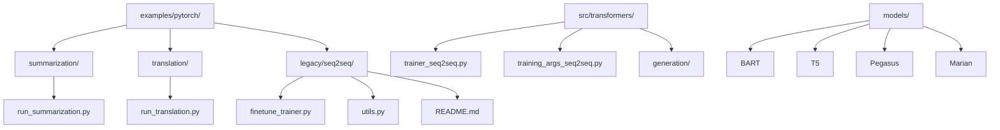

**图表来源**
- [run_summarization.py](file://examples/pytorch/summarization/run_summarization.py#L1-L50)
- [run_translation.py](file://examples/pytorch/translation/run_translation.py#L1-L50)
- [trainer_seq2seq.py](file://src/transformers/trainer_seq2seq.py#L1-L50)

## 核心组件分析

### Seq2SeqTrainer类

Seq2SeqTrainer是专门为序列到序列任务设计的训练器，继承自基础Trainer类，提供了专门针对生成任务的优化功能。

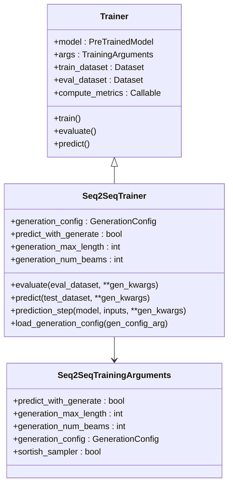

**图表来源**
- [trainer_seq2seq.py](file://src/transformers/trainer_seq2seq.py#L52-L110)
- [training_args_seq2seq.py](file://src/transformers/training_args_seq2seq.py#L27-L90)

### 数据预处理管道

文本生成任务的数据预处理涉及复杂的编码器-解码器分词器配置和序列长度管理：

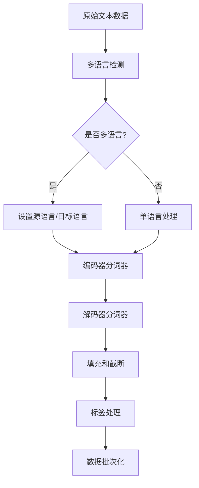

**图表来源**
- [run_summarization.py](file://examples/pytorch/summarization/run_summarization.py#L400-L500)
- [run_translation.py](file://examples/pytorch/translation/run_translation.py#L350-L450)

**章节来源**
- [trainer_seq2seq.py](file://src/transformers/trainer_seq2seq.py#L52-L110)
- [training_args_seq2seq.py](file://src/transformers/training_args_seq2seq.py#L27-L90)

## 架构概览

### 序列到序列任务架构

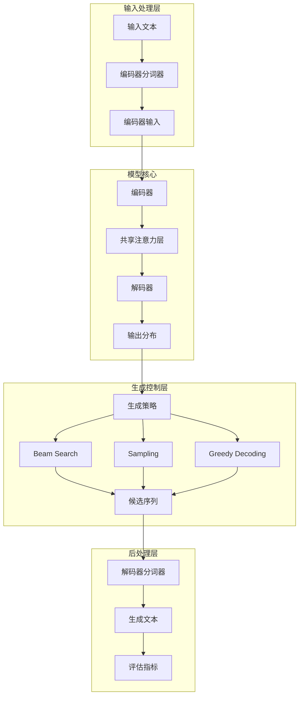

**图表来源**
- [run_summarization.py](file://examples/pytorch/summarization/run_summarization.py#L1-L100)
- [run_translation.py](file://examples/pytorch/translation/run_translation.py#L1-L100)

## 详细组件分析

### 摘要生成任务

摘要生成是典型的seq2seq任务，需要将长文档压缩为简短的摘要。

#### 关键配置参数

| 参数名称 | 默认值 | 描述 | 使用场景 |
|---------|--------|------|----------|
| `max_source_length` | 1024 | 输入序列最大长度 | 处理长文档时调整 |
| `max_target_length` | 128 | 输出摘要最大长度 | 控制摘要长度 |
| `val_max_target_length` | None | 验证时目标长度 | 保持一致性 |
| `num_beams` | 1 | Beam搜索数量 | 平衡质量和速度 |
| `length_penalty` | 1.0 | 长度惩罚因子 | 控制生成长度 |

#### 摘要生成流程

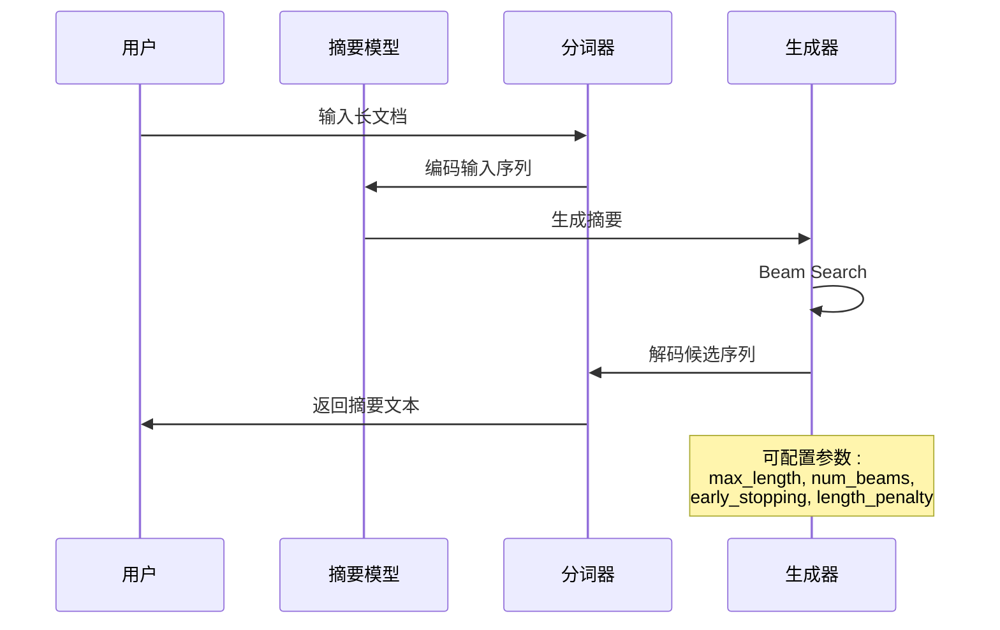

**图表来源**
- [run_summarization.py](file://examples/pytorch/summarization/run_summarization.py#L658-L691)
- [logits_process.py](file://src/transformers/generation/logits_process.py#L1567-L1595)

#### ROUGE评估指标

ROUGE（Recall-Oriented Understudy for Gisting Evaluation）是摘要任务的标准评估指标：

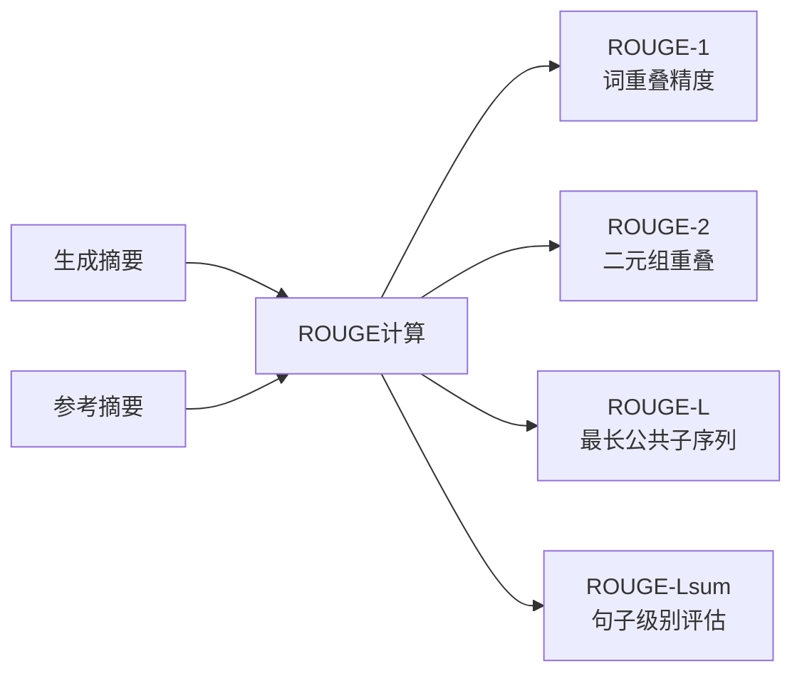

**图表来源**
- [utils.py](file://examples/legacy/seq2seq/utils.py#L496-L528)

**章节来源**
- [run_summarization.py](file://examples/pytorch/summarization/run_summarization.py#L629-L691)
- [utils.py](file://examples/legacy/seq2seq/utils.py#L496-L528)

### 机器翻译任务

机器翻译是另一个重要的seq2seq应用领域，需要在不同语言之间进行语义转换。

#### 多语言处理配置

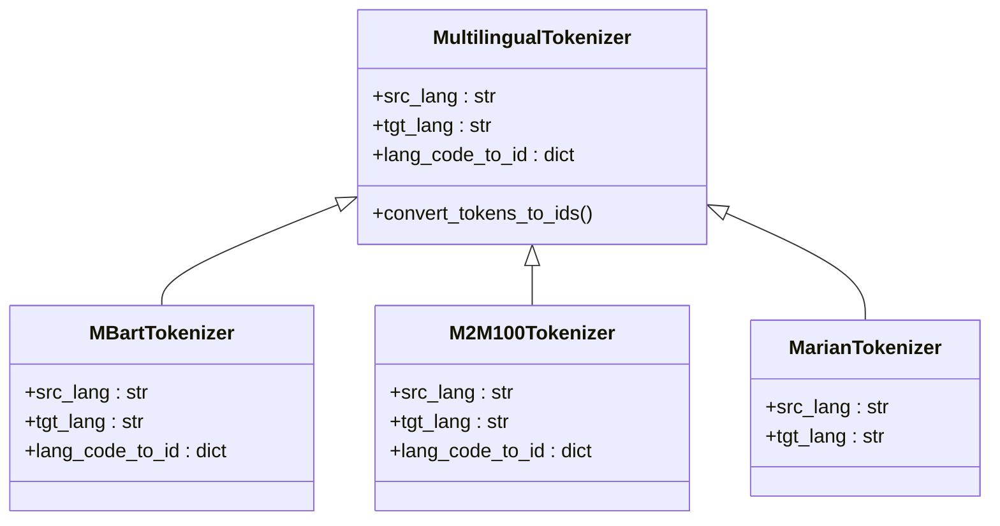

**图表来源**
- [run_translation.py](file://examples/pytorch/translation/run_translation.py#L45-L50)

#### BLEU评估指标

BLEU（Bilingual Evaluation Understudy）是机器翻译任务的主要评估指标：

| BLEU类型 | 描述 | 计算方式 |
|---------|------|----------|
| BLEU-1 | 1-gram精确度 | 单词级别匹配 |
| BLEU-2 | 2-gram精确度 | 双词组合匹配 |
| BLEU-3 | 3-gram精确度 | 三词组合匹配 |
| BLEU-4 | 4-gram精确度 | 四词组合匹配 |

**章节来源**
- [run_translation.py](file://examples/pytorch/translation/run_translation.py#L658-L691)

### 生成参数配置

#### 基础生成参数

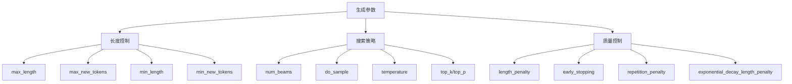

**图表来源**
- [configuration_utils.py](file://src/transformers/generation/configuration_utils.py#L106-L122)
- [logits_process.py](file://src/transformers/generation/logits_process.py#L1803-L1881)

#### 高级生成技巧

##### 长度惩罚配置

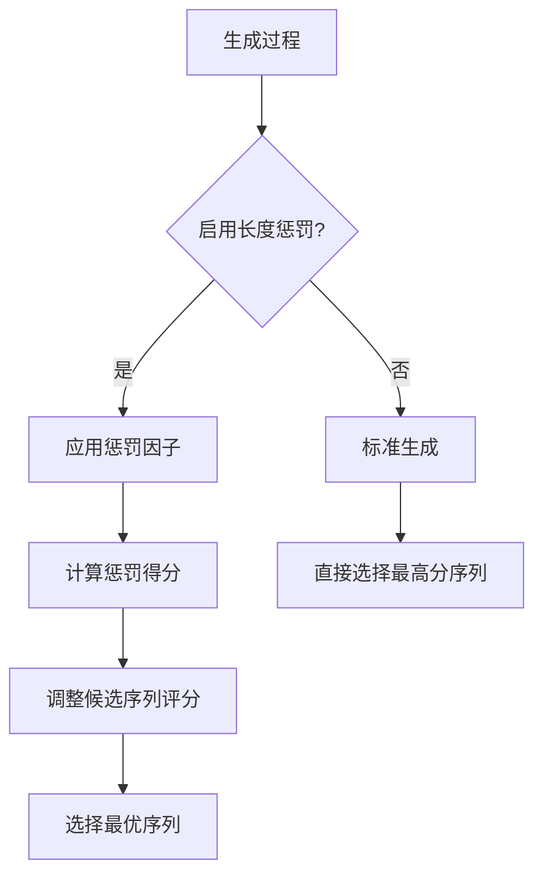

**图表来源**
- [logits_process.py](file://src/transformers/generation/logits_process.py#L1803-L1847)

##### 重复惩罚机制

重复惩罚用于避免生成内容的循环重复：

| 参数 | 类型 | 描述 | 推荐值 |
|------|------|------|--------|
| repetition_penalty | float | 重复惩罚因子 | 1.0-2.0 |
| no_repeat_ngram_size | int | 不重复的n-gram大小 | 3-5 |
| diversity_penalty | float | 多样性惩罚因子 | 0.0-10.0 |

**章节来源**
- [logits_process.py](file://src/transformers/generation/logits_process.py#L1567-L1609)
- [configuration_utils.py](file://src/transformers/generation/configuration_utils.py#L106-L122)

### 流式数据加载和分布式训练

#### 流式数据处理

对于大规模数据集，流式加载可以显著减少内存占用：

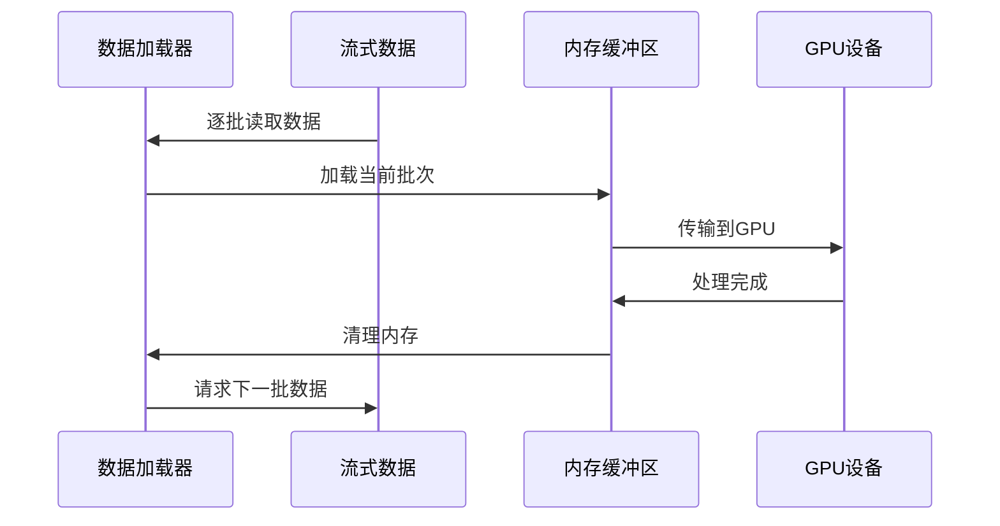

**图表来源**
- [run_clm.py](file://examples/pytorch/language-modeling/run_clm.py#L321-L347)

#### 分布式训练配置

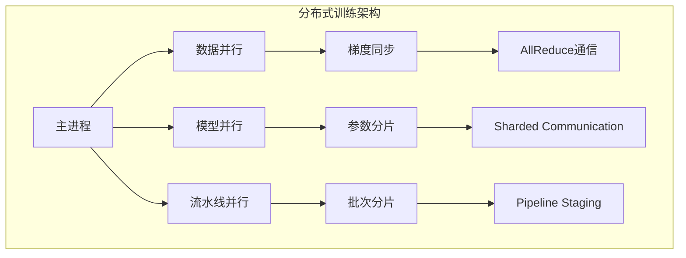

**图表来源**
- [trainer_pt_utils.py](file://src/transformers/trainer_pt_utils.py#L201-L229)

**章节来源**
- [run_clm.py](file://examples/pytorch/language-modeling/run_clm.py#L226-L252)
- [trainer_pt_utils.py](file://src/transformers/trainer_pt_utils.py#L201-L229)

## 依赖关系分析

### 核心依赖关系图

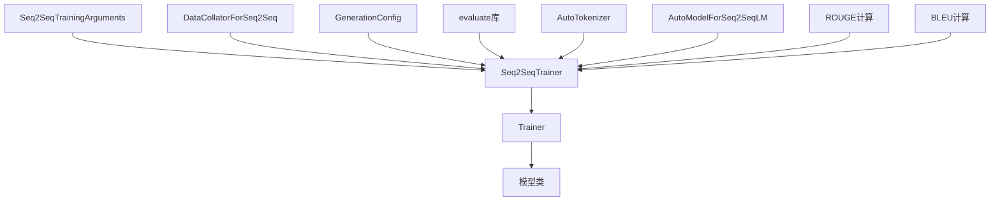

**图表来源**
- [training_args_seq2seq.py](file://src/transformers/training_args_seq2seq.py#L27-L48)
- [trainer_seq2seq.py](file://src/transformers/trainer_seq2seq.py#L52-L83)

### 第三方库依赖

| 库名称 | 版本要求 | 用途 |
|--------|----------|------|
| transformers | >=4.57.0.dev0 | 主要框架 |
| datasets | >=1.8.0 | 数据处理 |
| evaluate | - | 评估指标 |
| rouge-score | - | ROUGE计算 |
| sacrebleu | >=1.4.12 | BLEU计算 |
| nltk | - | 文本处理 |

**章节来源**
- [run_summarization.py](file://examples/pytorch/summarization/run_summarization.py#L1-L50)
- [run_translation.py](file://examples/pytorch/translation/run_translation.py#L1-L50)

## 性能考虑

### 训练性能优化

1. **混合精度训练**：使用FP16可以显著提升训练速度和内存效率
2. **动态批次大小**：根据序列长度动态调整批次大小
3. **梯度累积**：在有限GPU内存下模拟大批次训练
4. **模型并行**：大型模型的分布式训练

### 推理性能优化

1. **Beam Search优化**：合理设置beam宽度平衡质量和速度
2. **KV缓存**：利用键值对缓存加速生成
3. **量化技术**：模型量化减少推理延迟
4. **批处理推理**：同时处理多个输入序列

### 内存优化策略

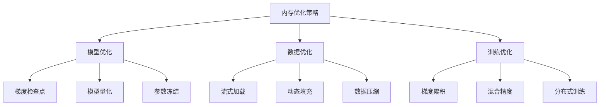

## 故障排除指南

### 常见问题及解决方案

#### 内存不足问题

**问题描述**：训练过程中出现CUDA out of memory错误

**解决方案**：
1. 减少批次大小（`per_device_train_batch_size`）
2. 启用梯度检查点（`gradient_checkpointing=True`）
3. 使用混合精度训练（`fp16=True`或`bf16=True`）
4. 增加梯度累积步数

#### 生成质量问题

**问题描述**：生成文本质量不理想

**解决方案**：
1. 调整生成参数（`num_beams`, `temperature`, `length_penalty`）
2. 检查数据预处理质量
3. 增加训练轮数
4. 使用更好的预训练模型

#### 多语言处理问题

**问题描述**：多语言模型无法正确识别语言

**解决方案**：
1. 正确设置`src_lang`和`tgt_lang`参数
2. 检查分词器的语言映射表
3. 验证语言代码格式

**章节来源**
- [README.md](file://examples/legacy/seq2seq/README.md#L100-L150)

## 结论

Transformers库为序列到序列文本生成任务提供了完整而强大的解决方案。通过合理配置Seq2SeqTrainingArguments和Seq2SeqTrainer，结合适当的生成参数调优，可以实现高质量的摘要生成和机器翻译应用。

关键成功因素包括：
1. 正确的模型架构选择（BART、T5、Pegasus等）
2. 优化的数据预处理流程
3. 合适的生成参数配置
4. 有效的评估指标使用
5. 性能优化策略的应用

随着模型规模的不断增长和硬件能力的提升，这些技术将继续演进，为更复杂的文本生成任务提供支持。