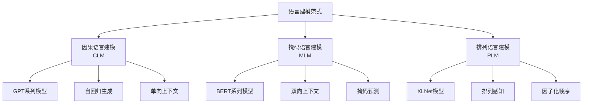
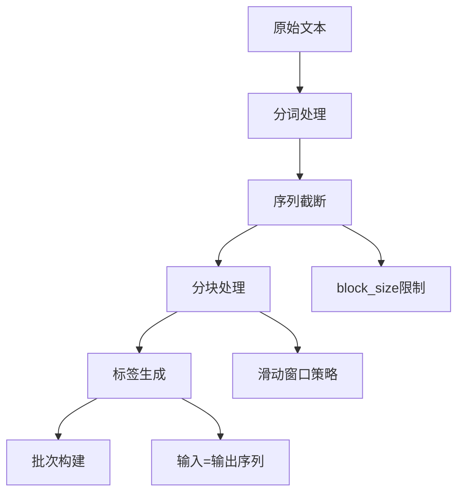
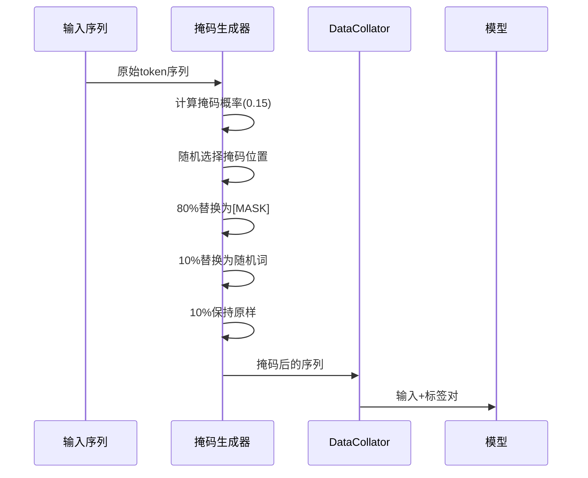
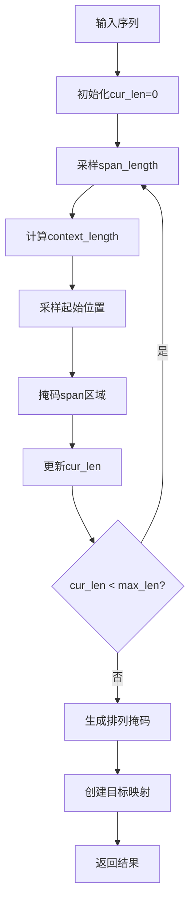
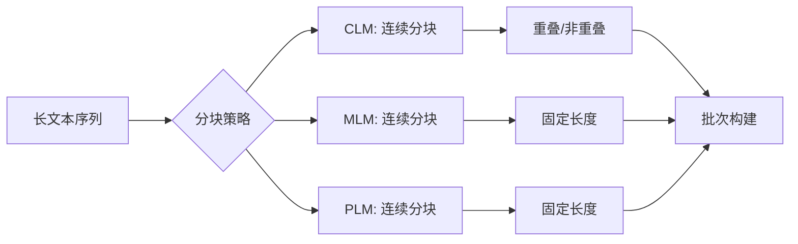
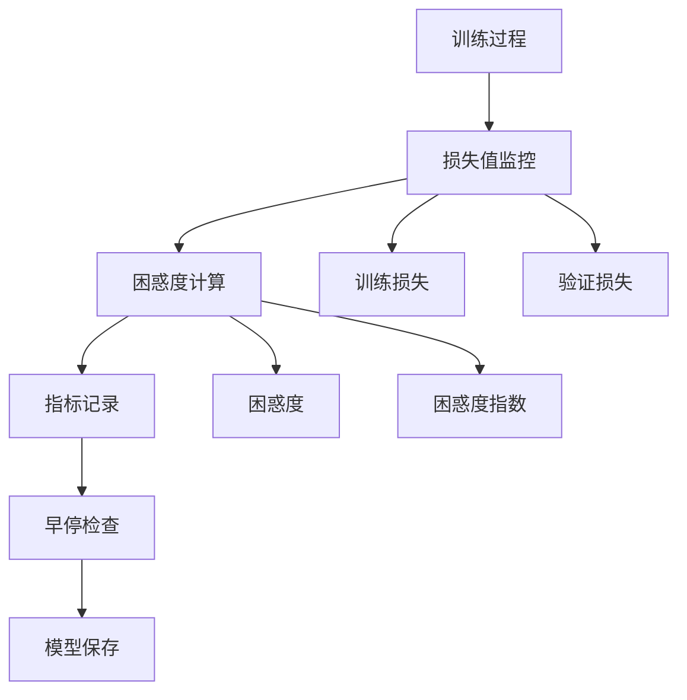

# 语言建模示例

<cite>
**本文档中引用的文件**
- [run_clm.py](file://examples/pytorch/language-modeling/run_clm.py)
- [run_mlm.py](file://examples/pytorch/language-modeling/run_mlm.py)
- [run_plm.py](file://examples/pytorch/language-modeling/run_plm.py)
- [data_collator.py](file://src/transformers/data/data_collator.py)
- [training_args.py](file://src/transformers/training_args.py)
- [README.md](file://examples/pytorch/language-modeling/README.md)
</cite>

## 目录
1. [简介](#简介)
2. [语言建模范式概述](#语言建模范式概述)
3. [因果语言建模（CLM）](#因果语言建模clm)
4. [掩码语言建模（MLM）](#掩码语言建模mlm)
5. [排列语言建模（PLM）](#排列语言建模plm)
6. [数据预处理与分块策略](#数据预处理与分块策略)
7. [DataCollator配置详解](#datacollator配置详解)
8. [TrainingArguments参数配置](#trainingarguments参数配置)
9. [完整训练脚本示例](#完整训练脚本示例)
10. [困惑度监控与评估](#困惑度监控与评估)
11. [最佳实践与优化建议](#最佳实践与优化建议)

## 简介

Transformers库提供了三种主要的语言建模范式：因果语言建模（CLM）、掩码语言建模（MLM）和排列语言建模（PLM）。每种范式都有其独特的训练目标、数据处理方式和适用场景。本文档将详细介绍这些范式的实现原理、配置方法和使用示例。

## 语言建模范式概述

### 三种主要范式对比



### 范式特点总结

| 范式 | 训练目标 | 上下文类型 | 主要特点 |
|------|----------|------------|----------|
| CLM | 下一个词预测 | 单向（左到右） | 自回归，适合生成任务 |
| MLM | 掩码词预测 | 双向 | 预训练时随机掩码，微调时固定掩码 |
| PLM | 排列预测 | 因子化排列 | XLNet专用，学习双向上下文 |

## 因果语言建模（CLM）

### 基本原理

因果语言建模通过预测序列中的下一个词来学习语言表示。模型只能访问当前词之前的所有信息，无法看到后续内容。

### 数据处理流程



### 核心实现细节

CLM的核心数据处理逻辑在[`group_texts`](file://examples/pytorch/language-modeling/run_clm.py#L554-L575)函数中：

- **分块策略**：将连续的文本连接后按固定长度分块
- **标签生成**：输入序列即为标签序列，实现自回归训练
- **滑动窗口**：支持重叠或非重叠的分块方式

**节源**
- [run_clm.py](file://examples/pytorch/language-modeling/run_clm.py#L554-L575)

### 使用示例

```bash
# 基础CLM训练示例
python run_clm.py \
    --model_name_or_path gpt2 \
    --dataset_name wikitext \
    --dataset_config_name wikitext-2-raw-v1 \
    --per_device_train_batch_size 8 \
    --per_device_eval_batch_size 8 \
    --do_train \
    --do_eval \
    --output_dir ./clm_output
```

## 掩码语言建模（MLM）

### 基本原理

掩码语言建模通过随机掩码输入序列中的部分词，让模型预测被掩码的词。这种双向上下文机制使模型能够同时利用左右两侧的信息。

### 动态掩码机制



### 核心配置参数

MLM的关键配置在[`DataCollatorForLanguageModeling`](file://src/transformers/data/data_collator.py#L618-L1014)类中：

- **mlm_probability**：默认0.15，控制掩码比例
- **mask_replace_prob**：默认0.8，掩码词替换为[MASK]的概率
- **random_replace_prob**：默认0.1，掩码词替换为随机词的概率

**节源**
- [data_collator.py](file://src/transformers/data/data_collator.py#L618-L1014)

### 使用示例

```bash
# 基础MLM训练示例
python run_mlm.py \
    --model_name_or_path bert-base-uncased \
    --dataset_name wikitext \
    --dataset_config_name wikitext-2-raw-v1 \
    --per_device_train_batch_size 8 \
    --per_device_eval_batch_size 8 \
    --do_train \
    --do_eval \
    --output_dir ./mlm_output
```

## 排列语言建模（PLM）

### 基本原理

排列语言建模是XLNet提出的创新范式，通过学习所有可能的因子化排列顺序来捕获双向上下文信息。

### 排列算法详解



### 核心参数配置

PLM的主要配置参数：

- **plm_probability**：默认1/6，控制掩码跨度与上下文的比例
- **max_span_length**：默认5，最大掩码跨度长度
- **序列长度要求**：必须为偶数，确保无信息泄露

**节源**
- [run_plm.py](file://examples/pytorch/language-modeling/run_plm.py#L467-L497)

### 使用示例

```bash
# PLM训练示例
python run_plm.py \
    --model_name_or_path xlnet-base-cased \
    --dataset_name wikitext \
    --dataset_config_name wikitext-2-raw-v1 \
    --per_device_train_batch_size 8 \
    --per_device_eval_batch_size 8 \
    --do_train \
    --do_eval \
    --output_dir ./plm_output
```

## 数据预处理与分块策略

### 分块处理核心逻辑

不同范式采用不同的分块策略来处理长文本序列：



### 滑动窗口策略

所有三种范式都支持滑动窗口策略来提高数据利用率：

```python
# 分块处理的核心逻辑
def group_texts(examples):
    # 连接所有文本
    concatenated_examples = {k: list(chain(*examples[k])) for k in examples}
    total_length = len(concatenated_examples[list(examples.keys())[0]])
    
    # 计算可整除的总长度
    total_length = (total_length // block_size) * block_size
    
    # 按固定长度分块
    result = {
        k: [t[i:i + block_size] for i in range(0, total_length, block_size)]
        for k, t in concatenated_examples.items()
    }
    
    return result
```

### 长序列处理策略

对于超过模型最大长度的序列，系统会自动进行分块处理：

1. **序列截断**：当序列过长时，按最大长度截断
2. **分块保留**：保留小的余数部分，避免数据丢失
3. **缓存机制**：支持预处理结果缓存，提高重复训练效率

**节源**
- [run_clm.py](file://examples/pytorch/language-modeling/run_clm.py#L554-L575)
- [run_mlm.py](file://examples/pytorch/language-modeling/run_mlm.py#L515-L536)
- [run_plm.py](file://examples/pytorch/language-modeling/run_plm.py#L444-L465)

## DataCollator配置详解

### CLM DataCollator

CLM使用默认的[`default_data_collator`](file://examples/pytorch/language-modeling/run_clm.py#L690)：

```python
# CLM不需要特殊的数据整理器
data_collator = default_data_collator
```

### MLM DataCollator配置

MLM需要配置动态掩码功能：

```python
# MLM数据整理器配置
data_collator = DataCollatorForLanguageModeling(
    tokenizer=tokenizer,
    mlm_probability=data_args.mlm_probability,  # 默认0.15
    pad_to_multiple_of=8 if pad_to_multiple_of_8 else None,
)
```

### PLM DataCollator配置

PLM需要特殊的排列语言建模数据整理器：

```python
# PLM数据整理器配置
data_collator = DataCollatorForPermutationLanguageModeling(
    tokenizer=tokenizer,
    plm_probability=data_args.plm_probability,  # 默认1/6
    max_span_length=data_args.max_span_length,  # 默认5
)
```

### 动态掩码实现机制

```mermaid
flowchart TD
A[输入批次] --> B[计算掩码矩阵]
B --> C[应用掩码概率]
C --> D[生成掩码标记]
D --> E[替换策略]
E --> F[标签生成]
F --> G[批次输出]
E --> E1[80% [MASK]]
E --> E2[10% 随机词]
E --> E3[10% 保持原样]
```

**节源**
- [data_collator.py](file://src/transformers/data/data_collator.py#L618-L1014)
- [data_collator.py](file://src/transformers/data/data_collator.py#L1138-L1315)

## TrainingArguments参数配置

### 关键参数设置

不同语言建模范式需要特定的TrainingArguments配置：

```python
# CLM训练参数
training_args = TrainingArguments(
    output_dir="./clm_output",
    do_train=True,
    do_eval=True,
    per_device_train_batch_size=8,
    per_device_eval_batch_size=8,
    num_train_epochs=3,
    learning_rate=5e-5,
    warmup_steps=500,
    weight_decay=0.01,
    logging_steps=100,
    evaluation_strategy="epoch",
    save_strategy="epoch",
    load_best_model_at_end=True,
)

# MLM训练参数
training_args = TrainingArguments(
    output_dir="./mlm_output",
    do_train=True,
    do_eval=True,
    per_device_train_batch_size=8,
    per_device_eval_batch_size=8,
    num_train_epochs=3,
    learning_rate=2e-5,
    warmup_steps=500,
    weight_decay=0.01,
    logging_steps=100,
    evaluation_strategy="epoch",
    save_strategy="epoch",
    load_best_model_at_end=True,
)

# PLM训练参数
training_args = TrainingArguments(
    output_dir="./plm_output",
    do_train=True,
    do_eval=True,
    per_device_train_batch_size=8,
    per_device_eval_batch_size=8,
    num_train_epochs=3,
    learning_rate=3e-5,
    warmup_steps=500,
    weight_decay=0.01,
    logging_steps=100,
    evaluation_strategy="epoch",
    save_strategy="epoch",
    load_best_model_at_end=True,
)
```

### 特殊参数说明

| 参数名 | CLM | MLM | PLM | 说明 |
|--------|-----|-----|-----|------|
| learning_rate | 5e-5 | 2e-5 | 3e-5 | MLM通常需要更低的学习率 |
| warmup_steps | 500 | 500 | 500 | 根据数据量调整 |
| weight_decay | 0.01 | 0.01 | 0.01 | 正则化强度 |
| per_device_train_batch_size | 8 | 8 | 8 | 根据GPU内存调整 |

**节源**
- [training_args.py](file://src/transformers/training_args.py#L0-L300)

## 完整训练脚本示例

### CLM完整脚本

以下是一个完整的CLM训练脚本示例：

```python
#!/usr/bin/env python
# CLM训练脚本示例

import logging
import os
from dataclasses import dataclass, field
from typing import Optional

import torch
from datasets import load_dataset
from transformers import (
    AutoModelForCausalLM,
    AutoTokenizer,
    Trainer,
    TrainingArguments,
    default_data_collator,
)

# 设置日志
logging.basicConfig(level=logging.INFO)
logger = logging.getLogger(__name__)

@dataclass
class ModelArguments:
    model_name_or_path: str = field(metadata={"help": "预训练模型路径"})

@dataclass
class DataTrainingArguments:
    dataset_name: str = field(metadata={"help": "数据集名称"})
    max_seq_length: int = field(default=512, metadata={"help": "最大序列长度"})

def main():
    # 加载模型和分词器
    model = AutoModelForCausalLM.from_pretrained("gpt2")
    tokenizer = AutoTokenizer.from_pretrained("gpt2")
    
    # 加载数据集
    raw_datasets = load_dataset("wikitext", "wikitext-2-raw-v1")
    
    # 分词处理
    def tokenize_function(examples):
        return tokenizer(examples["text"])
    
    tokenized_datasets = raw_datasets.map(
        tokenize_function,
        batched=True,
        remove_columns=["text"],
    )
    
    # 数据整理
    data_collator = default_data_collator
    
    # 训练参数
    training_args = TrainingArguments(
        output_dir="./clm_output",
        do_train=True,
        do_eval=True,
        per_device_train_batch_size=4,
        per_device_eval_batch_size=4,
        num_train_epochs=3,
        learning_rate=5e-5,
        warmup_steps=500,
        weight_decay=0.01,
        logging_steps=100,
        evaluation_strategy="epoch",
        save_strategy="epoch",
        load_best_model_at_end=True,
    )
    
    # 初始化Trainer
    trainer = Trainer(
        model=model,
        args=training_args,
        train_dataset=tokenized_datasets["train"],
        eval_dataset=tokenized_datasets["validation"],
        data_collator=data_collator,
    )
    
    # 训练
    trainer.train()
    
    # 评估
    eval_results = trainer.evaluate()
    print(f"评估结果: {eval_results}")

if __name__ == "__main__":
    main()
```

### MLM完整脚本

```python
#!/usr/bin/env python
# MLM训练脚本示例

import logging
from dataclasses import dataclass, field
from typing import Optional

import torch
from datasets import load_dataset
from transformers import (
    AutoModelForMaskedLM,
    AutoTokenizer,
    DataCollatorForLanguageModeling,
    Trainer,
    TrainingArguments,
)

# 设置日志
logging.basicConfig(level=logging.INFO)
logger = logging.getLogger(__name__)

@dataclass
class ModelArguments:
    model_name_or_path: str = field(metadata={"help": "预训练模型路径"})

@dataclass
class DataTrainingArguments:
    dataset_name: str = field(metadata={"help": "数据集名称"})
    mlm_probability: float = field(default=0.15, metadata={"help": "掩码概率"})
    max_seq_length: int = field(default=512, metadata={"help": "最大序列长度"})

def main():
    # 加载模型和分词器
    model = AutoModelForMaskedLM.from_pretrained("bert-base-uncased")
    tokenizer = AutoTokenizer.from_pretrained("bert-base-uncased")
    
    # 加载数据集
    raw_datasets = load_dataset("wikitext", "wikitext-2-raw-v1")
    
    # 分词处理
    def tokenize_function(examples):
        return tokenizer(examples["text"], return_special_tokens_mask=True)
    
    tokenized_datasets = raw_datasets.map(
        tokenize_function,
        batched=True,
        remove_columns=["text"],
    )
    
    # 数据整理器
    data_collator = DataCollatorForLanguageModeling(
        tokenizer=tokenizer,
        mlm_probability=0.15,
    )
    
    # 训练参数
    training_args = TrainingArguments(
        output_dir="./mlm_output",
        do_train=True,
        do_eval=True,
        per_device_train_batch_size=4,
        per_device_eval_batch_size=4,
        num_train_epochs=3,
        learning_rate=2e-5,
        warmup_steps=500,
        weight_decay=0.01,
        logging_steps=100,
        evaluation_strategy="epoch",
        save_strategy="epoch",
        load_best_model_at_end=True,
    )
    
    # 初始化Trainer
    trainer = Trainer(
        model=model,
        args=training_args,
        train_dataset=tokenized_datasets["train"],
        eval_dataset=tokenized_datasets["validation"],
        data_collator=data_collator,
    )
    
    # 训练
    trainer.train()
    
    # 评估
    eval_results = trainer.evaluate()
    print(f"评估结果: {eval_results}")

if __name__ == "__main__":
    main()
```

### PLM完整脚本

```python
#!/usr/bin/env python
# PLM训练脚本示例

import logging
from dataclasses import dataclass, field
from typing import Optional

import torch
from datasets import load_dataset
from transformers import (
    AutoTokenizer,
    DataCollatorForPermutationLanguageModeling,
    Trainer,
    TrainingArguments,
    XLNetLMHeadModel,
)

# 设置日志
logging.basicConfig(level=logging.INFO)
logger = logging.getLogger(__name__)

@dataclass
class ModelArguments:
    model_name_or_path: str = field(metadata={"help": "预训练模型路径"})

@dataclass
class DataTrainingArguments:
    dataset_name: str = field(metadata={"help": "数据集名称"})
    plm_probability: float = field(default=1/6, metadata={"help": "排列掩码概率"})
    max_span_length: int = field(default=5, metadata={"help": "最大掩码跨度"})
    max_seq_length: int = field(default=512, metadata={"help": "最大序列长度"})

def main():
    # 加载模型和分词器
    model = XLNetLMHeadModel.from_pretrained("xlnet-base-cased")
    tokenizer = AutoTokenizer.from_pretrained("xlnet-base-cased")
    
    # 加载数据集
    raw_datasets = load_dataset("wikitext", "wikitext-2-raw-v1")
    
    # 分词处理
    def tokenize_function(examples):
        return tokenizer(examples["text"])
    
    tokenized_datasets = raw_datasets.map(
        tokenize_function,
        batched=True,
        remove_columns=["text"],
    )
    
    # 数据整理器
    data_collator = DataCollatorForPermutationLanguageModeling(
        tokenizer=tokenizer,
        plm_probability=1/6,
        max_span_length=5,
    )
    
    # 训练参数
    training_args = TrainingArguments(
        output_dir="./plm_output",
        do_train=True,
        do_eval=True,
        per_device_train_batch_size=4,
        per_device_eval_batch_size=4,
        num_train_epochs=3,
        learning_rate=3e-5,
        warmup_steps=500,
        weight_decay=0.01,
        logging_steps=100,
        evaluation_strategy="epoch",
        save_strategy="epoch",
        load_best_model_at_end=True,
    )
    
    # 初始化Trainer
    trainer = Trainer(
        model=model,
        args=training_args,
        train_dataset=tokenized_datasets["train"],
        eval_dataset=tokenized_datasets["validation"],
        data_collator=data_collator,
    )
    
    # 训练
    trainer.train()
    
    # 评估
    eval_results = trainer.evaluate()
    print(f"评估结果: {eval_results}")

if __name__ == "__main__":
    main()
```

## 困惑度监控与评估

### 困惑度计算

困惑度（Perplexity）是语言建模任务的重要评估指标，表示模型预测下一个词的不确定性：

```python
import math

def calculate_perplexity(eval_loss):
    """计算困惑度"""
    try:
        perplexity = math.exp(eval_loss)
    except OverflowError:
        perplexity = float("inf")
    return perplexity

# 在训练过程中记录困惑度
metrics = trainer.evaluate()
perplexity = calculate_perplexity(metrics["eval_loss"])
print(f"困惑度: {perplexity}")
```

### 评估指标监控



### 多样化评估指标

除了困惑度，还可以监控其他重要指标：

| 指标 | 计算方式 | 用途 |
|------|----------|------|
| perplexity | exp(loss) | 整体性能评估 |
| accuracy | 预测准确率 | 分类任务评估 |
| bleu_score | BLEU分数 | 生成质量评估 |
| rouge_score | ROUGE分数 | 文本生成评估 |

**节源**
- [run_clm.py](file://examples/pytorch/language-modeling/run_clm.py#L670-L680)

## 最佳实践与优化建议

### 数据预处理优化

1. **批量处理**：使用`batched=True`提高预处理效率
2. **多进程**：设置合适的`num_proc`参数
3. **缓存机制**：启用`load_from_cache_file`减少重复计算
4. **流式处理**：对于超大数据集，使用流式加载

### 内存优化策略

```python
# 内存优化配置
training_args = TrainingArguments(
    # 批次大小根据GPU内存调整
    per_device_train_batch_size=2,  # 小批次减少内存占用
    gradient_accumulation_steps=4,   # 模拟大批次效果
    
    # 梯度检查点
    gradient_checkpointing=True,
    
    # 混合精度训练
    fp16=True,  # 或 bf16=True
)
```

### 训练策略优化

1. **学习率调度**：使用余弦退火或线性衰减
2. **Warmup策略**：适当的warmup步数有助于稳定训练
3. **早停机制**：基于验证集性能的早停
4. **模型检查点**：定期保存最佳模型

### 超参数调优

```python
# 超参数网格搜索示例
hyperparams = {
    "learning_rate": [1e-5, 2e-5, 5e-5],
    "batch_size": [4, 8, 16],
    "warmup_steps": [100, 500, 1000],
    "weight_decay": [0.01, 0.02, 0.05]
}

best_perplexity = float('inf')
best_params = None

for lr in hyperparams["learning_rate"]:
    for batch_size in hyperparams["batch_size"]:
        # 训练模型
        training_args = TrainingArguments(
            per_device_train_batch_size=batch_size,
            learning_rate=lr,
            # 其他参数...
        )
        
        trainer = Trainer(...)
        results = trainer.evaluate()
        
        perplexity = calculate_perplexity(results["eval_loss"])
        if perplexity < best_perplexity:
            best_perplexity = perplexity
            best_params = {"learning_rate": lr, "batch_size": batch_size}
```

### 常见问题解决

1. **CUDA Out of Memory**：减少批次大小或启用梯度累积
2. **训练不稳定**：降低学习率或增加权重衰减
3. **收敛缓慢**：检查学习率调度和warmup设置
4. **过拟合**：增加dropout或使用早停机制

### 性能监控工具

推荐使用以下工具监控训练过程：

- **TensorBoard**：内置训练指标可视化
- **Weights & Biases**：专业的实验跟踪
- **Comet ML**：深度学习项目管理
- **Neptune.ai**：机器学习生命周期管理

通过合理配置和优化，可以显著提升语言建模任务的训练效率和模型性能。不同范式的选择应根据具体任务需求和可用资源来决定。