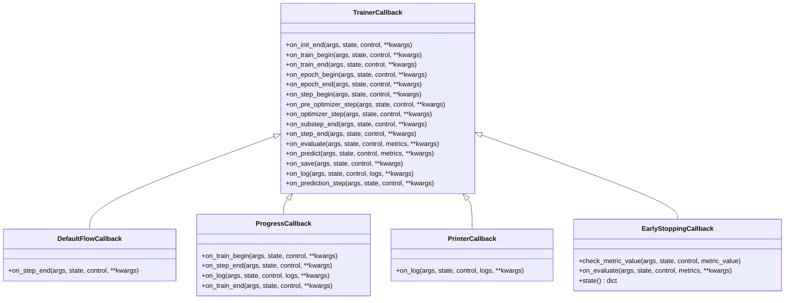

# 回调系统

<cite>
**本文档中引用的文件**
- [trainer_callback.py](file://src/transformers/trainer_callback.py)
- [trainer.py](file://src/transformers/trainer.py)
- [test_trainer_callback.py](file://tests/trainer/test_trainer_callback.py)
</cite>

## 目录
1. [简介](#简介)
2. [项目结构](#项目结构)
3. [核心组件](#核心组件)
4. [架构概览](#架构概览)
5. [详细组件分析](#详细组件分析)
6. [依赖关系分析](#依赖关系分析)
7. [性能考虑](#性能考虑)
8. [故障排除指南](#故障排除指南)
9. [结论](#结论)

## 简介

Trainer的回调系统是一个强大而灵活的架构，允许开发者在训练过程的关键时刻插入自定义逻辑。该系统基于事件驱动的设计模式，提供了丰富的生命周期钩子，使开发者能够监控训练进度、实现自定义日志记录、执行早停策略、调整学习率等多种功能。

回调系统的核心优势在于其模块化设计，使得复杂的训练流程可以被分解为多个独立的、可重用的组件。每个回调都可以监听特定的训练事件，并根据需要修改训练行为或执行额外的操作。

## 项目结构

回调系统的主要文件位于 `src/transformers/` 目录下，包含以下关键组件：


**图表来源**
- [trainer_callback.py](file://src/transformers/trainer_callback.py#L1-L50)
- [trainer.py](file://src/transformers/trainer.py#L1-L50)

**章节来源**
- [trainer_callback.py](file://src/transformers/trainer_callback.py#L1-L768)
- [trainer.py](file://src/transformers/trainer.py#L1-L200)

## 核心组件

### TrainerCallback基类

`TrainerCallback` 是所有回调的基础类，定义了训练过程中可用的所有事件钩子：



**图表来源**
- [trainer_callback.py](file://src/transformers/trainer_callback.py#L299-L423)
- [trainer_callback.py](file://src/transformers/trainer_callback.py#L535-L565)

### CallbackHandler处理器

`CallbackHandler` 负责管理回调的注册、执行和优先级控制：


**图表来源**
- [trainer_callback.py](file://src/transformers/trainer_callback.py#L424-L565)
- [trainer.py](file://src/transformers/trainer.py#L792-L828)

**章节来源**
- [trainer_callback.py](file://src/transformers/trainer_callback.py#L424-L565)
- [trainer.py](file://src/transformers/trainer.py#L792-L828)

## 架构概览

回调系统采用分层架构设计，从底层的状态管理到顶层的用户接口，形成了一个完整的生态系统：


**图表来源**
- [trainer.py](file://src/transformers/trainer.py#L792-L828)
- [trainer_callback.py](file://src/transformers/trainer_callback.py#L424-L565)

## 详细组件分析

### TrainerState状态管理

`TrainerState` 类维护训练过程中的所有状态信息，包括训练进度、指标历史、最佳模型信息等：


**图表来源**
- [trainer_callback.py](file://src/transformers/trainer_callback.py#L32-L237)
- [trainer_callback.py](file://src/transformers/trainer_callback.py#L239-L299)

### 内置回调详解

#### DefaultFlowCallback

默认流程回调处理标准的日志记录、评估和检查点保存逻辑：


**图表来源**
- [trainer_callback.py](file://src/transformers/trainer_callback.py#L567-L595)

#### ProgressCallback

进度回调提供可视化的训练进度显示：


**图表来源**
- [trainer_callback.py](file://src/transformers/trainer_callback.py#L617-L680)

#### EarlyStoppingCallback

早停回调根据验证指标自动停止训练：


**图表来源**
- [trainer_callback.py](file://src/transformers/trainer_callback.py#L730-L780)

### 回调优先级系统

回调的执行顺序遵循以下规则：

1. **注册顺序**：回调按照添加的顺序依次执行
2. **控制传递**：每个回调可以修改 `TrainerControl` 对象，影响后续回调的行为
3. **短路机制**：如果某个回调决定停止训练，后续回调将不会执行


**图表来源**
- [trainer_callback.py](file://src/transformers/trainer_callback.py#L535-L565)

**章节来源**
- [trainer_callback.py](file://src/transformers/trainer_callback.py#L567-L780)

## 依赖关系分析

回调系统的依赖关系展现了清晰的层次结构：


**图表来源**
- [trainer.py](file://src/transformers/trainer.py#L1-L100)
- [trainer_callback.py](file://src/transformers/trainer_callback.py#L424-L455)

**章节来源**
- [trainer.py](file://src/transformers/trainer.py#L1-L200)
- [trainer_callback.py](file://src/transformers/trainer_callback.py#L424-L455)

## 性能考虑

回调系统在设计时充分考虑了性能因素：

### 执行效率
- **按需执行**：只有当相应条件满足时才触发回调
- **短路机制**：一旦确定不需要某些操作，立即跳过
- **批量处理**：在可能的情况下合并相似操作

### 内存管理
- **状态序列化**：支持可导出状态的保存和恢复
- **资源清理**：及时释放不再需要的资源
- **内存跟踪**：集成内存使用监控

### 并发安全
- **进程隔离**：确保多进程环境下的状态一致性
- **分布式兼容**：支持分布式训练场景

## 故障排除指南

### 常见问题及解决方案

#### 回调未执行
**问题**：自定义回调没有被调用
**原因**：
- 回调未正确添加到Trainer
- 缺少DefaultFlowCallback
- 回调类名重复

**解决方案**：
```python
# 正确添加回调
trainer.add_callback(MyCustomCallback())

# 确保有DefaultFlowCallback
if not any(isinstance(cb, DefaultFlowCallback) for cb in trainer.callback_handler.callbacks):
    trainer.add_callback(DefaultFlowCallback())
```

#### 状态丢失
**问题**：训练中断后状态无法恢复
**原因**：
- 回调未实现state()方法
- 导出状态配置错误

**解决方案**：
```python
class MyCallback(TrainerCallback, ExportableState):
    def state(self) -> dict:
        return {
            "args": {"param1": self.param1},
            "attributes": {"counter": self.counter}
        }
```

#### 性能问题
**问题**：回调影响训练速度
**原因**：
- 回调中执行耗时操作
- 频繁的I/O操作
- 不必要的计算

**解决方案**：
- 将耗时操作移到后台线程
- 使用缓存减少重复计算
- 控制日志输出频率

**章节来源**
- [trainer_callback.py](file://src/transformers/trainer_callback.py#L441-L455)
- [trainer_callback.py](file://src/transformers/trainer_callback.py#L200-L237)

## 结论

Trainer的回调系统是一个设计精良、功能强大的架构，它通过事件驱动的方式为训练过程提供了极大的灵活性。系统的核心优势包括：

1. **模块化设计**：每个回调都是独立的功能单元，易于开发和维护
2. **丰富的事件覆盖**：从初始化到训练结束的每个阶段都有对应的事件
3. **灵活的控制机制**：通过TrainerControl对象实现精确的流程控制
4. **状态持久化**：支持训练状态的保存和恢复
5. **良好的扩展性**：开发者可以轻松创建自定义回调

对于开发者而言，理解回调系统的工作原理有助于：
- 实现复杂的训练策略
- 优化训练过程的监控和调试
- 构建个性化的训练体验
- 提高模型训练的效率和效果

随着Transformer库的持续发展，回调系统将继续演进，为机器学习研究和应用提供更加强大和便捷的工具。