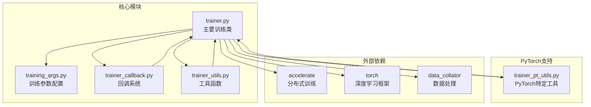
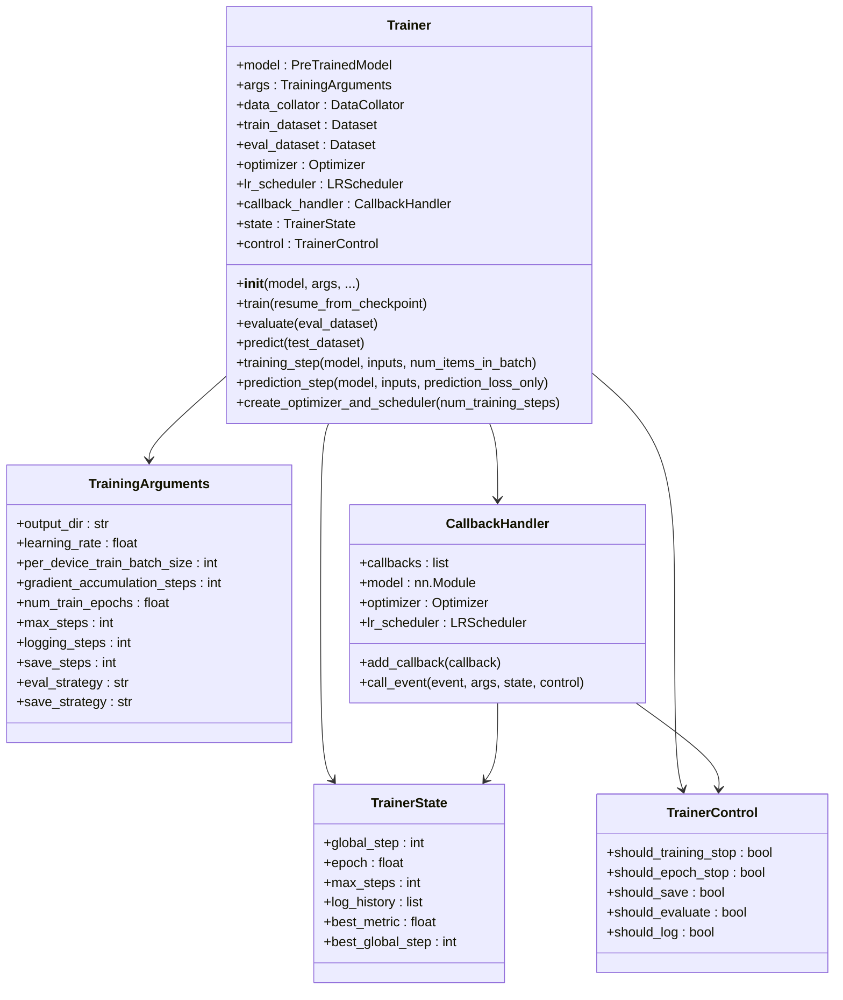
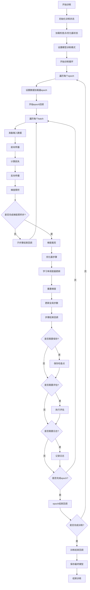
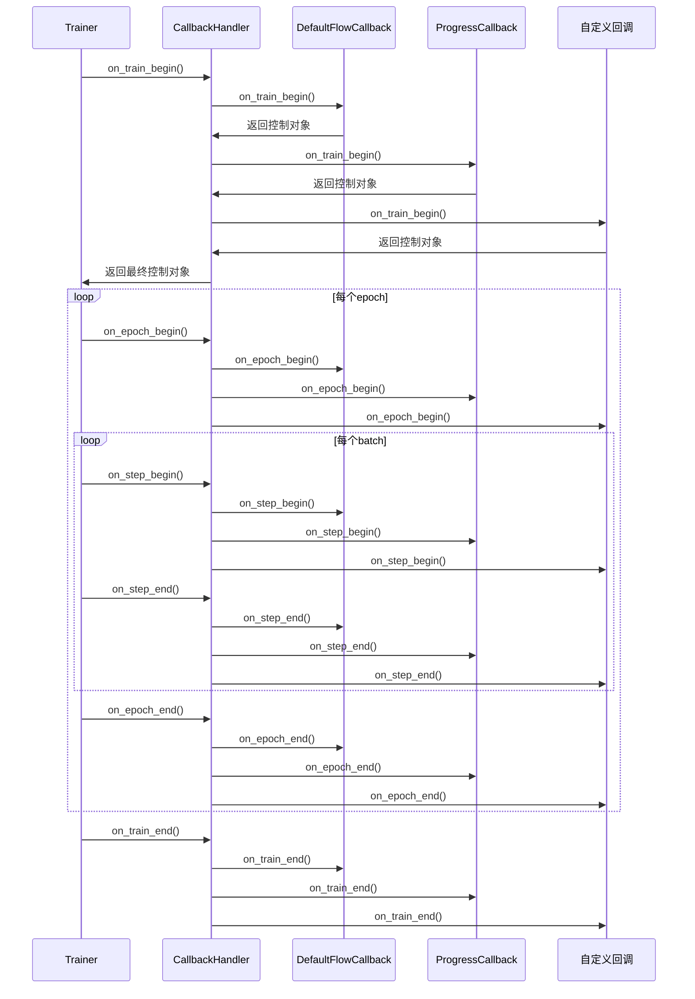
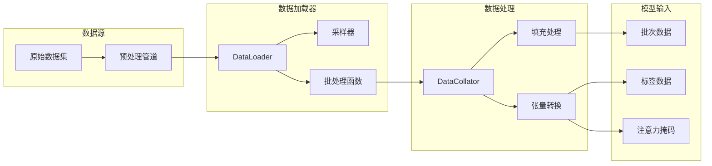
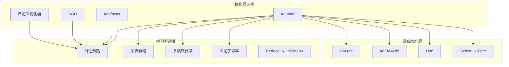
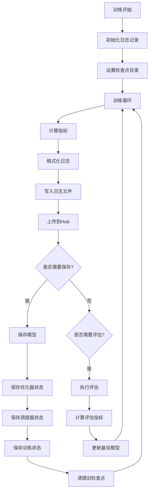
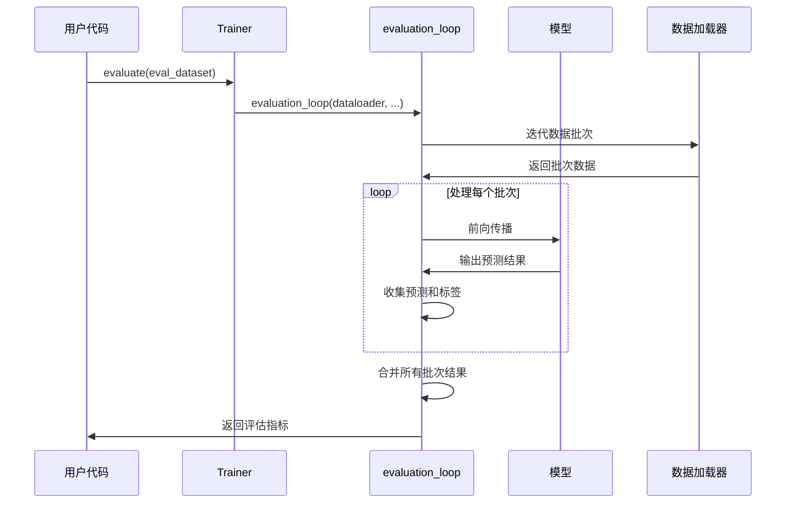
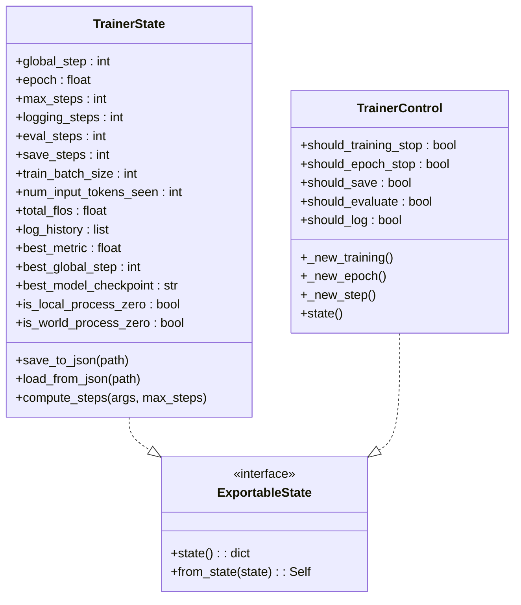

# 核心概念

<cite>
**本文档中引用的文件**
- [trainer.py](file://src/transformers/trainer.py)
- [training_args.py](file://src/transformers/training_args.py)
- [trainer_callback.py](file://src/transformers/trainer_callback.py)
- [trainer_utils.py](file://src/transformers/trainer_utils.py)
- [trainer_pt_utils.py](file://src/transformers/trainer_pt_utils.py)
</cite>

## 目录
1. [简介](#简介)
2. [项目结构概览](#项目结构概览)
3. [Trainer类核心架构](#trainer类核心架构)
4. [训练循环详解](#训练循环详解)
5. [回调系统](#回调系统)
6. [数据加载与处理](#数据加载与处理)
7. [优化器与学习率调度](#优化器与学习率调度)
8. [日志记录与检查点](#日志记录与检查点)
9. [评估与预测流程](#评估与预测流程)
10. [状态管理](#状态管理)
11. [故障排除指南](#故障排除指南)
12. [总结](#总结)

## 简介

Trainer API是Hugging Face Transformers库中的核心训练框架，它提供了一个高度抽象且功能完整的训练循环，简化了深度学习模型的训练过程。Trainer不仅封装了复杂的训练逻辑，还提供了灵活的扩展机制，支持分布式训练、混合精度、梯度累积等多种高级特性。

本文档将深入探讨Trainer的核心概念，包括其内部工作机制、回调系统、状态管理和各种训练流程的实现细节。

## 项目结构概览

Trainer API的实现分布在多个模块中，形成了一个层次化的架构：

**图表来源**
- [trainer.py](file://src/transformers/trainer.py#L1-L100)
- [training_args.py](file://src/transformers/training_args.py#L1-L50)
- [trainer_callback.py](file://src/transformers/trainer_callback.py#L1-L50)

## Trainer类核心架构

Trainer类是整个训练框架的核心，它继承自多个基类并集成了丰富的功能：

**图表来源**
- [trainer.py](file://src/transformers/trainer.py#L200-L400)
- [training_args.py](file://src/transformers/training_args.py#L200-L400)
- [trainer_callback.py](file://src/transformers/trainer_callback.py#L300-L500)

**章节来源**
- [trainer.py](file://src/transformers/trainer.py#L200-L600)
- [training_args.py](file://src/transformers/training_args.py#L200-L600)

## 训练循环详解

Trainer的训练循环是其最核心的功能，它包含了完整的训练流程控制：

**图表来源**
- [trainer.py](file://src/transformers/trainer.py#L2373-L2600)

### 训练循环的关键阶段

1. **初始化阶段**：设置训练环境、加载检查点、初始化状态
2. **Epoch循环**：处理每个训练周期的数据
3. **Batch处理**：单个批次的前向和后向传播
4. **梯度累积**：多步累积以模拟大批次训练
5. **优化步骤**：参数更新和学习率调整
6. **监控与保存**：定期评估、日志记录和模型保存

**章节来源**
- [trainer.py](file://src/transformers/trainer.py#L2373-L2600)

## 回调系统

Trainer的回调系统提供了强大的扩展机制，允许开发者在训练过程的各个关键节点插入自定义逻辑：

**图表来源**
- [trainer_callback.py](file://src/transformers/trainer_callback.py#L424-L565)

### 内置回调类型

#### DefaultFlowCallback
负责默认的训练流程控制，包括：
- 日志记录触发条件
- 评估触发条件  
- 检查点保存触发条件
- 训练终止条件

#### ProgressCallback
提供进度条显示和实时日志输出：
- 训练进度跟踪
- 实时指标显示
- 日志格式化输出

#### PrinterCallback
简单的日志打印回调，用于基本的日志输出。

#### EarlyStoppingCallback
实现早停机制：
- 基于验证指标的早停
- 可配置的耐心值和阈值
- 与最佳模型加载配合使用

**章节来源**
- [trainer_callback.py](file://src/transformers/trainer_callback.py#L424-L767)

## 数据加载与处理

Trainer通过DataLoader和DataCollator实现了灵活的数据处理机制：

**图表来源**
- [trainer.py](file://src/transformers/trainer.py#L1000-L1200)
- [trainer_pt_utils.py](file://src/transformers/trainer_pt_utils.py#L50-L150)

### 数据处理流程

1. **数据预处理**：移除未使用的列，确保数据格式正确
2. **采样策略**：根据分布式训练需求选择合适的采样器
3. **批处理构建**：使用DataCollator组合单个样本为批次
4. **动态填充**：处理变长序列，添加注意力掩码
5. **设备传输**：将数据移动到正确的设备上

**章节来源**
- [trainer.py](file://src/transformers/trainer.py#L1000-L1200)

## 优化器与学习率调度

Trainer支持多种优化器和学习率调度策略：

**图表来源**
- [training_args.py](file://src/transformers/training_args.py#L150-L250)

### 优化器配置

TrainingArguments提供了丰富的优化器配置选项：
- **优化器类型**：支持多种优化算法
- **权重衰减**：可配置的L2正则化
- **梯度裁剪**：防止梯度爆炸
- **混合精度**：支持FP16/BF16训练

**章节来源**
- [training_args.py](file://src/transformers/training_args.py#L150-L400)

## 日志记录与检查点

Trainer实现了完整的日志记录和检查点管理系统：

**图表来源**
- [trainer.py](file://src/transformers/trainer.py#L2600-L2800)

### 检查点策略

- **按步骤保存**：基于训练步数的保存策略
- **按时间保存**：基于时间间隔的保存策略  
- **按评估保存**：基于验证性能的保存策略
- **最佳模型保存**：自动保存表现最好的模型

**章节来源**
- [trainer.py](file://src/transformers/trainer.py#L2600-L2800)

## 评估与预测流程

Trainer提供了统一的评估和预测接口：

**图表来源**
- [trainer.py](file://src/transformers/trainer.py#L4200-L4400)

### 评估流程特点

1. **统一接口**：evaluate和predict共享相同的底层实现
2. **内存优化**：支持大批次数据的分块处理
3. **指标计算**：自动计算各种评估指标
4. **速度统计**：提供详细的性能指标

**章节来源**
- [trainer.py](file://src/transformers/trainer.py#L4200-L4400)

## 状态管理

Trainer通过TrainerState和TrainerControl实现了完整的状态管理系统：

**图表来源**
- [trainer_callback.py](file://src/transformers/trainer_callback.py#L50-L200)

### 状态持久化

- **检查点保存**：自动保存训练状态到磁盘
- **状态恢复**：从检查点恢复训练状态
- **分布式同步**：确保多进程间状态一致性

**章节来源**
- [trainer_callback.py](file://src/transformers/trainer_callback.py#L50-L200)

## 故障排除指南

### 常见问题及解决方案

#### 内存不足问题
- **解决方案**：启用梯度检查点、减少批次大小、使用混合精度
- **配置参数**：`gradient_checkpointing=True`、`fp16=True`、`per_device_train_batch_size`

#### 训练速度慢
- **解决方案**：优化数据加载、使用编译加速、调整批次大小
- **配置参数**：`dataloader_num_workers`、`torch_compile`、`auto_find_batch_size`

#### 分布式训练问题
- **解决方案**：检查环境变量、网络连接、存储权限
- **配置参数**：`ddp_backend`、`find_unused_parameters`、`bucket_cap_mb`

**章节来源**
- [trainer_utils.py](file://src/transformers/trainer_utils.py#L600-L800)

## 总结

Trainer API作为Hugging Face Transformers的核心组件，通过其精心设计的架构提供了：

1. **完整的训练生命周期管理**：从初始化到模型保存的全流程自动化
2. **灵活的扩展机制**：通过回调系统支持自定义逻辑插入
3. **强大的分布式训练支持**：原生支持多GPU、多节点训练
4. **丰富的配置选项**：满足不同场景的训练需求
5. **完善的监控和调试功能**：提供详细的训练指标和错误诊断

通过深入理解Trainer的核心概念和工作机制，开发者可以更好地利用这个强大的训练框架，构建高效、可靠的深度学习模型训练系统。