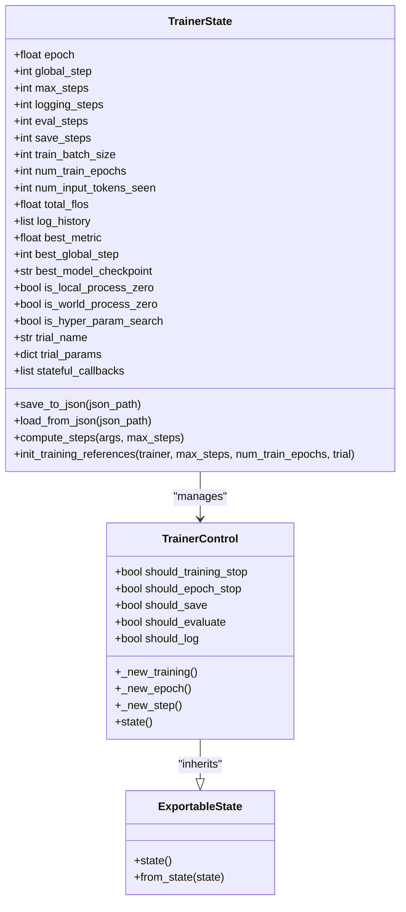
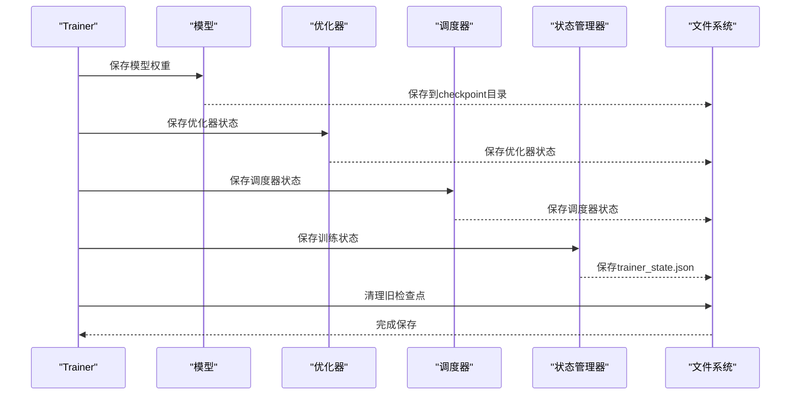
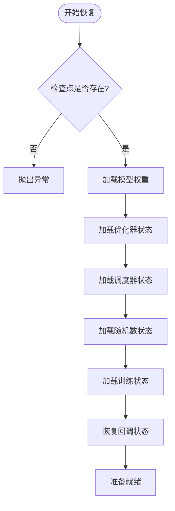
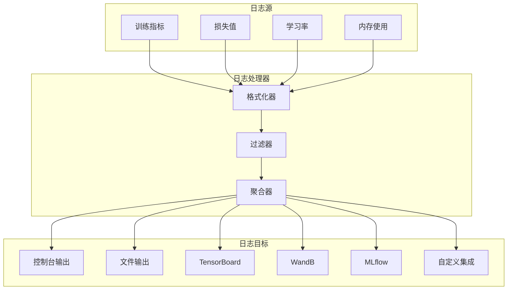
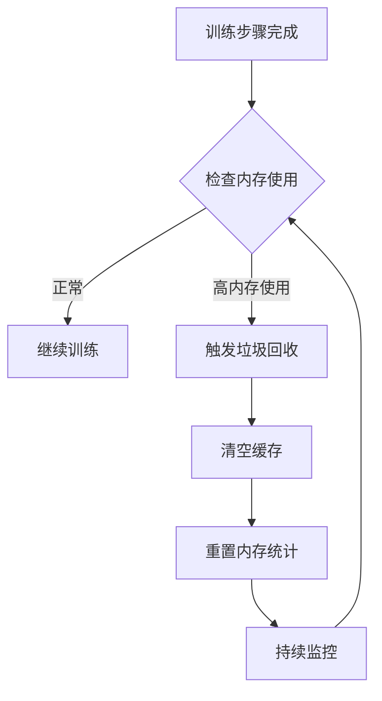

# 状态管理

<cite>
**本文档引用的文件**
- [training_args.py](file://src/transformers/training_args.py)
- [trainer.py](file://src/transformers/trainer.py)
- [trainer_utils.py](file://src/transformers/trainer_utils.py)
- [trainer_callback.py](file://src/transformers/trainer_callback.py)
- [integration_utils.py](file://src/transformers/integrations/integration_utils.py)
</cite>

## 目录
1. [简介](#简介)
2. [TrainingArguments配置类详解](#trainingarguments配置类详解)
3. [训练状态管理](#训练状态管理)
4. [检查点系统](#检查点系统)
5. [日志记录系统](#日志记录系统)
6. [资源管理](#资源管理)
7. [状态文件格式](#状态文件格式)
8. [手动干预指南](#手动干预指南)
9. [总结](#总结)

## 简介

Transformer库的Trainer状态管理系统是一个复杂而精密的框架，负责在整个训练过程中维护和管理各种状态信息。该系统不仅确保训练过程的可恢复性，还提供了丰富的监控和调试功能。本文档将深入探讨状态管理的各个方面，包括配置参数、持久化机制、检查点管理、日志记录和资源监控。

## TrainingArguments配置类详解

### 核心配置参数

TrainingArguments是训练配置的核心类，包含了影响训练行为的所有参数。以下是关键参数的分类和作用：

#### 基础训练参数

| 参数名称 | 类型 | 默认值 | 作用范围 |
|---------|------|--------|----------|
| `output_dir` | str | None | 模型预测和检查点的输出目录 |
| `do_train` | bool | False | 是否运行训练 |
| `do_eval` | bool | False | 是否在验证集上运行评估 |
| `do_predict` | bool | False | 是否在测试集上运行预测 |

#### 批处理和梯度参数

| 参数名称 | 类型 | 默认值 | 作用范围 |
|---------|------|--------|----------|
| `per_device_train_batch_size` | int | 8 | 每个设备的训练批次大小 |
| `per_device_eval_batch_size` | int | 8 | 每个设备的评估批次大小 |
| `gradient_accumulation_steps` | int | 1 | 梯度累积步数 |
| `eval_accumulation_steps` | int | None | 评估时的累积步数 |

#### 学习率和优化器参数

| 参数名称 | 类型 | 默认值 | 作用范围 |
|---------|------|--------|----------|
| `learning_rate` | float | 5e-5 | 初始学习率 |
| `weight_decay` | float | 0.0 | 权重衰减系数 |
| `adam_beta1` | float | 0.9 | Adam优化器的beta1参数 |
| `adam_beta2` | float | 0.999 | Adam优化器的beta2参数 |
| `adam_epsilon` | float | 1e-8 | Adam优化器的epsilon参数 |
| `max_grad_norm` | float | 1.0 | 最大梯度范数 |

#### 训练策略参数

| 参数名称 | 类型 | 默认值 | 作用范围 |
|---------|------|--------|----------|
| `num_train_epochs` | float | 3.0 | 总训练轮数 |
| `max_steps` | int | -1 | 最大训练步数 |
| `lr_scheduler_type` | str/SchedulerType | "linear" | 学习率调度器类型 |
| `warmup_steps` | float | 0 | 预热步数 |

#### 日志和保存策略

| 参数名称 | 类型 | 默认值 | 作用范围 |
|---------|------|--------|----------|
| `logging_strategy` | str/IntervalStrategy | "steps" | 日志记录策略 |
| `logging_steps` | int/float | 500 | 日志记录间隔 |
| `save_strategy` | str/SaveStrategy | "steps" | 检查点保存策略 |
| `save_steps` | int/float | 500 | 检查点保存间隔 |
| `save_total_limit` | int | None | 保存的检查点总数限制 |
| `save_safetensors` | bool | True | 是否使用安全张量格式 |

#### 内存和性能参数

| 参数名称 | 类型 | 默认值 | 作用范围 |
|---------|------|--------|----------|
| `torch_empty_cache_steps` | int | None | 调用torch.empty_cache()的间隔 |
| `bf16` | bool | False | 是否使用bfloat16精度 |
| `fp16` | bool | False | 是否使用float16精度 |
| `skip_memory_metrics` | bool | True | 是否跳过内存指标收集 |

**章节来源**
- [training_args.py](file://src/transformers/training_args.py#L1-L1200)

## 训练状态管理

### TrainerState类结构

TrainerState是训练状态的核心数据结构，包含了训练过程中的所有重要信息：



**图表来源**
- [trainer_callback.py](file://src/transformers/trainer_callback.py#L35-L150)

### 状态持久化机制

训练状态的持久化通过以下机制实现：

#### 自动状态保存

训练过程中的状态会在以下情况下自动保存：
- 检查点保存时
- 评估完成后
- 训练结束时
- 学习率调度器更新时

#### 状态文件位置

状态文件存储在检查点目录中，主要包含：
- `trainer_state.json`：训练状态信息
- `rng_state.pth`：随机数生成器状态
- `rng_state_{process_index}.pth`：分布式训练中的进程特定状态

**章节来源**
- [trainer_callback.py](file://src/transformers/trainer_callback.py#L150-L200)

## 检查点系统

### 检查点创建流程



**图表来源**
- [trainer.py](file://src/transformers/trainer.py#L3074-L3132)

### 检查点保存内容

每个检查点包含以下组件：

#### 必需组件
- 模型权重文件（`pytorch_model.bin`或`safetensors`）
- 模型配置文件（`config.json`）
- 分词器文件（如果存在）

#### 可选组件
- 优化器状态（`optimizer.pt`）
- 学习率调度器状态（`scheduler.pt`）
- 梯度缩放器状态（`scaler.pt`）
- 随机数生成器状态（`rng_state.pth`）
- 训练状态（`trainer_state.json`）

### 断点续训机制

断点续训通过以下步骤实现：

#### 恢复检查点



**图表来源**
- [trainer.py](file://src/transformers/trainer.py#L2671-L2806)

#### 恢复策略

- **完全恢复**：恢复模型、优化器、调度器和训练状态
- **模型恢复**：仅恢复模型权重（`save_only_model=True`）
- **最佳模型恢复**：恢复表现最好的模型（`load_best_model_at_end=True`）

**章节来源**
- [trainer.py](file://src/transformers/trainer.py#L2671-L2806)

## 日志记录系统

### 日志收集机制

日志记录系统采用分层架构，支持多种输出目标：



**图表来源**
- [integration_utils.py](file://src/transformers/integrations/integration_utils.py#L582-L700)

### 第三方工具集成

#### TensorBoard集成

TensorBoard集成提供实时可视化功能：

| 功能特性 | 描述 | 实现方式 |
|---------|------|----------|
| 标量可视化 | 显示损失、准确率等标量指标 | `add_scalar()` |
| 文本可视化 | 显示文本类型的日志信息 | `add_text()` |
| 图表导出 | 支持图表数据导出 | `flush()` |
| 多实验对比 | 支持多个实验的对比分析 | 不同日志目录 |

#### Weights & Biases (WandB) 集成

WandB集成提供高级的实验跟踪功能：

| 特性 | 功能描述 | 配置参数 |
|------|----------|----------|
| 模型检查点上传 | 自动上传模型检查点 | `WANDB_LOG_MODEL` |
| 超参数跟踪 | 自动记录超参数设置 | `report_to=["wandb"]` |
| 实时监控 | 实时查看训练进度 | `wandb.init()` |
| 实验比较 | 支持多实验对比 | Sweep功能 |

#### 其他集成工具

- **MLflow**：实验跟踪和模型管理
- **ClearML**：分布式训练监控
- **Neptune**：机器学习项目管理
- **CodeCarbon**：碳足迹追踪

**章节来源**
- [integration_utils.py](file://src/transformers/integrations/integration_utils.py#L688-L710)

## 资源管理

### GPU内存监控

内存管理是训练稳定性的重要保障，系统提供了多层次的内存监控和清理机制：

#### 自动内存清理



**图表来源**
- [trainer_utils.py](file://src/transformers/trainer_utils.py#L533-L558)

#### 内存监控参数

| 参数名称 | 类型 | 默认值 | 作用 |
|---------|------|--------|------|
| `torch_empty_cache_steps` | int | None | 调用`torch.empty_cache()`的间隔步数 |
| `skip_memory_metrics` | bool | True | 是否跳过内存指标收集 |

#### 设备特定内存管理

系统针对不同硬件平台提供专门的内存管理：

- **CUDA GPU**：使用`torch.cuda.empty_cache()`
- **MLU**：使用`torch.mlu.empty_cache()`
- **NPU**：使用`torch.npu.empty_cache()`
- **HPU**：使用`torch.hpu.empty_cache()`
- **MPS**：使用`torch.mps.empty_cache()`

### 自动清理机制

#### 垃圾回收策略

内存清理采用以下策略：
1. **主动触发**：在指定步数后主动调用`torch.empty_cache()`
2. **被动监控**：定期检查内存使用情况
3. **智能释放**：释放不再使用的张量和中间结果

#### 内存峰值跟踪

系统会跟踪以下内存指标：
- 当前分配内存
- 峰值内存使用
- 内存分配增量
- 内存释放增量

**章节来源**
- [trainer_utils.py](file://src/transformers/trainer_utils.py#L592-L644)

## 状态文件格式

### TrainerState文件格式

`trainer_state.json`文件包含完整的训练状态信息：

```json
{
  "epoch": 1.5,
  "global_step": 1500,
  "max_steps": 3000,
  "logging_steps": 500,
  "eval_steps": 500,
  "save_steps": 500,
  "train_batch_size": 8,
  "num_train_epochs": 3,
  "num_input_tokens_seen": 120000,
  "total_flos": 1250000000000.0,
  "log_history": [
    {
      "loss": 2.1456,
      "learning_rate": 5e-5,
      "epoch": 1.0,
      "step": 500
    }
  ],
  "best_metric": 0.856,
  "best_global_step": 1000,
  "best_model_checkpoint": "checkpoint-1000",
  "is_local_process_zero": true,
  "is_world_process_zero": true,
  "is_hyper_param_search": false,
  "trial_name": null,
  "trial_params": null,
  "stateful_callbacks": {}
}
```

### RNG状态文件格式

随机数生成器状态以字典形式保存：

```json
{
  "python": [...],
  "numpy": [...],
  "cpu": [...],
  "cuda": [...],
  "xla": [...],
  "npu": [...],
  "hpu": [...],
  "mlu": [...],
  "musa": [...]
}
```

### 检查点目录结构

典型的检查点目录包含以下文件：

```
checkpoint-1500/
├── pytorch_model.bin
├── config.json
├── tokenizer.json
├── trainer_state.json
├── optimizer.pt
├── scheduler.pt
├── rng_state.pth
└── safety_flags.json
```

**章节来源**
- [trainer_callback.py](file://src/transformers/trainer_callback.py#L120-L150)

## 手动干预指南

### 手动保存检查点

当需要手动保存检查点时，可以使用以下方法：

```python
# 手动保存当前状态
trainer.save_state()

# 手动保存模型和状态
trainer.save_model(output_dir="manual_checkpoint")
```

### 状态文件修复

当状态文件损坏时的修复方法：

#### 检查点损坏处理

1. **识别问题**：检查`trainer_state.json`是否可读
2. **回退策略**：使用最近的有效检查点
3. **状态重建**：从模型权重重建基本状态

#### 内存问题解决

当遇到内存相关问题时：

1. **调整批处理大小**：减少`per_device_train_batch_size`
2. **启用梯度检查点**：设置`gradient_checkpointing=True`
3. **使用混合精度**：启用`fp16`或`bf16`
4. **增加清理频率**：设置较小的`torch_empty_cache_steps`

### 性能调优建议

#### 内存优化

- 合理设置`save_total_limit`避免过多检查点
- 使用`safetensors`格式减少I/O开销
- 在分布式训练中启用`save_on_each_node=False`

#### 训练效率

- 根据硬件选择合适的精度模式
- 优化数据加载器参数
- 合理设置日志和保存频率

**章节来源**
- [trainer.py](file://src/transformers/trainer.py#L921-L931)

## 总结

Transformer库的Trainer状态管理系统是一个功能完备、设计精良的框架，它通过以下核心特性确保了训练过程的稳定性和可恢复性：

### 主要优势

1. **全面的状态覆盖**：从模型权重到随机数状态的完整保存
2. **灵活的配置选项**：丰富的TrainingArguments满足不同需求
3. **强大的恢复能力**：支持断点续训和最佳模型加载
4. **丰富的监控功能**：集成多种日志和可视化工具
5. **智能的资源管理**：自动内存清理和设备适配

### 最佳实践建议

- 合理设置检查点保存策略，平衡存储空间和恢复灵活性
- 根据硬件条件选择合适的精度模式
- 定期监控内存使用情况，及时调整清理策略
- 充分利用第三方工具进行实验跟踪和可视化

这个状态管理系统为深度学习训练提供了坚实的基础，使得复杂的训练过程变得可控、可监控和可恢复。