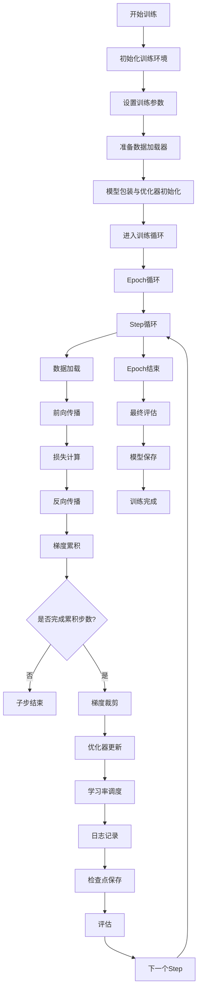
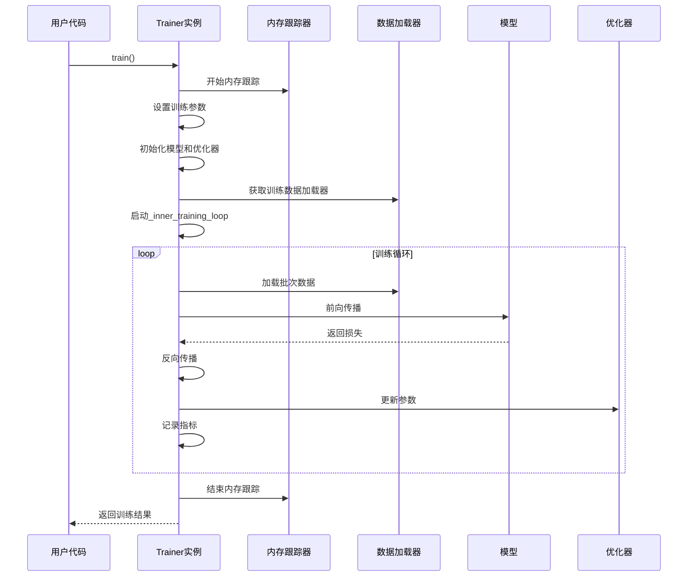
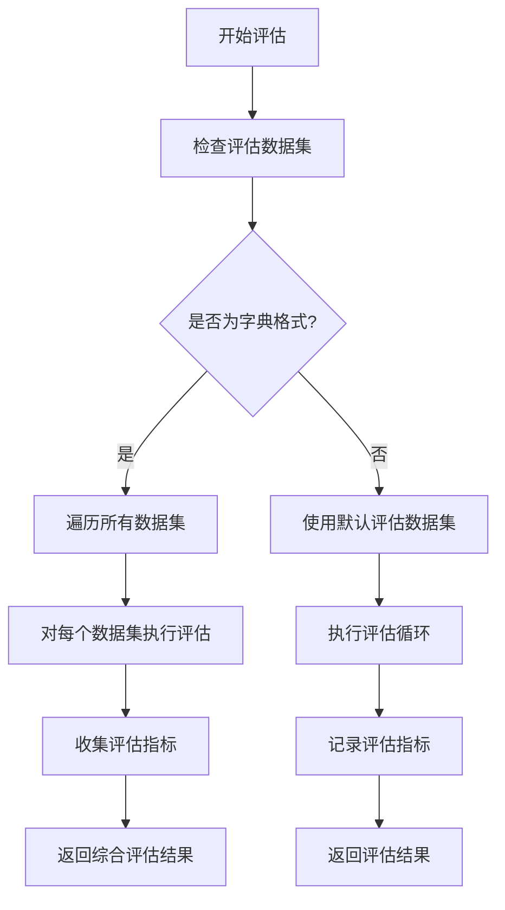
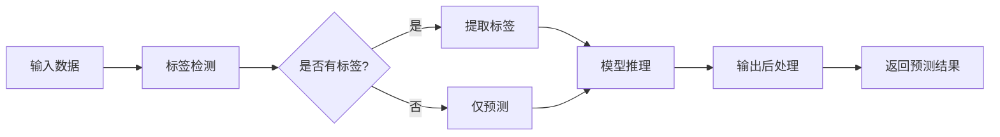
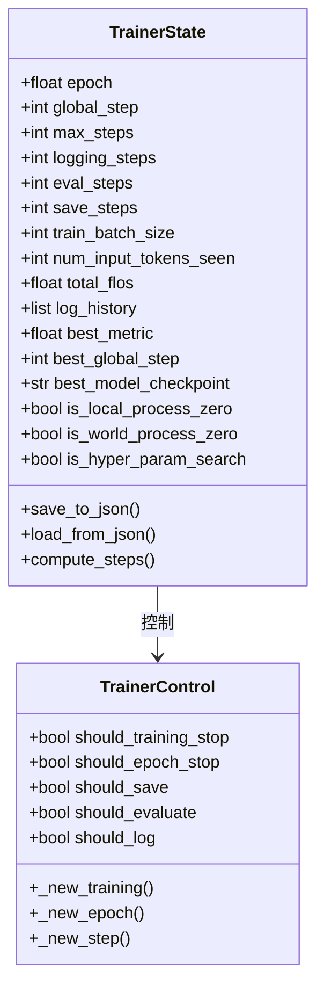
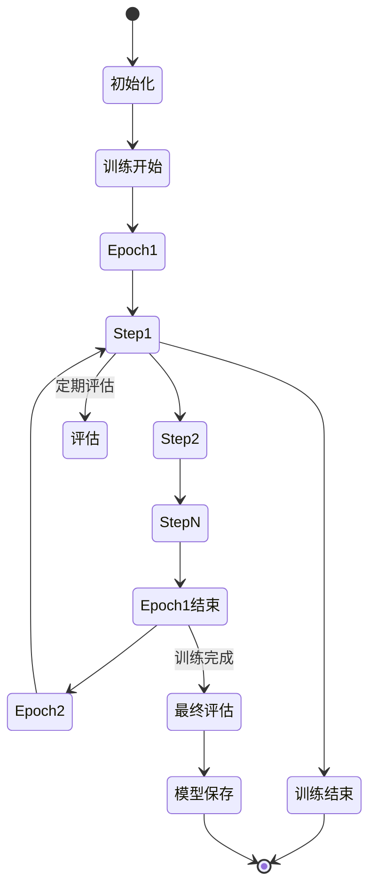
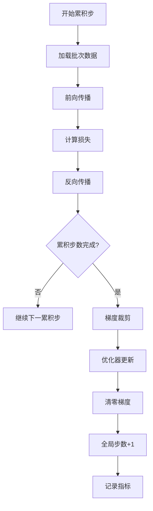
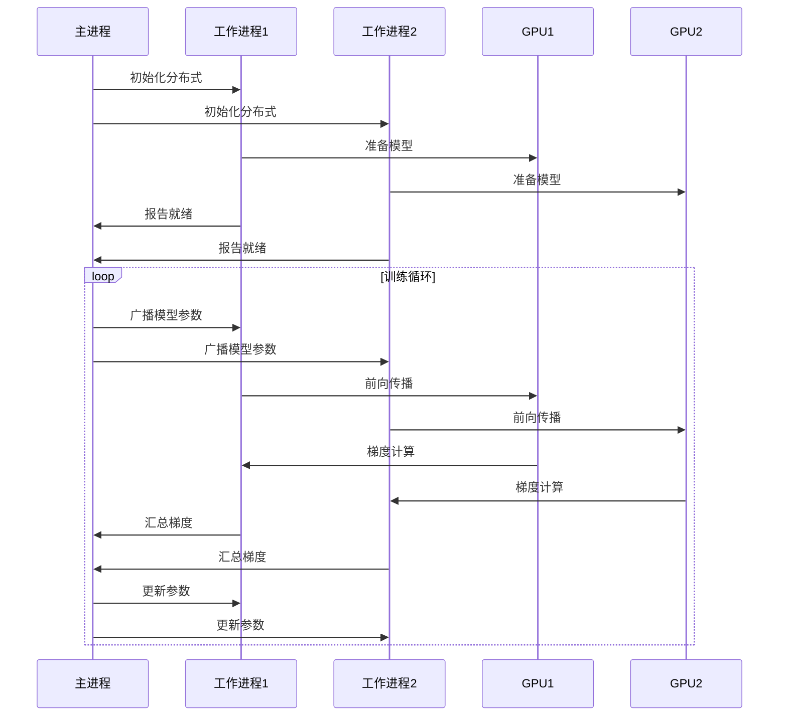
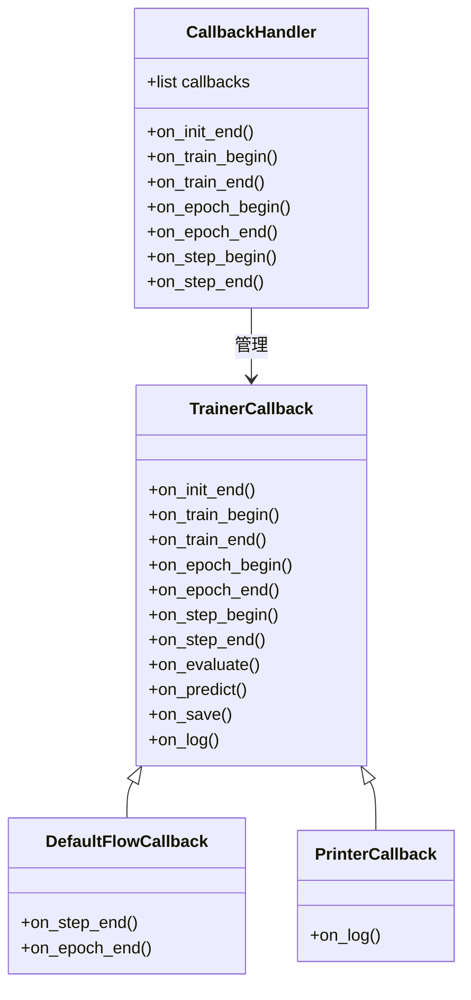

# 训练循环

<cite>
**本文档引用的文件**
- [trainer.py](file://src/transformers/trainer.py)
- [training_args.py](file://src/transformers/training_args.py)
- [trainer_utils.py](file://src/transformers/trainer_utils.py)
- [trainer_pt_utils.py](file://src/transformers/trainer_pt_utils.py)
- [trainer_callback.py](file://src/transformers/trainer_callback.py)
</cite>

## 目录
1. [简介](#简介)
2. [训练循环架构概览](#训练循环架构概览)
3. [训练阶段详解](#训练阶段详解)
4. [评估循环实现](#评估循环实现)
5. [预测循环机制](#预测循环机制)
6. [训练状态管理](#训练状态管理)
7. [梯度累积与优化](#梯度累积与优化)
8. [混合精度训练](#混合精度训练)
9. [分布式训练支持](#分布式训练支持)
10. [回调系统与扩展性](#回调系统与扩展性)
11. [性能优化策略](#性能优化策略)
12. [故障排除指南](#故障排除指南)

## 简介

Trainer类是Hugging Face Transformers库中负责模型训练的核心组件，它提供了一个完整、可扩展且高度优化的训练循环实现。该训练循环涵盖了从数据加载到模型更新的整个训练过程，并支持多种高级功能如混合精度训练、分布式训练、梯度累积等。

## 训练循环架构概览

Trainer类的训练循环采用模块化设计，主要分为三个核心阶段：训练（train）、评估（evaluate）和预测（predict）。每个阶段都有独立的执行流程和优化策略。



**图表来源**
- [trainer.py](file://src/transformers/trainer.py#L2182-L2651)

**章节来源**
- [trainer.py](file://src/transformers/trainer.py#L2054-L2159)
- [trainer.py](file://src/transformers/trainer.py#L2182-L2651)

## 训练阶段详解

### 训练入口点

训练过程从`train()`方法开始，该方法负责初始化训练环境并启动主训练循环。



**图表来源**
- [trainer.py](file://src/transformers/trainer.py#L2054-L2159)
- [trainer.py](file://src/transformers/trainer.py#L2182-L2651)

### 主训练循环实现

主训练循环在`_inner_training_loop`方法中实现，包含了完整的训练逻辑：

#### 关键步骤分析

1. **环境准备阶段**
   - 批次大小自动调整
   - 数据加载器配置
   - 模型和优化器初始化

2. **训练控制变量设置**
   - 计算训练轮次和步数
   - 设置最大训练步数
   - 配置梯度累积参数

3. **模型包装与准备**
   - 使用Accelerator进行模型包装
   - 处理分布式训练场景
   - 应用混合精度训练

4. **训练循环主体**
   - Epoch遍历
   - Step遍历
   - 数据加载与处理
   - 前向传播与损失计算
   - 反向传播与参数更新

**章节来源**
- [trainer.py](file://src/transformers/trainer.py#L2182-L2651)

### 训练步骤执行

单个训练步骤通过`training_step`方法实现，包含以下核心操作：


**图表来源**
- [trainer.py](file://src/transformers/trainer.py#L3725-L3794)

**章节来源**
- [trainer.py](file://src/transformers/trainer.py#L3725-L3794)

## 评估循环实现

评估循环与训练循环分离，提供独立的模型评估功能。

### 评估入口点

评估过程通过`evaluate()`方法启动，支持多种评估场景：



**图表来源**
- [trainer.py](file://src/transformers/trainer.py#L4136-L4235)

### 评估循环核心逻辑

评估循环在`evaluation_loop`方法中实现，提供了灵活的评估框架：

#### 评估流程特点

1. **模型准备**
   - 模型包装与优化
   - 设备移动与类型转换
   - 分布式环境适配

2. **数据处理**
   - 批次数据加载
   - 输入预处理
   - 标签提取

3. **推理执行**
   - 前向传播
   - 损失计算（可选）
   - 输出后处理

4. **指标计算**
   - 预测结果收集
   - 标签匹配
   - 性能指标计算

**章节来源**
- [trainer.py](file://src/transformers/trainer.py#L4136-L4235)
- [trainer.py](file://src/transformers/trainer.py#L4298-L4504)

### 预测步骤实现

预测过程通过`prediction_step`方法实现，专门用于生成模型输出而不计算损失：



**图表来源**
- [trainer.py](file://src/transformers/trainer.py#L4523-L4626)

**章节来源**
- [trainer.py](file://src/transformers/trainer.py#L4237-L4296)
- [trainer.py](file://src/transformers/trainer.py#L4523-L4626)

## 预测循环机制

预测循环提供了专门的模型推理功能，支持批量预测和指标计算。

### 预测入口点

预测过程通过`predict()`方法启动，与评估过程类似但更专注于推理输出：

#### 预测特性

1. **灵活性**：支持带标签和不带标签的数据集
2. **性能优化**：针对推理场景的优化
3. **指标计算**：可选择性地计算评估指标
4. **内存管理**：高效的内存使用策略

**章节来源**
- [trainer.py](file://src/transformers/trainer.py#L4237-L4296)

## 训练状态管理

Trainer类使用`TrainerState`和`TrainerControl`两个核心类来管理系统状态和控制流程。

### 训练状态跟踪



**图表来源**
- [trainer_callback.py](file://src/transformers/trainer_callback.py#L35-L186)
- [trainer_callback.py](file://src/transformers/trainer_callback.py#L234-L292)

### 状态转换机制

训练过程中的状态转换遵循严格的时序控制：



**章节来源**
- [trainer_callback.py](file://src/transformers/trainer_callback.py#L35-L186)
- [trainer_callback.py](file://src/transformers/trainer_callback.py#L234-L292)

## 梯度累积与优化

### 梯度累积机制

Trainer类支持梯度累积以模拟更大的批次大小：



### 优化器配置

Trainer支持多种优化器类型，包括：
- AdamW及其变体
- SGD
- AdaFactor
- 自定义优化器

**章节来源**
- [trainer.py](file://src/transformers/trainer.py#L2182-L2651)

## 混合精度训练

### AMP支持

Trainer类内置了对混合精度训练（AMP）的支持：

#### 支持的精度模式

1. **FP16训练**
   - 自动损失缩放
   - 梯度溢出检测
   - 性能优化

2. **BF16训练**
   - 更好的数值稳定性
   - 广泛的硬件支持
   - 推荐用于大模型训练

3. **FP8训练**
   - 极致的内存效率
   - 高性能计算
   - 实验性功能

### 自动混合精度实现


**章节来源**
- [training_args.py](file://src/transformers/training_args.py#L2722-L2748)

## 分布式训练支持

### 支持的分布式策略

Trainer类支持多种分布式训练策略：

#### 1. 数据并行（DDP）
- 多GPU训练
- 负载均衡
- 同步更新

#### 2. 模型并行（FSDP）
- 大模型训练
- 参数分片
- 内存优化

#### 3. ZeRO优化器
- DeepSpeed集成
- 参数状态分片
- 内存效率提升

#### 4. 上下文并行
- 流水线并行
- 计算资源利用
- 延迟优化

### 分布式训练流程



**章节来源**
- [trainer.py](file://src/transformers/trainer.py#L2182-L2651)

## 回调系统与扩展性

### 回调机制概述

Trainer类采用了强大的回调系统，允许用户在训练过程的关键节点插入自定义逻辑：



**图表来源**
- [trainer_callback.py](file://src/transformers/trainer_callback.py#L295-L421)

### 回调事件类型

#### 训练生命周期回调
- `on_init_end`: 初始化结束
- `on_train_begin`: 训练开始
- `on_train_end`: 训练结束

#### 训练过程回调
- `on_epoch_begin`: 新的训练轮次开始
- `on_epoch_end`: 训练轮次结束
- `on_step_begin`: 新的训练步开始
- `on_step_end`: 训练步结束

#### 特殊功能回调
- `on_evaluate`: 评估完成后
- `on_predict`: 预测完成后
- `on_save`: 保存检查点后
- `on_log`: 日志记录后

### 自定义回调示例

开发者可以通过继承`TrainerCallback`类来创建自定义回调：

```python
class CustomCallback(TrainerCallback):
    def on_step_end(self, args, state, control, **kwargs):
        # 在每个训练步结束后执行自定义逻辑
        if state.global_step % 100 == 0:
            print(f"Step {state.global_step} completed")
```

**章节来源**
- [trainer_callback.py](file://src/transformers/trainer_callback.py#L295-L421)

## 性能优化策略

### 内存优化

Trainer类实现了多种内存优化技术：

#### 1. 梯度检查点
- 减少内存占用
- 增加计算开销
- 适用于内存受限场景

#### 2. 模型编译
- Torch.compile支持
- 图优化
- 性能提升

#### 3. 缓存管理
- 自动缓存清理
- 内存峰值监控
- 动态内存调整

### 计算优化

#### 1. 混合精度训练
- FP16/BF16计算
- 自动损失缩放
- 数值稳定性保证

#### 2. 批次大小优化
- 自动批次大小查找
- 内存使用监控
- 性能基准测试

#### 3. 数据加载优化
- 异步数据加载
- 预取机制
- 缓存策略

**章节来源**
- [trainer_utils.py](file://src/transformers/trainer_utils.py#L400-L799)
- [trainer_pt_utils.py](file://src/transformers/trainer_pt_utils.py#L700-L1243)

## 故障排除指南

### 常见问题与解决方案

#### 1. 内存不足错误
- 减少批次大小
- 启用梯度检查点
- 使用混合精度训练
- 启用模型并行

#### 2. 训练速度慢
- 优化数据加载
- 启用混合精度
- 调整批次大小
- 使用模型编译

#### 3. 分布式训练问题
- 检查网络连接
- 验证环境配置
- 确认同步机制
- 监控负载均衡

#### 4. 混合精度训练问题
- 检查硬件支持
- 调整损失缩放
- 监控数值稳定性
- 降级到全精度

### 调试工具

Trainer类提供了丰富的调试选项：

#### 1. 调试标志
- `UNDERFLOW_OVERFLOW`: 溢出检测
- `TPU_METRICS_DEBUG`: TPU指标调试

#### 2. 性能监控
- 内存使用跟踪
- 计算时间统计
- 指标记录
- 可视化支持

#### 3. 日志记录
- 详细的训练日志
- 错误信息追踪
- 性能指标报告
- 自定义日志格式

**章节来源**
- [training_args.py](file://src/transformers/training_args.py#L400-L600)

## 结论

Trainer类的训练循环实现体现了现代深度学习框架的设计理念，通过模块化架构、灵活的扩展机制和全面的优化策略，为研究人员和开发者提供了一个强大而易用的训练平台。其支持的功能涵盖了从基础训练到高级优化的各种需求，同时保持了良好的性能和可维护性。

通过深入理解训练循环的各个组成部分，开发者可以更好地利用Trainer类的强大功能，实现高效、稳定的模型训练过程。无论是简单的微调任务还是复杂的分布式训练实验，Trainer类都能提供相应的支持和优化。