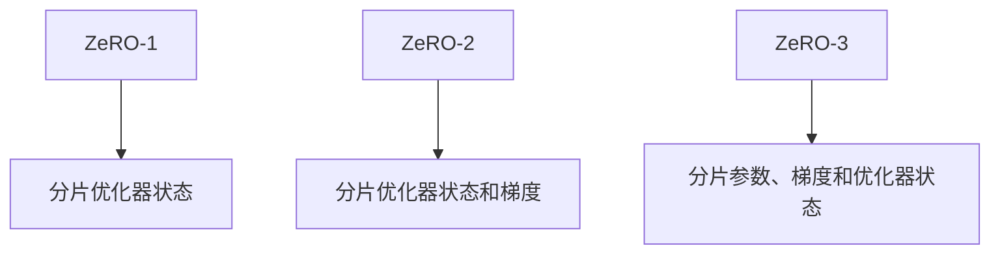
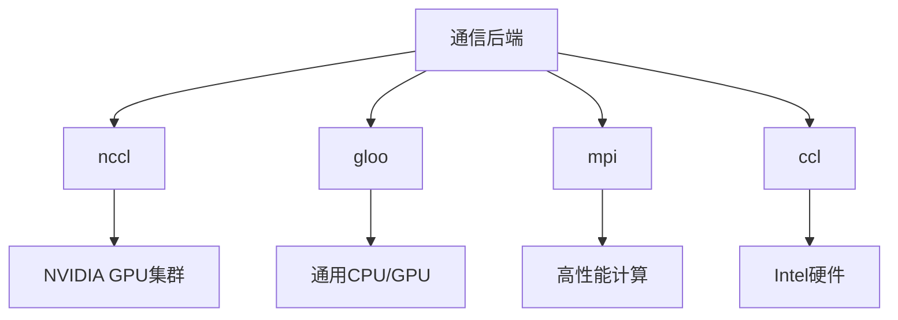

# 分布式训练配置

<cite>
**本文档引用的文件**  
- [training_args.py](file://src/transformers/training_args.py)
- [deepspeed.py](file://src/transformers/integrations/deepspeed.py)
- [fsdp.py](file://src/transformers/integrations/fsdp.py)
- [configuration_utils.py](file://src/transformers/distributed/configuration_utils.py)
- [distributed_training.py](file://examples/training/distributed_training.py)
- [ds_config_zero2.json](file://tests/deepspeed/ds_config_zero2.json)
- [ds_config_zero3.json](file://tests/deepspeed/ds_config_zero3.json)
</cite>

## 目录
1. [引言](#引言)
2. [FSDP配置详解](#fsdp配置详解)
3. [DeepSpeed配置详解](#deepspeed配置详解)
4. [通信后端与超时设置](#通信后端与超时设置)
5. [多节点训练最佳实践](#多节点训练最佳实践)
6. [常见问题诊断与解决方案](#常见问题诊断与解决方案)
7. [结论](#结论)

## 引言
本文档系统性地介绍了Hugging Face Transformers库中分布式训练的关键配置参数，包括FSDP（Fully Sharded Data Parallel）、DeepSpeed、DDP后端和DDP查找未使用参数等核心功能。文档详细解释了FSDP的不同模式及其内存和性能特征，说明了DeepSpeed配置文件的集成方法和ZeRO优化级别，并提供了在多节点训练环境下的配置最佳实践。此外，文档还包含了分布式训练中常见的死锁、通信错误等问题的诊断和解决方案。

## FSDP配置详解

### FSDP模式与内存特征
FSDP（Fully Sharded Data Parallel）提供了多种分片策略，每种模式在内存使用和性能方面有不同的特征：

- **full_shard**: 分片参数、梯度和优化器状态。这种模式提供了最高的内存效率，将模型状态均匀分布在所有设备上。
- **shard_grad_op**: 仅分片优化器状态和梯度。相比full_shard，这种模式的内存节省较少，但通信开销也相对较小。
- **hybrid_shard**: 在节点内应用FULL_SHARD，跨节点复制参数。这种混合模式在单节点内实现内存优化，同时在多节点间保持参数一致性。
- **hybrid_shard_zero2**: 在节点内应用SHARD_GRAD_OP，跨节点复制参数。这是hybrid_shard的变体，适用于特定的硬件配置。
- **offload**: 将参数和梯度卸载到CPU（仅与"full_shard"和"shard_grad_op"兼容）。这种模式可以进一步减少GPU内存使用，但会增加CPU-GPU通信开销。
- **auto_wrap**: 使用default_auto_wrap_policy自动递归包装层。这种模式简化了FSDP的配置，特别适合复杂的模型架构。

**Section sources**
- [training_args.py](file://src/transformers/training_args.py#L449-L460)

### FSDP配置参数
FSDP配置通过fsdp_config参数进行设置，支持JSON文件或字典格式。关键配置选项包括：

- **fsdp_version**: FSDP版本，默认为1。
- **min_num_params**: FSDP的默认自动包装最小参数数量。
- **transformer_layer_cls_to_wrap**: 要包装的transformer层类名列表。
- **backward_prefetch**: FSDP的反向预取模式，控制何时预取下一组参数。
- **forward_prefetch**: FSDP的前向预取模式，如果为"True"，则在前向传递期间显式预取下一个all-gather操作。
- **limit_all_gathers**: 限制all-gathers，如果为"True"，FSDP会显式同步CPU线程以防止过多的in-flight all-gathers。
- **use_orig_params**: 如果为"True"，允许在初始化期间非均匀的requires_grad，支持冻结和可训练参数的交错。
- **sync_module_states**: 如果为"True"，每个单独包装的FSDP单元将从rank 0广播模块参数，确保初始化后所有rank的参数相同。
- **cpu_ram_efficient_loading**: 如果为"True"，只有第一个进程加载预训练模型检查点，其他进程具有空权重。

**Section sources**
- [training_args.py](file://src/transformers/training_args.py#L440-L639)

## DeepSpeed配置详解

### ZeRO优化级别
DeepSpeed通过ZeRO（Zero Redundancy Optimizer）技术实现高效的分布式训练，主要包含三个优化级别：

- **ZeRO-2**: 分片优化器状态和梯度。这种模式减少了每个GPU的内存占用，同时保持了较高的计算效率。
- **ZeRO-3**: 分片参数、梯度和优化器状态。这是最激进的内存优化级别，将模型参数也进行分片，实现了最高的内存效率。

**Diagram sources**
- [deepspeed.py](file://src/transformers/integrations/deepspeed.py#L192-L231)
- [ds_config_zero2.json](file://tests/deepspeed/ds_config_zero2.json)
- [ds_config_zero3.json](file://tests/deepspeed/ds_config_zero3.json)

### DeepSpeed配置文件集成
DeepSpeed配置通过deepspeed参数进行集成，可以是JSON配置文件的路径或已加载的字典。配置文件中的关键参数包括：

- **fp16/bf16.enabled**: 启用半精度训练。
- **optimizer.type**: 优化器类型，如AdamW。
- **scheduler.type**: 学习率调度器类型，如WarmupLR。
- **zero_optimization.stage**: ZeRO优化级别（2或3）。
- **offload_optimizer/device**: 优化器状态卸载设备（cpu或none）。
- **gradient_clipping**: 梯度裁剪阈值。
- **train_micro_batch_size_per_gpu**: 每个GPU的微批次大小。

**Section sources**
- [deepspeed.py](file://src/transformers/integrations/deepspeed.py#L427-L460)
- [ds_config_zero2.json](file://tests/deepspeed/ds_config_zero2.json)
- [ds_config_zero3.json](file://tests/deepspeed/ds_config_zero3.json)

## 通信后端与超时设置

### 通信后端选择
分布式训练支持多种通信后端，选择合适的后端对性能至关重要：

- **nccl**: NVIDIA Collective Communications Library，适用于GPU集群，提供最佳性能。
- **gloo**: 通用通信库，适用于CPU和GPU，具有良好的兼容性。
- **mpi**: Message Passing Interface，适用于高性能计算环境。
- **ccl**: Intel Collective Communications Library，针对Intel硬件优化。

**Diagram sources**
- [distributed_training.py](file://examples/training/distributed_training.py#L0-L46)
- [tensor_parallel.py](file://src/transformers/integrations/tensor_parallel.py#L66-L94)

### 超时设置
ddp_timeout参数用于设置torch.distributed.init_process_group的超时时间。在大规模分布式训练中，适当的超时设置可以避免因网络延迟导致的训练中断。超时时间应根据网络环境和集群规模进行调整，通常在大型集群中需要设置更长的超时时间。

**Section sources**
- [training_args.py](file://src/transformers/training_args.py#L1705-L1728)

## 多节点训练最佳实践

### 配置最佳实践
在多节点训练环境中，应遵循以下最佳实践：

1. **资源规划**: 根据模型大小和数据集规模合理规划GPU和CPU资源。
2. **通信优化**: 选择合适的通信后端和网络配置，确保节点间通信效率。
3. **内存管理**: 根据可用内存选择适当的FSDP或DeepSpeed配置。
4. **检查点策略**: 配置合理的检查点保存频率，平衡训练进度和存储开销。
5. **监控与日志**: 启用详细的训练监控和日志记录，便于性能分析和问题诊断。

### 环境变量配置
分布式训练需要正确设置环境变量：

- **MASTER_ADDR**: 主节点地址。
- **MASTER_PORT**: 主节点端口。
- **WORLD_SIZE**: 总进程数。
- **RANK**: 当前进程的全局排名。
- **LOCAL_RANK**: 当前节点内的本地排名。

**Section sources**
- [distributed_training.py](file://examples/training/distributed_training.py#L48-L112)

## 常见问题诊断与解决方案

### 死锁问题
死锁是分布式训练中最常见的问题之一，通常由以下原因引起：

- **通信不匹配**: 发送和接收操作不匹配，导致进程等待。
- **同步问题**: 进程间同步机制出现问题。
- **资源竞争**: 多个进程竞争同一资源。

解决方案包括：
- 检查所有通信操作的匹配性。
- 使用超时机制避免无限等待。
- 确保所有进程按相同顺序请求资源。

### 通信错误
通信错误通常表现为网络连接问题或数据传输错误：

- **网络配置**: 检查网络连接和防火墙设置。
- **IP地址**: 确保所有节点可以相互访问。
- **端口冲突**: 确保使用的端口未被其他进程占用。

**Section sources**
- [torch-distributed-gpu-test.py](file://scripts/distributed/torch-distributed-gpu-test.py#L35-L91)

### 配置冲突
配置冲突可能导致训练失败或性能下降：

- **参数冲突**: FSDP和DeepSpeed配置参数冲突。
- **版本兼容性**: 不同库版本之间的兼容性问题。
- **硬件限制**: 配置超出硬件能力。

解决方案包括：
- 仔细检查配置文件，确保参数一致性。
- 使用最新的稳定版本库。
- 根据硬件能力调整配置。

**Section sources**
- [deepspeed.py](file://src/transformers/integrations/deepspeed.py#L484-L515)

## 结论
本文档全面介绍了Hugging Face Transformers库中分布式训练的配置方法和最佳实践。通过合理配置FSDP和DeepSpeed参数，选择适当的通信后端，并遵循多节点训练的最佳实践，可以有效提升大规模模型训练的效率和稳定性。同时，了解常见的问题诊断和解决方案有助于快速解决训练过程中遇到的各种挑战。