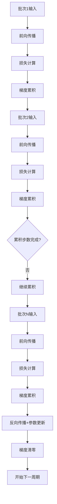
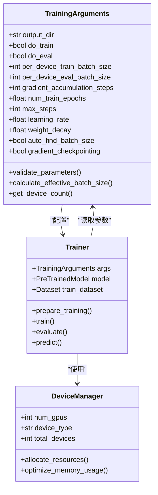
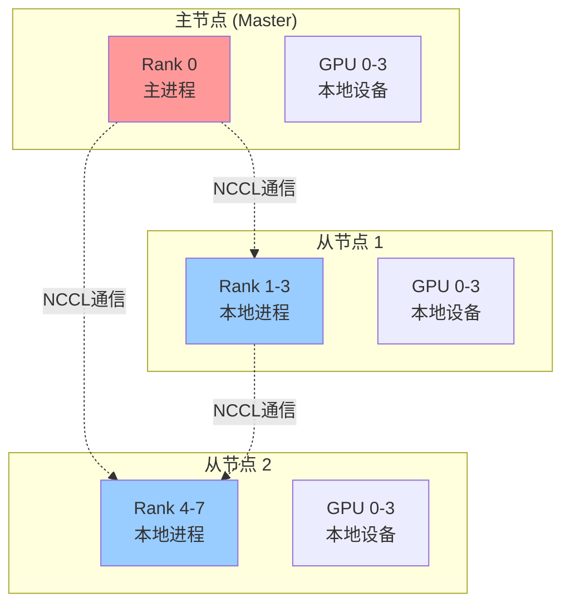
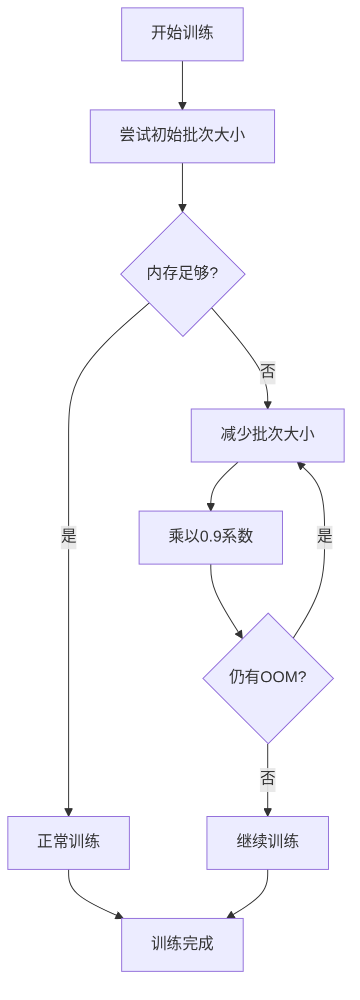

# 基础训练参数

<cite>
**本文档中引用的文件**
- [training_args.py](file://src/transformers/training_args.py)
- [trainer.py](file://src/transformers/trainer.py)
- [distributed_training.py](file://examples/training/distributed_training.py)
- [xla_spawn.py](file://examples/pytorch/xla_spawn.py)
- [run_glue.py](file://examples/pytorch/text-classification/run_glue.py)
- [run_swag.py](file://examples/legacy/run_swag.py)
- [run_qa_no_trainer.py](file://examples/pytorch/question-answering/run_qa_no_trainer.py)
- [run_ner_no_trainer.py](file://examples/pytorch/token-classification/run_ner_no_trainer.py)
- [run_translation_no_trainer.py](file://examples/pytorch/translation/run_translation_no_trainer.py)
- [run_mim_no_trainer.py](file://examples/pytorch/image-pretraining/run_mim_no_trainer.py)
- [run_semantic_segmentation_no_trainer.py](file://examples/pytorch/semantic-segmentation/run_semantic_segmentation_no_trainer.py)
- [run_wav2vec2_pretraining_no_trainer.py](file://examples/pytorch/speech-pretraining/run_wav2vec2_pretraining_no_trainer.py)
- [3D_parallel.py](file://examples/3D_parallel.py)
- [3d_parallel_checks.py](file://examples/pytorch/3d_parallel_checks.py)
</cite>

## 目录
1. [简介](#简介)
2. [核心训练参数详解](#核心训练参数详解)
3. [参数配置架构](#参数配置架构)
4. [硬件配置与参数优化](#硬件配置与参数优化)
5. [分布式训练配置](#分布式训练配置)
6. [内存优化策略](#内存优化策略)
7. [最佳实践指南](#最佳实践指南)
8. [故障排除](#故障排除)
9. [总结](#总结)

## 简介

Transformers库提供了强大而灵活的训练参数系统，通过`TrainingArguments`类统一管理所有训练相关的配置。本文档深入解析核心训练参数，包括它们的定义、默认值、合理取值范围以及在不同硬件环境下的配置策略。

## 核心训练参数详解

### output_dir - 输出目录

**定义**: 模型预测和检查点保存的输出目录路径。

**默认值**: `"trainer_output"`

**重要性**: 
- 存储训练过程中的模型权重
- 保存评估结果和日志文件
- 作为断点续训的起点

**配置建议**:
```python
# 基本配置
output_dir = "/path/to/experiment"

# 使用临时目录（测试时）
output_dir = "./temp_experiment"

# 分布式训练时确保目录可访问
output_dir = "/shared/storage/experiment"
```

### do_train - 训练开关

**定义**: 是否运行训练过程的布尔标志。

**默认值**: `False`

**使用场景**:
- 主要训练脚本入口
- 与训练/评估脚本配合使用
- 控制训练流程的启动

### do_eval - 评估开关

**定义**: 是否在验证集上运行评估的布尔标志。

**默认值**: `False`

**作用机制**:
- 当`eval_strategy`不为`"no"`时自动设置为`True`
- 影响训练流程中的评估调度
- 与`eval_steps`、`eval_strategy`协同工作

### per_device_train_batch_size - 设备训练批次大小

**定义**: 每个设备（GPU/TPU核心/CPU）上的训练批次大小。

**默认值**: `8`

**计算公式**: 全局批次大小 = `per_device_train_batch_size × 设备数量`

**性能影响**:
- 较大的批次大小提高GPU利用率但增加内存需求
- 影响梯度更新频率和收敛速度
- 与学习率调整密切相关

**推荐配置**:
- **单GPU (16GB)**: 1-4
- **双GPU (24GB)**: 4-8  
- **四GPU (40GB)**: 8-16
- **八GPU (80GB)**: 16-32

### per_device_eval_batch_size - 设备评估批次大小

**定义**: 每个设备上的评估批次大小。

**默认值**: `8`

**特点**:
- 通常小于训练批次大小以节省内存
- 影响评估速度和精度
- 在TPU环境中特别重要

**配置原则**:
- 保持与训练批次大小的比例关系
- 考虑评估数据集的大小
- 平衡速度和内存使用

### gradient_accumulation_steps - 梯度累积步数

**定义**: 在执行反向传播之前累积梯度的更新步骤数。

**默认值**: `1`

**工作机制**:


**图表来源**
- [trainer.py](file://src/transformers/trainer.py#L2417-L2437)

**计算公式**:
- 实际全局批次大小 = `per_device_train_batch_size × 设备数量 × gradient_accumulation_steps`

**应用场景**:
- 内存受限环境下的大批次模拟
- 提高训练稳定性
- 减少通信开销（分布式训练）

**配置策略**:
- **内存充足**: 设置为1（直接使用大批次）
- **内存受限**: 增加累积步数，减少每步内存占用
- **分布式训练**: 结合设备数量调整累积步数

### num_train_epochs - 训练轮数

**定义**: 训练过程中遍历整个数据集的次数。

**默认值**: `3.0`

**影响因素**:
- 数据集大小和复杂度
- 模型容量
- 学习率调度策略
- 早停机制

**配置建议**:
- **小数据集 (<10K样本)**: 10-50轮
- **中等数据集 (10K-100K)**: 3-10轮  
- **大数据集 (>100K)**: 1-3轮
- **迁移学习**: 1-5轮
- **预训练**: 1-3轮

### max_steps - 最大训练步数

**定义**: 训练过程中的最大步数限制。

**默认值**: `-1`（无限制）

**优先级**: 当设置为正数时，会覆盖`num_train_epochs`

**应用场景**:
- 固定训练时间预算
- 避免过拟合
- 实验性训练控制
- 资源限制下的训练

**配置策略**:
```python
# 基于数据集大小计算
steps_per_epoch = len(dataset) // (per_device_batch_size * num_gpus)
max_steps = steps_per_epoch * num_epochs

# 或者基于时间预算
max_steps = 10000  # 固定步数
```

## 参数配置架构



**图表来源**
- [training_args.py](file://src/transformers/training_args.py#L180-L280)
- [trainer.py](file://src/transformers/trainer.py#L1-L100)

## 硬件配置与参数优化

### 单GPU配置

**典型硬件**: NVIDIA RTX 3090 (24GB) 或 A100 (40GB)

**推荐参数**:
```python
training_args = TrainingArguments(
    output_dir="./single_gpu_experiment",
    do_train=True,
    do_eval=True,
    per_device_train_batch_size=16,  # 大批次提升效率
    per_device_eval_batch_size=32,   # 评估时更大批次
    gradient_accumulation_steps=1,    # 不需要累积
    num_train_epochs=3,
    learning_rate=5e-5,
    weight_decay=0.01,
    fp16=True,                       # 启用混合精度
    dataloader_num_workers=4,
    dataloader_pin_memory=True,
)
```

### 多GPU配置

**典型硬件**: 4×RTX 3090或8×V100

**推荐参数**:
```python
training_args = TrainingArguments(
    output_dir="./multi_gpu_experiment",
    do_train=True,
    do_eval=True,
    per_device_train_batch_size=8,   # 每GPU适中批次
    per_device_eval_batch_size=16,
    gradient_accumulation_steps=1,    # 根据内存调整
    num_train_epochs=3,
    learning_rate=5e-5,
    weight_decay=0.01,
    fp16=True,
    dataloader_num_workers=4,
    dataloader_pin_memory=True,
    dataloader_prefetch_factor=2,
    torch_compile=True,              # 启用编译优化
)
```

### TPU配置

**典型硬件**: 8×TPU v3/v4

**配置要点**:
```python
# 使用xla_spawn启动脚本
# python xla_spawn.py --num_cores 8 train_script.py

training_args = TrainingArguments(
    output_dir="./tpu_experiment",
    do_train=True,
    do_eval=True,
    per_device_train_batch_size=8,   # TPU优化批次
    per_device_eval_batch_size=8,
    gradient_accumulation_steps=1,
    num_train_epochs=3,
    learning_rate=2e-5,              # TPU常用学习率
    weight_decay=0.01,
    dataloader_num_workers=0,        # TPU不需要多进程
    dataloader_pin_memory=False,
    torch_compile=False,             # TPU兼容性考虑
)
```

**TPU配置示例**:
```bash
# 运行TPU训练
python xla_spawn.py --num_cores 8 \
    text-classification/run_glue.py \
    --model_name_or_path google-bert/bert-large-uncased \
    --task_name mnli \
    --do_train \
    --do_eval \
    --max_seq_length 128 \
    --per_device_train_batch_size 8 \
    --learning_rate 2e-5 \
    --num_train_epochs 3.0 \
    --output_dir /tmp/mnli_output/
```

## 分布式训练配置

### 多节点训练



**图表来源**
- [distributed_training.py](file://examples/training/distributed_training.py#L1-L46)

**配置参数**:
```python
training_args = TrainingArguments(
    output_dir="./distributed_experiment",
    do_train=True,
    do_eval=True,
    per_device_train_batch_size=4,   # 每节点适中批次
    per_device_eval_batch_size=8,
    gradient_accumulation_steps=2,    # 节点间累积
    num_train_epochs=3,
    learning_rate=5e-5,
    weight_decay=0.01,
    dataloader_num_workers=2,
    dataloader_pin_memory=True,
    ddp_backend="nccl",              # 使用NCCL后端
    ddp_find_unused_parameters=False,
    ddp_bucket_cap_mb=25,
    ddp_timeout=1800,
)
```

### 张量并行配置

**3D并行示例**:
```bash
# 张量并行度=2，数据并行度=2
TP_SIZE=2 DP_SIZE=2 torchrun --nproc_per_node=4 --rdzv_endpoint=localhost:29503 train_script.py

# 混合并行配置
CP_SIZE=2 DP_SIZE=2 torchrun --nproc_per_node=4 train_script.py
CP_SIZE=2 TP_SIZE=2 torchrun --nproc_per_node=4 train_script.py
```

**参数调优策略**:
- **张量并行**: 将模型分片到多个设备
- **数据并行**: 复制模型在多个设备上处理不同批次
- **流水线并行**: 将模型层分布到不同设备

## 内存优化策略

### 自动批次大小查找

**功能描述**: 自动调整批次大小以适应可用内存。

**启用方式**:
```python
training_args = TrainingArguments(
    output_dir="./memory_optimized",
    do_train=True,
    auto_find_batch_size=True,        # 启用自动查找
    per_device_train_batch_size=128,  # 初始尝试大小
    gradient_accumulation_steps=1,
    num_train_epochs=3,
)
```

**工作原理**:


**图表来源**
- [trainer_utils.py](file://src/transformers/trainer_utils.py#L764-L792)

### 梯度检查点

**功能描述**: 通过重新计算激活值来节省内存。

**配置方法**:
```python
training_args = TrainingArguments(
    output_dir="./gradient_checkpointing",
    do_train=True,
    gradient_checkpointing=True,      # 启用梯度检查点
    gradient_checkpointing_kwargs={
        "use_reentrant": False,        # 推荐设置
    },
    per_device_train_batch_size=4,    # 更小的批次
    gradient_accumulation_steps=8,     # 增加累积步数
    num_train_epochs=3,
)
```

### 混合精度训练

**FP16配置**:
```python
training_args = TrainingArguments(
    output_dir="./fp16_experiment",
    do_train=True,
    fp16=True,                        # 启用FP16
    bf16=False,                       # 禁用BF16
    per_device_train_batch_size=16,
    gradient_accumulation_steps=1,
    num_train_epochs=3,
)
```

**BF16配置**:
```python
training_args = TrainingArguments(
    output_dir="./bf16_experiment",
    do_train=True,
    fp16=False,
    bf16=True,                        # 启用BF16
    per_device_train_batch_size=32,
    gradient_accumulation_steps=1,
    num_train_epochs=3,
)
```

## 最佳实践指南

### 参数间相互影响

**批次大小与学习率的关系**:
```python
# 批次大小翻倍，学习率也应适当增加
effective_batch_size = per_device_batch_size * num_gpus * gradient_accumulation_steps

# 学习率调整规则
learning_rate = base_lr * sqrt(effective_batch_size / base_batch_size)
```

**内存使用估算**:
```python
def estimate_memory_usage(model_size_gb, batch_size, sequence_length, num_gpus):
    """估算GPU内存使用量"""
    # 基础模型参数
    model_memory = model_size_gb * 1.1  # 包含梯度和优化器状态
    
    # 激活值内存
    activation_memory = batch_size * sequence_length * model.hidden_size * 4 / 1024**3
    
    # 总内存需求
    total_memory = model_memory + activation_memory
    
    return total_memory * num_gpus
```

### 数据集大小与参数匹配

| 数据集规模 | 推荐批次大小 | 训练轮数 | 注意事项 |
|------------|-------------|----------|----------|
| < 1K样本 | 4-8 | 20-50 | 容易过拟合 |
| 1K-10K | 8-16 | 10-20 | 需要正则化 |
| 10K-100K | 16-32 | 3-10 | 标准配置 |
| > 100K | 32-64 | 1-3 | 可能需要更长训练 |

### 模型复杂度与参数调整

**小型模型 (<1B参数)**:
```python
small_model_args = TrainingArguments(
    per_device_train_batch_size=32,
    gradient_accumulation_steps=1,
    learning_rate=2e-4,
    num_train_epochs=10,
)
```

**大型模型 (1B-10B参数)**:
```python
large_model_args = TrainingArguments(
    per_device_train_batch_size=8,
    gradient_accumulation_steps=4,
    learning_rate=1e-4,
    num_train_epochs=3,
)
```

**超大模型 (>10B参数)**:
```python
huge_model_args = TrainingArguments(
    per_device_train_batch_size=2,
    gradient_accumulation_steps=16,
    learning_rate=5e-5,
    num_train_epochs=1,
    gradient_checkpointing=True,
    fp16=True,
)
```

### 评估策略优化

**评估频率配置**:
```python
# 高频评估（快速调试）
eval_strategy = "steps"
eval_steps = 500

# 低频评估（生产环境）
eval_strategy = "epoch"

# 混合策略
eval_strategy = "steps"
eval_steps = 1000
save_strategy = "steps"
save_steps = 1000
```

**评估批次大小优化**:
```python
# 评估时使用更大的批次以提高效率
per_device_eval_batch_size = per_device_train_batch_size * 2

# 对于内存敏感的模型
per_device_eval_batch_size = per_device_train_batch_size
```

## 故障排除

### 常见内存问题

**CUDA OOM错误**:
```python
# 解决策略
training_args = TrainingArguments(
    per_device_train_batch_size=4,    # 减少批次大小
    gradient_accumulation_steps=8,     # 增加累积步数
    gradient_checkpointing=True,       # 启用梯度检查点
    fp16=True,                        # 使用混合精度
    dataloader_pin_memory=False,       # 减少主机内存使用
)
```

**内存泄漏检测**:
```python
# 启用内存监控
training_args = TrainingArguments(
    torch_empty_cache_steps=100,       # 定期清理缓存
    skip_memory_metrics=False,         # 记录内存使用
)
```

### 训练不稳定问题

**梯度爆炸**:
```python
training_args = TrainingArguments(
    max_grad_norm=1.0,                 # 设置梯度裁剪
    learning_rate=1e-4,                # 降低学习率
    weight_decay=0.01,                 # 添加权重衰减
)
```

**收敛缓慢**:
```python
training_args = TrainingArguments(
    learning_rate=5e-4,                # 增加学习率
    warmup_steps=1000,                 # 增加热身步数
    lr_scheduler_type="cosine",        # 使用余弦调度
)
```

### 性能优化

**数据加载优化**:
```python
training_args = TrainingArguments(
    dataloader_num_workers=4,          # 多进程加载
    dataloader_prefetch_factor=2,      # 预取批次
    dataloader_pin_memory=True,        # 锁页内存
    dataloader_drop_last=True,         # 丢弃不完整批次
)
```

**模型编译优化**:
```python
training_args = TrainingArguments(
    torch_compile=True,                # 启用编译
    torch_compile_backend="inductor",  # 选择后端
    torch_compile_mode="reduce-overhead",  # 减少开销模式
)
```

## 总结

Transformers的训练参数系统提供了全面而灵活的配置选项，通过合理设置这些参数可以显著提升训练效率和模型性能。关键要点包括：

1. **参数协调**: 批次大小、学习率、累积步数等参数需要协同调整
2. **硬件适配**: 根据GPU内存、数量和类型选择合适的参数配置
3. **内存优化**: 利用梯度检查点、混合精度等技术优化内存使用
4. **分布式策略**: 正确配置多GPU和TPU环境下的参数
5. **监控调试**: 启用适当的日志和监控功能以便及时发现问题

通过遵循本文档的指导原则和最佳实践，用户可以在各种硬件环境下获得最优的训练效果。