# DeepSpeed优化技术

<cite>
**本文档引用的文件**
- [src/transformers/integrations/deepspeed.py](file://src/transformers/integrations/deepspeed.py)
- [docs/source/zh/main_classes/deepspeed.md](file://docs/source/zh/main_classes/deepspeed.md)
- [tests/deepspeed/ds_config_zero2.json](file://tests/deepspeed/ds_config_zero2.json)
- [tests/deepspeed/ds_config_zero3.json](file://tests/deepspeed/ds_config_zero3.json)
- [src/transformers/integrations/tensor_parallel.py](file://src/transformers/integrations/tensor_parallel.py)
- [examples/3D_parallel.py](file://examples/3D_parallel.py)
- [src/transformers/modeling_layers.py](file://src/transformers/modeling_layers.py)
- [benchmark/benchmark.py](file://benchmark/benchmark.py)
</cite>

## 目录
1. [简介](#简介)
2. [项目结构](#项目结构)
3. [核心组件](#核心组件)
4. [架构概览](#架构概览)
5. [详细组件分析](#详细组件分析)
6. [依赖关系分析](#依赖关系分析)
7. [性能考虑](#性能考虑)
8. [故障排除指南](#故障排除指南)
9. [结论](#结论)

## 简介

DeepSpeed是Hugging Face Transformers库中集成的一个强大的分布式训练优化框架，专门针对大规模语言模型的训练进行了优化。它实现了ZeRO（Zero Redundancy Optimizer）技术，通过内存优化和并行策略显著降低了训练大型模型所需的资源。

本文档深入探讨了DeepSpeed的核心优化技术，包括ZeRO系列优化器、模型并行、数据并行和管道并行的协同工作机制，以及激活检查点等内存优化技术。

## 项目结构

DeepSpeed优化技术在Transformers库中的组织结构如下：

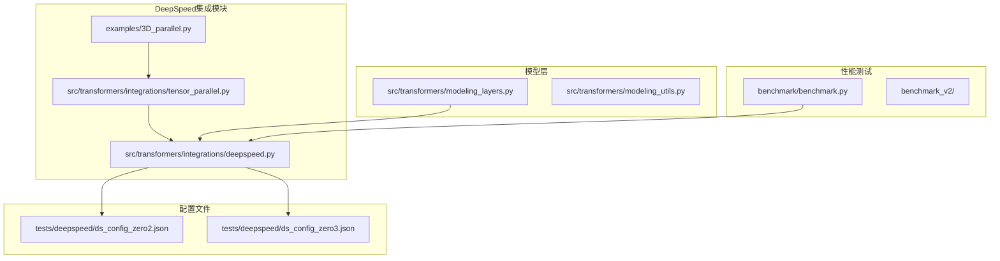

**图表来源**
- [src/transformers/integrations/deepspeed.py](file://src/transformers/integrations/deepspeed.py#L1-L50)
- [src/transformers/integrations/tensor_parallel.py](file://src/transformers/integrations/tensor_parallel.py#L1-L50)

**章节来源**
- [src/transformers/integrations/deepspeed.py](file://src/transformers/integrations/deepspeed.py#L1-L100)
- [docs/source/zh/main_classes/deepspeed.md](file://docs/source/zh/main_classes/deepspeed.md#L1-L100)

## 核心组件

### DeepSpeed配置管理器

DeepSpeed集成的核心是`HfDeepSpeedConfig`类，它提供了对DeepSpeed配置的统一管理和访问接口。

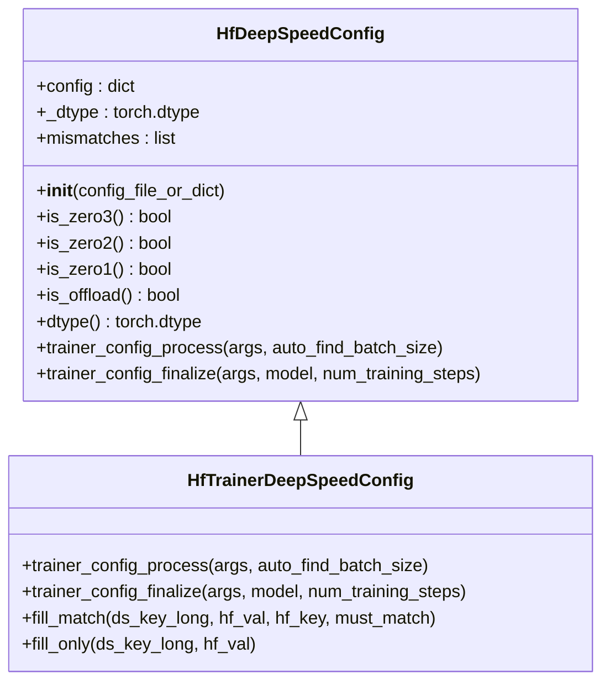

**图表来源**
- [src/transformers/integrations/deepspeed.py](file://src/transformers/integrations/deepspeed.py#L50-L150)

### 张量并行处理器

张量并行是DeepSpeed与其他并行策略协同工作的关键组件：

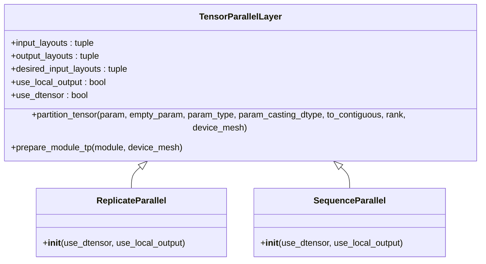

**图表来源**
- [src/transformers/integrations/tensor_parallel.py](file://src/transformers/integrations/tensor_parallel.py#L400-L500)

**章节来源**
- [src/transformers/integrations/deepspeed.py](file://src/transformers/integrations/deepspeed.py#L50-L200)
- [src/transformers/integrations/tensor_parallel.py](file://src/transformers/integrations/tensor_parallel.py#L1-L200)

## 架构概览

DeepSpeed优化技术的整体架构展示了多种并行策略的协同工作：

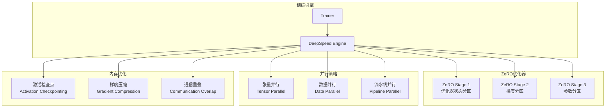

**图表来源**
- [src/transformers/integrations/deepspeed.py](file://src/transformers/integrations/deepspeed.py#L400-L486)
- [examples/3D_parallel.py](file://examples/3D_parallel.py#L50-L150)

## 详细组件分析

### ZeRO优化器详解

ZeRO（Zero Redundancy Optimizer）是DeepSpeed的核心创新，通过消除冗余来显著减少内存使用。

#### ZeRO-1：优化器状态分区

ZeRO-1专注于优化器状态的分区，将优化器状态分散到不同的设备上：

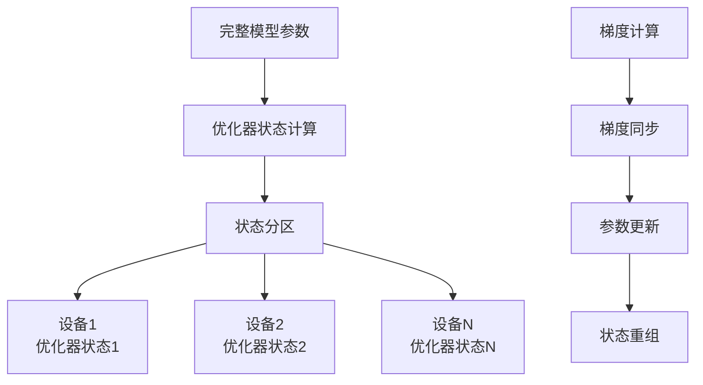

**图表来源**
- [tests/deepspeed/ds_config_zero2.json](file://tests/deepspeed/ds_config_zero2.json#L30-L45)

#### ZeRO-2：梯度分区

ZeRO-2在ZeRO-1的基础上增加了梯度的分区：

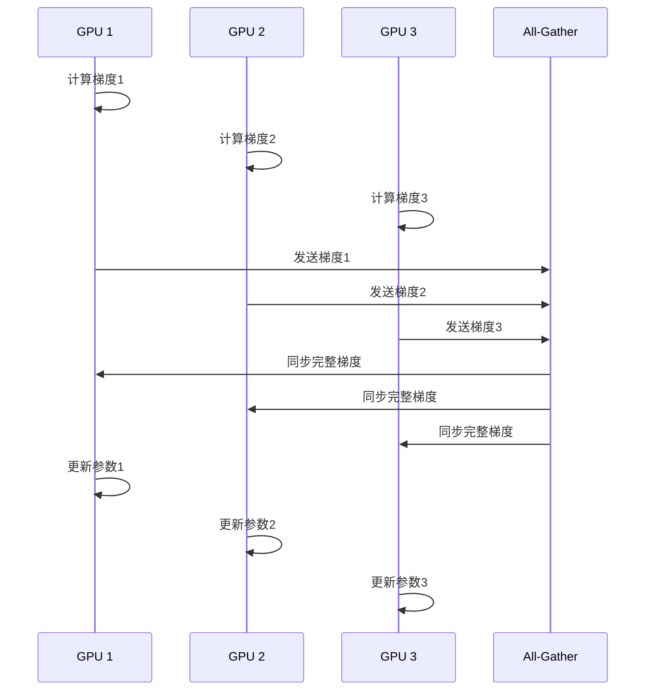

**图表来源**
- [tests/deepspeed/ds_config_zero2.json](file://tests/deepspeed/ds_config_zero2.json#L30-L50)

#### ZeRO-3：参数分区

ZeRO-3是最激进的优化策略，将模型参数也进行分区：

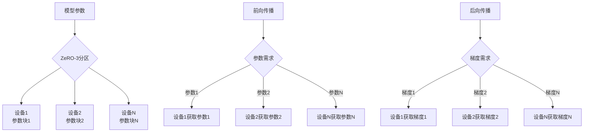

**图表来源**
- [tests/deepspeed/ds_config_zero3.json](file://tests/deepspeed/ds_config_zero3.json#L30-L50)

**章节来源**
- [tests/deepspeed/ds_config_zero2.json](file://tests/deepspeed/ds_config_zero2.json#L1-L55)
- [tests/deepspeed/ds_config_zero3.json](file://tests/deepspeed/ds_config_zero3.json#L1-L56)

### 模型并行、数据并行和管道并行的协同工作

#### 3D并行架构

DeepSpeed支持张量并行（TP）、数据并行（DP）和上下文并行（CP）的三维并行：

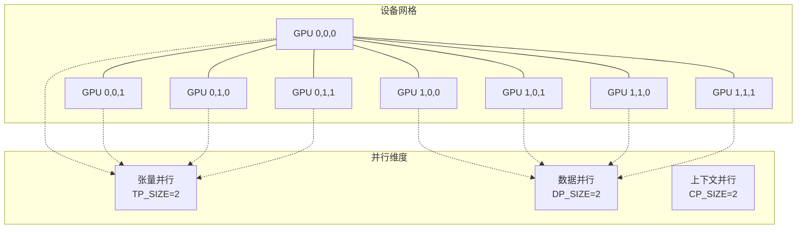

**图表来源**
- [examples/3D_parallel.py](file://examples/3D_parallel.py#L70-L90)

#### 通信优化技术

DeepSpeed实现了多种通信优化技术：

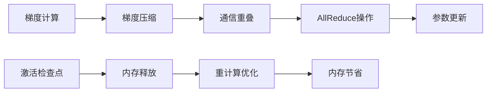

**章节来源**
- [examples/3D_parallel.py](file://examples/3D_parallel.py#L1-L200)
- [src/transformers/integrations/tensor_parallel.py](file://src/transformers/integrations/tensor_parallel.py#L1-L300)

### 激活检查点技术

激活检查点是DeepSpeed中的重要内存优化技术：

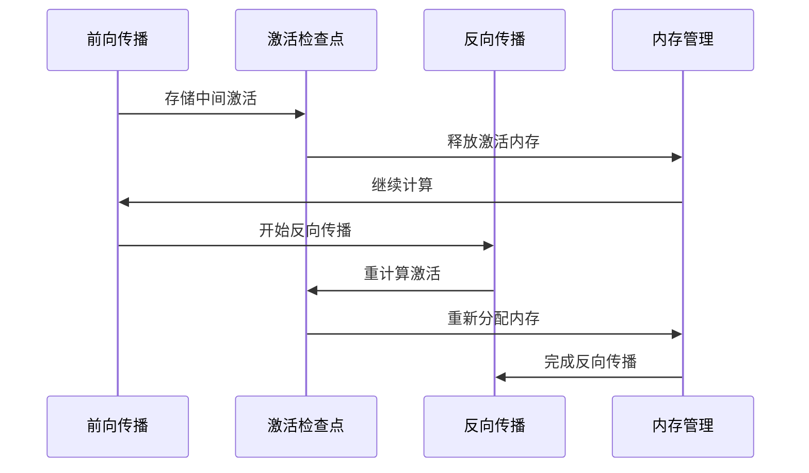

**图表来源**
- [src/transformers/modeling_layers.py](file://src/transformers/modeling_layers.py#L30-L70)

**章节来源**
- [src/transformers/modeling_layers.py](file://src/transformers/modeling_layers.py#L1-L100)

## 依赖关系分析

DeepSpeed优化技术的依赖关系展现了复杂的生态系统：

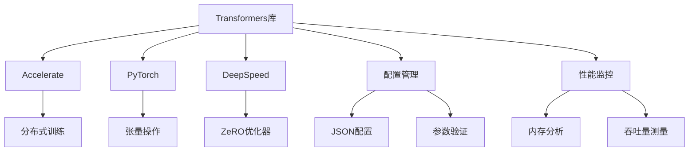

**图表来源**
- [src/transformers/integrations/deepspeed.py](file://src/transformers/integrations/deepspeed.py#L1-L30)

**章节来源**
- [src/transformers/integrations/deepspeed.py](file://src/transformers/integrations/deepspeed.py#L1-L50)

## 性能考虑

### 内存优化效果

DeepSpeed的内存优化效果可以通过以下表格展示：

| 优化技术 | 内存节省比例 | 训练速度影响 | 适用场景 |
|---------|-------------|-------------|----------|
| ZeRO-1 | 2-4x | 轻微下降 | 中等规模模型 |
| ZeRO-2 | 4-8x | 中等下降 | 大规模模型 |
| ZeRO-3 | 8-16x | 显著下降 | 超大规模模型 |
| 激活检查点 | 50-90% | 显著下降 | 内存受限环境 |
| 张量并行 | 2-4x | 轻微提升 | 多GPU环境 |

### 通信优化策略

DeepSpeed实现了多种通信优化策略来减少训练时间：

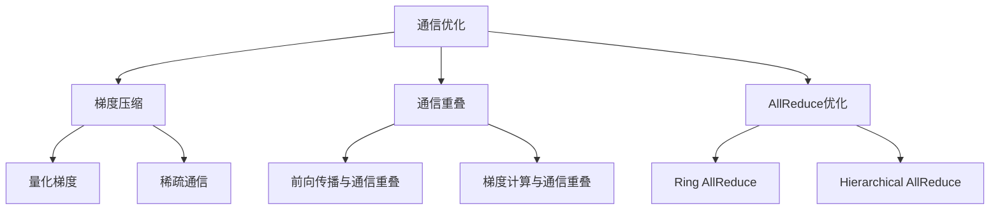

## 故障排除指南

### 常见问题和解决方案

1. **内存不足错误**
   - 解决方案：启用ZeRO-3并配置CPU/NVMe卸载
   - 配置示例：`"offload_optimizer": {"device": "cpu"}`

2. **通信超时**
   - 解决方案：调整通信超时设置和网络配置
   - 配置示例：`"communication_timeout": 1800`

3. **模型加载失败**
   - 解决方案：检查ZeRO配置与模型大小的匹配
   - 配置示例：调整`stage3_max_live_parameters`

**章节来源**
- [src/transformers/integrations/deepspeed.py](file://src/transformers/integrations/deepspeed.py#L400-L486)

## 结论

DeepSpeed优化技术为大规模语言模型训练提供了强大的基础设施。通过ZeRO系列优化器、多种并行策略和内存优化技术的协同工作，DeepSpeed显著降低了训练大型模型的资源需求。

主要优势包括：
- **内存效率**：ZeRO-3可实现16倍的内存节省
- **扩展性**：支持从单GPU到数千GPU的训练
- **灵活性**：可配置的优化策略适应不同场景
- **性能**：通过通信优化和激活检查点提升训练效率

随着模型规模的不断增长，DeepSpeed的技术将继续在大规模AI训练中发挥关键作用，为研究人员和工程师提供高效、可靠的训练平台。