# DeepSpeed最佳实践

<cite>
**本文档中引用的文件**
- [deepspeed.py](file://src/transformers/integrations/deepspeed.py)
- [ds_config_zero2.json](file://tests/deepspeed/ds_config_zero2.json)
- [ds_config_zero3.json](file://tests/deepspeed/ds_config_zero3.json)
- [test_deepspeed.py](file://tests/deepspeed/test_deepspeed.py)
- [3D_parallel.py](file://examples/3D_parallel.py)
- [metrics_example.py](file://examples/metrics-monitoring/metrics_example.py)
- [debug_utils.py](file://src/transformers/debug_utils.py)
- [training_args.py](file://src/transformers/training_args.py)
- [trainer.py](file://src/transformers/trainer.py)
- [trainer_pt_utils.py](file://src/transformers/trainer_pt_utils.py)
- [benchmark.py](file://benchmark/benchmark.py)
</cite>

## 目录
1. [简介](#简介)
2. [项目结构概览](#项目结构概览)
3. [核心组件分析](#核心组件分析)
4. [架构概览](#架构概览)
5. [详细组件分析](#详细组件分析)
6. [依赖关系分析](#依赖关系分析)
7. [性能考虑](#性能考虑)
8. [故障排除指南](#故障排除指南)
9. [结论](#结论)

## 简介

DeepSpeed是Hugging Face Transformers库中用于大规模模型训练的重要优化框架。本文档提供了使用transformers库进行大规模模型训练的DeepSpeed最佳实践指导，涵盖从数亿到数千亿参数模型的不同配置策略，以及混合并行、性能调优和监控等关键主题。

DeepSpeed通过ZeRO（Zero Redundancy Optimizer）、混合精度训练、CPU/NVMe卸载等技术，显著降低了大模型训练的内存需求和计算成本，使得在有限硬件资源上训练超大规模语言模型成为可能。

## 项目结构概览

Transformers库中的DeepSpeed集成主要分布在以下关键目录中：

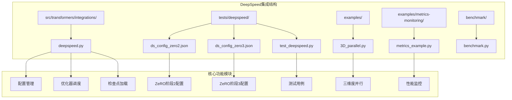

**图表来源**
- [deepspeed.py](file://src/transformers/integrations/deepspeed.py#L1-L50)
- [ds_config_zero2.json](file://tests/deepspeed/ds_config_zero2.json#L1-L20)
- [ds_config_zero3.json](file://tests/deepspeed/ds_config_zero3.json#L1-L20)

**章节来源**
- [deepspeed.py](file://src/transformers/integrations/deepspeed.py#L1-L100)
- [3D_parallel.py](file://examples/3D_parallel.py#L1-L50)

## 核心组件分析

### DeepSpeed配置管理系统

DeepSpeed的核心在于其灵活的配置系统，支持自动化的参数调整和智能的内存管理。

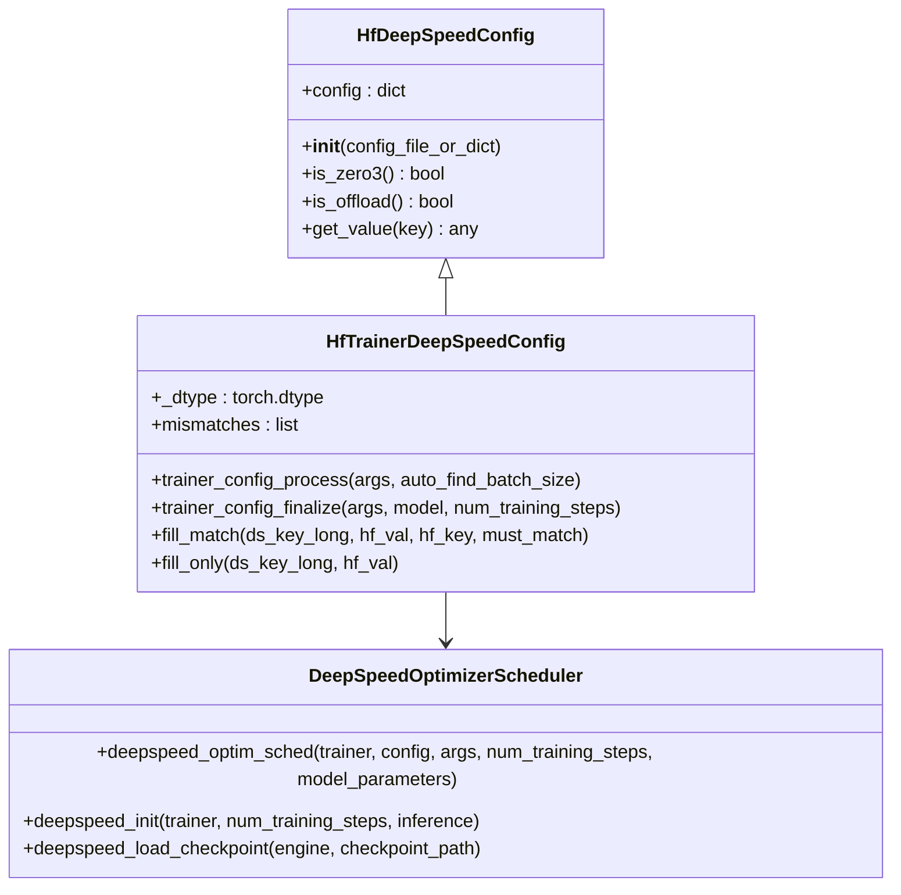

**图表来源**
- [deepspeed.py](file://src/transformers/integrations/deepspeed.py#L60-L150)
- [deepspeed.py](file://src/transformers/integrations/deepspeed.py#L346-L400)

### ZeRO优化器配置

ZeRO（Zero Redundancy Optimizer）是DeepSpeed的核心技术，通过分片优化器状态、梯度和参数来减少内存占用。

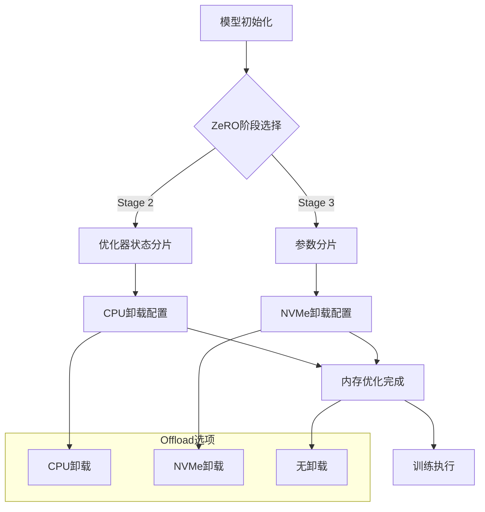

**图表来源**
- [ds_config_zero2.json](file://tests/deepspeed/ds_config_zero2.json#L30-L45)
- [ds_config_zero3.json](file://tests/deepspeed/ds_config_zero3.json#L30-L50)

**章节来源**
- [deepspeed.py](file://src/transformers/integrations/deepspeed.py#L60-L200)
- [ds_config_zero2.json](file://tests/deepspeed/ds_config_zero2.json#L1-L55)
- [ds_config_zero3.json](file://tests/deepspeed/ds_config_zero3.json#L1-L56)

## 架构概览

DeepSpeed在Transformers中的架构设计体现了模块化和可扩展性原则：

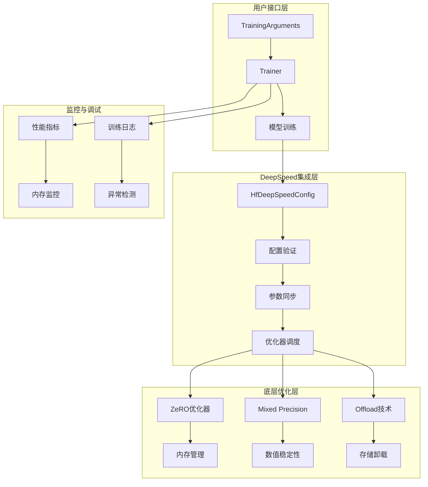

**图表来源**
- [deepspeed.py](file://src/transformers/integrations/deepspeed.py#L200-L300)
- [training_args.py](file://src/transformers/training_args.py#L2722-L2748)

## 详细组件分析

### 模型规模与配置策略

不同规模的模型需要采用不同的DeepSpeed配置策略：

| 模型规模 | 参数量范围 | 推荐ZeRO阶段 | CPU卸载 | NVMe卸载 | 内存优化策略 |
|---------|-----------|------------|---------|----------|------------|
| 小型模型 | 1B-10B | Stage 2 | 可选 | 否 | 基础优化 |
| 中型模型 | 10B-100B | Stage 2 | 必需 | 否 | 高效卸载 |
| 大型模型 | 100B-1T | Stage 3 | 强制 | 可选 | 全面卸载 |
| 超大模型 | 1T+ | Stage 3 | 强制 | 必需 | 混合卸载 |

### CPU卸载配置详解

CPU卸载是减少GPU内存占用的关键技术：

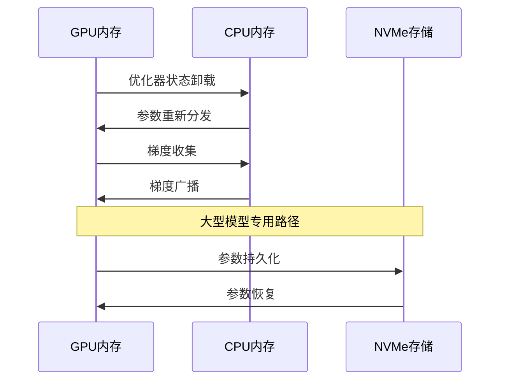

**图表来源**
- [test_deepspeed.py](file://tests/deepspeed/test_deepspeed.py#L630-L650)

### NVMe卸载配置

对于超大规模模型，NVMe卸载提供了额外的存储空间：

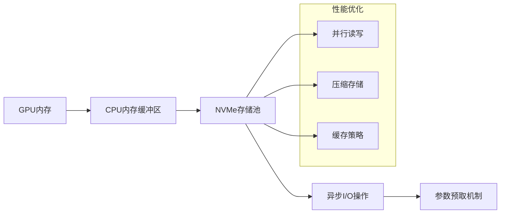

**图表来源**
- [test_deepspeed.py](file://tests/deepspeed/test_deepspeed.py#L586-L607)

**章节来源**
- [test_deepspeed.py](file://tests/deepspeed/test_deepspeed.py#L586-L650)

### 混合并行策略

结合FSDP和DeepSpeed实现混合并行是处理超大模型的有效方法：

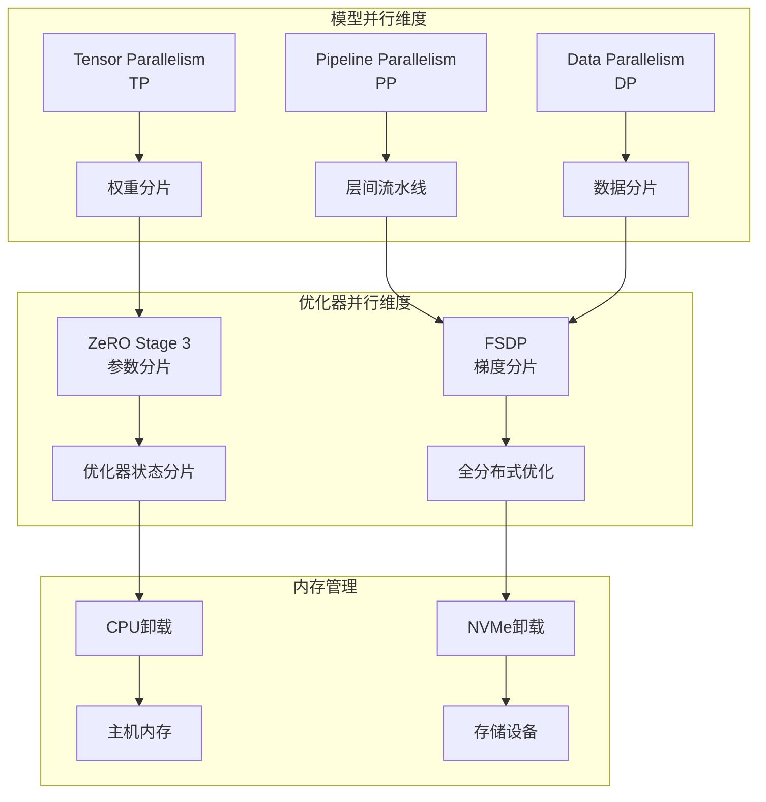

**图表来源**
- [3D_parallel.py](file://examples/3D_parallel.py#L80-L120)
- [training_args.py](file://src/transformers/training_args.py#L2722-L2748)

**章节来源**
- [3D_parallel.py](file://examples/3D_parallel.py#L1-L100)
- [training_args.py](file://src/transformers/training_args.py#L2722-L2748)

### 性能调优指南

#### Batch Size与Gradient Accumulation协调

正确的batch size和gradient accumulation设置对训练稳定性和效率至关重要：

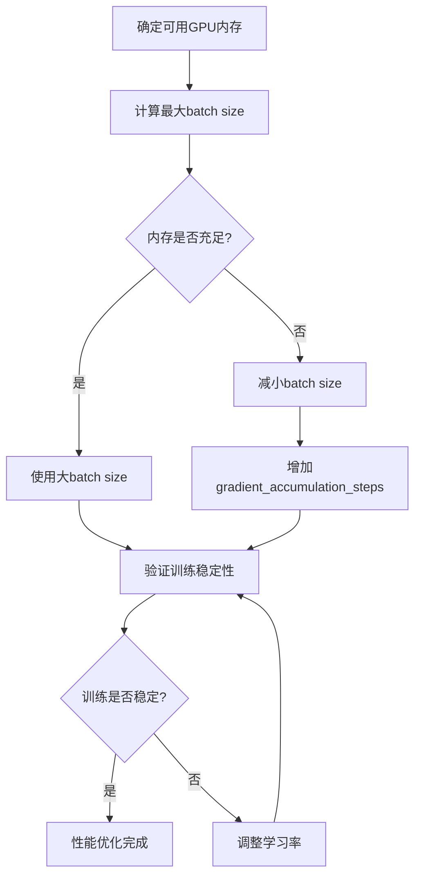

#### 学习率调整策略

不同ZeRO阶段的学习率调整策略：

| ZeRO阶段 | 建议学习率 | 批量缩放因子 | 注意事项 |
|---------|-----------|------------|---------|
| Stage 2 | 通常值 | batch_size × dp_size | 注意梯度累积 |
| Stage 3 | 较低值 | batch_size × dp_size | 更保守的调整 |
| CPU卸载 | 最低值 | batch_size × dp_size | 考虑通信开销 |

**章节来源**
- [test_deepspeed.py](file://tests/deepspeed/test_deepspeed.py#L706-L774)
- [trainer.py](file://src/transformers/trainer.py#L2417-L2437)

### 混合精度训练

DeepSpeed支持多种精度格式以平衡性能和稳定性：

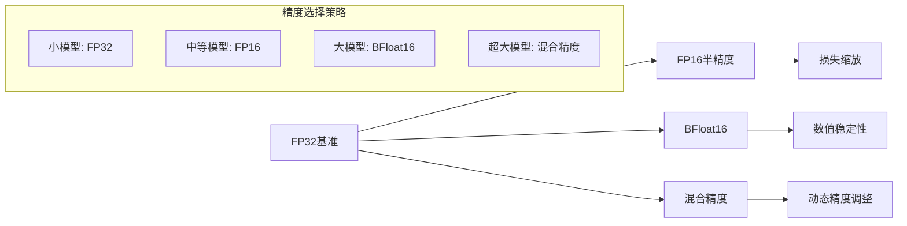

**图表来源**
- [deepspeed.py](file://src/transformers/integrations/deepspeed.py#L150-L200)

**章节来源**
- [deepspeed.py](file://src/transformers/integrations/deepspeed.py#L150-L250)

## 依赖关系分析

DeepSpeed集成涉及多个组件间的复杂依赖关系：

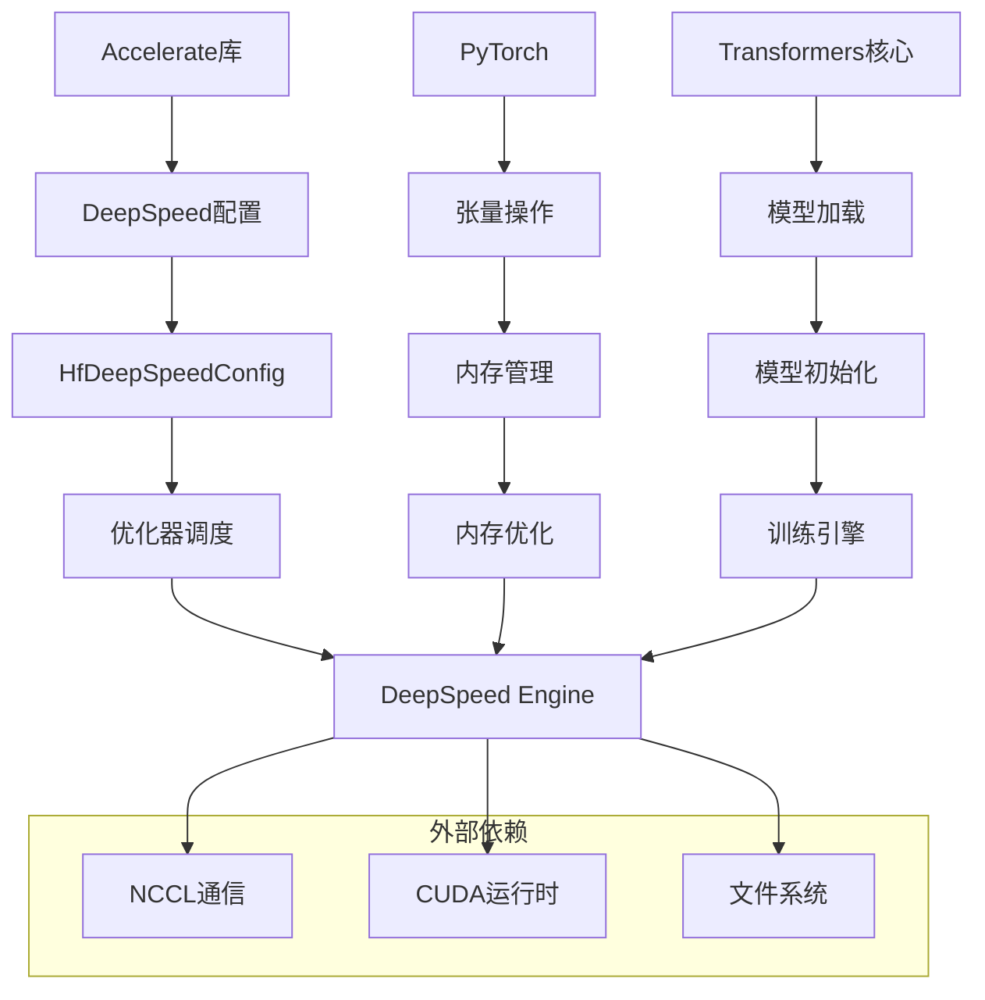

**图表来源**
- [deepspeed.py](file://src/transformers/integrations/deepspeed.py#L20-L40)

**章节来源**
- [deepspeed.py](file://src/transformers/integrations/deepspeed.py#L20-L50)

## 性能考虑

### 内存使用优化

DeepSpeed通过多种技术优化内存使用：

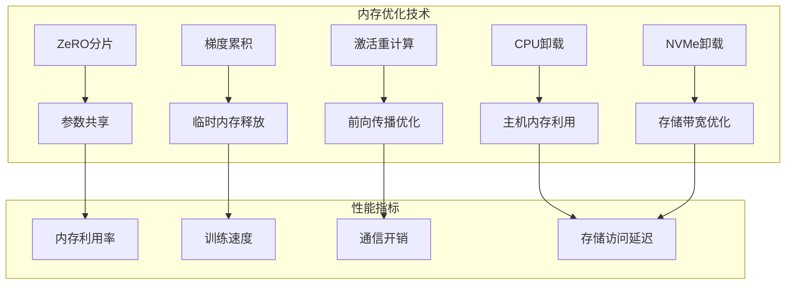

### 通信优化

大规模训练中的通信瓶颈解决方案：

| 优化技术 | 适用场景 | 性能提升 | 实现复杂度 |
|---------|---------|---------|-----------|
| 梯度压缩 | 大批次训练 | 20-40% | 中等 |
| 异步通信 | 流水线训练 | 15-25% | 高 |
| 通信拓扑优化 | 多节点集群 | 10-30% | 高 |
| 缓存策略 | 重复通信 | 30-50% | 低 |

**章节来源**
- [trainer_pt_utils.py](file://src/transformers/trainer_pt_utils.py#L767-L833)

## 故障排除指南

### 常见问题及解决方案

#### OOM错误处理

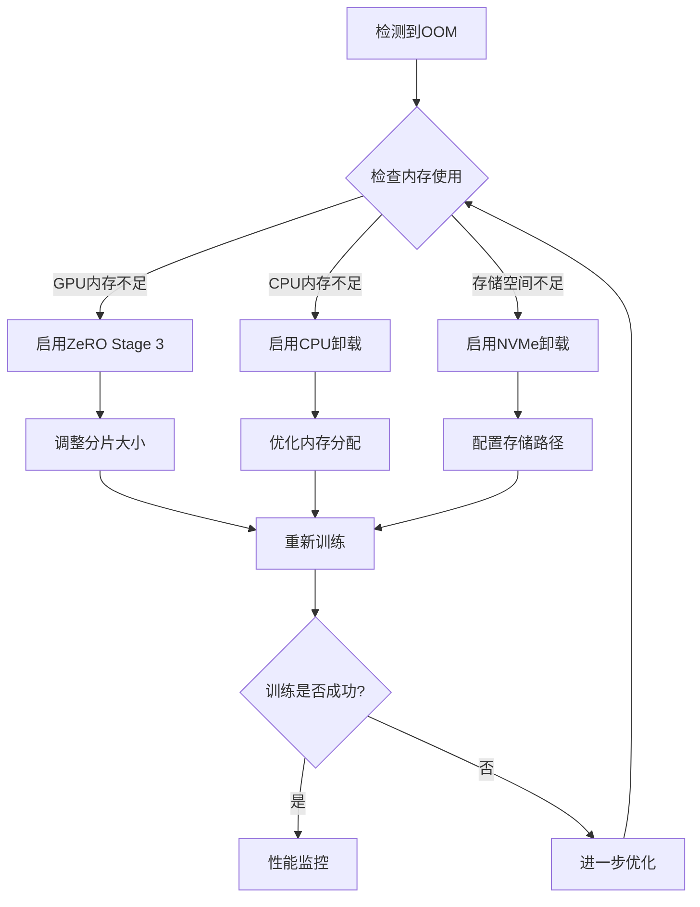

#### 训练不稳定诊断

深度学习训练不稳定的主要原因和解决方法：

| 问题类型 | 症状表现 | 诊断方法 | 解决方案 |
|---------|---------|---------|---------|
| 梯度爆炸 | 损失突然增大 | 检查梯度范数 | 减少学习率，梯度裁剪 |
| 梯度消失 | 损失不下降 | 分析激活分布 | 使用残差连接，调整初始化 |
| 数值不稳定 | NaN或Inf值 | 检查精度设置 | 启用混合精度，调整损失缩放 |
| 通信异常 | 训练中断 | 检查网络状态 | 重试机制，降级策略 |

**章节来源**
- [debug_utils.py](file://src/transformers/debug_utils.py#L44-L77)
- [debug_utils.py](file://src/transformers/debug_utils.py#L144-L183)

### 监控和调试工具

#### 性能监控系统

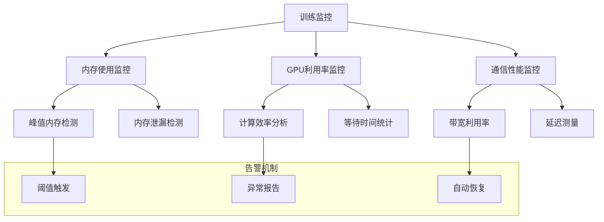

**图表来源**
- [metrics_example.py](file://examples/metrics-monitoring/metrics_example.py#L1-L49)

#### 调试工具集

DeepSpeed提供了丰富的调试和监控工具：

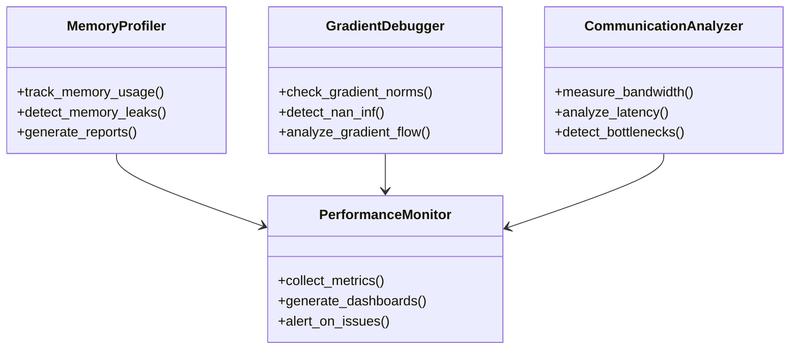

**图表来源**
- [metrics_example.py](file://examples/metrics-monitoring/metrics_example.py#L10-L30)

**章节来源**
- [metrics_example.py](file://examples/metrics-monitoring/metrics_example.py#L1-L49)
- [debug_utils.py](file://src/transformers/debug_utils.py#L44-L183)

## 结论

DeepSpeed作为Transformers库中的重要优化框架，为大规模模型训练提供了完整的解决方案。通过合理的配置策略、性能调优和监控机制，可以在有限的硬件资源上高效训练超大规模语言模型。

关键成功因素包括：
1. **配置策略**：根据模型规模选择合适的ZeRO阶段和卸载策略
2. **性能调优**：协调batch size、学习率和梯度累积参数
3. **监控体系**：建立完善的性能监控和异常检测机制
4. **故障处理**：制定系统的故障诊断和恢复流程

随着模型规模的不断增长，DeepSpeed的技术演进将继续推动大规模AI模型训练的发展，为研究者和工程师提供更强大的工具支持。