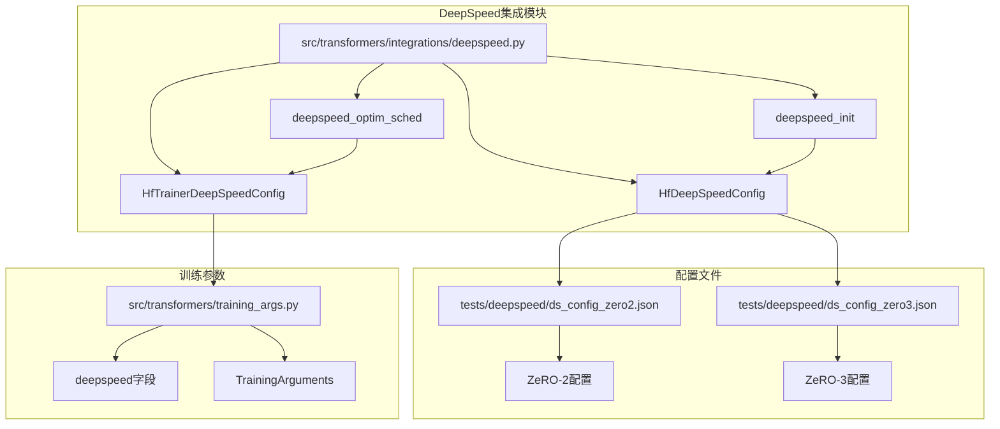
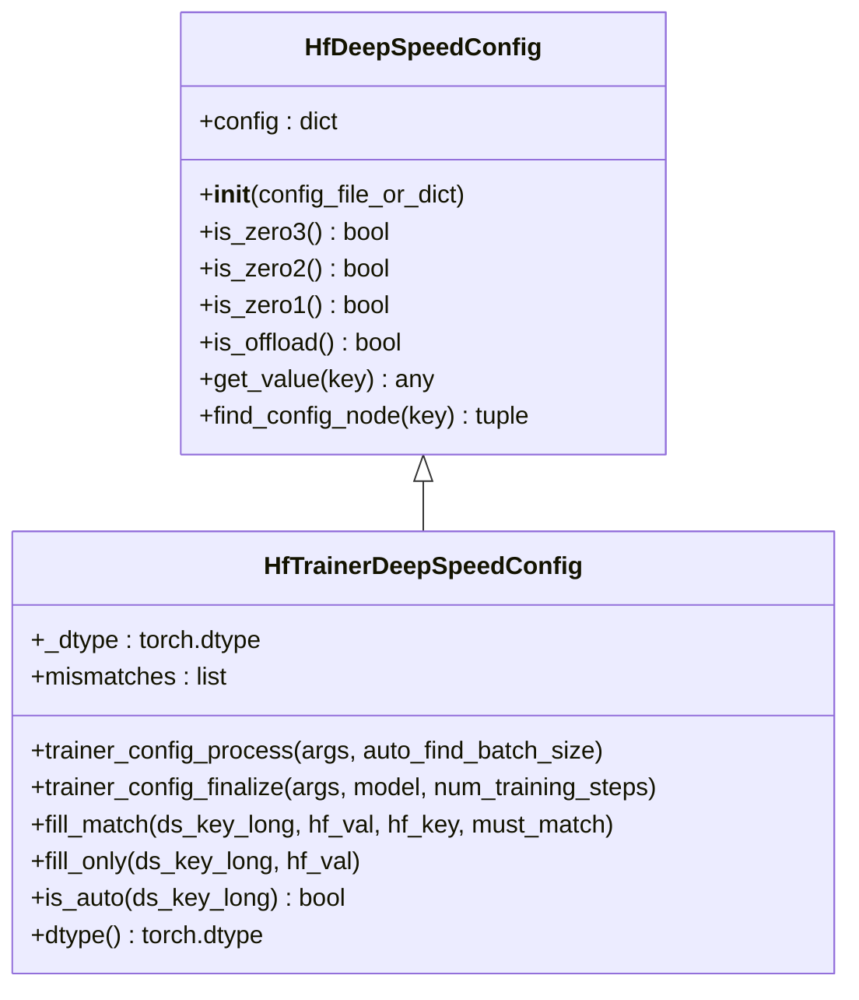
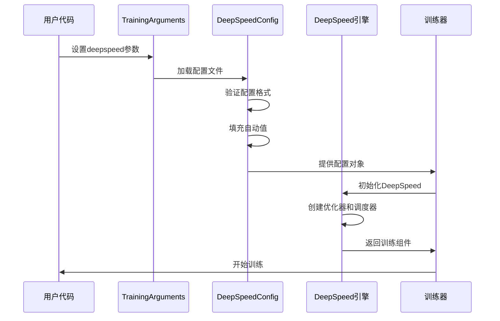
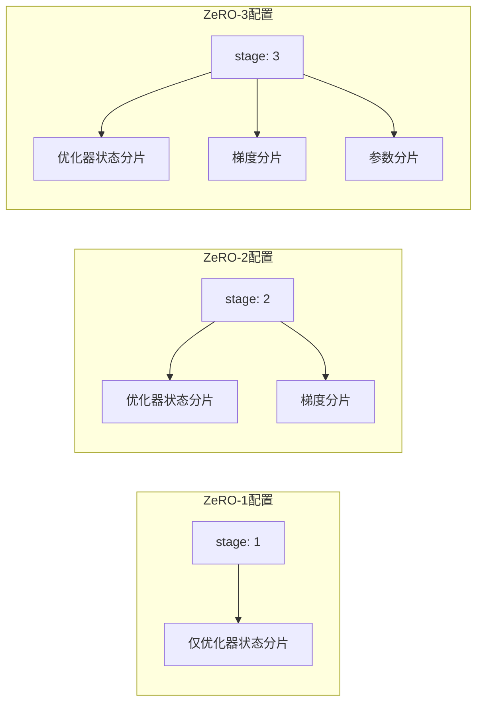
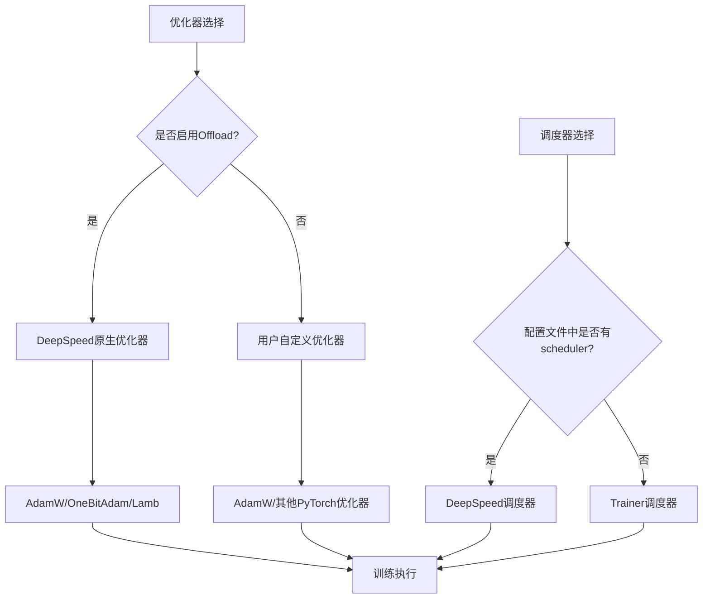
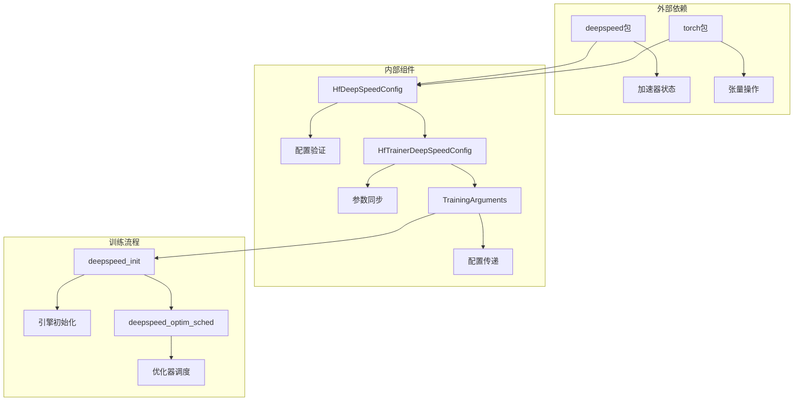
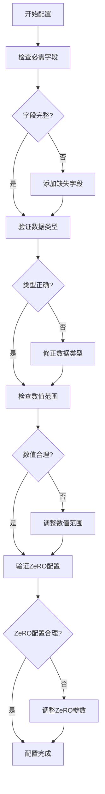

# DeepSpeed配置

<cite>
**本文档引用的文件**
- [src/transformers/integrations/deepspeed.py](file://src/transformers/integrations/deepspeed.py)
- [src/transformers/training_args.py](file://src/transformers/training_args.py)
- [tests/deepspeed/ds_config_zero2.json](file://tests/deepspeed/ds_config_zero2.json)
- [tests/deepspeed/ds_config_zero3.json](file://tests/deepspeed/ds_config_zero3.json)
- [tests/deepspeed/test_deepspeed.py](file://tests/deepspeed/test_deepspeed.py)
</cite>

## 目录
1. [简介](#简介)
2. [项目结构概览](#项目结构概览)
3. [核心组件分析](#核心组件分析)
4. [架构概览](#架构概览)
5. [详细组件分析](#详细组件分析)
6. [依赖关系分析](#依赖关系分析)
7. [性能考虑](#性能考虑)
8. [故障排除指南](#故障排除指南)
9. [结论](#结论)

## 简介

DeepSpeed是Hugging Face Transformers库中的一个重要功能，它提供了大规模模型训练所需的优化技术。本文档详细介绍了DeepSpeed配置文件的结构和参数，重点说明了如何在TrainingArguments中通过deepspeed参数指定配置文件路径，并解释了各种配置选项的作用和最佳实践。

DeepSpeed配置主要包含以下几个关键部分：
- **优化器配置（optimizer）**：定义使用的优化算法和超参数
- **调度器配置（scheduler）**：控制学习率变化策略
- **混合精度配置（fp16/bf16）**：设置数值精度以节省内存
- **梯度累积配置（gradient_accumulation_steps）**：控制梯度累积步数
- **ZeRO优化配置（zero_optimization）**：实现参数分片优化

## 项目结构概览

DeepSpeed集成在Hugging Face Transformers库中的组织结构如下：

**图表来源**
- [src/transformers/integrations/deepspeed.py](file://src/transformers/integrations/deepspeed.py#L1-L486)
- [tests/deepspeed/ds_config_zero2.json](file://tests/deepspeed/ds_config_zero2.json#L1-L55)
- [tests/deepspeed/ds_config_zero3.json](file://tests/deepspeed/ds_config_zero3.json#L1-L56)

**章节来源**
- [src/transformers/integrations/deepspeed.py](file://src/transformers/integrations/deepspeed.py#L1-L100)
- [src/transformers/training_args.py](file://src/transformers/training_args.py#L1137-L1140)

## 核心组件分析

### HfDeepSpeedConfig类

`HfDeepSpeedConfig`类是DeepSpeed配置的核心管理器，负责处理配置文件的加载和基本查询操作。

**图表来源**
- [src/transformers/integrations/deepspeed.py](file://src/transformers/integrations/deepspeed.py#L64-L102)
- [src/transformers/integrations/deepspeed.py](file://src/transformers/integrations/deepspeed.py#L104-L261)

### TrainingArguments中的deepspeed参数

`TrainingArguments`类中的`deepspeed`字段支持两种配置方式：

| 配置类型 | 描述 | 示例 |
|---------|------|------|
| 字符串路径 | DeepSpeed配置文件的JSON文件路径 | `"ds_config.json"` |
| 字典对象 | 已加载的配置字典 | `{"zero_optimization": {"stage": 2}}` |

**章节来源**
- [src/transformers/training_args.py](file://src/transformers/training_args.py#L1137-L1140)
- [src/transformers/training_args.py](file://src/transformers/training_args.py#L1757-L1765)

## 架构概览

DeepSpeed配置系统采用分层架构设计，从配置文件到训练执行形成完整的流水线：

**图表来源**
- [src/transformers/integrations/deepspeed.py](file://src/transformers/integrations/deepspeed.py#L420-L486)
- [src/transformers/training_args.py](file://src/transformers/training_args.py#L1750-L1770)

## 详细组件分析

### ZeRO优化配置详解

ZeRO（Zero Redundancy Optimizer）是DeepSpeed的核心优化技术，分为三个阶段：

#### ZeRO-1：参数分片
ZeRO-1只对优化器状态进行分片，保留完整的模型参数副本。

#### ZeRO-2：参数和梯度分片
ZeRO-2进一步对梯度也进行分片，显著减少内存使用。

#### ZeRO-3：参数、梯度和优化器状态分片
ZeRO-3是最激进的优化，完全移除模型参数的冗余副本。

**图表来源**
- [tests/deepspeed/ds_config_zero2.json](file://tests/deepspeed/ds_config_zero2.json#L32-L45)
- [tests/deepspeed/ds_config_zero3.json](file://tests/deepspeed/ds_config_zero3.json#L32-L50)

### 混合精度配置

DeepSpeed支持FP16和BF16两种混合精度训练模式：

| 配置项 | FP16 | BF16 | 说明 |
|--------|------|------|------|
| enabled | 启用FP16训练 | 启用BF16训练 | 默认FP16 |
| loss_scale | 动态损失缩放 | 固定损失缩放 | FP16需要动态调整 |
| initial_scale_power | 初始缩放指数 | 固定值 | 控制初始损失缩放 |
| min_loss_scale | 最小损失缩放 | 不适用 | FP16专用参数 |

**章节来源**
- [tests/deepspeed/ds_config_zero2.json](file://tests/deepspeed/ds_config_zero2.json#L1-L10)
- [tests/deepspeed/ds_config_zero3.json](file://tests/deepspeed/ds_config_zero3.json#L1-L10)

### 优化器和调度器配置

DeepSpeed支持多种优化器和调度器组合：

**图表来源**
- [src/transformers/integrations/deepspeed.py](file://src/transformers/integrations/deepspeed.py#L346-L376)

**章节来源**
- [src/transformers/integrations/deepspeed.py](file://src/transformers/integrations/deepspeed.py#L159-L180)
- [src/transformers/integrations/deepspeed.py](file://src/transformers/integrations/deepspeed.py#L228-L261)

### 监控和调试参数

DeepSpeed配置中的监控参数帮助跟踪训练过程：

| 参数名 | 类型 | 默认值 | 作用 |
|--------|------|--------|------|
| steps_per_print | int | 2000 | 每打印多少步输出一次日志 |
| wall_clock_breakdown | bool | false | 是否记录详细的性能统计 |
| train_batch_size | auto | auto | 全局训练批次大小 |
| gradient_accumulation_steps | auto | auto | 梯度累积步数 |

**章节来源**
- [tests/deepspeed/ds_config_zero2.json](file://tests/deepspeed/ds_config_zero2.json#L47-L52)
- [tests/deepspeed/ds_config_zero3.json](file://tests/deepspeed/ds_config_zero3.json#L47-L52)

## 依赖关系分析

DeepSpeed配置系统的依赖关系复杂，涉及多个组件的协调：

**图表来源**
- [src/transformers/integrations/deepspeed.py](file://src/transformers/integrations/deepspeed.py#L20-L35)
- [src/transformers/integrations/deepspeed.py](file://src/transformers/integrations/deepspeed.py#L420-L486)

**章节来源**
- [src/transformers/integrations/deepspeed.py](file://src/transformers/integrations/deepspeed.py#L20-L35)
- [src/transformers/training_args.py](file://src/transformers/training_args.py#L1750-L1770)

## 性能考虑

### 内存优化策略

DeepSpeed通过多种策略优化内存使用：

1. **ZeRO分片**：根据模型规模选择合适的ZeRO阶段
2. **梯度检查点**：减少前向传播的内存占用
3. **CPU卸载**：将优化器状态卸载到CPU内存
4. **连续梯度**：提高通信效率

### 训练性能调优

| 调优方向 | 推荐配置 | 性能影响 |
|----------|----------|----------|
| batch_size | 根据显存调整 | 影响训练速度和收敛 |
| gradient_accumulation | 大batch_size时使用 | 维持有效batch_size |
| communication_overlap | 启用所有重叠选项 | 减少通信开销 |
| bucket_size | 自动或基于隐藏层大小 | 平衡内存和通信效率 |

## 故障排除指南

### 常见配置错误

1. **类型不匹配错误**
   - 错误：配置中的数值类型与期望不符
   - 解决：使用`"auto"`让系统自动填充正确的类型

2. **内存不足**
   - 错误：CUDA OOM错误
   - 解决：增加ZeRO阶段，启用CPU卸载，减小batch_size

3. **配置冲突**
   - 错误：训练参数与配置不一致
   - 解决：检查`mismatches`列表，修正配置或参数

### 配置验证最佳实践

**章节来源**
- [src/transformers/integrations/deepspeed.py](file://src/transformers/integrations/deepspeed.py#L240-L261)
- [tests/deepspeed/test_deepspeed.py](file://tests/deepspeed/test_deepspeed.py#L517-L541)

## 结论

DeepSpeed配置系统为大规模模型训练提供了强大而灵活的解决方案。通过合理的配置，可以在保持训练效果的同时显著提升训练效率和内存利用率。

关键要点总结：

1. **配置灵活性**：支持字符串路径和字典两种配置方式
2. **自动填充机制**：`"auto"`值可以自动匹配TrainingArguments参数
3. **多阶段ZeRO**：根据内存需求选择合适的ZeRO优化级别
4. **混合精度**：FP16和BF16训练各有优势，需根据硬件选择
5. **监控参数**：合理设置监控参数有助于训练过程优化
6. **配置验证**：系统会自动检测配置冲突并提供修复建议

正确理解和使用DeepSpeed配置对于成功训练大型语言模型至关重要。建议从简单的ZeRO-2配置开始，逐步探索更高级的优化选项。