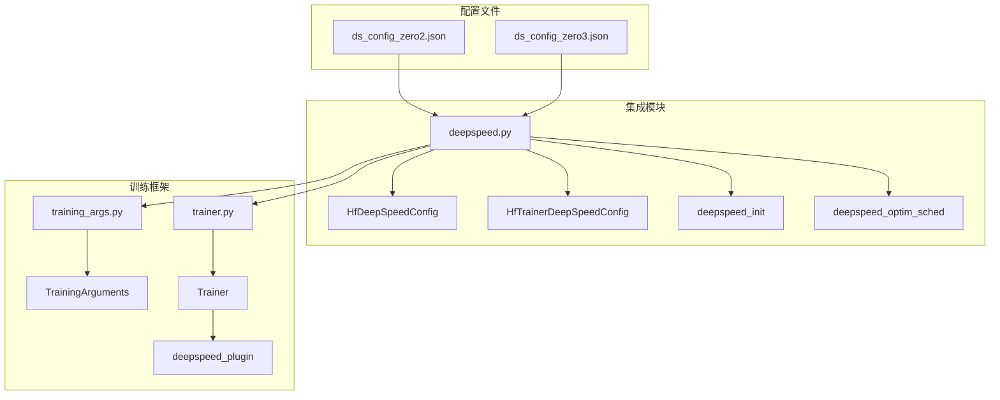
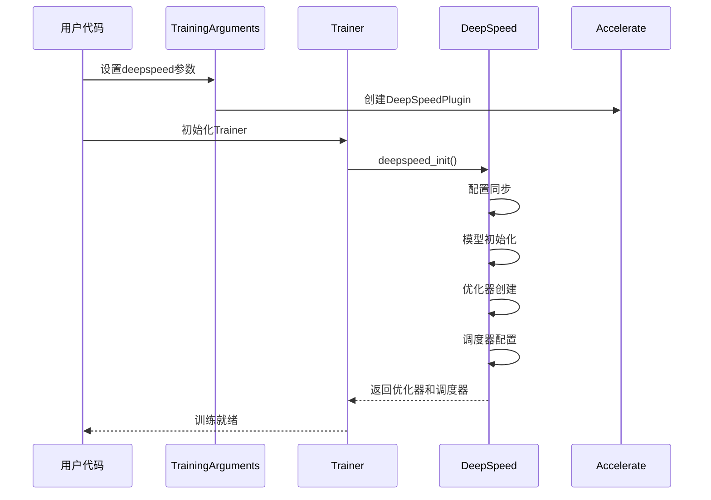
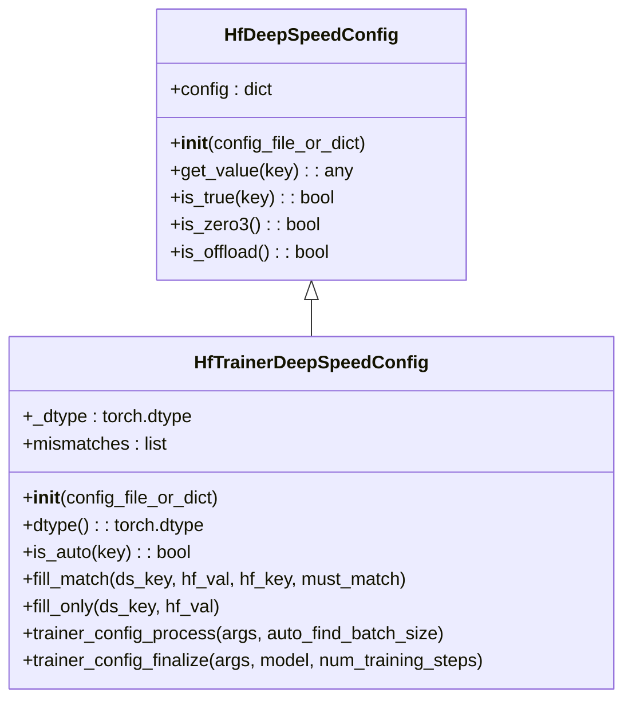
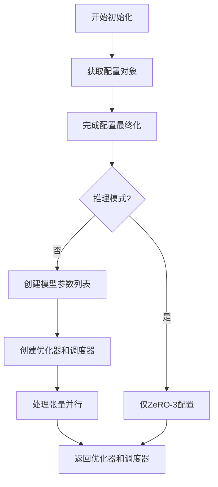
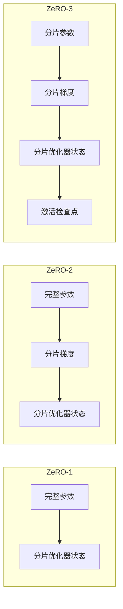
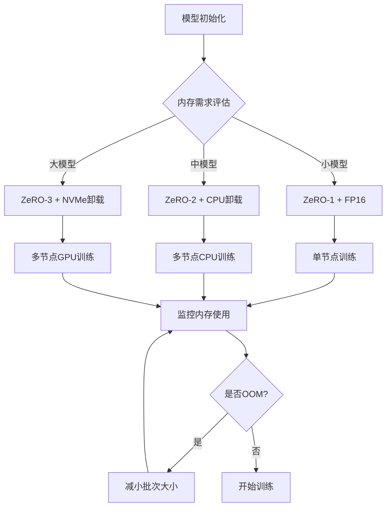

# DeepSpeed集成

<cite>
**本文档中引用的文件**
- [deepspeed.py](file://src/transformers/integrations/deepspeed.py)
- [training_args.py](file://src/transformers/training_args.py)
- [trainer.py](file://src/transformers/trainer.py)
- [ds_config_zero2.json](file://tests/deepspeed/ds_config_zero2.json)
- [ds_config_zero3.json](file://tests/deepspeed/ds_config_zero3.json)
- [test_deepspeed.py](file://tests/deepspeed/test_deepspeed.py)
- [run_clm.py](file://examples/pytorch/language-modeling/run_clm.py)
- [import_utils.py](file://src/transformers/utils/import_utils.py)
</cite>

## 目录
1. [简介](#简介)
2. [项目结构](#项目结构)
3. [核心组件](#核心组件)
4. [架构概览](#架构概览)
5. [详细组件分析](#详细组件分析)
6. [ZeRO优化技术详解](#zero优化技术详解)
7. [DeepSpeed配置文件](#deepspeed配置文件)
8. [TrainingArguments集成](#trainingarguments集成)
9. [最佳实践](#最佳实践)
10. [故障排除指南](#故障排除指南)
11. [结论](#结论)

## 简介

DeepSpeed是微软开发的一个深度学习优化库，专门用于大规模模型训练。在Hugging Face Transformers中，DeepSpeed通过与Accelerate框架的集成，提供了强大的内存优化和分布式训练能力。本文档详细介绍了DeepSpeed与Transformers库的集成方式，重点涵盖ZeRO优化技术、配置方法和最佳实践。

DeepSpeed的核心优势在于其ZeRO（Zero Redundancy Optimizer）技术，该技术通过消除数据并行中的冗余计算和存储来显著降低内存使用。DeepSpeed还支持多种优化器、调度器、混合精度训练以及动态批次大小调整等功能。

## 项目结构

DeepSpeed集成在Transformers库中的组织结构如下：



**图表来源**
- [deepspeed.py](file://src/transformers/integrations/deepspeed.py#L1-L50)
- [training_args.py](file://src/transformers/training_args.py#L1-L100)
- [trainer.py](file://src/transformers/trainer.py#L1-L100)

**章节来源**
- [deepspeed.py](file://src/transformers/integrations/deepspeed.py#L1-L486)
- [training_args.py](file://src/transformers/training_args.py#L1-L800)

## 核心组件

DeepSpeed集成包含以下核心组件：

### 配置管理
- **HfDeepSpeedConfig**: 基础配置类，继承自Accelerate的DeepSpeedConfig
- **HfTrainerDeepSpeedConfig**: 训练器专用配置类，支持自动值同步

### 初始化管理
- **deepspeed_init**: 主要初始化函数，处理模型、优化器和调度器的创建
- **deepspeed_optim_sched**: 优化器和调度器配置的便利包装器

### 状态管理
- **全局弱引用**: 维护配置对象的生命周期
- **状态查询**: 提供ZeRO阶段和配置状态的查询功能

**章节来源**
- [deepspeed.py](file://src/transformers/integrations/deepspeed.py#L50-L150)

## 架构概览

DeepSpeed与Transformers的集成采用分层架构设计：



**图表来源**
- [deepspeed.py](file://src/transformers/integrations/deepspeed.py#L400-L450)
- [trainer.py](file://src/transformers/trainer.py#L5064-L5089)

## 详细组件分析

### HfTrainerDeepSpeedConfig类

这是DeepSpeed集成的核心配置类，负责协调Transformers参数与DeepSpeed配置：



**图表来源**
- [deepspeed.py](file://src/transformers/integrations/deepspeed.py#L60-L120)

#### 关键方法说明

1. **trainer_config_process**: 处理TrainingArguments到DeepSpeed配置的映射
2. **trainer_config_finalize**: 完成配置，处理自动值和模型特定参数
3. **fill_match**: 同步配置值并验证一致性

**章节来源**
- [deepspeed.py](file://src/transformers/integrations/deepspeed.py#L120-L260)

### deepspeed_init函数

主初始化函数负责整个DeepSpeed引擎的启动：



**图表来源**
- [deepspeed.py](file://src/transformers/integrations/deepspeed.py#L400-L450)

**章节来源**
- [deepspeed.py](file://src/transformers/integrations/deepspeed.py#L400-L486)

## ZeRO优化技术详解

DeepSpeed的ZeRO技术分为三个阶段，每个阶段提供不同的内存优化级别：

### ZeRO-1: 参数分片
- 将优化器状态分片到不同设备
- 保留完整的梯度和参数副本
- 适用于中小规模模型

### ZeRO-2: 梯度分片
- 在ZeRO-1基础上增加梯度分片
- 进一步减少内存使用
- 支持CPU卸载优化器状态

### ZeRO-3: 参数分片
- 最高级别的内存优化
- 参数、梯度和优化器状态全部分片
- 支持激活检查点和CPU/NVMe卸载



**图表来源**
- [ds_config_zero2.json](file://tests/deepspeed/ds_config_zero2.json#L30-L45)
- [ds_config_zero3.json](file://tests/deepspeed/ds_config_zero3.json#L30-L50)

**章节来源**
- [ds_config_zero2.json](file://tests/deepspeed/ds_config_zero2.json#L30-L55)
- [ds_config_zero3.json](file://tests/deepspeed/ds_config_zero3.json#L30-L56)

## DeepSpeed配置文件

### 基本配置结构

DeepSpeed配置文件采用JSON格式，包含以下主要部分：

| 配置项 | 描述 | 默认值 | 可选值 |
|--------|------|--------|--------|
| fp16.enabled | 启用FP16混合精度 | false | true/false |
| bf16.enabled | 启用BF16混合精度 | false | true/false |
| zero_optimization.stage | ZeRO优化阶段 | 1 | 1/2/3 |
| train_micro_batch_size_per_gpu | 每GPU微批次大小 | auto | 正整数 |
| gradient_accumulation_steps | 梯度累积步数 | auto | 正整数 |
| gradient_clipping | 梯度裁剪阈值 | auto | 正数值 |

### ZeRO-2配置示例

```json
{
    "zero_optimization": {
        "stage": 2,
        "offload_optimizer": {
            "device": "cpu",
            "pin_memory": true
        },
        "allgather_partitions": true,
        "allgather_bucket_size": 2e8,
        "overlap_comm": true,
        "reduce_scatter": true,
        "reduce_bucket_size": 2e8,
        "contiguous_gradients": true
    }
}
```

### ZeRO-3配置示例

```json
{
    "zero_optimization": {
        "stage": 3,
        "offload_optimizer": {
            "device": "none",
            "pin_memory": true
        },
        "offload_param": {
            "device": "none",
            "pin_memory": true
        },
        "overlap_comm": true,
        "contiguous_gradients": true,
        "sub_group_size": 1e9,
        "reduce_bucket_size": "auto",
        "stage3_prefetch_bucket_size": "auto",
        "stage3_param_persistence_threshold": "auto",
        "stage3_max_live_parameters": 1e9,
        "stage3_max_reuse_distance": 1e9,
        "stage3_gather_16bit_weights_on_model_save": true
    }
}
```

**章节来源**
- [ds_config_zero2.json](file://tests/deepspeed/ds_config_zero2.json#L1-L55)
- [ds_config_zero3.json](file://tests/deepspeed/ds_config_zero3.json#L1-L56)

## TrainingArguments集成

### 配置参数设置

在TrainingArguments中启用DeepSpeed需要设置以下参数：

```python
from transformers import TrainingArguments

training_args = TrainingArguments(
    output_dir="./results",
    deepspeed="ds_config_zero3.json",  # 或直接传入配置字典
    per_device_train_batch_size=4,
    gradient_accumulation_steps=2,
    learning_rate=5e-5,
    num_train_epochs=3,
    fp16=True,  # 或 bf16=True
    save_steps=500,
    logging_steps=100,
    remove_unused_columns=False,
    dataloader_pin_memory=False,
)
```

### 自动值同步机制

DeepSpeed配置支持"auto"关键字，会自动从TrainingArguments中同步相应值：

| DeepSpeed配置 | TrainingArguments对应 | 自动同步 |
|---------------|---------------------|----------|
| train_micro_batch_size_per_gpu | per_device_train_batch_size | ✓ |
| gradient_accumulation_steps | gradient_accumulation_steps | ✓ |
| train_batch_size | 计算得出 | ✓ |
| optimizer.params.lr | learning_rate | ✓ |
| optimizer.params.weight_decay | weight_decay | ✓ |
| scheduler.params.warmup_num_steps | get_warmup_steps() | ✓ |

**章节来源**
- [training_args.py](file://src/transformers/training_args.py#L1670-L1710)
- [deepspeed.py](file://src/transformers/integrations/deepspeed.py#L150-L200)

## 最佳实践

### 内存优化策略

1. **选择合适的ZeRO阶段**
   - 小模型：ZeRO-1或ZeRO-2
   - 中等模型：ZeRO-2 + CPU卸载
   - 大模型：ZeRO-3 + NVMe卸载

2. **混合精度配置**
   ```json
   {
       "fp16": {
           "enabled": true,
           "loss_scale": 0,
           "loss_scale_window": 1000,
           "initial_scale_power": 16,
           "hysteresis": 2,
           "min_loss_scale": 1
       }
   }
   ```

3. **梯度检查点**
   ```python
   training_args.gradient_checkpointing = True
   ```

### 性能优化技巧

1. **通信优化**
   - 启用`overlap_comm`
   - 调整`allgather_bucket_size`和`reduce_bucket_size`
   - 使用`contiguous_gradients`

2. **卸载策略**
   - CPU卸载：适合内存受限环境
   - NVMe卸载：适合超大模型训练

3. **批处理优化**
   - 使用`auto_find_batch_size`自动调整批次大小
   - 合理设置`gradient_accumulation_steps`

### 大规模模型训练策略



**图表来源**
- [deepspeed.py](file://src/transformers/integrations/deepspeed.py#L200-L260)

## 故障排除指南

### 常见问题及解决方案

1. **版本兼容性问题**
   ```python
   # 检查依赖版本
   from transformers.utils import is_deepspeed_available
   if not is_deepspeed_available():
       print("DeepSpeed not available")
   ```

2. **内存不足错误**
   - 减少`train_micro_batch_size_per_gpu`
   - 启用CPU卸载
   - 使用ZeRO-3

3. **配置不匹配**
   ```python
   # 检查配置一致性
   from transformers.integrations.deepspeed import deepspeed_config
   config = deepspeed_config()
   print(config)
   ```

4. **训练中断恢复**
   ```python
   # 恢复检查点
   training_args.resume_from_checkpoint = "path/to/checkpoint"
   ```

### 调试工具

1. **日志配置**
   ```python
   import logging
   logging.basicConfig(level=logging.INFO)
   ```

2. **性能监控**
   ```python
   # 启用详细日志
   training_args.logging_steps = 1
   training_args.report_to = "tensorboard"
   ```

**章节来源**
- [test_deepspeed.py](file://tests/deepspeed/test_deepspeed.py#L1-L200)
- [deepspeed.py](file://src/transformers/integrations/deepspeed.py#L450-L486)

## 结论

DeepSpeed与Hugging Face Transformers的集成提供了强大而灵活的大规模模型训练解决方案。通过ZeRO优化技术，用户可以在有限的硬件资源上训练更大的模型，同时保持良好的训练效率。

关键要点：
- **ZeRO技术**：从ZeRO-1到ZeRO-3提供不同级别的内存优化
- **配置灵活性**：支持JSON配置文件和Python字典配置
- **自动同步**：TrainingArguments与DeepSpeed配置的智能同步
- **性能优化**：丰富的优化选项支持各种训练场景

通过遵循本文档的最佳实践和配置指南，开发者可以充分利用DeepSpeed的强大功能，实现高效的大规模模型训练。