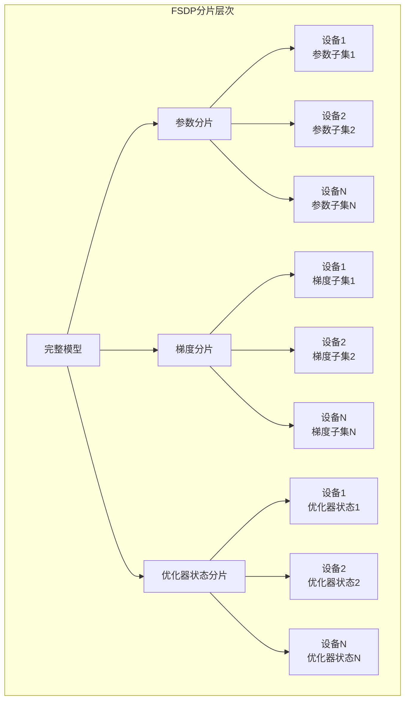
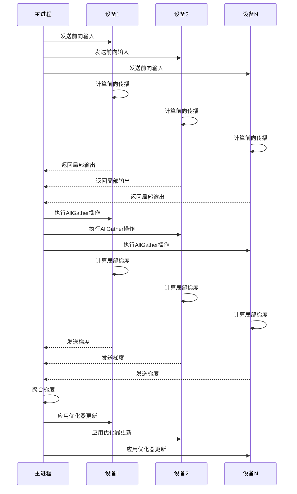
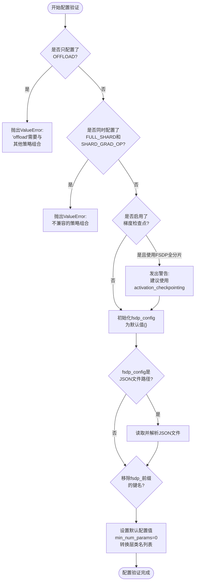
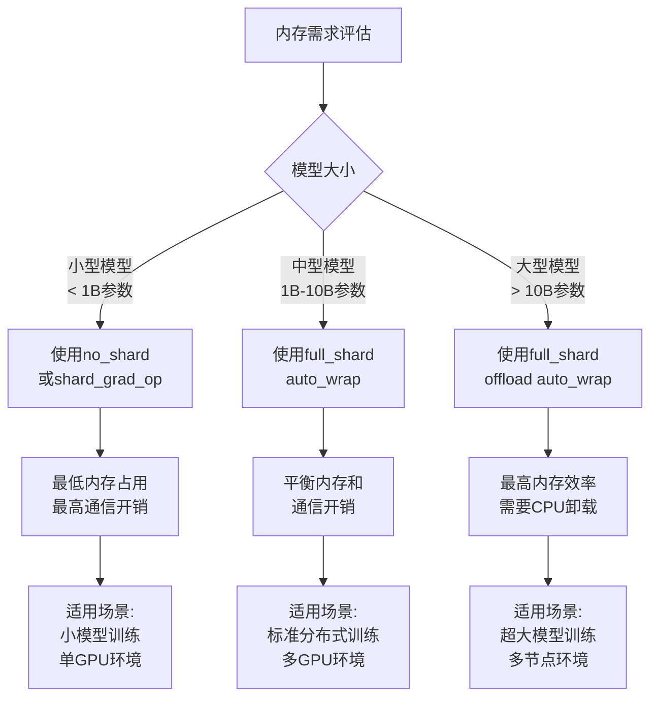
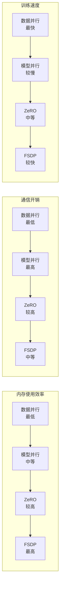
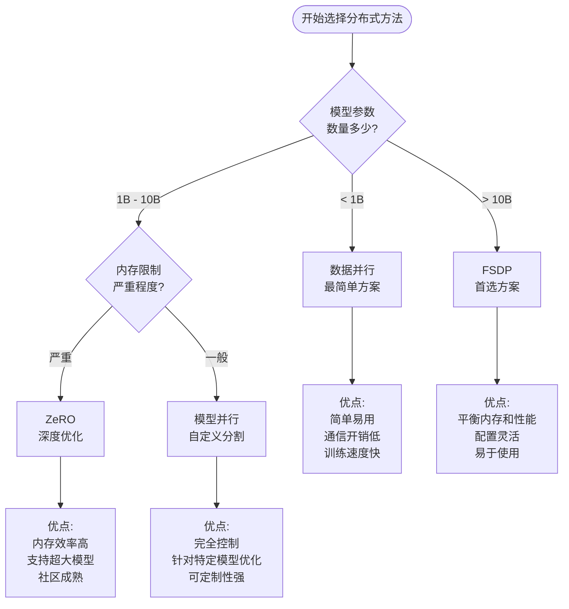

# FSDP分布式训练

<cite>
**本文档中引用的文件**
- [training_args.py](file://src/transformers/training_args.py)
- [trainer.py](file://src/transformers/trainer.py)
- [trainer_utils.py](file://src/transformers/trainer_utils.py)
- [fsdp.py](file://src/transformers/integrations/fsdp.py)
- [test_fsdp.py](file://tests/fsdp/test_fsdp.py)
</cite>

## 目录
1. [简介](#简介)
2. [FSDP工作原理](#fsdp工作原理)
3. [TrainingArguments配置](#trainingarguments配置)
4. [分片策略详解](#分片策略详解)
5. [配置示例](#配置示例)
6. [性能优化与最佳实践](#性能优化与最佳实践)
7. [与其他分布式方法对比](#与其他分布式方法对比)
8. [故障排除指南](#故障排除指南)
9. [总结](#总结)

## 简介

完全分片数据并行（Fully Sharded Data Parallel，FSDP）是PyTorch提供的高级分布式训练技术，专门用于在多个GPU或节点上训练超大规模模型。FSDP通过智能地将模型参数、梯度和优化器状态分片到不同的设备上来显著减少内存占用，同时保持良好的训练性能。

在Hugging Face Transformers中，FSDP集成提供了简单而强大的接口，允许用户通过TrainingArguments轻松配置和使用FSDP进行分布式训练。

## FSDP工作原理

### 核心概念

FSDP的核心思想是将模型的不同部分分布到不同的设备上，而不是像传统的数据并行那样复制整个模型。这种分片策略包括：

1. **参数分片**：将模型参数分散到不同设备
2. **梯度分片**：在反向传播过程中分散梯度计算
3. **优化器状态分片**：将优化器的状态也进行分片存储

### 分片层次结构



**图表来源**
- [trainer.py](file://src/transformers/trainer.py#L2004-L2024)

### 工作流程



**图表来源**
- [trainer.py](file://src/transformers/trainer.py#L2004-L2024)

## TrainingArguments配置

### 基本配置参数

在TrainingArguments中，FSDP相关的配置主要通过以下两个参数完成：

#### fsdp 参数

`fsdp` 参数接受字符串、布尔值或 FSDPOption 枚举列表，定义FSDP的分片策略：

```python
# 基本配置示例
from transformers import TrainingArguments, FSDPOption

# 使用默认的FULL_SHARD策略
args = TrainingArguments(
    output_dir="./results",
    fsdp="full_shard"
)

# 多个策略组合
args = TrainingArguments(
    output_dir="./results",
    fsdp=["full_shard", "offload", "auto_wrap"]
)

# 使用枚举
args = TrainingArguments(
    output_dir="./results",
    fsdp=[FSDPOption.FULL_SHARD, FSDPOption.OFFLOAD, FSDPOption.AUTO_WRAP]
)
```

#### fsdp_config 参数

`fsdp_config` 参数可以是字典或JSON配置文件路径，包含详细的FSDP配置选项：

```python
# 字典配置
fsdp_config = {
    "min_num_params": 1e6,
    "backward_prefetch": "backward_pre",
    "forward_prefetch": False,
    "limit_all_gathers": True,
    "use_orig_params": True,
    "sync_module_states": True,
    "cpu_ram_efficient_loading": True,
    "activation_checkpointing": False
}

args = TrainingArguments(
    output_dir="./results",
    fsdp="full_shard auto_wrap",
    fsdp_config=fsdp_config
)

# JSON文件配置
args = TrainingArguments(
    output_dir="./results",
    fsdp="full_shard auto_wrap",
    fsdp_config="fsdp_config.json"
)
```

**章节来源**
- [training_args.py](file://src/transformers/training_args.py#L449-L460)
- [training_args.py](file://src/transformers/training_args.py#L2622-L2677)

### 配置验证机制

系统会自动验证FSDP配置的有效性：



**图表来源**
- [training_args.py](file://src/transformers/training_args.py#L2653-L2695)

**章节来源**
- [training_args.py](file://src/transformers/training_args.py#L2653-L2695)

## 分片策略详解

### 可用的分片策略

FSDP支持多种分片策略，每种策略都有其特定的用途和性能特征：

| 策略 | 描述 | 内存效率 | 通信开销 | 适用场景 |
|------|------|----------|----------|----------|
| `full_shard` | 分片参数、梯度和优化器状态 | 最高 | 中等 | 大型模型训练 |
| `shard_grad_op` | 分片优化器状态和梯度 | 高 | 低 | 内存受限环境 |
| `hybrid_shard` | 节点内全分片，跨节点复制参数 | 中等 | 中等 | 多节点训练 |
| `hybrid_shard_zero2` | 节点内梯度分片，跨节点复制参数 | 中等 | 低 | 大批次训练 |
| `no_shard` | 不进行任何分片 | 最低 | 最低 | 小模型或单GPU |

### CPU卸载功能

FSDP支持将参数和梯度卸载到CPU内存中，这对于训练非常大的模型特别有用：

```python
# 启用CPU卸载
fsdp_config = {
    "cpu_ram_efficient_loading": True,
    "sync_module_states": True
}

args = TrainingArguments(
    output_dir="./results",
    fsdp="full_shard offload auto_wrap",
    fsdp_config=fsdp_config
)
```

### 自动包装策略

FSDP提供了两种自动包装策略：

1. **默认策略**：基于参数数量的自动包装
2. **变换器基策略**：基于变换器层的自动包装

```python
# 基于参数数量的自动包装
fsdp_config = {
    "min_num_params": 1e6,  # 至少1百万参数的层才会被包装
    "backward_prefetch": "backward_pre"
}

# 基于变换器层的自动包装
fsdp_config = {
    "transformer_layer_cls_to_wrap": ["BertLayer", "GPT2Block"],
    "backward_prefetch": "backward_post"
}
```

**章节来源**
- [training_args.py](file://src/transformers/training_args.py#L449-L460)
- [trainer_utils.py](file://src/transformers/trainer_utils.py#L795-L802)

## 配置示例

### 基础配置示例

#### 示例1：基本的FULL_SHARD配置

```python
from transformers import TrainingArguments

# 基础的FSDP配置
training_args = TrainingArguments(
    output_dir="./fsdp_results",
    num_train_epochs=3,
    per_device_train_batch_size=4,
    per_device_eval_batch_size=8,
    gradient_accumulation_steps=2,
    learning_rate=5e-5,
    warmup_steps=100,
    weight_decay=0.01,
    
    # FSDP配置
    fsdp="full_shard auto_wrap",
    fsdp_config={
        "min_num_params": 1e6,
        "backward_prefetch": "backward_pre",
        "forward_prefetch": False,
        "limit_all_gathers": True,
        "use_orig_params": True
    },
    
    # 混合精度训练
    bf16=True,
    
    # 日志和保存配置
    logging_steps=10,
    save_steps=500,
    eval_steps=500,
    evaluation_strategy="steps",
    save_strategy="steps",
    load_best_model_at_end=True
)
```

#### 示例2：CPU卸载配置

```python
# 包含CPU卸载的配置
training_args = TrainingArguments(
    output_dir="./fsdp_cpu_offload",
    num_train_epochs=3,
    per_device_train_batch_size=2,
    per_device_eval_batch_size=4,
    
    # FSDP配置
    fsdp="full_shard offload auto_wrap",
    fsdp_config={
        "min_num_params": 1e6,
        "cpu_ram_efficient_loading": True,
        "sync_module_states": True,
        "backward_prefetch": "backward_pre",
        "forward_prefetch": False,
        "limit_all_gathers": True
    },
    
    # 混合精度训练
    bf16=True,
    
    # 其他配置
    gradient_accumulation_steps=4,
    logging_steps=50,
    save_steps=1000,
    eval_steps=1000
)
```

#### 示例3：多GPU配置

```python
# 多GPU训练配置
training_args = TrainingArguments(
    output_dir="./fsdp_multi_gpu",
    num_train_epochs=5,
    per_device_train_batch_size=1,
    per_device_eval_batch_size=2,
    
    # FSDP配置
    fsdp="full_shard auto_wrap",
    fsdp_config={
        "min_num_params": 1e6,
        "backward_prefetch": "backward_post",
        "forward_prefetch": True,
        "limit_all_gathers": False,
        "use_orig_params": True
    },
    
    # 混合精度训练
    bf16=True,
    
    # 优化配置
    gradient_accumulation_steps=8,
    dataloader_num_workers=4,
    dataloader_pin_memory=True
)
```

### 高级配置示例

#### 示例4：变换器基包装配置

```python
# 针对特定模型架构的配置
training_args = TrainingArguments(
    output_dir="./fsdp_transformer",
    num_train_epochs=3,
    per_device_train_batch_size=4,
    
    # FSDP配置
    fsdp="full_shard auto_wrap",
    fsdp_config={
        "transformer_layer_cls_to_wrap": [
            "BertLayer",      # BERT模型
            "GPT2Block",      # GPT系列模型  
            "T5Block",        # T5模型
            "LlamaDecoderLayer", # LLaMA模型
            "OPTDecoderLayer" # OPT模型
        ],
        "backward_prefetch": "backward_pre",
        "activation_checkpointing": True,  # 启用激活检查点
        "cpu_ram_efficient_loading": True
    },
    
    # 混合精度训练
    bf16=True,
    
    # 性能优化
    gradient_checkpointing=True,  # 启用梯度检查点
    dataloader_num_workers=2,
    dataloader_prefetch_factor=2
)
```

#### 示例5：XLA FSDP配置

```python
# XLA FSDP配置（实验性）
training_args = TrainingArguments(
    output_dir="./fsdp_xla",
    num_train_epochs=3,
    per_device_train_batch_size=8,
    
    # FSDP配置
    fsdp="full_shard auto_wrap",
    fsdp_config={
        "xla": True,
        "xla_fsdp_settings": {
            "wrap_policy": "by_size",
            "size_policy": 1e9,  # 1GB
            "compute_dtype": "bfloat16",
            "buffer_dtype": "bfloat16"
        },
        "xla_fsdp_grad_ckpt": True
    },
    
    # 混合精度训练
    bf16=True,
    
    # 其他配置
    gradient_accumulation_steps=1,
    dataloader_num_workers=0
)
```

**章节来源**
- [test_fsdp.py](file://tests/fsdp/test_fsdp.py#L193-L211)
- [test_fsdp.py](file://tests/fsdp/test_fsdp.py#L120-L150)

## 性能优化与最佳实践

### 内存优化策略

#### 1. 选择合适的分片策略



#### 2. 优化预取策略

```python
# 优化的预取配置
fsdp_config = {
    # 后向预取策略
    "backward_prefetch": "backward_pre",  # 在当前参数梯度计算前预取
    # "backward_prefetch": "backward_post",  # 在当前参数梯度计算后预取
    # "backward_prefetch": "no_prefetch",    # 不进行预取
    
    # 前向预取策略
    "forward_prefetch": True,  # 在前向传播时显式预取下一个AllGather
    
    # 限制AllGather操作
    "limit_all_gathers": True,  # 防止过多的飞行中AllGather
}
```

#### 3. 激活检查点优化

```python
# 启用激活检查点以减少内存使用
fsdp_config = {
    "activation_checkpointing": True,
    "backward_prefetch": "backward_pre",  # 与激活检查点配合使用
    "limit_all_gathers": True
}

# 注意：当使用FSDP时，应使用fsdp_config中的activation_checkpointing
# 而不是TrainingArguments中的gradient_checkpointing
# 因为后者会在反向传播中引入冗余的AllGather操作
```

### 通信优化

#### 1. 网络拓扑优化

```python
# 针对不同网络拓扑的配置
network_configs = {
    # 高带宽低延迟网络（如InfiniBand）
    "high_bandwidth": {
        "backward_prefetch": "backward_pre",
        "forward_prefetch": True,
        "limit_all_gathers": False
    },
    
    # 一般网络环境
    "general": {
        "backward_prefetch": "backward_post",
        "forward_prefetch": False,
        "limit_all_gathers": True
    },
    
    # 低带宽网络
    "low_bandwidth": {
        "backward_prefetch": "no_prefetch",
        "forward_prefetch": False,
        "limit_all_gathers": True
    }
}
```

#### 2. 批次大小调整

```python
# 根据可用内存调整批次大小
def calculate_optimal_batch_size(num_gpus, model_size_gb, available_memory_gb):
    # 基础公式：每个GPU需要的内存 = 模型大小 + 批次大小 × 每样本内存
    # 解方程得到最大批次大小
    max_batch_size_per_gpu = (available_memory_gb - model_size_gb) / 0.1  # 假设每样本需要0.1GB
    return int(max_batch_size_per_gpu * num_gpus)

# 示例：4卡GPU，13B模型，32GB内存
optimal_batch_size = calculate_optimal_batch_size(4, 52, 32)
print(f"推荐的总批次大小: {optimal_batch_size}")
```

### 训练速度优化

#### 1. 梯度累积策略

```python
# 高效的梯度累积配置
training_args = TrainingArguments(
    output_dir="./results",
    per_device_train_batch_size=1,  # 每设备小批次
    gradient_accumulation_steps=8,   # 累积8步等于大批次
    # 其他配置...
)
```

#### 2. 数据加载优化

```python
# 优化的数据加载配置
training_args = TrainingArguments(
    dataloader_num_workers=4,        # 多进程数据加载
    dataloader_prefetch_factor=2,    # 预取2倍批次数据
    dataloader_pin_memory=True,      # 固定内存提高传输速度
    dataloader_drop_last=True,       # 最后一批次丢弃以避免填充
    # 其他配置...
)
```

**章节来源**
- [training_args.py](file://src/transformers/training_args.py#L2653-L2677)
- [test_fsdp.py](file://tests/fsdp/test_fsdp.py#L120-L150)

## 与其他分布式方法对比

### 方法对比表

| 特性 | 数据并行 | 模型并行 | ZeRO | FSDP |
|------|----------|----------|------|------|
| 内存效率 | 低 | 中等 | 高 | 最高 |
| 通信开销 | 低 | 高 | 中等 | 中等 |
| 实现复杂度 | 低 | 高 | 中等 | 中等 |
| 适用模型大小 | 小到中型 | 大型以上 | 超大型 | 大型以上 |
| 灵活性 | 高 | 低 | 中等 | 高 |

### 性能特征对比



### 选择指导原则

#### 何时选择FSDP

1. **模型大小**：适合训练10亿参数以上的模型
2. **硬件资源**：有多个GPU但单GPU内存不足
3. **灵活性需求**：需要灵活的分片策略和配置
4. **维护成本**：希望使用成熟的分布式训练解决方案

#### 替代方案选择



**章节来源**
- [training_args.py](file://src/transformers/training_args.py#L449-L460)

## 故障排除指南

### 常见问题及解决方案

#### 1. 内存不足错误

**问题描述**：
```
RuntimeError: CUDA out of memory
```

**解决方案**：
```python
# 1. 减少批次大小
training_args = TrainingArguments(
    per_device_train_batch_size=1,  # 从原来的2减小
    gradient_accumulation_steps=16,  # 增加累积步数
    # 其他配置...
)

# 2. 启用CPU卸载
fsdp_config = {
    "cpu_ram_efficient_loading": True,
    "sync_module_states": True,
    "min_num_params": 1e6
}

# 3. 启用激活检查点
fsdp_config["activation_checkpointing"] = True
```

#### 2. FSDP配置冲突

**问题描述**：
```
ValueError: '--fsdp full_shard' is not compatible with '--fsdp shard_grad_op'
```

**解决方案**：
```python
# 错误的配置
training_args = TrainingArguments(
    fsdp=["FULL_SHARD", "SHARD_GRAD_OP"]  # 冲突的组合
)

# 正确的配置
training_args = TrainingArguments(
    fsdp=["FULL_SHARD"]  # 或者
    # fsdp=["SHARD_GRAD_OP"]  # 单独使用
)
```

#### 3. 梯度检查点冲突

**问题描述**：
```
Warning: When using FSDP full shard, instead of using `gradient_checkpointing` in TrainingArguments, please use `activation_checkpointing` in `fsdp_config`.
```

**解决方案**：
```python
# 错误的配置
training_args = TrainingArguments(
    gradient_checkpointing=True,  # 不要在FSDP环境中使用
    fsdp="full_shard auto_wrap",
    fsdp_config={
        "activation_checkpointing": False  # 应该在这里启用
    }
)

# 正确的配置
training_args = TrainingArguments(
    gradient_checkpointing=False,  # 禁用此选项
    fsdp="full_shard auto_wrap",
    fsdp_config={
        "activation_checkpointing": True  # 在这里启用
    }
)
```

#### 4. CPU卸载配置错误

**问题描述**：
```
AssertionError: cpu_ram_efficient_loading requires sync_module_states to be True
```

**解决方案**：
```python
# 确保正确配置CPU卸载
fsdp_config = {
    "cpu_ram_efficient_loading": True,
    "sync_module_states": True,  # 必须设置为True
    "min_num_params": 1e6
}
```

### 调试技巧

#### 1. 启用详细日志

```python
import logging

# 设置更详细的日志级别
logging.basicConfig(level=logging.DEBUG)

# 或者针对特定模块
logger = logging.getLogger("transformers.trainer")
logger.setLevel(logging.DEBUG)
```

#### 2. 检查FSDP状态

```python
from transformers.integrations.fsdp import is_fsdp_enabled

# 检查FSDP是否已正确启用
if is_fsdp_enabled():
    print("FSDP is enabled and working!")
else:
    print("FSDP is not enabled. Check your configuration.")
```

#### 3. 内存监控

```python
import torch

def monitor_memory_usage():
    """监控GPU内存使用情况"""
    if torch.cuda.is_available():
        allocated = torch.cuda.memory_allocated() / 1024**3  # GB
        reserved = torch.cuda.memory_reserved() / 1024**3    # GB
        print(f"GPU内存使用: 已分配 {allocated:.2f}GB, 已保留 {reserved:.2f}GB")
```

#### 4. 分片验证

```python
def validate_fsdp_sharding(model):
    """验证FSDP分片配置"""
    from torch.distributed.fsdp import FullyShardedDataParallel as FSDP
    
    if isinstance(model, FSDP):
        print("FSDP模型已正确初始化")
        print(f"分片策略: {model.sharding_strategy}")
        print(f"CPU卸载: {model.cpu_offload}")
        print(f"自动包装: {model.auto_wrap_policy}")
    else:
        print("模型未使用FSDP包装")
```

**章节来源**
- [training_args.py](file://src/transformers/training_args.py#L2653-L2677)
- [fsdp.py](file://src/transformers/integrations/fsdp.py#L35-L53)

## 总结

FSDP作为现代深度学习框架中的重要分布式训练技术，在处理超大规模模型方面展现出了卓越的能力。通过Hugging Face Transformers的集成，用户可以以相对简单的方式享受到FSDP带来的优势。

### 关键要点

1. **配置灵活性**：FSDP提供了丰富的配置选项，可以根据具体需求调整分片策略、预取行为和内存管理
2. **内存效率**：相比传统数据并行，FSDP能够显著降低单GPU内存需求，支持更大规模的模型训练
3. **易于使用**：通过TrainingArguments的简洁接口，用户可以快速启用FSDP功能
4. **性能优化**：合理的配置可以平衡内存使用和训练速度，实现最佳的训练效果

### 最佳实践总结

1. **根据模型大小选择合适的分片策略**
2. **合理配置预取策略以优化通信性能**
3. **在内存受限环境中启用CPU卸载**
4. **使用激活检查点减少内存占用**
5. **避免与梯度检查点的冲突配置**

### 未来发展方向

随着模型规模的不断增长和硬件技术的进步，FSDP将继续演进以满足更高的训练需求。用户应该关注最新的版本更新，及时采用新的优化特性和改进。

通过掌握这些FSDP的核心概念和实践技巧，研究人员和工程师们可以更有效地利用分布式计算资源，加速大规模模型的训练过程。