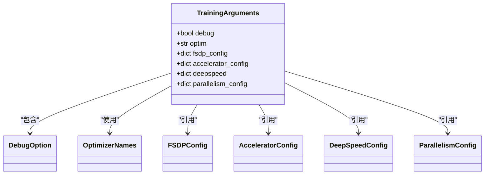
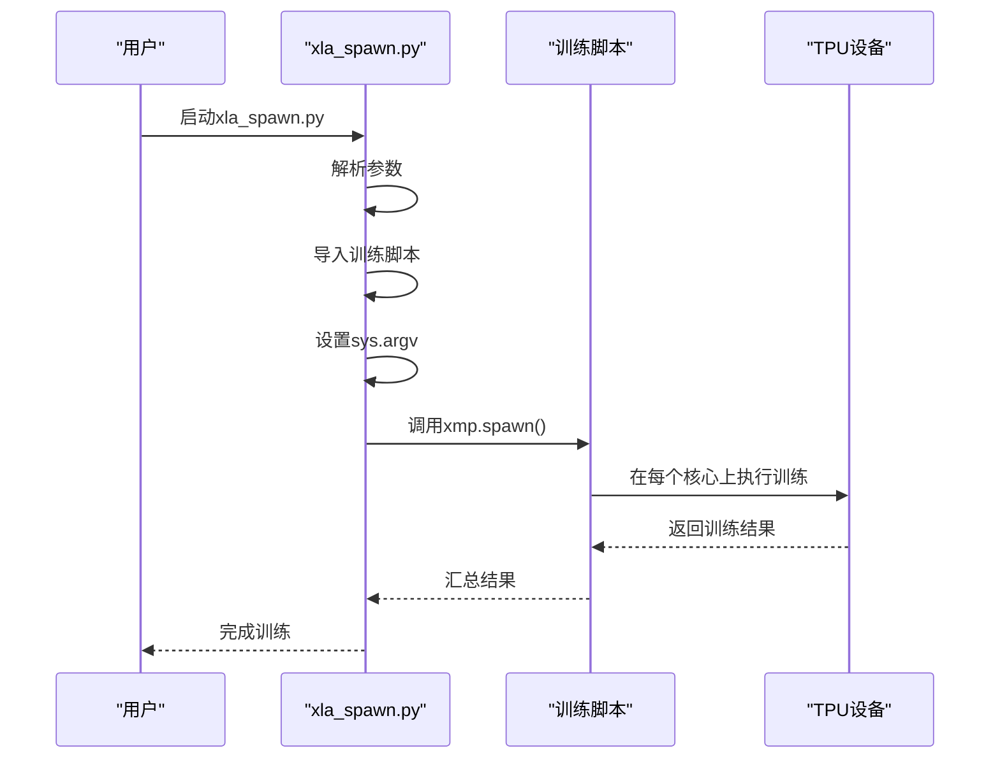
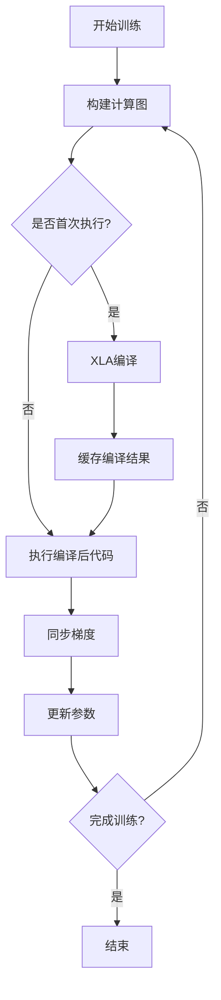

# TPU训练

<cite>
**本文档中引用的文件**  
- [tpu.py](file://src/transformers/integrations/tpu.py)
- [training_args.py](file://src/transformers/training_args.py)
- [xla_spawn.py](file://examples/pytorch/xla_spawn.py)
- [import_utils.py](file://src/transformers/utils/import_utils.py)
</cite>

## 目录
1. [引言](#引言)
2. [TPU架构与XLA编译器](#tpu架构与xla编译器)
3. [TPU训练配置](#tpu训练配置)
4. [分布式训练配置示例](#分布式训练配置示例)
5. [TPU训练特殊要求](#tpu训练特殊要求)
6. [性能调优建议](#性能调优建议)
7. [结论](#结论)

## 引言

本文档详细介绍了在Google TPU上使用transformers库进行分布式训练的方法。重点阐述了TPU的架构特点和XLA编译器的工作原理，以及它们如何影响模型训练。文档还详细说明了如何配置TrainingArguments以启用TPU支持，包括xla参数的使用，并提供了在TPU Pod上进行大规模分布式训练的配置示例和最佳实践。

**Section sources**
- [training_args.py](file://src/transformers/training_args.py#L1-L100)

## TPU架构与XLA编译器

Google TPU（Tensor Processing Unit）是一种专门为机器学习工作负载设计的专用硬件加速器。TPU架构具有以下特点：

- **矩阵乘法单元（MXU）**：TPU的核心是大型二维脉动阵列，专门用于高效的矩阵乘法运算，这是深度学习中最常见的操作。
- **高带宽内存（HBM）**：TPU配备了高带宽内存，能够快速访问大量数据，减少了内存瓶颈。
- **片上网络（NoC）**：TPU通过片上网络连接多个核心，实现了高效的设备间通信。
- **静态形状执行**：TPU在执行计算图之前需要知道所有张量的形状，这允许XLA编译器进行深度优化。

XLA（Accelerated Linear Algebra）编译器是TPU训练的关键组件。它将PyTorch或TensorFlow的计算图转换为针对TPU硬件优化的低级代码。XLA编译器的工作原理包括：

- **JIT（Just-In-Time）编译**：在训练开始时，XLA编译器将整个计算图编译为TPU可执行的代码，这消除了运行时的解释开销。
- **融合操作**：XLA能够将多个操作融合成一个内核，减少了内存访问次数和启动开销。
- **内存优化**：通过静态形状分析，XLA可以精确地分配内存，避免了动态内存分配的开销。

**Section sources**
- [import_utils.py](file://src/transformers/utils/import_utils.py#L1-L50)
- [tpu.py](file://src/transformers/integrations/tpu.py#L1-L10)

## TPU训练配置

在transformers库中，可以通过配置TrainingArguments来启用TPU支持。以下是关键的配置参数：



**Diagram sources**
- [training_args.py](file://src/transformers/training_args.py#L100-L200)

### 启用TPU调试

通过设置`debug`参数可以启用TPU特定的调试功能：

```python
training_args = TrainingArguments(
    debug="tpu_metrics_debug",  # 启用TPU调试模式
    # 其他参数...
)
```

### 优化器选择

对于TPU训练，推荐使用`adamw_torch_xla`优化器，它针对XLA进行了优化：

```python
training_args = TrainingArguments(
    optim="adamw_torch_xla",  # 使用XLA优化的AdamW优化器
    # 其他参数...
)
```

### 分布式训练配置

通过`fsdp_config`和`accelerator_config`参数可以配置分布式训练：

```python
training_args = TrainingArguments(
    fsdp_config={
        "xla": True,  # 启用XLA FSDP
        "xla_fsdp_grad_ckpt": True,  # 启用XLA FSDP梯度检查点
    },
    accelerator_config={
        "use_seedable_sampler": True,  # 使用可重现的随机采样器
    },
    # 其他参数...
)
```

**Section sources**
- [training_args.py](file://src/transformers/training_args.py#L200-L500)

## 分布式训练配置示例

以下是在TPU Pod上进行大规模分布式训练的配置示例：

### 单机多核训练

对于单个TPU设备上的多核训练，可以使用`xla_spawn.py`脚本：

```bash
python xla_spawn.py --num_cores=8 YOUR_TRAINING_SCRIPT.py --arg1 --arg2
```

对应的Python代码实现：



**Diagram sources**
- [xla_spawn.py](file://examples/pytorch/xla_spawn.py#L1-L83)

### 多机多核训练

对于TPU Pod上的多机多核训练，需要配置FSDP（Fully Sharded Data Parallel）：

```python
training_args = TrainingArguments(
    fsdp="full_shard",
    fsdp_config={
        "xla": True,
        "xla_fsdp_settings": {
            "min_split_size_mb": 50,
            "auto_wrap_policy": "transformer_layer_policy",
        },
        "xla_fsdp_grad_ckpt": True,
    },
    per_device_train_batch_size=32,
    gradient_accumulation_steps=4,
    # 其他参数...
)
```

这种配置将模型参数、梯度和优化器状态在所有TPU核心上进行分片，实现了高效的内存利用和计算并行。

**Section sources**
- [xla_spawn.py](file://examples/pytorch/xla_spawn.py#L1-L83)
- [training_args.py](file://src/transformers/training_args.py#L500-L800)

## TPU训练特殊要求

TPU训练有一些特殊要求，需要在配置和实现时特别注意：

### 静态形状

TPU要求所有张量的形状在编译时是已知的。这意味着：

- 批处理大小必须是固定的
- 序列长度需要填充到固定长度
- 动态形状的操作需要避免

### JIT编译

XLA编译器会对计算图进行JIT编译，这带来了以下影响：

- 首次迭代会比较慢，因为需要编译时间
- 编译后的代码执行速度非常快
- 需要确保计算图的稳定性，避免频繁重新编译

### 设备间通信优化

TPU通过高效的片上网络进行设备间通信，优化策略包括：

- 使用`all_reduce`进行梯度同步
- 最小化主机与TPU之间的数据传输
- 批量处理通信操作



**Diagram sources**
- [tpu.py](file://src/transformers/integrations/tpu.py#L1-L37)

**Section sources**
- [tpu.py](file://src/transformers/integrations/tpu.py#L1-L37)
- [import_utils.py](file://src/transformers/utils/import_utils.py#L50-L100)

## 性能调优建议

为了在TPU上获得最佳训练性能，建议采用以下调优策略：

### 批处理大小选择

批处理大小的选择需要平衡内存使用和训练效率：

- 较大的批处理大小可以提高TPU利用率
- 但过大的批处理大小可能导致内存不足
- 建议从较小的批处理大小开始，逐步增加直到达到内存限制

### 渐进式批处理

使用`auto_find_batch_size`参数可以自动找到适合内存的批处理大小：

```python
training_args = TrainingArguments(
    auto_find_batch_size=True,  # 自动找到合适的批处理大小
    # 其他参数...
)
```

### 梯度累积

当批处理大小受限时，可以使用梯度累积来模拟更大的批处理大小：

```python
training_args = TrainingArguments(
    per_device_train_batch_size=8,
    gradient_accumulation_steps=4,  # 累积4步的梯度
    # 实际批处理大小为 8 * 4 = 32
)
```

### 混合精度训练

TPU支持bfloat16混合精度训练，可以显著提高训练速度：

```python
training_args = TrainingArguments(
    bf16=True,  # 启用bfloat16混合精度
    # 其他参数...
)
```

### 混合精度评估

对于评估阶段，可以使用全bfloat16精度：

```python
training_args = TrainingArguments(
    bf16_full_eval=True,  # 评估时使用全bfloat16精度
    # 其他参数...
)
```

这些配置可以显著提高TPU的训练效率，同时保持模型的精度。

**Section sources**
- [training_args.py](file://src/transformers/training_args.py#L800-L1200)

## 结论

在Google TPU上使用transformers库进行分布式训练需要理解TPU的架构特点和XLA编译器的工作原理。通过正确配置TrainingArguments，可以充分利用TPU的计算能力，实现高效的模型训练。关键的配置包括启用XLA FSDP、选择合适的优化器、配置批处理大小和使用混合精度训练。遵循这些最佳实践，可以在TPU Pod上实现大规模分布式训练，显著缩短模型训练时间。