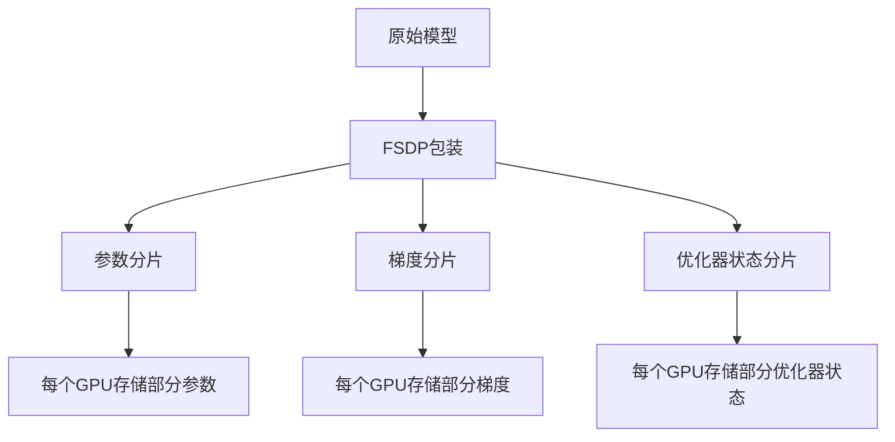
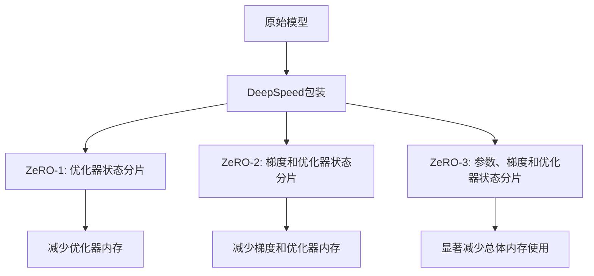

# 分布式训练

<cite>
**本文档中引用的文件**   
- [training_args.py](file://src/transformers/training_args.py)
- [deepspeed.py](file://src/transformers/integrations/deepspeed.py)
- [fsdp.py](file://src/transformers/integrations/fsdp.py)
- [distributed_training.py](file://examples/training/distributed_training.py)
- [3D_parallel.py](file://examples/3D_parallel.py)
- [ds_config_zero2.json](file://tests/deepspeed/ds_config_zero2.json)
- [ds_config_zero3.json](file://tests/deepspeed/ds_config_zero3.json)
</cite>

## 目录
1. [引言](#引言)
2. [分布式训练方法概述](#分布式训练方法概述)
3. [数据并行](#数据并行)
4. [模型并行](#模型并行)
5. [FSDP（完全分片数据并行）](#fsdp完全分片数据并行)
6. [DeepSpeed集成](#deepspeed集成)
7. [TrainingArguments配置](#trainingarguments配置)
8. [FSDP配置示例](#fsdp配置示例)
9. [DeepSpeed配置示例](#deepspeed配置示例)
10. [性能特征与内存使用](#性能特征与内存使用)
11. [最佳实践与调优建议](#最佳实践与调优建议)
12. [结论](#结论)

## 引言

分布式训练是大规模语言模型训练的关键技术，它通过将计算和内存负载分布在多个GPU或节点上来克服单设备的内存限制。transformers库提供了对多种分布式训练方法的支持，包括数据并行、模型并行、FSDP（完全分片数据并行）和DeepSpeed。这些技术使得训练数十亿甚至数万亿参数的模型成为可能。本文档将详细介绍这些分布式训练方法的实现原理、配置方法和最佳实践。

**Section sources**
- [training_args.py](file://src/transformers/training_args.py#L1-L2775)
- [deepspeed.py](file://src/transformers/integrations/deepspeed.py#L1-L486)

## 分布式训练方法概述

transformers库支持多种分布式训练方法，每种方法都有其独特的优缺点和适用场景。主要的分布式训练方法包括数据并行（Data Parallelism）、模型并行（Model Parallelism）、FSDP（Fully Sharded Data Parallel）和DeepSpeed。这些方法可以单独使用，也可以组合使用以达到最佳的训练效率和内存利用率。选择合适的分布式训练策略对于大规模模型训练至关重要，需要根据模型大小、硬件配置和训练目标进行权衡。

**Section sources**
- [training_args.py](file://src/transformers/training_args.py#L449-L460)
- [3D_parallel.py](file://examples/3D_parallel.py#L1-L435)

## 数据并行

数据并行是最常见的分布式训练方法，它将训练数据分割成多个批次，每个GPU处理一个批次的前向和后向传播。在反向传播完成后，所有GPU的梯度会被聚合，然后更新模型参数。这种方法简单易用，但每个GPU都需要存储完整的模型副本，因此内存使用效率较低。在transformers库中，数据并行通常作为其他更高级并行策略的基础。

**Section sources**
- [distributed_training.py](file://examples/training/distributed_training.py#L1-L114)
- [training_args.py](file://src/transformers/training_args.py#L860-L895)

## 模型并行

模型并行将模型的不同部分分配到不同的GPU上，从而减少每个GPU的内存占用。这种方法特别适用于超大规模模型，其中单个GPU无法容纳整个模型。模型并行可以进一步分为张量并行（Tensor Parallelism）和流水线并行（Pipeline Parallelism）。张量并行将单个层的计算分布在多个GPU上，而流水线并行将不同的层分配到不同的GPU上。transformers库通过集成PyTorch的分布式张量功能支持模型并行。

**Section sources**
- [3D_parallel.py](file://examples/3D_parallel.py#L1-L435)
- [tensor_parallel.py](file://src/transformers/integrations/tensor_parallel.py#L580-L606)

## FSDP（完全分片数据并行）

FSDP（Fully Sharded Data Parallel）是PyTorch提供的一种高级分布式训练技术，它通过将模型参数、梯度和优化器状态分片到多个GPU上来显著减少内存使用。与传统的数据并行相比，FSDP可以将内存使用量减少多达3倍。在transformers库中，FSDP通过TrainingArguments中的`fsdp`和`fsdp_config`参数进行配置。FSDP支持多种分片策略，包括`full_shard`、`shard_grad_op`和`hybrid_shard`。



**Diagram sources**
- [fsdp.py](file://src/transformers/integrations/fsdp.py#L1-L54)
- [training_args.py](file://src/transformers/training_args.py#L2653-L2677)

**Section sources**
- [fsdp.py](file://src/transformers/integrations/fsdp.py#L1-L54)
- [training_args.py](file://src/transformers/training_args.py#L2653-L2748)

## DeepSpeed集成

DeepSpeed是微软开发的一个深度学习优化库，它提供了ZeRO（Zero Redundancy Optimizer）等高级优化技术，可以显著减少分布式训练的内存使用。DeepSpeed的ZeRO-3阶段可以将模型参数、梯度和优化器状态都进行分片，从而实现超大规模模型的训练。在transformers库中，DeepSpeed通过`deepspeed`参数进行配置，可以指定一个JSON格式的配置文件来启用各种优化功能。



**Diagram sources**
- [deepspeed.py](file://src/transformers/integrations/deepspeed.py#L1-L486)
- [ds_config_zero3.json](file://tests/deepspeed/ds_config_zero3.json#L1-L56)

**Section sources**
- [deepspeed.py](file://src/transformers/integrations/deepspeed.py#L1-L486)
- [ds_config_zero3.json](file://tests/deepspeed/ds_config_zero3.json#L1-L56)

## TrainingArguments配置

TrainingArguments类提供了配置分布式训练策略的核心接口。通过设置`fsdp`和`deepspeed`参数，可以启用不同的分布式训练方法。`fsdp`参数接受一个字符串列表，指定FSDP的分片策略，如`full_shard`、`shard_grad_op`等。`fsdp_config`参数可以指定一个JSON配置文件或字典，用于进一步定制FSDP的行为。类似地，`deepspeed`参数可以指定DeepSpeed的配置文件路径。

**Section sources**
- [training_args.py](file://src/transformers/training_args.py#L449-L460)
- [training_args.py](file://src/transformers/training_args.py#L2653-L2748)

## FSDP配置示例

以下是一个FSDP配置文件的示例，展示了如何配置FSDP以实现最佳的训练性能：

```json
{
    "fsdp_min_num_params": 1e9,
    "fsdp_transformer_layer_cls_to_wrap": ["LlamaDecoderLayer", "BertLayer"],
    "fsdp_backward_prefetch": "backward_pre",
    "fsdp_forward_prefetch": true,
    "fsdp_limit_all_gathers": true,
    "fsdp_use_orig_params": true,
    "fsdp_sync_module_states": true
}
```

这个配置文件指定了最小参数数量阈值、需要包装的Transformer层类名、后向预取模式等参数。通过合理配置这些选项，可以优化FSDP的性能和内存使用。

**Section sources**
- [training_args.py](file://src/transformers/training_args.py#L2679-L2720)
- [test_fsdp.py](file://tests/fsdp/test_fsdp.py#L193-L211)

## DeepSpeed配置示例

以下是一个DeepSpeed配置文件的示例，展示了如何配置DeepSpeed以实现最佳的训练性能：

```json
{
    "fp16": {
        "enabled": "auto"
    },
    "bf16": {
        "enabled": "auto"
    },
    "optimizer": {
        "type": "AdamW",
        "params": {
            "lr": "auto",
            "betas": "auto",
            "eps": "auto",
            "weight_decay": "auto"
        }
    },
    "zero_optimization": {
        "stage": 3,
        "offload_optimizer": {
            "device": "cpu",
            "pin_memory": true
        },
        "offload_param": {
            "device": "cpu",
            "pin_memory": true
        },
        "overlap_comm": true,
        "contiguous_gradients": true
    },
    "gradient_accumulation_steps": "auto",
    "gradient_clipping": "auto"
}
```

这个配置文件启用了混合精度训练、ZeRO-3优化和CPU卸载等功能。通过使用"auto"值，DeepSpeed可以自动从TrainingArguments中获取相应的配置值。

**Section sources**
- [ds_config_zero3.json](file://tests/deepspeed/ds_config_zero3.json#L1-L56)
- [deepspeed.py](file://src/transformers/integrations/deepspeed.py#L182-L204)

## 性能特征与内存使用

不同的分布式训练方法在性能和内存使用方面有显著差异。FSDP和DeepSpeed通常比传统的数据并行方法具有更好的内存效率，但可能会引入额外的通信开销。FSDP的`full_shard`策略可以将内存使用量减少到原来的1/3，而DeepSpeed的ZeRO-3可以实现类似的内存节省。在选择分布式训练策略时，需要权衡内存节省和通信开销，根据具体的硬件配置和模型大小进行选择。

**Section sources**
- [training_args.py](file://src/transformers/training_args.py#L2653-L2677)
- [deepspeed.py](file://src/transformers/integrations/deepspeed.py#L182-L204)

## 最佳实践与调优建议

在使用分布式训练时，以下是一些最佳实践和调优建议：
1. 对于大规模模型，优先考虑使用FSDP或DeepSpeed而不是传统的数据并行。
2. 合理配置混合精度训练（fp16/bf16）以提高训练速度和减少内存使用。
3. 使用梯度检查点（gradient_checkpointing）来进一步减少内存使用，特别是在训练深层模型时。
4. 对于超大规模模型，考虑使用CPU卸载（offload）技术将部分状态存储在CPU内存中。
5. 通过调整`gradient_accumulation_steps`来平衡内存使用和训练效率。
6. 在配置FSDP时，使用`auto_wrap`策略自动包装Transformer层，避免手动指定。

**Section sources**
- [training_args.py](file://src/transformers/training_args.py#L2653-L2677)
- [deepspeed.py](file://src/transformers/integrations/deepspeed.py#L182-L204)

## 结论

transformers库提供了强大而灵活的分布式训练支持，使得训练超大规模语言模型成为可能。通过合理配置FSDP和DeepSpeed等高级分布式训练技术，可以显著减少内存使用并提高训练效率。选择合适的分布式训练策略需要根据具体的模型大小、硬件配置和训练目标进行权衡。随着模型规模的不断增长，掌握这些分布式训练技术对于现代深度学习研究和应用至关重要。