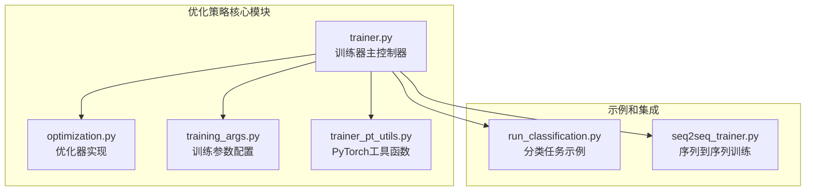
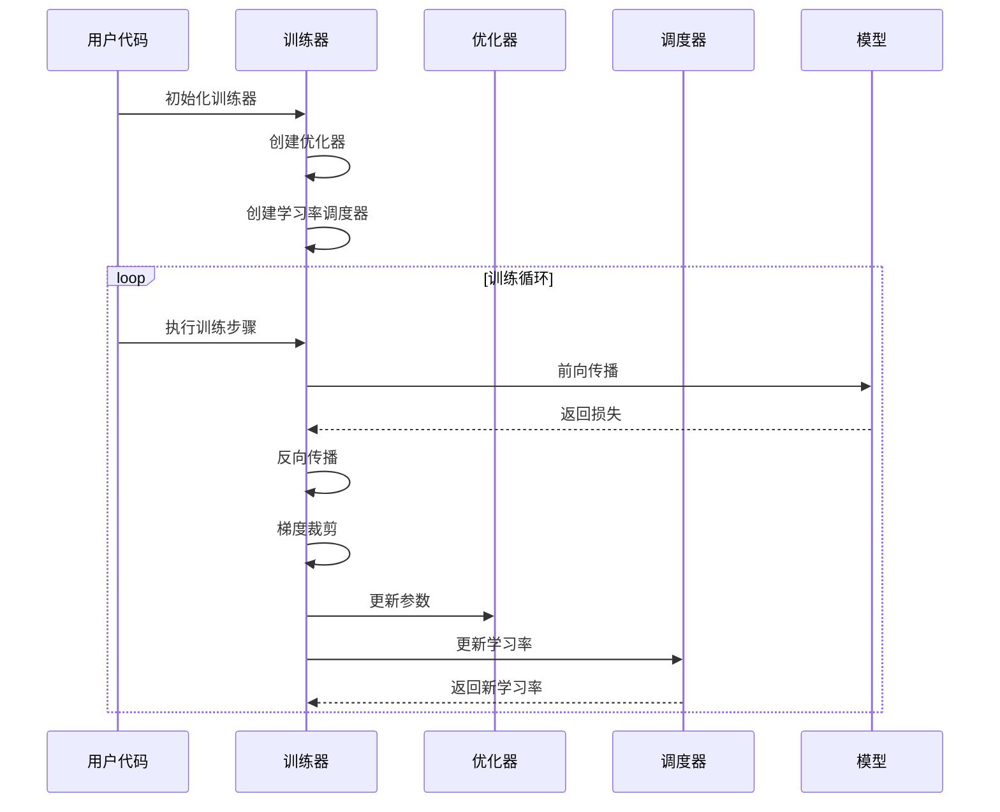
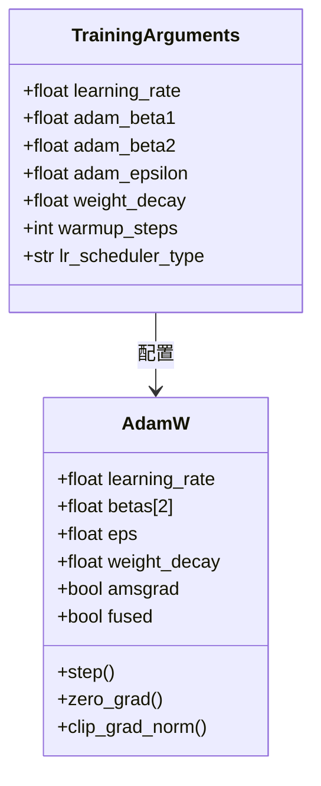
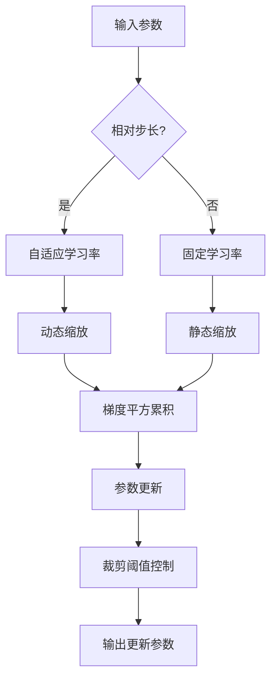
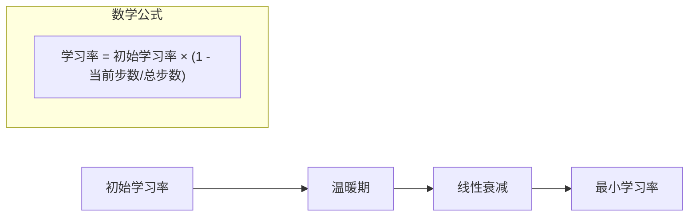
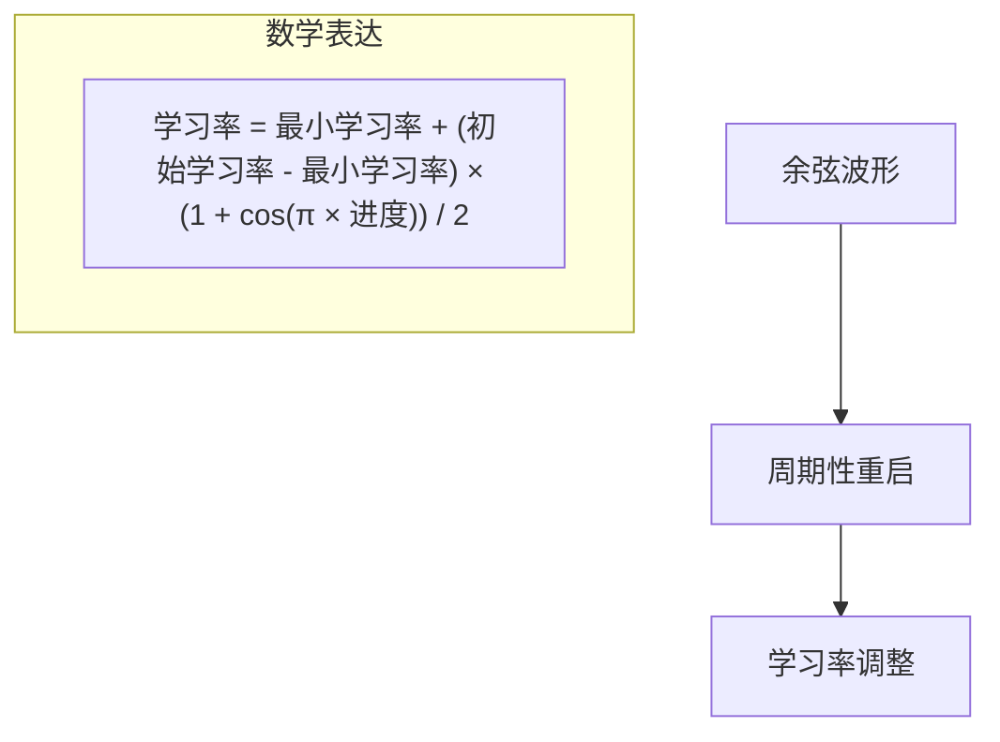
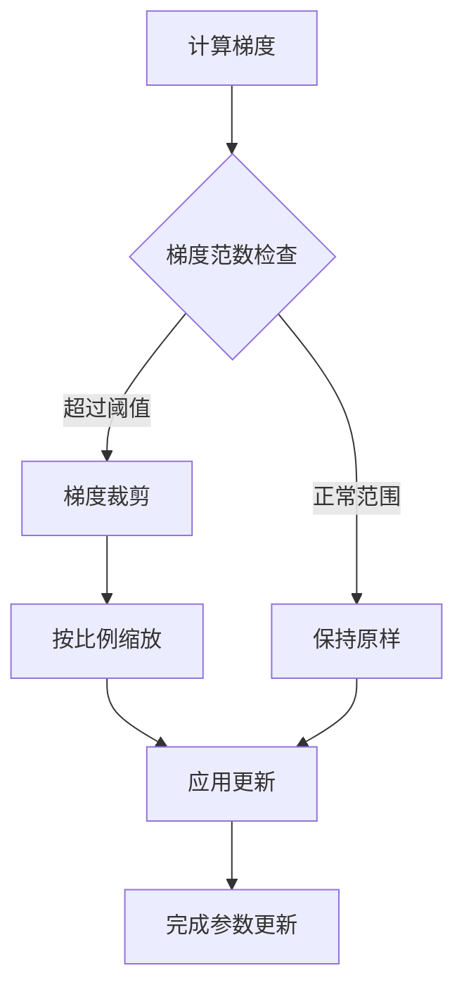
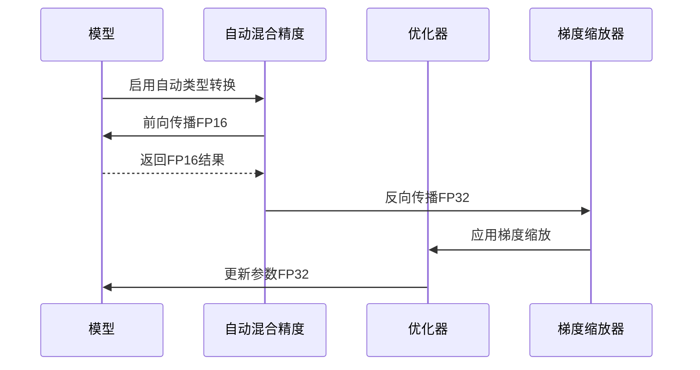
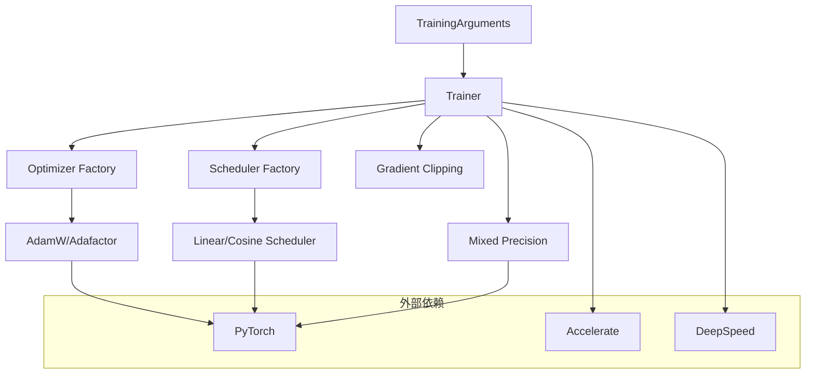

# 优化策略

<cite>
**本文档中引用的文件**
- [trainer.py](file://src/transformers/trainer.py)
- [optimization.py](file://src/transformers/optimization.py)
- [training_args.py](file://src/transformers/training_args.py)
- [trainer_pt_utils.py](file://src/transformers/trainer_pt_utils.py)
- [run_classification.py](file://examples/pytorch/text-classification/run_classification.py)
- [seq2seq_trainer.py](file://examples/legacy/seq2seq/seq2seq_trainer.py)
</cite>

## 目录
1. [简介](#简介)
2. [项目结构概述](#项目结构概述)
3. [核心优化组件](#核心优化组件)
4. [架构概览](#架构概览)
5. [详细组件分析](#详细组件分析)
6. [依赖关系分析](#依赖关系分析)
7. [性能考虑](#性能考虑)
8. [故障排除指南](#故障排除指南)
9. [结论](#结论)

## 简介

本文档深入介绍了Hugging Face Transformers库中自定义训练的各种优化策略。该库提供了全面的优化框架，支持多种优化器、学习率调度器、梯度裁剪、权重衰减和混合精度训练等关键技术。通过系统化的架构设计，这些优化策略能够显著提升训练效率和模型性能。

## 项目结构概述

优化策略的核心组件分布在以下关键模块中：



**图表来源**
- [trainer.py](file://src/transformers/trainer.py#L1-L100)
- [optimization.py](file://src/transformers/optimization.py#L1-L50)
- [training_args.py](file://src/transformers/training_args.py#L1-L50)

**章节来源**
- [trainer.py](file://src/transformers/trainer.py#L1-L200)
- [optimization.py](file://src/transformers/optimization.py#L1-L100)

## 核心优化组件

### 优化器类型

系统支持多种优化器，每种都有其特定的应用场景：

| 优化器类型 | 描述 | 适用场景 | 配置参数 |
|-----------|------|----------|----------|
| AdamW | 标准AdamW优化器 | 大多数深度学习任务 | 学习率、Beta1、Beta2、Epsilon |
| Adafactor | 自适应因子优化器 | 大模型训练，内存受限 | 相对步长、缩放参数、衰减率 |
| StableAdamW | 稳定AdamW优化器 | 需要数值稳定性的任务 | 最大学习率、Kahan求和 |
| AdamW_torch_fused | 熔合版本AdamW | GPU加速优化 | 熔合标志、内存优化 |

### 学习率调度器

系统提供了丰富的时间调度策略：

| 调度器类型 | 数学公式 | 特点 | 应用场景 |
|-----------|----------|------|----------|
| Linear | 线性衰减 | 简单直接，广泛使用 | 基准实验 |
| Cosine | 余弦退火 | 平滑衰减，周期重启 | 大规模预训练 |
| Constant | 恒定学习率 | 无衰减，用于微调 | 微调阶段 |
| Polynomial | 多项式衰减 | 可控衰减速率 | 特殊需求 |
| WarmupStableDecay | 温暖启动稳定衰减 | 三阶段策略 | 复杂训练流程 |

**章节来源**
- [optimization.py](file://src/transformers/optimization.py#L50-L200)
- [training_args.py](file://src/transformers/training_args.py#L100-L200)

## 架构概览

优化策略的整体架构采用分层设计，确保灵活性和可扩展性：



**图表来源**
- [trainer.py](file://src/transformers/trainer.py#L2373-L2550)
- [optimization.py](file://src/transformers/optimization.py#L800-L974)

## 详细组件分析

### 优化器配置与初始化

#### AdamW优化器配置

AdamW是默认的优化器选择，具有以下关键配置参数：



**图表来源**
- [trainer.py](file://src/transformers/trainer.py#L1187-L1250)
- [training_args.py](file://src/transformers/training_args.py#L200-L300)

#### Adafactor优化器特性

Adafactor针对大模型训练进行了特殊优化：



**图表来源**
- [optimization.py](file://src/transformers/optimization.py#L750-L850)

**章节来源**
- [trainer.py](file://src/transformers/trainer.py#L1187-L1400)
- [optimization.py](file://src/transformers/optimization.py#L750-L900)

### 学习率调度器实现

#### 线性衰减调度器

线性衰减是最常用的学习率调度策略：



**图表来源**
- [optimization.py](file://src/transformers/optimization.py#L100-L150)

#### 余弦退火调度器

余弦退火提供更平滑的学习率变化：



**图表来源**
- [optimization.py](file://src/transformers/optimization.py#L150-L200)

**章节来源**
- [optimization.py](file://src/transformers/optimization.py#L50-L300)

### 梯度裁剪机制

梯度裁剪防止梯度爆炸问题：



**图表来源**
- [trainer.py](file://src/transformers/trainer.py#L2507-L2529)

**章节来源**
- [trainer.py](file://src/transformers/trainer.py#L2507-L2550)

### 权重衰减策略

权重衰减通过L2正则化防止过拟合：

```mermaid
graph TB
A[原始参数更新] --> B[添加权重衰减项]
B --> C[新参数 = 原参数 - 学习率 × (梯度 + 权重衰减 × 参数)]
subgraph "分组策略"
D[带权重衰减的参数组]
E[不带权重衰减的参数组]
end
```

**图表来源**
- [trainer.py](file://src/transformers/trainer.py#L1187-L1216)

**章节来源**
- [trainer.py](file://src/transformers/trainer.py#L1187-L1250)

### 混合精度训练（AMP）

混合精度训练通过使用半精度浮点数来加速训练并减少内存使用：



**图表来源**
- [trainer.py](file://src/transformers/trainer.py#L3697-L3734)

**章节来源**
- [trainer.py](file://src/transformers/trainer.py#L3697-L3764)

## 依赖关系分析

优化策略系统的依赖关系展现了清晰的层次结构：



**图表来源**
- [trainer.py](file://src/transformers/trainer.py#L1-L100)
- [training_args.py](file://src/transformers/training_args.py#L1-L50)

**章节来源**
- [trainer.py](file://src/transformers/trainer.py#L1-L200)

## 性能考虑

### 训练速度优化

1. **优化器选择**：熔合优化器（如`adamw_torch_fused`）可以显著提升GPU利用率
2. **学习率调度**：合理的调度策略可以在保证收敛的同时加快训练速度
3. **梯度累积**：通过累积多个小批次来模拟大批次训练效果

### 内存使用优化

1. **混合精度训练**：使用FP16可以减少约50%的内存使用
2. **梯度检查点**：在前向传播中保存部分激活以减少内存占用
3. **优化器状态压缩**：Adafactor相比AdamW需要更少的内存

### 数值稳定性

1. **梯度裁剪**：防止梯度爆炸导致的数值不稳定
2. **权重衰减分组**：避免在不同类型的参数上应用相同的衰减强度
3. **自适应学习率**：Adafactor的自适应特性有助于数值稳定性

## 故障排除指南

### 常见优化问题及解决方案

#### 训练不收敛

**可能原因**：
- 学习率设置过高或过低
- 权重衰减过大
- 梯度裁剪阈值不当

**解决方案**：
1. 调整学习率范围（通常在1e-5到1e-3之间）
2. 减小权重衰减值
3. 适当增大梯度裁剪阈值

#### 内存不足

**可能原因**：
- 模型过大
- 批次大小设置过高
- 混合精度未启用

**解决方案**：
1. 使用梯度累积减少有效批次大小
2. 启用混合精度训练（FP16/BF16）
3. 考虑使用DeepSpeed ZeRO优化

#### 训练速度慢

**可能原因**：
- 优化器选择不当
- 学习率调度过于保守
- 数据加载瓶颈

**解决方案**：
1. 使用熔合优化器
2. 采用更积极的学习率调度
3. 优化数据加载管道

**章节来源**
- [trainer.py](file://src/transformers/trainer.py#L2373-L2550)

## 结论

Hugging Face Transformers库提供的优化策略框架具有以下优势：

1. **全面性**：涵盖了现代深度学习训练所需的各类优化技术
2. **灵活性**：支持多种优化器和调度器的组合配置
3. **易用性**：通过合理的默认配置和清晰的API设计降低使用门槛
4. **可扩展性**：模块化设计便于添加新的优化技术

通过合理选择和配置这些优化策略，用户可以在保证模型性能的同时显著提升训练效率。建议根据具体的任务需求、硬件资源和性能目标来选择最适合的优化组合。