# 基础优化技术

<cite>
**本文档引用的文件**
- [optimization.py](file://src/transformers/optimization.py)
- [trainer.py](file://src/transformers/trainer.py)
- [training_args.py](file://src/transformers/training_args.py)
- [run_glue_no_trainer.py](file://examples/pytorch/text-classification/run_glue_no_trainer.py)
- [seq2seq_trainer.py](file://examples/legacy/seq2seq/seq2seq_trainer.py)
- [test_optimization.py](file://tests/optimization/test_optimization.py)
</cite>

## 目录
1. [简介](#简介)
2. [项目结构概览](#项目结构概览)
3. [核心优化器](#核心优化器)
4. [学习率调度器](#学习率调度器)
5. [梯度裁剪技术](#梯度裁剪技术)
6. [权重衰减机制](#权重衰减机制)
7. [训练循环集成](#训练循环集成)
8. [性能分析与调优](#性能分析与调优)
9. [故障排除指南](#故障排除指南)
10. [总结](#总结)

## 简介

在深度学习训练过程中，优化技术是确保模型能够有效收敛的关键因素。本文档深入探讨了transformers库中提供的基础优化技术，包括最常用的AdamW优化器配置、多种学习率调度策略、梯度裁剪技术和权重衰减机制。这些技术共同构成了现代深度学习训练的核心基础设施。

优化技术的选择和配置直接影响训练的稳定性、收敛速度和最终模型性能。通过合理配置这些参数，可以显著提升训练效率并获得更好的模型表现。

## 项目结构概览

transformers库中的优化技术主要分布在以下几个关键模块中：

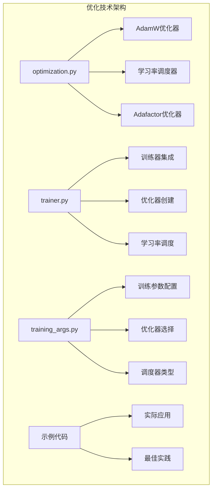

**图表来源**
- [optimization.py](file://src/transformers/optimization.py#L1-L50)
- [trainer.py](file://src/transformers/trainer.py#L1-L100)
- [training_args.py](file://src/transformers/training_args.py#L1-L100)

**章节来源**
- [optimization.py](file://src/transformers/optimization.py#L1-L100)
- [trainer.py](file://src/transformers/trainer.py#L1-L200)

## 核心优化器

### AdamW优化器详解

AdamW是transformers库中最常用的优化器，它结合了Adam优化算法的优点和权重衰减的正则化效果。

#### 配置参数详解

| 参数名称 | 默认值 | 类型 | 说明 | 对训练的影响 |
|---------|--------|------|------|-------------|
| `learning_rate` | 5e-5 | float | 初始学习率 | 影响收敛速度和最终精度 |
| `betas` | (0.9, 0.999) | tuple | 动量参数 | 控制梯度移动平均的衰减率 |
| `eps` | 1e-8 | float | 数值稳定性常数 | 防止除零错误 |
| `weight_decay` | 0.0 | float | 权重衰减系数 | 控制正则化强度 |

#### AdamW优化器实现

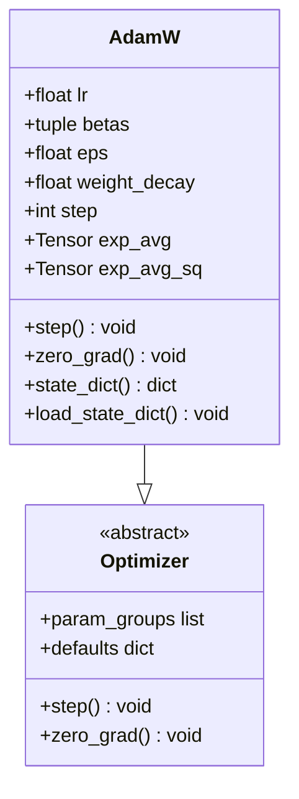

**图表来源**
- [optimization.py](file://src/transformers/optimization.py#L100-L200)

#### 优化器参数对训练的影响

不同的参数配置会产生截然不同的训练行为：

- **高学习率**：可能导致训练不稳定，损失函数震荡
- **低学习率**：训练速度慢，可能陷入局部最优
- **β1参数**：影响一阶矩估计的平滑程度
- **β2参数**：影响二阶矩估计的平滑程度
- **权重衰减**：控制模型复杂度，防止过拟合

**章节来源**
- [optimization.py](file://src/transformers/optimization.py#L100-L300)
- [trainer.py](file://src/transformers/trainer.py#L1400-L1500)

### Adafactor优化器

Adafactor是一种内存高效的优化器，特别适用于大模型训练。

#### 核心特性

- **自适应学习率**：根据参数维度自动调整学习率
- **内存效率**：仅存储少量状态变量
- **相对步长**：支持时间依赖的学习率调度

#### 配置参数

| 参数 | 默认值 | 说明 |
|------|--------|------|
| `lr` | None | 外部学习率 |
| `eps` | (1e-30, 1e-3) | 正则化常数 |
| `clip_threshold` | 1.0 | 梯度裁剪阈值 |
| `decay_rate` | -0.8 | 平均平方衰减率 |
| `beta1` | None | 一阶矩衰减率 |
| `weight_decay` | 0.0 | 权重衰减系数 |
| `scale_parameter` | True | 是否缩放学习率 |
| `relative_step` | True | 是否使用相对步长 |
| `warmup_init` | False | 是否使用预热初始化 |

**章节来源**
- [optimization.py](file://src/transformers/optimization.py#L700-L850)

## 学习率调度器

学习率调度器通过动态调整学习率来改善训练效果和加速收敛。

### 调度器类型概览

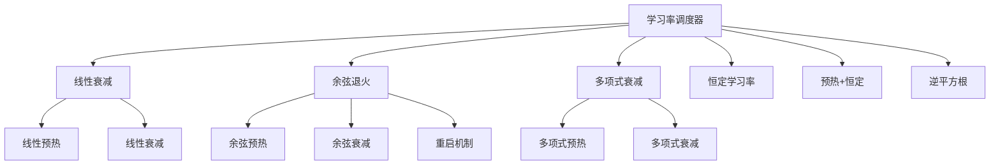

**图表来源**
- [optimization.py](file://src/transformers/optimization.py#L50-L200)

### 线性衰减调度器

线性衰减是最常用的学习率调度策略之一。

#### 实现原理

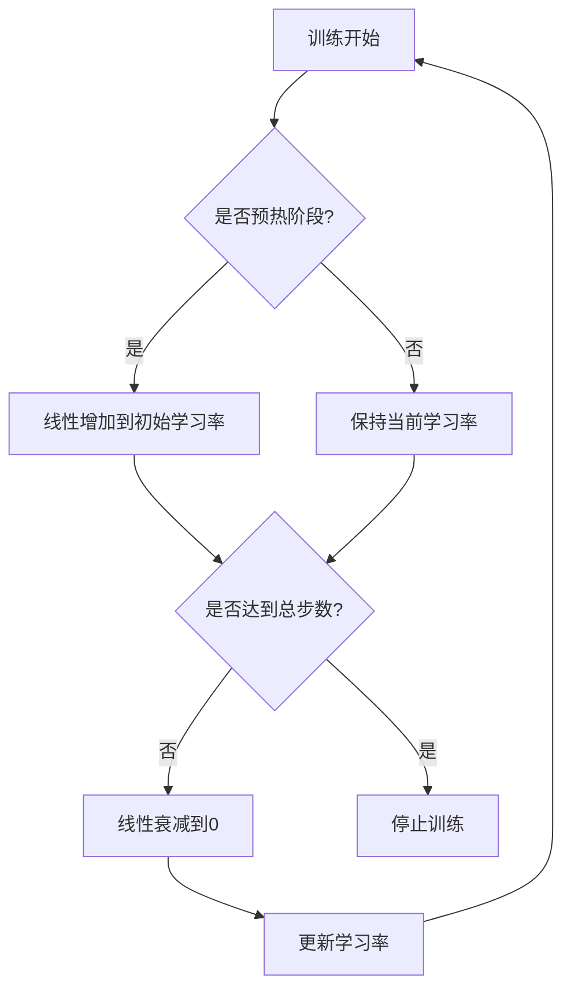

**图表来源**
- [optimization.py](file://src/transformers/optimization.py#L150-L200)

#### 使用场景

- **标准训练任务**：分类、回归等任务
- **中等规模数据集**：需要稳定的学习率变化
- **默认选择**：大多数情况下的首选调度器

### 余弦退火调度器

余弦退火调度器利用余弦函数的周期性特性来调整学习率。

#### 核心公式

学习率变化遵循以下余弦函数：
```
lr(t) = lr_min + (lr_max - lr_min) × (1 + cos(π × t/T)) / 2
```

其中：
- `lr_min`：最小学习率
- `lr_max`：最大学习率（初始学习率）
- `t`：当前训练步数
- `T`：总训练步数

#### 应用优势

- **周期性重启**：有助于跳出局部最优
- **平滑变化**：避免突变导致的训练不稳定
- **理论支持**：有坚实的数学基础

**章节来源**
- [optimization.py](file://src/transformers/optimization.py#L200-L350)

### 预热策略

预热是许多调度器的重要组成部分，特别是在大规模预训练任务中。

#### 预热类型

1. **线性预热**：从0线性增加到初始学习率
2. **余弦预热**：使用余弦函数进行平滑预热
3. **平方根预热**：使用平方根函数预热

#### 预热参数配置

| 参数 | 说明 | 推荐值 |
|------|------|--------|
| `num_warmup_steps` | 预热步数 | 总步数的5-10% |
| `warmup_ratio` | 预热比例 | 0.05-0.1 |
| `warmup_type` | 预热类型 | "linear" |

**章节来源**
- [optimization.py](file://src/transformers/optimization.py#L80-L150)

## 梯度裁剪技术

梯度裁剪是防止训练过程中出现梯度爆炸的重要技术。

### 技术原理

梯度裁剪通过限制梯度的范数来防止训练不稳定：

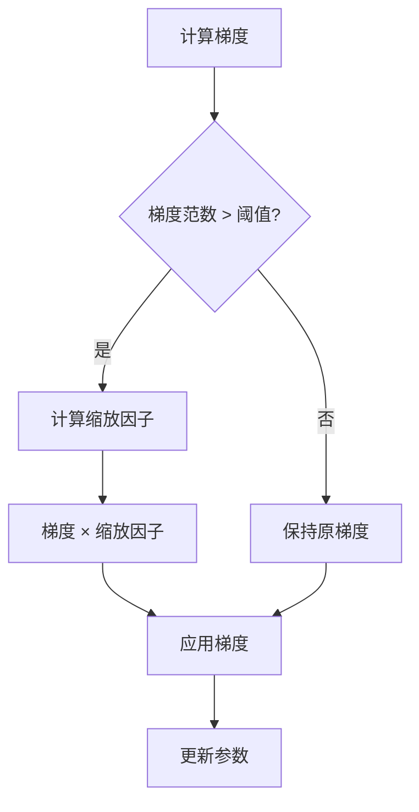

**图表来源**
- [trainer.py](file://src/transformers/trainer.py#L2500-L2530)

### 实现方式

#### 手动梯度裁剪

```python
# 在训练循环中手动应用梯度裁剪
if args.max_grad_norm is not None and args.max_grad_norm > 0:
    grad_norm = torch.nn.utils.clip_grad_norm_(
        model.parameters(), 
        args.max_grad_norm
    )
```

#### 自动梯度裁剪

transformers库提供了自动梯度裁剪功能：

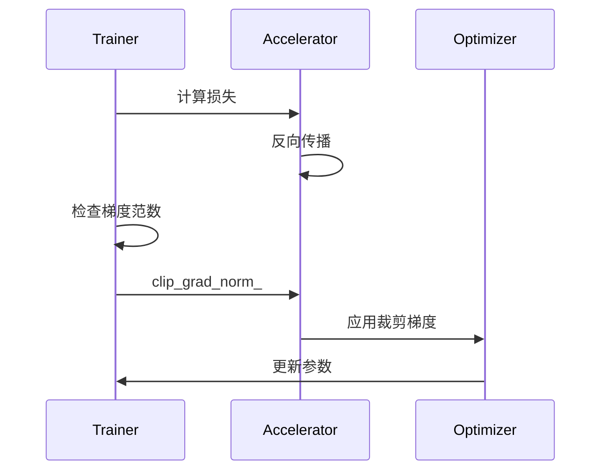

**图表来源**
- [trainer.py](file://src/transformers/trainer.py#L2500-L2550)

### 裁剪参数配置

| 参数 | 默认值 | 说明 |
|------|--------|------|
| `max_grad_norm` | 1.0 | 最大梯度范数 |
| `clip_coef` | 计算得出 | 裁剪系数 |
| `total_norm` | 计算得出 | 当前梯度范数 |

**章节来源**
- [trainer.py](file://src/transformers/trainer.py#L2500-L2550)

## 权重衰减机制

权重衰减是L2正则化的一种实现形式，在AdamW优化器中得到广泛应用。

### 正则化原理

权重衰减通过在损失函数中添加L2惩罚项来防止过拟合：

```
L_total = L_original + λ × ||θ||²₂
```

其中：
- `λ`：权重衰减系数
- `θ`：模型参数
- `||θ||²₂`：L2范数

### 分组权重衰减

transformers库实现了分组权重衰减策略：

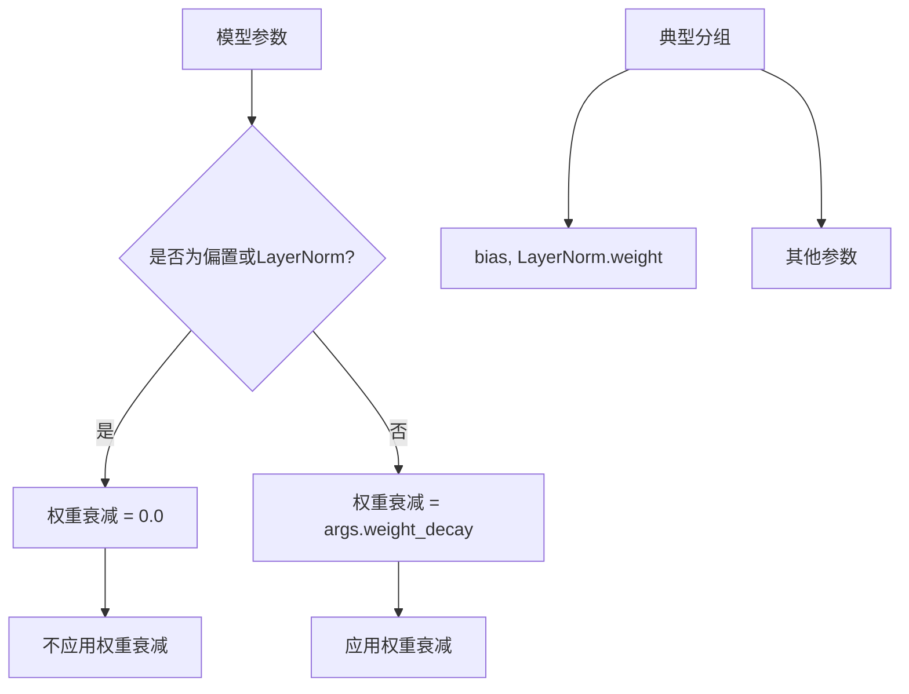

**图表来源**
- [seq2seq_trainer.py](file://examples/legacy/seq2seq/seq2seq_trainer.py#L84-L113)

### 权重衰减配置

| 参数 | 默认值 | 说明 |
|------|--------|------|
| `weight_decay` | 0.0 | 全局权重衰减系数 |
| `no_decay` | ["bias", "LayerNorm.weight"] | 不应用权重衰减的参数名模式 |

### 过拟合预防机制

权重衰减与其他正则化技术协同工作：

1. **权重衰减**：直接限制参数大小
2. **梯度裁剪**：防止梯度爆炸
3. **早停**：基于验证集性能停止训练
4. **数据增强**：增加训练数据多样性

**章节来源**
- [seq2seq_trainer.py](file://examples/legacy/seq2seq/seq2seq_trainer.py#L84-L113)
- [trainer.py](file://src/transformers/trainer.py#L1400-L1450)

## 训练循环集成

在实际训练中，各种优化技术需要正确集成到训练循环中。

### 完整训练流程

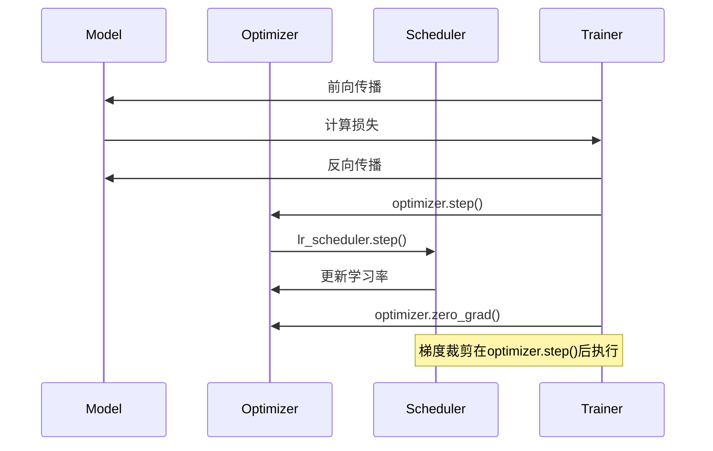

**图表来源**
- [trainer.py](file://src/transformers/trainer.py#L2500-L2550)

### 优化器创建流程

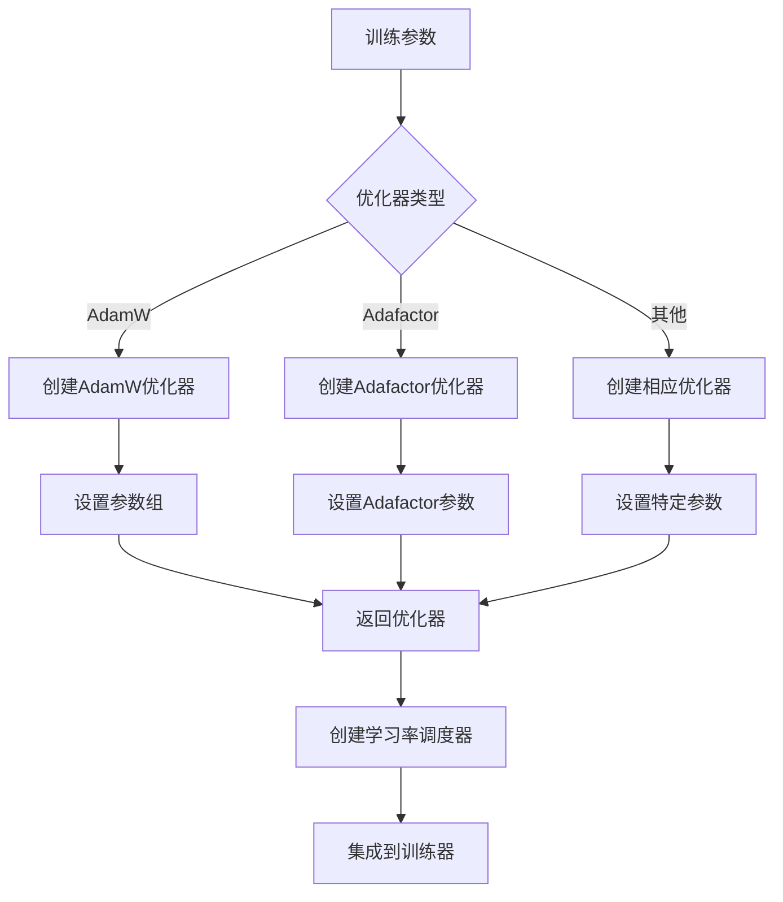

**图表来源**
- [trainer.py](file://src/transformers/trainer.py#L1400-L1750)

### 训练循环实现

以下是典型的训练循环实现：

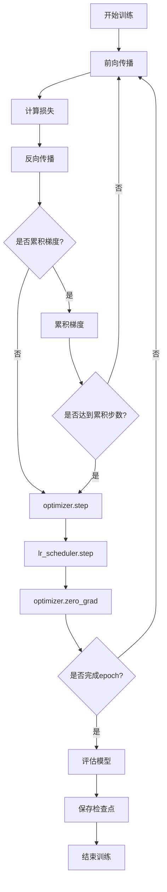

**图表来源**
- [run_glue_no_trainer.py](file://examples/pytorch/text-classification/run_glue_no_trainer.py#L550-L650)

**章节来源**
- [trainer.py](file://src/transformers/trainer.py#L2500-L2600)
- [run_glue_no_trainer.py](file://examples/pytorch/text-classification/run_glue_no_trainer.py#L500-L650)

## 性能分析与调优

### 训练稳定性分析

不同优化技术对训练稳定性的影响：

| 优化技术 | 稳定性 | 收敛速度 | 内存使用 | 适用场景 |
|----------|--------|----------|----------|----------|
| AdamW | 高 | 中等 | 中等 | 通用任务 |
| Adafactor | 高 | 快 | 低 | 大模型训练 |
| AdamW + 预热 | 很高 | 快 | 中等 | 大规模预训练 |
| AdamW + 余弦退火 | 高 | 快 | 中等 | 验证集调优 |

### 超参数调优策略

#### 学习率调优

1. **学习率范围测试**：确定合适的学习率范围
2. **学习率衰减**：选择合适的衰减策略
3. **预热策略**：根据数据规模设置预热步数

#### 权重衰减调优

1. **交叉验证**：在验证集上测试不同权重衰减值
2. **正则化路径**：观察训练和验证损失的关系
3. **早停结合**：与早停策略配合使用

### 性能监控指标

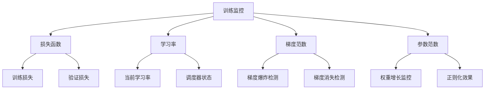

**章节来源**
- [trainer.py](file://src/transformers/trainer.py#L2500-L2600)

## 故障排除指南

### 常见问题及解决方案

#### 训练不稳定

**症状**：损失函数震荡，训练无法收敛

**可能原因**：
- 学习率过高
- 梯度未正确裁剪
- 数据批次大小不合适

**解决方案**：
1. 降低学习率
2. 增加梯度裁剪阈值
3. 调整批次大小

#### 收敛缓慢

**症状**：训练进度缓慢，需要大量训练时间

**可能原因**：
- 学习率过低
- 权重衰减过大
- 预热不足

**解决方案**：
1. 提高学习率
2. 减小权重衰减系数
3. 增加预热步数

#### 过拟合

**症状**：训练损失持续下降，但验证损失上升

**可能原因**：
- 权重衰减不足
- 数据量不足
- 模型过于复杂

**解决方案**：
1. 增加权重衰减
2. 增加训练数据
3. 简化模型结构

### 调试工具和技巧

#### 梯度监控

```python
# 监控梯度范数
def monitor_gradients(model):
    total_norm = 0
    for p in model.parameters():
        if p.grad is not None:
            param_norm = p.grad.data.norm(2)
            total_norm += param_norm.item() ** 2
    total_norm = total_norm ** (1. / 2)
    return total_norm
```

#### 学习率分析

```python
# 分析学习率变化
def analyze_learning_rate(optimizer, scheduler):
    initial_lr = optimizer.param_groups[0]['lr']
    final_lr = scheduler.get_last_lr()[0]
    print(f"初始学习率: {initial_lr}")
    print(f"最终学习率: {final_lr}")
    print(f"学习率变化: {final_lr/initial_lr:.2f}x")
```

**章节来源**
- [test_optimization.py](file://tests/optimization/test_optimization.py#L85-L120)

## 总结

基础优化技术是深度学习训练的核心组件，合理配置和使用这些技术对于获得良好的模型性能至关重要。本文档详细介绍了transformers库中提供的优化技术：

1. **AdamW优化器**：通用性强，配置灵活，适合大多数训练任务
2. **Adafactor优化器**：内存高效，适合大模型训练
3. **多样化学习率调度器**：从简单的线性衰减到复杂的余弦退火
4. **梯度裁剪技术**：防止梯度爆炸，提高训练稳定性
5. **权重衰减机制**：有效的正则化手段，防止过拟合

在实际应用中，建议根据具体任务特点选择合适的优化技术组合，并通过充分的实验来确定最佳配置。同时，建立完善的监控体系，及时发现和解决训练过程中的问题。

通过掌握这些基础优化技术，开发者可以更好地理解和控制模型的训练过程，从而获得更高质量的机器学习模型。