# 高级优化技术

<cite>
**本文档引用的文件**
- [trainer.py](file://src/transformers/trainer.py)
- [training_args.py](file://src/transformers/training_args.py)
- [3D_parallel.py](file://examples/3D_parallel.py)
- [deepspeed.py](file://src/transformers/integrations/deepspeed.py)
- [accelerate.py](file://src/transformers/integrations/accelerate.py)
- [optimization.py](file://src/transformers/optimization.py)
- [tensor_parallel.py](file://src/transformers/integrations/tensor_parallel.py)
- [fsdp.py](file://src/transformers/integrations/fsdp.py)
- [modeling_utils.py](file://src/transformers/modeling_utils.py)
- [trainer_pt_utils.py](file://src/transformers/trainer_pt_utils.py)
</cite>

## 目录
1. [简介](#简介)
2. [混合精度训练](#混合精度训练)
3. [分布式训练策略](#分布式训练策略)
4. [梯度累积技术](#梯度累积技术)
5. [批处理优化](#批处理优化)
6. [梯度检查点](#梯度检查点)
7. [编译优化](#编译优化)
8. [性能监控与调优](#性能监控与调优)
9. [最佳实践指南](#最佳实践指南)
10. [总结](#总结)

## 简介

深度学习模型训练面临着计算资源、内存限制和训练时间的挑战。高级优化技术能够显著提升训练效率，减少资源消耗，并改善模型性能。本章将深入探讨transformers库中实现的各种高级优化技术，包括混合精度训练、分布式训练、梯度累积等核心技术。

## 混合精度训练

### 自动混合精度原理

混合精度训练通过在不同层使用不同的数值精度来平衡训练稳定性和计算效率。transformers库提供了完整的混合精度支持，包括FP16和BF16两种精度格式。

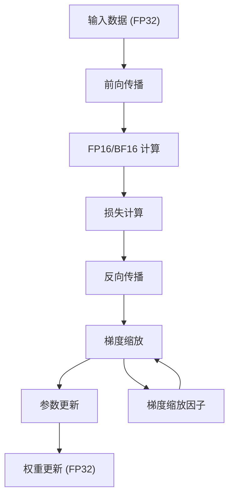

**图表来源**
- [trainer.py](file://src/transformers/trainer.py#L3353-L3398)
- [training_args.py](file://src/transformers/training_args.py#L400-L450)

### 混合精度配置

在TrainingArguments中配置混合精度训练：

| 参数 | 类型 | 默认值 | 描述 |
|------|------|--------|------|
| `fp16` | bool | False | 启用FP16混合精度训练 |
| `bf16` | bool | False | 启用BF16混合精度训练 |
| `fp16_full_eval` | bool | False | 评估时使用FP16精度 |
| `bf16_full_eval` | bool | False | 评估时使用BF16精度 |

### 梯度缩放机制

混合精度训练中的梯度缩放是防止梯度下溢的关键技术：

```mermaid
sequenceDiagram
participant Forward as 前向传播
participant Loss as 损失计算
participant Backward as 反向传播
participant Scale as 梯度缩放
participant Opt as 优化器
Forward->>Loss : FP16计算
Loss->>Backward : FP16梯度
Backward->>Scale : 缩放梯度
Note over Scale : scale = scale * grad_scale
Scale->>Opt : 放大后的梯度
Opt->>Opt : 参数更新
Opt->>Forward : 更新完成
```

**图表来源**
- [trainer.py](file://src/transformers/trainer.py#L3353-L3398)

**章节来源**
- [trainer.py](file://src/transformers/trainer.py#L3353-L3398)
- [training_args.py](file://src/transformers/training_args.py#L400-L450)

## 分布式训练策略

### 数据并行训练

数据并行是最常用的分布式训练策略，通过将批次数据分发到多个设备来加速训练过程。

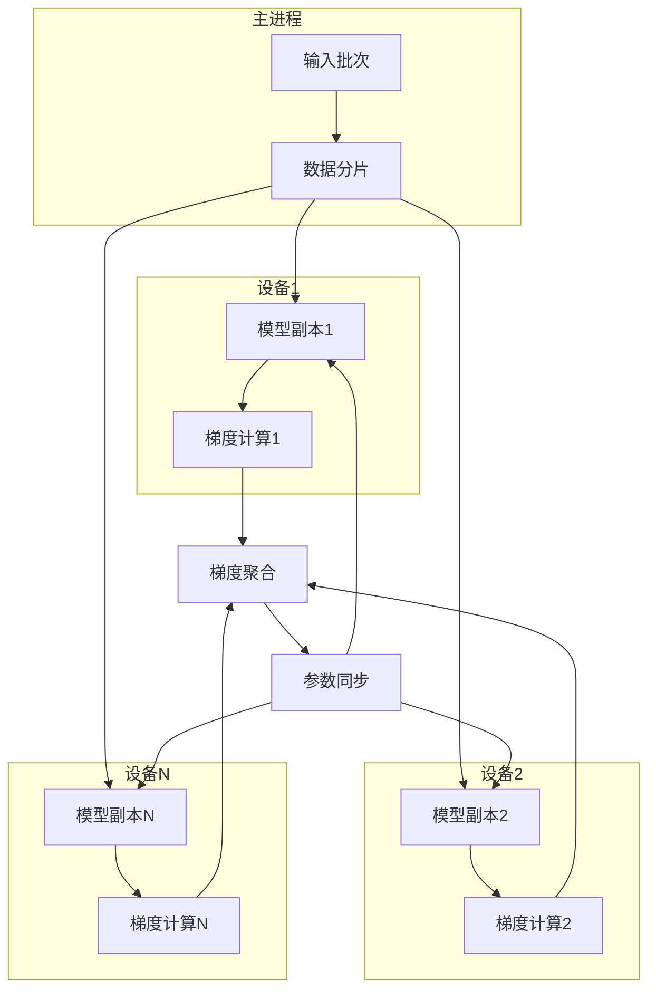

**图表来源**
- [trainer.py](file://src/transformers/trainer.py#L200-L300)
- [accelerate.py](file://src/transformers/integrations/accelerate.py#L200-L300)

### 模型并行策略

模型并行将大型模型分割到多个设备上，适用于超出单个设备内存限制的模型。

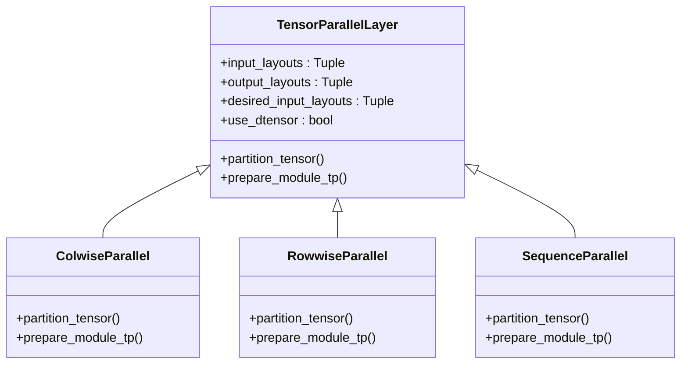

**图表来源**
- [tensor_parallel.py](file://src/transformers/integrations/tensor_parallel.py#L495-L523)
- [tensor_parallel.py](file://src/transformers/integrations/tensor_parallel.py#L919-L960)

### 流水线并行

流水线并行将模型的不同层分配到不同的设备，通过流水线方式处理批次数据。

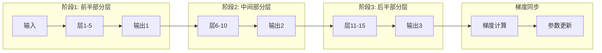

**图表来源**
- [3D_parallel.py](file://examples/3D_parallel.py#L50-L100)

### FSDP完全分片数据并行

Fully Sharded Data Parallel (FSDP) 将模型参数、梯度和优化器状态完全分片到多个设备上。

| FSDP选项 | 描述 | 内存节省 |
|----------|------|----------|
| `full_shard` | 完全分片参数、梯度和优化器状态 | 最大 |
| `shard_grad_op` | 分片梯度和优化器状态 | 中等 |
| `hybrid_shard` | 节点内完全分片，跨节点复制参数 | 平衡 |
| `offload` | 将参数和梯度卸载到CPU | 显著 |

**章节来源**
- [3D_parallel.py](file://examples/3D_parallel.py#L50-L150)
- [fsdp.py](file://src/transformers/integrations/fsdp.py#L1-L100)
- [tensor_parallel.py](file://src/transformers/integrations/tensor_parallel.py#L495-L523)

## 梯度累积技术

### 梯度累积原理

梯度累积允许使用比物理内存更大的有效批次大小，通过累积多个小批次的梯度来模拟大批次训练。

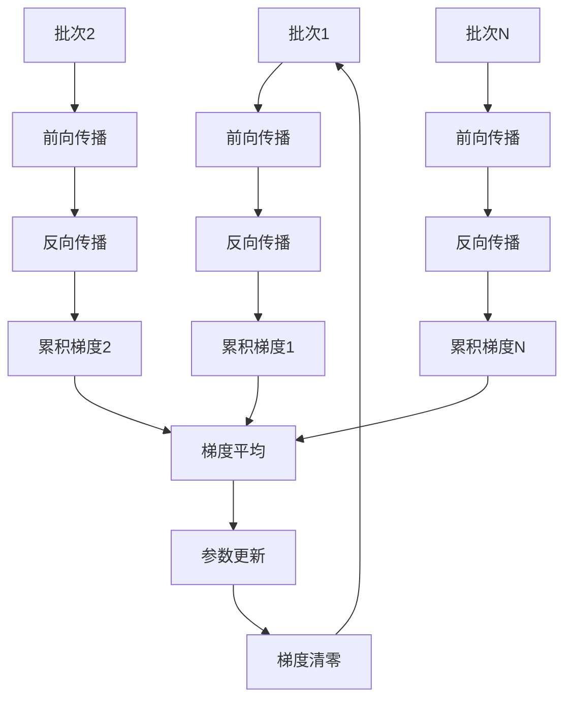

**图表来源**
- [trainer.py](file://src/transformers/trainer.py#L1367-L1394)

### 梯度累积配置

在TrainingArguments中配置梯度累积：

| 参数 | 类型 | 默认值 | 描述 |
|------|------|--------|------|
| `gradient_accumulation_steps` | int | 1 | 梯度累积步数 |
| `per_device_train_batch_size` | int | 8 | 每设备训练批次大小 |

### 梯度累积的优势

1. **内存效率**: 允许使用更大的批次大小而不增加内存需求
2. **训练稳定性**: 更大的有效批次大小有助于更好的收敛
3. **硬件利用率**: 充分利用多GPU资源

**章节来源**
- [trainer.py](file://src/transformers/trainer.py#L1367-L1394)
- [training_args.py](file://src/transformers/training_args.py#L200-L250)

## 批处理优化

### 动态批处理

动态批处理根据序列长度调整批次大小，最大化GPU利用率。

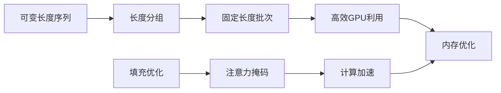

**图表来源**
- [trainer_pt_utils.py](file://src/transformers/trainer_pt_utils.py#L1187-L1227)

### 自动批处理大小查找

transformers提供了自动查找最优批处理大小的功能：

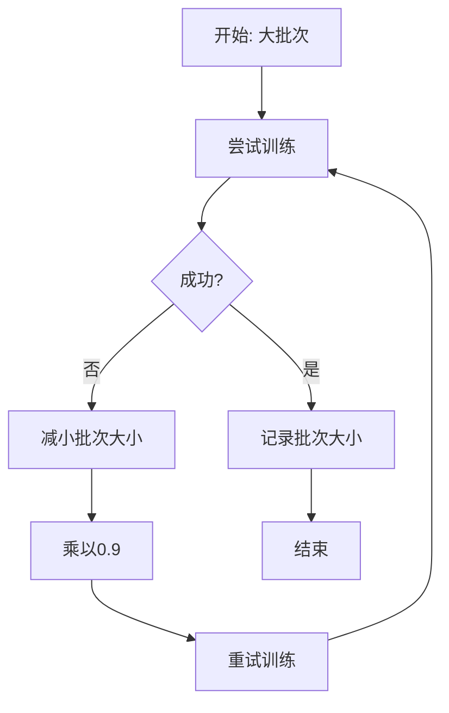

**图表来源**
- [trainer_utils.py](file://src/transformers/trainer_utils.py#L764-L792)

### 批处理优化策略

| 策略 | 适用场景 | 性能影响 |
|------|----------|----------|
| 固定长度批处理 | 序列长度相似 | 高GPU利用率 |
| 动态批处理 | 序列长度差异大 | 内存效率高 |
| 混合长度批处理 | 多样化任务 | 平衡性能和内存 |

**章节来源**
- [trainer_utils.py](file://src/transformers/trainer_utils.py#L764-L792)
- [trainer_pt_utils.py](file://src/transformers/trainer_pt_utils.py#L1187-L1227)

## 梯度检查点

### 梯度检查点原理

梯度检查点通过牺牲计算时间来换取内存空间，只保存部分中间激活值，在反向传播时重新计算。

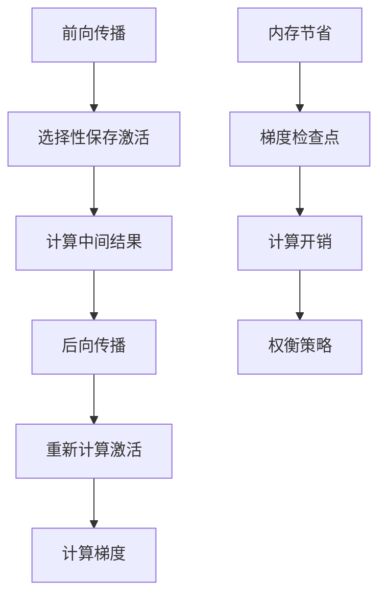

**图表来源**
- [modeling_utils.py](file://src/transformers/modeling_utils.py#L3376-L3389)

### 梯度检查点配置

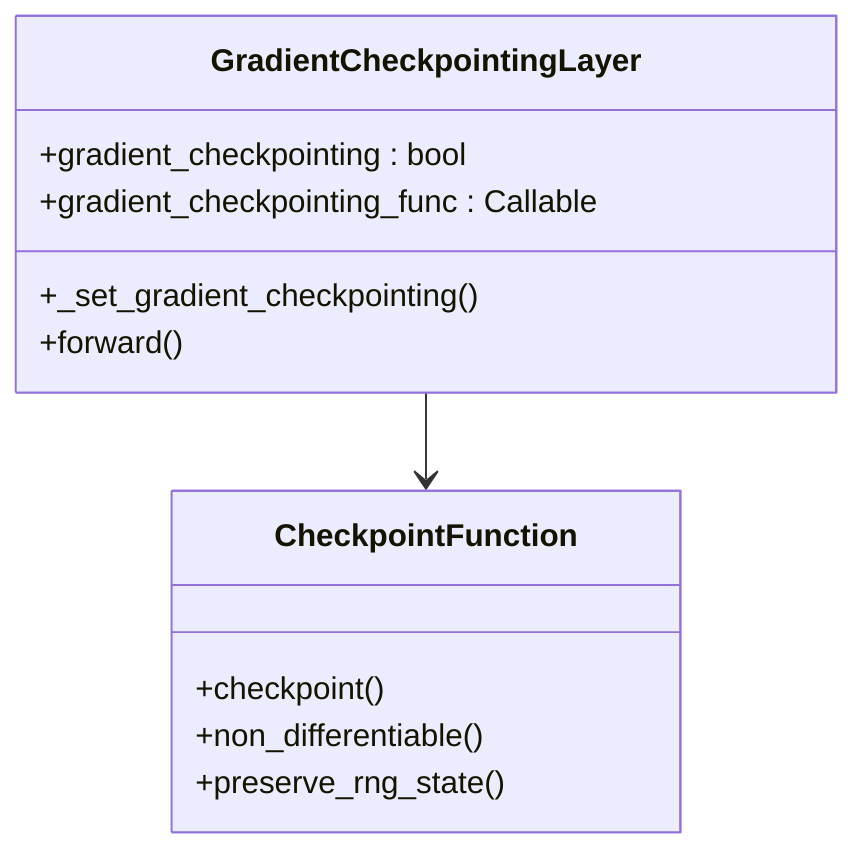

**图表来源**
- [modeling_utils.py](file://src/transformers/modeling_utils.py#L3376-L3389)

### 梯度检查点优势

1. **内存节省**: 显著减少激活值存储需求
2. **可扩展性**: 允许训练更大模型
3. **灵活性**: 可以选择性地应用到特定层

**章节来源**
- [modeling_utils.py](file://src/transformers/modeling_utils.py#L3376-L3389)

## 编译优化

### PyTorch编译集成

transformers集成了PyTorch 2.0的编译功能，提供自动图优化和性能提升。

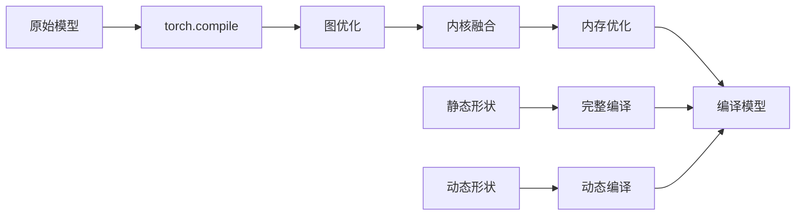

**图表来源**
- [modeling_utils.py](file://src/transformers/modeling_utils.py#L5056-L5076)

### 编译配置选项

| 参数 | 类型 | 默认值 | 描述 |
|------|------|--------|------|
| `torch_compile` | bool | False | 启用torch.compile |
| `torch_compile_backend` | str | "inductor" | 编译后端 |
| `torch_compile_mode` | str | "reduce-overhead" | 编译模式 |
| `torch_compile_fullgraph` | bool | False | 强制完整图编译 |

### 编译优化效果

1. **计算加速**: 图优化和内核融合
2. **内存优化**: 减少临时张量分配
3. **启动时间**: 预编译避免运行时编译

**章节来源**
- [modeling_utils.py](file://src/transformers/modeling_utils.py#L5056-L5076)
- [training_args.py](file://src/transformers/training_args.py#L1589-L1614)

## 性能监控与调优

### 训练性能指标

监控关键性能指标对于优化训练过程至关重要：

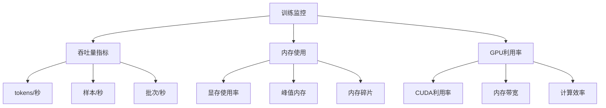

### 性能调优策略

| 策略 | 适用场景 | 效果 |
|------|----------|------|
| 混合精度 | 大模型训练 | 内存减少50%，速度提升1.5-2x |
| 分布式训练 | 超大模型 | 线性扩展性能 |
| 梯度累积 | 内存受限 | 实现大批次训练 |
| 动态批处理 | 不规则序列 | 提升GPU利用率 |
| 梯度检查点 | 内存严重不足 | 内存节省70-90% |

### 调优工具和技巧

1. **内存分析**: 使用torch.profiler监控内存使用
2. **性能分析**: 分析计算瓶颈和通信开销
3. **超参数调优**: 自动化超参数搜索
4. **硬件适配**: 根据硬件特性调整配置

## 最佳实践指南

### 混合精度训练最佳实践

1. **选择合适的精度格式**:
   - 新一代GPU推荐使用BF16
   - 传统GPU考虑使用FP16
   - 注意数值稳定性问题

2. **梯度缩放策略**:
   - 使用动态缩放避免梯度下溢
   - 监控缩放因子变化
   - 调整初始缩放比例

### 分布式训练最佳实践

1. **通信优化**:
   - 选择合适的通信后端
   - 优化网络拓扑
   - 减少通信频率

2. **负载均衡**:
   - 均匀分配计算负载
   - 避免通信瓶颈
   - 监控各设备利用率

### 梯度累积最佳实践

1. **批次大小选择**:
   - 基于内存容量确定目标批次大小
   - 计算所需的累积步数
   - 考虑模型收敛特性

2. **学习率调整**:
   - 根据有效批次大小调整学习率
   - 使用学习率预热策略
   - 监控训练稳定性

### 性能优化组合

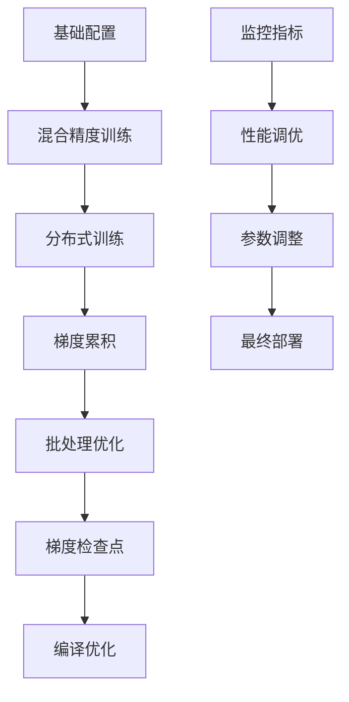

### 常见问题解决

1. **内存不足**:
   - 启用梯度检查点
   - 使用FSDP进行参数分片
   - 减少批次大小或累积步数

2. **训练不稳定**:
   - 调整学习率和预热策略
   - 检查梯度缩放设置
   - 验证混合精度配置

3. **性能瓶颈**:
   - 分析计算和通信比例
   - 优化数据加载流程
   - 调整并行策略

## 总结

高级优化技术是现代深度学习训练的核心组成部分。通过合理运用混合精度训练、分布式训练、梯度累积等技术，可以显著提升训练效率，降低资源消耗，并支持更大规模的模型训练。

transformers库提供了完整的高级优化技术支持，从简单的混合精度配置到复杂的分布式训练策略，都有一站式的解决方案。掌握这些技术不仅能够提高训练效率，还能为大规模模型训练奠定坚实的基础。

在实际应用中，需要根据具体的硬件环境、模型规模和任务特性选择合适的优化策略，并通过持续的监控和调优来达到最佳性能。随着硬件技术的发展和算法的进步，这些优化技术也在不断演进，为深度学习训练带来更多的可能性。