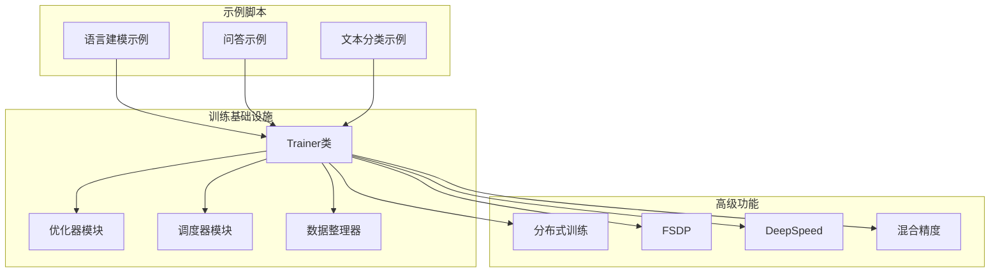
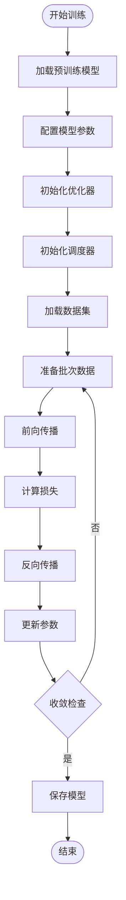
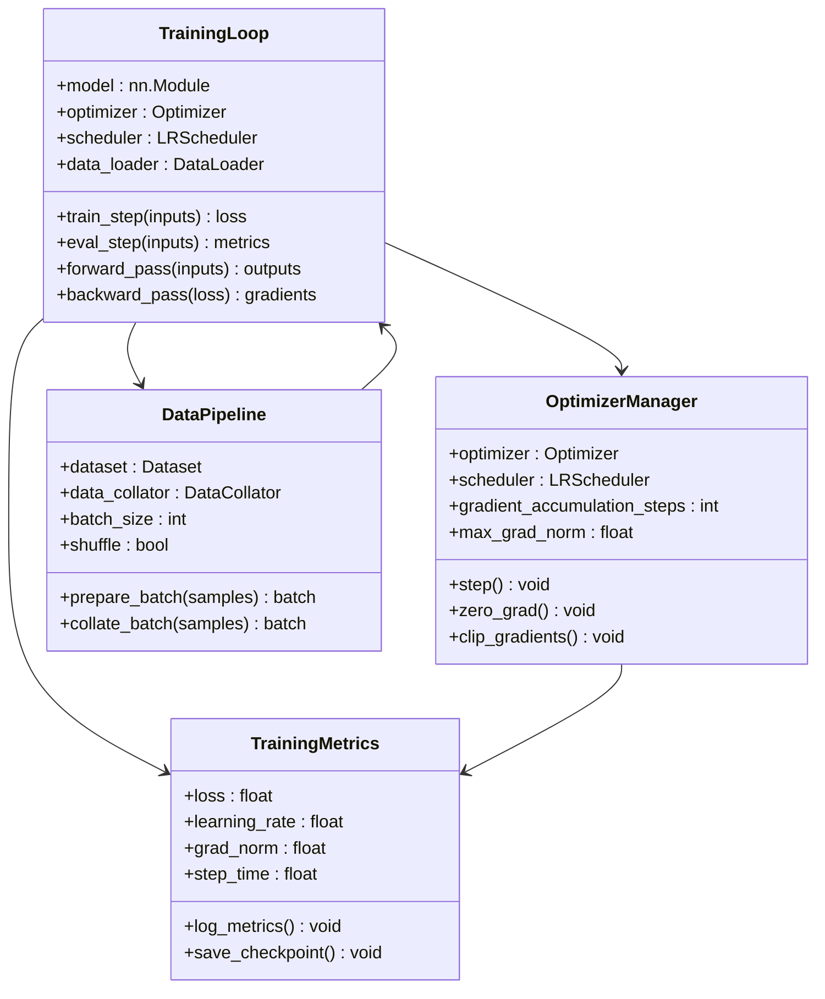
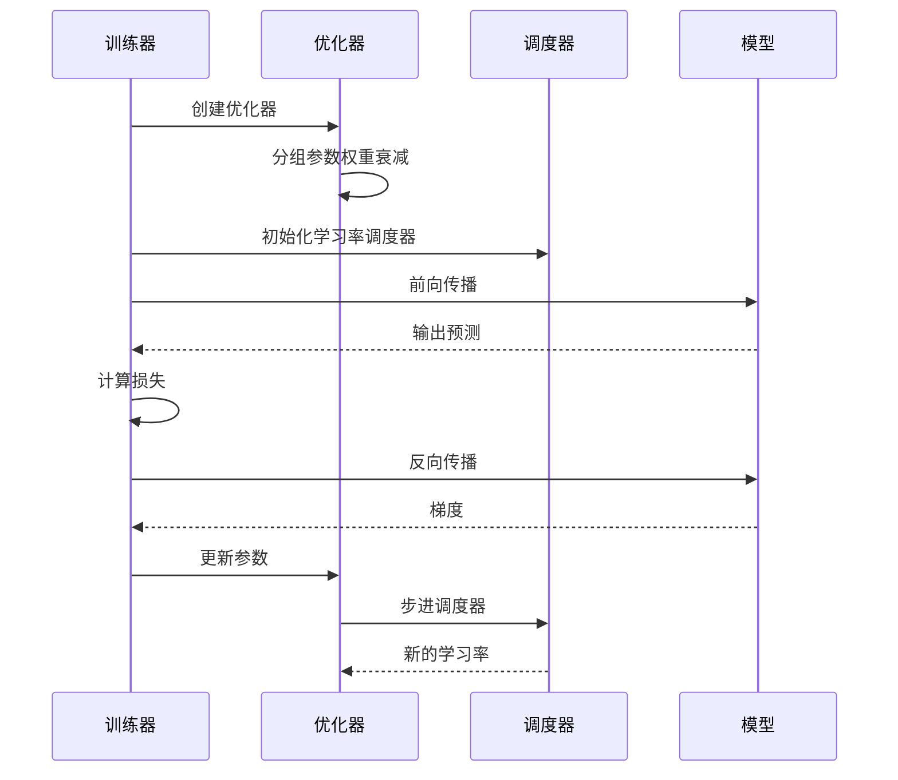
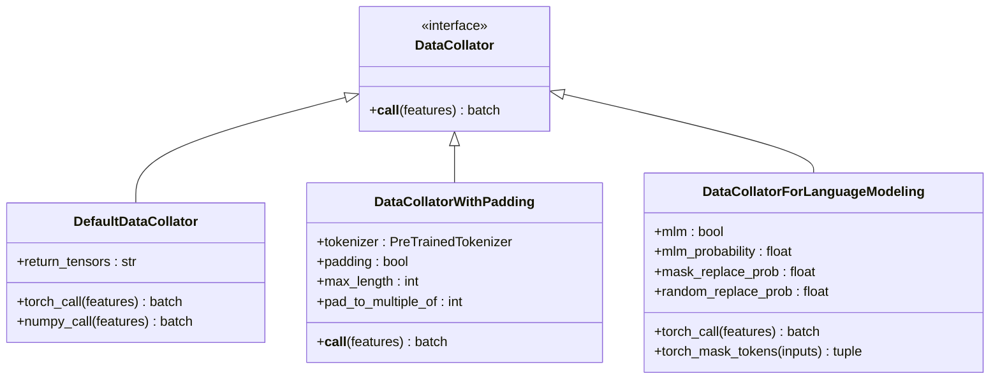
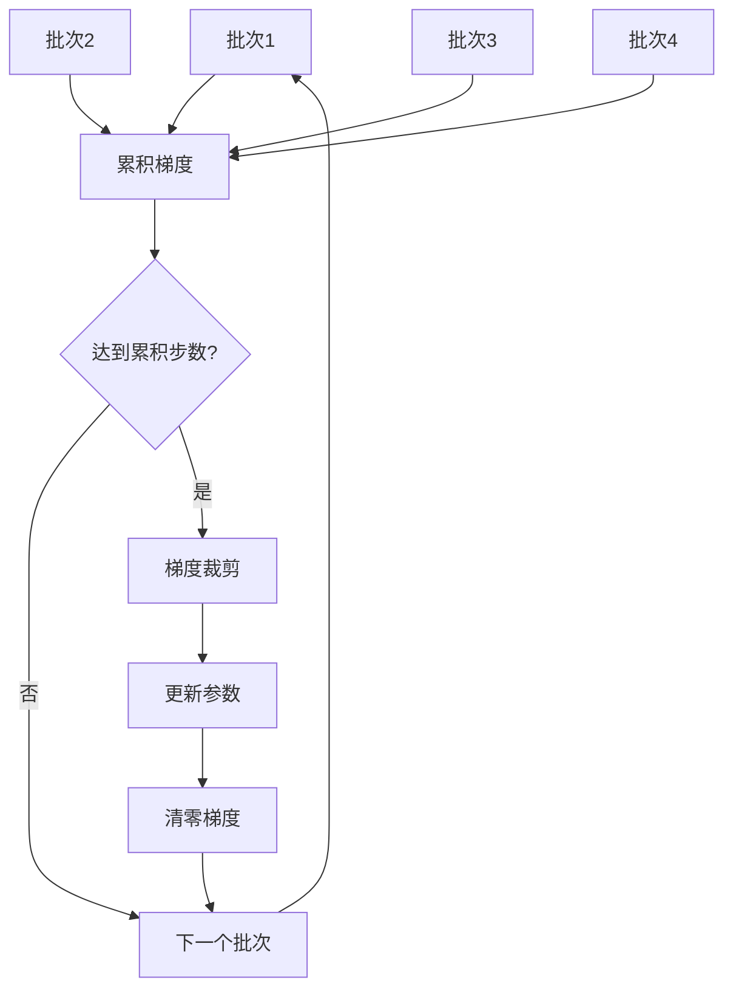
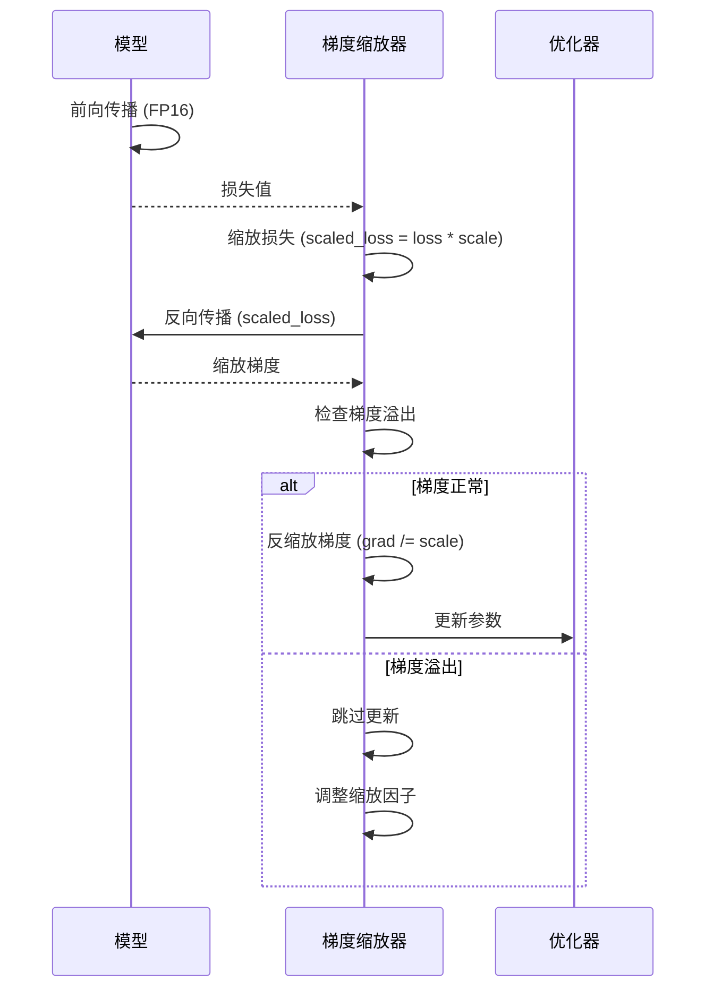
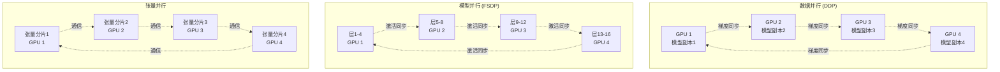
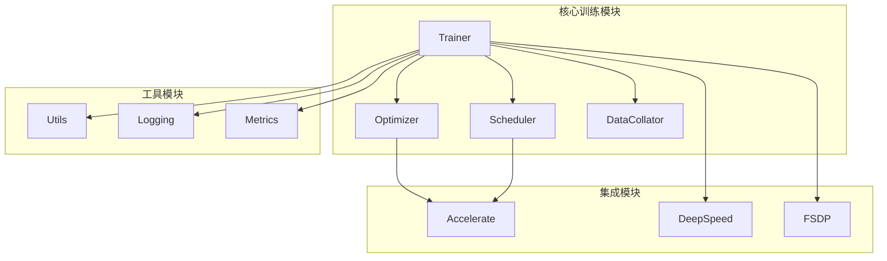

# 自定义训练

<cite>
**本文档中引用的文件**
- [trainer.py](file://src/transformers/trainer.py)
- [optimization.py](file://src/transformers/optimization.py)
- [data_collator.py](file://src/transformers/data/data_collator.py)
- [run_clm.py](file://examples/pytorch/language-modeling/run_clm.py)
- [run_qa.py](file://examples/pytorch/question-answering/run_qa.py)
- [3D_parallel.py](file://examples/3D_parallel.py)
- [trainer_pt_utils.py](file://src/transformers/trainer_pt_utils.py)
</cite>

## 目录
1. [简介](#简介)
2. [项目结构概览](#项目结构概览)
3. [核心组件分析](#核心组件分析)
4. [架构概览](#架构概览)
5. [详细组件分析](#详细组件分析)
6. [依赖关系分析](#依赖关系分析)
7. [性能考虑](#性能考虑)
8. [故障排除指南](#故障排除指南)
9. [结论](#结论)

## 简介

本文档深入介绍了如何在不使用Trainer API的情况下实现模型训练，专注于PyTorch原生训练循环的构建。我们将详细讲解模型初始化、优化器配置、学习率调度器设置以及训练/评估循环的实现，并提供针对不同任务类型（文本分类、语言建模、问答等）的完整代码示例。

通过本指南，您将学会：
- 构建自定义训练循环的核心技术
- 处理各种任务类型的数据加载和批处理
- 实现梯度累积、混合精度训练和分布式训练
- 应用最佳实践进行性能优化

## 项目结构概览

Transformers库提供了丰富的训练基础设施，支持多种训练模式和优化策略：

**图表来源**
- [trainer.py](file://src/transformers/trainer.py#L1-L100)
- [optimization.py](file://src/transformers/optimization.py#L1-L50)

## 核心组件分析

### 训练循环核心要素

自定义训练循环包含以下关键组件：

1. **模型初始化与配置**
2. **优化器与调度器设置**
3. **数据加载与批处理**
4. **前向传播与损失计算**
5. **反向传播与参数更新**
6. **梯度累积与裁剪**
7. **评估与监控**

### 模型初始化策略

**节来源**
- [trainer.py](file://src/transformers/trainer.py#L1187-L1216)
- [optimization.py](file://src/transformers/optimization.py#L104-L128)

## 架构概览

### 训练系统架构

**图表来源**
- [trainer.py](file://src/transformers/trainer.py#L250-L350)
- [optimization.py](file://src/transformers/optimization.py#L40-L80)

## 详细组件分析

### 优化器配置与管理

#### AdamW优化器实现

**图表来源**
- [trainer.py](file://src/transformers/trainer.py#L84-L113)
- [optimization.py](file://src/transformers/optimization.py#L104-L128)

#### 学习率调度器类型

| 调度器类型 | 描述 | 使用场景 |
|-----------|------|----------|
| Linear | 线性衰减 | 标准训练任务 |
| Cosine | 余弦衰减 | 需要平滑学习率变化 |
| Constant | 固定学习率 | 特殊需求或调试 |
| Warmup | 预热+衰减 | 大多数训练场景 |
| ReduceLROnPlateau | 基于指标调整 | 验证集性能监控 |

**节来源**
- [optimization.py](file://src/transformers/optimization.py#L578-L601)

### 数据加载与批处理

#### 数据整理器设计模式

**图表来源**
- [data_collator.py](file://src/transformers/data/data_collator.py#L200-L300)

#### 不同任务类型的数据处理

| 任务类型 | 数据整理器 | 主要特点 | 示例场景 |
|---------|-----------|----------|----------|
| 文本分类 | DefaultDataCollator | 标准填充 | 情感分析、主题分类 |
| 语言建模 | DataCollatorForLanguageModeling | MLM掩码处理 | 预训练、下游任务 |
| 问答 | DataCollatorForTokenClassification | 标签对齐 | SQuAD、阅读理解 |
| 序列标注 | DataCollatorForTokenClassification | 标签填充 | 命名实体识别 |

**节来源**
- [data_collator.py](file://src/transformers/data/data_collator.py#L400-L500)

### 梯度累积与优化

#### 梯度累积机制

**图表来源**
- [trainer.py](file://src/transformers/trainer.py#L2417-L2437)

#### 混合精度训练

混合精度训练通过使用半精度浮点数来加速训练并减少内存使用：

**图表来源**
- [trainer.py](file://src/transformers/trainer.py#L2507-L2529)

### 分布式训练实现

#### 多GPU训练策略

**图表来源**
- [3D_parallel.py](file://examples/3D_parallel.py#L25-L58)

**节来源**
- [3D_parallel.py](file://examples/3D_parallel.py#L0-L23)

## 依赖关系分析

### 核心依赖关系图

**图表来源**
- [trainer.py](file://src/transformers/trainer.py#L1-L50)
- [optimization.py](file://src/transformers/optimization.py#L1-L20)

**节来源**
- [trainer.py](file://src/transformers/trainer.py#L532-L556)

## 性能考虑

### 训练性能优化策略

1. **内存优化**
   - 使用梯度检查点减少内存占用
   - 启用模型并行降低单卡内存压力
   - 利用混合精度训练节省显存

2. **计算优化**
   - 批次大小调优以充分利用硬件
   - 使用编译优化（torch.compile）
   - 启用Flash Attention等高效注意力机制

3. **I/O优化**
   - 使用异步数据加载
   - 实施数据预取策略
   - 优化磁盘读写模式

### 性能监控指标

| 指标类别 | 关键指标 | 监控目的 |
|---------|----------|----------|
| 训练效率 | 样本/秒、GPU利用率 | 评估硬件利用情况 |
| 内存使用 | 显存峰值、内存泄漏检测 | 确保稳定运行 |
| 收敛性能 | 损失曲线、指标变化 | 验证训练效果 |
| 通信开销 | 同步时间、带宽利用率 | 优化分布式性能 |

## 故障排除指南

### 常见问题与解决方案

#### 梯度相关问题

1. **梯度爆炸**
   - 症状：损失值突然变为NaN或无穷大
   - 解决方案：启用梯度裁剪，检查学习率设置

2. **梯度消失**
   - 症状：损失下降缓慢，参数更新微小
   - 解决方案：调整网络架构，使用残差连接

3. **梯度累积错误**
   - 症状：内存不足或参数更新异常
   - 解决方案：正确设置累积步数，确保梯度清零

#### 分布式训练问题

1. **同步失败**
   - 症状：进程间状态不一致
   - 解决方案：检查网络连接，验证通信后端

2. **负载不均衡**
   - 症状：部分GPU利用率低
   - 解决方案：调整批次分配，优化数据分布

3. **内存同步问题**
   - 症状：模型参数不同步
   - 解决方案：使用正确的同步策略

**节来源**
- [trainer.py](file://src/transformers/trainer.py#L2531-L2550)

### 调试技巧

1. **启用详细日志**：设置适当的日志级别以获取更多信息
2. **使用检查点**：定期保存模型状态以便恢复
3. **监控指标**：实时跟踪关键性能指标
4. **可视化分析**：使用TensorBoard等工具可视化训练过程

## 结论

通过本文档，我们深入了解了如何构建自定义训练循环，涵盖了从基础概念到高级优化技术的完整知识体系。关键要点包括：

1. **灵活的架构设计**：自定义训练循环提供了最大的灵活性，允许开发者精确控制训练过程的每个环节。

2. **多样化的优化策略**：从简单的SGD到复杂的分布式训练，各种优化技术可以按需组合使用。

3. **任务适配能力**：针对不同NLP任务的数据处理和模型配置策略，确保最佳的训练效果。

4. **性能优化空间**：通过混合精度、梯度累积等技术，可以在保持模型质量的同时显著提升训练效率。

掌握这些核心技术将使您能够：
- 开发定制化的训练流程
- 优化大规模模型的训练效率
- 应对各种复杂的训练场景
- 实现最先进的训练技术

建议读者根据具体需求选择合适的训练策略，并持续关注最新的训练技术和最佳实践。