# 分布式训练

<cite>
**本文档引用的文件**
- [distributed_training.py](file://examples/training/distributed_training.py)
- [3D_parallel.py](file://examples/3D_parallel.py)
- [3d_parallel_checks.py](file://examples/pytorch/3d_parallel_checks.py)
- [deepspeed.py](file://src/transformers/integrations/deepspeed.py)
- [fsdp.py](file://src/transformers/integrations/fsdp.py)
- [accelerate.py](file://src/transformers/integrations/accelerate.py)
- [tensor_parallel.py](file://src/transformers/integrations/tensor_parallel.py)
- [tpu.py](file://src/transformers/integrations/tpu.py)
- [training_args.py](file://src/transformers/training_args.py)
- [ds_config_zero2.json](file://tests/deepspeed/ds_config_zero2.json)
- [xla_spawn.py](file://examples/pytorch/xla_spawn.py)
- [test_accelerate_examples.py](file://examples/pytorch/test_accelerate_examples.py)
</cite>

## 目录
1. [简介](#简介)
2. [项目结构概览](#项目结构概览)
3. [核心分布式训练组件](#核心分布式训练组件)
4. [架构概览](#架构概览)
5. [详细组件分析](#详细组件分析)
6. [依赖关系分析](#依赖关系分析)
7. [性能考虑](#性能考虑)
8. [故障排除指南](#故障排除指南)
9. [结论](#结论)

## 简介

分布式训练是现代深度学习中的关键技术，特别是在处理大规模语言模型时。Transformers库提供了全面的分布式训练支持，包括数据并行、模型并行和流水线并行等多种策略。本文档深入介绍了Transformers中实现分布式训练的各种方法，重点涵盖Accelerate库集成、DeepSpeed、FSDP等高级分布式策略的配置和使用。

## 项目结构概览

Transformers的分布式训练功能主要分布在以下关键目录中：

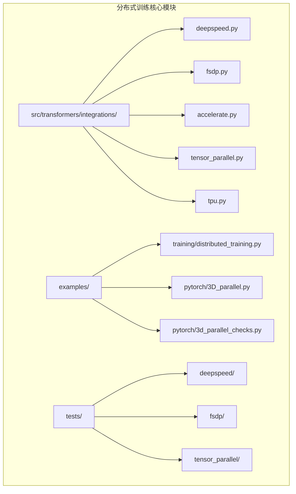

**图表来源**
- [deepspeed.py](file://src/transformers/integrations/deepspeed.py#L1-L50)
- [fsdp.py](file://src/transformers/integrations/fsdp.py#L1-L30)
- [tensor_parallel.py](file://src/transformers/integrations/tensor_parallel.py#L1-L50)

**章节来源**
- [deepspeed.py](file://src/transformers/integrations/deepspeed.py#L1-L100)
- [fsdp.py](file://src/transformers/integrations/fsdp.py#L1-L54)

## 核心分布式训练组件

### 数据并行（Data Parallelism）

数据并行是最常见的分布式训练策略，通过将批次数据分发到多个设备来加速训练过程。

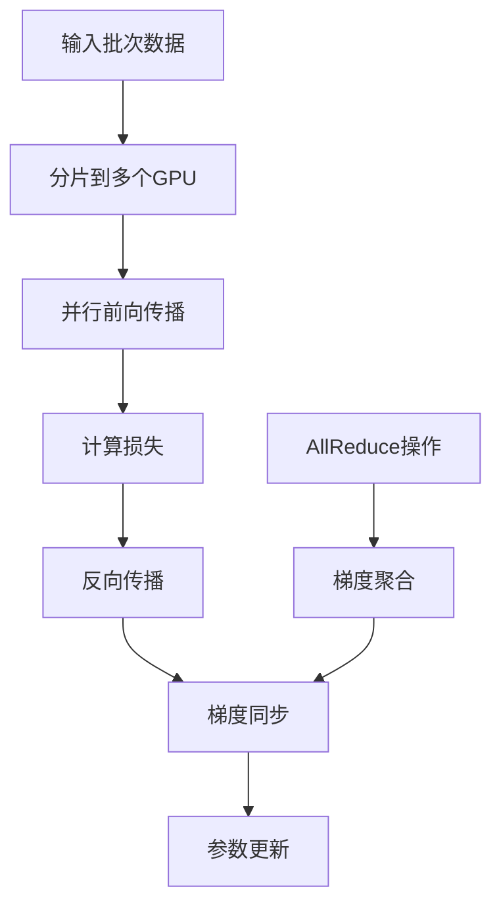

**图表来源**
- [distributed_training.py](file://examples/training/distributed_training.py#L15-L35)

### 模型并行（Model Parallelism）

模型并行将大型模型的不同部分分布到不同的设备上，以适应单个设备的内存限制。

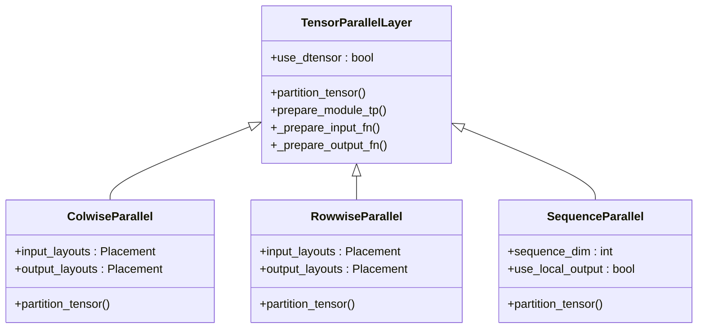

**图表来源**
- [tensor_parallel.py](file://src/transformers/integrations/tensor_parallel.py#L420-L500)

### 流水线并行（Pipeline Parallelism）

流水线并行将模型按层分割，在不同的设备上执行不同的层序列。

**章节来源**
- [tensor_parallel.py](file://src/transformers/integrations/tensor_parallel.py#L420-L800)

## 架构概览

Transformers的分布式训练架构采用分层设计，支持多种并行策略的组合：

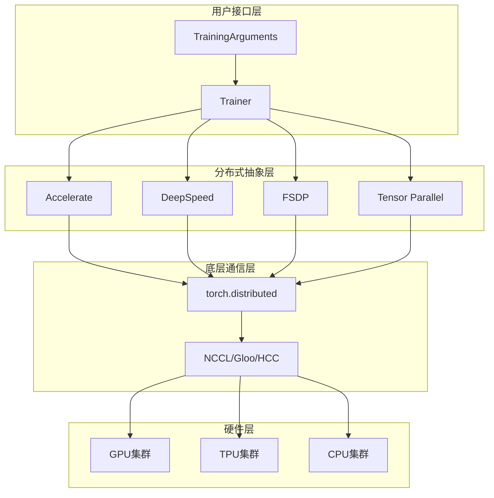

**图表来源**
- [accelerate.py](file://src/transformers/integrations/accelerate.py#L1-L50)
- [deepspeed.py](file://src/transformers/integrations/deepspeed.py#L1-L50)

## 详细组件分析

### DeepSpeed集成

DeepSpeed提供了先进的内存优化和分布式训练功能，特别是ZeRO（Zero Redundancy Optimizer）技术。

#### ZeRO阶段配置

| 阶段 | 内存优化 | 适用场景 | 通信开销 |
|------|----------|----------|----------|
| ZeRO-1 | 优化器状态分片 | 中等规模模型 | 低 |
| ZeRO-2 | 梯度和优化器状态分片 | 大规模模型 | 中等 |
| ZeRO-3 | 参数、梯度和优化器状态分片 | 超大规模模型 | 高 |

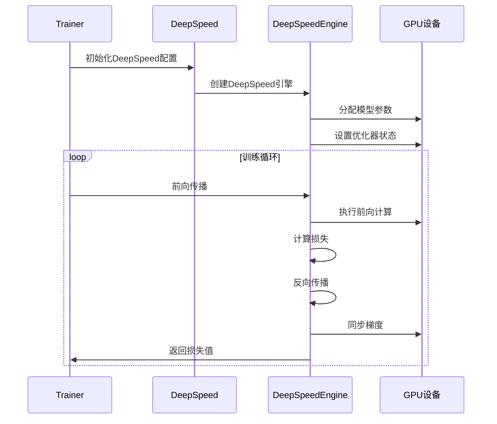

**图表来源**
- [deepspeed.py](file://src/transformers/integrations/deepspeed.py#L400-L485)

**章节来源**
- [deepspeed.py](file://src/transformers/integrations/deepspeed.py#L1-L486)
- [ds_config_zero2.json](file://tests/deepspeed/ds_config_zero2.json#L1-L55)

### Accelerate库集成

Accelerate提供了统一的分布式训练接口，简化了多GPU和TPU的配置。

#### 设备映射策略

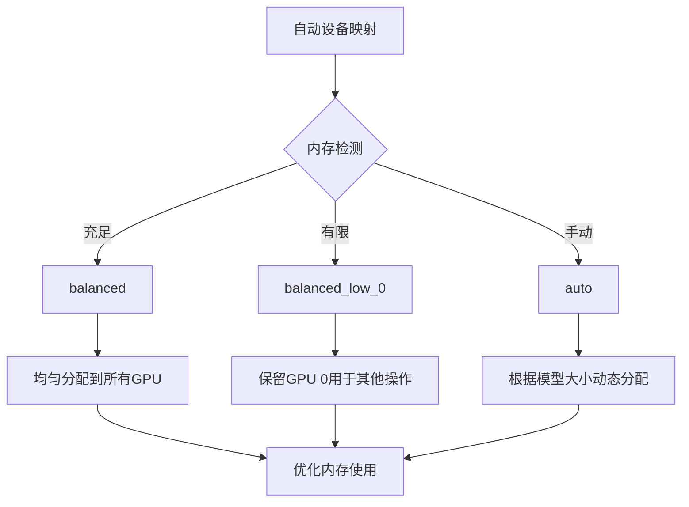

**图表来源**
- [accelerate.py](file://src/transformers/integrations/accelerate.py#L300-L400)

**章节来源**
- [accelerate.py](file://src/transformers/integrations/accelerate.py#L1-L558)

### 张量并行实现

张量并行通过在多个设备间分割权重矩阵来实现模型并行。

#### 并行策略类型

| 策略 | 描述 | 适用层 | 通信模式 |
|------|------|--------|----------|
| ColwiseParallel | 列方向分割权重矩阵 | Linear层 | AllGather |
| RowwiseParallel | 行方向分割权重矩阵 | Linear层 | ReduceScatter |
| SequenceParallel | 序列维度并行 | LayerNorm等 | Replication |

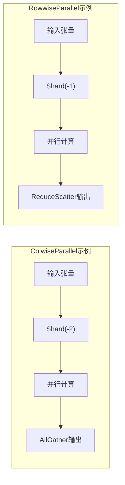

**图表来源**
- [tensor_parallel.py](file://src/transformers/integrations/tensor_parallel.py#L700-L800)

**章节来源**
- [tensor_parallel.py](file://src/transformers/integrations/tensor_parallel.py#L1-L1140)

### TPU支持

Transformers提供了对TPU的原生支持，通过PyTorch/XLA实现。

#### TPU配置流程

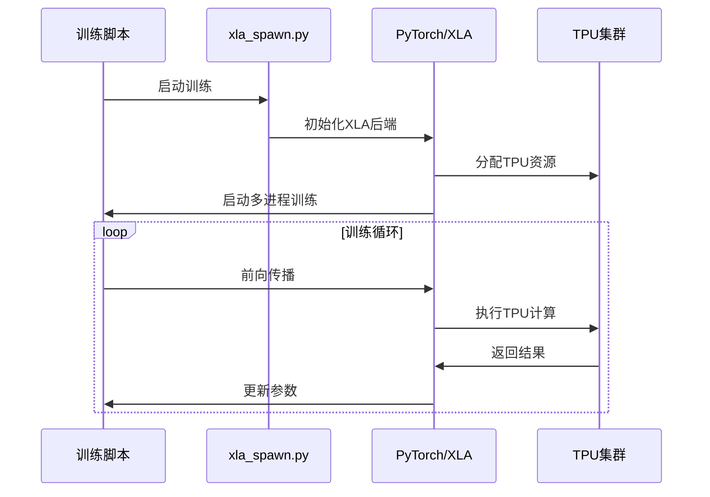

**图表来源**
- [xla_spawn.py](file://examples/pytorch/xla_spawn.py#L44-L81)

**章节来源**
- [tpu.py](file://src/transformers/integrations/tpu.py#L1-L37)
- [xla_spawn.py](file://examples/pytorch/xla_spawn.py#L1-L81)

### 3D并行训练

3D并行结合了数据并行、张量并行和流水线并行，实现最高效的分布式训练。

#### 3D并行拓扑

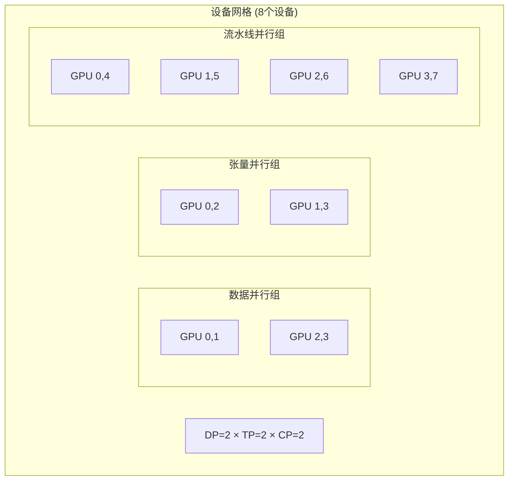

**图表来源**
- [3D_parallel.py](file://examples/3D_parallel.py#L15-L25)
- [3d_parallel_checks.py](file://examples/pytorch/3d_parallel_checks.py#L100-L134)

**章节来源**
- [3D_parallel.py](file://examples/3D_parallel.py#L1-L297)
- [3d_parallel_checks.py](file://examples/pytorch/3d_parallel_checks.py#L1-L729)

## 依赖关系分析

分布式训练系统的依赖关系复杂，涉及多个库和框架的协同工作：

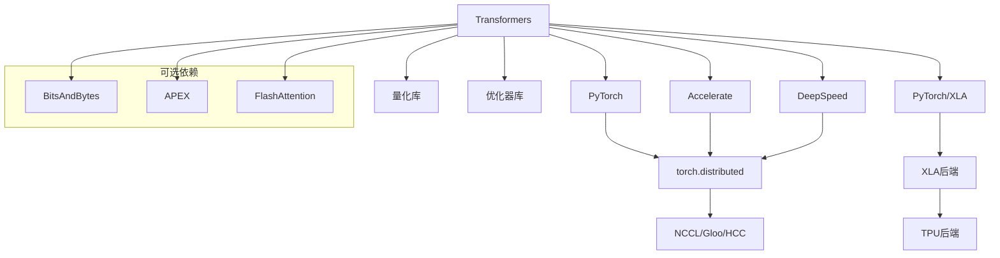

**图表来源**
- [accelerate.py](file://src/transformers/integrations/accelerate.py#L1-L50)
- [deepspeed.py](file://src/transformers/integrations/deepspeed.py#L1-L30)

**章节来源**
- [accelerate.py](file://src/transformers/integrations/accelerate.py#L1-L100)
- [deepspeed.py](file://src/transformers/integrations/deepspeed.py#L1-L100)

## 性能考虑

### 通信开销优化

分布式训练中的通信开销是影响性能的关键因素：

| 优化技术 | 效果 | 适用场景 | 实现复杂度 |
|----------|------|----------|------------|
| 梯度压缩 | 减少带宽使用 | 大模型训练 | 中等 |
| 异步通信 | 提高并行度 | 网络延迟高 | 高 |
| 混合精度 | 减少通信量 | 所有场景 | 低 |
| 通信调度 | 重叠计算通信 | 复杂模型 | 高 |

### 内存优化策略

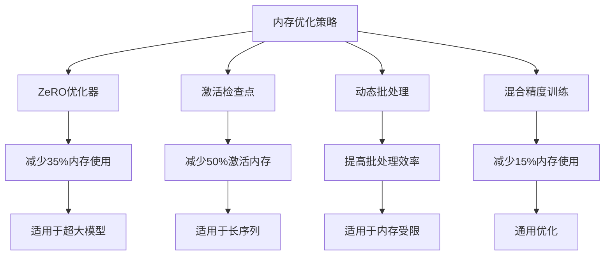

### 容错机制

分布式训练需要完善的容错机制来保证训练的稳定性：

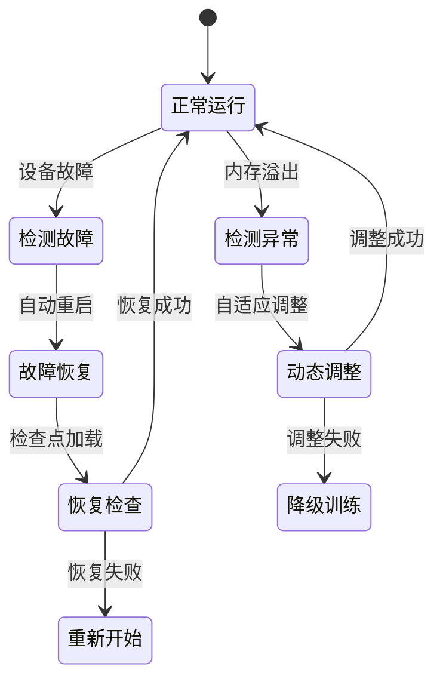

## 故障排除指南

### 常见问题及解决方案

#### 梯度同步问题

**问题症状：** 不同设备上的模型参数不一致

**解决方案：**
1. 检查通信后端配置
2. 验证设备网格设置
3. 使用梯度检查工具

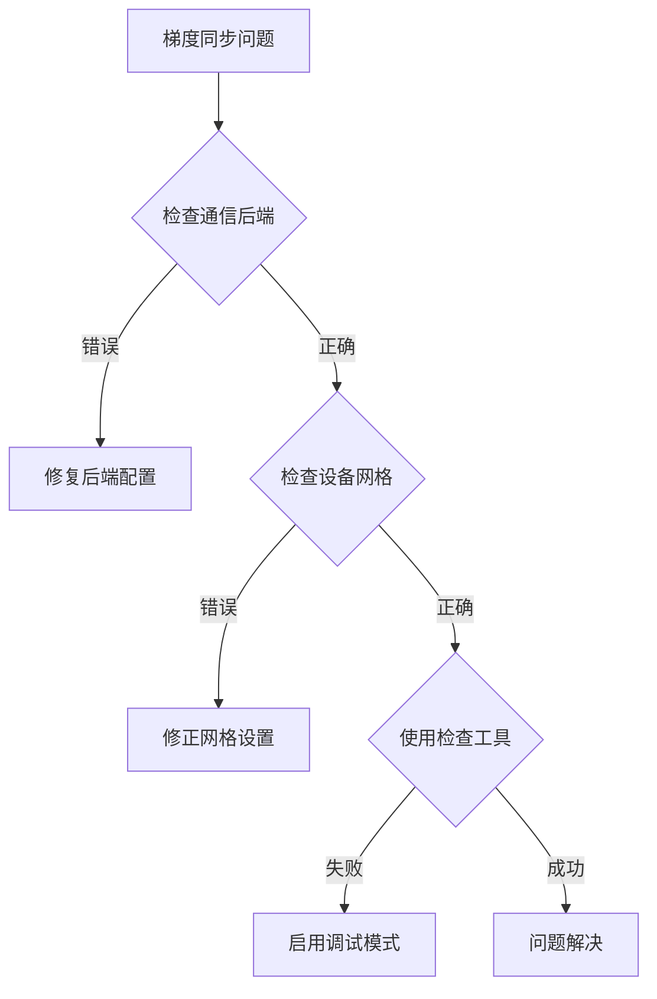

**图表来源**
- [3d_parallel_checks.py](file://examples/pytorch/3d_parallel_checks.py#L646-L671)

#### 内存不足问题

**诊断步骤：**
1. 监控各设备内存使用
2. 检查模型分片策略
3. 调整批处理大小

#### 通信超时问题

**排查方法：**
- 检查网络连接质量
- 调整通信超时参数
- 优化通信调度

**章节来源**
- [3d_parallel_checks.py](file://examples/pytorch/3d_parallel_checks.py#L646-L729)

### 性能调优建议

#### 网络优化

1. **选择合适的通信后端：**
   - NCCL：GPU集群首选
   - Gloo：CPU和混合环境
   - HCCL：华为昇腾平台

2. **优化网络拓扑：**
   - 使用InfiniBand替代以太网
   - 配置适当的网络缓冲区大小

#### 存储优化

1. **检查点管理：**
   - 使用异步保存
   - 启用压缩存储
   - 实施增量检查点

2. **数据加载优化：**
   - 使用多进程数据加载
   - 实施预取策略
   - 优化数据格式

## 结论

Transformers的分布式训练系统提供了全面而灵活的解决方案，支持从简单的数据并行到复杂的3D并行等各种训练策略。通过合理选择和配置不同的分布式策略，可以显著提升大规模模型训练的效率和可扩展性。

### 关键要点总结

1. **策略选择：** 根据模型大小、硬件资源和训练目标选择合适的分布式策略
2. **性能优化：** 重视通信优化、内存管理和容错机制
3. **监控调试：** 建立完善的监控体系和调试工具
4. **最佳实践：** 遵循社区推荐的最佳实践和配置模板

### 未来发展方向

1. **自动化优化：** 更智能的自动并行策略选择
2. **云原生支持：** 更好的容器化和编排支持
3. **异构计算：** 更好地利用不同类型的硬件加速器
4. **边缘部署：** 支持边缘设备的分布式训练

通过深入理解和正确使用这些分布式训练功能，研究人员和工程师可以更高效地训练和部署大规模机器学习模型。