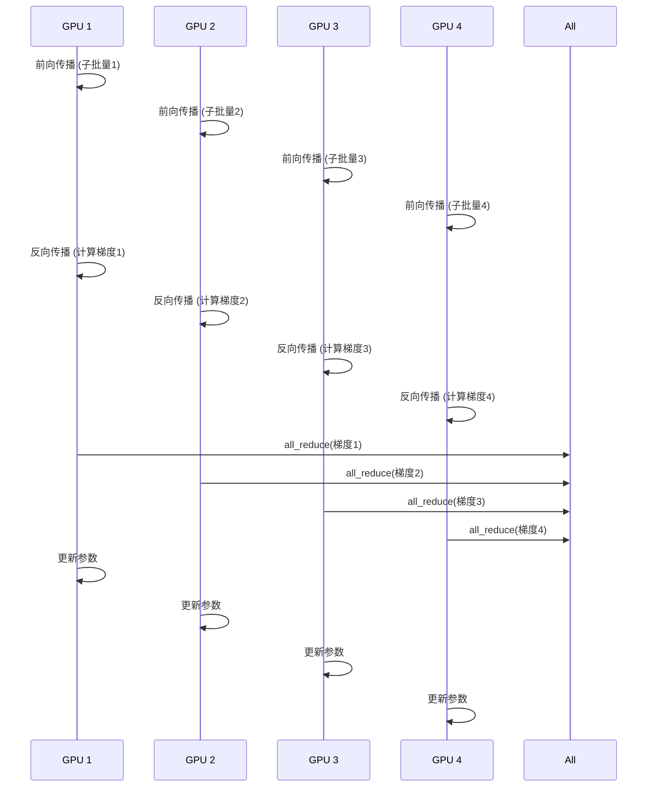
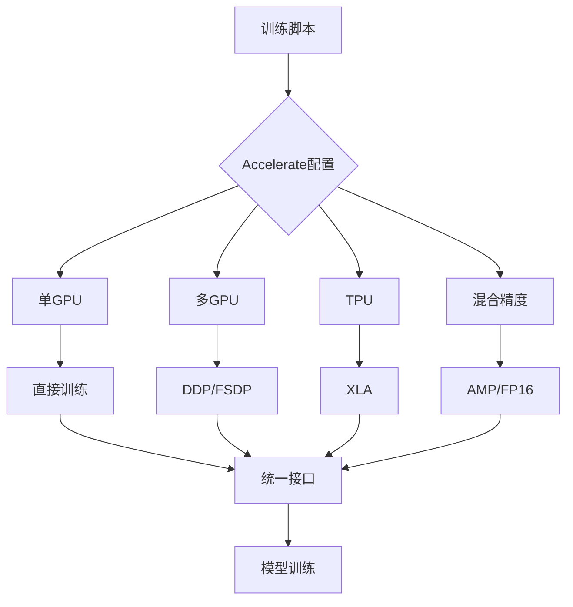
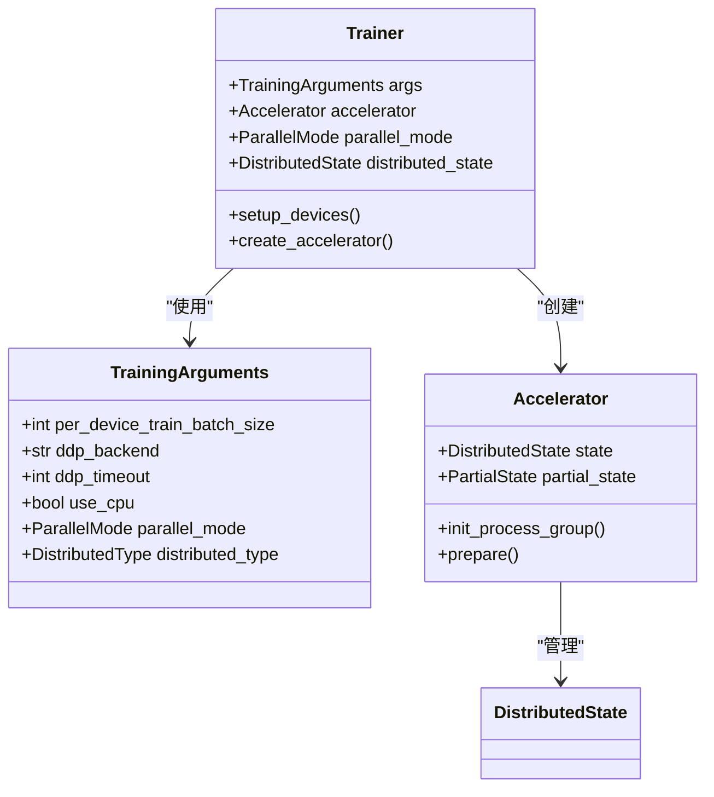
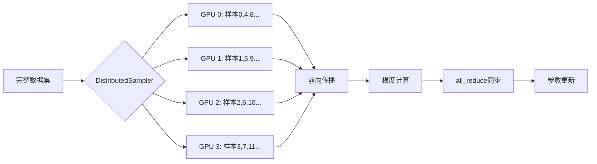
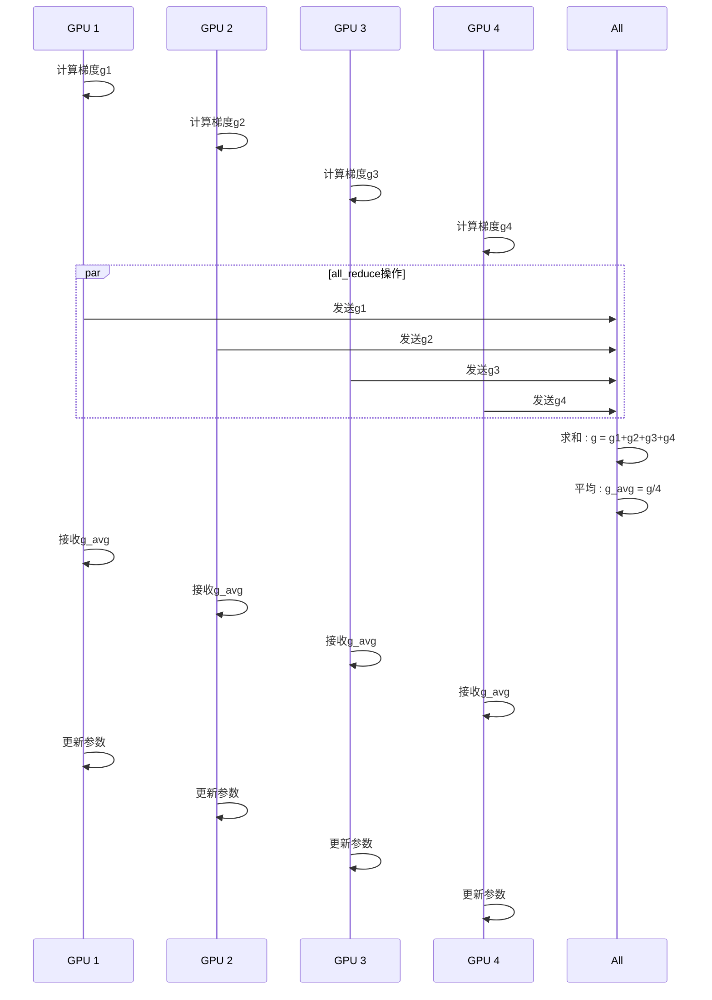

# 数据并行

<cite>
**本文档中引用的文件**  
- [3d_parallel_checks.py](file://examples/pytorch/3d_parallel_checks.py)
- [training_args.py](file://src/transformers/training_args.py)
- [trainer.py](file://src/transformers/trainer.py)
- [trainer_pt_utils.py](file://src/transformers/trainer_pt_utils.py)
- [configuration_utils.py](file://src/transformers/distributed/configuration_utils.py)
- [tensor_parallel.py](file://src/transformers/integrations/tensor_parallel.py)
</cite>

## 目录
1. [引言](#引言)
2. [数据并行实现原理](#数据并行实现原理)
3. [PyTorch DDP实现](#pytorch-ddp实现)
4. [Accelerate库集成](#accelerate库集成)
5. [Hugging Face Trainer配置](#hugging-face-trainer配置)
6. [多GPU环境设置](#多gpu环境设置)
7. [数据分割策略](#数据分割策略)
8. [梯度同步机制](#梯度同步机制)
9. [通信开销优化](#通信开销优化)
10. [性能瓶颈与解决方案](#性能瓶颈与解决方案)
11. [代码示例分析](#代码示例分析)
12. [适用场景分析](#适用场景分析)

## 引言
数据并行是深度学习分布式训练中的核心策略，通过将数据批量分割到多个计算设备上并行处理，显著提升大规模模型的训练效率。在Hugging Face Transformers框架中，数据并行通过多种技术实现，包括PyTorch原生的DistributedDataParallel（DDP）、Accelerate库的抽象封装以及Trainer类的高级接口。本文深入探讨这些实现方式的原理、配置方法和优化策略，为在多GPU环境下高效训练大型语言模型提供全面指导。

## 数据并行实现原理
数据并行的核心思想是将训练数据批量（batch）分割成多个子批量，每个计算设备（如GPU）处理一个子批量并计算梯度，然后通过通信操作同步梯度以更新模型参数。这种并行模式保持了模型的完整性，每个设备都拥有完整的模型副本，但只处理部分数据。

在Hugging Face Transformers中，数据并行的实现依赖于PyTorch的分布式通信原语，特别是`torch.distributed.all_reduce`操作，用于在训练过程中聚合来自不同设备的梯度。系统通过`DeviceMesh`抽象来管理设备间的拓扑结构，支持数据并行（DP）、张量并行（TP）和上下文并行（CP）等多种并行策略的组合。

**Section sources**
- [3d_parallel_checks.py](file://examples/pytorch/3d_parallel_checks.py#L0-L199)
- [configuration_utils.py](file://src/transformers/distributed/configuration_utils.py#L0-L111)

## PyTorch DDP实现
PyTorch的DistributedDataParallel（DDP）是数据并行的基础实现。在Transformers框架中，当检测到多个GPU且未使用更高级的并行策略时，系统会自动配置DDP。DDP通过`torch.nn.parallel.DistributedDataParallel`包装器将模型分布到多个进程中，每个进程处理数据的一个子集。

DDP的实现关键在于梯度同步机制。在反向传播过程中，每个设备计算其子批量的梯度，然后通过`all_reduce`操作将梯度在所有设备间求和并平均。这种同步确保了所有设备上的模型参数保持一致。DDP还支持多种后端（如NCCL、GLOO）和超时配置，以适应不同的硬件环境。

**Diagram sources**
- [3d_parallel_checks.py](file://examples/pytorch/3d_parallel_checks.py#L354-L379)
- [training_args.py](file://src/transformers/training_args.py#L1751-L1831)

**Section sources**
- [3d_parallel_checks.py](file://examples/pytorch/3d_parallel_checks.py#L354-L379)
- [training_args.py](file://src/transformers/training_args.py#L1751-L1831)

## Accelerate库集成
Accelerate库为分布式训练提供了统一的抽象层，简化了在不同硬件和并行策略下的训练代码。在Transformers中，Accelerate通过`Accelerator`类集成，自动处理设备管理、分布式设置和混合精度训练等复杂细节。

Accelerate的配置通过`AcceleratorConfig`对象进行，支持灵活的并行策略组合。当使用`accelerate launch`命令时，系统会根据环境自动配置最佳的分布式设置。Accelerate还支持检查点保存、日志记录和性能监控等高级功能，大大降低了分布式训练的复杂性。

**Diagram sources**
- [trainer.py](file://src/transformers/trainer.py#L4989-L5013)
- [training_args.py](file://src/transformers/training_args.py#L1563-L1587)

**Section sources**
- [trainer.py](file://src/transformers/trainer.py#L4989-L5013)
- [training_args.py](file://src/transformers/training_args.py#L1563-L1587)

## Hugging Face Trainer配置
Hugging Face Trainer类提供了高级接口来配置和管理数据并行训练。通过`TrainingArguments`类，用户可以轻松设置并行相关的参数，如`per_device_train_batch_size`、`ddp_backend`和`ddp_timeout`。

Trainer的并行模式由`parallel_mode`属性决定，系统会根据可用硬件和配置自动选择最合适的模式。当检测到多个GPU时，Trainer会使用`DistributedSampler`来确保数据在不同设备间的均匀分布，并通过`Accelerator`对象管理底层的分布式通信。

**Diagram sources**
- [training_args.py](file://src/transformers/training_args.py#L1700-L1900)
- [trainer.py](file://src/transformers/trainer.py#L4938-L4958)

**Section sources**
- [training_args.py](file://src/transformers/training_args.py#L1700-L1900)
- [trainer.py](file://src/transformers/trainer.py#L4938-L4958)

## 多GPU环境设置
在多GPU环境中配置数据并行需要正确设置分布式进程组和设备网格。系统通过环境变量（如`RANK`、`WORLD_SIZE`、`LOCAL_RANK`）来管理分布式进程，并使用`torch.distributed.init_process_group`初始化通信后端。

设备网格（DeviceMesh）的配置是关键，它定义了设备间的拓扑结构。对于纯数据并行，网格是一维的；对于混合并行（如DP+TP），网格是多维的。系统通过`DeviceMesh`对象管理设备间的通信组，确保梯度同步和参数更新的正确性。

**Section sources**
- [3d_parallel_checks.py](file://examples/pytorch/3d_parallel_checks.py#L0-L199)
- [training_args.py](file://src/transformers/training_args.py#L1751-L1807)

## 数据分割策略
数据并行中的数据分割主要通过`DistributedSampler`实现。该采样器将数据集均匀分割给各个进程，确保每个设备处理不相交的数据子集。在训练过程中，`DistributedSampler`会根据进程的rank和world size计算每个设备应处理的样本索引。

对于可迭代数据集，系统使用`IterableDatasetShard`来分割数据流。这种策略确保了数据在不同设备间的均匀分布，同时支持大规模数据集的流式处理。采样器还支持随机洗牌和epoch管理，确保训练过程的随机性和可重复性。

**Diagram sources**
- [3d_parallel_checks.py](file://examples/pytorch/3d_parallel_checks.py#L290-L327)
- [trainer_pt_utils.py](file://src/transformers/trainer_pt_utils.py#L571-L607)

**Section sources**
- [3d_parallel_checks.py](file://examples/pytorch/3d_parallel_checks.py#L290-L327)
- [trainer_pt_utils.py](file://src/transformers/trainer_pt_utils.py#L571-L607)

## 梯度同步机制
梯度同步是数据并行的核心操作，通过`torch.distributed.all_reduce`实现。在反向传播完成后，每个设备上的梯度会被聚合到所有设备上，确保模型参数的一致性更新。

系统实现了复杂的梯度处理逻辑，特别是对于`DTensor`（分布式张量）的支持。当梯度是`DTensor`时，系统会先将其转换为本地张量，执行`all_reduce`操作，然后重新包装为`DTensor`。这种机制确保了在混合并行策略下梯度同步的正确性。

**Diagram sources**
- [3d_parallel_checks.py](file://examples/pytorch/3d_parallel_checks.py#L557-L582)
- [tensor_parallel.py](file://src/transformers/integrations/tensor_parallel.py#L495-L523)

**Section sources**
- [3d_parallel_checks.py](file://examples/pytorch/3d_parallel_checks.py#L557-L582)
- [tensor_parallel.py](file://src/transformers/integrations/tensor_parallel.py#L495-L523)

## 通信开销优化
通信开销是数据并行的主要性能瓶颈，特别是在大规模集群中。Transformers框架通过多种策略优化通信开销：

1. **梯度累积**：通过`gradient_accumulation_steps`参数减少通信频率，只在累积多个小批量后才进行梯度同步。
2. **混合精度训练**：使用FP16或BF16减少通信数据量，同时保持数值稳定性。
3. **异步通信**：利用`async_op=True`参数实现通信与计算的重叠，提高GPU利用率。
4. **通信压缩**：在某些配置下使用梯度压缩技术减少通信带宽需求。

这些优化策略显著降低了通信开销，提高了分布式训练的扩展效率。

**Section sources**
- [trainer.py](file://src/transformers/trainer.py#L3734-L3764)
- [training_args.py](file://src/transformers/training_args.py#L1782-L1807)

## 性能瓶颈与解决方案
数据并行训练面临多种性能瓶颈，包括显存不足、通信延迟和负载不均衡。针对这些挑战，Transformers框架提供了相应的解决方案：

- **显存不足**：通过`deepspeed`集成支持ZeRO优化，将模型状态分片到多个设备，显著降低单设备显存需求。
- **通信延迟**：使用高性能通信后端（如NCCL）和拓扑感知的通信算法优化通信效率。
- **负载均衡**：通过`LengthGroupedSampler`等智能采样器确保不同设备处理相似计算量的样本。

此外，系统提供了详细的性能监控工具，帮助用户识别和解决性能瓶颈。

**Section sources**
- [training_args.py](file://src/transformers/training_args.py#L1751-L1780)
- [trainer.py](file://src/transformers/trainer.py#L4989-L5013)

## 代码示例分析
通过分析`3d_parallel_checks.py`示例代码，可以深入了解数据并行的实际实现。该示例展示了如何配置多维设备网格（DP、TP、CP），初始化分布式环境，以及实现自定义的梯度同步逻辑。

代码中关键的配置包括：
- 使用`DeviceMesh`定义多维设备拓扑
- 通过`FSDP`实现数据并行封装
- 实现`all_reduce_grads`函数处理梯度同步
- 使用`DistributedSampler`管理数据分割

这些代码模式为在自定义训练中实现高效的数据并行提供了实用参考。

**Section sources**
- [3d_parallel_checks.py](file://examples/pytorch/3d_parallel_checks.py#L0-L199)
- [trainer_pt_utils.py](file://src/transformers/trainer_pt_utils.py#L0-L199)

## 适用场景分析
数据并行适用于多种训练场景，包括：

1. **大规模语言模型训练**：当模型可以容纳在单个GPU显存中，但数据量巨大时。
2. **快速原型开发**：提供简单的并行化方式，无需修改模型架构。
3. **资源受限环境**：在有限的GPU数量下最大化训练吞吐量。

然而，对于超大规模模型（如百亿参数以上），可能需要结合张量并行或流水线并行来克服显存限制。选择合适的并行策略需要权衡模型大小、数据规模和硬件配置。

**Section sources**
- [3d_parallel_checks.py](file://examples/pytorch/3d_parallel_checks.py#L0-L199)
- [training_args.py](file://src/transformers/training_args.py#L1700-L1900)