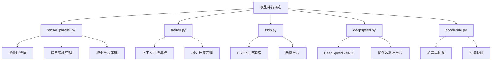
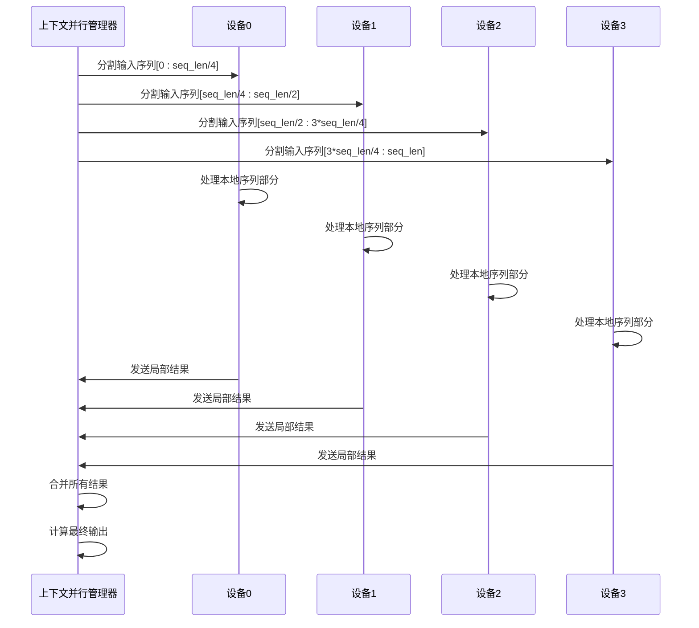
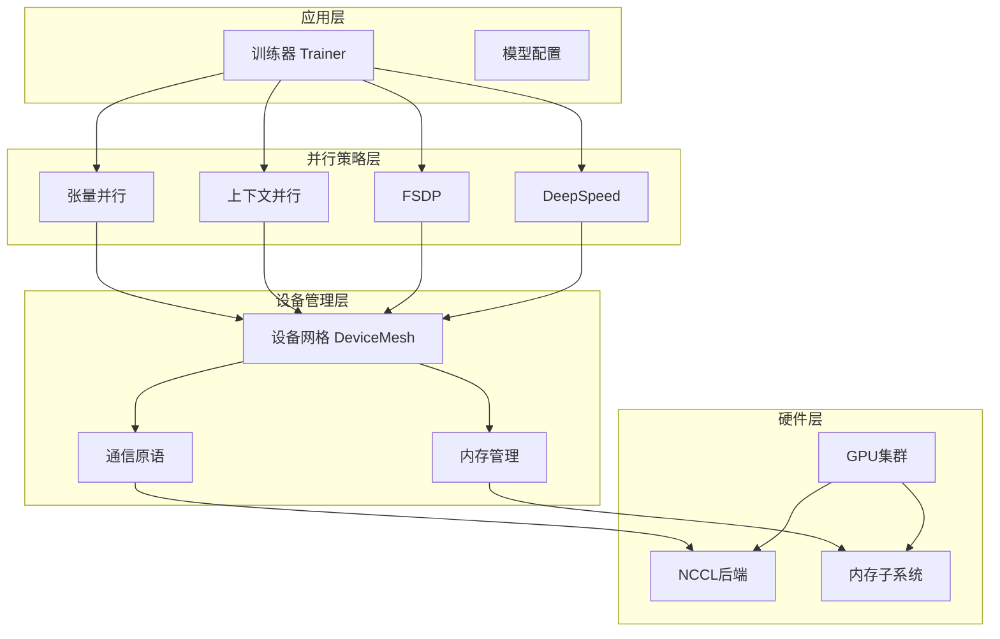
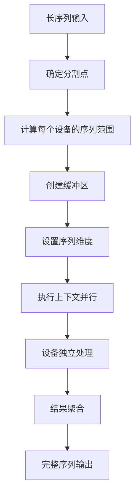
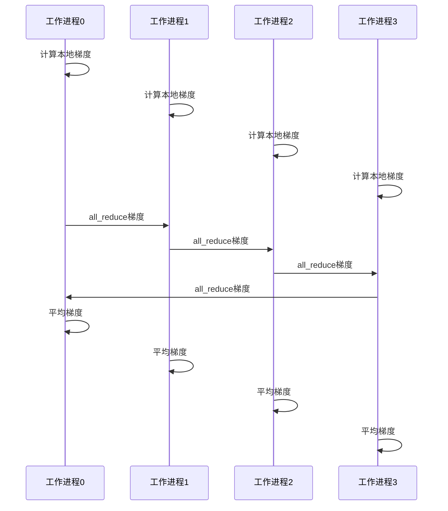
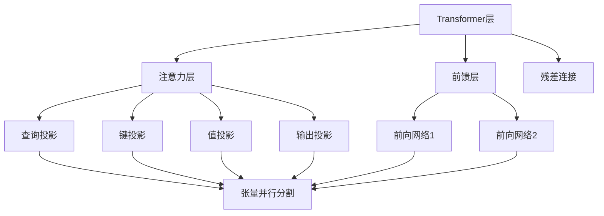
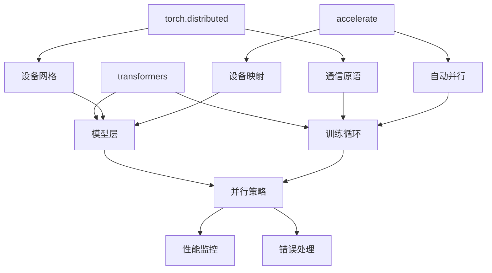
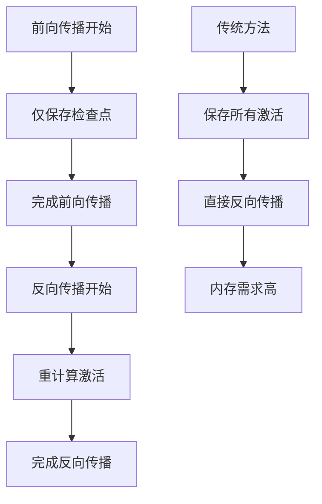

# 模型并行

<cite>
**本文档中引用的文件**
- [context_parallel.py](file://examples/pytorch/context_parallel.py)
- [3D_parallel.py](file://examples/3D_parallel.py)
- [tensor_parallel.py](file://src/transformers/integrations/tensor_parallel.py)
- [trainer.py](file://src/transformers/trainer.py)
- [fsdp.py](file://src/transformers/integrations/fsdp.py)
- [deepspeed.py](file://src/transformers/integrations/deepspeed.py)
- [accelerate.py](file://src/transformers/integrations/accelerate.py)
</cite>

## 目录
1. [简介](#简介)
2. [项目结构](#项目结构)
3. [核心组件](#核心组件)
4. [架构概览](#架构概览)
5. [详细组件分析](#详细组件分析)
6. [依赖关系分析](#依赖关系分析)
7. [性能考虑](#性能考虑)
8. [故障排除指南](#故障排除指南)
9. [结论](#结论)

## 简介

模型并行是大规模深度学习训练中的关键技术，它通过将大型神经网络模型分割到多个设备上来克服单个设备的内存限制。本文档深入介绍了Hugging Face Transformers库中实现的各种模型并行策略，包括张量并行、流水线并行和上下文并行，以及它们在自定义训练中的应用。

模型并行的核心目标是在保持模型精度的同时，最大化硬件资源利用率，支持更大规模的模型训练。通过合理的并行策略选择和配置，可以在多GPU环境中实现高效的分布式训练。

## 项目结构

Transformers库中的模型并行功能主要分布在以下几个关键模块中：



**图表来源**
- [tensor_parallel.py](file://src/transformers/integrations/tensor_parallel.py#L1-L50)
- [trainer.py](file://src/transformers/trainer.py#L3600-L3650)
- [fsdp.py](file://src/transformers/integrations/fsdp.py#L1-L30)

**章节来源**
- [tensor_parallel.py](file://src/transformers/integrations/tensor_parallel.py#L1-L100)
- [trainer.py](file://src/transformers/trainer.py#L1-L50)

## 核心组件

### 张量并行层系统

张量并行是将模型的单个层分割到多个设备上的技术。Transformers库提供了多种张量并行层类型：

#### ColwiseParallel（列并行）
将矩阵乘法的权重按列分割，适用于注意力机制和前馈网络的权重矩阵。

#### RowwiseParallel（行并行）
将矩阵乘法的权重按行分割，主要用于线性层的输出维度。

#### SequenceParallel（序列并行）
在序列维度上对激活进行分片，支持长序列处理。

#### ReplicateParallel（复制并行）
在所有设备上复制计算，用于不需要分片的小型层。

**章节来源**
- [tensor_parallel.py](file://src/transformers/integrations/tensor_parallel.py#L400-L600)

### 上下文并行集成

上下文并行是一种特殊的并行策略，专门用于处理长序列。它将序列分割到不同的设备上，同时保持注意力机制的完整性。



**图表来源**
- [context_parallel.py](file://examples/pytorch/context_parallel.py#L70-L95)
- [3D_parallel.py](file://examples/3D_parallel.py#L260-L290)

**章节来源**
- [context_parallel.py](file://examples/pytorch/context_parallel.py#L1-L95)
- [trainer.py](file://src/transformers/trainer.py#L3618-L3680)

## 架构概览

模型并行的整体架构采用分层设计，从底层的设备网格管理到高层的训练集成：



**图表来源**
- [trainer.py](file://src/transformers/trainer.py#L4950-L4990)
- [tensor_parallel.py](file://src/transformers/integrations/tensor_parallel.py#L50-L100)

## 详细组件分析

### 张量并行实现

#### 权重分片策略

张量并行的核心在于如何有效地将模型权重分片到多个设备上：

```mermaid
flowchart TD
A[输入权重矩阵] --> B{选择分片策略}
B --> |Colwise| C[按列分片]
B --> |Rowwise| D[按行分片]
B --> |Sequence| E[按序列分片]
C --> F[Shard(-2)布局]
D --> G[Shard(-1)布局]
E --> H[Shard(1)布局]
F --> I[DTensor转换]
G --> I
H --> I
I --> J[设备分发]
J --> K[本地权重加载]
```

**图表来源**
- [tensor_parallel.py](file://src/transformers/integrations/tensor_parallel.py#L600-L700)

#### 设备网格初始化

设备网格是模型并行的基础，它定义了设备之间的拓扑结构：

```python
# 示例：初始化张量并行网格
device_mesh = torch.distributed.init_device_mesh("cuda", (tp_size,))
```

**章节来源**
- [tensor_parallel.py](file://src/transformers/integrations/tensor_parallel.py#L50-L150)

### 上下文并行配置

#### 序列分割策略

上下文并行需要精心设计的序列分割策略：



**图表来源**
- [context_parallel.py](file://examples/pytorch/context_parallel.py#L50-L70)

#### 注意力掩码处理

上下文并行要求严格的因果掩码验证：

```python
# 验证因果掩码
def _is_attention_mask_causal(self, attention_mask):
    seq_len = attention_mask.shape[-1]
    upper_triangular = torch.triu(attention_mask, diagonal=1)
    is_causal = torch.all(upper_triangular <= 1e-6)
    return is_causal.item()
```

**章节来源**
- [trainer.py](file://src/transformers/trainer.py#L3625-L3650)

### 梯度同步机制

#### 跨设备梯度同步

模型并行中的梯度同步是确保训练收敛的关键：



**图表来源**
- [3D_parallel.py](file://examples/3D_parallel.py#L354-L379)

#### 内存优化策略

模型并行中的内存优化涉及多个层面：

| 优化策略 | 描述 | 适用场景 | 性能影响 |
|---------|------|----------|----------|
| 激活检查点 | 重新计算而非存储激活 | 大模型训练 | 显存节省，计算增加 |
| 参数分片 | 将参数分散到不同设备 | 大批量训练 | 显存线性扩展 |
| 梯度累积 | 在多个步骤中累积梯度 | 小批量训练 | 内存效率提升 |
| CPU卸载 | 将非活跃参数移动到CPU | 内存受限环境 | 显存节省，延迟增加 |

**章节来源**
- [3D_parallel.py](file://examples/3D_parallel.py#L354-L400)

### 多GPU环境下的模型分割

#### 层级划分策略

大型语言模型的层级划分需要综合考虑计算复杂度和通信开销：



**图表来源**
- [tensor_parallel.py](file://src/transformers/integrations/tensor_parallel.py#L800-L900)

#### 通信模式优化

不同并行策略的通信模式差异显著：

| 并行类型 | 通信模式 | 通信开销 | 延迟容忍度 |
|---------|----------|----------|------------|
| 张量并行 | 点对点通信 | 中等 | 低 |
| 流水线并行 | 队列通信 | 高 | 中等 |
| 上下文并行 | 全局通信 | 高 | 低 |
| 数据并行 | 广播/归约 | 中等 | 高 |

**章节来源**
- [tensor_parallel.py](file://src/transformers/integrations/tensor_parallel.py#L900-L1000)

## 依赖关系分析

模型并行系统的依赖关系复杂，涉及多个子系统的协调：



**图表来源**
- [accelerate.py](file://src/transformers/integrations/accelerate.py#L1-L50)
- [tensor_parallel.py](file://src/transformers/integrations/tensor_parallel.py#L1-L30)

**章节来源**
- [accelerate.py](file://src/transformers/integrations/accelerate.py#L1-L100)
- [fsdp.py](file://src/transformers/integrations/fsdp.py#L1-L52)

## 性能考虑

### 计算效率平衡

模型并行中的计算效率需要在以下因素之间找到平衡：

1. **负载均衡**：确保各设备的工作负载均匀分布
2. **通信开销**：最小化设备间的通信时间
3. **内存使用**：最大化内存利用率
4. **计算重叠**：通过异步操作提高效率

### 显存优化技术

#### 动态内存分配

```python
# 动态调整批次大小以适应显存限制
def adjust_batch_size(current_batch_size, memory_usage, max_memory):
    if memory_usage > max_memory * 0.9:
        return max(1, current_batch_size // 2)
    elif memory_usage < max_memory * 0.7:
        return min(max_batch_size, current_batch_size * 2)
    return current_batch_size
```

#### 激活重计算

激活重计算是一种权衡计算时间和内存的技术：



### 通信优化策略

#### 通信调度

```python
# 优化通信调度以减少等待时间
def optimize_communication_schedule(layers):
    schedule = []
    for layer in layers:
        if layer.requires_communication:
            schedule.append(("all_reduce", layer))
        else:
            schedule.append(("compute", layer))
    return schedule
```

## 故障排除指南

### 常见问题及解决方案

#### 梯度同步延迟

**问题描述**：梯度同步导致训练速度显著下降。

**解决方案**：
1. 使用异步梯度同步
2. 实现梯度压缩
3. 优化通信拓扑

```python
# 异步梯度同步示例
def async_gradient_sync(model, device_mesh):
    for param in model.parameters():
        if param.grad is not None:
            torch.distributed.all_reduce(
                param.grad, 
                op=torch.distributed.ReduceOp.SUM, 
                async_op=True
            )
```

#### 显存碎片化

**问题描述**：长时间运行后出现显存碎片化，导致OOM错误。

**解决方案**：
1. 定期清理缓存
2. 使用内存池管理
3. 实现动态内存回收

```python
# 显存清理策略
def cleanup_memory():
    torch.cuda.empty_cache()
    torch.cuda.reset_peak_memory_stats()
```

#### 负载不均衡

**问题描述**：某些设备比其他设备更快完成计算任务。

**解决方案**：
1. 实现动态负载均衡
2. 使用工作窃取算法
3. 调整任务分配策略

### 性能调试工具

#### 通信分析

```python
# 通信时间测量
import time

def measure_communication_time(func):
    def wrapper(*args, **kwargs):
        start_time = time.time()
        result = func(*args, **kwargs)
        end_time = time.time()
        print(f"Communication took {end_time - start_time:.4f} seconds")
        return result
    return wrapper
```

#### 内存监控

```python
# 内存使用情况监控
def monitor_memory_usage():
    allocated = torch.cuda.memory_allocated()
    cached = torch.cuda.memory_reserved()
    print(f"Allocated: {allocated / 1024**3:.2f} GB")
    print(f"Cached: {cached / 1024**3:.2f} GB")
```

**章节来源**
- [3D_parallel.py](file://examples/3D_parallel.py#L354-L434)

## 结论

模型并行是处理大规模深度学习模型的关键技术。通过合理选择和配置并行策略，可以显著提高训练效率和模型规模。Transformers库提供的模型并行功能涵盖了从基础的张量并行到复杂的上下文并行等多种技术。

成功的模型并行部署需要考虑以下关键因素：
- **硬件配置**：GPU数量、内存容量、网络带宽
- **模型特性**：层数、参数量、计算复杂度
- **训练目标**：收敛速度、内存效率、可扩展性
- **软件生态**：框架兼容性、工具支持、社区资源

随着硬件技术的发展和算法的进步，模型并行技术将继续演进，为更大规模的AI模型训练提供支持。理解这些核心技术原理和实践技巧，对于从事大规模深度学习研究和应用的开发者来说至关重要。