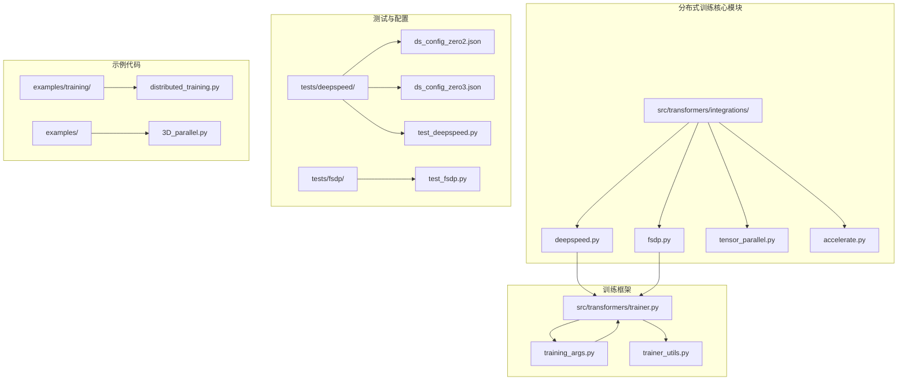
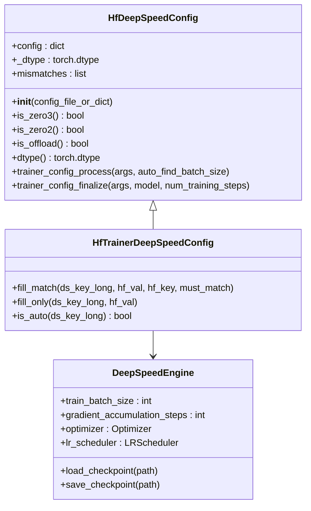
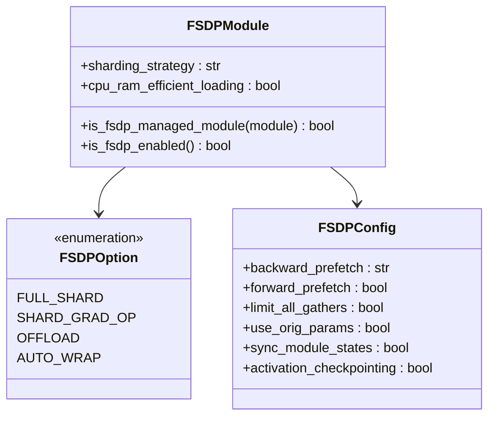
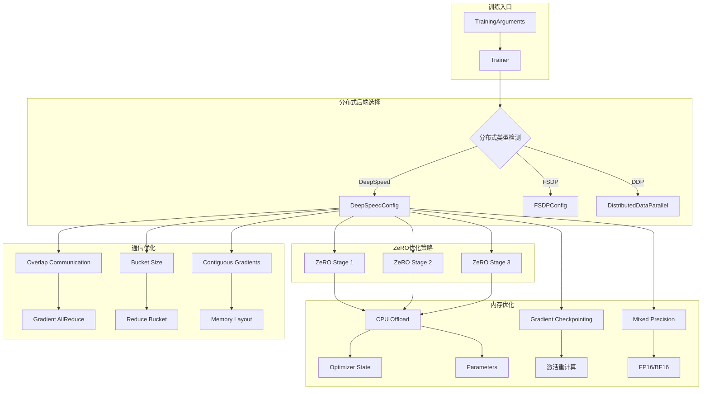
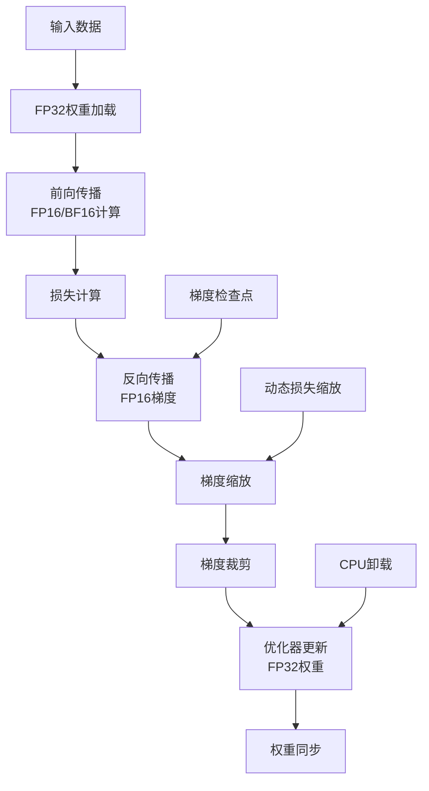
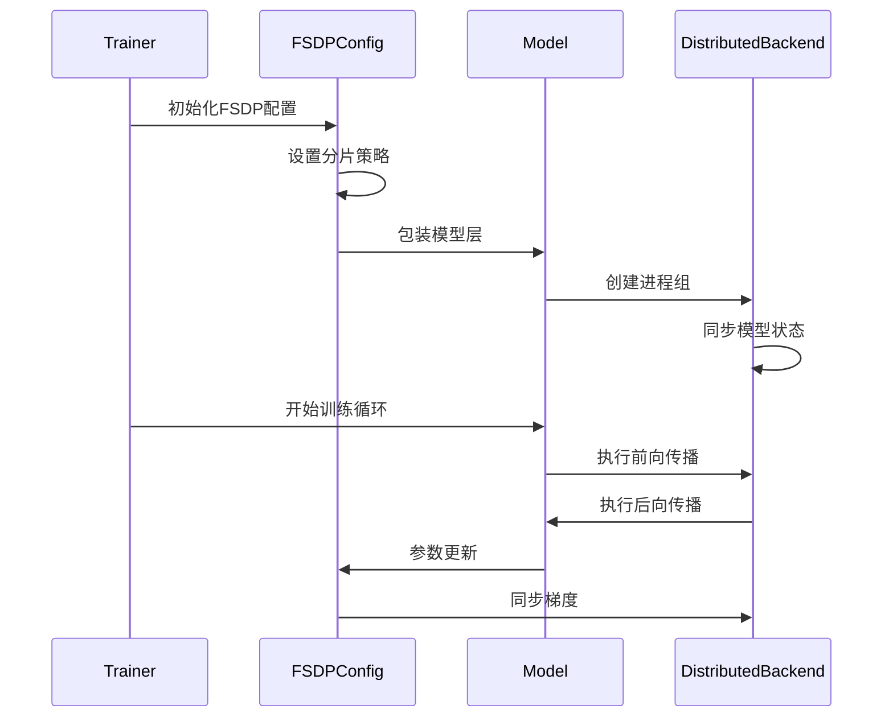
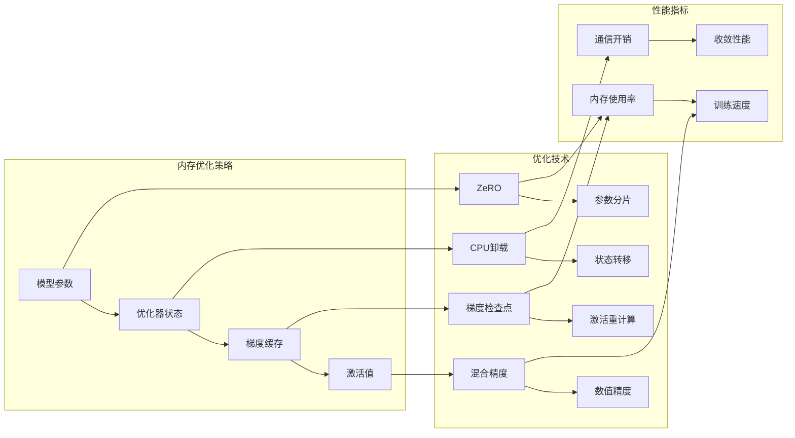
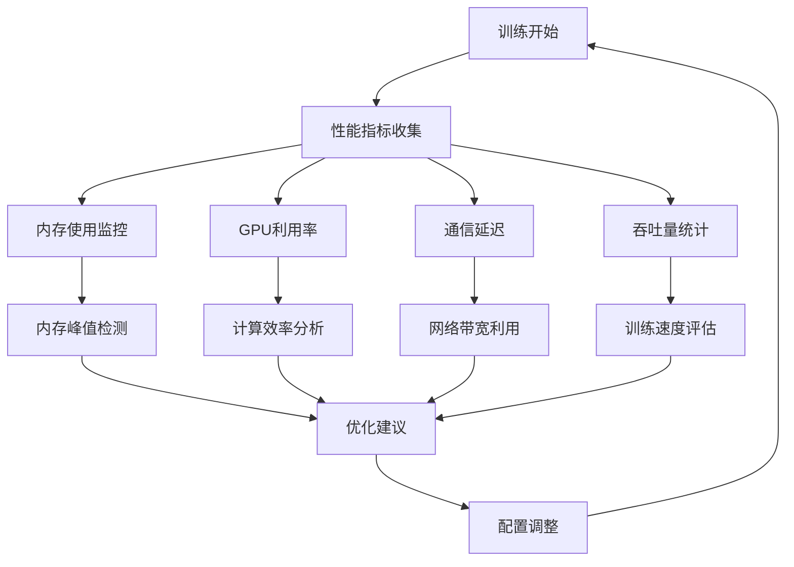
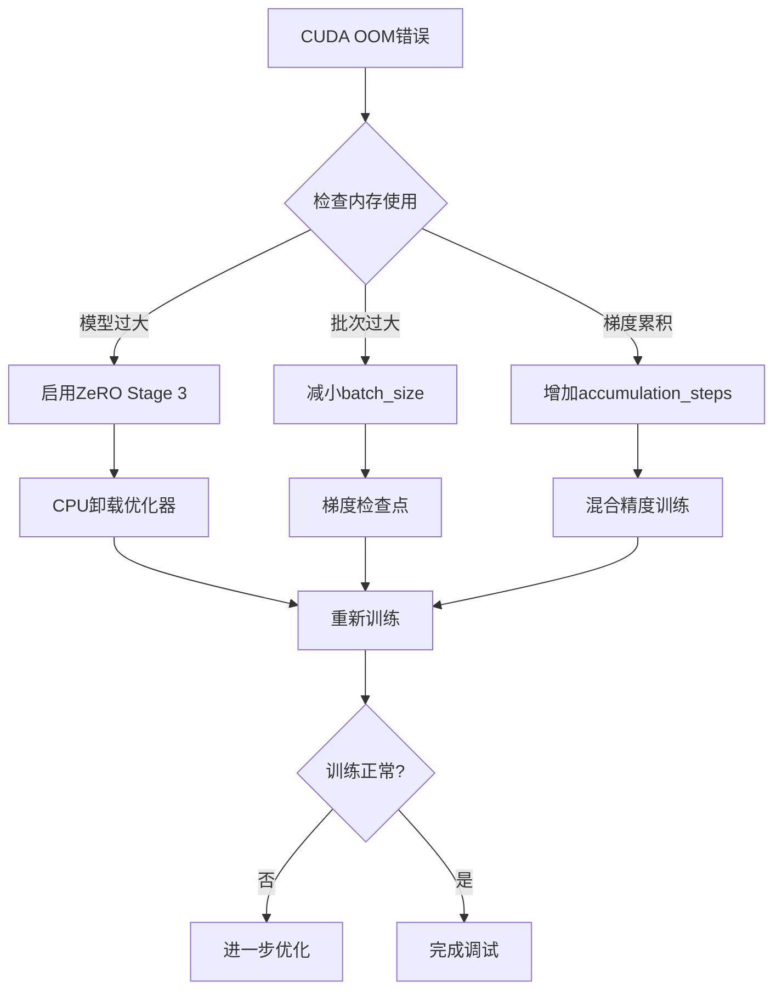
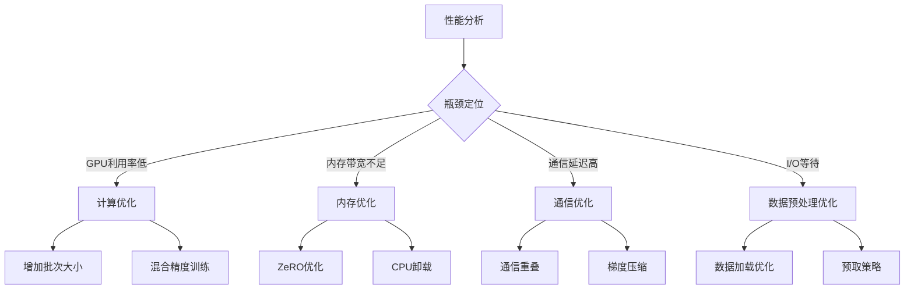

# 高级分布式策略

<cite>
**本文档引用的文件**
- [src/transformers/integrations/deepspeed.py](file://src/transformers/integrations/deepspeed.py)
- [src/transformers/integrations/fsdp.py](file://src/transformers/integrations/fsdp.py)
- [src/transformers/trainer.py](file://src/transformers/trainer.py)
- [src/transformers/training_args.py](file://src/transformers/training_args.py)
- [examples/training/distributed_training.py](file://examples/training/distributed_training.py)
- [tests/deepspeed/ds_config_zero2.json](file://tests/deepspeed/ds_config_zero2.json)
- [tests/deepspeed/ds_config_zero3.json](file://tests/deepspeed/ds_config_zero3.json)
- [tests/fsdp/test_fsdp.py](file://tests/fsdp/test_fsdp.py)
</cite>

## 目录
1. [简介](#简介)
2. [项目结构概览](#项目结构概览)
3. [核心分布式组件](#核心分布式组件)
4. [架构概览](#架构概览)
5. [深度学习优化策略](#深度学习优化策略)
6. [FSDP分布式训练](#fsdp分布式训练)
7. [内存优化与计算效率](#内存优化与计算效率)
8. [性能分析与调优](#性能分析与调优)
9. [故障排除指南](#故障排除指南)
10. [结论](#结论)

## 简介

本文档深入探讨了Transformers库中的高级分布式训练策略，重点关注DeepSpeed和FSDP等先进分布式训练技术的集成与使用。我们将详细分析ZeRO优化、梯度检查点、混合精度训练等高级特性的配置参数和性能影响，并提供完整的代码示例展示如何在大规模模型训练中实现高效的分布式训练。

## 项目结构概览

Transformers库中的分布式训练功能主要分布在以下关键模块中：

**图表来源**
- [src/transformers/integrations/deepspeed.py](file://src/transformers/integrations/deepspeed.py#L1-L50)
- [src/transformers/integrations/fsdp.py](file://src/transformers/integrations/fsdp.py#L1-L30)
- [src/transformers/trainer.py](file://src/transformers/trainer.py#L1-L100)

## 核心分布式组件

### DeepSpeed集成

DeepSpeed是Transformers库中最重要的分布式训练优化器之一，提供了多种ZeRO优化策略：

**图表来源**
- [src/transformers/integrations/deepspeed.py](file://src/transformers/integrations/deepspeed.py#L50-L150)

### FSDP集成

FSDP（Fully Sharded Data Parallel）提供了PyTorch原生的分布式训练支持：

**图表来源**
- [src/transformers/integrations/fsdp.py](file://src/transformers/integrations/fsdp.py#L20-L54)

**章节来源**
- [src/transformers/integrations/deepspeed.py](file://src/transformers/integrations/deepspeed.py#L50-L200)
- [src/transformers/integrations/fsdp.py](file://src/transformers/integrations/fsdp.py#L20-L54)

## 架构概览

### 分布式训练架构

**图表来源**
- [src/transformers/trainer.py](file://src/transformers/trainer.py#L1-L200)
- [src/transformers/training_args.py](file://src/transformers/training_args.py#L1-L300)

## 深度学习优化策略

### ZeRO优化详解

ZeRO（Zero Redundancy Optimizer）提供了三种不同的优化阶段：

#### ZeRO Stage 2配置

| 配置项 | 默认值 | 描述 | 性能影响 |
|--------|--------|------|----------|
| `stage` | 2 | ZeRO优化级别 | 内存减少约50% |
| `offload_optimizer` | cpu | 优化器状态卸载 | 减少GPU内存使用 |
| `allgather_partitions` | true | 参数分片收集 | 降低通信开销 |
| `reduce_bucket_size` | 2e8 | 规约桶大小 | 平衡内存与通信 |
| `overlap_comm` | true | 通信计算重叠 | 提升训练效率 |

#### ZeRO Stage 3配置

| 配置项 | 默认值 | 描述 | 适用场景 |
|--------|--------|------|----------|
| `stage` | 3 | 完全分片优化 | 大模型训练 |
| `offload_param` | none | 参数卸载 | 超大模型 |
| `stage3_prefetch_bucket_size` | auto | 预取桶大小 | 内存优化 |
| `stage3_param_persistence_threshold` | auto | 参数持久化阈值 | GC优化 |
| `stage3_max_live_parameters` | 1e9 | 最大活跃参数 | 内存控制 |

**章节来源**
- [tests/deepspeed/ds_config_zero2.json](file://tests/deepspeed/ds_config_zero2.json#L25-L45)
- [tests/deepspeed/ds_config_zero3.json](file://tests/deepspeed/ds_config_zero3.json#L25-L50)

### 混合精度训练

混合精度训练通过使用FP16或BF16来减少内存使用并加速训练：

**图表来源**
- [src/transformers/integrations/deepspeed.py](file://src/transformers/integrations/deepspeed.py#L180-L220)

### 梯度检查点

梯度检查点是一种内存优化技术，通过牺牲计算时间来减少内存使用：

| 检查点策略 | 内存节省 | 计算开销 | 适用模型 |
|------------|----------|----------|----------|
| 层级检查点 | 中等 | 中等 | Transformer类模型 |
| 激活重计算 | 高 | 高 | 大型语言模型 |
| 前向检查点 | 可控 | 低 | 关键路径优化 |
| 后向检查点 | 高 | 中等 | 训练稳定性 |

**章节来源**
- [src/transformers/integrations/deepspeed.py](file://src/transformers/integrations/deepspeed.py#L350-L400)

## FSDP分布式训练

### FSDP配置策略

FSDP提供了灵活的分片策略和优化选项：

**图表来源**
- [tests/fsdp/test_fsdp.py](file://tests/fsdp/test_fsdp.py#L100-L150)

### FSDP优化选项

| 选项 | 描述 | 性能影响 | 使用场景 |
|------|------|----------|----------|
| `FULL_SHARD` | 完全分片 | 内存最优 | 大模型训练 |
| `SHARD_GRAD_OP` | 梯度分片 | 平衡性能 | 中等规模模型 |
| `OFFLOAD` | CPU卸载 | 内存扩展 | 超大模型 |
| `AUTO_WRAP` | 自动包装 | 简化配置 | 复杂模型结构 |

**章节来源**
- [tests/fsdp/test_fsdp.py](file://tests/fsdp/test_fsdp.py#L150-L200)

## 内存优化与计算效率

### 内存占用分析

不同分布式策略的内存占用对比：

### 通信开销优化

分布式训练中的通信优化策略：

| 优化技术 | 实现方式 | 性能提升 | 适用场景 |
|----------|----------|----------|----------|
| 通信重叠 | 计算-通信流水线 | 10-20% | 大批量训练 |
| 梯度压缩 | 量化传输 | 30-50%带宽节省 | 网络受限环境 |
| 异步更新 | 非同步参数更新 | 20-30%加速 | 容错训练 |
| 局部优化 | 局部收敛策略 | 15-25%加速 | 大规模集群 |

**章节来源**
- [src/transformers/integrations/deepspeed.py](file://src/transformers/integrations/deepspeed.py#L400-L486)

## 性能分析与调优

### 训练性能监控

### 调优参数表

| 参数类别 | 关键参数 | 推荐范围 | 影响因素 |
|----------|----------|----------|----------|
| 批处理大小 | `per_device_train_batch_size` | 1-32 | GPU内存 |
| 积累步数 | `gradient_accumulation_steps` | 1-64 | 有效批大小 |
| 学习率 | `learning_rate` | 1e-5-1e-3 | 模型规模 |
| 精度设置 | `fp16/bf16` | 启用 | 数值稳定性 |
| 优化器 | `optim` | adamw_torch | 收敛速度 |

**章节来源**
- [src/transformers/training_args.py](file://src/transformers/training_args.py#L200-L300)

## 故障排除指南

### 常见问题与解决方案

#### 内存溢出问题

#### 训练不稳定问题

| 问题症状 | 可能原因 | 解决方案 | 验证方法 |
|----------|----------|----------|----------|
| 损失震荡 | 学习率过高 | 降低学习率 | 监控损失曲线 |
| 收敛缓慢 | 批次过小 | 增加有效批次 | 检查梯度统计 |
| 梯度爆炸 | 梯度裁剪不当 | 调整裁剪阈值 | 梯度范数监控 |
| 通信超时 | 网络不稳定 | 增加超时时间 | 网络诊断工具 |

#### 性能瓶颈识别

**章节来源**
- [tests/deepspeed/test_deepspeed.py](file://tests/deepspeed/test_deepspeed.py#L700-L800)

## 结论

Transformers库提供了全面而强大的分布式训练能力，通过DeepSpeed和FSDP等先进技术，能够有效处理大规模模型训练的各种挑战。关键要点包括：

1. **ZeRO优化策略**：根据模型规模和硬件资源选择合适的ZeRO Stage
2. **混合精度训练**：平衡内存使用和数值稳定性
3. **梯度检查点**：在内存和计算之间找到最佳平衡点
4. **通信优化**：通过重叠和压缩技术减少通信开销
5. **监控与调优**：建立完善的性能监控体系

通过合理配置这些高级分布式策略，可以在保持训练稳定性的前提下，显著提升大规模模型训练的效率和可扩展性。