# 性能优化

<cite>
**本文档引用的文件**
- [trainer.py](file://src/transformers/trainer.py)
- [training_args.py](file://src/transformers/training_args.py)
- [optimization.py](file://src/transformers/optimization.py)
- [data_collator.py](file://src/transformers/data/data_collator.py)
- [trainer_utils.py](file://src/transformers/trainer_utils.py)
- [continuous_batching.py](file://examples/pytorch/continuous_batching.py)
- [continuous_batching_simple.py](file://examples/pytorch/continuous_batching_simple.py)
- [3D_parallel.py](file://examples/3D_parallel.py)
- [3d_parallel_checks.py](file://examples/pytorch/3d_parallel_checks.py)
</cite>

## 目录
1. [简介](#简介)
2. [项目结构概览](#项目结构概览)
3. [核心性能优化组件](#核心性能优化组件)
4. [架构概览](#架构概览)
5. [详细组件分析](#详细组件分析)
6. [依赖关系分析](#依赖关系分析)
7. [性能考虑因素](#性能考虑因素)
8. [故障排除指南](#故障排除指南)
9. [结论](#结论)

## 简介

本文档深入探讨了Hugging Face Transformers库中的性能优化技术，重点关注在自定义训练中提升训练效率的各种方法。我们将详细介绍梯度累积、混合精度训练、梯度裁剪、检查点机制等关键技术，并提供完整的代码示例和最佳实践指导。

## 项目结构概览

Transformers库采用模块化设计，将性能优化功能分布在多个关键模块中：

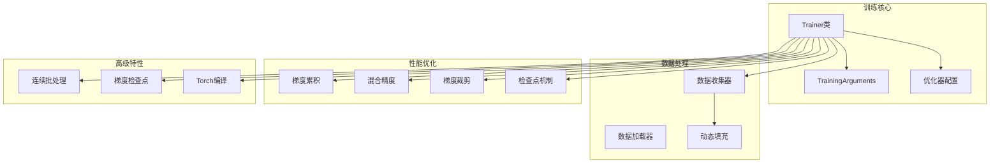

**图表来源**
- [trainer.py](file://src/transformers/trainer.py#L1-L100)
- [training_args.py](file://src/transformers/training_args.py#L1-L100)

## 核心性能优化组件

### 梯度累积机制

梯度累积允许在有限的GPU内存下模拟更大的批次大小：

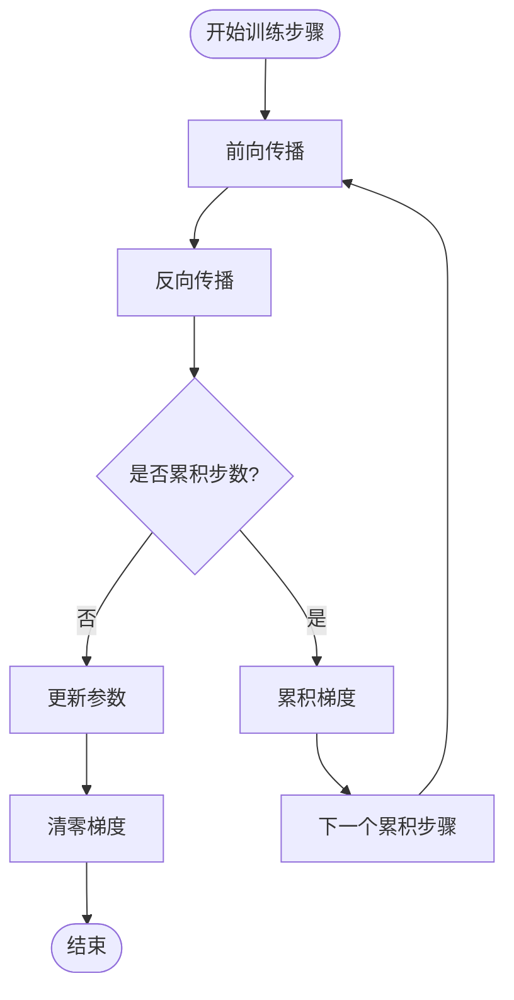

**图表来源**
- [trainer.py](file://src/transformers/trainer.py#L2507-L2529)

### 混合精度训练

支持FP16和BF16混合精度训练，显著减少内存使用并加速计算：

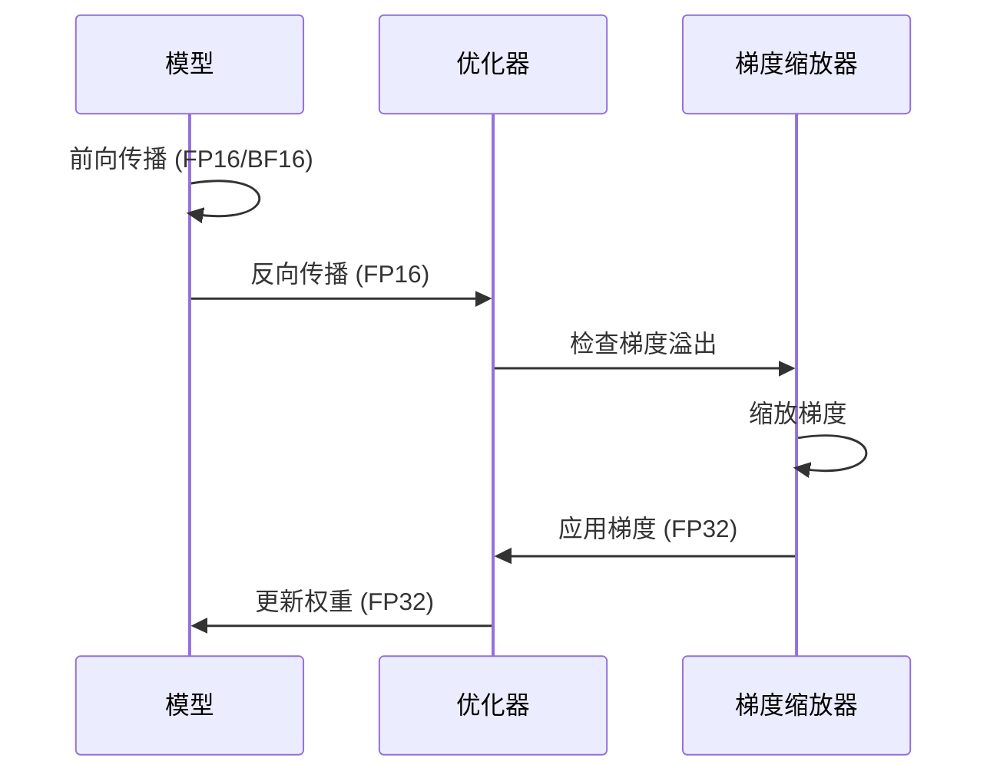

**图表来源**
- [trainer.py](file://src/transformers/trainer.py#L1728-L1752)

**章节来源**
- [trainer.py](file://src/transformers/trainer.py#L1728-L1752)
- [training_args.py](file://src/transformers/training_args.py#L1589-L1614)

## 架构概览

### 训练流程架构

**图表来源**
- [trainer.py](file://src/transformers/trainer.py#L800-L1200)
- [data_collator.py](file://src/transformers/data/data_collator.py#L1-L200)

## 详细组件分析

### 梯度累积实现

梯度累积通过调整`gradient_accumulation_steps`参数实现：

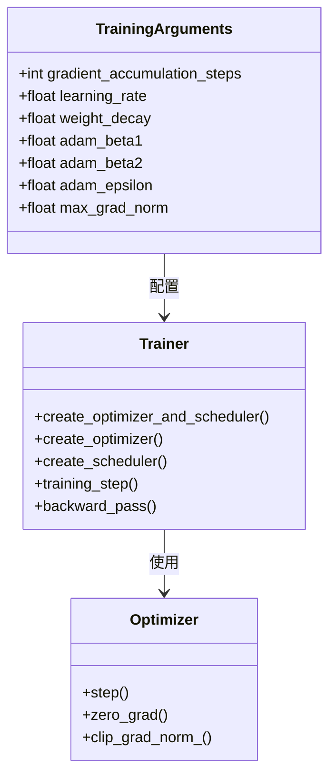

**图表来源**
- [training_args.py](file://src/transformers/training_args.py#L799-L899)
- [trainer.py](file://src/transformers/trainer.py#L1100-L1200)

### 混合精度训练配置

混合精度训练通过以下参数控制：

| 参数 | 类型 | 默认值 | 描述 |
|------|------|--------|------|
| `fp16` | bool | False | 启用FP16混合精度训练 |
| `bf16` | bool | False | 启用BF16混合精度训练 |
| `tf32` | bool | None | 启用TensorFloat-32格式 |
| `optimization_level` | str | "O1" | 优化级别 |

**章节来源**
- [training_args.py](file://src/transformers/training_args.py#L400-L500)

### 梯度裁剪机制

梯度裁剪防止梯度爆炸问题：

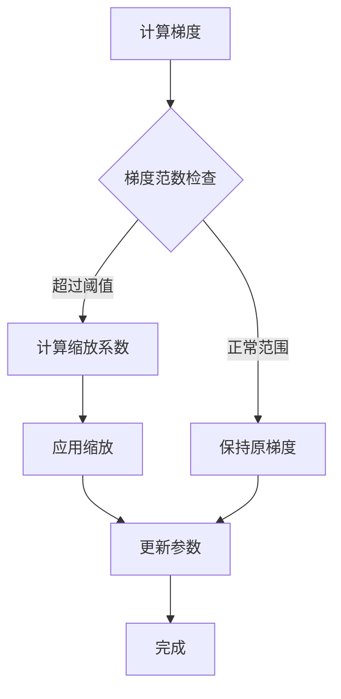

**图表来源**
- [trainer.py](file://src/transformers/trainer.py#L2507-L2529)

**章节来源**
- [trainer.py](file://src/transformers/trainer.py#L2507-L2529)

### 连续批处理系统

连续批处理允许多个请求同时处理，提高GPU利用率：

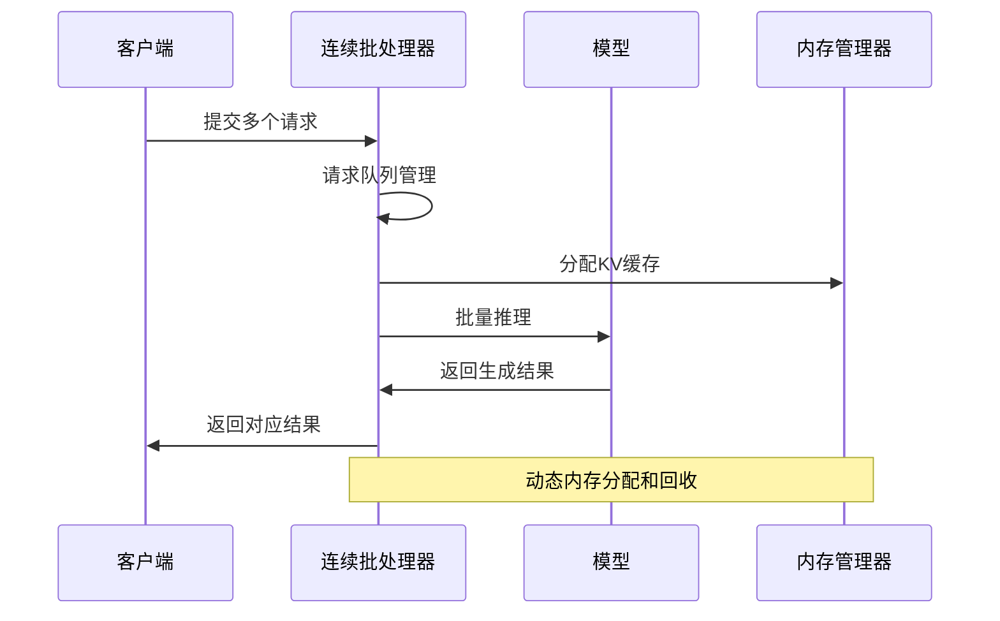

**图表来源**
- [continuous_batching.py](file://examples/pytorch/continuous_batching.py#L100-L200)

**章节来源**
- [continuous_batching.py](file://examples/pytorch/continuous_batching.py#L1-L302)
- [continuous_batching_simple.py](file://examples/pytorch/continuous_batching_simple.py#L1-L110)

### 数据填充优化

动态填充策略平衡内存使用和计算效率：

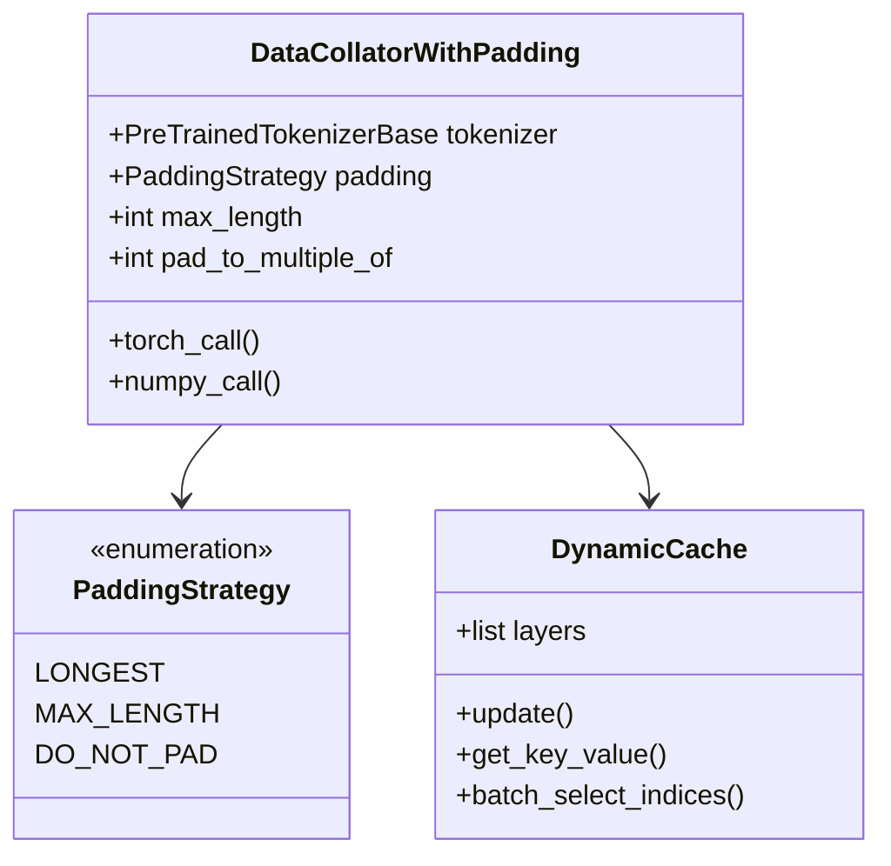

**图表来源**
- [data_collator.py](file://src/transformers/data/data_collator.py#L200-L400)

**章节来源**
- [data_collator.py](file://src/transformers/data/data_collator.py#L200-L400)

### 学习率调度器

多种学习率调度策略支持不同的训练需求：

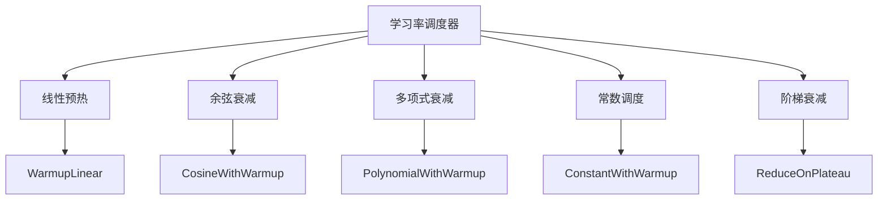

**图表来源**
- [optimization.py](file://src/transformers/optimization.py#L578-L601)

**章节来源**
- [optimization.py](file://src/transformers/optimization.py#L1-L300)

### 检查点机制

完整的模型状态保存和恢复系统：

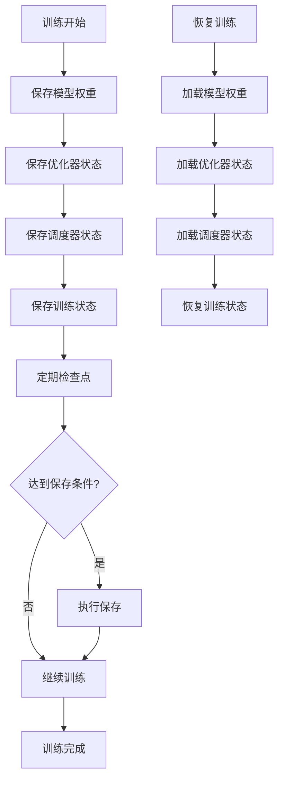

**图表来源**
- [trainer.py](file://src/transformers/trainer.py#L3184-L3351)

**章节来源**
- [trainer.py](file://src/transformers/trainer.py#L3184-L3351)

## 依赖关系分析

### 核心依赖图

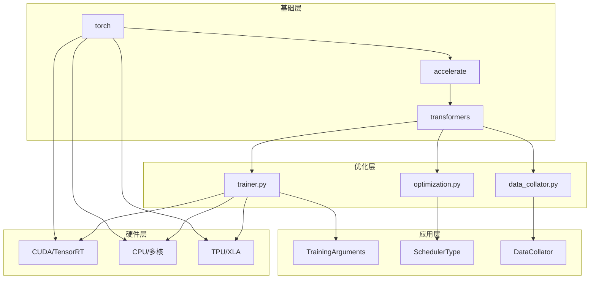

**图表来源**
- [trainer.py](file://src/transformers/trainer.py#L1-L100)
- [training_args.py](file://src/transformers/training_args.py#L1-L100)

**章节来源**
- [trainer.py](file://src/transformers/trainer.py#L1-L100)
- [training_args.py](file://src/transformers/training_args.py#L1-L100)

## 性能考虑因素

### 内存优化策略

1. **梯度检查点**：通过重新计算激活值减少内存使用
2. **动态批处理**：根据序列长度动态调整批次大小
3. **混合精度**：使用半精度浮点数减少内存占用
4. **模型并行**：将大模型分割到多个设备上

### 计算优化技术

1. **Torch编译**：自动优化计算图
2. **Flash Attention**：高效注意力计算
3. **分组卷积**：减少计算复杂度
4. **量化训练**：降低数值精度要求

### 网络通信优化

1. **梯度压缩**：减少通信开销
2. **异步通信**：重叠计算和通信
3. **拓扑感知**：优化通信模式
4. **带宽聚合**：充分利用网络资源

## 故障排除指南

### 常见性能问题

#### OOM错误处理

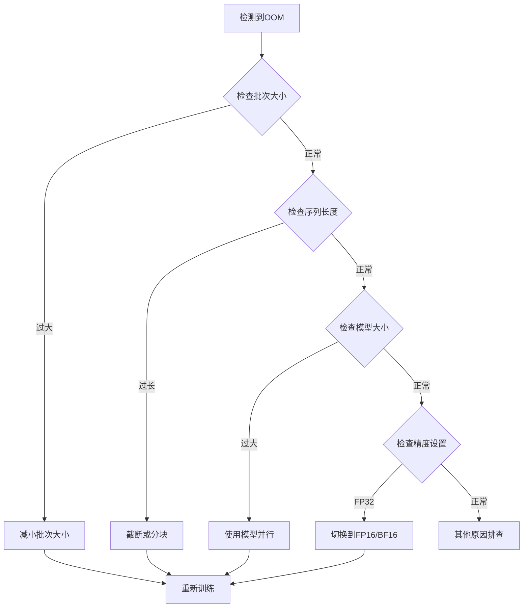

#### 训练稳定性保障

1. **梯度裁剪**：防止梯度爆炸
2. **学习率调整**：避免训练发散
3. **标签平滑**：提高泛化能力
4. **正则化技术**：防止过拟合

**章节来源**
- [trainer.py](file://src/transformers/trainer.py#L2507-L2529)
- [training_args.py](file://src/transformers/training_args.py#L400-L500)

## 结论

Hugging Face Transformers库提供了全面的性能优化解决方案，涵盖了从基础的梯度累积到高级的连续批处理等各种技术。通过合理配置这些优化技术，可以显著提升训练效率，减少资源消耗，并获得更好的训练稳定性。

关键要点：
- 梯度累积和混合精度训练是提升硬件利用率的核心技术
- 动态填充和连续批处理优化了内存使用和吞吐量
- 完整的检查点机制确保了训练过程的可靠性
- 多样化的学习率调度策略适应不同训练场景

建议在实际应用中根据具体需求选择合适的优化组合，并进行充分的性能测试和调优。