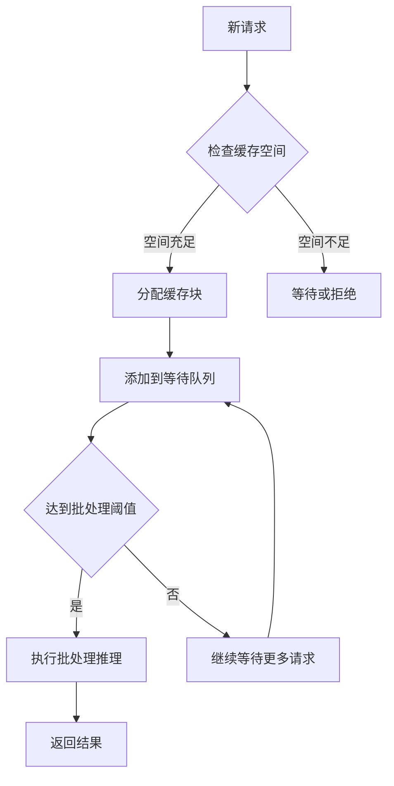
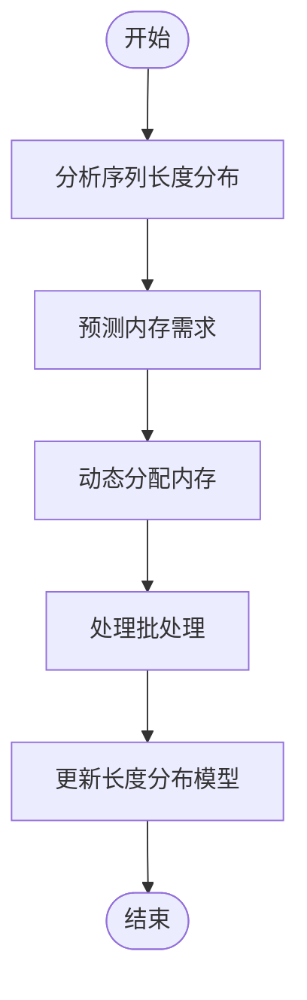
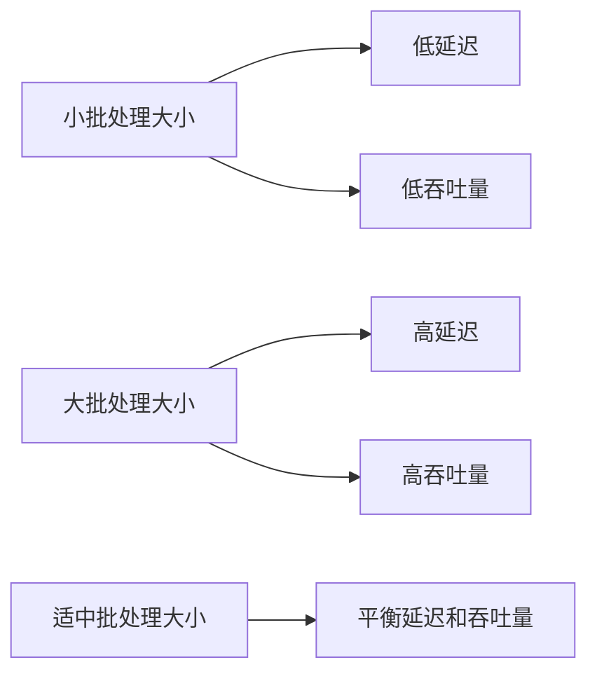
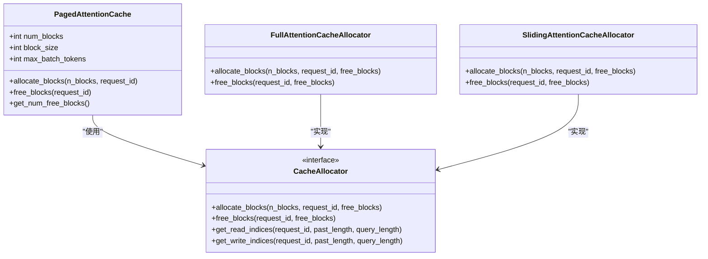
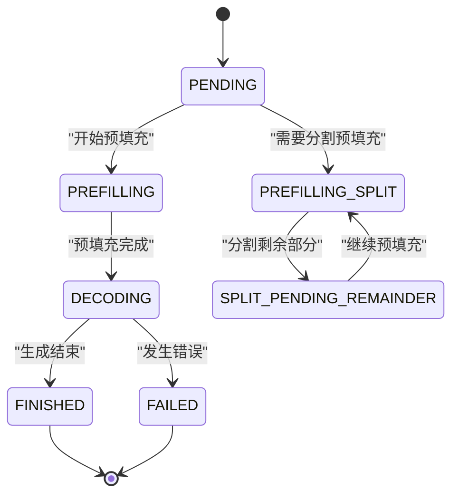
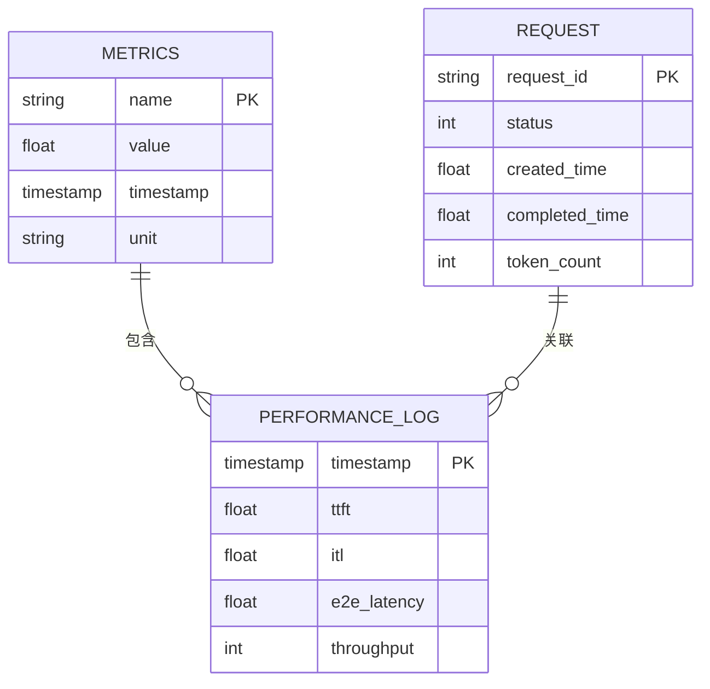

# 批处理优化

<cite>
**本文档中引用的文件**
- [continuous_batching.py](file://examples/pytorch/continuous_batching.py)
- [continuous_batching_simple.py](file://examples/pytorch/continuous_batching_simple.py)
- [cache.py](file://src/transformers/generation/continuous_batching/cache.py)
- [scheduler.py](file://src/transformers/generation/continuous_batching/scheduler.py)
- [requests.py](file://src/transformers/generation/continuous_batching/requests.py)
- [continuous_api.py](file://src/transformers/generation/continuous_batching/continuous_api.py)
- [data_collator.py](file://src/transformers/data/data_collator.py)
- [metrics.py](file://src/transformers/utils/metrics.py)
</cite>

## 目录
1. [引言](#引言)
2. [连续批处理机制](#连续批处理机制)
3. [动态填充策略](#动态填充策略)
4. [批处理大小对性能的影响](#批处理大小对性能的影响)
5. [内存管理与缓存策略](#内存管理与缓存策略)
6. [调度器实现与请求管理](#调度器实现与请求管理)
7. [性能监控与指标分析](#性能监控与指标分析)
8. [代码示例与实现](#代码示例与实现)
9. [常见性能瓶颈与解决方案](#常见性能瓶颈与解决方案)
10. [结论](#结论)

## 引言
批处理优化是提高深度学习模型推理效率的关键技术，特别是在处理大规模语言模型时。本文档深入探讨了连续批处理和动态填充策略，详细说明了这些技术如何减少padding开销、提高GPU利用率，并优化吞吐量和延迟。通过分析Hugging Face Transformers库中的相关实现，我们将揭示批处理系统的核心工作机制，并提供实用的调优建议。

## 连续批处理机制
连续批处理是一种先进的推理优化技术，它允许模型在处理多个请求时动态地组合和调度这些请求，从而最大化硬件利用率。该机制的核心在于请求调度、缓存管理和内存分配策略的协同工作。

连续批处理通过将多个独立的推理请求合并到一个批次中来执行，这不仅减少了模型调用的开销，还能够更好地利用GPU的并行计算能力。在实现上，系统维护一个请求队列，根据当前的资源状况和请求特性动态决定哪些请求可以被组合在一起进行处理。



**图示来源**
- [cache.py](file://src/transformers/generation/continuous_batching/cache.py#L217-L239)
- [scheduler.py](file://src/transformers/generation/continuous_batching/scheduler.py#L105-L122)

**本节来源**
- [continuous_batching.py](file://examples/pytorch/continuous_batching.py#L0-L301)
- [continuous_api.py](file://src/transformers/generation/continuous_batching/continuous_api.py#L1027-L1060)

## 动态填充策略
动态填充策略是减少padding开销、提高GPU利用率的重要手段。传统的静态填充方法通常会导致大量的无效计算，因为所有序列都被填充到批次中最长序列的长度。而动态填充则根据实际需要为每个序列分配精确的内存空间，从而显著减少了计算资源的浪费。

在实现上，动态填充策略通过分析序列长度分布来优化内存分配。系统会收集历史请求的序列长度信息，建立长度分布模型，然后根据这个模型预测未来的内存需求。这种方法不仅可以减少内存碎片，还能提高缓存命中率，进一步提升整体性能。



**图示来源**
- [data_collator.py](file://src/transformers/data/data_collator.py#L217-L239)
- [cache.py](file://src/transformers/generation/continuous_batching/cache.py#L241-L261)

**本节来源**
- [data_collator.py](file://src/transformers/data/data_collator.py#L0-L799)
- [cache.py](file://src/transformers/generation/continuous_batching/cache.py#L0-L603)

## 批处理大小对性能的影响
批处理大小是影响模型推理性能的关键参数之一。它直接关系到吞吐量和延迟之间的平衡。较小的批处理大小可以降低单个请求的延迟，但可能会牺牲整体吞吐量；而较大的批处理大小虽然能提高吞吐量，但可能导致个别请求的延迟增加。

在不同硬件配置下，最优的批处理大小也会有所不同。例如，在具有大容量显存的高端GPU上，可以使用更大的批处理大小来充分利用硬件资源；而在资源受限的设备上，则需要选择更小的批处理大小以避免内存溢出。

通过对批处理大小的调优，可以在特定应用场景下找到最佳的性能平衡点。实验表明，适当的批处理大小调整可以使吞吐量提升数倍，同时保持可接受的延迟水平。



**图示来源**
- [continuous_batching.py](file://examples/pytorch/continuous_batching.py#L217-L240)
- [metrics.py](file://src/transformers/utils/metrics.py#L211-L243)

**本节来源**
- [benchmark_v2/framework/data_classes.py](file://benchmark_v2/framework/data_classes.py#L85-L166)
- [metrics.py](file://src/transformers/utils/metrics.py#L0-L404)

## 内存管理与缓存策略
高效的内存管理和缓存策略是实现高性能批处理系统的基础。在连续批处理中，内存分配和回收必须快速且高效，以确保系统能够及时响应新的请求。

PagedAttentionCache是Hugging Face Transformers库中实现的一种高效缓存机制。它采用分页式内存管理，将缓存划分为固定大小的块，每个块可以独立分配和释放。这种设计不仅减少了内存碎片，还提高了内存分配的效率。

缓存策略还包括对KV缓存的管理。系统会根据请求的状态和优先级动态调整缓存的分配，确保关键请求能够获得足够的资源。此外，通过预估内存需求和自动调整缓存大小，系统能够在不同负载条件下保持稳定的性能表现。



**图示来源**
- [cache.py](file://src/transformers/generation/continuous_batching/cache.py#L0-L603)
- [cache_manager.py](file://src/transformers/generation/continuous_batching/cache_manager.py#L57-L78)

**本节来源**
- [cache.py](file://src/transformers/generation/continuous_batching/cache.py#L0-L603)
- [cache_manager.py](file://src/transformers/generation/continuous_batching/cache_manager.py#L0-L150)

## 调度器实现与请求管理
调度器在连续批处理系统中扮演着核心角色，负责管理请求的生命周期和调度决策。Hugging Face Transformers库提供了多种调度策略，包括FIFO（先进先出）和PrefillFirst（预填充优先）等。

FIFO调度器按照请求到达的顺序进行处理，保证了公平性，但在高负载情况下可能导致长请求阻塞短请求。PrefillFirst调度器则优先处理需要预填充的请求，有助于减少整体延迟。

请求管理涉及请求状态的跟踪和更新。每个请求都有一个状态机，记录其当前所处的阶段（如等待、预填充、解码等）。调度器根据请求状态和系统资源状况做出调度决策，确保资源的最优利用。



**图示来源**
- [scheduler.py](file://src/transformers/generation/continuous_batching/scheduler.py#L0-L299)
- [requests.py](file://src/transformers/generation/continuous_batching/requests.py#L0-L205)

**本节来源**
- [scheduler.py](file://src/transformers/generation/continuous_batching/scheduler.py#L0-L299)
- [requests.py](file://src/transformers/generation/continuous_batching/requests.py#L0-L205)

## 性能监控与指标分析
有效的性能监控是优化批处理系统的关键。Hugging Face Transformers库提供了一套完整的性能指标收集和分析工具，帮助开发者深入了解系统的运行状况。

关键性能指标包括：
- **活跃请求数量**：当前正在处理的请求数量
- **等待请求数量**：排队等待处理的请求数量
- **端到端延迟**：从请求提交到结果返回的总时间
- **首令牌时间**（TTFT）：从请求提交到第一个生成令牌的时间
- **令牌间延迟**（ITL）：连续生成令牌之间的时间间隔
- **吞吐量**：单位时间内处理的令牌数量

这些指标不仅有助于评估系统的整体性能，还能帮助识别潜在的性能瓶颈。通过持续监控这些指标，可以及时发现并解决性能问题，确保系统稳定高效运行。



**图示来源**
- [metrics.py](file://src/transformers/utils/metrics.py#L0-L404)
- [benchmark_v2/framework/data_classes.py](file://benchmark_v2/framework/data_classes.py#L0-L44)

**本节来源**
- [metrics.py](file://src/transformers/utils/metrics.py#L0-L404)
- [benchmark_v2/framework/data_classes.py](file://benchmark_v2/framework/data_classes.py#L0-L166)

## 代码示例与实现
以下是一个完整的连续批处理系统实现示例，展示了如何使用Hugging Face Transformers库中的API来构建高效的批处理系统。

```python
# 初始化模型和分词器
model = AutoModelForCausalLM.from_pretrained(MODEL_ID, attn_implementation=args.attn, dtype=torch.bfloat16)
tokenizer = AutoTokenizer.from_pretrained(MODEL_ID, padding_side="left")

# 配置生成参数
generation_config = GenerationConfig(
    max_new_tokens=512,
    use_cuda_graph=use_cuda_graph,
    eos_token_id=tokenizer.pad_token_id if FORCE_MAX_LENGTH else tokenizer.eos_token_id,
    pad_token_id=tokenizer.pad_token_id,
    do_sample=not args.compare,
    temperature=0.8,
    top_p=0.9,
    num_blocks=args.num_blocks,
    max_batch_tokens=args.max_batch_tokens,
)

# 执行批处理生成
batch_outputs = model.generate_batch(
    inputs=simple_batch_inputs,
    generation_config=generation_config,
)
```

这个示例展示了从模型加载、参数配置到批处理生成的完整流程。通过合理配置生成参数，可以充分发挥连续批处理的优势，实现高性能的推理服务。

**本节来源**
- [continuous_batching.py](file://examples/pytorch/continuous_batching.py#L0-L301)
- [continuous_batching_simple.py](file://examples/pytorch/continuous_batching_simple.py#L0-L109)

## 常见性能瓶颈与解决方案
在实际应用中，批处理系统可能会遇到各种性能瓶颈。以下是几个常见的问题及其解决方案：

1. **内存碎片**：由于频繁的内存分配和释放，可能导致内存碎片化。解决方案是采用分页式内存管理，如PagedAttentionCache，减少碎片产生。

2. **负载不均衡**：不同请求的处理时间差异可能导致负载不均衡。可以通过动态调整批处理大小和优先级调度来缓解这个问题。

3. **缓存命中率低**：低效的缓存策略可能导致缓存命中率低下。优化缓存替换算法和预取策略可以提高缓存效率。

4. **GPU利用率不足**：某些情况下GPU可能无法充分利用。通过混合精度训练、CUDA图优化等技术可以提高GPU利用率。

针对这些问题，Hugging Face Transformers库提供了多种内置优化机制，结合合理的系统配置和调优策略，可以有效解决这些性能瓶颈。

**本节来源**
- [cache.py](file://src/transformers/generation/continuous_batching/cache.py#L0-L603)
- [scheduler.py](file://src/transformers/generation/continuous_batching/scheduler.py#L0-L299)
- [metrics.py](file://src/transformers/utils/metrics.py#L0-L404)

## 结论
批处理优化是提升深度学习模型推理性能的关键技术。通过深入理解连续批处理和动态填充策略的工作机制，结合有效的内存管理、调度算法和性能监控，可以构建出高效、稳定的批处理系统。Hugging Face Transformers库提供了丰富的工具和API，为实现这些优化提供了坚实的基础。未来的工作可以进一步探索自适应批处理策略和更智能的资源调度算法，以应对日益复杂的应用场景。