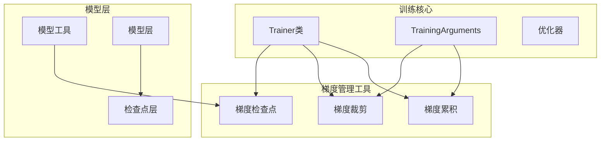
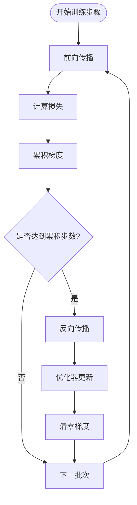
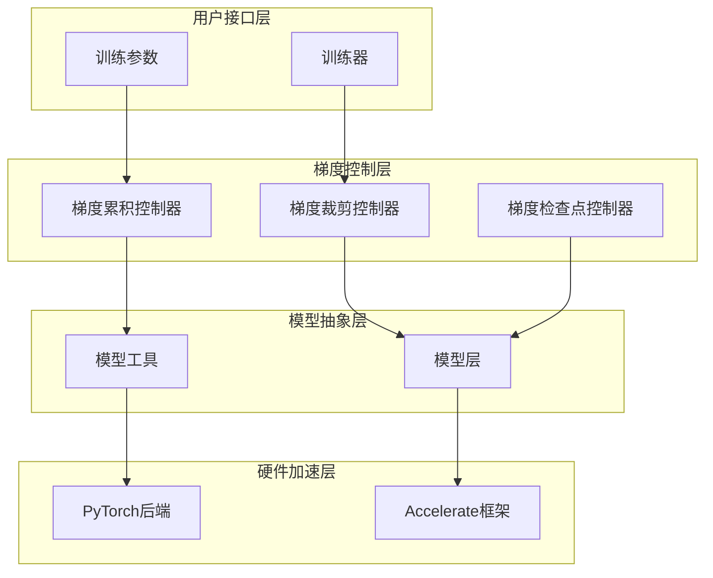
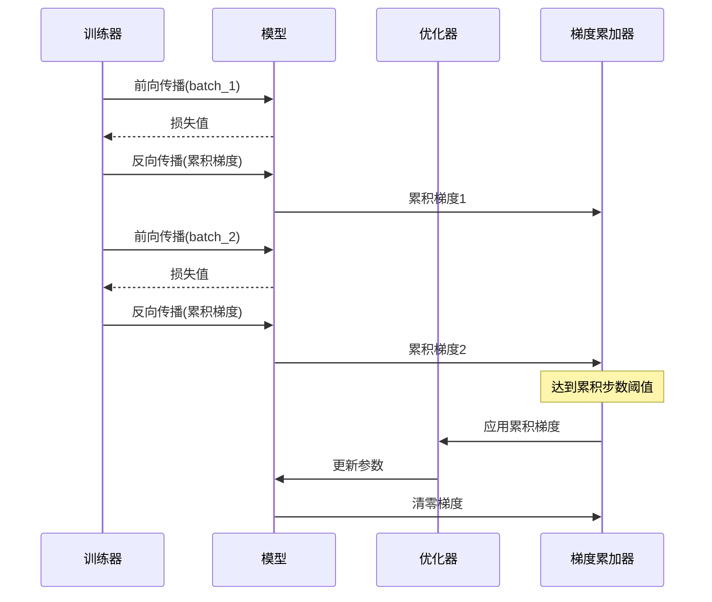
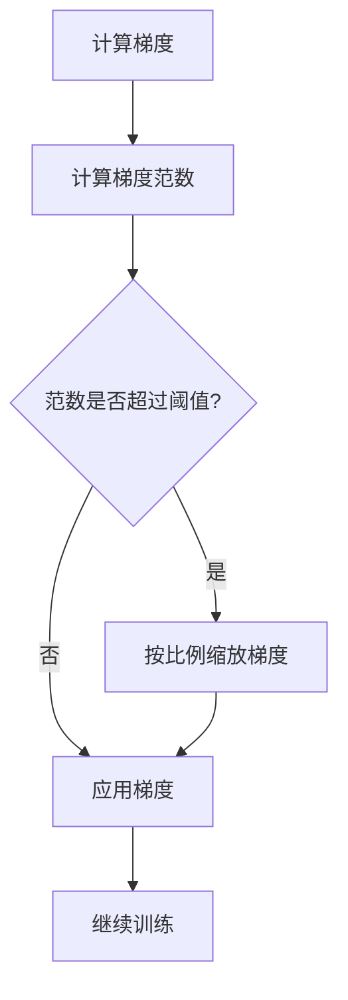
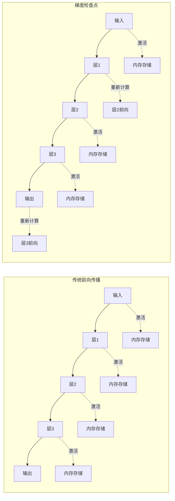
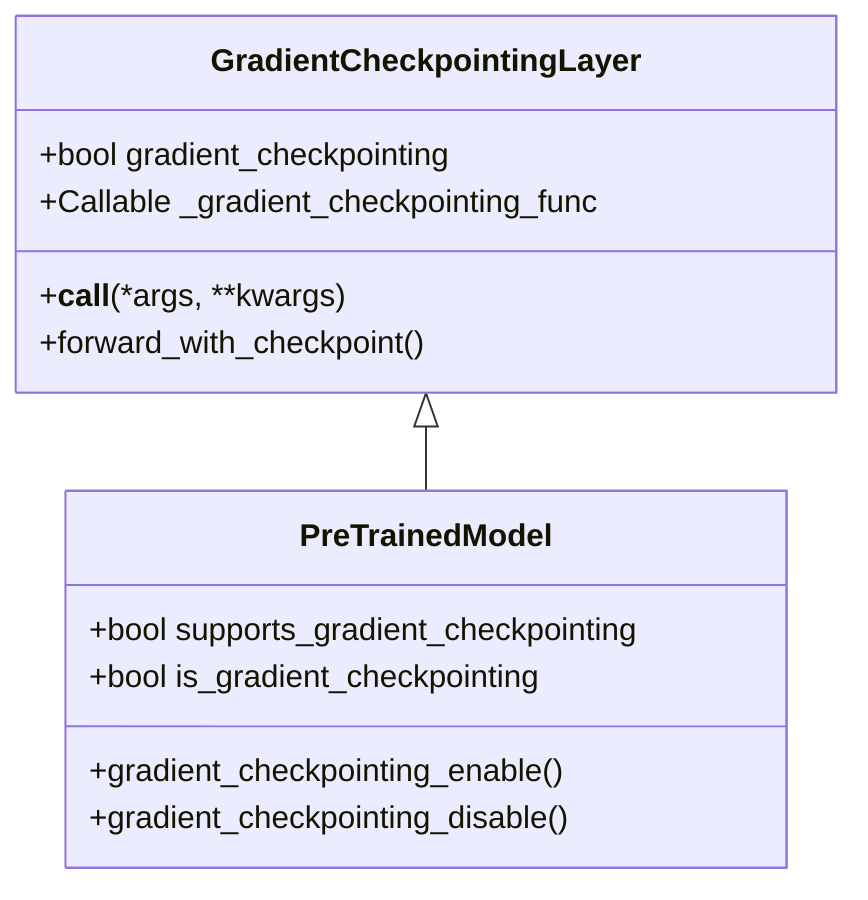
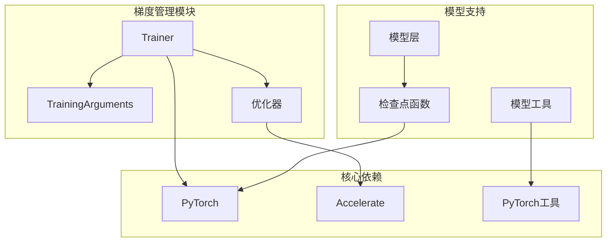

# 梯度管理

<cite>
**本文档引用的文件**
- [trainer.py](file://src/transformers/trainer.py)
- [training_args.py](file://src/transformers/training_args.py)
- [optimization.py](file://src/transformers/optimization.py)
- [trainer_pt_utils.py](file://src/transformers/trainer_pt_utils.py)
- [modeling_utils.py](file://src/transformers/modeling_utils.py)
- [modeling_layers.py](file://src/transformers/modeling_layers.py)
- [3D_parallel.py](file://examples/3D_parallel.py)
- [3d_parallel_checks.py](file://examples/pytorch/3d_parallel_checks.py)
- [run_clm.py](file://examples/pytorch/language-modeling/run_clm.py)
</cite>

## 目录
1. [简介](#简介)
2. [项目结构](#项目结构)
3. [核心组件](#核心组件)
4. [架构概览](#架构概览)
5. [详细组件分析](#详细组件分析)
6. [依赖关系分析](#依赖关系分析)
7. [性能考虑](#性能考虑)
8. [故障排除指南](#故障排除指南)
9. [结论](#结论)

## 简介

梯度管理是深度学习训练过程中的关键组成部分，它直接影响模型的收敛性、稳定性和内存效率。本文档深入探讨了transformers库中梯度管理的各个方面，包括梯度累积、梯度裁剪和检查点机制的实现方法。

梯度管理主要包含三个核心概念：
- **梯度累积**：通过多次小批量处理累积梯度，模拟大批次训练效果
- **梯度裁剪**：防止梯度爆炸问题，确保训练稳定性
- **梯度检查点**：在内存和计算之间进行权衡，支持更大模型的训练

## 项目结构

transformers库中的梯度管理功能分布在多个模块中，形成了一个完整的梯度管理系统：



**图表来源**
- [trainer.py](file://src/transformers/trainer.py#L1-L100)
- [training_args.py](file://src/transformers/training_args.py#L1-L50)
- [modeling_utils.py](file://src/transformers/modeling_utils.py#L3359-L3396)

## 核心组件

### 训练参数配置

训练参数是梯度管理的基础配置，主要包括以下关键参数：

| 参数名称 | 类型 | 默认值 | 描述 |
|---------|------|--------|------|
| `gradient_accumulation_steps` | int | 1 | 梯度累积步数 |
| `max_grad_norm` | float | 1.0 | 最大梯度范数 |
| `per_device_train_batch_size` | int | 8 | 每设备训练批次大小 |
| `learning_rate` | float | 5e-5 | 学习率 |

**章节来源**
- [training_args.py](file://src/transformers/training_args.py#L220-L240)

### 梯度累积机制

梯度累积允许在有限内存条件下模拟大批次训练：



**图表来源**
- [trainer.py](file://src/transformers/trainer.py#L2417-L2437)

**章节来源**
- [trainer.py](file://src/transformers/trainer.py#L2417-L2437)

## 架构概览

梯度管理系统采用分层架构设计，从底层的PyTorch操作到高层的训练接口：



**图表来源**
- [trainer.py](file://src/transformers/trainer.py#L1-L200)
- [modeling_utils.py](file://src/transformers/modeling_utils.py#L3359-L3396)

## 详细组件分析

### 梯度累积实现

梯度累积通过调整全局批次大小来模拟大批次训练效果：

#### 数学原理

梯度累积的核心思想是将多个小批次的梯度累积起来，等效于单个大批次的梯度：

```
effective_batch_size = per_device_batch_size × gradient_accumulation_steps × num_devices
```

#### 实现细节



**图表来源**
- [trainer.py](file://src/transformers/trainer.py#L2417-L2437)

**章节来源**
- [trainer.py](file://src/transformers/trainer.py#L2417-L2437)

### 梯度裁剪机制

梯度裁剪防止梯度爆炸问题，确保训练过程的数值稳定性：

#### 裁剪策略类型

1. **范数裁剪（Norm-based）**
   - 计算梯度范数
   - 如果超过阈值，则按比例缩放梯度

2. **值裁剪（Value-based）**
   - 直接限制梯度的最大绝对值

#### 数学公式

范数裁剪的核心公式：
```
clip_coef = max_norm / (grad_norm + ε)
if clip_coef < 1:
    grad = grad × clip_coef
```

#### 实现流程



**图表来源**
- [trainer.py](file://src/transformers/trainer.py#L2507-L2529)
- [3D_parallel.py](file://examples/3D_parallel.py#L419-L433)

**章节来源**
- [trainer.py](file://src/transformers/trainer.py#L2507-L2529)
- [3D_parallel.py](file://examples/3D_parallel.py#L419-L433)

### 梯度检查点机制

梯度检查点是一种内存-计算权衡技术，通过存储部分激活值来减少内存使用：

#### 工作原理



**图表来源**
- [modeling_layers.py](file://src/transformers/modeling_layers.py#L31-L63)
- [modeling_utils.py](file://src/transformers/modeling_utils.py#L3359-L3396)

#### 检查点层实现



**图表来源**
- [modeling_layers.py](file://src/transformers/modeling_layers.py#L31-L63)
- [modeling_utils.py](file://src/transformers/modeling_utils.py#L3359-L3396)

**章节来源**
- [modeling_layers.py](file://src/transformers/modeling_layers.py#L31-L63)
- [modeling_utils.py](file://src/transformers/modeling_utils.py#L3359-L3396)

## 依赖关系分析

梯度管理系统的依赖关系体现了其模块化设计：



**图表来源**
- [trainer.py](file://src/transformers/trainer.py#L1-L100)
- [modeling_utils.py](file://src/transformers/modeling_utils.py#L1-L50)

**章节来源**
- [trainer.py](file://src/transformers/trainer.py#L1-L100)
- [modeling_utils.py](file://src/transformers/modeling_utils.py#L1-L50)

## 性能考虑

### 内存优化策略

1. **梯度累积vs批次大小**
   - 小批次+梯度累积：内存友好，但可能影响收敛
   - 大批次：内存需求高，但训练更稳定

2. **梯度检查点权衡**
   - 更多检查点：内存使用更少，计算开销更高
   - 更少检查点：内存使用更多，计算更快

3. **混合精度训练**
   - FP16/BF16：减少内存使用，提高训练速度
   - 需要配合梯度缩放

### 性能监控指标

| 指标类型 | 监控项 | 正常范围 | 异常处理 |
|---------|--------|----------|----------|
| 内存使用 | GPU内存占用 | < 显存容量的80% | 启用检查点或减小批次 |
| 梯度状态 | 梯度范数 | 0.1-100 | 调整裁剪阈值 |
| 训练稳定性 | 损失波动 | 平滑下降 | 检查学习率和梯度裁剪 |

## 故障排除指南

### 常见问题及解决方案

1. **CUDA Out of Memory**
   - 减小批次大小
   - 启用梯度检查点
   - 使用梯度累积

2. **梯度爆炸**
   - 降低学习率
   - 增加梯度裁剪阈值
   - 检查数据预处理

3. **训练不稳定**
   - 调整梯度累积步数
   - 使用学习率调度器
   - 检查数据质量

**章节来源**
- [trainer.py](file://src/transformers/trainer.py#L2507-L2529)

## 结论

transformers库提供了完整的梯度管理解决方案，涵盖了现代深度学习训练中的各种需求。通过合理配置梯度累积、梯度裁剪和梯度检查点，可以在内存限制和训练效率之间找到最佳平衡点。

关键要点：
- 梯度累积适合内存受限环境
- 梯度裁剪是训练稳定性的保障
- 梯度检查点是大模型训练的必要技术
- 组合使用可以获得最佳效果

未来的改进方向包括：
- 自适应梯度管理算法
- 更智能的检查点策略
- 分布式环境下的优化