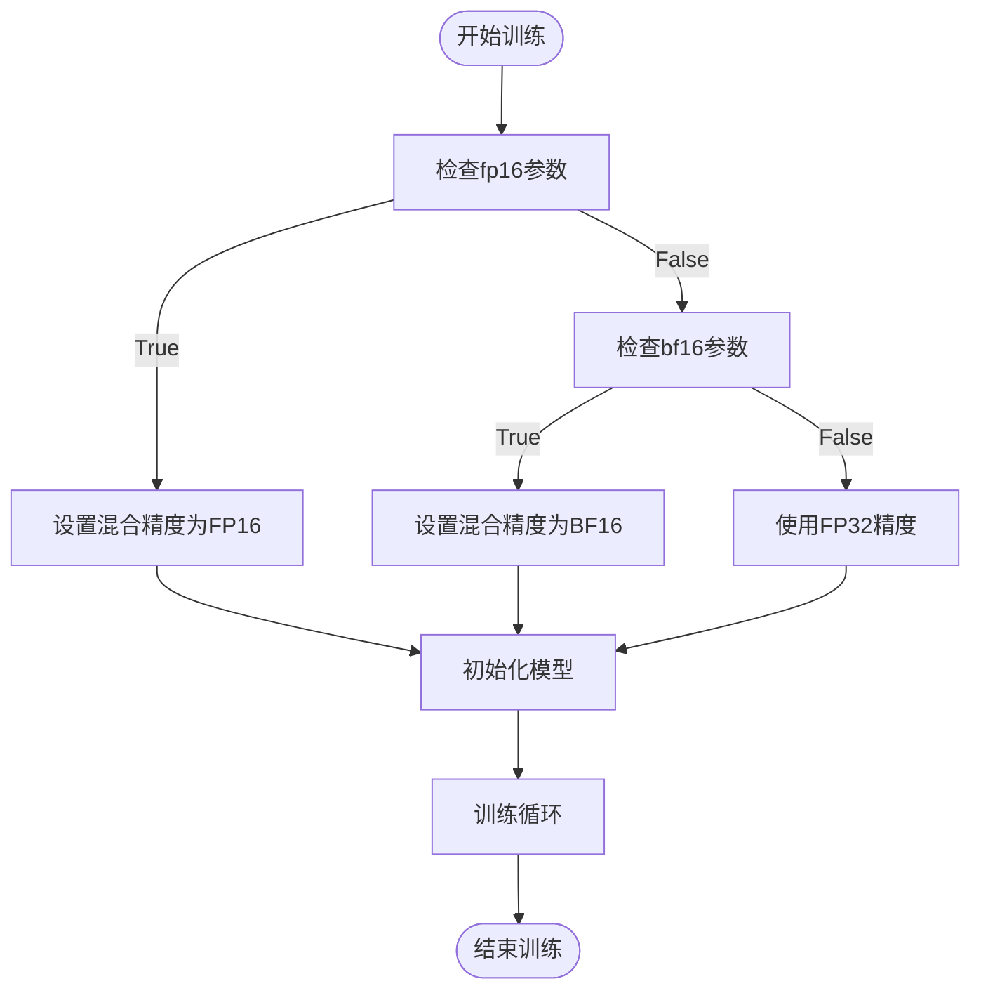
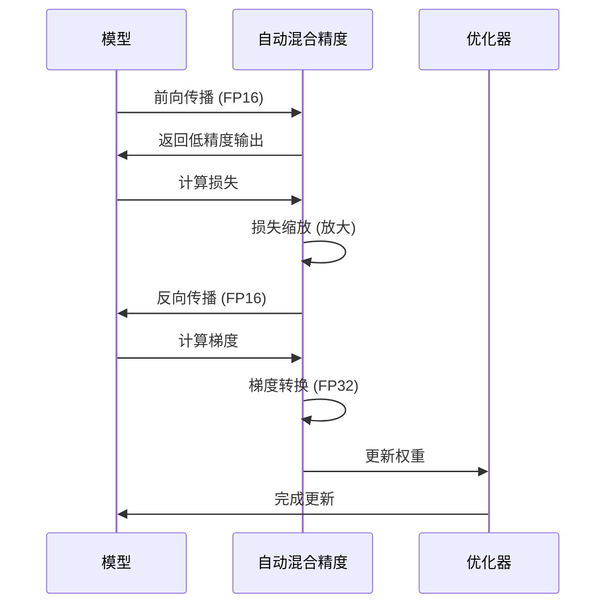

# 混合精度训练

<cite>
**本文档引用的文件**
- [training_args.py](file://src/transformers/training_args.py)
- [trainer.py](file://src/transformers/trainer.py)
- [accelerate.py](file://src/transformers/integrations/accelerate.py)
</cite>

## 目录
1. [引言](#引言)
2. [混合精度训练基础](#混合精度训练基础)
3. [配置混合精度训练](#配置混合精度训练)
4. [自动混合精度（AMP）工作原理](#自动混合精度amp工作原理)
5. [硬件支持与最佳实践](#硬件支持与最佳实践)
6. [数值稳定性与解决方案](#数值稳定性与解决方案)
7. [代码示例与实现](#代码示例与实现)
8. [性能分析与内存占用](#性能分析与内存占用)
9. [结论](#结论)

## 引言
混合精度训练是一种在深度学习模型训练过程中同时使用不同数值精度（如FP16、BF16和FP32）的技术，旨在提高训练速度并减少内存占用，同时保持模型的数值稳定性和收敛性。在Hugging Face Transformers库中，通过`TrainingArguments`和`Trainer`类提供了对混合精度训练的全面支持。本文将深入探讨混合精度训练的实现机制、配置方法、性能影响以及在不同硬件平台上的最佳实践。

## 混合精度训练基础
混合精度训练利用了现代GPU和TPU等硬件对低精度浮点运算的优化，通过在计算密集型操作（如矩阵乘法）中使用较低精度（如FP16或BF16），而在需要高精度的计算（如梯度更新）中使用较高精度（如FP32）来平衡性能和精度。FP16（半精度浮点数）和BF16（脑浮点数）是两种常用的低精度格式，它们分别提供了16位的存储空间，但具有不同的指数和尾数位分配，导致在数值范围和精度上有所差异。

**Section sources**
- [training_args.py](file://src/transformers/training_args.py#L364-L381)

## 配置混合精度训练
在Transformers库中，可以通过`TrainingArguments`类中的几个关键参数来配置混合精度训练。`fp16`和`bf16`参数分别用于启用FP16和BF16混合精度训练，而`fp16_full_eval`和`bf16_full_eval`则用于在评估阶段使用全低精度模式。这些参数的设置直接影响训练过程中的数值精度选择和内存使用。



**Diagram sources**
- [training_args.py](file://src/transformers/training_args.py#L364-L381)
- [trainer.py](file://src/transformers/trainer.py#L676-L697)

**Section sources**
- [training_args.py](file://src/transformers/training_args.py#L364-L381)
- [trainer.py](file://src/transformers/trainer.py#L676-L697)

## 自动混合精度（AMP）工作原理
自动混合精度（AMP）是一种自动化管理混合精度训练的技术，它通过动态调整损失缩放因子来防止梯度下溢或上溢。在训练过程中，AMP会自动在前向传播中使用低精度计算，并在反向传播中将梯度转换回高精度进行更新。损失缩放策略是AMP的核心，它通过放大损失值来避免梯度在低精度表示下的下溢，然后在更新权重前将梯度缩小回原始尺度。



**Diagram sources**
- [trainer.py](file://src/transformers/trainer.py#L3697-L3734)
- [trainer.py](file://src/transformers/trainer.py#L3353-L3378)

**Section sources**
- [trainer.py](file://src/transformers/trainer.py#L3697-L3734)
- [trainer.py](file://src/transformers/trainer.py#L3353-L3378)

## 硬件支持与最佳实践
不同的硬件平台对混合精度训练的支持程度不同。例如，NVIDIA的Ampere架构及更高版本的GPU支持BF16和TF32模式，而Intel的XPU和某些CPU也支持BF16。在配置混合精度训练时，应根据目标硬件的特性选择合适的精度模式。对于GPU，通常推荐使用BF16以获得更好的性能和内存效率；对于TPU，则主要使用BF16。

**Section sources**
- [training_args.py](file://src/transformers/training_args.py#L1508-L1531)

## 数值稳定性与解决方案
尽管混合精度训练可以显著提升训练效率，但也可能引入数值稳定性问题，如梯度溢出或下溢。为了解决这些问题，可以采用梯度裁剪、损失缩放和使用更稳定的优化算法等方法。此外，确保模型的初始化和激活函数的选择不会导致极端的数值范围也是维持数值稳定性的关键。

**Section sources**
- [trainer.py](file://src/transformers/trainer.py#L532-L556)

## 代码示例与实现
以下是一个使用`TrainingArguments`配置混合精度训练的代码示例：

```python
from transformers import TrainingArguments, Trainer

# 配置训练参数
training_args = TrainingArguments(
    output_dir="./results",
    fp16=True,  # 启用FP16混合精度
    per_device_train_batch_size=16,
    per_device_eval_batch_size=16,
    num_train_epochs=3,
    evaluation_strategy="steps",
    eval_steps=500,
    logging_dir="./logs",
)

# 创建Trainer实例
trainer = Trainer(
    model=model,
    args=training_args,
    train_dataset=train_dataset,
    eval_dataset=eval_dataset,
)

# 开始训练
trainer.train()
```

**Section sources**
- [training_args.py](file://src/transformers/training_args.py#L364-L381)
- [trainer.py](file://src/transformers/trainer.py#L4989-L5013)

## 性能分析与内存占用
混合精度训练的主要优势在于减少了内存占用和提高了计算速度。通过使用FP16或BF16，模型的参数和激活值占用的内存大约是FP32的一半，这使得可以在相同的硬件上训练更大的模型或使用更大的批量大小。然而，实际的性能增益取决于具体的硬件支持和模型架构。

**Section sources**
- [training_args.py](file://src/transformers/training_args.py#L364-L381)
- [trainer.py](file://src/transformers/trainer.py#L3378-L3398)

## 结论
混合精度训练是现代深度学习框架中的一项关键技术，它通过合理利用不同精度的数值表示，在保证模型性能的同时显著提升了训练效率。Hugging Face Transformers库通过`TrainingArguments`和`Trainer`类提供了灵活且强大的混合精度训练支持，使开发者能够轻松地在各种硬件平台上实现高效的模型训练。理解并正确配置混合精度训练参数，对于优化模型训练过程至关重要。