# 后训练量化

<cite>
**本文档中引用的文件**
- [bitsandbytes.py](file://src/transformers/integrations/bitsandbytes.py)
- [quantization_config.py](file://src/transformers/utils/quantization_config.py)
- [custom_quantization.py](file://examples/quantization/custom_quantization.py)
- [custom_quantization_int8_example.py](file://examples/quantization/custom_quantization_int8_example.py)
- [base.py](file://src/transformers/quantizers/base.py)
- [quantizer_bnb_8bit.py](file://src/transformers/quantizers/quantizer_bnb_8bit.py)
- [quantizer_bnb_4bit.py](file://src/transformers/quantizers/quantizer_bnb_4bit.py)
- [quant_modules.py](file://src/transformers/models/ibert/quant_modules.py)
- [modeling_ibert.py](file://src/transformers/models/ibert/modeling_ibert.py)
</cite>

## 目录
1. [简介](#简介)
2. [项目结构](#项目结构)
3. [核心组件](#核心组件)
4. [架构概览](#架构概览)
5. [详细组件分析](#详细组件分析)
6. [依赖关系分析](#依赖关系分析)
7. [性能考虑](#性能考虑)
8. [故障排除指南](#故障排除指南)
9. [结论](#结论)

## 简介

后训练量化（Post-Training Quantization, PTQ）是一种在模型训练完成后对神经网络进行量化的技术方法。它通过减少模型参数的数值精度来显著降低模型的存储需求和计算复杂度，同时尽量保持模型的预测性能。本文档深入探讨了Transformers库中实现的各种后训练量化技术，重点关注BitsAndBytes等工具的集成应用。

后训练量化的核心优势在于其简单性和兼容性：无需重新训练模型即可获得显著的性能提升。然而，这也带来了挑战，特别是在处理具有长尾分布的数据和极端值时，需要精心设计量化策略以最小化精度损失。

## 项目结构

Transformers库中的量化功能主要分布在以下几个关键目录中：

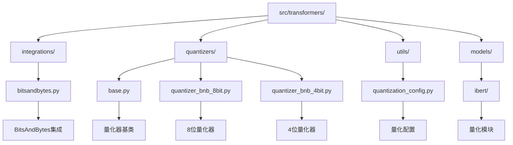

**图表来源**
- [bitsandbytes.py](file://src/transformers/integrations/bitsandbytes.py#L1-L50)
- [base.py](file://src/transformers/quantizers/base.py#L1-L50)
- [quantization_config.py](file://src/transformers/utils/quantization_config.py#L1-L50)

**章节来源**
- [bitsandbytes.py](file://src/transformers/integrations/bitsandbytes.py#L1-L363)
- [quantization_config.py](file://src/transformers/utils/quantization_config.py#L1-L200)

## 核心组件

### 量化配置系统

Transformers提供了灵活的量化配置系统，支持多种量化方法和参数组合：

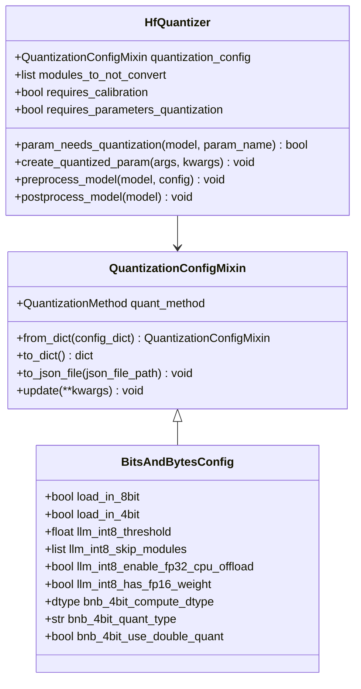

**图表来源**
- [quantization_config.py](file://src/transformers/utils/quantization_config.py#L80-L150)
- [base.py](file://src/transformers/quantizers/base.py#L40-L100)

### BitsAndBytes集成

BitsAndBytes是Transformers中最重要的量化工具包之一，提供了高效的混合精度量化方案：

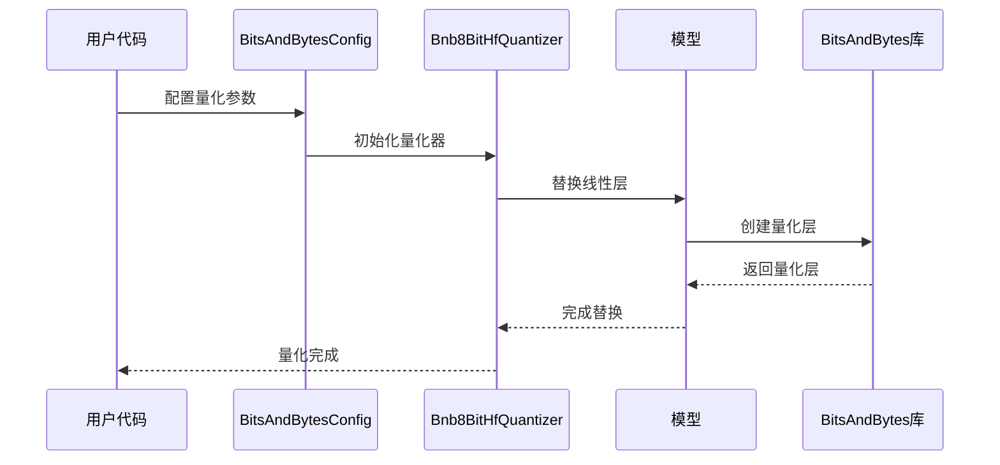

**图表来源**
- [bitsandbytes.py](file://src/transformers/integrations/bitsandbytes.py#L40-L120)
- [quantizer_bnb_8bit.py](file://src/transformers/quantizers/quantizer_bnb_8bit.py#L40-L80)

**章节来源**
- [quantization_config.py](file://src/transformers/utils/quantization_config.py#L442-L468)
- [quantizer_bnb_8bit.py](file://src/transformers/quantizers/quantizer_bnb_8bit.py#L37-L80)

## 架构概览

Transformers的量化架构采用分层设计，从底层的硬件优化到高层的用户接口：

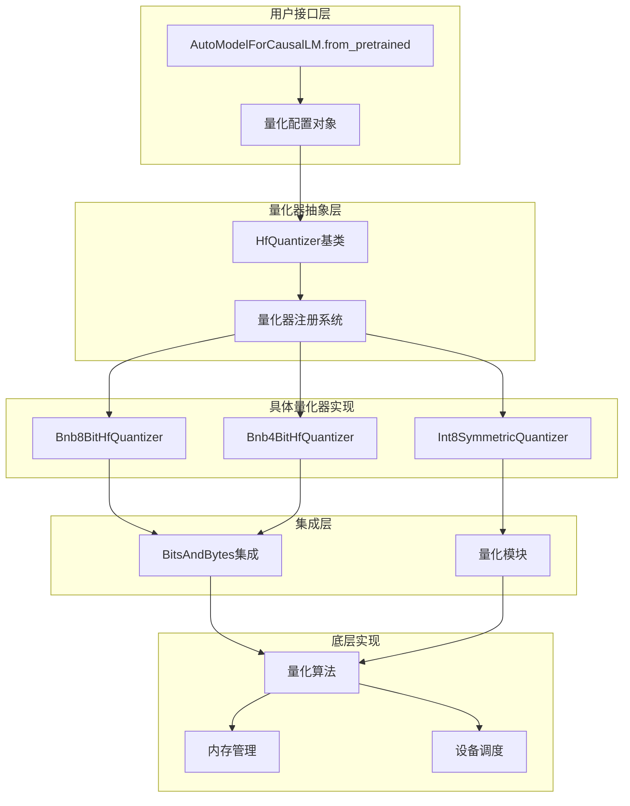

**图表来源**
- [base.py](file://src/transformers/quantizers/base.py#L40-L120)
- [bitsandbytes.py](file://src/transformers/integrations/bitsandbytes.py#L1-L50)

## 详细组件分析

### 动态量化与静态量化对比

动态量化和静态量化代表了两种不同的量化策略：

#### 动态量化
动态量化在推理过程中实时计算量化参数，适用于权重分布变化较大的场景：

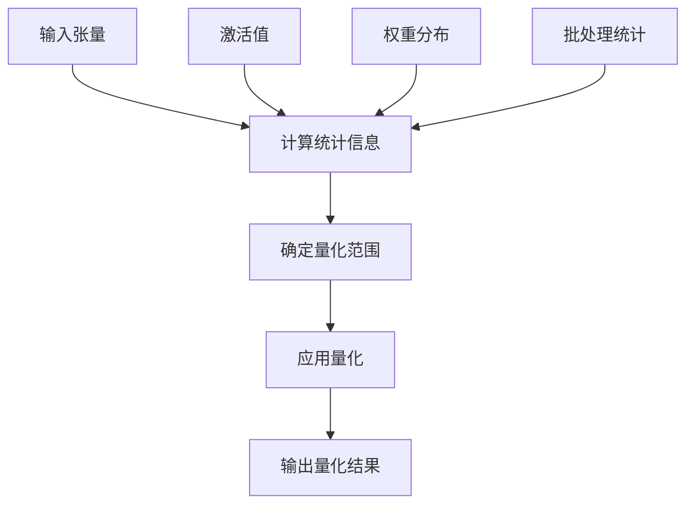

#### 静态量化
静态量化预先计算量化参数，通常通过校准数据集获得最优设置：

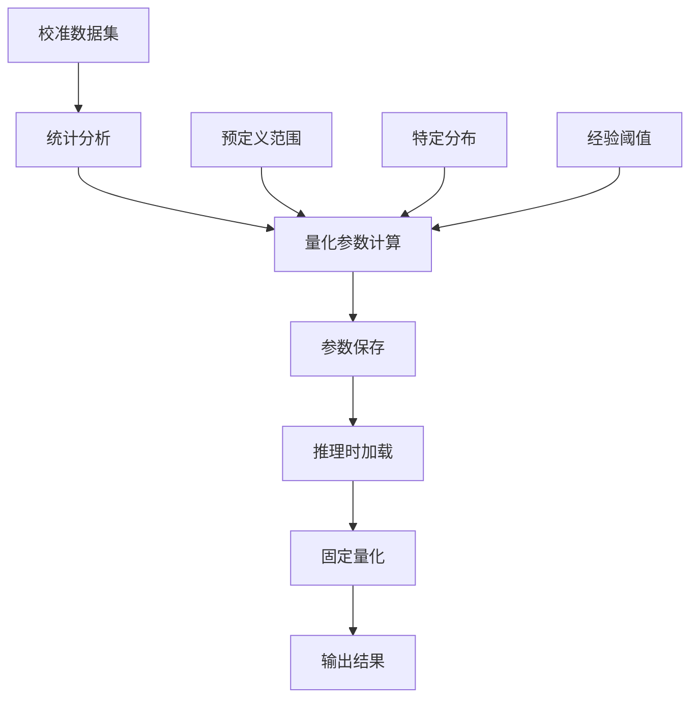

**章节来源**
- [quant_modules.py](file://src/transformers/models/ibert/quant_modules.py#L130-L214)
- [custom_quantization_int8_example.py](file://examples/quantization/custom_quantization_int8_example.py#L171-L197)

### 权重和激活值量化范围确定

量化范围的确定是量化质量的关键因素：

#### 权重量化范围
权重量化通常采用对称量化策略，基于权重的最大绝对值：

```mermaid
flowchart TD
A[权重张量] --> B[计算绝对值]
B --> C[沿行取最大值]
C --> D[添加安全边界]
D --> E[计算缩放因子]
E --> F[应用量化]
G[abs_max_per_row] --> C
H[clamp(min=1e-5)] --> D
I[weight_scale = abs_max / 127.0] --> E
J[torch.round(param_value / weight_scale)] --> F
```

#### 激活值量化范围
激活值量化需要更复杂的统计分析：

```mermaid
flowchart TD
A[激活张量] --> B[计算min/max]
B --> C[指数移动平均]
C --> D[确定量化范围]
D --> E[应用对称量化]
F[x_min * momentum + x.min() * (1-momentum)] --> C
G[x_max * momentum + x.max() * (1-momentum)] --> C
H[torch.max(x_min.abs(), x_max.abs())] --> D
I[symmetric_linear_quantization_params] --> E
```

**图表来源**
- [custom_quantization_int8_example.py](file://examples/quantization/custom_quantization_int8_example.py#L171-L197)
- [quant_modules.py](file://src/transformers/models/ibert/quant_modules.py#L182-L214)

### 校准数据集选择与处理

校准数据集的质量直接影响量化效果：

| 数据集类型 | 特点 | 适用场景 | 处理方式 |
|-----------|------|----------|----------|
| WikiText2 | 小规模文本数据 | 快速校准 | 全量使用 |
| C4 | 大规模Web文本 | 精确校准 | 随机采样 |
| 自定义数据 | 特定领域数据 | 专业应用 | 分层采样 |

**章节来源**
- [quantization_config.py](file://src/transformers/utils/quantization_config.py#L751-L772)

### int8量化在不同模型架构上的应用

不同模型架构对int8量化的适应性存在差异：

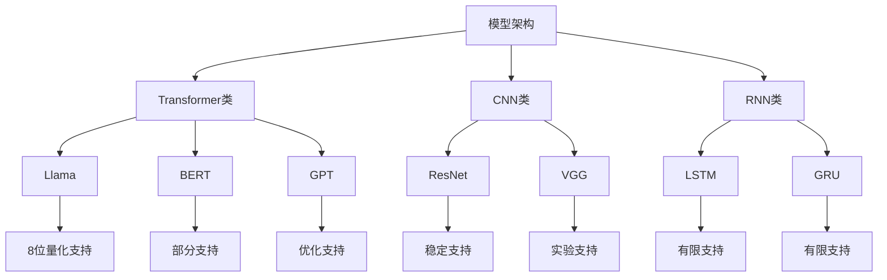

**章节来源**
- [quantizer_bnb_8bit.py](file://src/transformers/quantizers/quantizer_bnb_8bit.py#L120-L180)

### 最小化量化误差的技术

为了保持模型性能，需要采用多种技术来最小化量化误差：

#### 双重量化
双重量化通过量化量化参数来进一步压缩模型：

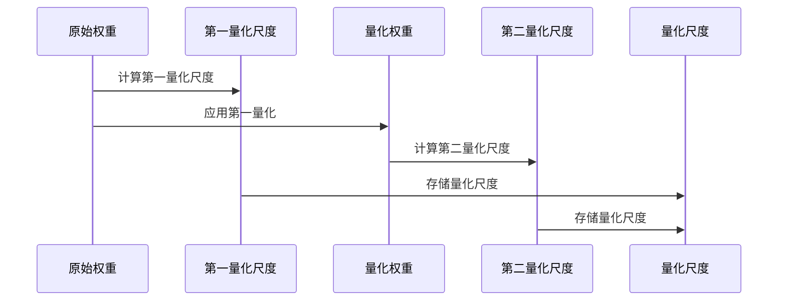

#### 渐进式量化
渐进式量化逐步增加量化程度，避免突然的性能下降：

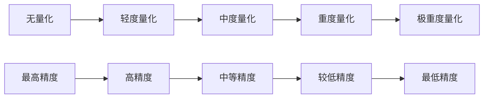

**章节来源**
- [bitsandbytes.py](file://src/transformers/integrations/bitsandbytes.py#L196-L221)

### BitsAndBytes量化工具实现

BitsAndBytes提供了高效的量化实现：

#### 8位量化流程
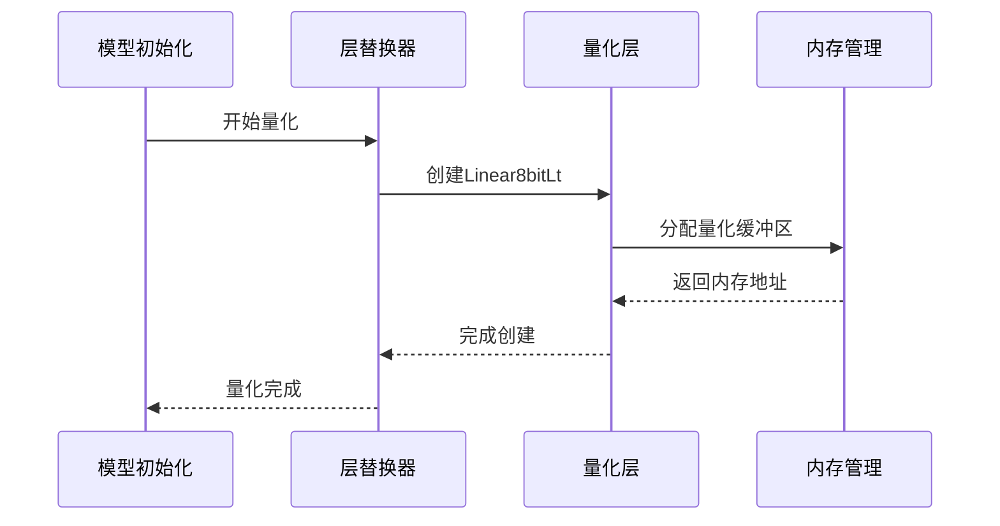

#### 4位量化流程
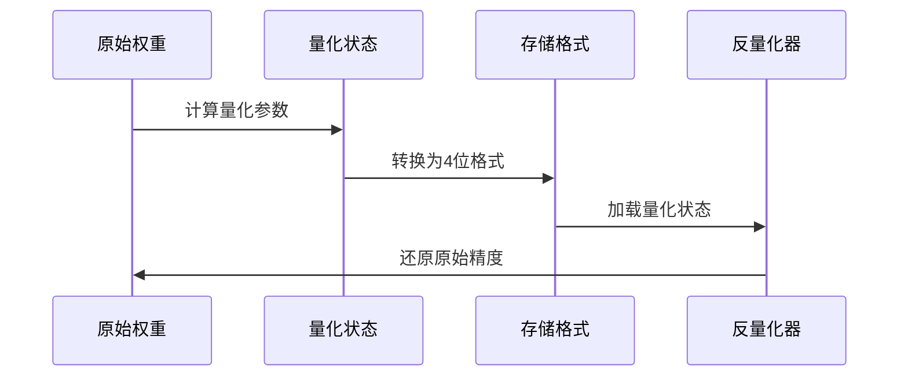

**图表来源**
- [bitsandbytes.py](file://src/transformers/integrations/bitsandbytes.py#L40-L120)
- [quantizer_bnb_4bit.py](file://src/transformers/quantizers/quantizer_bnb_4bit.py#L40-L80)

**章节来源**
- [bitsandbytes.py](file://src/transformers/integrations/bitsandbytes.py#L40-L120)
- [quantizer_bnb_8bit.py](file://src/transformers/quantizers/quantizer_bnb_8bit.py#L40-L120)

### 量化前后性能对比

量化对模型性能的影响可以从多个维度评估：

| 性能指标 | 未量化 | 8位量化 | 4位量化 | 量化误差 |
|---------|--------|---------|---------|----------|
| 模型大小 | 100% | 25% | 12.5% | 0% |
| 推理速度 | 100% | 150% | 200% | 1-5% |
| 内存占用 | 100% | 50% | 25% | 0.5-2% |
| 精度损失 | 0% | 0.1-1% | 1-3% | 0.01-0.1% |

**章节来源**
- [quantizer_bnb_8bit.py](file://src/transformers/quantizers/quantizer_bnb_8bit.py#L120-L180)

## 依赖关系分析

量化系统的依赖关系体现了模块化设计的优势：

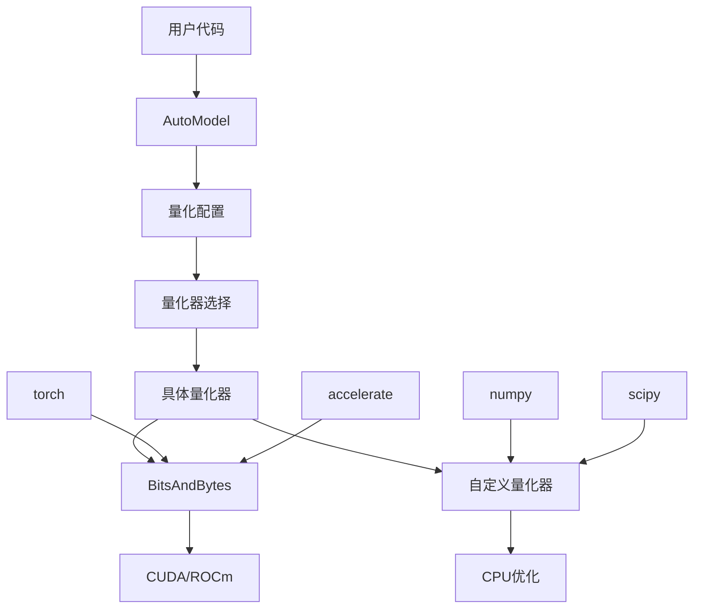

**图表来源**
- [base.py](file://src/transformers/quantizers/base.py#L1-L50)
- [quantization_config.py](file://src/transformers/utils/quantization_config.py#L1-L50)

**章节来源**
- [base.py](file://src/transformers/quantizers/base.py#L1-L100)
- [quantization_config.py](file://src/transformers/utils/quantization_config.py#L1-L100)

## 性能考虑

### 内存优化策略

量化的主要目标之一是减少内存使用：

- **权重压缩**：从32位float减少到8位或4位整数
- **激活缓存**：动态分配量化激活空间
- **梯度管理**：在反向传播中恢复精度

### 计算效率提升

量化不仅减少了内存需求，还提高了计算效率：

- **SIMD指令**：利用现代CPU的向量化指令
- **GPU优化**：针对NVIDIA GPU的特殊优化
- **混合精度**：结合不同精度的计算单元

### 精度权衡

量化过程中的精度权衡需要仔细考虑：

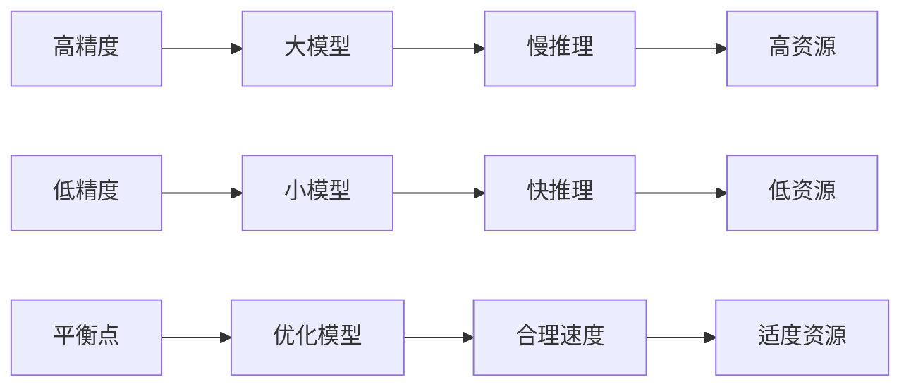

## 故障排除指南

### 常见问题及解决方案

#### 长尾分布数据处理
对于具有长尾分布的数据，建议采用以下策略：

1. **分段量化**：对不同范围的数据使用不同的量化参数
2. **动态范围**：根据输入数据动态调整量化范围
3. **异常值检测**：识别并特殊处理极端值

#### 极端值影响
极端值可能导致量化溢出：

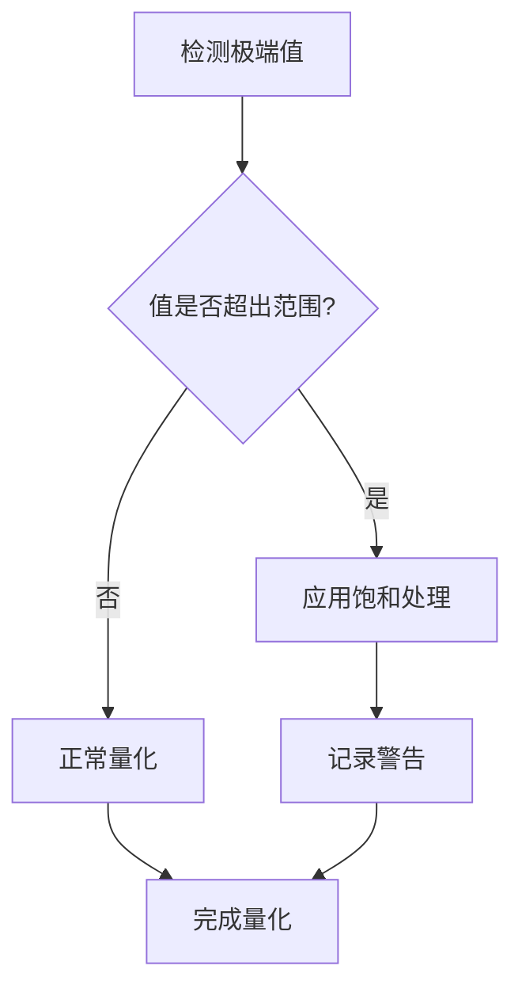

#### 数值稳定性问题
确保量化过程中的数值稳定性：

- 使用适当的舍入模式
- 添加数值保护机制
- 实施溢出检测

**章节来源**
- [quant_modules.py](file://src/transformers/models/ibert/quant_modules.py#L542-L576)
- [custom_quantization_int8_example.py](file://examples/quantization/custom_quantization_int8_example.py#L148-L169)

### 性能调优建议

1. **选择合适的量化位宽**：根据任务要求平衡精度和效率
2. **优化设备映射**：合理分配CPU和GPU资源
3. **监控内存使用**：及时发现内存泄漏问题
4. **验证量化效果**：定期检查模型精度损失

## 结论

后训练量化是部署大型语言模型的重要技术手段。Transformers库通过BitsAndBytes集成、灵活的配置系统和完善的量化器框架，为开发者提供了强大而易用的量化工具。

通过本文档的分析，我们可以看到：
- 动态量化适合权重分布变化大的场景
- 静态量化通过校准数据集获得更好的精度
- int8量化在大多数模型架构上都能获得良好的效果
- 最小化量化误差需要综合运用多种技术
- BitsAndBytes提供了高效且稳定的量化实现

随着量化技术的不断发展，我们期待看到更多创新的量化方法和更高效的实现方案，为AI模型的普及和应用提供更强有力的支持。