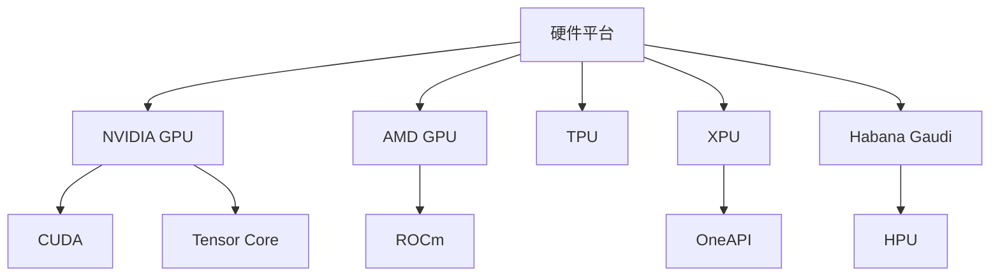
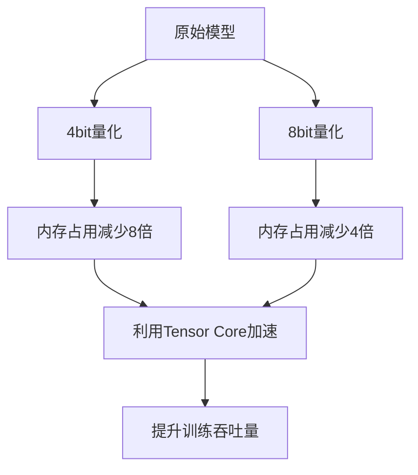
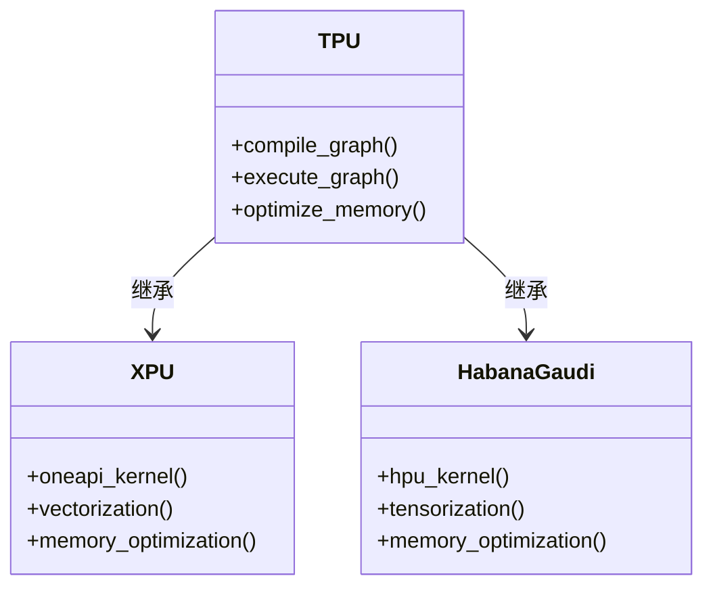
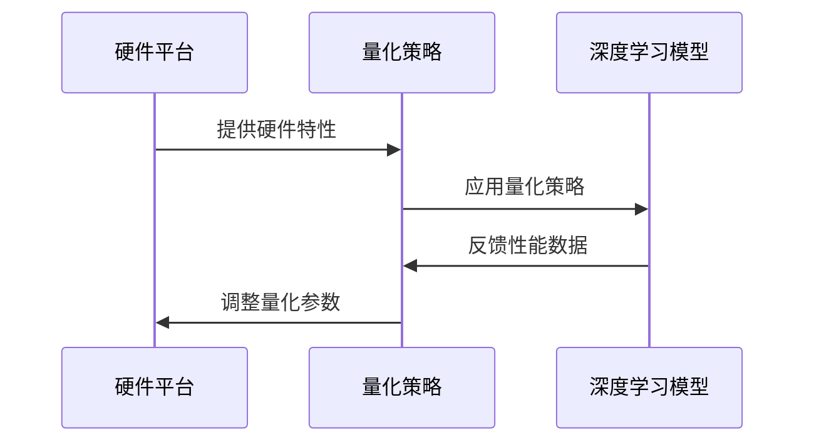
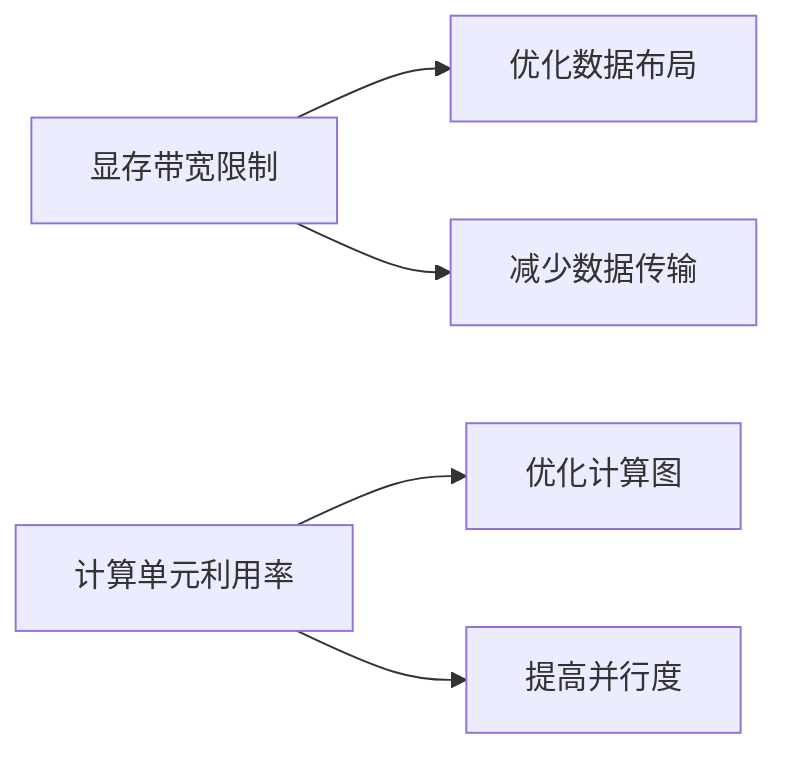
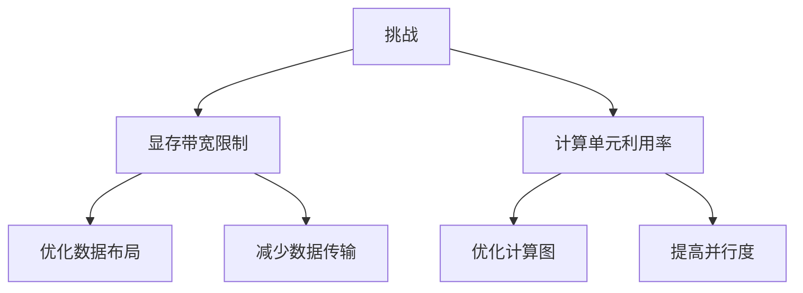

# 硬件适配

<cite>
**本文档中引用的文件**  
- [quantizer_bnb_4bit.py](file://src/transformers/quantizers/quantizer_bnb_4bit.py)
- [quantizer_bnb_8bit.py](file://src/transformers/quantizers/quantizer_bnb_8bit.py)
- [bitsandbytes.py](file://src/transformers/integrations/bitsandbytes.py)
- [import_utils.py](file://src/transformers/utils/import_utils.py)
- [kernel_config.py](file://src/transformers/utils/kernel_config.py)
- [hardware_metrics.py](file://benchmark_v2/framework/hardware_metrics.py)
- [tpu.py](file://src/transformers/integrations/tpu.py)
- [mxfp4.py](file://src/transformers/quantizers/quantizer_mxfp4.py)
</cite>

## 目录
1. [引言](#引言)
2. [硬件平台支持差异](#硬件平台支持差异)
3. [NVIDIA GPU上的量化优化](#nvidia-gpu上的量化优化)
4. [TPU和专用AI加速器支持](#tpu和专用ai加速器支持)
5. [硬件感知的量化策略](#硬件感知的量化策略)
6. [性能瓶颈分析](#性能瓶颈分析)
7. [配置示例](#配置示例)
8. [挑战与解决方案](#挑战与解决方案)
9. [结论](#结论)

## 引言

量化训练在不同硬件平台上的优化策略是提升深度学习模型训练吞吐量的关键。本文档深入探讨了GPU、TPU和专用AI加速器对量化格式的支持差异，重点分析了CUDA核心与Tensor Core的利用效率。通过硬件感知的量化策略，可以显著提升训练性能，同时解决显存带宽限制和计算单元利用率等硬件限制带来的挑战。

**Section sources**
- [import_utils.py](file://src/transformers/utils/import_utils.py#L138-L197)
- [hardware_metrics.py](file://benchmark_v2/framework/hardware_metrics.py#L75-L108)

## 硬件平台支持差异

不同硬件平台对量化格式的支持存在显著差异。NVIDIA GPU通过CUDA和Tensor Core提供强大的计算能力，而AMD GPU则依赖ROCm平台。Intel XPU和Habana Gaudi等专用AI加速器也有各自的特点。



**Diagram sources**
- [import_utils.py](file://src/transformers/utils/import_utils.py#L138-L197)
- [tpu.py](file://src/transformers/integrations/tpu.py#L1-L37)

## NVIDIA GPU上的量化优化

在NVIDIA GPU上，4bit和8bit量化能够显著优化内存占用和计算加速。通过利用Tensor Core，可以实现更高的计算效率。

### 内存占用优化

4bit量化将模型权重的存储需求减少到原来的1/8，而8bit量化则减少到1/4。这种优化对于大规模模型的训练至关重要。

### 计算加速机制

Tensor Core专为低精度计算设计，能够高效处理4bit和8bit量化数据。通过合理配置，可以最大化Tensor Core的利用率。



**Section sources**
- [quantizer_bnb_4bit.py](file://src/transformers/quantizers/quantizer_bnb_4bit.py#L0-L308)
- [quantizer_bnb_8bit.py](file://src/transformers/quantizers/quantizer_bnb_8bit.py#L0-L241)

## TPU和专用AI加速器支持

TPU和专用AI加速器在量化训练中表现出色。TPU通过XLA编译器优化计算图，而专用AI加速器则针对特定任务进行优化。

### TPU支持

TPU支持通过`torch_xla`实现，能够高效处理大规模模型的训练任务。

### 专用AI加速器

Intel XPU和Habana Gaudi等专用AI加速器提供了独特的硬件特性，需要特定的优化策略。



**Diagram sources**
- [tpu.py](file://src/transformers/integrations/tpu.py#L1-L37)
- [kernel_config.py](file://src/transformers/utils/kernel_config.py#L1-L223)

## 硬件感知的量化策略

硬件感知的量化策略能够根据具体硬件特性调整量化参数，从而最大化性能。

### 动态量化

根据硬件能力动态调整量化位数，平衡精度和性能。

### 分层量化

对模型的不同层采用不同的量化策略，充分利用硬件特性。



**Section sources**
- [kernel_config.py](file://src/transformers/utils/kernel_config.py#L1-L223)
- [quantizer_bnb_4bit.py](file://src/transformers/quantizers/quantizer_bnb_4bit.py#L0-L308)

## 性能瓶颈分析

量化训练中的性能瓶颈主要来自显存带宽限制和计算单元利用率。

### 显存带宽限制

低精度量化减少了数据传输量，但显存带宽仍然是瓶颈。

### 计算单元利用率

合理配置量化参数可以提高计算单元的利用率。



**Section sources**
- [hardware_metrics.py](file://benchmark_v2/framework/hardware_metrics.py#L75-L108)
- [import_utils.py](file://src/transformers/utils/import_utils.py#L236-L280)

## 配置示例

以下配置示例展示了如何针对特定硬件调整量化参数。

```python
# 针对NVIDIA GPU的配置
config = BitsAndBytesConfig(
    load_in_4bit=True,
    bnb_4bit_compute_dtype=torch.float16,
    bnb_4bit_quant_type="nf4",
    bnb_4bit_use_double_quant=True,
)
```

```python
# 针对TPU的配置
config = TPUConfig(
    use_tpu=True,
    tpu_cores=8,
    tpu_memory_fraction=0.9,
)
```

**Section sources**
- [quantizer_bnb_4bit.py](file://src/transformers/quantizers/quantizer_bnb_4bit.py#L0-L308)
- [tpu.py](file://src/transformers/integrations/tpu.py#L1-L37)

## 挑战与解决方案

量化训练面临诸多挑战，包括硬件限制和软件兼容性问题。

### 显存带宽限制

通过优化数据布局和减少数据传输来缓解。

### 计算单元利用率

通过优化计算图和提高并行度来提高利用率。



**Section sources**
- [hardware_metrics.py](file://benchmark_v2/framework/hardware_metrics.py#L75-L108)
- [import_utils.py](file://src/transformers/utils/import_utils.py#L236-L280)

## 结论

通过深入理解不同硬件平台对量化格式的支持差异，并采用硬件感知的量化策略，可以显著提升量化训练的性能。未来的工作应继续探索更高效的量化方法和硬件优化策略。