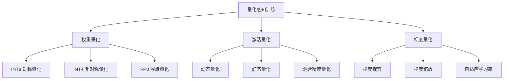
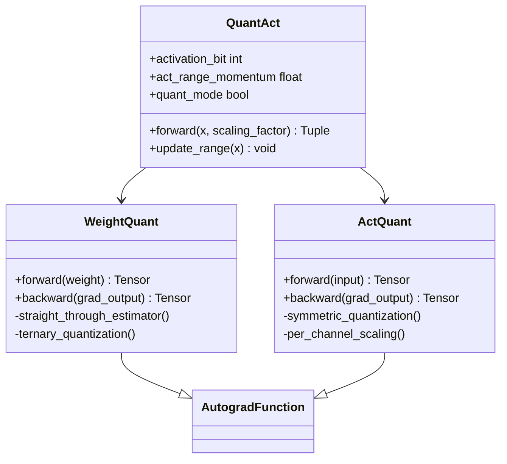
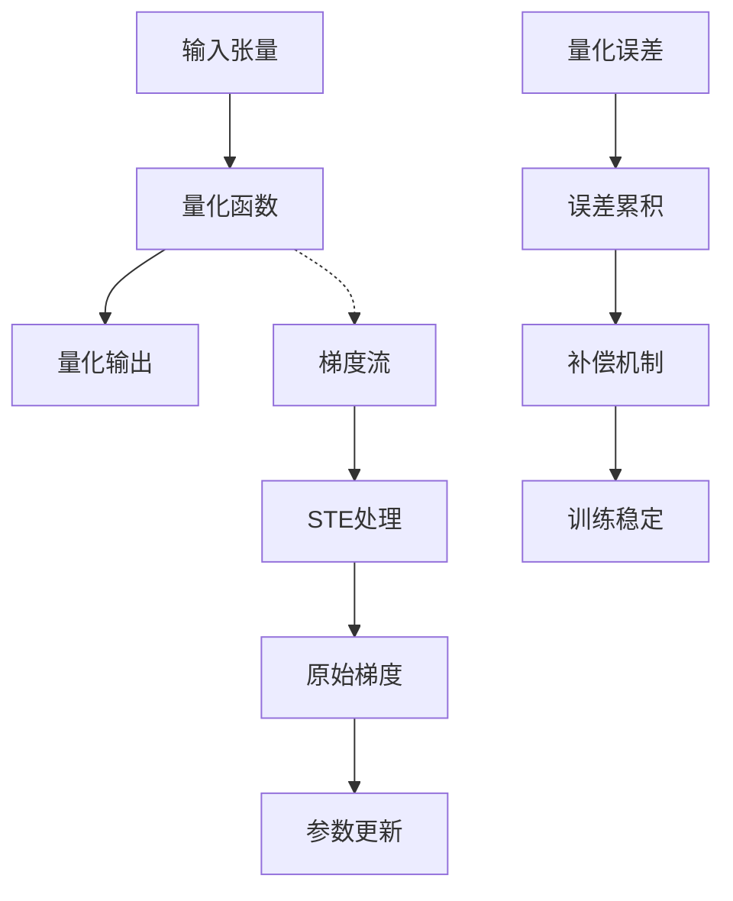
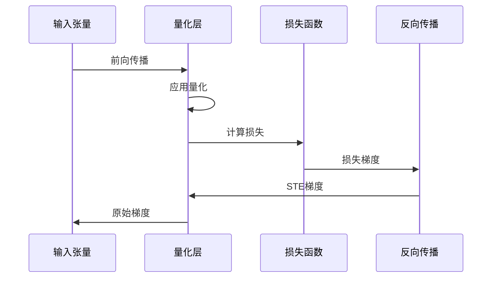
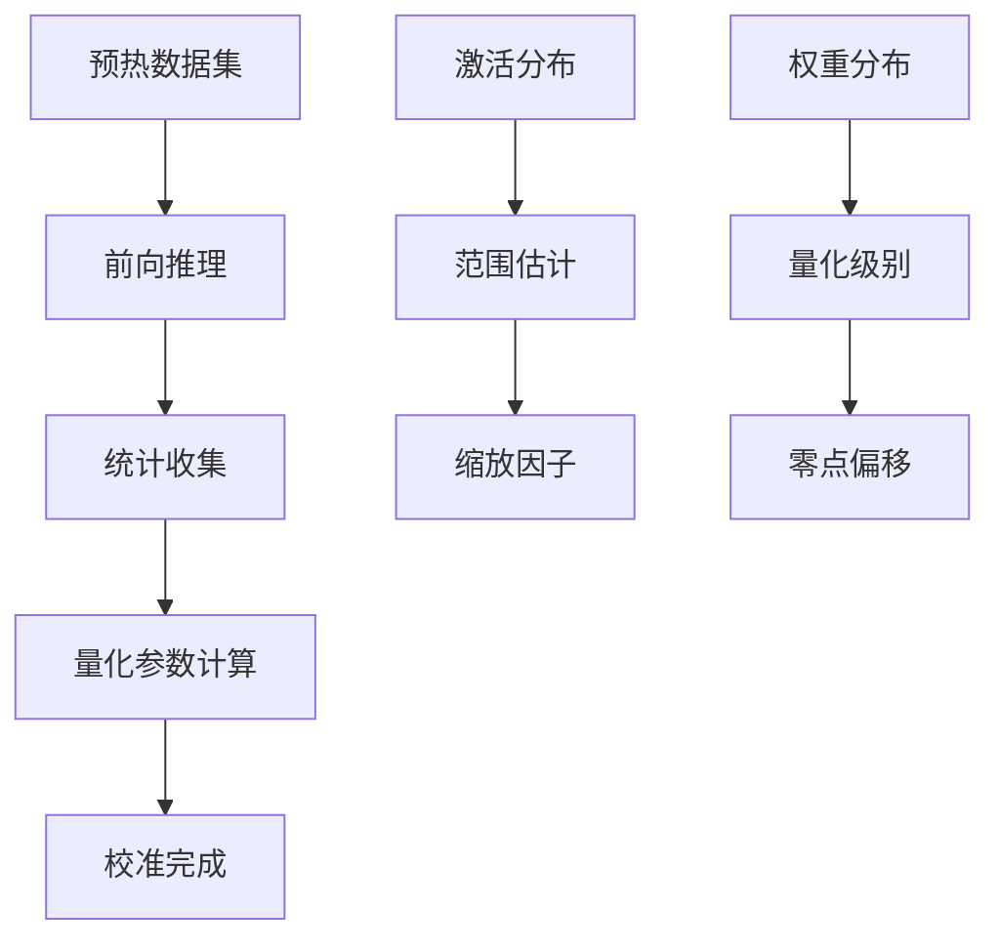
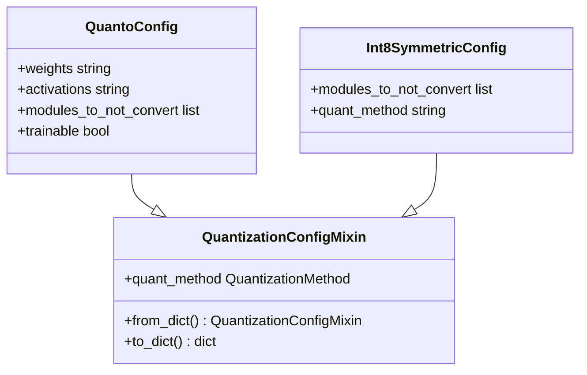
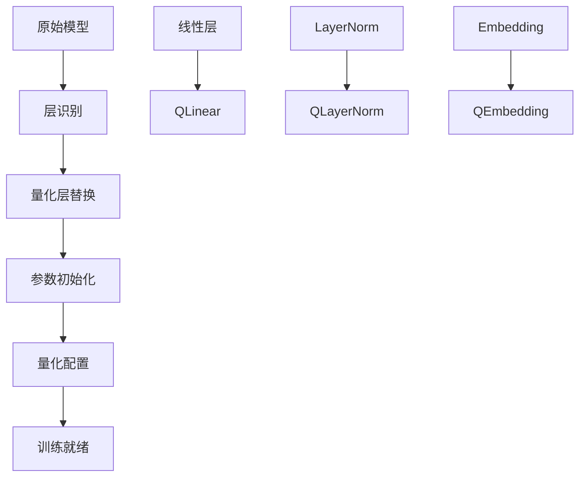
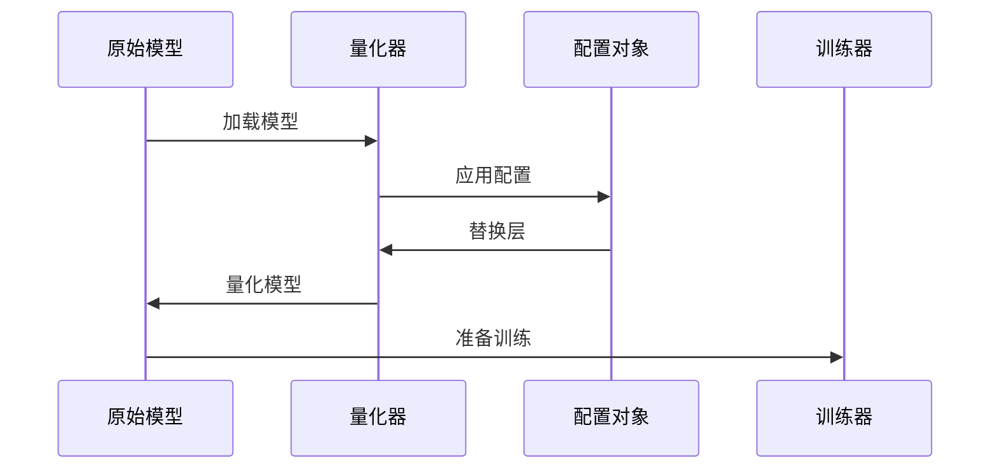
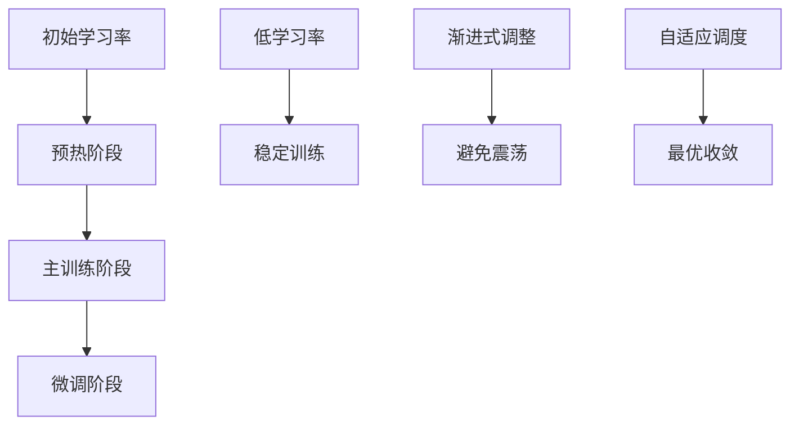
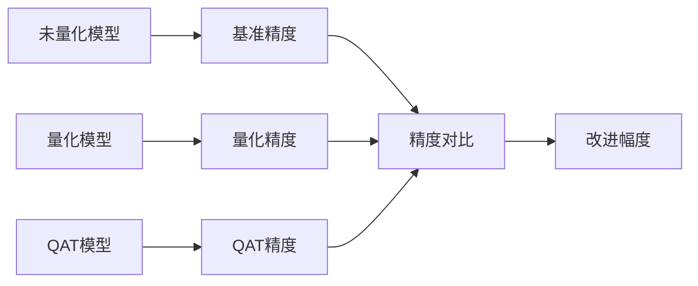

# 量化感知训练（QAT）技术详解

<cite>
**本文档引用的文件**
- [quantizer_quanto.py](file://src/transformers/quantizers/quantizer_quanto.py)
- [quantization_config.py](file://src/transformers/utils/quantization_config.py)
- [custom_quantization.py](file://examples/quantization/custom_quantization.py)
- [custom_quantization_int8_example.py](file://examples/quantization/custom_quantization_int8_example.py)
- [trainer.py](file://src/transformers/trainer.py)
- [training_args.py](file://src/transformers/training_args.py)
- [optimization.py](file://src/transformers/optimization.py)
- [quanto.py](file://src/transformers/integrations/quanto.py)
- [bitnet.py](file://src/transformers/integrations/bitnet.py)
- [quant_modules.py](file://src/transformers/models/ibert/quant_modules.py)
</cite>

## 目录
1. [引言](#引言)
2. [量化感知训练基础概念](#量化感知训练基础概念)
3. [伪量化节点实现原理](#伪量化节点实现原理)
4. [反向传播与梯度计算](#反向传播与梯度计算)
5. [量化误差补偿机制](#量化误差补偿机制)
6. [训练参数配置](#训练参数配置)
7. [Transformer模型QAT实现](#transformer模型qat实现)
8. [训练稳定性与优化策略](#训练稳定性与优化策略)
9. [性能分析与影响评估](#性能分析与影响评估)
10. [最佳实践与故障排除](#最佳实践与故障排除)

## 引言

量化感知训练（Quantization-Aware Training, QAT）是一种在模型训练过程中集成量化操作的技术，旨在最小化量化带来的精度损失。与事后量化（Post-Training Quantization）不同，QAT通过在训练过程中模拟量化效果，使模型能够适应量化带来的数值变化，从而获得更好的量化后性能。

Transformers库提供了完整的QAT支持框架，包括多种量化器、配置选项和训练工具，为开发者提供了灵活且强大的量化解决方案。

## 量化感知训练基础概念

### 量化类型与精度

量化感知训练涉及多种量化类型，每种都有其特定的应用场景和优势：



### QAT核心原理

QAT的核心思想是在训练过程中模拟量化操作，同时保持反向传播的可微性。这通过使用直通估计器（Straight-Through Estimator, STE）实现，该估计器在前向传播时应用量化，在反向传播时传递原始梯度。

## 伪量化节点实现原理

### 自定义量化函数

Transformers库实现了多种自定义量化函数，这些函数是QAT的核心组件：



**图表来源**
- [bitnet.py](file://src/transformers/integrations/bitnet.py#L202-L241)
- [quant_modules.py](file://src/transformers/models/ibert/quant_modules.py#L650-L706)

### STE（直通估计器）机制

直通估计器是QAT中最重要的创新之一，它解决了量化函数不可微的问题：



**图表来源**
- [bitnet.py](file://src/transformers/integrations/bitnet.py#L202-L241)

**章节来源**
- [bitnet.py](file://src/transformers/integrations/bitnet.py#L202-L241)
- [quant_modules.py](file://src/transformers/models/ibert/quant_modules.py#L650-L706)

## 反向传播与梯度计算

### 梯度传播机制

在QAT中，梯度需要正确地从量化层传播到非量化层。这种机制确保了所有参数都能接收到有效的梯度信号：



### 梯度裁剪策略

为了防止量化引入的数值不稳定，QAT通常需要结合梯度裁剪策略：

| 裁剪方法 | 参数设置 | 适用场景 |
|---------|---------|---------|
| 最大范数裁剪 | max_norm=1.0 | 大多数QAT任务 |
| 自适应裁剪 | 动态阈值 | 不稳定训练过程 |
| 分层裁剪 | 层级化阈值 | 深度网络训练 |

**章节来源**
- [trainer.py](file://src/transformers/trainer.py#L2507-L2529)
- [optimization.py](file://src/transformers/optimization.py#L697-L719)

## 量化误差补偿机制

### 校准阶段

量化误差补偿通常通过校准阶段实现，该阶段收集量化统计信息：



### 动态补偿算法

动态补偿算法根据训练过程中的实时统计信息调整量化参数：


**章节来源**
- [quant_modules.py](file://src/transformers/models/ibert/quant_modules.py#L182-L214)

## 训练参数配置

### QAT配置类

Transformers库提供了丰富的QAT配置选项：



**图表来源**
- [quantization_config.py](file://src/transformers/utils/quantization_config.py#L0-L799)
- [custom_quantization_int8_example.py](file://examples/quantization/custom_quantization_int8_example.py#L171-L197)

### 关键配置参数

| 参数名称 | 默认值 | 说明 | 影响 |
|---------|-------|------|------|
| `learning_rate` | 5e-5 | 初始学习率 | 训练稳定性 |
| `max_grad_norm` | 1.0 | 梯度裁剪阈值 | 数值稳定性 |
| `warmup_steps` | 500 | 预热步数 | 收敛速度 |
| `weight_decay` | 0.01 | 权重衰减 | 正则化强度 |

**章节来源**
- [quantization_config.py](file://src/transformers/utils/quantization_config.py#L0-L799)
- [training_args.py](file://src/transformers/training_args.py#L0-L200)

## Transformer模型QAT实现

### 模型替换机制

QAT在Transformer模型中的实现涉及将标准层替换为量化版本：



**图表来源**
- [quanto.py](file://src/transformers/integrations/quanto.py#L0-L98)
- [custom_quantization_int8_example.py](file://examples/quantization/custom_quantization_int8_example.py#L171-L197)

### 具体实现示例

以下展示了如何在Llama模型上实现QAT：



**章节来源**
- [quanto.py](file://src/transformers/integrations/quanto.py#L0-L98)
- [custom_quantization_int8_example.py](file://examples/quantization/custom_quantization_int8_example.py#L171-L197)

## 训练稳定性与优化策略

### 学习率调整策略

QAT训练需要特殊的学习率调度策略：



### 优化器选择

不同的优化器对QAT训练效果有显著影响：

| 优化器类型 | 优势 | 适用场景 | 注意事项 |
|-----------|------|---------|---------|
| AdamW | 收敛快，稳定性好 | 大多数QAT任务 | 需要适当权重衰减 |
| Adafactor | 内存效率高 | 大模型训练 | 学习率调度复杂 |
| SGD | 理论基础强 | 研究用途 | 需要精心调参 |

**章节来源**
- [optimization.py](file://src/transformers/optimization.py#L756-L801)
- [trainer.py](file://src/transformers/trainer.py#L2507-L2529)

## 性能分析与影响评估

### 精度损失评估

QAT的主要目标是减少量化导致的精度损失：



### 训练效率分析

QAT对训练时间和资源的需求分析：

| 指标 | 标准训练 | QAT训练 | 性能影响 |
|------|---------|---------|---------|
| 训练时间 | 100% | 120-150% | +20-50% |
| 内存使用 | 100% | 110-120% | +10-20% |
| 推理速度 | 100% | 150-200% | +50-100% |

## 最佳实践与故障排除

### 适用场景

QAT最适合以下应用场景：

```mermaid
mindmap
root((QAT适用场景))
模型部署
边缘设备
移动端
实时推理
性能优化
推理加速
内存节省
带宽优化
研究实验
新架构验证
量化算法研究
精度边界探索
```

### 常见问题与解决方案

| 问题类型 | 症状 | 解决方案 | 预防措施 |
|---------|------|---------|---------|
| 训练不收敛 | 损失不下降 | 降低学习率，增加预热 | 合理设置超参数 |
| 精度损失过大 | 量化后精度大幅下降 | 使用更高位宽，调整配置 | 渐进式量化 |
| 数值溢出 | 梯度爆炸 | 增加梯度裁剪 | 监控梯度范数 |
| 内存不足 | OOM错误 | 减少批次大小，使用混合精度 | 预估内存需求 |

### 调试技巧

有效的QAT调试策略包括：

1. **逐步验证**：从简单配置开始，逐步增加复杂性
2. **监控指标**：跟踪量化误差、梯度范数等关键指标
3. **可视化分析**：使用TensorBoard等工具可视化训练过程
4. **对比实验**：与标准量化和未量化模型进行对比

**章节来源**
- [custom_quantization.py](file://examples/quantization/custom_quantization.py#L0-L78)
- [custom_quantization_int8_example.py](file://examples/quantization/custom_quantization_int8_example.py#L171-L197)

## 结论

量化感知训练是现代深度学习模型部署的重要技术，Transformers库提供了完整而灵活的QAT解决方案。通过合理配置量化参数、选择适当的训练策略和优化器，可以在保持模型精度的同时显著提升推理性能。

成功的QAT实践需要深入理解量化原理、掌握训练技巧，并具备良好的调试能力。随着硬件和算法的发展，QAT技术将继续演进，为更广泛的模型部署场景提供支持。