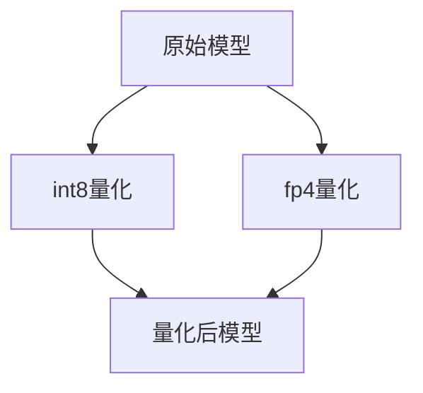

# 量化训练

<cite>
**本文档引用的文件**
- [custom_quantization.py](file://examples/quantization/custom_quantization.py)
- [custom_quantization_int8_example.py](file://examples/quantization/custom_quantization_int8_example.py)
- [bitsandbytes.py](file://src/transformers/integrations/bitsandbytes.py)
- [quantization_config.py](file://src/transformers/utils/quantization_config.py)
- [base.py](file://src/transformers/quantizers/base.py)
- [quantizer_bnb_4bit.py](file://src/transformers/quantizers/quantizer_bnb_4bit.py)
- [quantizer_bnb_8bit.py](file://src/transformers/quantizers/quantizer_bnb_8bit.py)
- [quantizer_bitnet.py](file://src/transformers/quantizers/quantizer_bitnet.py)
- [quantizer_mxfp4.py](file://src/transformers/integrations/mxfp4.py)
- [fbgemm_fp8.py](file://src/transformers/integrations/fbgemm_fp8.py)
- [quanto.py](file://src/transformers/integrations/quanto.py)
- [quantizer_hqq.py](file://src/transformers/quantizers/quantizer_hqq.py)
</cite>

## 目录
1. [引言](#引言)
2. [量化技术原理](#量化技术原理)
3. [量化方法实现](#量化方法实现)
4. [BitsAndBytes库集成](#bitsandbytes库集成)
5. [精度与性能分析](#精度与性能分析)
6. [代码示例](#代码示例)
7. [常见问题解决方案](#常见问题解决方案)
8. [结论](#结论)

## 引言
量化训练是一种通过降低模型权重和激活值的数值精度来减少模型大小和计算需求的技术。这种方法在保持模型性能的同时，显著提高了推理速度和降低了内存占用。本文档详细介绍了在自定义训练中集成量化技术的方法，包括动态量化、静态量化和量化感知训练（QAT）的实现原理与配置方式。

## 量化技术原理
量化技术通过将浮点数转换为低精度的整数表示来减少模型的计算复杂度。主要的量化方法包括动态量化、静态量化和量化感知训练（QAT）。动态量化在推理时实时进行量化，而静态量化则在模型训练完成后进行。QAT在训练过程中模拟量化效果，以减少量化带来的精度损失。

### 动态量化
动态量化在推理过程中对权重和激活值进行量化。这种方法不需要重新训练模型，适用于已经训练好的模型。动态量化通常使用8位整数（int8）表示权重和激活值。

### 静态量化
静态量化在模型训练完成后进行，通过校准数据集确定量化参数。这种方法可以更精确地控制量化误差，但需要额外的校准步骤。

### 量化感知训练（QAT）
量化感知训练在训练过程中引入量化操作，使模型适应量化带来的噪声。QAT可以显著减少量化后的精度损失，但需要重新训练模型。

**量化技术原理**
- [quantization_config.py](file://src/transformers/utils/quantization_config.py#L1-L100)

## 量化方法实现
不同的量化方法有不同的实现方式和配置选项。本文档重点介绍int8和fp4精度的设置，以及如何在不同硬件平台上实现高效的量化训练。

### int8量化
int8量化使用8位整数表示权重和激活值。这种方法可以显著减少模型大小和计算需求，同时保持较高的精度。在实现int8量化时，需要考虑量化范围和缩放因子的选择。

### fp4量化
fp4量化使用4位浮点数表示权重和激活值。这种方法进一步减少了模型大小和计算需求，但可能会带来更大的精度损失。fp4量化通常用于资源受限的设备上。



**图源**
- [custom_quantization_int8_example.py](file://examples/quantization/custom_quantization_int8_example.py#L1-L50)
- [quantizer_bnb_4bit.py](file://src/transformers/quantizers/quantizer_bnb_4bit.py#L1-L50)

**量化方法实现**
- [custom_quantization_int8_example.py](file://examples/quantization/custom_quantization_int8_example.py#L1-L100)
- [quantizer_bnb_4bit.py](file://src/transformers/quantizers/quantizer_bnb_4bit.py#L1-L100)

## BitsAndBytes库集成
BitsAndBytes库提供了高效的量化实现，支持多种量化方法和硬件平台。通过集成BitsAndBytes库，可以在不同硬件平台上实现高效的量化训练。

### 安装与配置
首先需要安装BitsAndBytes库：
```bash
pip install bitsandbytes
```

然后在代码中导入并配置量化参数：
```python
from transformers import BitsAndBytesConfig

quantization_config = BitsAndBytesConfig(
    load_in_4bit=True,
    bnb_4bit_quant_type="fp4",
    bnb_4bit_use_double_quant=True,
)
```

### 使用示例
在加载模型时应用量化配置：
```python
from transformers import AutoModelForCausalLM

model = AutoModelForCausalLM.from_pretrained(
    "meta-llama/Llama-3.2-1B",
    quantization_config=quantization_config,
)
```

**BitsAndBytes库集成**
- [bitsandbytes.py](file://src/transformers/integrations/bitsandbytes.py#L1-L100)
- [quantizer_bnb_4bit.py](file://src/transformers/quantizers/quantizer_bnb_4bit.py#L1-L100)

## 精度与性能分析
量化对模型精度和训练速度有显著影响。通过合理选择量化方法和参数，可以在保持较高精度的同时提高训练速度。

### 精度损失
量化会引入一定的精度损失，特别是在低精度表示下。通过使用QAT和适当的量化参数，可以显著减少精度损失。

### 训练速度
量化可以显著提高训练速度，特别是在大规模模型上。通过减少计算复杂度和内存占用，量化使得在资源受限的设备上进行训练成为可能。

**精度与性能分析**
- [quantization_config.py](file://src/transformers/utils/quantization_config.py#L100-L200)
- [quantizer_bnb_8bit.py](file://src/transformers/quantizers/quantizer_bnb_8bit.py#L1-L100)

## 代码示例
以下是一个完整的代码示例，展示如何在自定义训练中集成量化技术。

### 自定义量化配置
```python
from transformers import AutoModelForCausalLM, AutoTokenizer
from transformers.quantizers import HfQuantizer, register_quantization_config, register_quantizer
from transformers.utils.quantization_config import QuantizationConfigMixin

@register_quantization_config("custom")
class CustomConfig(QuantizationConfigMixin):
    def __init__(self):
        self.quant_method = "custom"
        self.bits = 8

@register_quantizer("custom")
class CustomQuantizer(HfQuantizer):
    def __init__(self, quantization_config: QuantizationConfigMixin, **kwargs):
        super().__init__(quantization_config, **kwargs)
        self.quantization_config = quantization_config

    def _process_model_before_weight_loading(self, model, **kwargs):
        return True

    def is_serializable(self) -> bool:
        return True

    def is_trainable(self) -> bool:
        return False
```

### 加载量化模型
```python
model_8bit = AutoModelForCausalLM.from_pretrained(
    "facebook/opt-350m", quantization_config=CustomConfig(), dtype="auto"
)

tokenizer = AutoTokenizer.from_pretrained("facebook/opt-350m")
input_text = "once there is"
inputs = tokenizer(input_text, return_tensors="pt")
output = model_8bit.generate(
    **inputs,
    max_length=100,
    num_return_sequences=1,
    no_repeat_ngram_size=2,
)
generated_text = tokenizer.decode(output[0], skip_special_tokens=True)

print(generated_text)
```

**代码示例**
- [custom_quantization.py](file://examples/quantization/custom_quantization.py#L1-L100)
- [custom_quantization_int8_example.py](file://examples/quantization/custom_quantization_int8_example.py#L1-L100)

## 常见问题解决方案
在量化训练过程中可能会遇到一些常见问题，如量化误差累积和梯度更新异常。以下是一些解决方案。

### 量化误差累积
量化误差累积可能导致模型性能下降。通过使用QAT和适当的量化参数，可以减少量化误差累积。

### 梯度更新异常
在量化训练中，梯度更新可能会出现异常。通过使用稳定的优化器和适当的学习率，可以解决梯度更新异常问题。

**常见问题解决方案**
- [quantizer_bitnet.py](file://src/transformers/quantizers/quantizer_bitnet.py#L1-L100)
- [quantizer_hqq.py](file://src/transformers/quantizers/quantizer_hqq.py#L1-L100)

## 结论
量化训练是一种有效的技术，可以在保持模型性能的同时显著减少模型大小和计算需求。通过合理选择量化方法和参数，并集成高效的量化库，可以在不同硬件平台上实现高效的量化训练。未来的研究可以进一步探索更高效的量化方法和应用场景。