# 高级功能

<cite>
**本文档中引用的文件**
- [trainer.py](file://src/transformers/trainer.py)
- [training_args.py](file://src/transformers/training_args.py)
- [optimization.py](file://src/transformers/optimization.py)
- [trainer_pt_utils.py](file://src/transformers/trainer_pt_utils.py)
- [3D_parallel.py](file://examples/3D_parallel.py)
- [distributed_training.py](file://examples/training/distributed_training.py)
- [accelerate.py](file://src/transformers/integrations/accelerate.py)
- [tensor_parallel.py](file://src/transformers/integrations/tensor_parallel.py)
- [fsdp.py](file://src/transformers/integrations/fsdp.py)
- [deepspeed.py](file://src/transformers/integrations/deepspeed.py)
</cite>

## 目录
1. [简介](#简介)
2. [项目结构概览](#项目结构概览)
3. [梯度累积实现](#梯度累积实现)
4. [分布式训练架构](#分布式训练架构)
5. [深度学习框架集成](#深度学习框架集成)
6. [高级优化器支持](#高级优化器支持)
7. [内存优化策略](#内存优化策略)
8. [性能监控与调试](#性能监控与调试)
9. [故障排除指南](#故障排除指南)
10. [总结](#总结)

## 简介

Transformers库提供了全面的高级训练功能，支持复杂的分布式训练场景、梯度累积、多种优化器类型以及内存优化策略。本文档深入探讨这些功能的实现原理、配置方法和最佳实践。

## 项目结构概览

Transformers的高级功能主要分布在以下关键模块中：

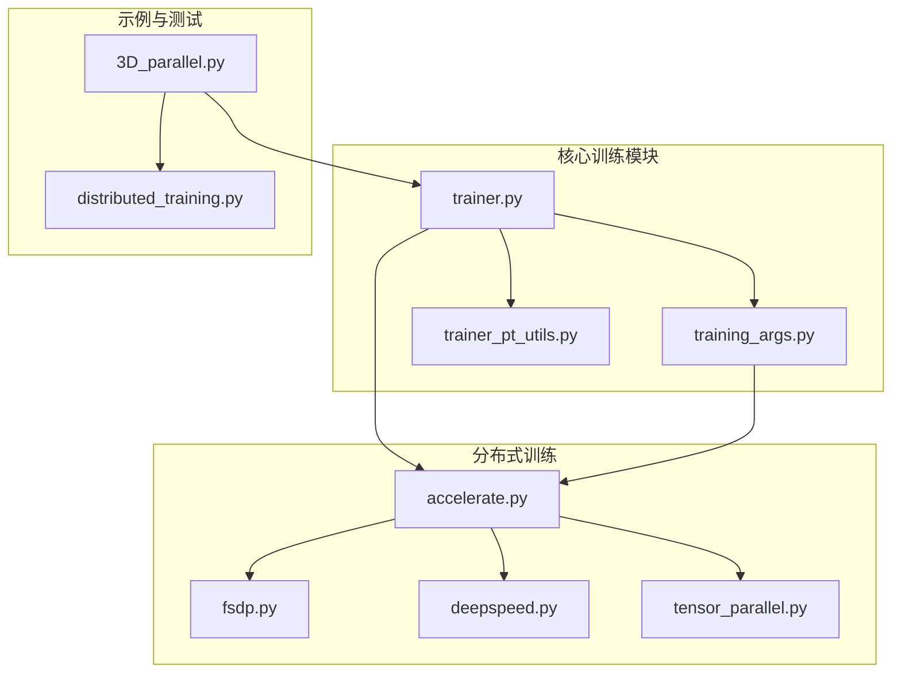

**图表来源**
- [trainer.py](file://src/transformers/trainer.py#L1-L100)
- [training_args.py](file://src/transformers/training_args.py#L1-L50)
- [accelerate.py](file://src/transformers/integrations/accelerate.py#L1-L50)

## 梯度累积实现

### 梯度累积原理

梯度累积是一种重要的训练技术，允许在有限的GPU内存下模拟更大的批次大小。Transformers通过`gradient_accumulation_steps`参数实现这一功能。

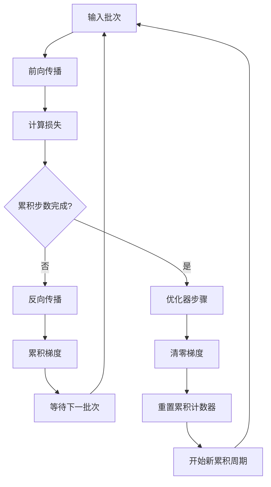

**图表来源**
- [trainer.py](file://src/transformers/trainer.py#L3734-L3785)

### 梯度累积配置

在`TrainingArguments`中配置梯度累积：

| 参数 | 类型 | 默认值 | 描述 |
|------|------|--------|------|
| `gradient_accumulation_steps` | int | 1 | 梯度累积的步数 |
| `per_device_train_batch_size` | int | 8 | 每设备训练批次大小 |
| `torch_empty_cache_steps` | int | None | 清空缓存的步数间隔 |

### 梯度处理流程

梯度累积的核心逻辑在训练循环中实现：

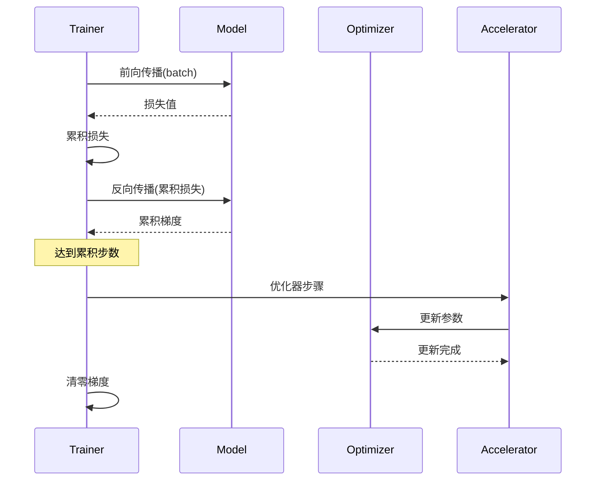

**图表来源**
- [trainer.py](file://src/transformers/trainer.py#L2531-L2550)

**章节来源**
- [trainer.py](file://src/transformers/trainer.py#L3734-L3785)
- [training_args.py](file://src/transformers/training_args.py#L200-L250)

## 分布式训练架构

### 多层分布式支持

Transformers支持多种分布式训练策略：

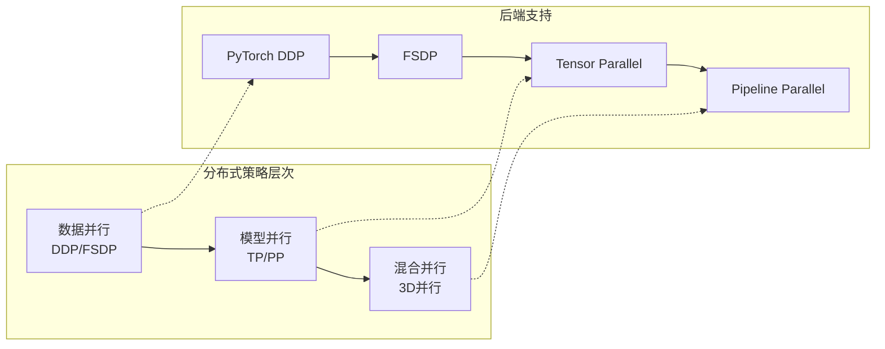

**图表来源**
- [3D_parallel.py](file://examples/3D_parallel.py#L1-L50)
- [fsdp.py](file://src/transformers/integrations/fsdp.py#L1-L50)

### 数据并行配置

#### DDP (分布式数据并行)

```python
# DDP配置示例
training_args = TrainingArguments(
    parallel_mode="distributed",
    ddp_backend="nccl",  # 或 "gloo"
    ddp_timeout=1800,
    ddp_find_unused_parameters=False,
    ddp_bucket_cap_mb=25
)
```

#### FSDP (完全分片数据并行)

FSDP提供了更高效的内存使用：

| 配置选项 | 描述 | 推荐值 |
|----------|------|--------|
| `fsdp="full_shard"` | 完全分片参数、梯度和优化器状态 | 大模型 |
| `fsdp="shard_grad_op"` | 仅分片梯度和优化器状态 | 中等模型 |
| `fsdp="offload"` | 将参数和梯度卸载到CPU | 内存受限环境 |
| `fsdp_config["min_num_params"]` | 自动包装的最小参数数量 | 1e6 |

### 模型并行策略

#### 张量并行 (Tensor Parallel)

张量并行将模型层的计算分布到多个设备上：

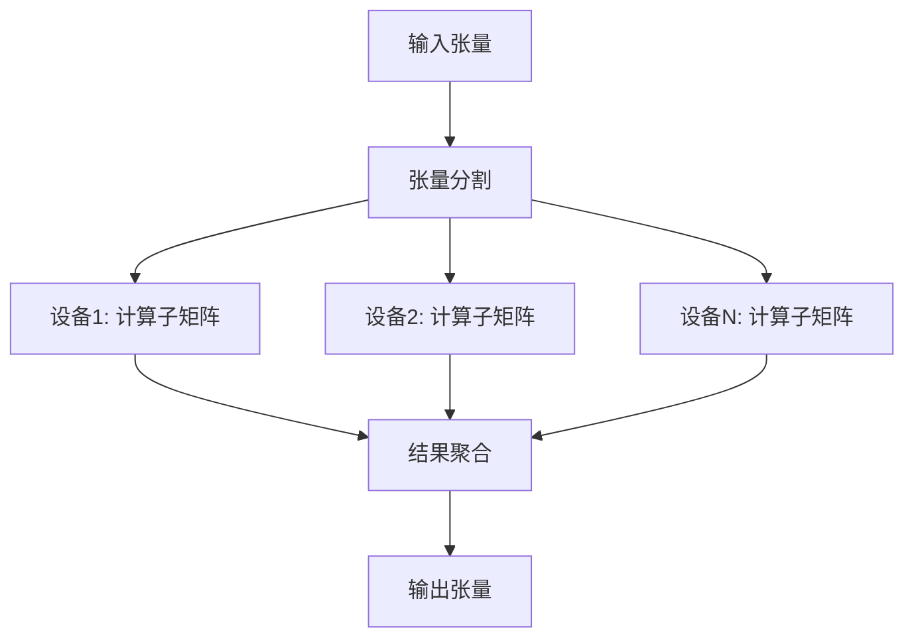

**图表来源**
- [tensor_parallel.py](file://src/transformers/integrations/tensor_parallel.py#L919-L933)

#### 流水线并行 (Pipeline Parallel)

流水线并行将模型的不同层分配到不同的设备：

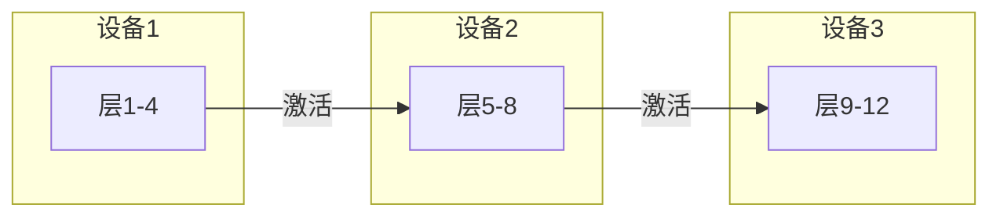

**章节来源**
- [3D_parallel.py](file://examples/3D_parallel.py#L354-L379)
- [training_args.py](file://src/transformers/training_args.py#L449-L460)

## 深度学习框架集成

### Accelerate集成

Transformers与Hugging Face的Accelerate库深度集成，提供统一的分布式训练接口：

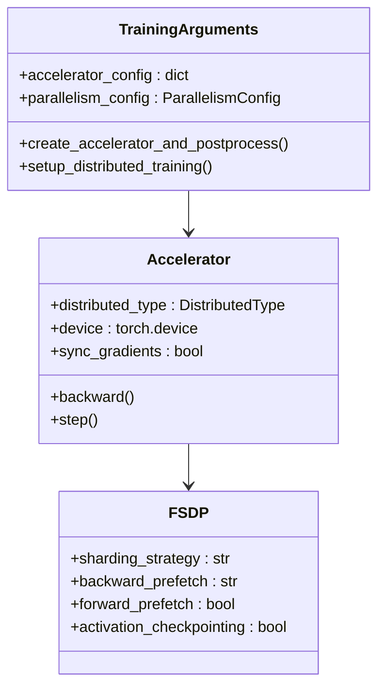

**图表来源**
- [accelerate.py](file://src/transformers/integrations/accelerate.py#L1-L100)
- [trainer.py](file://src/transformers/trainer.py#L4989-L5013)

### DeepSpeed集成

DeepSpeed提供了ZeRO优化器状态分片：

```python
# DeepSpeed配置示例
deepspeed_config = {
    "zero_optimization": {
        "stage": 2,  # ZeRO阶段
        "offload_optimizer": {
            "device": "cpu",
            "pin_memory": True
        }
    },
    "fp16": {
        "enabled": True,
        "loss_scale": 0,
        "loss_scale_window": 1000,
        "initial_scale_power": 16
    }
}
```

**章节来源**
- [accelerate.py](file://src/transformers/integrations/accelerate.py#L1-L200)
- [deepspeed.py](file://src/transformers/integrations/deepspeed.py#L1-L100)

## 高级优化器支持

### 优化器类型与配置

Transformers支持多种优化器，每种都有特定的适用场景：

| 优化器 | 适用场景 | 内存效率 | 收敛速度 |
|--------|----------|----------|----------|
| AdamW | 标准训练 | 中等 | 快速 |
| AdaFactor | 大模型训练 | 高 | 中等 |
| GaLore | 参数高效微调 | 极高 | 快速 |
| LION | 内存受限环境 | 高 | 中等 |

### 优化器配置示例

```python
# GaLore优化器配置
training_args = TrainingArguments(
    optim="galore_adamw",
    optim_args={
        "loraplus_lr_ratio": 16.0,
        "galore_target_modules": ["q_proj", "k_proj", "v_proj", "o_proj"]
    }
)
```

### 学习率调度器

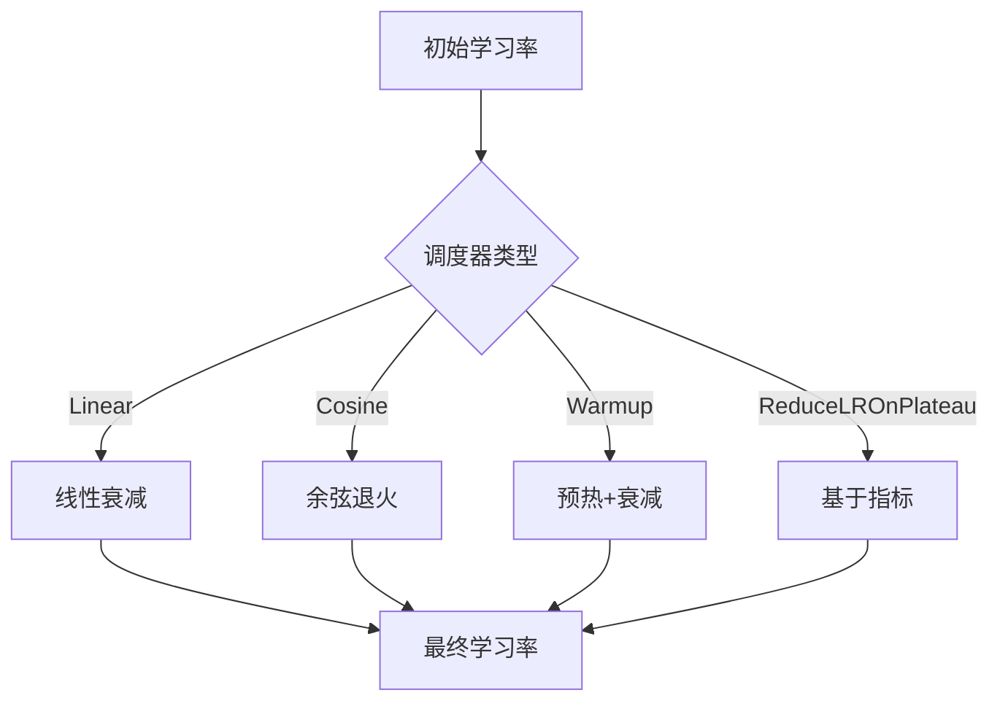

**图表来源**
- [optimization.py](file://src/transformers/optimization.py#L803-L835)

**章节来源**
- [training_args.py](file://src/transformers/training_args.py#L2511-L2540)
- [optimization.py](file://src/transformers/optimization.py#L872-L897)

## 内存优化策略

### 激活检查点

激活检查点通过重新计算而非存储中间激活来节省内存：

```python
# 启用激活检查点
training_args = TrainingArguments(
    gradient_checkpointing=True,
    gradient_checkpointing_kwargs={
        "use_reentrant": False
    }
)
```

### 混合精度训练

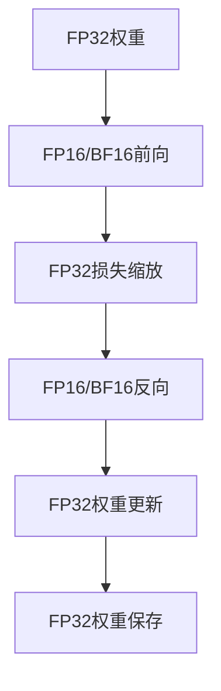

### 内存管理配置

| 参数 | 描述 | 推荐值 |
|------|------|--------|
| `torch_empty_cache_steps` | 清空缓存的步数 | 500 |
| `dataloader_pin_memory` | 固定内存 | True |
| `dataloader_persistent_workers` | 持久化工作进程 | True |
| `skip_memory_metrics` | 跳过内存指标 | True |

**章节来源**
- [training_args.py](file://src/transformers/training_args.py#L1751-L1780)
- [trainer.py](file://src/transformers/trainer.py#L3763-L3785)

## 性能监控与调试

### 训练指标跟踪

Transformers提供了全面的训练指标监控：

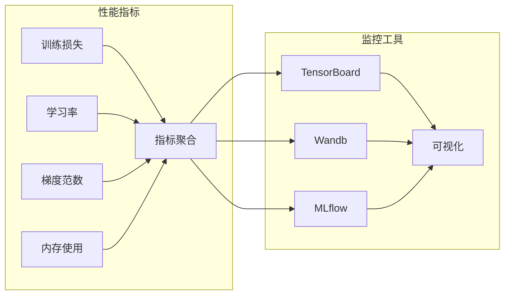

### 调试选项

```python
# 启用调试模式
training_args = TrainingArguments(
    debug=["underflow_overflow", "tpu_metrics_debug"],
    logging_steps=1,
    save_steps=100,
    eval_steps=50
)
```

### 性能分析

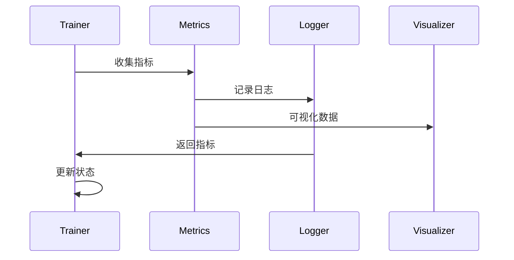

**章节来源**
- [trainer.py](file://src/transformers/trainer.py#L2594-L2625)
- [trainer_pt_utils.py](file://src/transformers/trainer_pt_utils.py#L1-L200)

## 故障排除指南

### 常见问题与解决方案

#### 内存不足问题

1. **启用梯度累积**
   ```python
   training_args = TrainingArguments(
       gradient_accumulation_steps=4,
       per_device_train_batch_size=1
   )
   ```

2. **使用FSDP**
   ```python
   training_args = TrainingArguments(
       fsdp="full_shard",
       fsdp_config={"min_num_params": 1e6}
   )
   ```

3. **激活检查点**
   ```python
   training_args = TrainingArguments(
       gradient_checkpointing=True
   )
   ```

#### 分布式训练问题

1. **进程组初始化失败**
   - 检查网络连接
   - 验证端口可用性
   - 确认CUDA可见设备

2. **同步问题**
   - 设置适当的超时时间
   - 检查设备兼容性
   - 验证通信后端

#### 性能优化建议

1. **批次大小调优**
   - 从较小批次开始
   - 逐步增加直到内存限制
   - 考虑梯度累积补偿

2. **数据加载优化**
   - 使用多进程数据加载
   - 启用固定内存
   - 优化数据预处理

3. **模型并行策略**
   - 根据模型大小选择策略
   - 平衡通信开销和内存使用
   - 考虑混合并行方案

**章节来源**
- [distributed_training.py](file://examples/training/distributed_training.py#L1-L113)
- [3D_parallel.py](file://examples/3D_parallel.py#L419-L433)

## 总结

Transformers库的高级功能为大规模模型训练提供了完整的解决方案。通过合理配置梯度累积、分布式训练策略、优化器和内存管理，可以在各种硬件环境下实现高效的模型训练。

关键要点：
- 梯度累积是处理大批次训练的重要技术
- 分布式训练需要根据具体场景选择合适的策略
- 内存优化对于大模型训练至关重要
- 充分利用监控工具进行性能调优

这些功能的正确使用能够显著提升训练效率，降低资源消耗，并支持更大规模的模型训练任务。