# 训练指南

<cite>
**本文档中引用的文件**
- [trainer.py](file://src/transformers/trainer.py)
- [training_args.py](file://src/transformers/training_args.py)
- [trainer_callback.py](file://src/transformers/trainer_callback.py)
- [trainer_utils.py](file://src/transformers/trainer_utils.py)
- [data_collator.py](file://src/transformers/data/data_collator.py)
- [optimization.py](file://src/transformers/optimization.py)
- [run_classification.py](file://examples/pytorch/text-classification/run_classification.py)
- [run_clm.py](file://examples/pytorch/language-modeling/run_clm.py)
- [distributed_training.py](file://examples/training/distributed_training.py)
- [3D_parallel.py](file://examples/3D_parallel.py)
- [peft.py](file://src/transformers/integrations/peft.py)
- [quantization_config.py](file://src/transformers/utils/quantization_config.py)
</cite>

## 目录
1. [简介](#简介)
2. [Trainer API 核心概念](#trainer-api-核心概念)
3. [训练参数配置](#训练参数配置)
4. [优化器与学习率调度器](#优化器与学习率调度器)
5. [回调函数系统](#回调函数系统)
6. [自定义训练循环](#自定义训练循环)
7. [分布式训练](#分布式训练)
8. [混合精度训练](#混合精度训练)
9. [数据处理与预处理](#数据处理与预处理)
10. [PEFT 与适配器训练](#peft-与适配器训练)
11. [量化训练](#量化训练)
12. [完整训练脚本示例](#完整训练脚本示例)
13. [性能调优与最佳实践](#性能调优与最佳实践)
14. [常见问题与解决方案](#常见问题与解决方案)

## 简介

Transformers 库提供了强大的 Trainer API，简化了模型训练过程。本指南将全面介绍如何使用 Trainer API 进行各种类型的模型训练，从基础配置到高级优化技术。

## Trainer API 核心概念

### Trainer 类架构

Trainer 是 🤗 Transformers 的核心训练类，提供了完整的训练和评估循环。

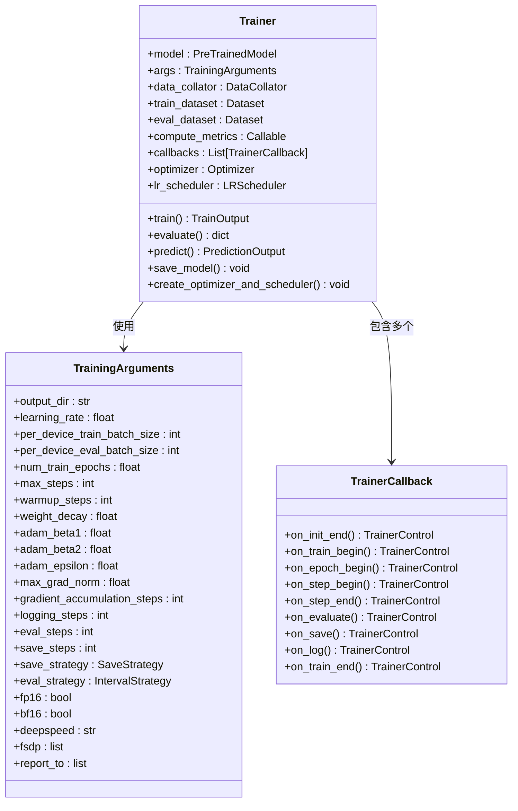

**图表来源**
- [trainer.py](file://src/transformers/trainer.py#L200-L400)
- [training_args.py](file://src/transformers/training_args.py#L200-L400)
- [trainer_callback.py](file://src/transformers/trainer_callback.py#L200-L400)

### 核心组件说明

1. **模型管理**: 自动处理模型设备放置和并行化
2. **数据加载**: 支持多种数据格式和动态填充
3. **训练循环**: 完整的前向传播、反向传播和优化器更新
4. **评估机制**: 定期评估和指标记录
5. **检查点保存**: 智能的模型保存策略
6. **日志记录**: 多种日志输出格式支持

**章节来源**
- [trainer.py](file://src/transformers/trainer.py#L200-L600)

## 训练参数配置

### 基础训练参数

TrainingArguments 提供了丰富的配置选项：

```mermaid
flowchart TD
A[TrainingArguments] --> B[基本参数]
A --> C[优化器参数]
A --> D[调度器参数]
A --> E[数据加载参数]
A --> F[保存与评估参数]
A --> G[分布式参数]
A --> H[混合精度参数]
B --> B1[output_dir]
B --> B2[do_train/do_eval]
B --> B3[num_train_epochs/max_steps]
C --> C1[learning_rate]
C --> C2[weight_decay]
C --> C3[adam_beta1/beta2]
D --> D1[lr_scheduler_type]
D --> D2[warmup_steps]
D --> D3[gradient_accumulation_steps]
E --> E1[per_device_train_batch_size]
E --> E2[dataloader_num_workers]
E --> E3[dataloader_pin_memory]
F --> F1[save_strategy]
F --> F2[eval_strategy]
F --> F3[logging_steps]
G --> G1[deepspeed]
G --> G2[fsdp]
G --> G3[n_gpu]
H --> H1[fp16/bf16]
H --> H2[tf32]
H --> H3[torch_compile]
```

**图表来源**
- [training_args.py](file://src/transformers/training_args.py#L200-L800)

### 关键配置参数详解

| 参数类别 | 主要参数 | 默认值 | 说明 |
|---------|---------|--------|------|
| 基本训练 | `learning_rate` | 5e-5 | 初始学习率 |
| 基本训练 | `num_train_epochs` | 3.0 | 训练轮数 |
| 批处理 | `per_device_train_batch_size` | 8 | 每设备批次大小 |
| 批处理 | `gradient_accumulation_steps` | 1 | 梯度累积步数 |
| 学习率调度 | `warmup_steps` | 0 | 预热步数 |
| 学习率调度 | `lr_scheduler_type` | "linear" | 调度器类型 |
| 权重衰减 | `weight_decay` | 0.0 | 权重衰减系数 |
| 梯度裁剪 | `max_grad_norm` | 1.0 | 梯度最大范数 |

**章节来源**
- [training_args.py](file://src/transformers/training_args.py#L200-L800)

## 优化器与学习率调度器

### 支持的优化器类型

Transformers 支持多种优化器：

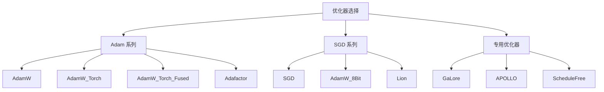

**图表来源**
- [training_args.py](file://src/transformers/training_args.py#L150-L250)
- [optimization.py](file://src/transformers/optimization.py#L50-L150)

### 学习率调度器类型

| 调度器类型 | 描述 | 适用场景 |
|-----------|------|----------|
| `linear` | 线性预热后线性衰减 | 标准训练任务 |
| `cosine` | 余弦预热后余弦衰减 | 需要平滑学习率变化 |
| `cosine_with_restarts` | 余弦预热后重启衰减 | 避免局部最优 |
| `polynomial` | 多项式预热后多项式衰减 | 特殊需求 |
| `constant` | 恒定学习率 | 稳定训练 |
| `constant_with_warmup` | 预热后恒定学习率 | 温和开始训练 |
| `reduce_lr_on_plateau` | 基于验证指标衰减 | 验证集监控 |

**章节来源**
- [optimization.py](file://src/transformers/optimization.py#L578-L601)

## 回调函数系统

### 回调函数架构

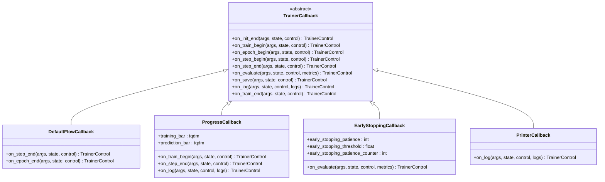

**图表来源**
- [trainer_callback.py](file://src/transformers/trainer_callback.py#L200-L600)

### 内置回调函数

1. **DefaultFlowCallback**: 处理默认的训练流程控制
2. **ProgressCallback**: 显示训练进度条
3. **EarlyStoppingCallback**: 实现早停机制
4. **PrinterCallback**: 简单的日志打印

**章节来源**
- [trainer_callback.py](file://src/transformers/trainer_callback.py#L200-L768)

## 自定义训练循环

### 创建自定义 Trainer 类

对于需要更精细控制的场景，可以继承 Trainer 类：

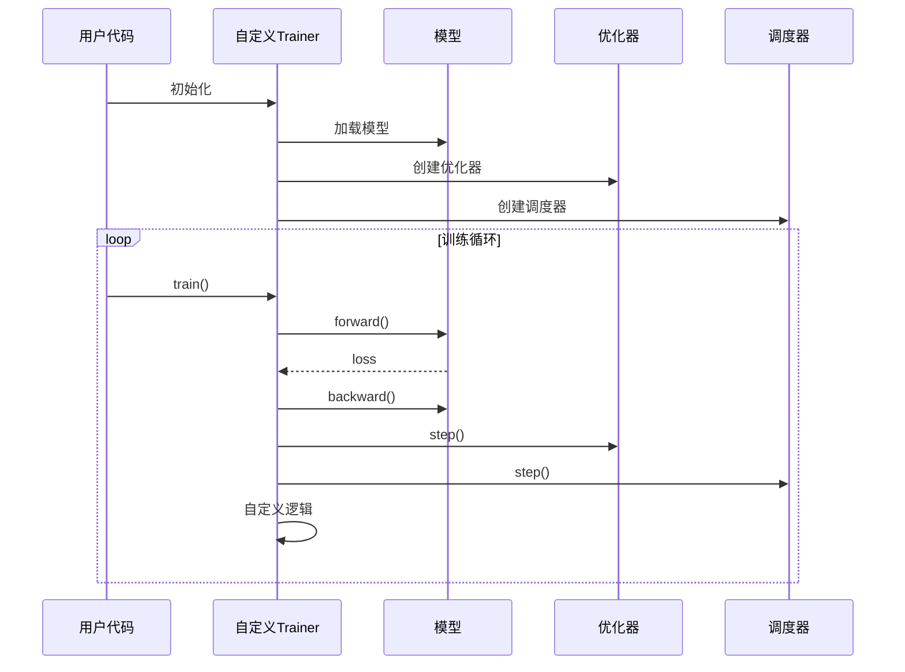

**图表来源**
- [trainer.py](file://src/transformers/trainer.py#L2500-L2600)

### 自定义训练步骤

可以通过重写以下方法实现自定义训练逻辑：

1. **`create_optimizer_and_scheduler`**: 自定义优化器和调度器创建
2. **`training_step`**: 自定义训练步骤
3. **`prediction_step`**: 自定义预测步骤
4. **`compute_loss`**: 自定义损失计算

**章节来源**
- [trainer.py](file://src/transformers/trainer.py#L2500-L2700)

## 分布式训练

### 支持的分布式策略

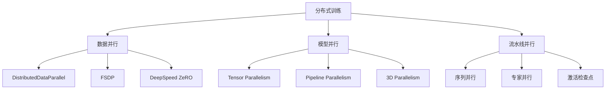

**图表来源**
- [distributed_training.py](file://examples/training/distributed_training.py#L1-L50)
- [3D_parallel.py](file://examples/3D_parallel.py#L1-L50)

### FSDP 配置

FSDP (Fully Sharded Data Parallel) 配置选项：

| 配置项 | 可选值 | 说明 |
|-------|--------|------|
| `fsdp` | `full_shard`, `shard_grad_op`, `hybrid_shard` | 分片策略 |
| `fsdp_config` | `{"activation_checkpointing": true}` | 激活检查点 |
| `cpu_ram_efficient_loading` | `true/false` | CPU内存优化加载 |
| `backward_prefetch` | `backward_pre`, `backward_post` | 后向预取策略 |

### DeepSpeed 配置

DeepSpeed ZeRO 阶段配置：

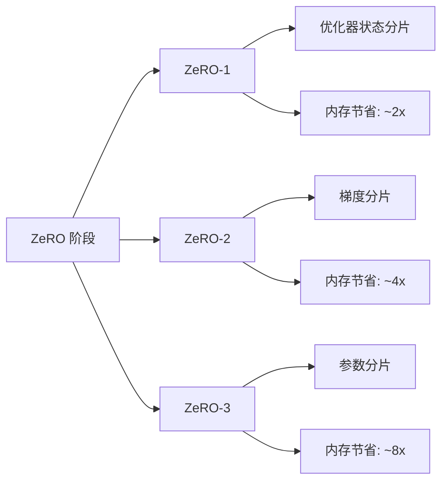

**图表来源**
- [training_args.py](file://src/transformers/training_args.py#L600-L700)

**章节来源**
- [distributed_training.py](file://examples/training/distributed_training.py#L1-L114)
- [3D_parallel.py](file://examples/3D_parallel.py#L1-L23)

## 混合精度训练

### 支持的精度类型

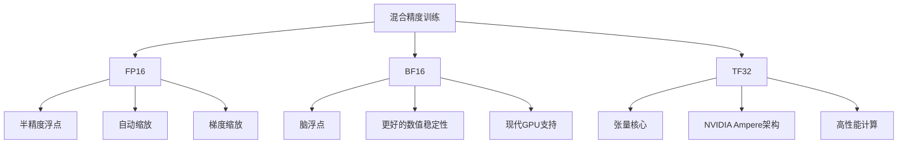

### 精度配置选项

| 参数 | 类型 | 说明 | 性能影响 |
|------|------|------|----------|
| `fp16` | `bool` | 启用FP16训练 | 减少50%内存，可能影响精度 |
| `bf16` | `bool` | 启用BF16训练 | 减少50%内存，更好稳定性 |
| `tf32` | `bool` | 启用TF32 | 提升计算速度 |
| `torch_compile` | `bool` | 启用编译优化 | 显著提升推理速度 |

**章节来源**
- [training_args.py](file://src/transformers/training_args.py#L400-L500)

## 数据处理与预处理

### 数据整理器 (Data Collator)

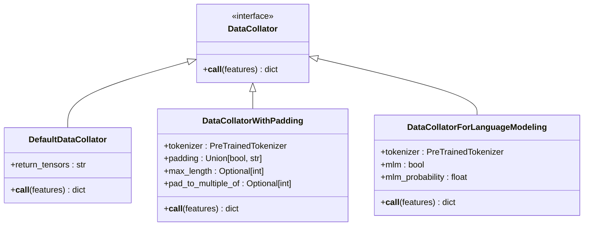

**图表来源**
- [data_collator.py](file://src/transformers/data/data_collator.py#L50-L200)

### 数据处理流程

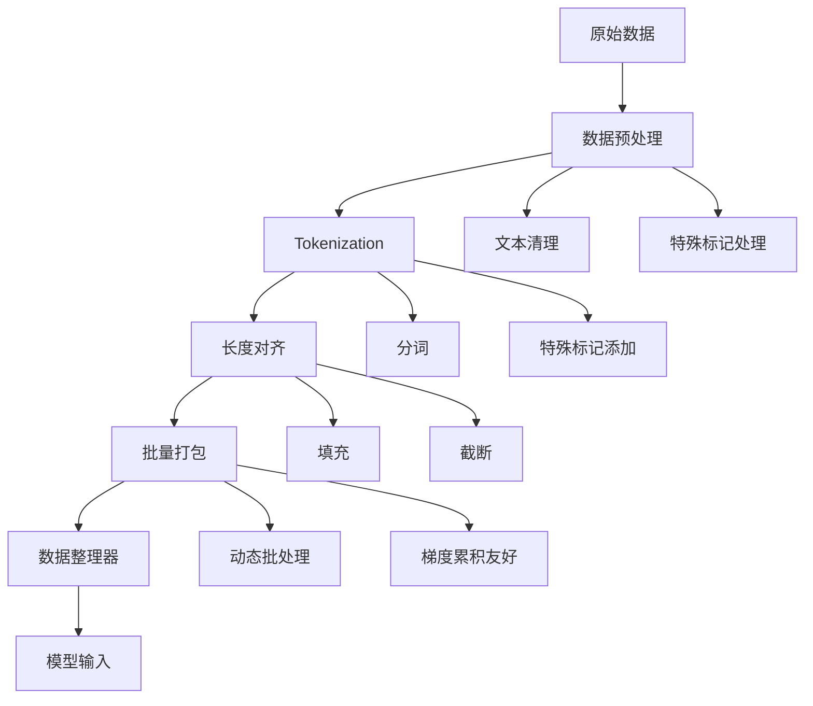

**图表来源**
- [data_collator.py](file://src/transformers/data/data_collator.py#L100-L400)

**章节来源**
- [data_collator.py](file://src/transformers/data/data_collator.py#L1-L800)

## PEFT 与适配器训练

### LoRA (Low-Rank Adaptation)

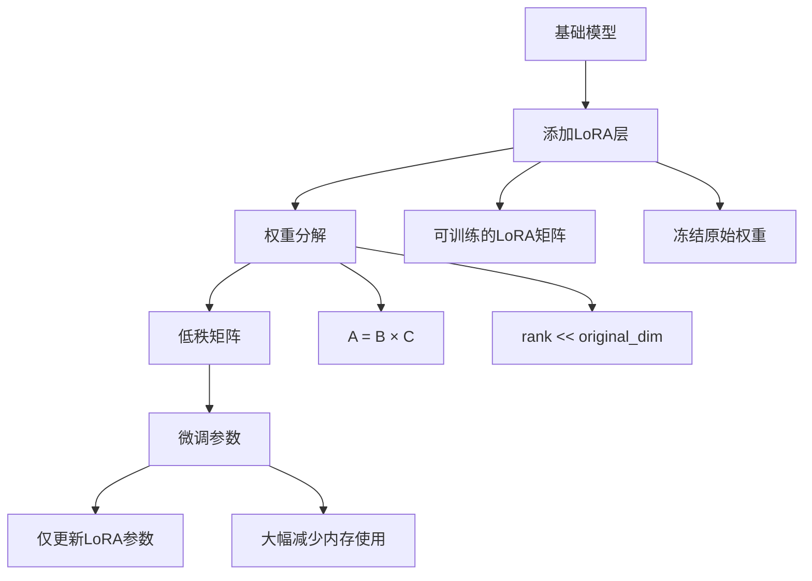

**图表来源**
- [peft.py](file://src/transformers/integrations/peft.py#L300-L400)

### PEFT 配置示例

| 配置参数 | 说明 | 推荐值 |
|---------|------|--------|
| `r` | LoRA秩 | 8-64 |
| `lora_alpha` | LoRA缩放因子 | r的倍数 |
| `target_modules` | 目标模块列表 | ["q_proj", "v_proj"] |
| `lora_dropout` | Dropout概率 | 0.1 |
| `bias` | 是否训练偏置 | "none" |

**章节来源**
- [peft.py](file://src/transformers/integrations/peft.py#L100-L400)

## 量化训练

### 量化方法对比

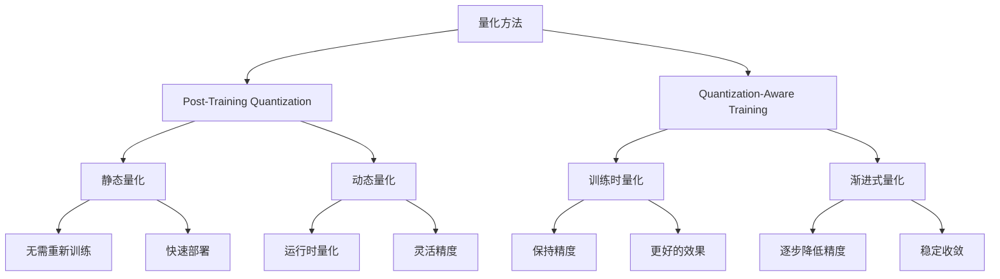

**图表来源**
- [quantization_config.py](file://src/transformers/utils/quantization_config.py#L1500-L1600)

### 量化配置选项

| 量化类型 | 方法 | 精度 | 内存节省 | 速度提升 |
|---------|------|------|----------|----------|
| INT8 | 动态量化 | 8位 | ~50% | 1.5-2x |
| INT4 | 静态量化 | 4位 | ~75% | 2-3x |
| FP16 | 半精度 | 16位 | ~50% | 1.5-2x |
| BF16 | 脑浮点 | 16位 | ~50% | 1.5-2x |

**章节来源**
- [quantization_config.py](file://src/transformers/utils/quantization_config.py#L1500-L1600)

## 完整训练脚本示例

### 文本分类训练示例

以下是基于 run_classification.py 的完整训练脚本结构：

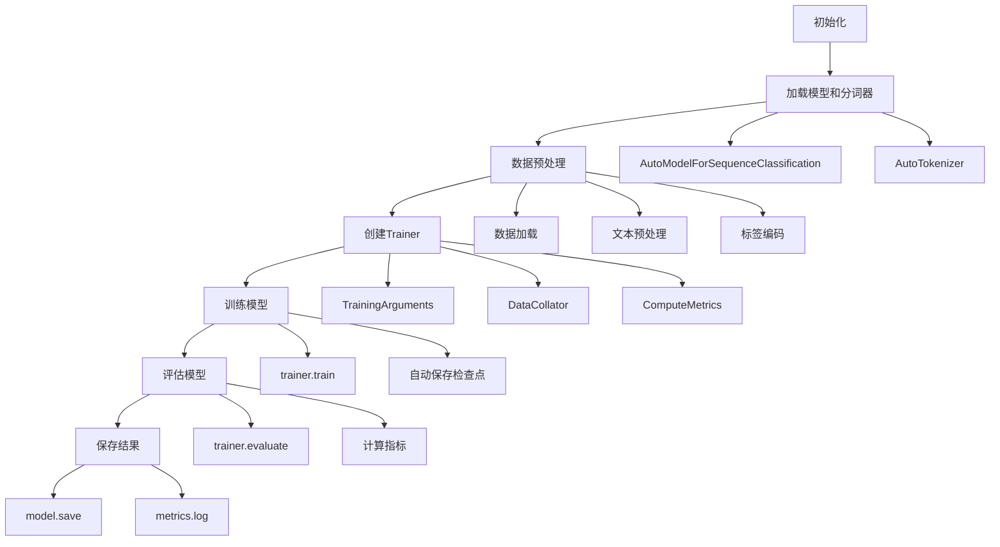

**图表来源**
- [run_classification.py](file://examples/pytorch/text-classification/run_classification.py#L400-L600)

### 语言模型训练示例

语言模型训练的关键特点：

1. **因果语言建模**: 使用 `AutoModelForCausalLM`
2. **掩码语言建模**: 使用 `DataCollatorForLanguageModeling`
3. **流式数据处理**: 支持大型数据集
4. **上下文窗口管理**: 处理长序列

**章节来源**
- [run_classification.py](file://examples/pytorch/text-classification/run_classification.py#L1-L746)
- [run_clm.py](file://examples/pytorch/language-modeling/run_clm.py#L1-L200)

## 性能调优与最佳实践

### 内存优化策略

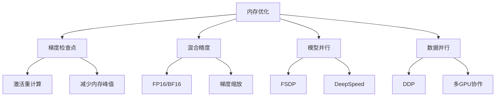

### 性能监控指标

| 指标类别 | 关键指标 | 监控方法 |
|---------|---------|----------|
| 训练效率 | 样本/秒 | `speed_metrics` |
| 内存使用 | GPU内存占用 | `TrainerMemoryTracker` |
| 损失曲线 | 训练/验证损失 | 日志记录 |
| 学习率 | 当前学习率 | `on_log`回调 |

### 最佳实践建议

1. **批处理大小**: 从较小值开始，逐步增加
2. **学习率搜索**: 使用学习率预热和衰减
3. **早停机制**: 基于验证指标设置早停
4. **检查点策略**: 平衡存储空间和恢复能力
5. **日志记录**: 详细记录训练过程

## 常见问题与解决方案

### 内存相关问题

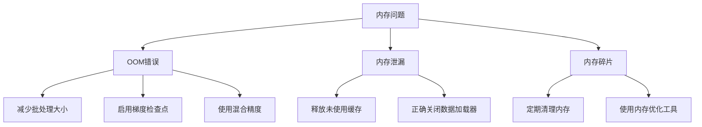

### 训练收敛问题

| 问题类型 | 可能原因 | 解决方案 |
|---------|---------|----------|
| 损失不下降 | 学习率过高/过低 | 调整学习率或使用调度器 |
| 验证损失上升 | 过拟合 | 增加正则化或早停 |
| 训练速度慢 | 数据加载瓶颈 | 优化数据管道 |
| 内存不足 | 批处理过大 | 减小批处理大小或使用梯度累积 |

### 分布式训练问题

1. **同步问题**: 确保所有节点时间同步
2. **网络延迟**: 优化通信拓扑
3. **设备不匹配**: 统一硬件规格
4. **检查点冲突**: 使用分布式文件系统

**章节来源**
- [trainer_utils.py](file://src/transformers/trainer_utils.py#L600-L800)

## 结论

Transformers 的 Trainer API 提供了强大而灵活的训练框架，支持从基础文本分类到大规模语言模型的各种训练任务。通过合理配置训练参数、优化器、调度器和数据处理流程，可以实现高效的模型训练。

关键要点：
- 选择合适的优化器和调度器
- 利用分布式训练和混合精度提升效率
- 使用 PEFT 技术进行高效微调
- 实施适当的监控和调试策略
- 遵循最佳实践以获得最佳性能

通过本指南的学习，用户应该能够掌握 Transformers 训练的核心概念，并能够根据具体任务需求设计和实施有效的训练方案。