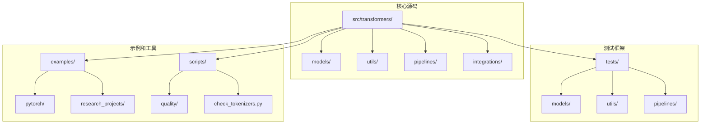
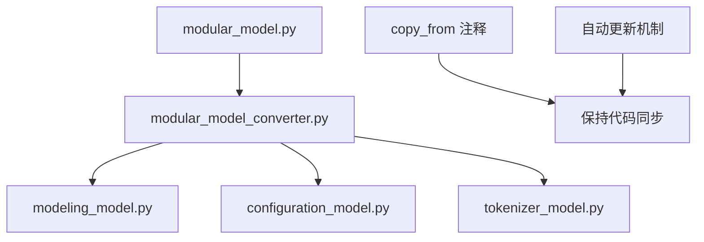
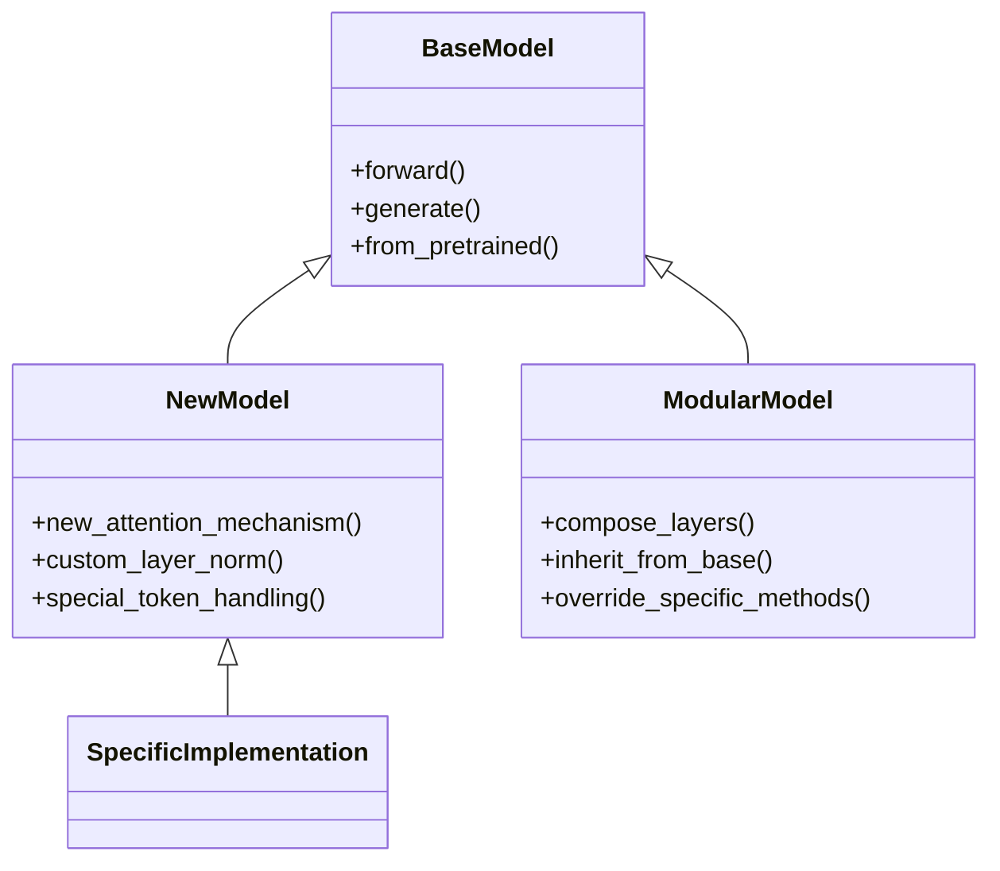
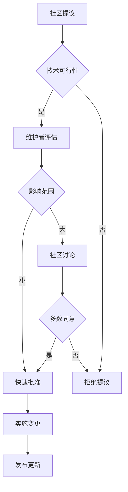

# 贡献指南

<cite>
**本文档中引用的文件**
- [CONTRIBUTING.md](file://CONTRIBUTING.md)
- [CODE_OF_CONDUCT.md](file://CODE_OF_CONDUCT.md)
- [ISSUES.md](file://ISSUES.md)
- [SECURITY.md](file://SECURITY.md)
- [README.md](file://README.md)
- [setup.py](file://setup.py)
- [pyproject.toml](file://pyproject.toml)
- [Makefile](file://Makefile)
- [AGENTS.md](file://AGENTS.md)
- [templates/adding_a_new_model/ADD_NEW_MODEL_PROPOSAL_TEMPLATE.md](file://templates/adding_a_new_model/ADD_NEW_MODEL_PROPOSAL_TEMPLATE.md)
- [templates/adding_a_new_model/README.md](file://templates/adding_a_new_model/README.md)
</cite>

## 目录
1. [简介](#简介)
2. [项目结构概览](#项目结构概览)
3. [贡献方式](#贡献方式)
4. [开发环境设置](#开发环境设置)
5. [代码风格指南](#代码风格指南)
6. [测试要求](#测试要求)
7. [提交拉取请求](#提交拉取请求)
8. [添加新模型](#添加新模型)
9. [问题报告和功能请求](#问题报告和功能请求)
10. [文档贡献](#文档贡献)
11. [项目治理结构](#项目治理结构)
12. [行为准则](#行为准则)
13. [安全政策](#安全政策)
14. [常见问题解答](#常见问题解答)
15. [最佳实践](#最佳实践)

## 简介

🤗 Transformers 是一个状态领先的人工智能库，为文本、计算机视觉、音频、视频和多模态模型提供最先进的预训练模型。我们欢迎所有形式的贡献，无论大小，都对社区有价值。从代码贡献到回答问题、帮助他人和改进文档都是极其宝贵的。

本指南基于 Hugging Face 的开源项目贡献最佳实践，旨在为潜在贡献者提供清晰的路径和期望。我们致力于创建一个开放、友好、多元化的社区环境。

## 项目结构概览

Transformers 项目采用模块化架构设计，主要组件包括：



**图表来源**
- [src/transformers/](file://src/transformers/)
- [tests/](file://tests/)
- [examples/](file://examples/)

**章节来源**
- [README.md](file://README.md#L1-L50)
- [setup.py](file://setup.py#L1-L100)

## 贡献方式

Transformers 提供多种贡献方式：

### 1. 修复现有问题
- 查看现有的待办事项列表
- 报告新发现的问题
- 实现新的模型
- 改进示例或文档

### 2. 获取帮助
- 在 [论坛](https://discuss.huggingface.co/) 上提问
- 加入我们的 [Discord 服务器](https://discord.com/invite/hugging-face-879548962464493619)
- 使用 [文档机器人](https://huggingface.co/spaces/huggingchat/hf-docs-chat)

### 3. 社区推广
- 在博客文章中引用库
- 在 Twitter 上分享使用经验
- 给仓库点星以表示感谢

**章节来源**
- [CONTRIBUTING.md](file://CONTRIBUTING.md#L25-L50)

## 开发环境设置

### 系统要求
- Python 3.10 或更高版本
- PyTorch 2.2+（可选）
- Git 版本控制

### 安装步骤

1. **克隆仓库**
```bash
git clone https://github.com/huggingface/transformers.git
cd transformers
```

2. **创建虚拟环境**
```bash
# 使用 venv
python -m venv .venv
source .venv/bin/activate  # Linux/macOS
# 或 .venv\Scripts\activate  # Windows

# 或使用 uv
uv venv .venv
source .venv/bin/activate
```

3. **安装开发依赖**
```bash
# 基础开发环境
pip install -e ".[dev]"

# 如果遇到依赖问题
pip install -e ".[quality]"
```

4. **验证安装**
```bash
# 检查环境信息
transformers env

# 运行基本测试
pytest tests/test_modeling_common.py -v
```

### 可选依赖项

根据需要安装特定功能的依赖：

| 功能类别 | 安装命令 | 描述 |
|---------|---------|------|
| PyTorch | `pip install ".[torch]"` | PyTorch 框架支持 |
| 音频处理 | `pip install ".[audio]"` | 音频相关功能 |
| 视觉处理 | `pip install ".[vision]"` | 图像处理功能 |
| 测试 | `pip install ".[testing]"` | 测试框架 |
| 全部功能 | `pip install ".[all]"` | 所有可选功能 |

**章节来源**
- [CONTRIBUTING.md](file://CONTRIBUTING.md#L253-L320)
- [setup.py](file://setup.py#L300-L400)

## 代码风格指南

### 代码格式化
Transformers 使用以下工具进行代码格式化：
- **Ruff**: 代码检查和格式化
- **Black**: 代码格式化
- **isort**: 导入排序

### 格式化命令
```bash
# 自动修复所有格式问题
make fixup

# 单独运行格式化
make style

# 检查代码质量
make quality

# 检查仓库一致性
make repo-consistency
```

### 代码规范

1. **导入管理**
   - 使用 `isort` 自动排序导入
   - 避免循环导入
   - 按照标准库、第三方库、本地库的顺序组织

2. **文档字符串**
   - 遵循 Google Python 风格指南
   - 为公共方法提供详细的 docstring
   - 包含参数说明和返回值描述

3. **注释规范**
   - 使用英文注释
   - 避免冗余注释
   - 对复杂逻辑提供必要说明

### 模块化架构
Transformers 推荐使用模块化文件模式：



**图表来源**
- [AGENTS.md](file://AGENTS.md#L15-L25)

**章节来源**
- [CONTRIBUTING.md](file://CONTRIBUTING.md#L400-L450)
- [pyproject.toml](file://pyproject.toml#L1-L50)

## 测试要求

### 测试框架
- **pytest**: 主要测试框架
- **pytest-xdist**: 并行测试执行
- **覆盖率**: 代码覆盖率检查

### 运行测试
```bash
# 运行所有测试
make test

# 运行特定模型测试
pytest tests/models/bert/test_modeling_bert.py -v

# 运行示例测试
make test-examples

# 运行慢速测试
RUN_SLOW=1 pytest tests/models/my_new_model/
```

### 测试类型

1. **单元测试**: 测试单个函数和类
2. **集成测试**: 测试组件间的交互
3. **性能测试**: 性能基准测试
4. **跨平台测试**: 不同操作系统和框架的兼容性测试

### 新模型测试要求
添加新模型时必须包含：
- 模型测试类
- 分离器测试
- 记号器测试
- 配置测试

**章节来源**
- [CONTRIBUTING.md](file://CONTRIBUTING.md#L450-L514)

## 提交拉取请求

### PR 流程

1. **准备工作**
   - 搜索现有 PR 和 issues
   - 创建功能分支
   - 更新本地代码

2. **开发阶段**
   - 编写代码
   - 运行测试
   - 应用代码格式化

3. **提交阶段**
   - 提交更改
   - 推送到远程仓库
   - 创建拉取请求

### 提交规范

```bash
# 提交消息示例
git commit -m "feat(model): add support for new model architecture"
git commit -m "fix(tokenizer): resolve encoding issue with special tokens"
git commit -m "docs: update installation instructions"
```

### PR 检查清单

- [ ] 标题清楚地总结了您的贡献
- [ ] 如果 PR 解决了 issue，请在描述中提及 issue 编号
- [ ] 工作中的 PR 应该以 `[WIP]` 为前缀
- [ ] 确保现有测试通过
- [ ] 添加新功能时也添加相应的测试
- [ ] 所有公共方法都有详细的 docstring
- [ ] 避免添加图片或其他非文本文件

**章节来源**
- [CONTRIBUTING.md](file://CONTRIBUTING.md#L320-L400)

## 添加新模型

### 模型贡献流程

1. **准备阶段**
   - 研究现有模型架构
   - 准备论文链接和实现信息
   - 确定权重来源

2. **开发阶段**
   - 使用模块化文件模式
   - 实现快速图像处理器
   - 创建权重转换脚本
   - 添加集成测试

3. **验证阶段**
   - 运行质量检查
   - 确保所有测试通过
   - 更新文档

### 视觉语言模型贡献检查清单

#### 必需步骤

1. **实现模块化文件**
   ```bash
   transformers add-new-model-like
   python utils/modular_model_converter.py <model_name>
   ```

2. **添加快速图像处理器**
   - 继承 `BaseImageProcessorFast`
   - 使用 `torch` 和 `torchvision`

3. **创建权重转换脚本**
   - 处理检查点加载
   - 映射键名
   - 保存为 HuggingFace 格式

4. **添加集成测试**
   - 端到端生成测试
   - 精确输出匹配

5. **更新文档**
   - 添加模型文档
   - 更新目录文件

#### 质量检查

```bash
# 运行完整检查套件
pip install -e ".[quality]"
make fixup
```

### 模型架构模式



**图表来源**
- [templates/adding_a_new_model/README.md](file://templates/adding_a_new_model/README.md)

**章节来源**
- [CONTRIBUTING.md](file://CONTRIBUTING.md#L80-L200)

## 问题报告和功能请求

### 报告 Bug

1. **搜索现有问题**
   - 使用 GitHub Issues 搜索栏
   - 确认问题未被报告过

2. **收集信息**
   - 操作系统类型和版本
   - Python 和 PyTorch 版本
   - 简短、自包含的代码片段
   - 完整的错误堆栈跟踪

3. **使用环境信息命令**
```bash
# 获取环境信息
transformers env

# 或从仓库根目录运行
python src/transformers/commands/transformers_cli.py env
```

### 功能请求

1. **明确动机**
   - 描述问题或痛点
   - 说明功能需求
   - 提供使用场景

2. **详细描述**
   - 功能的具体实现细节
   - 代码示例
   - 相关论文链接（如适用）

### 问题模板

使用项目提供的模板帮助您更好地组织问题信息。

**章节来源**
- [CONTRIBUTING.md](file://CONTRIBUTING.md#L50-L150)
- [ISSUES.md](file://ISSUES.md#L1-L100)

## 文档贡献

### 文档类型

1. **API 文档**
   - 类和方法的详细说明
   - 参数和返回值描述
   - 使用示例

2. **教程和指南**
   - 快速入门指南
   - 高级使用技巧
   - 最佳实践

3. **参考文档**
   - 配置选项
   - 常见问题解答
   - 故障排除指南

### 文档构建

```bash
# 安装文档构建工具
pip install hf-doc-builder

# 构建文档
doc-builder build transformers docs/source/en --build_dir ~/tmp/test-build
```

### 文档写作指南

- 遵循 Google Python 风格指南
- 使用清晰、简洁的语言
- 提供实际的代码示例
- 包含必要的上下文信息

**章节来源**
- [CONTRIBUTING.md](file://CONTRIBUTING.md#L380-L400)

## 项目治理结构

### 维护者角色

Transformers 项目由以下角色组成：

1. **核心维护者**
   - 项目方向决策
   - 重大变更审批
   - 社区治理

2. **领域专家**
   - 特定模型领域的专业知识
   - 代码审查
   - 技术指导

3. **社区贡献者**
   - 代码贡献
   - 问题报告
   - 文档改进

### 决策流程



### 代码审查

- 所有代码变更都需要审查
- 维护者负责审查质量
- 社区成员可以提供反馈
- 关注代码质量和向后兼容性

**章节来源**
- [AGENTS.md](file://AGENTS.md#L1-L39)

## 行为准则

### 我们的承诺

我们承诺为每个人创造一个无骚扰的社区体验，无论年龄、体型、残疾、种族、性别特征、性别认同和表达、经验水平、教育程度、社会经济地位、国籍、个人外貌、种族、种姓、肤色、宗教或性取向如何。

### 我们的标准

**积极行为：**
- 展示对他人的同情和善意
- 尊重不同的观点、观点和经验
- 优雅地接受建设性反馈
- 承担责任并为受影响的人道歉
- 关注对整个社区最有利的事情

**不可接受的行为：**
- 性化的语言或图像以及任何形式的性关注
- 恶意评论、侮辱性/贬损性评论和私人或政治攻击
- 公开或私下骚扰
- 未经明确许可发布他人的私人信息
- 在专业环境中可能被认为是不当的其他行为

### 执行责任

社区领导者负责澄清和执行我们的行为标准，并将对任何被认为不当、威胁、冒犯或有害的行为采取适当和公平的纠正措施。

### 范围

本行为准则适用于所有社区空间，也适用于个人在公共空间代表社区的情况。

**章节来源**
- [CODE_OF_CONDUCT.md](file://CODE_OF_CONDUCT.md#L1-L134)

## 安全政策

### 远程工件安全

Transformers 是与 Hugging Face Hub 紧密耦合的开源软件。当下载上传到任何平台的工件时，您会面临风险。请阅读以下安全建议，以确保您的运行时和本地环境安全。

### 远程代码

Transformers 支持许多模型架构，但也是连接您的 Python 运行时和存储在 Hugging Face Hub 上的模型仓库之间的桥梁。使用这些模型时需要设置 `trust_remote_code=True` 参数，请始终验证建模文件的内容。

### 报告漏洞

请将漏洞报告发送至 [security@huggingface.co](mailto:security@huggingface.co)，HF 安全团队将审核并推荐下一步行动。如果报告的是开源特定的漏洞，请注意 [Huntr](https://huntr.com) 是开源软件的漏洞披露计划。

**章节来源**
- [SECURITY.md](file://SECURITY.md#L1-L33)

## 常见问题解答

### Q: 如何开始贡献？
A: 从 [Good First Issue](https://github.com/huggingface/transformers/contribute) 列表开始，选择适合初学者的项目。如果您不确定从哪里开始，可以查看 Good First Issue 列表，它会为您提供一份面向初学者的开放问题列表，帮助您开始为开源项目做贡献。

### Q: 我应该使用哪个 Python 版本？
A: Transformers 需要 Python 3.10 或更高版本。我们推荐使用最新的稳定版本以获得最佳兼容性。

### Q: 如何解决依赖冲突？
A: 如果遇到依赖问题，尝试：
1. 清理虚拟环境
2. 重新安装基础依赖
3. 使用 `pip install -e ".[quality]"` 安装最小依赖集

### Q: 测试失败怎么办？
A: 运行以下命令解决问题：
```bash
make fixup  # 自动修复格式和样式问题
make quality  # 运行质量检查
```

### Q: 如何添加新模型？
A: 参考添加新模型的详细指南，使用模块化文件模式并遵循检查清单。

### Q: 文档在哪里？
A: 查看 [官方文档](https://huggingface.co/docs/transformers) 获取详细指南。

## 最佳实践

### 1. 沟通技巧
- 在 GitHub 上提问时提供详细信息
- 使用清晰、具体的标题
- 避免重复提问
- 感谢维护者的帮助

### 2. 代码质量
- 编写自包含的测试
- 提供清晰的提交消息
- 遵循项目的编码标准
- 进行充分的本地测试

### 3. 时间管理
- 避免同时处理多个不相关的 PR
- 及时响应审查反馈
- 在长时间不活跃时通知维护者
- 合理估计工作量

### 4. 学习资源
- 阅读现有代码了解项目结构
- 参考成功的 PR 学习最佳实践
- 在论坛中寻求帮助
- 关注项目更新和公告

### 5. 社区参与
- 帮助其他贡献者
- 分享您的知识和经验
- 参与设计讨论
- 提供用户体验反馈

通过遵循这些指南和最佳实践，您可以有效地为 🤗 Transformers 项目做出贡献，同时为整个社区创造价值。我们期待看到您的贡献！