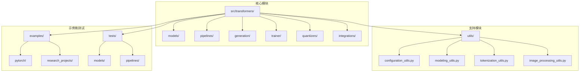
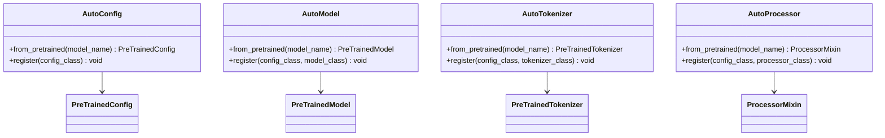
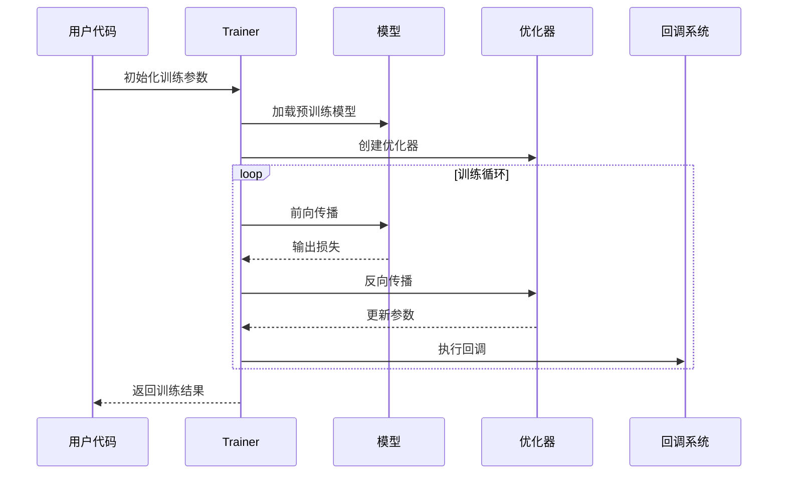
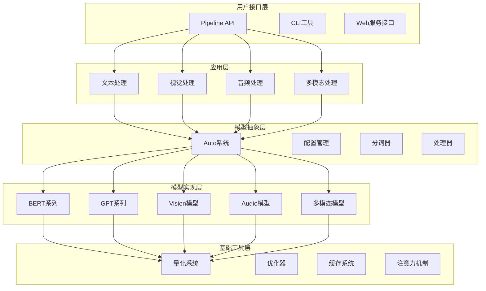
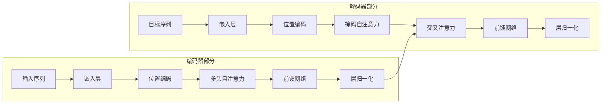
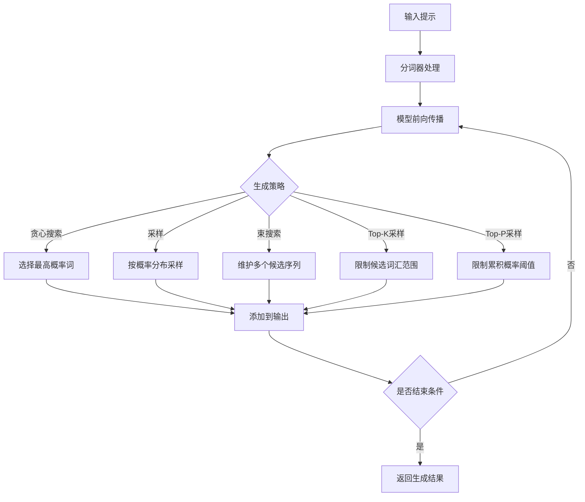
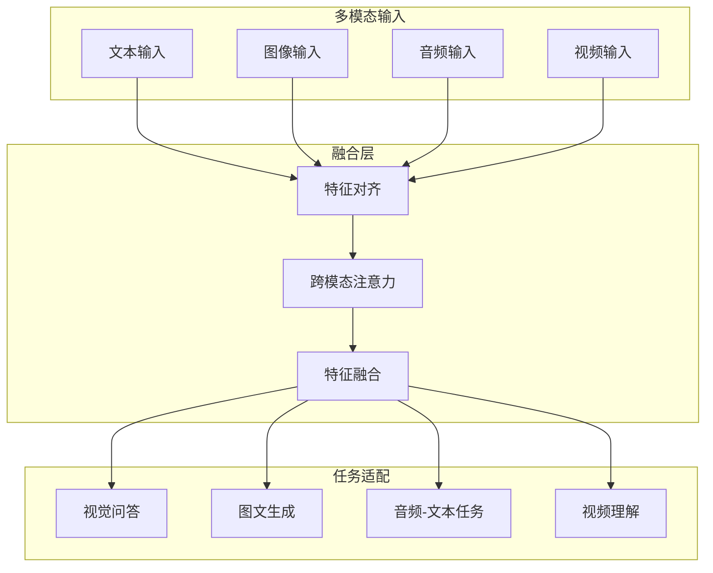
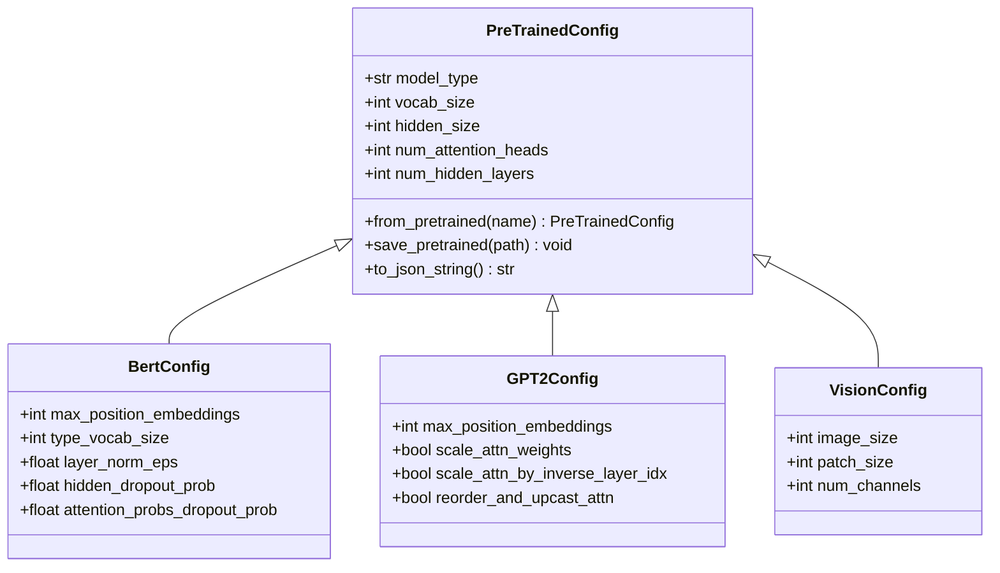
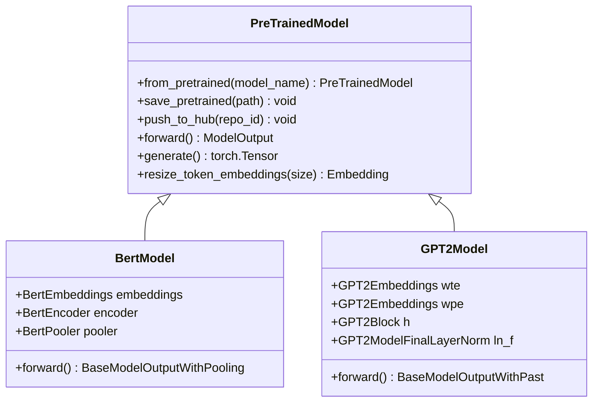
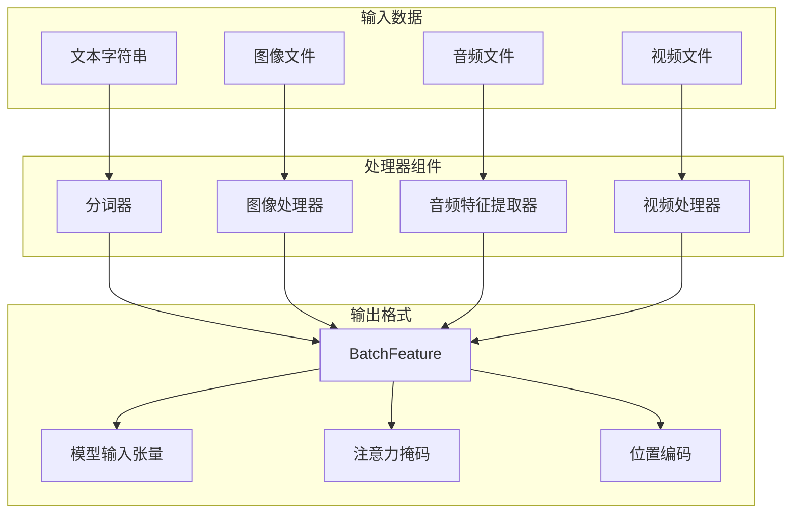

# 项目概述

<cite>
**本文档引用的文件**
- [README.md](file://README.md)
- [src/transformers/__init__.py](file://src/transformers/__init__.py)
- [src/transformers/models/auto/__init__.py](file://src/transformers/models/auto/__init__.py)
- [src/transformers/pipelines/__init__.py](file://src/transformers/pipelines/__init__.py)
- [src/transformers/trainer.py](file://src/transformers/trainer.py)
- [src/transformers/configuration_utils.py](file://src/transformers/configuration_utils.py)
- [src/transformers/modeling_utils.py](file://src/transformers/modeling_utils.py)
- [src/transformers/models/bert/modeling_bert.py](file://src/transformers/models/bert/modeling_bert.py)
- [src/transformers/models/gpt2/modeling_gpt2.py](file://src/transformers/models/gpt2/modeling_gpt2.py)
- [src/transformers/quantizers/auto.py](file://src/transformers/quantizers/auto.py)
</cite>

## 目录
1. [简介](#简介)
2. [项目结构](#项目结构)
3. [核心组件](#核心组件)
4. [架构概览](#架构概览)
5. [详细组件分析](#详细组件分析)
6. [支持的模型类型](#支持的模型类型)
7. [技术架构](#技术架构)
8. [性能考虑](#性能考虑)
9. [故障排除指南](#故障排除指南)
10. [结论](#结论)

## 简介

Transformers库是Hugging Face开发的一个强大的机器学习框架，专门用于处理自然语言处理（NLP）、计算机视觉、音频、视频和多模态任务。该库作为最先进的预训练模型的模型定义框架，统一了整个生态系统中的模型定义标准。

### 主要目标

- **简化模型使用**：为研究人员、工程师和开发者提供易于使用的先进模型
- **降低计算成本**：通过共享训练好的模型来减少计算时间和生产成本
- **跨平台兼容性**：支持多种训练框架（PyTorch、JAX、TensorFlow）和推理引擎
- **社区驱动发展**：拥有超过100万个预训练检查点和活跃的开源社区

### 核心特性

- 统一的API接口，支持所有预训练模型
- 高性能的推理和训练能力
- 广泛的模型支持（1000+种模型架构）
- 多模态融合能力
- 先进的量化和优化技术

**章节来源**
- [README.md](file://README.md#L1-L50)
- [src/transformers/__init__.py](file://src/transformers/__init__.py#L1-L50)

## 项目结构

Transformers库采用模块化架构设计，主要包含以下核心目录：

**图表来源**
- [src/transformers/__init__.py](file://src/transformers/__init__.py#L50-L150)

### 主要目录说明

- **models/**: 包含各种模型架构的实现（BERT、GPT、ViT等）
- **pipelines/**: 提供高级API接口，简化模型使用
- **generation/**: 实现文本生成和序列生成功能
- **trainer/**: 提供训练和微调的完整解决方案
- **quantizers/**: 支持各种量化技术以优化模型部署
- **integrations/**: 集成第三方库和优化工具

**章节来源**
- [src/transformers/__init__.py](file://src/transformers/__init__.py#L50-L200)

## 核心组件

### 1. Auto系统

Auto系统是Transformers库的核心抽象层，提供了自动化的模型、配置、分词器和处理器选择机制。

**图表来源**
- [src/transformers/models/auto/__init__.py](file://src/transformers/models/auto/__init__.py#L1-L34)

### 2. Pipeline API

Pipeline API提供了统一的高级接口，支持多种任务类型：

| 任务类型 | 描述 | 示例模型 |
|---------|------|----------|
| 文本分类 | 情感分析、主题分类 | BERT、RoBERTa |
| 命名实体识别 | 实体提取和分类 | BERT-NER |
| 问答系统 | 开放域问答 | BERT-QA |
| 文本生成 | 自然语言生成 | GPT、T5 |
| 图像分类 | 视觉分类任务 | ViT、ResNet |
| 目标检测 | 物体定位和识别 | DETR、YOLO |
| 语音识别 | 音频转文本 | Whisper |

**章节来源**
- [src/transformers/pipelines/__init__.py](file://src/transformers/pipelines/__init__.py#L100-L200)

### 3. Trainer系统

Trainer系统提供了完整的训练和微调解决方案，支持分布式训练和多种优化策略。

**图表来源**
- [src/transformers/trainer.py](file://src/transformers/trainer.py#L200-L400)

**章节来源**
- [src/transformers/trainer.py](file://src/transformers/trainer.py#L1-L100)

## 架构概览

Transformers库采用了分层架构设计，从底层的模型实现到顶层的用户接口：

**图表来源**
- [src/transformers/__init__.py](file://src/transformers/__init__.py#L50-L150)

## 详细组件分析

### 模型架构设计

Transformers库支持多种经典的神经网络架构模式：

#### 1. 编码器-解码器架构

**图表来源**
- [src/transformers/models/bert/modeling_bert.py](file://src/transformers/models/bert/modeling_bert.py#L50-L150)

#### 2. 解码器架构（仅解码器）

**图表来源**
- [src/transformers/models/gpt2/modeling_gpt2.py](file://src/transformers/models/gpt2/modeling_gpt2.py#L50-L150)

### 生成系统架构

生成系统提供了灵活的文本生成能力，支持多种生成策略：

**图表来源**
- [src/transformers/generation/__init__.py](file://src/transformers/generation/__init__.py#L1-L100)

### 量化系统

Transformers库集成了多种量化技术以优化模型部署：

| 量化方法 | 优势 | 适用场景 |
|---------|------|----------|
| INT8量化 | 显著减少内存占用 | 移动设备部署 |
| INT4量化 | 更高的压缩比 | 边缘计算 |
| GPTQ | 保持较高精度 | 生产环境 |
| AWQ | 优秀的量化质量 | 高精度要求 |
| 动态量化 | 运行时优化 | 实时推理 |

**章节来源**
- [src/transformers/quantizers/auto.py](file://src/transformers/quantizers/auto.py#L50-L150)

**章节来源**
- [src/transformers/models/bert/modeling_bert.py](file://src/transformers/models/bert/modeling_bert.py#L1-L100)
- [src/transformers/models/gpt2/modeling_gpt2.py](file://src/transformers/models/gpt2/modeling_gpt2.py#L1-L100)

## 支持的模型类型

### 自然语言处理（NLP）

Transformers库支持广泛的NLP任务和模型架构：

#### 文本理解任务
- **文本分类**: 情感分析、主题分类、意图识别
- **命名实体识别**: 实体提取和分类
- **问答系统**: 开放域问答、抽取式问答
- **阅读理解**: 理解复杂文本内容

#### 文本生成任务
- **语言建模**: 预测下一个词或字符
- **对话生成**: 聊天机器人、对话系统
- **摘要生成**: 文本压缩和总结
- **翻译**: 多语言文本转换

### 计算机视觉

#### 图像理解
- **图像分类**: 图像内容识别
- **目标检测**: 物体定位和识别
- **语义分割**: 像素级分类
- **实例分割**: 区分同一类别的不同实例

#### 图像生成
- **图像到图像**: 图像风格转换
- **图像描述**: 图像内容的文字描述
- **图像修复**: 缺失区域填充

### 音频处理

#### 音频理解
- **语音识别**: 音频转文本
- **音频分类**: 音频内容分类
- **关键词检测**: 关键词识别

#### 音频生成
- **文本转语音**: 合成自然语音
- **音乐生成**: 音乐创作
- **语音合成**: 个性化语音生成

### 多模态模型

多模态模型能够处理和理解多种类型的数据：

**图表来源**
- [src/transformers/models/qwen3_omni_moe/modeling_qwen3_omni_moe.py](file://src/transformers/models/qwen3_omni_moe/modeling_qwen3_omni_moe.py#L300-L325)

**章节来源**
- [src/transformers/pipelines/__init__.py](file://src/transformers/pipelines/__init__.py#L150-L300)

## 技术架构

### 统一配置系统

每个模型都有对应的配置类，继承自`PreTrainedConfig`：

**图表来源**
- [src/transformers/configuration_utils.py](file://src/transformers/configuration_utils.py#L50-L150)

### 模型基类系统

所有模型都继承自`PreTrainedModel`，提供统一的接口：

**图表来源**
- [src/transformers/modeling_utils.py](file://src/transformers/modeling_utils.py#L50-L150)

### 分词器系统

分词器负责将原始数据转换为模型可接受的格式：

### 处理器系统

处理器整合了分词器、图像处理器和特征提取器：

**章节来源**
- [src/transformers/configuration_utils.py](file://src/transformers/configuration_utils.py#L1-L100)
- [src/transformers/modeling_utils.py](file://src/transformers/modeling_utils.py#L1-L100)

## 性能考虑

### 内存优化

Transformers库实现了多种内存优化技术：

1. **梯度检查点**: 在训练过程中重新计算中间激活值
2. **混合精度训练**: 使用FP16减少内存占用
3. **模型并行**: 将大模型分布在多个GPU上
4. **动态批处理**: 根据序列长度调整批大小

### 推理优化

1. **KV缓存**: 缓存键值对以加速自回归生成
2. **Flash Attention**: 高效的注意力计算
3. **量化部署**: 减少模型大小和推理时间
4. **编译优化**: 使用`torch.compile`加速计算

### 分布式训练

支持多种分布式训练策略：
- 数据并行
- 模型并行
- 流水线并行
- ZeRO优化器状态分片

## 故障排除指南

### 常见问题

#### 1. 内存不足错误
**原因**: 模型太大或批大小设置过高
**解决方案**:
- 使用量化技术（INT8/INT4）
- 启用梯度检查点
- 减小批大小
- 使用混合精度训练

#### 2. 模型加载失败
**原因**: 权重不匹配或版本不兼容
**解决方案**:
- 检查模型版本兼容性
- 使用`trust_remote_code=True`加载自定义模型
- 清理缓存重新下载

#### 3. 生成质量不佳
**原因**: 参数设置不当或模型不适合任务
**解决方案**:
- 调整生成参数（temperature、top_k、top_p）
- 使用更适合的模型架构
- 微调模型参数

**章节来源**
- [src/transformers/trainer.py](file://src/transformers/trainer.py#L400-L600)

## 结论

Transformers库作为一个成熟的机器学习框架，在以下几个方面表现出色：

### 技术优势

1. **统一的抽象层**: Auto系统简化了模型选择和使用
2. **丰富的模型支持**: 覆盖NLP、CV、音频、多模态等多个领域
3. **高性能优化**: 集成了多种量化和优化技术
4. **社区生态**: 活跃的开源社区和丰富的预训练模型

### 应用价值

- **研究友好**: 提供最新的研究成果和实验平台
- **工业可用**: 支持大规模部署和生产环境
- **易于扩展**: 模块化设计便于定制和扩展
- **跨平台兼容**: 支持多种硬件和软件环境

### 发展方向

随着人工智能技术的不断发展，Transformers库将继续在以下方面演进：
- 更高效的量化和压缩技术
- 更智能的模型选择和优化算法
- 更完善的多模态融合能力
- 更友好的开发者体验

对于初学者来说，Transformers库提供了从简单使用到深度定制的完整路径；对于经验丰富的开发者，它提供了灵活的扩展能力和先进的技术特性。这个项目不仅是一个强大的工具，更是推动机器学习技术普及和发展的重要力量。