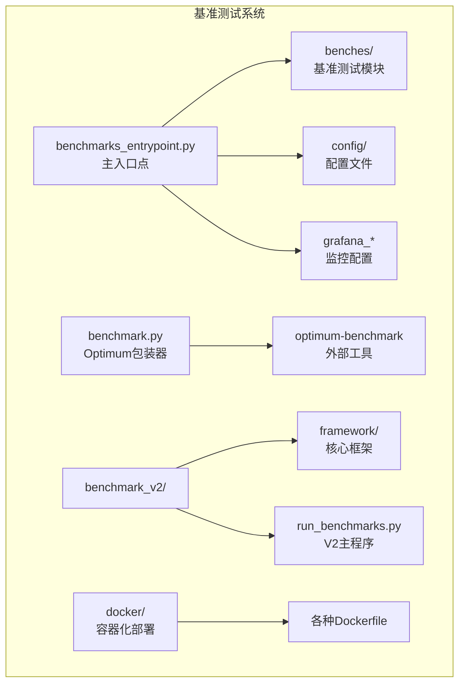
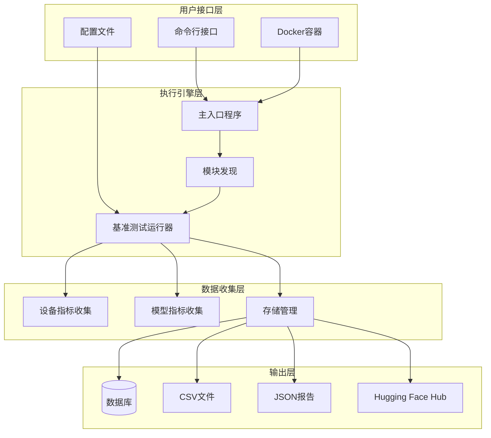
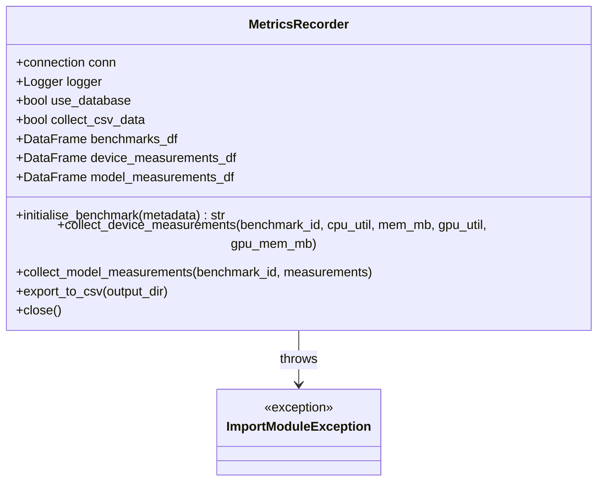
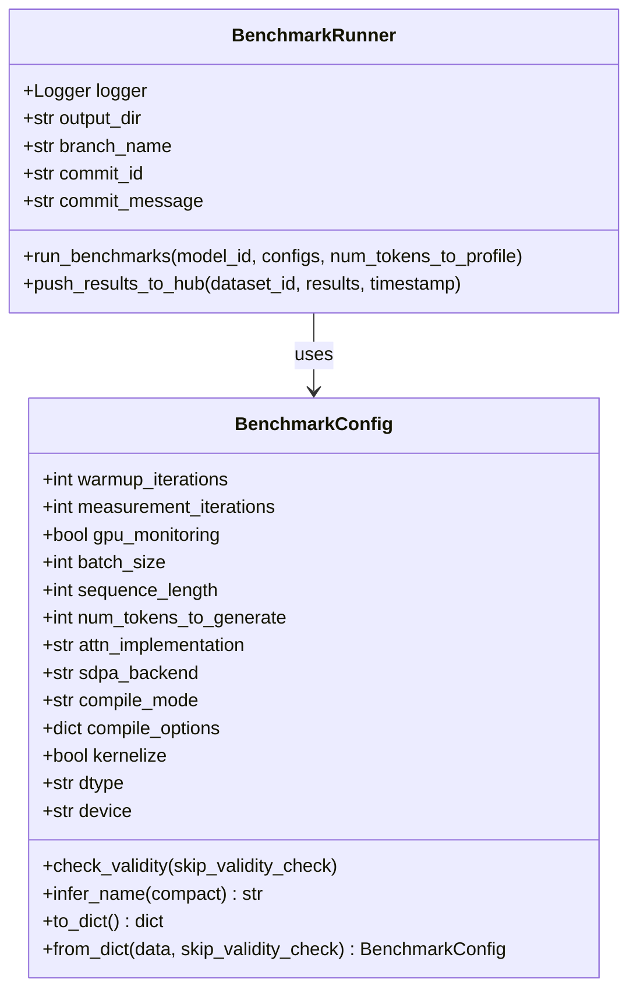

# 基准测试使用指南

<cite>
**本文档中引用的文件**
- [benchmarks_entrypoint.py](file://benchmark/benchmarks_entrypoint.py)
- [default.yml](file://benchmark/default.yml)
- [benchmark.py](file://benchmark/benchmark.py)
- [README.md](file://benchmark/README.md)
- [optimum_benchmark_wrapper.py](file://benchmark/optimum_benchmark_wrapper.py)
- [generation.yaml](file://benchmark/config/generation.yaml)
- [llama.py](file://benchmark/benches/llama.py)
- [requirements.txt](file://benchmark/requirements.txt)
- [run_benchmarks.py](file://benchmark_v2/run_benchmarks.py)
- [benchmark_config.py](file://benchmark_v2/framework/benchmark_config.py)
- [README.md](file://benchmark_v2/README.md)
- [README.md](file://docker/README.md)
</cite>

## 目录
1. [简介](#简介)
2. [项目结构](#项目结构)
3. [核心组件](#核心组件)
4. [架构概览](#架构概览)
5. [详细组件分析](#详细组件分析)
6. [命令行接口详解](#命令行接口详解)
7. [配置文件解析](#配置文件解析)
8. [环境部署指南](#环境部署指南)
9. [使用场景示例](#使用场景示例)
10. [结果解读与分析](#结果解读与分析)
11. [故障排除指南](#故障排除指南)
12. [最佳实践](#最佳实践)
13. [总结](#总结)

## 简介

Transformers库提供了两个主要的基准测试框架：传统基准测试系统（benchmark）和新一代基准测试系统（benchmark_v2）。这些工具专门用于评估Transformer模型的性能，包括推理速度、内存使用、GPU利用率等关键指标。

### 主要特性

- **多维度性能测试**：支持Eager模式、编译模式和内核化优化的对比测试
- **自动化数据收集**：实时监控CPU/GPU使用率、内存消耗等硬件指标
- **灵活配置选项**：可自定义批处理大小、序列长度、生成令牌数量等参数
- **云端集成**：支持将结果上传到Hugging Face Hub进行版本跟踪
- **多种输出格式**：支持数据库存储、CSV导出和JSON报告

## 项目结构

基准测试系统采用模块化设计，主要分为以下几个部分：



**图表来源**
- [benchmarks_entrypoint.py](file://benchmark/benchmarks_entrypoint.py#L1-L50)
- [run_benchmarks.py](file://benchmark_v2/run_benchmarks.py#L1-L50)

**章节来源**
- [benchmarks_entrypoint.py](file://benchmark/benchmarks_entrypoint.py#L1-L100)
- [run_benchmarks.py](file://benchmark_v2/run_benchmarks.py#L1-L100)

## 核心组件

### 传统基准测试系统

#### MetricsRecorder类
负责收集和存储性能指标的核心类，支持数据库和CSV两种存储方式。

#### benchmarks_entrypoint.py
主入口程序，提供命令行接口和自动发现机制。

### 新一代基准测试系统

#### BenchmarkConfig类
配置管理类，定义了完整的基准测试参数集合。

#### BenchmarkRunner类
负责执行基准测试并管理结果输出。

**章节来源**
- [benchmarks_entrypoint.py](file://benchmark/benchmarks_entrypoint.py#L30-L150)
- [benchmark_config.py](file://benchmark_v2/framework/benchmark_config.py#L15-L100)

## 架构概览

基准测试系统采用分层架构设计，确保灵活性和可扩展性：



**图表来源**
- [benchmarks_entrypoint.py](file://benchmark/benchmarks_entrypoint.py#L450-L503)
- [run_benchmarks.py](file://benchmark_v2/run_benchmarks.py#L80-L143)

## 详细组件分析

### benchmarks_entrypoint.py 分析

#### 命令行参数解析

该程序接受四个必需参数：
- `repository`: 存储库名称
- `branch`: 分支名称  
- `commit_id`: 提交哈希值
- `commit_msg`: 提交消息（截断至70字符）

#### MetricsRecorder类功能



**图表来源**
- [benchmarks_entrypoint.py](file://benchmark/benchmarks_entrypoint.py#L30-L120)

#### 自动模块发现机制

系统会扫描`benches/`目录下的Python文件，寻找具有`run_benchmark`函数的模块。

**章节来源**
- [benchmarks_entrypoint.py](file://benchmark/benchmarks_entrypoint.py#L300-L503)

### 新一代基准测试系统分析

#### BenchmarkConfig配置类



**图表来源**
- [benchmark_config.py](file://benchmark_v2/framework/benchmark_config.py#L15-L100)
- [run_benchmarks.py](file://benchmark_v2/run_benchmarks.py#L80-L143)

**章节来源**
- [benchmark_config.py](file://benchmark_v2/framework/benchmark_config.py#L1-L150)
- [run_benchmarks.py](file://benchmark_v2/run_benchmarks.py#L1-L100)

## 命令行接口详解

### 传统基准测试系统命令行

#### 基本语法
```bash
python benchmark/benchmarks_entrypoint.py <repository> <branch> <commit_id> <commit_msg> [--csv] [--csv-output-dir <dir>]
```

#### 参数说明

| 参数 | 类型 | 必需 | 描述 |
|------|------|------|------|
| repository | string | 是 | 存储库名称 |
| branch | string | 是 | 分支名称 |
| commit_id | string | 是 | 提交哈希值 |
| commit_msg | string | 是 | 提交消息（截断至70字符） |
| --csv | flag | 否 | 启用CSV输出文件生成 |
| --csv-output-dir | string | 否 | CSV输出目录（默认：benchmark_results） |

#### 使用示例

```bash
# 基本运行
python benchmark/benchmarks_entrypoint.py huggingface/transformers main abc1234567890 "Fix memory leak in attention"

# 启用CSV输出
python benchmark/benchmarks_entrypoint.py huggingface/transformers main abc1234567890 "Add benchmark support" --csv

# 指定输出目录
python benchmark/benchmarks_entrypoint.py huggingface/transformers main abc1234567890 "Performance improvements" --csv --csv-output-dir ./results
```

### 新一代基准测试系统命令行

#### 基本语法
```bash
python benchmark_v2/run_benchmarks.py [options]
```

#### 参数详解

| 参数 | 类型 | 默认值 | 描述 |
|------|------|--------|------|
| --output-dir | string | None | 结果输出目录 |
| --log-level | string | INFO | 日志级别（DEBUG/INFO/WARNING/ERROR） |
| --model-id | string | None | 特定模型ID |
| --warmup | int | 3 | 预热迭代次数 |
| --iterations | int | 10 | 测量迭代次数 |
| --batch-size | int[] | None | 批处理大小列表 |
| --sequence-length | int[] | None | 序列长度列表 |
| --num-tokens-to-generate | int[] | None | 生成令牌数量列表 |
| --cross-generate | flag | False | 跨生成所有配置组合 |
| --num-tokens-to-profile | int | 0 | 用于分析的令牌数量 |
| --branch-name | string | None | Git分支名称 |
| --commit-id | string | None | Git提交ID |
| --commit-message | string | None | Git提交消息 |
| --no-gpu-monitoring | flag | False | 禁用GPU监控 |
| --push-result-to-dataset | string | None | 推送结果的数据集名称 |

#### 高级使用示例

```bash
# 运行所有基准测试
python benchmark_v2/run_benchmarks.py

# 自定义参数运行
python benchmark_v2/run_benchmarks.py \
    --batch-size 1 4 8 \
    --sequence-length 128 512 1024 \
    --num-tokens-to-generate 50 100 \
    --warmup 5 \
    --iterations 10

# 交叉生成所有配置组合
python benchmark_v2/run_benchmarks.py \
    --batch-size 1 4 \
    --sequence-length 128 512 \
    --cross-generate

# 上传结果到Hugging Face Hub
python benchmark_v2/run_benchmarks.py \
    --push-result-to-dataset username/benchmark-results \
    --run-id experiment_v1
```

**章节来源**
- [benchmarks_entrypoint.py](file://benchmark/benchmarks_entrypoint.py#L350-L400)
- [run_benchmarks.py](file://benchmark_v2/run_benchmarks.py#L20-L80)

## 配置文件解析

### generation.yaml 配置文件

这是新基准测试系统的主要配置文件，定义了推理场景的基本参数：

#### 关键配置项

| 配置项 | 类型 | 默认值 | 描述 |
|--------|------|--------|------|
| backend.device | string | cuda | 设备类型（cuda/cpu） |
| backend.device_ids | list | [0] | GPU设备ID列表 |
| backend.model | string | meta-llama/Llama-2-7b-hf | 模型ID |
| backend.cache_implementation | string | static | 缓存实现方式 |
| backend.torch_compile | boolean | true | 是否启用torch.compile |
| backend.dtype | string | float16 | 数据类型 |
| scenario.input_shapes.batch_size | int | 1 | 批处理大小 |
| scenario.input_shapes.sequence_length | int | 7 | 序列长度 |
| scenario.generate_kwargs.max_new_tokens | int | 128 | 最大生成令牌数 |
| scenario.iterations | int | 2 | 迭代次数 |
| scenario.memory | boolean | true | 是否测量内存使用 |
| scenario.latency | boolean | true | 是否测量延迟 |

#### 配置示例

```yaml
defaults:
  - benchmark
  - scenario: inference
  - launcher: process
  - backend: pytorch

name: pytorch_generate

backend:
  device: cuda
  device_ids: [0]
  model: meta-llama/Llama-2-7b-hf
  cache_implementation: static
  torch_compile: true
  dtype: float16

scenario:
  input_shapes:
    batch_size: 1
    sequence_length: 7
  generate_kwargs:
    max_new_tokens: 128
    min_new_tokens: 128
    do_sample: false
  memory: true
  latency: true
  iterations: 2
```

### default.yml Grafana配置

用于配置Grafana仪表板的默认设置：

```yaml
apiVersion: 1

providers:
  - name: 'Transformers Benchmarks'
    orgId: 1
    type: file
    updateIntervalSeconds: 10
    allowUiUpdates: true
    options:
      path: /etc/grafana/dashboards
```

**章节来源**
- [generation.yaml](file://benchmark/config/generation.yaml#L1-L57)
- [default.yml](file://benchmark/default.yml#L1-L11)

## 环境部署指南

### 本地环境准备

#### 系统要求
- Python 3.8+
- CUDA 11.0+（GPU版本）
- 至少8GB RAM
- 20GB可用磁盘空间

#### 安装依赖

```bash
# 克隆仓库
git clone https://github.com/huggingface/transformers.git
cd transformers

# 创建虚拟环境
python -m venv transformers-benchmarks
source transformers-benchmarks/bin/activate

# 安装依赖
pip install -r benchmark/requirements.txt
pip install optimum-benchmark
pip install torch torchvision torchaudio --index-url https://download.pytorch.org/whl/cu118
```

#### 环境变量配置

```bash
# 设置Hugging Face令牌（如果需要访问私有模型）
export HF_TOKEN=your_hf_token_here

# 设置CUDA设备
export CUDA_VISIBLE_DEVICES=0

# 设置日志级别
export LOG_LEVEL=INFO
```

### Docker环境部署

#### 使用官方Docker镜像

```bash
# 拉取GPU支持的Docker镜像
docker pull huggingface/transformers-pytorch-gpu:latest

# 运行基准测试容器
docker run --gpus all -it --rm \
    -v $(pwd)/benchmark:/workspace/benchmark \
    -v $(pwd)/results:/workspace/results \
    huggingface/transformers-pytorch-gpu:latest \
    bash -c "cd /workspace && python benchmark/benchmarks_entrypoint.py huggingface/transformers main abc1234567890 'Test benchmark'"
```

#### 自定义Dockerfile

```dockerfile
FROM huggingface/transformers-pytorch-gpu:latest

WORKDIR /workspace

# 复制基准测试文件
COPY benchmark/ .

# 安装额外依赖
RUN pip install -r requirements.txt

# 设置环境变量
ENV CUDA_VISIBLE_DEVICES=0
ENV LOG_LEVEL=INFO

# 运行基准测试
CMD ["python", "benchmarks_entrypoint.py", "huggingface/transformers", "main", "abc1234567890", "Initial benchmark setup"]
```

#### Docker Compose配置

```yaml
version: '3.8'

services:
  transformers-benchmark:
    build:
      context: .
      dockerfile: Dockerfile
    runtime: nvidia
    volumes:
      - ./benchmark:/workspace/benchmark
      - ./results:/workspace/results
    environment:
      - CUDA_VISIBLE_DEVICES=0
      - LOG_LEVEL=INFO
    deploy:
      resources:
        reservations:
          devices:
            - driver: nvidia
              count: 1
              capabilities: [gpu]
```

### 云平台部署

#### AWS EC2实例配置

```bash
# 在EC2实例上安装必要的软件
sudo apt-get update
sudo apt-get install -y nvidia-cuda-toolkit

# 配置Docker和NVIDIA Container Runtime
curl -fsSL https://get.docker.com -o get-docker.sh
sudo sh get-docker.sh
sudo systemctl restart docker

# 运行基准测试
docker run --gpus all -it --rm \
    -v $(pwd)/benchmark:/workspace/benchmark \
    -v $(pwd)/results:/workspace/results \
    huggingface/transformers-pytorch-gpu:latest \
    python benchmark/benchmarks_entrypoint.py huggingface/transformers main abc1234567890 'AWS benchmark'
```

#### Google Cloud Platform配置

```bash
# 创建GPU实例
gcloud compute instances create benchmark-instance \
    --zone=us-central1-a \
    --machine-type=n1-standard-8 \
    --accelerator=type=nvidia-tesla-v100,count=1 \
    --image-family=pytorch-latest-gpu \
    --image-project=deeplearning-platform-release \
    --boot-disk-size=100GB

# SSH进入实例并运行基准测试
gcloud compute ssh benchmark-instance --command "
    cd /home/$USER/transformers
    python benchmark/benchmarks_entrypoint.py huggingface/transformers main abc1234567890 'GCP benchmark'
"
```

**章节来源**
- [requirements.txt](file://benchmark/requirements.txt#L1-L6)
- [README.md](file://docker/README.md#L1-L10)

## 使用场景示例

### LLM推理性能测试

#### 基本LLM推理测试

```python
# 示例：测试LLaMA模型的推理性能
from transformers import AutoModelForCausalLM, AutoTokenizer
import torch
from time import perf_counter

# 加载模型和分词器
model_id = "meta-llama/Llama-2-7b-hf"
tokenizer = AutoTokenizer.from_pretrained(model_id)
model = AutoModelForCausalLM.from_pretrained(model_id, torch_dtype=torch.float16)
model = model.eval().to("cuda")

# 准备输入
prompt = "人工智能的未来发展趋势是什么？"
inputs = tokenizer(prompt, return_tensors="pt").to("cuda")

# 性能测试
with torch.no_grad():
    # 预热
    for _ in range(3):
        _ = model.generate(**inputs, max_new_tokens=50)
    
    # 实际测量
    start_time = perf_counter()
    outputs = model.generate(**inputs, max_new_tokens=50)
    end_time = perf_counter()
    
    print(f"生成50个令牌耗时: {end_time - start_time:.3f}秒")
    print(f"平均每个令牌耗时: {(end_time - start_time) / 50:.3f}秒")
```

#### 多配置对比测试

```bash
# 不同批处理大小的性能对比
python benchmark_v2/run_benchmarks.py \
    --batch-size 1 2 4 8 \
    --sequence-length 512 \
    --num-tokens-to-generate 100 \
    --output-dir ./llama_benchmark_results

# 不同序列长度的性能测试
python benchmark_v2/run_benchmarks.py \
    --batch-size 1 \
    --sequence-length 128 256 512 1024 \
    --num-tokens-to-generate 50 \
    --output-dir ./sequence_length_benchmark

# 注意力机制对比测试
python benchmark_v2/run_benchmarks.py \
    --batch-size 1 \
    --sequence-length 512 \
    --num-tokens-to-generate 100 \
    --cross-generate
```

### 生成任务延迟测量

#### 时间到第一个令牌(TTFT)测试

```python
# 测试时间到第一个令牌的延迟
import torch
from transformers import AutoModelForCausalLM, AutoTokenizer
from time import perf_counter

model_id = "meta-llama/Llama-2-7b-hf"
tokenizer = AutoTokenizer.from_pretrained(model_id)
model = AutoModelForCausalLM.from_pretrained(model_id, torch_dtype=torch.float16).to("cuda")

prompt = "解释量子计算的基本原理"
inputs = tokenizer(prompt, return_tensors="pt").to("cuda")

# 测试TTFT
with torch.no_grad():
    start_time = perf_counter()
    outputs = model.generate(**inputs, max_new_tokens=1)
    ttft = perf_counter() - start_time
    
    print(f"时间到第一个令牌(TTFT): {ttft:.3f}秒")
```

#### 平均令牌生成时间测试

```python
# 测试平均每个令牌的生成时间
import torch
from transformers import AutoModelForCausalLM, AutoTokenizer
from time import perf_counter

model_id = "meta-llama/Llama-2-7b-hf"
tokenizer = AutoTokenizer.from_pretrained(model_id)
model = AutoModelForCausalLM.from_pretrained(model_id, torch_dtype=torch.float16).to("cuda")

prompt = "编写一个Python函数来计算斐波那契数列"
inputs = tokenizer(prompt, return_tensors="pt").to("cuda")

# 测试多个令牌的生成时间
with torch.no_grad():
    # 预热
    _ = model.generate(**inputs, max_new_tokens=10)
    
    # 实际测量
    start_time = perf_counter()
    outputs = model.generate(**inputs, max_new_tokens=100)
    end_time = perf_counter()
    
    avg_token_time = (end_time - start_time) / 100
    throughput = 100 / (end_time - start_time)
    
    print(f"平均每个令牌耗时: {avg_token_time:.3f}秒")
    print(f"吞吐量: {throughput:.2f} tokens/秒")
```

### 内存使用优化测试

#### 动态批处理大小测试

```bash
# 测试不同批处理大小对内存的影响
python benchmark_v2/run_benchmarks.py \
    --batch-size 1 2 4 8 16 \
    --sequence-length 512 \
    --num-tokens-to-generate 50 \
    --gpu-monitoring \
    --output-dir ./memory_optimization
```

#### 模型量化效果测试

```bash
# 测试不同精度对性能的影响
python benchmark_v2/run_benchmarks.py \
    --batch-size 1 \
    --sequence-length 512 \
    --num-tokens-to-generate 100 \
    --compile-mode max-autotune \
    --output-dir ./quantization_comparison
```

**章节来源**
- [llama.py](file://benchmark/benches/llama.py#L80-L200)
- [generation.yaml](file://benchmark/config/generation.yaml#L20-L40)

## 结果解读与分析

### 输出文件结构

基准测试完成后，会在指定目录生成以下文件：

#### CSV格式输出
- `benchmarks_{timestamp}.csv`: 基准测试基本信息
- `device_measurements_{timestamp}.csv`: 设备指标数据
- `model_measurements_{timestamp}.csv`: 模型性能指标
- `benchmark_summary_{timestamp}.csv`: 综合性能摘要

#### JSON格式输出
- `benchmark_summary_{timestamp}.json`: 详细的JSON报告
- `model-name_benchmark_{timestamp}.json`: 单个模型的详细报告

### 关键性能指标解读

#### 延迟指标

| 指标 | 描述 | 正常范围 |
|------|------|----------|
| model_load_time | 模型加载时间 | < 30秒 |
| first_eager_forward_pass_time_secs | 首次前向传播时间 | < 1秒 |
| first_eager_generate_time_secs | 首次生成时间 | < 5秒 |
| time_to_first_token_secs | 时间到第一个令牌 | < 0.5秒 |
| time_to_next_token_mean_secs | 平均每个令牌生成时间 | < 0.1秒 |

#### 吞吐量指标

| 指标 | 描述 | 正常范围 |
|------|------|----------|
| per_token.throughput.value | 每个令牌的吞吐量(tokens/sec) | > 50 tokens/sec |
| decode.throughput.value | 解码吞吐量(tokens/sec) | > 50 tokens/sec |

#### 内存指标

| 指标 | 描述 | 正常范围 |
|------|------|----------|
| mem_megabytes | 内存使用量(MB) | < 80% GPU内存 |
| gpu_mem_megabytes | GPU内存使用量(MB) | < 90% GPU内存 |

### 性能分析示例

#### 基础性能分析

```python
import pandas as pd
import matplotlib.pyplot as plt

# 加载基准测试结果
summary_df = pd.read_csv('benchmark_summary_20241201_143022.csv')

# 分析不同配置的性能
config_performance = summary_df.groupby('config')[[
    'time_to_first_token_secs',
    'time_to_next_token_mean_secs',
    'model_load_time'
]].mean()

print("配置性能对比:")
print(config_performance)

# 可视化性能差异
plt.figure(figsize=(12, 6))
config_performance.plot(kind='bar')
plt.title('不同配置性能对比')
plt.ylabel('时间(秒)')
plt.xticks(rotation=45)
plt.tight_layout()
plt.savefig('performance_comparison.png')
```

#### 内存使用分析

```python
# 分析内存使用情况
memory_analysis = summary_df.groupby('batch_size')[[
    'mem_megabytes_mean',
    'gpu_mem_megabytes_mean'
]].mean()

print("内存使用分析:")
print(memory_analysis)

# 内存效率计算
summary_df['memory_efficiency'] = summary_df['gpu_mem_megabytes_mean'] / summary_df['batch_size']
print("\n内存效率(每批次MB):")
print(summary_df[['batch_size', 'memory_efficiency']].groupby('batch_size').mean())
```

**章节来源**
- [benchmarks_entrypoint.py](file://benchmark/benchmarks_entrypoint.py#L200-L300)

## 故障排除指南

### 常见问题及解决方案

#### 环境依赖问题

**问题**: `ImportError: No module named 'transformers'`
```bash
# 解决方案：重新安装依赖
pip uninstall transformers
pip install -e .
```

**问题**: `CUDA out of memory`
```bash
# 解决方案：减少批处理大小或序列长度
python benchmark_v2/run_benchmarks.py \
    --batch-size 1 \
    --sequence-length 256 \
    --num-tokens-to-generate 50
```

#### 配置错误

**问题**: `TypeError: run_benchmark() missing 1 required positional argument`
```python
# 检查基准测试模块的函数签名
# 新版本需要metrics_recorder参数
def run_benchmark(logger, repository, branch, commit_id, commit_msg, metrics_recorder=None):
    # 实现代码...
```

**问题**: `ValueError: At least one of the arguments is required`
```bash
# 确保至少提供一个配置参数
python benchmark_v2/run_benchmarks.py \
    --batch-size 1 \
    --sequence-length 512 \
    --num-tokens-to-generate 100
```

#### 资源不足

**问题**: `RuntimeError: Failed to allocate memory`
```bash
# 解决方案：检查GPU内存使用情况
nvidia-smi

# 或者使用CPU模式
python benchmark/benchmarks_entrypoint.py \
    huggingface/transformers main abc1234567890 "CPU benchmark" \
    --csv --csv-output-dir ./results_cpu
```

**问题**: `psycopg2 OperationalError: could not connect to server`
```bash
# 解决方案：禁用数据库连接
python benchmark/benchmarks_entrypoint.py \
    huggingface/transformers main abc1234567890 "CSV only benchmark" \
    --csv --csv-output-dir ./results_csv
```

### 调试技巧

#### 启用详细日志

```bash
# 设置详细日志级别
export LOG_LEVEL=DEBUG
python benchmark/benchmarks_entrypoint.py huggingface/transformers main abc1234567890 "Debug benchmark"

# 或者使用新系统
python benchmark_v2/run_benchmarks.py --log-level DEBUG
```

#### 性能分析

```bash
# 使用内置的性能分析工具
python benchmark_v2/run_benchmarks.py \
    --batch-size 1 \
    --sequence-length 512 \
    --num-tokens-to-generate 100 \
    --num-tokens-to-profile 50
```

#### 内存泄漏检测

```bash
# 监控内存使用情况
python benchmark_v2/run_benchmarks.py \
    --batch-size 1 \
    --sequence-length 512 \
    --num-tokens-to-generate 100 \
    --gpu-monitoring
```

**章节来源**
- [benchmarks_entrypoint.py](file://benchmark/benchmarks_entrypoint.py#L400-L503)
- [run_benchmarks.py](file://benchmark_v2/run_benchmarks.py#L100-L143)

## 最佳实践

### 基准测试规划

#### 1. 明确测试目标
- **性能基准**: 建立基线性能指标
- **优化验证**: 验证特定优化的效果
- **回归检测**: 检测性能回归
- **容量规划**: 评估系统承载能力

#### 2. 选择合适的配置
```bash
# 生产环境模拟
python benchmark_v2/run_benchmarks.py \
    --batch-size 1 4 8 16 \
    --sequence-length 512 1024 2048 \
    --num-tokens-to-generate 50 100 200 \
    --cross-generate

# 性能优化测试
python benchmark_v2/run_benchmarks.py \
    --batch-size 1 \
    --sequence-length 512 \
    --num-tokens-to-generate 100 \
    --compile-mode max-autotune \
    --kernelize
```

#### 3. 环境一致性
- 使用相同的硬件配置
- 控制软件版本（PyTorch、CUDA等）
- 清理系统缓存
- 关闭不必要的后台进程

### 结果分析策略

#### 1. 基线建立
```bash
# 建立性能基线
python benchmark_v2/run_benchmarks.py \
    --batch-size 1 \
    --sequence-length 512 \
    --num-tokens-to-generate 100 \
    --output-dir ./baseline
```

#### 2. 对比分析
```bash
# 与基线对比
python benchmark_v2/run_benchmarks.py \
    --batch-size 1 \
    --sequence-length 512 \
    --num-tokens-to-generate 100 \
    --output-dir ./optimized
```

#### 3. 趋势分析
```bash
# 定期运行基准测试
while true; do
    python benchmark_v2/run_benchmarks.py \
        --batch-size 1 \
        --sequence-length 512 \
        --num-tokens-to-generate 100 \
        --push-result-to-dataset username/benchmark-history
    sleep 86400  # 每天运行一次
done
```

### 自动化集成

#### 1. CI/CD集成
```yaml
# .github/workflows/benchmark.yml
name: Performance Benchmark
on: [push, pull_request]

jobs:
  benchmark:
    runs-on: ubuntu-latest
    steps:
      - uses: actions/checkout@v2
      - name: Setup Python
        uses: actions/setup-python@v2
        with:
          python-version: '3.9'
      - name: Install dependencies
        run: |
          pip install -r benchmark/requirements.txt
          pip install optimum-benchmark
      - name: Run benchmarks
        run: |
          python benchmark_v2/run_benchmarks.py \
            --batch-size 1 4 \
            --sequence-length 512 \
            --num-tokens-to-generate 100 \
            --push-result-to-dataset ${{ secrets.HF_USERNAME }}/transformers-benchmarks
```

#### 2. 定期监控
```bash
#!/bin/bash
# daily_benchmark.sh

# 设置环境
export CUDA_VISIBLE_DEVICES=0
export LOG_LEVEL=INFO

# 运行基准测试
python benchmark_v2/run_benchmarks.py \
    --batch-size 1 4 8 \
    --sequence-length 512 1024 \
    --num-tokens-to-generate 100 \
    --output-dir ./daily_results/$(date +%Y%m%d)

# 发送通知
if [ $? -eq 0 ]; then
    echo "基准测试完成" | mail -s "Benchmark Success" admin@example.com
else
    echo "基准测试失败" | mail -s "Benchmark Failed" admin@example.com
fi
```

### 文档化最佳实践

#### 1. 测试记录模板
```
# 基准测试记录

## 测试信息
- 测试日期: 2024-12-01
- 测试人员: 张三
- 硬件配置: NVIDIA A100, 80GB RAM
- 软件版本: PyTorch 2.4.0, CUDA 11.8

## 测试配置
- 模型: meta-llama/Llama-2-7b-hf
- 批处理大小: 1, 4, 8
- 序列长度: 512, 1024
- 生成令牌: 100

## 性能指标
- TTFT (s): 0.15, 0.18, 0.22
- Token/s: 85, 82, 78
- GPU内存 (MB): 24500, 32000, 41000

## 结论
- 批处理大小4时性能最佳
- 序列长度1024时内存使用最高
```

#### 2. 性能回归检测脚本
```python
#!/usr/bin/env python3
import pandas as pd
import numpy as np
from scipy import stats

def detect_performance_regression(baseline_file, current_file, threshold=0.1):
    """检测性能回归"""
    baseline = pd.read_csv(baseline_file)
    current = pd.read_csv(current_file)
    
    # 比较关键指标
    metrics = ['time_to_first_token_secs', 'time_to_next_token_mean_secs']
    
    for metric in metrics:
        baseline_mean = baseline[metric].mean()
        current_mean = current[metric].mean()
        improvement = (baseline_mean - current_mean) / baseline_mean
        
        print(f"{metric}:")
        print(f"  基线: {baseline_mean:.3f}s")
        print(f"  当前: {current_mean:.3f}s")
        print(f"  改进: {improvement:.2%}")
        
        if improvement > threshold:
            print(f"  ✓ 性能提升超过阈值 ({threshold:.0%})")
        elif improvement < -threshold:
            print(f"  ✗ 性能下降超过阈值 ({threshold:.0%})")
        else:
            print(f"  ≈ 性能变化在可接受范围内")
    
    return abs(improvement) <= threshold

# 使用示例
detect_performance_regression('baseline.csv', 'current.csv')
```

## 总结

Transformers库的基准测试系统提供了强大而灵活的性能评估工具，支持从简单的单模型测试到复杂的多维度性能分析。通过合理配置和使用这些工具，开发者可以：

### 主要优势
- **全面的性能覆盖**: 涵盖延迟、吞吐量、内存使用等多个维度
- **灵活的配置选项**: 支持多种硬件配置和优化策略
- **自动化程度高**: 支持CI/CD集成和定期监控
- **结果可视化**: 提供丰富的输出格式便于分析

### 使用建议
1. **从简单开始**: 先运行基本配置，理解系统行为
2. **逐步复杂化**: 逐渐增加配置复杂度，找到最优设置
3. **持续监控**: 建立定期基准测试流程
4. **文档化**: 记录测试过程和结果，便于后续参考

### 未来发展
随着Transformer模型的不断发展，基准测试系统也在持续演进：
- 更多的注意力机制支持
- 更好的GPU监控能力
- 更智能的配置推荐
- 更完善的云端集成

通过掌握这些基准测试工具，开发者可以更好地理解和优化Transformer模型的性能，为生产环境的部署提供可靠的数据支撑。